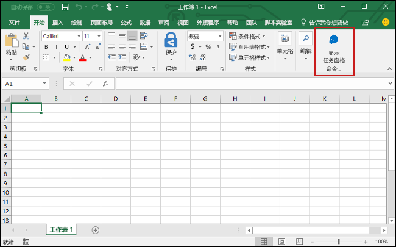

# <a name="build-an-excel-add-in-using-angular"></a>?? Angular ?? Excel ???

??????????? Angular ? Excel JavaScript API ?? Excel ???????

## <a name="prerequisites"></a>????

- ?????? [Angular CLI ????](https://github.com/angular/angular-cli#prerequisites)??????????????

- ???? [Angular CLI](https://github.com/angular/angular-cli)? 

    ```bash
    npm install -g @angular/cli
    ```

- ??????? [Yeoman](https://github.com/yeoman/yo) ? [Office ???? Yeoman ???](https://github.com/OfficeDev/generator-office)?

    ```bash
    npm install -g yo generator-office
    ```

## <a name="generate-a-new-angular-app"></a>???? Angular ??

?? Angular CLI ?? Angular ??? ??????????

```bash
ng new my-addin
```

## <a name="generate-the-manifest-file"></a>??????

???????????????????

1. ??????????

    ```bash
    cd my-addin
    ```

2. ?? Yeoman ????????????? ?????????????????????

    ```bash
    yo office
    ```
    - **??????????????** `No`
    - **??????????????:** `My Office Add-in`
    - **?????? Office ????????:** `Excel`
    - **??????????** `No`

    ???????????????resource.html?****???????????????????????????????????????????????????????????

    
    
    > [!NOTE]
    > ???????? **package.json**???????****??????

## <a name="secure-the-app"></a>??????

[!include[HTTPS guidance](../includes/https-guidance.md)]

????????????**??? Office ????? Yeoman ???**?????? ????????????????????**????**??????????????????????????????? ???????????????

1. ???????????????????? **npm** ??????

    ```bash 
    npm list -g 
    ``` 
    
    > [!TIP]    
    > ????????????????????? **npm** ??????          
    
2. ??????????? `{global libraries folder}/node_modules/generator-office/generators/app/templates/js/base` ???? ????? `certs` ??????????

3. ?????????? 1 ???? Angular ???????????? `certs` ????????????????

## <a name="update-the-app"></a>??????

1. ????????????????? **package.json**? ? `start` ????????????? SSL ??? 3000 ?????????

    ```json
    "start": "ng serve --ssl true --port 3000"
    ```

2. ????????? **.angular-cli.json**? ? **defaults** ????????????????????

    ```json
    "defaults": {
      "styleExt": "css",
      "component": {},
      "serve": {
        "sslKey": "certs/server.key",
        "sslCert": "certs/server.crt"
      }
    }
    ```

3. ?? **src/index.html**??? `</head>` ???????? `<script>` ??????????

    ```html
    <script src="https://appsforoffice.microsoft.com/lib/1/hosted/office.js"></script>
    ```

4. ???src/main.ts?****?? `platformBrowserDynamic().bootstrapModule(AppModule).catch(err => console.log(err));` ??????????????? 

    ```typescript 
    declare const Office: any;

    Office.initialize = () => {
    platformBrowserDynamic().bootstrapModule(AppModule)
        .catch(err => console.log(err));
    };
    ```

5. ???src/polyfills.ts?****???????? `import` ???????????????????

    ```typescript
    import 'core-js/client/shim';
    ```

6. ??src/polyfills.ts?****???????????????????

    ```typescript
    import 'core-js/es6/symbol';
    import 'core-js/es6/object';
    import 'core-js/es6/function';
    import 'core-js/es6/parse-int';
    import 'core-js/es6/parse-float';
    import 'core-js/es6/number';
    import 'core-js/es6/math';
    import 'core-js/es6/string';
    import 'core-js/es6/date';
    import 'core-js/es6/array';
    import 'core-js/es6/regexp';
    import 'core-js/es6/map';
    import 'core-js/es6/weak-map';
    import 'core-js/es6/set';
    ```

7. ???src/app/app.component.html?****??????????? HTML???????? 

    ```html
    <div id="content-header">
        <div class="padding">
            <h1>Welcome</h1>
        </div>
    </div>
    <div id="content-main">
        <div class="padding">
            <p>Choose the button below to set the color of the selected range to green.</p>
            <br />
            <h3>Try it out</h3>
            <button (click)="onSetColor()">Set color</button>
        </div>
    </div>
    ```

8. ???src/app/app.component.css?****??????????? CSS ??????????

    ```css
    #content-header {
        background: #2a8dd4;
        color: #fff;
        position: absolute;
        top: 0;
        left: 0;
        width: 100%;
        height: 80px; 
        overflow: hidden;
    }

    #content-main {
        background: #fff;
        position: fixed;
        top: 80px;
        left: 0;
        right: 0;
        bottom: 0;
        overflow: auto; 
    }

    .padding {
        padding: 15px;
    }
    ```

9. ?? **src/app/app.component.ts**????????????????????? 

    ```typescript
    import { Component } from '@angular/core';

    declare const Excel: any;

    @Component({
    selector: 'app-root',
    templateUrl: './app.component.html',
    styleUrls: ['./app.component.css']
    })
    export class AppComponent {
    onSetColor() {
        Excel.run(async (context) => {
        const range = context.workbook.getSelectedRange();
        range.format.fill.color = 'green';
        await context.sync();
        });
    }
    }
    ```

## <a name="start-the-dev-server"></a>?????????

1. ???????????????????????

    ```bash
    npm run start
    ```

2. ? Web ??????? `https://localhost:3000`???????????????????????????????????????????[????????????????](https://github.com/OfficeDev/generator-office/blob/master/src/docs/ssl.md)?

    > [!NOTE]
    > Chrome?Web ?????????????????????????[????????????????](https://github.com/OfficeDev/generator-office/blob/master/src/docs/ssl.md)???????????? ???? Chrome ????????? Internet Explorer ? Microsoft Edge ?? `https://localhost:3000`???????????? 

3. ????????????????????????????????????? 

## <a name="try-it-out"></a>??

1. ?????????? Excel ????????????????????

    - Windows?[? Windows ???? Office ???](../testing/create-a-network-shared-folder-catalog-for-task-pane-and-content-add-ins.md)
    - Excel Online?[? Office Online ???? Office ???](../testing/sideload-office-add-ins-for-testing.md#sideload-an-office-add-in-on-office-online)
    - iPad ? Mac?[? iPad ? Mac ???? Office ???](../testing/sideload-an-office-add-in-on-ipad-and-mac.md)

   
2. ? Excel ??????????****?????????????????****??????????????

    

3. ????????????????

4. ???????????????****?????????????????

    

## <a name="next-steps"></a>????

?????? Angular ???? Excel ????????????? Excel ????????? Excel ????????????????????

> [!div class="nextstepaction"]
> [Excel ?????](../tutorials/excel-tutorial.yml)

## <a name="see-also"></a>????

* [Excel ?????](../tutorials/excel-tutorial-create-table.md)
* [Excel JavaScript API ????](../excel/excel-add-ins-core-concepts.md)
* [Excel ???????](http://dev.office.com/code-samples#?filters=excel,office%20add-ins)
* [Excel JavaScript API ??](https://dev.office.com/reference/add-ins/excel/excel-add-ins-reference-overview)
