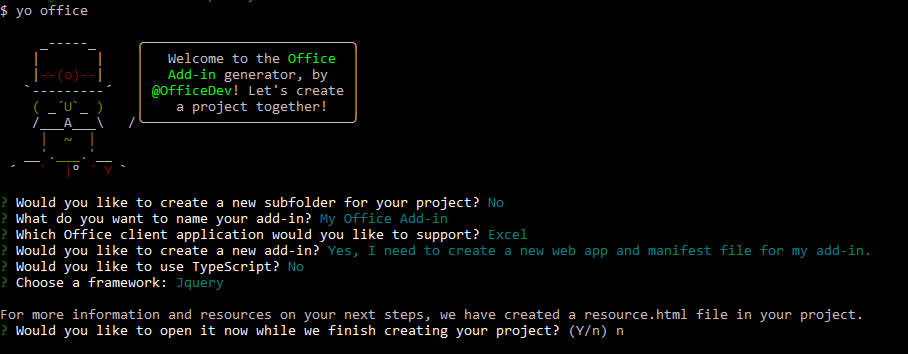

# <a name="build-an-excel-add-in-using-jquery"></a>使用 jQuery 生成 Excel 加载项

本文将逐步介绍如何使用 jQuery 和 Excel JavaScript API 生成 Excel 加载项。 

## <a name="create-the-add-in"></a>创建加载项 

[!include[Choose your editor](../includes/quickstart-choose-editor.md)]

# <a name="visual-studiotabvisual-studio"></a>[Visual Studio](#tab/visual-studio)

### <a name="prerequisites"></a>先决条件

[!include[Quickstart prerequisites](../includes/quickstart-vs-prerequisites.md)]

### <a name="create-the-add-in-project"></a>创建加载项项目

1. 在 Visual Studio 菜单栏中，依次选择“文件” > “新建” > “项目”。
    
2. 在“Visual C#”或“Visual Basic”下的项目类型列表中，展开“Office/SharePoint”，选择“加载项”，再选择“Excel Web 加载项”作为项目类型。 

3. 命名此项目，再选择“确定”。

4. 在“创建 Office 加载项”对话框窗口中，选择“将新功能添加到 Excel”，再选择“完成”以创建项目。

5. 此时，Visual Studio 创建解决方案，且它的两个项目显示在“解决方案资源管理器”中。**Home.html** 文件在 Visual Studio 中打开。
    
### <a name="explore-the-visual-studio-solution"></a>探索 Visual Studio 解决方案

[!include[Description of Visual Studio projects](../includes/quickstart-vs-solution.md)]

### <a name="update-the-code"></a>更新代码

1. **Home.html** 指定在加载项的任务窗格中呈现的 HTML。 在 **Home.html** 中，将 `<body>` 元素替换为以下标记，并保存文件。
 
    ```html
    <body class="ms-font-m ms-welcome">
        <div id="content-header">
            <div class="padding">
                <h1>Welcome</h1>
            </div>
        </div>
        <div id="content-main">
            <div class="padding">
                <p>Choose the button below to set the color of the selected range to green.</p>
                <br />
                <h3>Try it out</h3>
                <button class="ms-Button" id="set-color">Set color</button>
            </div>
        </div>
    </body>
    ```

2. 打开 Web 应用项目根目录中的文件“Home.js”。 此文件指定加载项脚本。 将整个内容替换为以下代码，并保存文件。 

    ```js
    'use strict';

    (function () {
        Office.initialize = function (reason) {
            $(document).ready(function () {
                $('#set-color').click(setColor);
            });
        };

        function setColor() {
            Excel.run(function (context) {
                var range = context.workbook.getSelectedRange();
                range.format.fill.color = 'green';

                return context.sync();
            }).catch(function (error) {
                console.log("Error: " + error);
                if (error instanceof OfficeExtension.Error) {
                    console.log("Debug info: " + JSON.stringify(error.debugInfo));
                }
            });
        }
    })();
    ```

3. 打开 Web 应用项目根目录中的文件“Home.css”。 此文件指定加载项自定义样式。 将整个内容替换为以下代码，并保存文件。 

    ```css
    #content-header {
        background: #2a8dd4;
        color: #fff;
        position: absolute;
        top: 0;
        left: 0;
        width: 100%;
        height: 80px; 
        overflow: hidden;
    }

    #content-main {
        background: #fff;
        position: fixed;
        top: 80px;
        left: 0;
        right: 0;
        bottom: 0;
        overflow: auto; 
    }

    .padding {
        padding: 15px;
    }
    ```

### <a name="update-the-manifest"></a>更新清单

1. 打开加载项项目中的 XML 清单文件。 此文件定义的是加载项设置和功能。

2. `ProviderName` 元素具有占位符值。 将其替换为你的姓名。

3. `DisplayName` 元素的 `DefaultValue` 属性有占位符。 将它替换为“My Office Add-in”。

4. `Description` 元素的 `DefaultValue` 属性有占位符。 将它替换为“A task pane add-in for Excel”。

5. 保存文件。

    ```xml
    ...
    <ProviderName>John Doe</ProviderName>
    <DefaultLocale>en-US</DefaultLocale>
    <!-- The display name of your add-in. Used on the store and various places of the Office UI such as the add-ins dialog. -->
    <DisplayName DefaultValue="My Office Add-in" />
    <Description DefaultValue="A task pane add-in for Excel"/>
    ...
    ```

### <a name="try-it-out"></a>试用

1. 使用 Visual Studio 的同时，按 F5 或选择“开始”按钮启动 Excel，以测试新建的 Excel 加载项，功能区中显示有“显示任务窗格”加载项按钮。加载项本地托管在 IIS 上。

2. 在 Excel 中，依次选择“开始”选项卡和功能区中的“显示任务窗格”按钮，打开加载项任务窗格。

    

3. 选择工作表中的任何一系列单元格。

4. 在任务窗格中，选择“设置颜色”按钮，将选定区域的颜色设置为绿色。

    

# <a name="any-editortabvisual-studio-code"></a>[任意编辑器](#tab/visual-studio-code)

### <a name="prerequisites"></a>先决条件

- [Node.js](https://nodejs.org)

- 全局安装最新版 [Yeoman](https://github.com/yeoman/yo) 和 [Office 加载项的 Yeoman 生成器](https://github.com/OfficeDev/generator-office)。

    ```bash
    npm install -g yo generator-office
    ```

### <a name="create-the-web-app"></a>创建 Web 应用

1. 在本地驱动器上创建一个文件夹，并命名为“my-addin”。 将在其中创建应用程序文件。

2. 转到应用程序文件夹。

    ```bash
    cd my-addin
    ```

3. 使用 Yeoman 生成器生成加载项的清单文件。 运行下面的命令，再回答提示问题，如以下屏幕截图所示：

    ```bash
    yo office
    ```

    - **是否要为项目新建子文件夹?：**`No`
    - **要将你的外接程序命名为什么?:** `My Office Add-in`
    - **要支持哪一个 Office 客户端应用程序?:** `Excel`
    - **是否要新建外接程序?:** `Yes`
    - **是否要使用 TypeScript?:** `No`
    - **选择框架：**`Jquery`

    然后，生成器会询问是否要打开“resource.html”。在本教程中，无需打开此文件。不过，如果感兴趣，也可以自行打开。选择“是”或“否”完成向导，并允许生成器执行它的工作。

    


4. 在代码编辑器中，打开项目根目录中的 **index.html**。 此文件指定在加载项任务窗格中呈现的 HTML。 
 
5. 在 **index.html** 中，将生成的 `header` 标记替换为以下标记。
 
    ```html
    <div id="content-header">
        <div class="padding">
            <h1>Welcome</h1>
        </div>
    </div>
    ```

6. 在 **index.html** 中，将生成的 `main` 标记替换为以下标记，再保存文件。

    ```html
    <div id="content-main">
        <div class="padding">
            <p>Choose the button below to set the color of the selected range to green.</p>
            <br />
            <h3>Try it out</h3>
            <button class="ms-Button" id="set-color">Set color</button>
        </div>
    </div>
    ```

7. 打开文件“app.js”，以指定加载项脚本。 将整个内容替换为以下代码，并保存文件。

    ```js
    'use strict';
    
    (function () {
        Office.initialize = function (reason) {
            $(document).ready(function () {
                $('#set-color').click(setColor);
            });
        };

        function setColor() {
            Excel.run(function (context) {
                var range = context.workbook.getSelectedRange();
                range.format.fill.color = 'green';

                return context.sync();
            }).catch(function (error) {
                console.log("Error: " + error);
                if (error instanceof OfficeExtension.Error) {
                    console.log("Debug info: " + JSON.stringify(error.debugInfo));
                }
            });
        }
    })();
    ```

8. 打开文件“app.css”，以指定加载项自定义样式。 将整个内容替换为以下代码，并保存文件。

    ```css
    #content-header {
        background: #2a8dd4;
        color: #fff;
        position: absolute;
        top: 0;
        left: 0;
        width: 100%;
        height: 80px; 
        overflow: hidden;
    }

    #content-main {
        background: #fff;
        position: fixed;
        top: 80px;
        left: 0;
        right: 0;
        bottom: 0;
        overflow: auto; 
    }

    .padding {
        padding: 15px;
    }
    ```

### <a name="update-the-manifest"></a>更新清单

1. 打开文件“my-office-add-in-manifest.xml”，以定义加载项的设置和功能。 

2. `ProviderName` 元素具有占位符值。 将其替换为你的姓名。

3. `DisplayName` 元素的 `DefaultValue` 属性有占位符。 将它替换为“My Office Add-in”。

4. `Description` 元素的 `DefaultValue` 属性有占位符。 将它替换为“A task pane add-in for Excel”。

5. 保存文件。

    ```xml
    ...
    <ProviderName>John Doe</ProviderName>
    <DefaultLocale>en-US</DefaultLocale>
    <!-- The display name of your add-in. Used on the store and various places of the Office UI such as the add-ins dialog. -->
    <DisplayName DefaultValue="My Office Add-in" />
    <Description DefaultValue="A task pane add-in for Excel"/>
    ...
    ```

### <a name="start-the-dev-server"></a>启动开发人员服务器

[!include[Start server section](../includes/quickstart-yo-start-server.md)] 

### <a name="try-it-out"></a>试用

1. 请按照运行加载项所用平台对应的说明操作，以在 Excel 中旁加载加载项。

    - Windows：[在 Windows 上旁加载 Office 加载项](../testing/create-a-network-shared-folder-catalog-for-task-pane-and-content-add-ins.md)
    - Excel Online：[在 Office Online 中旁加载 Office 加载项](../testing/sideload-office-add-ins-for-testing.md#sideload-an-office-add-in-on-office-online)
    - iPad 和 Mac：[在 iPad 和 Mac 上旁加载 Office 加载项](../testing/sideload-an-office-add-in-on-ipad-and-mac.md)

2. 在 Excel 中，依次选择“主页”选项卡和功能区中的“显示任务窗格”按钮，以打开加载项任务窗格。

    

3. 选择工作表中的任何一系列单元格。

4. 在任务窗格中，选择“设置颜色”按钮，将选定区域的颜色设置为绿色。

    

---

## <a name="next-steps"></a>后续步骤

恭喜！已使用 jQuery 成功创建 Excel 加载项！接下来，请详细了解 Excel 加载项功能，并跟着 Excel 加载项教程一起操作，生成更复杂的加载项。

> [!div class="nextstepaction"]
> [Excel 加载项教程](../tutorials/excel-tutorial-create-table.md)

## <a name="see-also"></a>另请参阅

* [Excel 加载项教程](../tutorials/excel-tutorial-create-table.md)
* [Excel JavaScript API 核心概念](../excel/excel-add-ins-core-concepts.md)
* [Excel 加载项代码示例](http://dev.office.com/code-samples#?filters=excel,office%20add-ins)
* [Excel JavaScript API 参考](https://dev.office.com/reference/add-ins/excel/excel-add-ins-reference-overview)
