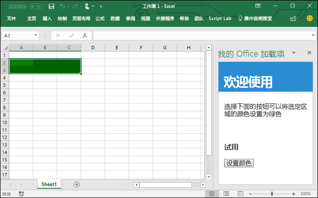

# <a name="build-an-excel-add-in-using-react"></a>使用 React 生成 Excel 加载项

在本文中，您将了解使用 React 和 Excel JavaScript API 生成 Excel 加载项的过程。

## <a name="environment"></a>环境

- **Office 桌面**：确保你安装了最新版本的 Office。 加载项命令需要内部版本 16.0.6769.0000 或更高版本（推荐 **16.0.6868.0000**）。 学习如何 [安装最新版本的 Office 应用程序](http://aka.ms/latestoffice)。 
 
- **Office Online**：没有额外的设置。 请注意，对工作/学校帐户的 Office Online 命令的支持处于预览状态。

## <a name="prerequisites"></a>先决条件

- [Node.js](https://nodejs.org)

- 全局安装最新版 [Yeoman](https://github.com/yeoman/yo) 和 [Office 加载项的 Yeoman 生成器](https://github.com/OfficeDev/generator-office)。
    ```bash
    npm install -g yo generator-office
    ```

### <a name="create-the-web-app"></a>创建 Web 应用

1. 在本地驱动器上创建一个文件夹，并命名为“my-addin”****。 将在其中创建应用程序文件。

2. 转到应用程序文件夹。

    ```bash
    cd my-addin
    ```

3. 使用 Yeoman 生成器生成加载项清单文件。 运行下面的命令，再回答提示问题，如以下屏幕截图所示。

    ```bash
    yo office
    ```

    - **选择一个项目类型：** `Office Add-in project using React framework`
    - **要将你的外接程序命名为什么?:** `My Office Add-in`
    - **要支持哪一个 Office 客户端应用?:** `Excel`

    
    
    完成向导后，生成器将创建项目并安装 Node 支持组件。

4.  打开 **src/components/App.tsx**，搜索注释“更新填充颜色”，然后将填充颜色从“黄色”更改为“蓝色”，然后保存文件。 

    ```js
    range.format.fill.color = 'blue'

    ```

5. 在** src / components / App.tsx **中的`render` 函数的`return` 块中，将 `<Herolist>` 更新到下面的代码中，然后保存文件。 

    ```js
      <HeroList message='Discover what My Office Add-in can do for you today!' items={this.state.listItems}>
        <p className='ms-font-l'>Choose the button below to set the color of the selected range to blue. <b>Set color</b>.</p>
        <Button className='ms-welcome__action' buttonType={ButtonType.hero} iconProps={{ iconName: 'ChevronRight' }} onClick={this.click}>Run</Button>
    </HeroList>
    ```

6. 按照[将自签名证书添加为受信任的根证书](https://github.com/OfficeDev/generator-office/blob/master/src/docs/ssl.md)中的步骤操作，信任开发计算机操作系统的证书。

7. 旁加载加载项以便在 Excel 中将显示。 在终端中，运行以下命令： 
    
    ```bash
    npm run sideload
    ```

## <a name="try-it-out"></a>试用

1. 通过终端运行下面的命令，以启动开发人员服务器。

    Windows：
    ```bash
    npm start
    ```

2. 在 Excel 中，依次选择“主页”**** 选项卡和功能区中的“显示任务窗格”**** 按钮，以打开加载项任务窗格。

    

3. 选择工作表中的任何一系列单元格。

4. 在任务窗格中，选择 **“设置颜色”** 按钮，将选定区域的颜色设置为l蓝色。

    

## <a name="next-steps"></a>后续步骤

恭喜！已使用 React 成功创建 Excel 加载项！接下来，请详细了解 Excel 加载项功能，并跟着 Excel 加载项教程一起操作，生成更复杂的加载项。

> [!div class="nextstepaction"]
> [Excel 加载项教程](../tutorials/excel-tutorial.yml)

## <a name="see-also"></a>另请参阅

* [Excel 加载项教程](../tutorials/excel-tutorial-create-table.md)
* [Excel JavaScript API 核心概念](../excel/excel-add-ins-core-concepts.md)
* [Excel 加载项代码示例](https://developer.microsoft.com/office/gallery/?filterBy=Samples,Excel)
* [Excel JavaScript API 参考](https://docs.microsoft.com/javascript/office/overview/excel-add-ins-reference-overview?view=office-js)
