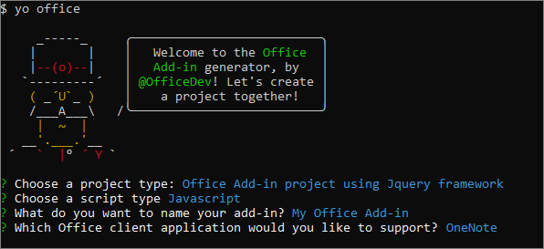
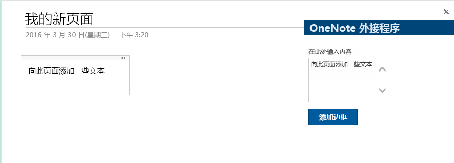

# <a name="build-your-first-onenote-add-in"></a><span data-ttu-id="0b7e5-101">生成首个 OneNote 加载项</span><span class="sxs-lookup"><span data-stu-id="0b7e5-101">Build your first OneNote add-in</span></span>

<span data-ttu-id="0b7e5-102">本文将逐步介绍如何使用 jQuery 和 Office JavaScript API 生成 OneNote 加载项。</span><span class="sxs-lookup"><span data-stu-id="0b7e5-102">In this article, you'll walk through the process of building a OneNote add-in by using jQuery and the Office JavaScript API.</span></span>

## <a name="prerequisites"></a><span data-ttu-id="0b7e5-103">先决条件</span><span class="sxs-lookup"><span data-stu-id="0b7e5-103">Prerequisites</span></span>

- [<span data-ttu-id="0b7e5-104">Node.js</span><span class="sxs-lookup"><span data-stu-id="0b7e5-104">Node.js</span></span>](https://nodejs.org)

- <span data-ttu-id="0b7e5-105">全局安装最新版 [Yeoman](https://github.com/yeoman/yo) 和 [Office 加载项的 Yeoman 生成器](https://github.com/OfficeDev/generator-office)。</span><span class="sxs-lookup"><span data-stu-id="0b7e5-105">Install the latest version of [Yeoman](https://github.com/yeoman/yo) and the [Yeoman generator for Office Add-ins](https://github.com/OfficeDev/generator-office) globally.</span></span>

    ```bash
    npm install -g yo generator-office
    ```

## <a name="create-the-add-in-project"></a><span data-ttu-id="0b7e5-106">创建加载项项目</span><span class="sxs-lookup"><span data-stu-id="0b7e5-106">Create the add-in project</span></span>

1. <span data-ttu-id="0b7e5-107">在本地驱动器上创建文件夹，并将它命名为“`my-onenote-addin`”。</span><span class="sxs-lookup"><span data-stu-id="0b7e5-107">Create a folder on your local drive and name it `my-onenote-addin`.</span></span> <span data-ttu-id="0b7e5-108">将在其中创建外接程序文件。</span><span class="sxs-lookup"><span data-stu-id="0b7e5-108">This is where you'll create the files for your add-in.</span></span>

2. <span data-ttu-id="0b7e5-109">转到新文件夹。</span><span class="sxs-lookup"><span data-stu-id="0b7e5-109">Navigate to your new folder.</span></span>

    ```bash
    cd my-onenote-addin
    ```

3. <span data-ttu-id="0b7e5-110">使用 Yeoman 生成器创建 OneNote 加载项项目。</span><span class="sxs-lookup"><span data-stu-id="0b7e5-110">Use the Yeoman generator to create a OneNote add-in project.</span></span> <span data-ttu-id="0b7e5-111">运行下面的命令，再回答如下所示的提示问题：</span><span class="sxs-lookup"><span data-stu-id="0b7e5-111">Run the following command and then answer the prompts as follows:</span></span>

    ```bash
    yo office
    ```

    - <span data-ttu-id="0b7e5-112">**选择一个项目类型：** `Office Add-in project using Jquery framework`</span><span class="sxs-lookup"><span data-stu-id="0b7e5-112">**Choose a project type:** `Office Add-in project using Jquery framework`</span></span>
    - <span data-ttu-id="0b7e5-113">**选择一个脚本类型：** `Javascript`</span><span class="sxs-lookup"><span data-stu-id="0b7e5-113">**Choose a script type:** `Javascript`</span></span>
    - <span data-ttu-id="0b7e5-114">**要如何命名加载项?:** `My Office Add-in`</span><span class="sxs-lookup"><span data-stu-id="0b7e5-114">**What do you want to name your add-in?:** `My Office Add-in`</span></span>
    - <span data-ttu-id="0b7e5-115">**要支持哪一个 Office 客户端应用?:** `Onenote`</span><span class="sxs-lookup"><span data-stu-id="0b7e5-115">**Which Office client application would you like to support?:** `Onenote`</span></span>

    
    
    <span data-ttu-id="0b7e5-117">完成向导后，生成器将创建项目并安装 Node 支持组件。</span><span class="sxs-lookup"><span data-stu-id="0b7e5-117">After you complete the wizard, the generator will create the project and install supporting Node components.</span></span>


## <a name="update-the-code"></a><span data-ttu-id="0b7e5-118">更新代码</span><span class="sxs-lookup"><span data-stu-id="0b7e5-118">Update the code</span></span>

1. <span data-ttu-id="0b7e5-119">在代码编辑器中，打开项目根目录中的“index.html”\*\*\*\*。</span><span class="sxs-lookup"><span data-stu-id="0b7e5-119">In your code editor, open **index.html** in the root of the project.</span></span> <span data-ttu-id="0b7e5-120">此文件包含在加载项任务窗格中呈现的 HTML。</span><span class="sxs-lookup"><span data-stu-id="0b7e5-120">This file contains the HTML that will be rendered in the add-in's task pane.</span></span>

2. <span data-ttu-id="0b7e5-121">将 `<body>` 元素内的 `<main>` 元素替换为以下标记，并保存文件。</span><span class="sxs-lookup"><span data-stu-id="0b7e5-121">Replace the `<main>` element inside the `<body>` element with the following markup and save the file.</span></span> <span data-ttu-id="0b7e5-122">这会使用 [Office UI Fabric 组件](https://developer.microsoft.com/en-us/fabric#/components)添加文本区域和按钮。</span><span class="sxs-lookup"><span data-stu-id="0b7e5-122">This adds a text area and a button using [Office UI Fabric components](https://developer.microsoft.com/en-us/fabric#/components).</span></span>

    ```html
    <main class="ms-welcome__main">
        <br />
        <p class="ms-font-l">Enter content below</p>
        <div class="ms-TextField ms-TextField--placeholder">
            <textarea id="textBox" rows="5"></textarea>
        </div>
        <button id="addOutline" class="ms-welcome__action ms-Button ms-Button--hero ms-u-slideUpIn20">
            <span class="ms-Button-label">Add Outline</span>
            <span class="ms-Button-icon"><i class="ms-Icon"></i></span>
            <span class="ms-Button-description">Adds the content above to the current page.</span>
        </button>
    </main>
    ```

3. <span data-ttu-id="0b7e5-123">打开文件 **src\index.js**，以指定加载项脚本。</span><span class="sxs-lookup"><span data-stu-id="0b7e5-123">Open the file **app.js** to specify the script for the add-in.</span></span> <span data-ttu-id="0b7e5-124">将整个内容替换为以下代码，并保存文件。</span><span class="sxs-lookup"><span data-stu-id="0b7e5-124">Replace the entire contents with the following code and save the file.</span></span>

    ```js
    'use strict';

    (function () {

        Office.initialize = function (reason) {
            $(document).ready(function () {
                // Set up event handler for the UI.
                $('#addOutline').click(addOutlineToPage);
            });
        };

        // Add the contents of the text area to the page.
        function addOutlineToPage() {        
            OneNote.run(function (context) {
                var html = '<p>' + $('#textBox').val() + '</p>';

                // Get the current page.
                var page = context.application.getActivePage();

                // Queue a command to load the page with the title property.             
                page.load('title'); 

                // Add an outline with the specified HTML to the page.
                var outline = page.addOutline(40, 90, html);

                // Run the queued commands, and return a promise to indicate task completion.
                return context.sync()
                    .then(function() {
                        console.log('Added outline to page ' + page.title);
                    })
                    .catch(function(error) {
                        app.showNotification("Error: " + error); 
                        console.log("Error: " + error); 
                        if (error instanceof OfficeExtension.Error) { 
                            console.log("Debug info: " + JSON.stringify(error.debugInfo)); 
                        } 
                    }); 
            });
        }
    })();
    ```

## <a name="update-the-manifest"></a><span data-ttu-id="0b7e5-125">更新清单</span><span class="sxs-lookup"><span data-stu-id="0b7e5-125">Update the manifest</span></span>

1. <span data-ttu-id="0b7e5-126">打开文件“one-note-add-in-manifest.xml”\*\*\*\*，以定义加载项的设置和功能。</span><span class="sxs-lookup"><span data-stu-id="0b7e5-126">Open the file **one-note-add-in-manifest.xml** to define the add-in's settings and capabilities.</span></span>

2. <span data-ttu-id="0b7e5-127">元素具有占位符值。`ProviderName`</span><span class="sxs-lookup"><span data-stu-id="0b7e5-127">The `ProviderName` element has a placeholder value.</span></span> <span data-ttu-id="0b7e5-128">将其替换为你的姓名。</span><span class="sxs-lookup"><span data-stu-id="0b7e5-128">Replace it with your name.</span></span>

3. <span data-ttu-id="0b7e5-129">元素的 `DefaultValue` 属性有占位符。`Description`</span><span class="sxs-lookup"><span data-stu-id="0b7e5-129">The `DefaultValue` attribute of the `Description` element has a placeholder.</span></span> <span data-ttu-id="0b7e5-130">将它替换为“A task pane add-in for OneNote”\*\*\*\*。</span><span class="sxs-lookup"><span data-stu-id="0b7e5-130">Replace it with **A task pane add-in for OneNote**.</span></span>

4. <span data-ttu-id="0b7e5-131">保存文件。</span><span class="sxs-lookup"><span data-stu-id="0b7e5-131">Save the file.</span></span>

    ```xml
    ...
    <ProviderName>John Doe</ProviderName>
    <DefaultLocale>en-US</DefaultLocale>
    <!-- The display name of your add-in. Used on the store and various places of the Office UI such as the add-ins dialog. -->
    <DisplayName DefaultValue="OneNote Add-in" />
    <Description DefaultValue="A task pane add-in for OneNote"/>
    ...
    ```

## <a name="start-the-dev-server"></a><span data-ttu-id="0b7e5-132">启动开发人员服务器</span><span class="sxs-lookup"><span data-stu-id="0b7e5-132">Start the dev server</span></span>

[!include[Start server section](../includes/quickstart-yo-start-server.md)]

## <a name="try-it-out"></a><span data-ttu-id="0b7e5-133">试用</span><span class="sxs-lookup"><span data-stu-id="0b7e5-133">Try it out</span></span>

1. <span data-ttu-id="0b7e5-134">在 [OneNote Online](https://www.onenote.com/notebooks) 中，打开一个笔记本。</span><span class="sxs-lookup"><span data-stu-id="0b7e5-134">In [OneNote Online](https://www.onenote.com/notebooks), open a notebook.</span></span>

2. <span data-ttu-id="0b7e5-135">依次选择“插入”>“Office 加载项”\*\*\*\*，打开“Office 加载项”对话框。</span><span class="sxs-lookup"><span data-stu-id="0b7e5-135">Choose **Insert > Office Add-ins** to open the Office Add-ins dialog.</span></span>

    - <span data-ttu-id="0b7e5-136">如果使用使用者帐户登录，请依次选择“我的加载项”\*\*\*\* 选项卡和“上传我的加载项”\*\*\*\*。</span><span class="sxs-lookup"><span data-stu-id="0b7e5-136">If you're signed in with your consumer account, select the **MY ADD-INS** tab, and then choose **Upload My Add-in**.</span></span>

    - <span data-ttu-id="0b7e5-137">如果使用工作或学校帐户登录，请依次选择“我的组织”\*\*\*\* 选项卡和“上传我的加载项”\*\*\*\*。</span><span class="sxs-lookup"><span data-stu-id="0b7e5-137">If you're signed in with your work or school account, select the **MY ORGANIZATION** tab, and then select **Upload My Add-in**.</span></span> 

    <span data-ttu-id="0b7e5-138">下图展示了使用者笔记本的“我的加载项”\*\*\*\* 选项卡。</span><span class="sxs-lookup"><span data-stu-id="0b7e5-138">The following image shows the **MY ADD-INS** tab for consumer notebooks.</span></span>

    

3. <span data-ttu-id="0b7e5-139">在“上传加载项”对话框中，转到项目文件夹中的“one-note-add-in-manifest.xml”\*\*\*\*，再选择“上传”\*\*\*\*。</span><span class="sxs-lookup"><span data-stu-id="0b7e5-139">In the Upload Add-in dialog, browse to **one-note-add-in-manifest.xml** in your project folder, and then choose **Upload**.</span></span> 

4. <span data-ttu-id="0b7e5-140">在**主页**选项卡，选择功能区中的**显示任务窗格**按钮。</span><span class="sxs-lookup"><span data-stu-id="0b7e5-140">In Word, choose the **Home** tab, and then choose the **Show Taskpane** button in the ribbon to open the add-in task pane.</span></span> <span data-ttu-id="0b7e5-141">该加载项任务窗格在 OneNote 页面旁的 iFrame 中打开。</span><span class="sxs-lookup"><span data-stu-id="0b7e5-141">6- The add-in opens in an iFrame next to the OneNote page.</span></span>

5. <span data-ttu-id="0b7e5-142">在文本区域中输入一些文本，然后选择**添加边框**。</span><span class="sxs-lookup"><span data-stu-id="0b7e5-142">Enter some text in the text area and then choose **Add outline**.</span></span> <span data-ttu-id="0b7e5-143">您输入的文本将添加至页面。</span><span class="sxs-lookup"><span data-stu-id="0b7e5-143">The text you entered is added to the page.</span></span> 

    

## <a name="troubleshooting-and-tips"></a><span data-ttu-id="0b7e5-145">疑难解答和提示</span><span class="sxs-lookup"><span data-stu-id="0b7e5-145">Troubleshooting and tips</span></span>

- <span data-ttu-id="0b7e5-p110">您可以使用浏览器的开发者工具调试外接程序。当您在 Internet Explorer 或 Chrome 中使用 Gulp Web 服务器并进行调试时，您可以本地保存您的更改，然后仅刷新外接程序的 iFrame。</span><span class="sxs-lookup"><span data-stu-id="0b7e5-p110">You can debug the add-in using your browser's developer tools. When you're using the Gulp web server and debugging in Internet Explorer or Chrome, you can save your changes locally and then just refresh the add-in's iFrame.</span></span>

- <span data-ttu-id="0b7e5-p111">检查 OneNote 对象时，目前可用的属性显示实际值。需要加载的属性显示“未定义”\*\*。展开 `_proto_` 节点，查看已在对象上定义但尚未加载的属性。</span><span class="sxs-lookup"><span data-stu-id="0b7e5-p111">When you inspect a OneNote object, the properties that are currently available for use display actual values. Properties that need to be loaded display *undefined*. Expand the `_proto_` node to see properties that are defined on the object but are not yet loaded.</span></span>

   

- <span data-ttu-id="0b7e5-p112">如果您的外接程序使用任何 HTTP 资源，则需要启用浏览器中的混合内容。生产外接程序应当仅使用安全 HTTPS 资源。</span><span class="sxs-lookup"><span data-stu-id="0b7e5-p112">You need to enable mixed content in the browser if your add-in uses any HTTP resources. Production add-ins should use only secure HTTPS resources.</span></span>

- <span data-ttu-id="0b7e5-154">可以从任何位置打开任务窗格外接程序，但只能在常规页面内容（即不在标题、图像、IFrame 等中）内插入内容外接程序。</span><span class="sxs-lookup"><span data-stu-id="0b7e5-154">Task pane add-ins can be opened from anywhere, but content add-ins can only be inserted inside regular page content (i.e. not in titles, images, iFrames, etc.).</span></span> 

## <a name="next-steps"></a><span data-ttu-id="0b7e5-155">后续步骤</span><span class="sxs-lookup"><span data-stu-id="0b7e5-155">Next steps</span></span>

<span data-ttu-id="0b7e5-156">恭喜！已成功创建 OneNote 加载项！</span><span class="sxs-lookup"><span data-stu-id="0b7e5-156">Congratulations, you've successfully created a OneNote add-in!</span></span> <span data-ttu-id="0b7e5-157">接下来，请详细了解与生成 OneNote 加载项有关的核心概念。</span><span class="sxs-lookup"><span data-stu-id="0b7e5-157">Next, learn more about the core concepts of building OneNote add-ins.</span></span>

> [!div class="nextstepaction"]
> [<span data-ttu-id="0b7e5-158">OneNote JavaScript API 编程概述</span><span class="sxs-lookup"><span data-stu-id="0b7e5-158">OneNote JavaScript API programming overview</span></span>](../onenote/onenote-add-ins-programming-overview.md)

## <a name="see-also"></a><span data-ttu-id="0b7e5-159">另请参阅</span><span class="sxs-lookup"><span data-stu-id="0b7e5-159">See also</span></span>

- [<span data-ttu-id="0b7e5-160">OneNote JavaScript API 编程概述</span><span class="sxs-lookup"><span data-stu-id="0b7e5-160">OneNote JavaScript API programming overview</span></span>](../onenote/onenote-add-ins-programming-overview.md)
- [<span data-ttu-id="0b7e5-161">OneNote JavaScript API 参考</span><span class="sxs-lookup"><span data-stu-id="0b7e5-161">OneNote JavaScript API reference</span></span>](https://docs.microsoft.com/javascript/office/overview/onenote-add-ins-javascript-reference?view=office-js)
- [<span data-ttu-id="0b7e5-162">Rubric Grader 示例</span><span class="sxs-lookup"><span data-stu-id="0b7e5-162">Rubric Grader sample</span></span>](https://github.com/OfficeDev/OneNote-Add-in-Rubric-Grader)
- [<span data-ttu-id="0b7e5-163">Office 加载项平台概述</span><span class="sxs-lookup"><span data-stu-id="0b7e5-163">Office Add-ins platform overview</span></span>](../overview/office-add-ins.md)
