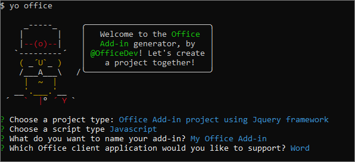
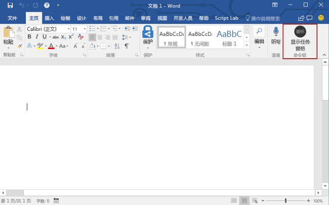
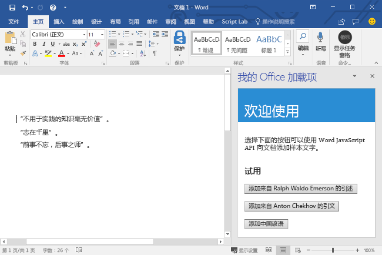

# <a name="build-your-first-word-add-in"></a>构建您的第一个 Word 外接程序

_适用于：Word 2016、Word for iPad、Word for Mac_

本文将逐步介绍如何使用 jQuery 和 Word JavaScript API 生成 Word 加载项。 

## <a name="create-the-add-in"></a>创建加载项 

[!include[Choose your editor](../includes/quickstart-choose-editor.md)]

# <a name="visual-studiotabvisual-studio"></a>[Visual Studio](#tab/visual-studio)

### <a name="prerequisites"></a>先决条件

[!include[Quick Start prerequisites](../includes/quickstart-vs-prerequisites.md)]

### <a name="create-the-add-in-project"></a>创建加载项项目

1. 在 Visual Studio 菜单栏中，依次选择“文件”**** > “新建”**** > “项目”****。
    
2. 在“Visual C#”**** 或“Visual Basic”**** 下的项目类型列表中，展开“Office/SharePoint”****，选择“加载项”****，再选择“Word Web 加载项”**** 作为项目类型。 

3. 命名此项目，再选择“确定”****。

4. 此时，Visual Studio 创建解决方案，且它的两个项目显示在“解决方案资源管理器”**** 中。**Home.html** 文件在 Visual Studio 中打开。
    
### <a name="explore-the-visual-studio-solution"></a>探索 Visual Studio 解决方案

[!include[Description of Visual Studio projects](../includes/quickstart-vs-solution.md)]

### <a name="update-the-code"></a>更新代码

1. **Home.html** 指定在加载项的任务窗格中呈现的 HTML。 在 **Home.html** 中，将 `<body>` 元素替换为以下标记，并保存文件。
 
    ```html
    <body>
        <div id="content-header">
            <div class="padding">
                <h1>Welcome</h1>
            </div>
        </div>    
        <div id="content-main">
            <div class="padding">
                <p>Choose the buttons below to add boilerplate text to the document by using the Word JavaScript API.</p>
                <br />
                <h3>Try it out</h3>
                <button id="emerson">Add quote from Ralph Waldo Emerson</button>
                <br /><br />
                <button id="checkhov">Add quote from Anton Chekhov</button>
                <br /><br />
                <button id="proverb">Add Chinese proverb</button>
            </div>
        </div>
        <br />
        <div id="supportedVersion"/>
    </body>
    ```

2. 打开 Web 应用项目根目录中的文件“Home.js”****。 此文件指定加载项脚本。 将整个内容替换为以下代码，并保存文件。

    ```js
    'use strict';
    
    (function () {

        // The initialize function is run each time the page is loaded.
        Office.initialize = function (reason) {
            $(document).ready(function () {

                // Use this to check whether the API is supported in the Word client.
                if (Office.context.requirements.isSetSupported('WordApi', 1.1)) {
                    // Do something that is only available via the new APIs
                    $('#emerson').click(insertEmersonQuoteAtSelection);
                    $('#checkhov').click(insertChekhovQuoteAtTheBeginning);
                    $('#proverb').click(insertChineseProverbAtTheEnd);
                    $('#supportedVersion').html('This code is using Word 2016 or greater.');
                }
                else {
                    // Just letting you know that this code will not work with your version of Word.
                    $('#supportedVersion').html('This code requires Word 2016 or greater.');
                }
            });
        };

        function insertEmersonQuoteAtSelection() {
            Word.run(function (context) {

                // Create a proxy object for the document.
                var thisDocument = context.document;

                // Queue a command to get the current selection.
                // Create a proxy range object for the selection.
                var range = thisDocument.getSelection();

                // Queue a command to replace the selected text.
                range.insertText('"Hitch your wagon to a star."\n', Word.InsertLocation.replace);

                // Synchronize the document state by executing the queued commands,
                // and return a promise to indicate task completion.
                return context.sync().then(function () {
                    console.log('Added a quote from Ralph Waldo Emerson.');
                });
            })
            .catch(function (error) {
                console.log('Error: ' + JSON.stringify(error));
                if (error instanceof OfficeExtension.Error) {
                    console.log('Debug info: ' + JSON.stringify(error.debugInfo));
                }
            });
        }

        function insertChekhovQuoteAtTheBeginning() {
            Word.run(function (context) {

                // Create a proxy object for the document body.
                var body = context.document.body;

                // Queue a command to insert text at the start of the document body.
                body.insertText('"Knowledge is of no value unless you put it into practice."\n', Word.InsertLocation.start);

                // Synchronize the document state by executing the queued commands,
                // and return a promise to indicate task completion.
                return context.sync().then(function () {
                    console.log('Added a quote from Anton Chekhov.');
                });
            })
            .catch(function (error) {
                console.log('Error: ' + JSON.stringify(error));
                if (error instanceof OfficeExtension.Error) {
                    console.log('Debug info: ' + JSON.stringify(error.debugInfo));
                }
            });
        }

        function insertChineseProverbAtTheEnd() {
            Word.run(function (context) {

                // Create a proxy object for the document body.
                var body = context.document.body;

                // Queue a command to insert text at the end of the document body.
                body.insertText('"To know the road ahead, ask those coming back."\n', Word.InsertLocation.end);

                // Synchronize the document state by executing the queued commands,
                // and return a promise to indicate task completion.
                return context.sync().then(function () {
                    console.log('Added a quote from a Chinese proverb.');
                });
            })
            .catch(function (error) {
                console.log('Error: ' + JSON.stringify(error));
                if (error instanceof OfficeExtension.Error) {
                    console.log('Debug info: ' + JSON.stringify(error.debugInfo));
                }
            });
        }
    })();
    ```

3. 打开 Web 应用项目根目录中的文件“Home.css”****。 此文件指定加载项自定义样式。 将整个内容替换为以下代码，并保存文件。

    ```css
    #content-header {
        background: #2a8dd4;
        color: #fff;
        position: absolute;
        top: 0;
        left: 0;
        width: 100%;
        height: 80px; 
        overflow: hidden;
    }

    #content-main {
        background: #fff;
        position: fixed;
        top: 80px;
        left: 0;
        right: 0;
        bottom: 0;
        overflow: auto; 
    }

    .padding {
        padding: 15px;
    }
    ```

### <a name="update-the-manifest"></a>更新清单

1. 打开加载项项目中的 XML 清单文件。 此文件定义的是加载项设置和功能。

2. 元素具有占位符值。`ProviderName` 将其替换为你的姓名。

3. 元素的 `DefaultValue` 属性有占位符。`DisplayName` 将它替换为“My Office Add-in”****。

4. 元素的 `DefaultValue` 属性有占位符。`Description` 将它替换为“A task pane add-in for Word”****。

5. 保存文件。

    ```xml
    ...
    <ProviderName>John Doe</ProviderName>
    <DefaultLocale>en-US</DefaultLocale>
    <!-- The display name of your add-in. Used on the store and various places of the Office UI such as the add-ins dialog. -->
    <DisplayName DefaultValue="My Office Add-in" />
    <Description DefaultValue="A task pane add-in for Word"/>
    ...
    ```

### <a name="try-it-out"></a>试用

1. 使用 Visual Studio 的同时，按 F5 或选择“开始”**** 按钮启动 Word，以测试新建的 Word 加载项，功能区中显示有“显示任务窗格”**** 加载项按钮。加载项本地托管在 IIS 上。

2. 在 Word 中，依次选择“主页”**** 选项卡和功能区中的“显示任务窗格”**** 按钮，以打开加载项任务窗格。

    

3. 选择任务窗格中的任意按钮，将样本文字添加到文档。

    

# <a name="any-editortabvisual-studio-code"></a>[任意编辑器](#tab/visual-studio-code)

### <a name="prerequisites"></a>先决条件

- [Node.js](https://nodejs.org)

- 全局安装最新版 [Yeoman](https://github.com/yeoman/yo) 和 [Office 加载项的 Yeoman 生成器](https://github.com/OfficeDev/generator-office)。

    ```bash
    npm install -g yo generator-office
    ```

### <a name="create-the-add-in-project"></a>创建加载项项目

1. 在本地驱动器上创建文件夹，并将它命名为“`my-word-addin`”。 将在其中创建外接程序文件。

2. 转到新文件夹。

    ```bash
    cd my-word-addin
    ```

3. 使用 Yeoman 生成器创建 Word 加载项项目。 运行下面的命令，再回答如下所示的提示问题：

    ```bash
    yo office
    ```

    - **选择一个项目类型：** `Office Add-in project using Jquery framework`
    - **选择一个脚本类型：** `Javascript`
    - **要如何命名加载项?:** `My Office Add-in`
    - **要支持哪一个 Office 客户端应用?:** `Word`

    
    
    完成向导后，生成器将创建项目并安装 Node 支持组件。

### <a name="update-the-code"></a>更新代码

1. 在代码编辑器中，打开项目根目录中的“index.html”****。 此文件包含在加载项任务窗格中呈现的 HTML。 将整个内容替换为以下代码，并保存文件。 此加载项将显示三个按钮，在用户选择其中任一按钮后，样本文字就会添加到文档中。

    ```html
    <!DOCTYPE html>
    <html>
        <head>
            <meta charset="UTF-8" />
            <meta http-equiv="X-UA-Compatible" content="IE=Edge" />
            <title>Boilerplate text app</title>
            <script src="https://ajax.aspnetcdn.com/ajax/jQuery/jquery-2.1.4.min.js"></script>
            <script src="https://appsforoffice.microsoft.com/lib/1/hosted/office.js" type="text/javascript"></script>
            <link href="app.css" rel="stylesheet" type="text/css" />
        </head>
        <body>
            <div id="content-header">
                <div class="padding">
                    <h1>Welcome</h1>
                </div>
            </div>    
            <div id="content-main">
                <div class="padding">
                    <p>Choose the buttons below to add boilerplate text to the document by using the Word JavaScript API.</p>
                    <br />
                    <h3>Try it out</h3>
                    <button id="emerson">Add quote from Ralph Waldo Emerson</button>
                    <br /><br />
                    <button id="checkhov">Add quote from Anton Chekhov</button>
                    <br /><br />
                    <button id="proverb">Add Chinese proverb</button>
                </div>
            </div>
            <br />
            <div id="supportedVersion"/>
        </body>
    </html>
    ```

2. 打开文件 **src/index.js** 以指定加载项的脚本，替换全部内容为以下代码并保存该文件。此脚本包含初始化代码以及更改 Word 文档的代码，它在选择一个按钮时将文字插入到文档。 

    ```js
    'use strict';
    
    (function () {

        // The initialize function is run each time the page is loaded.
        Office.initialize = function (reason) {
            $(document).ready(function () {

                // Use this to check whether the API is supported in the Word client.
                if (Office.context.requirements.isSetSupported('WordApi', 1.1)) {
                    // Do something that is only available via the new APIs
                    $('#emerson').click(insertEmersonQuoteAtSelection);
                    $('#checkhov').click(insertChekhovQuoteAtTheBeginning);
                    $('#proverb').click(insertChineseProverbAtTheEnd);
                    $('#supportedVersion').html('This code is using Word 2016 or greater.');
                }
                else {
                    // Just letting you know that this code will not work with your version of Word.
                    $('#supportedVersion').html('This code requires Word 2016 or greater.');
                }
            });
        };

        function insertEmersonQuoteAtSelection() {
            Word.run(function (context) {

                // Create a proxy object for the document.
                var thisDocument = context.document;

                // Queue a command to get the current selection.
                // Create a proxy range object for the selection.
                var range = thisDocument.getSelection();

                // Queue a command to replace the selected text.
                range.insertText('"Hitch your wagon to a star."\n', Word.InsertLocation.replace);

                // Synchronize the document state by executing the queued commands,
                // and return a promise to indicate task completion.
                return context.sync().then(function () {
                    console.log('Added a quote from Ralph Waldo Emerson.');
                });
            })
            .catch(function (error) {
                console.log('Error: ' + JSON.stringify(error));
                if (error instanceof OfficeExtension.Error) {
                    console.log('Debug info: ' + JSON.stringify(error.debugInfo));
                }
            });
        }

        function insertChekhovQuoteAtTheBeginning() {
            Word.run(function (context) {

                // Create a proxy object for the document body.
                var body = context.document.body;

                // Queue a command to insert text at the start of the document body.
                body.insertText('"Knowledge is of no value unless you put it into practice."\n', Word.InsertLocation.start);

                // Synchronize the document state by executing the queued commands,
                // and return a promise to indicate task completion.
                return context.sync().then(function () {
                    console.log('Added a quote from Anton Chekhov.');
                });
            })
            .catch(function (error) {
                console.log('Error: ' + JSON.stringify(error));
                if (error instanceof OfficeExtension.Error) {
                    console.log('Debug info: ' + JSON.stringify(error.debugInfo));
                }
            });
        }

        function insertChineseProverbAtTheEnd() {
            Word.run(function (context) {

                // Create a proxy object for the document body.
                var body = context.document.body;

                // Queue a command to insert text at the end of the document body.
                body.insertText('"To know the road ahead, ask those coming back."\n', Word.InsertLocation.end);

                // Synchronize the document state by executing the queued commands,
                // and return a promise to indicate task completion.
                return context.sync().then(function () {
                    console.log('Added a quote from a Chinese proverb.');
                });
            })
            .catch(function (error) {
                console.log('Error: ' + JSON.stringify(error));
                if (error instanceof OfficeExtension.Error) {
                    console.log('Debug info: ' + JSON.stringify(error.debugInfo));
                }
            });
        }
    })();
    ```

3. 打开项目根目录中的文件 **app.css**，以指定加载项自定义样式。 将整个内容替换为以下内容，并保存文件。

    ```css
    #content-header {
        background: #2a8dd4;
        color: #fff;
        position: absolute;
        top: 0;
        left: 0;
        width: 100%;
        height: 80px; 
        overflow: hidden;
    }

    #content-main {
        background: #fff;
        position: fixed;
        top: 80px;
        left: 0;
        right: 0;
        bottom: 0;
        overflow: auto; 
    }

    .padding {
        padding: 15px;
    }
    ```

### <a name="update-the-manifest"></a>更新清单

1. 打开文件“my-office-add-in-manifest.xml”****，以定义加载项的设置和功能。

2. 元素具有占位符值。`ProviderName` 将其替换为你的姓名。

3. 元素的 `DefaultValue` 属性有占位符。`Description` 将它替换为“A task pane add-in for Word”****。

4. 保存文件。

    ```xml
    ...
    <ProviderName>John Doe</ProviderName>
    <DefaultLocale>en-US</DefaultLocale>
    <!-- The display name of your add-in. Used on the store and various places of the Office UI such as the add-ins dialog. -->
    <DisplayName DefaultValue="My Office Add-in" />
    <Description DefaultValue="A task pane add-in for Word"/>
    ...
    ```

### <a name="start-the-dev-server"></a>启动开发人员服务器

[!include[Start server section](../includes/quickstart-yo-start-server.md)] 

### <a name="try-it-out"></a>试用

1. 请按照运行加载项所用平台对应的说明操作，以在 Word 中旁加载加载项。

    - Windows：[在 Windows 上旁加载 Office 加载项](../testing/create-a-network-shared-folder-catalog-for-task-pane-and-content-add-ins.md)
    - Word Online：[在 Office Online 中旁加载 Office 加载项](../testing/sideload-office-add-ins-for-testing.md#sideload-an-office-add-in-on-office-online)
    - iPad 和 Mac：[在 iPad 和 Mac 上旁加载 Office 加载项](../testing/sideload-an-office-add-in-on-ipad-and-mac.md)

2. 在 Word 中，依次选择“主页”**** 选项卡和功能区中的“显示任务窗格”**** 按钮，以打开加载项任务窗格。

    

3. 选择任务窗格中的任意按钮，将样本文字添加到文档。

    

---

## <a name="next-steps"></a>后续步骤

恭喜！已使用 jQuery 成功创建 Word 加载项！ 接下来，请详细了解 Word 加载项的功能，并跟着 Word 加载项教程一起操作，生成更复杂的加载项。

> [!div class="nextstepaction"]
> [Word 外接程序教程](../tutorials/word-tutorial.yml)

## <a name="see-also"></a>另请参阅

* [Word 加载项概述](../word/word-add-ins-programming-overview.md)
* [Word 加载项代码示例](http://dev.office.com/code-samples#?filters=word,office%20add-ins)
* [Word JavaScript API 参考](https://dev.office.com/reference/add-ins/word/word-add-ins-reference-overview)
