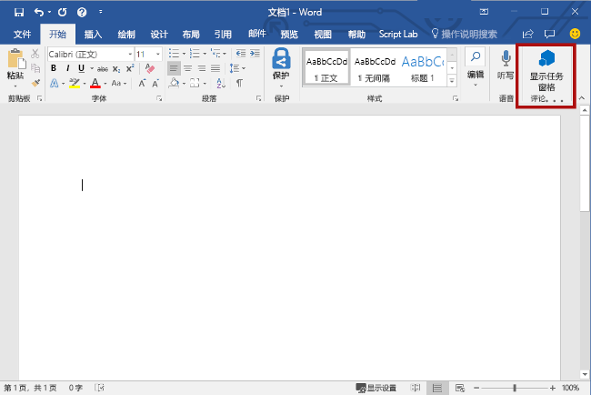

# <a name="build-your-first-word-add-in"></a><span data-ttu-id="94b19-101">构建您的第一个 Word 加载项</span><span class="sxs-lookup"><span data-stu-id="94b19-101">Build your first Word add-in</span></span>

<span data-ttu-id="94b19-102">_适用于：Word 2016、Word for iPad、Word for Mac_</span><span class="sxs-lookup"><span data-stu-id="94b19-102">_Applies to: Word 2016, Word for iPad, Word for Mac_</span></span>

<span data-ttu-id="94b19-103">本文将逐步介绍如何使用 jQuery 和 Word JavaScript API 生成 Word 加载项。</span><span class="sxs-lookup"><span data-stu-id="94b19-103">In this article, you'll walk through the process of building a Word add-in by using jQuery and the Word JavaScript API.</span></span> 

## <a name="create-the-add-in"></a><span data-ttu-id="94b19-104">创建加载项</span><span class="sxs-lookup"><span data-stu-id="94b19-104">Create the add-in</span></span> 

[!include[Choose your editor](../includes/quickstart-choose-editor.md)]

# <a name="visual-studiotabvisual-studio"></a>[<span data-ttu-id="94b19-105">Visual Studio</span><span class="sxs-lookup"><span data-stu-id="94b19-105">Visual Studio</span></span>](#tab/visual-studio)

### <a name="prerequisites"></a><span data-ttu-id="94b19-106">先决条件</span><span class="sxs-lookup"><span data-stu-id="94b19-106">Prerequisites</span></span>

[!include[Quick Start prerequisites](../includes/quickstart-vs-prerequisites.md)]

### <a name="create-the-add-in-project"></a><span data-ttu-id="94b19-107">创建加载项项目</span><span class="sxs-lookup"><span data-stu-id="94b19-107">Create the add-in project</span></span>

1. <span data-ttu-id="94b19-108">在 Visual Studio 菜单栏中，依次选择**文件** > **新建** > **项目**。</span><span class="sxs-lookup"><span data-stu-id="94b19-108">On the Visual Studio menu bar, choose  **File** > **New** > **Project**.</span></span>
    
2. <span data-ttu-id="94b19-109">在 **Visual C#** 或 **Visual Basic** 下的项目类型列表中，展开 **Office/SharePoint** ，选择**加载项**，再选择 **Word Web 加载项**作为项目类型。</span><span class="sxs-lookup"><span data-stu-id="94b19-109">In the list of project types under **Visual C#** or **Visual Basic**, expand  **Office/SharePoint**, choose **Add-ins**, and then choose **Word Web Add-in** as the project type.</span></span> 

3. <span data-ttu-id="94b19-110">命名此项目，再选择**确定**。</span><span class="sxs-lookup"><span data-stu-id="94b19-110">Name the project, and then choose **OK**.</span></span>

4. <span data-ttu-id="94b19-p101">此时，Visual Studio 创建解决方案，且它的两个项目显示在\*\* 解决方案资源管理器**中。**Home.html\*\* 文件在 Visual Studio 中打开。</span><span class="sxs-lookup"><span data-stu-id="94b19-p101">Visual Studio creates a solution and its two projects appear in **Solution Explorer**. The **Home.html** file opens in Visual Studio.</span></span>
    
### <a name="explore-the-visual-studio-solution"></a><span data-ttu-id="94b19-113">探索 Visual Studio 解决方案</span><span class="sxs-lookup"><span data-stu-id="94b19-113">Explore the Visual Studio solution</span></span>

[!include[Description of Visual Studio projects](../includes/quickstart-vs-solution.md)]

### <a name="update-the-code"></a><span data-ttu-id="94b19-114">更新代码</span><span class="sxs-lookup"><span data-stu-id="94b19-114">Update the code</span></span>

1. <span data-ttu-id="94b19-p102">**Home.html** 指定在加载项任务窗格中呈现的 HTML。在 **Home.html**，将 `<body>` 元素替换为以下标记，并保存文件。</span><span class="sxs-lookup"><span data-stu-id="94b19-p102">**Home.html** specifies the HTML that will be rendered in the add-in's task pane. In **Home.html**, replace the `<body>` element with the following markup and save the file.</span></span>
 
    ```html
    <body>
        <div id="content-header">
            <div class="padding">
                <h1>Welcome</h1>
            </div>
        </div>    
        <div id="content-main">
            <div class="padding">
                <p>Choose the buttons below to add boilerplate text to the document by using the Word JavaScript API.</p>
                <br />
                <h3>Try it out</h3>
                <button id="emerson">Add quote from Ralph Waldo Emerson</button>
                <br /><br />
                <button id="checkhov">Add quote from Anton Chekhov</button>
                <br /><br />
                <button id="proverb">Add Chinese proverb</button>
            </div>
        </div>
        <br />
        <div id="supportedVersion"/>
    </body>
    ```

2. <span data-ttu-id="94b19-p103">打开 Web 应用项目根目录中的文件 **Home.js**。此文件指定加载项脚本。将整个内容替换为以下代码，并保存文件。</span><span class="sxs-lookup"><span data-stu-id="94b19-p103">Open the file **Home.js** in the root of the web application project. This file specifies the script for the add-in. Replace the entire contents with the following code and save the file.</span></span>

    ```js
    'use strict';
    
    (function () {

        // The initialize function is run each time the page is loaded.
        Office.initialize = function (reason) {
            $(document).ready(function () {

                // Use this to check whether the API is supported in the Word client.
                if (Office.context.requirements.isSetSupported('WordApi', 1.1)) {
                    // Do something that is only available via the new APIs
                    $('#emerson').click(insertEmersonQuoteAtSelection);
                    $('#checkhov').click(insertChekhovQuoteAtTheBeginning);
                    $('#proverb').click(insertChineseProverbAtTheEnd);
                    $('#supportedVersion').html('This code is using Word 2016 or later.');
                }
                else {
                    // Just letting you know that this code will not work with your version of Word.
                    $('#supportedVersion').html('This code requires Word 2016 or later.');
                }
            });
        };

        function insertEmersonQuoteAtSelection() {
            Word.run(function (context) {

                // Create a proxy object for the document.
                var thisDocument = context.document;

                // Queue a command to get the current selection.
                // Create a proxy range object for the selection.
                var range = thisDocument.getSelection();

                // Queue a command to replace the selected text.
                range.insertText('"Hitch your wagon to a star."\n', Word.InsertLocation.replace);

                // Synchronize the document state by executing the queued commands,
                // and return a promise to indicate task completion.
                return context.sync().then(function () {
                    console.log('Added a quote from Ralph Waldo Emerson.');
                });
            })
            .catch(function (error) {
                console.log('Error: ' + JSON.stringify(error));
                if (error instanceof OfficeExtension.Error) {
                    console.log('Debug info: ' + JSON.stringify(error.debugInfo));
                }
            });
        }

        function insertChekhovQuoteAtTheBeginning() {
            Word.run(function (context) {

                // Create a proxy object for the document body.
                var body = context.document.body;

                // Queue a command to insert text at the start of the document body.
                body.insertText('"Knowledge is of no value unless you put it into practice."\n', Word.InsertLocation.start);

                // Synchronize the document state by executing the queued commands,
                // and return a promise to indicate task completion.
                return context.sync().then(function () {
                    console.log('Added a quote from Anton Chekhov.');
                });
            })
            .catch(function (error) {
                console.log('Error: ' + JSON.stringify(error));
                if (error instanceof OfficeExtension.Error) {
                    console.log('Debug info: ' + JSON.stringify(error.debugInfo));
                }
            });
        }

        function insertChineseProverbAtTheEnd() {
            Word.run(function (context) {

                // Create a proxy object for the document body.
                var body = context.document.body;

                // Queue a command to insert text at the end of the document body.
                body.insertText('"To know the road ahead, ask those coming back."\n', Word.InsertLocation.end);

                // Synchronize the document state by executing the queued commands,
                // and return a promise to indicate task completion.
                return context.sync().then(function () {
                    console.log('Added a quote from a Chinese proverb.');
                });
            })
            .catch(function (error) {
                console.log('Error: ' + JSON.stringify(error));
                if (error instanceof OfficeExtension.Error) {
                    console.log('Debug info: ' + JSON.stringify(error.debugInfo));
                }
            });
        }
    })();
    ```

3. <span data-ttu-id="94b19-p104">打开 Web 应用项目根目录中的文件 **Home.css** 。此文件指定加载项自定义样式。将整个内容替换为以下代码，并保存文件。</span><span class="sxs-lookup"><span data-stu-id="94b19-p104">Open the file **Home.css** in the root of the web application project. This file specifies the custom styles for the add-in. Replace the entire contents with the following code and save the file.</span></span>

    ```css
    #content-header {
        background: #2a8dd4;
        color: #fff;
        position: absolute;
        top: 0;
        left: 0;
        width: 100%;
        height: 80px; 
        overflow: hidden;
    }

    #content-main {
        background: #fff;
        position: fixed;
        top: 80px;
        left: 0;
        right: 0;
        bottom: 0;
        overflow: auto; 
    }

    .padding {
        padding: 15px;
    }
    ```

### <a name="update-the-manifest"></a><span data-ttu-id="94b19-123">更新清单</span><span class="sxs-lookup"><span data-stu-id="94b19-123">Update the manifest</span></span>

1. <span data-ttu-id="94b19-p105">在加载项项目中打开 XML 清单文件。该文件定义了加载项的设置和功能。</span><span class="sxs-lookup"><span data-stu-id="94b19-p105">Open the XML manifest file in the add-in project. This file defines the add-in's settings and capabilities.</span></span>

2. <span data-ttu-id="94b19-p106">`ProviderName` 元素具有占位符值。将其替换为你的姓名。</span><span class="sxs-lookup"><span data-stu-id="94b19-p106">The `ProviderName` element has a placeholder value. Replace it with your name.</span></span>

3. <span data-ttu-id="94b19-p107">`DisplayName` 元素的 `DefaultValue` 属性具有一个占位符。将其替换为**我的 Office 加载项**。</span><span class="sxs-lookup"><span data-stu-id="94b19-p107">The `DefaultValue` attribute of the `DisplayName` element has a placeholder. Replace it with **My Office Add-in**.</span></span>

4. <span data-ttu-id="94b19-p108">`Description` 元素的 `DefaultValue`  属性具有一个占位符。将其替换为 **Word 的任务窗格加载项**。</span><span class="sxs-lookup"><span data-stu-id="94b19-p108">The `DefaultValue` attribute of the `Description` element has a placeholder. Replace it with **A task pane add-in for Word**.</span></span>

5. <span data-ttu-id="94b19-132">保存文件。</span><span class="sxs-lookup"><span data-stu-id="94b19-132">Save the file.</span></span>

    ```xml
    ...
    <ProviderName>John Doe</ProviderName>
    <DefaultLocale>en-US</DefaultLocale>
    <!-- The display name of your add-in. Used on the store and various places of the Office UI such as the add-ins dialog. -->
    <DisplayName DefaultValue="My Office Add-in" />
    <Description DefaultValue="A task pane add-in for Word"/>
    ...
    ```

### <a name="try-it-out"></a><span data-ttu-id="94b19-133">试用</span><span class="sxs-lookup"><span data-stu-id="94b19-133">Try it out</span></span>

1. <span data-ttu-id="94b19-p109">在 Visual Studio 中，按 F5 或选择**开始**按钮启动 Word，以测试新建的 Word 加载项，功能区中显示有**显示任务窗格**加载项按钮。加载项驻留在本地 IIS 上。</span><span class="sxs-lookup"><span data-stu-id="94b19-p109">Using Visual Studio, test the newly created Word add-in by pressing F5 or choosing the **Start** button to launch Word with the **Show Taskpane** add-in button displayed in the ribbon. The add-in will be hosted locally on IIS.</span></span>

2. <span data-ttu-id="94b19-p110">在 Word 中，选择功能区中的**主页**选项卡，然后选择**显示任务窗格**按钮打开加载项任务窗格。（如果您使用非订阅版本的 Office 2016，而不是 Office 365 版本，则自定义按钮不受支持。而是会立即打开任务窗格。）</span><span class="sxs-lookup"><span data-stu-id="94b19-p110">In Word, choose the **Home** tab, and then choose the **Show Taskpane** button in the ribbon to open the add-in task pane. (If you are using the non-subscription version of Office 2016, instead of the Office 365 version, then custom buttons are not supported. Instead, the task pane will open immediately.)</span></span>

    

3. <span data-ttu-id="94b19-140">选择任务窗格中的任意按钮，将样本文字添加到文档。</span><span class="sxs-lookup"><span data-stu-id="94b19-140">In the task pane, choose any of the buttons to add boilerplate text to the document.</span></span>

    

# <a name="any-editortabvisual-studio-code"></a>[<span data-ttu-id="94b19-142">任意编辑器</span><span class="sxs-lookup"><span data-stu-id="94b19-142">Any editor</span></span>](#tab/visual-studio-code)

### <a name="prerequisites"></a><span data-ttu-id="94b19-143">先决条件</span><span class="sxs-lookup"><span data-stu-id="94b19-143">Prerequisites</span></span>

- [<span data-ttu-id="94b19-144">Node.js</span><span class="sxs-lookup"><span data-stu-id="94b19-144">Node.js</span></span>](https://nodejs.org)

- <span data-ttu-id="94b19-145">全局安装最新版 [Yeoman](https://github.com/yeoman/yo) 和 [Office 外接程序的 Yeoman 生成器](https://github.com/OfficeDev/generator-office)。</span><span class="sxs-lookup"><span data-stu-id="94b19-145">Install the latest version of [Yeoman](https://github.com/yeoman/yo) and the [Yeoman generator for Office Add-ins](https://github.com/OfficeDev/generator-office) globally.</span></span>

    ```bash
    npm install -g yo generator-office
    ```

### <a name="create-the-add-in-project"></a><span data-ttu-id="94b19-146">创建加载项项目</span><span class="sxs-lookup"><span data-stu-id="94b19-146">Create the add-in project</span></span>

1. <span data-ttu-id="94b19-147">使用 Yeoman 生成器创建 Word 加载项项目。</span><span class="sxs-lookup"><span data-stu-id="94b19-147">Use the Yeoman generator to create a Word add-in project.</span></span> <span data-ttu-id="94b19-148">运行下面的命令，再回答如下所示的提示问题：</span><span class="sxs-lookup"><span data-stu-id="94b19-148">Run the following command and then answer the prompts as follows:</span></span>

    ```bash
    yo office
    ```

    - <span data-ttu-id="94b19-149">**选择一个项目类型：** `Office Add-in project using Jquery framework`</span><span class="sxs-lookup"><span data-stu-id="94b19-149">**Choose a project type:** `Office Add-in project using Jquery framework`</span></span>
    - <span data-ttu-id="94b19-150">**选择一个脚本类型：** `Javascript`</span><span class="sxs-lookup"><span data-stu-id="94b19-150">**Choose a script type:** `Javascript`</span></span>
    - <span data-ttu-id="94b19-151">**要将你的外接程序命名为什么?:** `My Office Add-in`</span><span class="sxs-lookup"><span data-stu-id="94b19-151">**What do you want to name your add-in?:** `My Office Add-in`</span></span>
    - <span data-ttu-id="94b19-152">**要支持哪一个 Office 客户端应用程序?:** `Word`</span><span class="sxs-lookup"><span data-stu-id="94b19-152">**Which Office client application would you like to support?:** `Word`</span></span>

    
    
    <span data-ttu-id="94b19-154">完成此向导后，生成器会创建项目，并安装支持的 Node 组件。</span><span class="sxs-lookup"><span data-stu-id="94b19-154">After you complete the wizard, the generator will create the project and install supporting Node components.</span></span>
    
2. <span data-ttu-id="94b19-155">导航到项目的根文件夹。</span><span class="sxs-lookup"><span data-stu-id="94b19-155">Navigate to the root folder of the web application project.</span></span>

    ```bash
    cd "My Office Add-in"
    ```

### <a name="update-the-code"></a><span data-ttu-id="94b19-156">更新代码</span><span class="sxs-lookup"><span data-stu-id="94b19-156">Update the code</span></span>

1. <span data-ttu-id="94b19-p112">在代码编辑器中，打开项目根目录中的 **index.html** 根目录中的项目。此文件包括在加载项任务窗格中渲染的 HTML。</span><span class="sxs-lookup"><span data-stu-id="94b19-p112">In your code editor, open **index.html** in the root of the project. This file contains the HTML that will be rendered in the add-in's task pane.</span></span> 

2. <span data-ttu-id="94b19-159">将 `<body>` 元素替换为以下标记，并保存文件。</span><span class="sxs-lookup"><span data-stu-id="94b19-159">Replace the `<body>` element inside the  element with the following markup and save the file.</span></span>

    ```html
    <body>
        <div id="content-header">
            <div class="padding">
                <h1>Welcome</h1>
            </div>
        </div>
        <div id="content-main">
            <div class="padding">
                <p>Choose the buttons below to add boilerplate text to the document by using the Word JavaScript API.</p>
                <br />
                <h3>Try it out</h3>
                <button id="emerson">Add quote from Ralph Waldo Emerson</button>
                <br /><br />
                <button id="checkhov">Add quote from Anton Chekhov</button>
                <br /><br />
                <button id="proverb">Add Chinese proverb</button>
            </div>
        </div>
        <br />
        <div id="supportedVersion" />
        <script type="text/javascript" src="node_modules/jquery/dist/jquery.js"></script>
        <script type="text/javascript" src="node_modules/office-ui-fabric-js/dist/js/fabric.js"></script>
    </body>
    ```

2. <span data-ttu-id="94b19-160">打开文件 **src\index.js**，以指定加载项脚本。</span><span class="sxs-lookup"><span data-stu-id="94b19-160">Open the file **app.js** to specify the script for the add-in.</span></span> <span data-ttu-id="94b19-161">将整个内容替换为以下代码，并保存文件。</span><span class="sxs-lookup"><span data-stu-id="94b19-161">Replace the entire contents with the following code and save the file.</span></span> <span data-ttu-id="94b19-162">此脚本包含初始化代码以及用于更改 Word 文档的代码（具体方法是通过选择某个按钮将文本插入文档）。</span><span class="sxs-lookup"><span data-stu-id="94b19-162">This script contains initialization code as well as the code that makes changes to the Word document, by inserting text into the document when a button is chosen.</span></span> 

    ```js
    'use strict';
    
    (function () {

        // The initialize function is run each time the page is loaded.
        Office.initialize = function (reason) {
            $(document).ready(function () {

                // Use this to check whether the API is supported in the Word client.
                if (Office.context.requirements.isSetSupported('WordApi', 1.1)) {
                    // Do something that is only available via the new APIs
                    $('#emerson').click(insertEmersonQuoteAtSelection);
                    $('#checkhov').click(insertChekhovQuoteAtTheBeginning);
                    $('#proverb').click(insertChineseProverbAtTheEnd);
                    $('#supportedVersion').html('This code is using Word 2016 or later.');
                }
                else {
                    // Just letting you know that this code will not work with your version of Word.
                    $('#supportedVersion').html('This code requires Word 2016 or later.');
                }
            });
        };

        function insertEmersonQuoteAtSelection() {
            Word.run(function (context) {

                // Create a proxy object for the document.
                var thisDocument = context.document;

                // Queue a command to get the current selection.
                // Create a proxy range object for the selection.
                var range = thisDocument.getSelection();

                // Queue a command to replace the selected text.
                range.insertText('"Hitch your wagon to a star."\n', Word.InsertLocation.replace);

                // Synchronize the document state by executing the queued commands,
                // and return a promise to indicate task completion.
                return context.sync().then(function () {
                    console.log('Added a quote from Ralph Waldo Emerson.');
                });
            })
            .catch(function (error) {
                console.log('Error: ' + JSON.stringify(error));
                if (error instanceof OfficeExtension.Error) {
                    console.log('Debug info: ' + JSON.stringify(error.debugInfo));
                }
            });
        }

        function insertChekhovQuoteAtTheBeginning() {
            Word.run(function (context) {

                // Create a proxy object for the document body.
                var body = context.document.body;

                // Queue a command to insert text at the start of the document body.
                body.insertText('"Knowledge is of no value unless you put it into practice."\n', Word.InsertLocation.start);

                // Synchronize the document state by executing the queued commands,
                // and return a promise to indicate task completion.
                return context.sync().then(function () {
                    console.log('Added a quote from Anton Chekhov.');
                });
            })
            .catch(function (error) {
                console.log('Error: ' + JSON.stringify(error));
                if (error instanceof OfficeExtension.Error) {
                    console.log('Debug info: ' + JSON.stringify(error.debugInfo));
                }
            });
        }

        function insertChineseProverbAtTheEnd() {
            Word.run(function (context) {

                // Create a proxy object for the document body.
                var body = context.document.body;

                // Queue a command to insert text at the end of the document body.
                body.insertText('"To know the road ahead, ask those coming back."\n', Word.InsertLocation.end);

                // Synchronize the document state by executing the queued commands,
                // and return a promise to indicate task completion.
                return context.sync().then(function () {
                    console.log('Added a quote from a Chinese proverb.');
                });
            })
            .catch(function (error) {
                console.log('Error: ' + JSON.stringify(error));
                if (error instanceof OfficeExtension.Error) {
                    console.log('Debug info: ' + JSON.stringify(error.debugInfo));
                }
            });
        }
    })();
    ```

3. <span data-ttu-id="94b19-p114">打开项目根目录中的文件 **app.css**，以指定加载项自定义样式。将整个内容替换为以下内容，并保存文件。</span><span class="sxs-lookup"><span data-stu-id="94b19-p114">Open the file **app.css** in the root of the project to specify the custom styles for the add-in. Replace the entire contents with the following and save the file.</span></span>

    ```css
    #content-header {
        background: #2a8dd4;
        color: #fff;
        position: absolute;
        top: 0;
        left: 0;
        width: 100%;
        height: 80px; 
        overflow: hidden;
    }

    #content-main {
        background: #fff;
        position: fixed;
        top: 80px;
        left: 0;
        right: 0;
        bottom: 0;
        overflow: auto; 
    }

    .padding {
        padding: 15px;
    }
    ```

### <a name="update-the-manifest"></a><span data-ttu-id="94b19-165">更新清单</span><span class="sxs-lookup"><span data-stu-id="94b19-165">Update the manifest</span></span>

1. <span data-ttu-id="94b19-166">打开文件 **manifest.xml**，以定义加载项的设置和功能。</span><span class="sxs-lookup"><span data-stu-id="94b19-166">Open the file **my-office-add-in-manifest.xml** to define the add-in's settings and capabilities.</span></span>

2. <span data-ttu-id="94b19-p115">`ProviderName` 元素具有占位符值。将其替换为你的姓名。</span><span class="sxs-lookup"><span data-stu-id="94b19-p115">The `ProviderName` element has a placeholder value. Replace it with your name.</span></span>

3. <span data-ttu-id="94b19-p116">`Description` 元素的 `DefaultValue`  属性具有一个占位符。将其替换为 **Word 的任务窗格加载项**。</span><span class="sxs-lookup"><span data-stu-id="94b19-p116">The `DefaultValue` attribute of the `Description` element has a placeholder. Replace it with **A task pane add-in for Word**.</span></span>

4. <span data-ttu-id="94b19-171">保存文件。</span><span class="sxs-lookup"><span data-stu-id="94b19-171">Save the file.</span></span>

    ```xml
    ...
    <ProviderName>John Doe</ProviderName>
    <DefaultLocale>en-US</DefaultLocale>
    <!-- The display name of your add-in. Used on the store and various places of the Office UI such as the add-ins dialog. -->
    <DisplayName DefaultValue="My Office Add-in" />
    <Description DefaultValue="A task pane add-in for Word"/>
    ...
    ```

### <a name="start-the-dev-server"></a><span data-ttu-id="94b19-172">启动开发人员服务器</span><span class="sxs-lookup"><span data-stu-id="94b19-172">Start the dev server</span></span>

[!include[Start server section](../includes/quickstart-yo-start-server.md)] 

### <a name="try-it-out"></a><span data-ttu-id="94b19-173">试用</span><span class="sxs-lookup"><span data-stu-id="94b19-173">Try it out</span></span>

1. <span data-ttu-id="94b19-174">按照运行加载项所用平台对应的说明操作，以在 Word 中旁加载加载项。</span><span class="sxs-lookup"><span data-stu-id="94b19-174">To sideload the add-in within Word, follow the instructions for the platform you'll use to run your add-in.</span></span>

    - <span data-ttu-id="94b19-175">Windows：[在 Windows 上旁加载 Office 外接程序](../testing/create-a-network-shared-folder-catalog-for-task-pane-and-content-add-ins.md)</span><span class="sxs-lookup"><span data-stu-id="94b19-175">Windows: [Sideload Office Add-ins on Windows](../testing/create-a-network-shared-folder-catalog-for-task-pane-and-content-add-ins.md)</span></span>
    - <span data-ttu-id="94b19-176">Word Online：[在 Office Online 中旁加载 Office 加载项](../testing/sideload-office-add-ins-for-testing.md#sideload-an-office-add-in-on-office-online)</span><span class="sxs-lookup"><span data-stu-id="94b19-176">Word Online: [Sideload Office Add-ins in Office Online](../testing/sideload-office-add-ins-for-testing.md#sideload-an-office-add-in-on-office-online)</span></span>
    - <span data-ttu-id="94b19-177">iPad 和 Mac：[在 iPad 和 Mac 上旁加载 Office 外接程序](../testing/sideload-an-office-add-in-on-ipad-and-mac.md)</span><span class="sxs-lookup"><span data-stu-id="94b19-177">iPad and Mac: [Sideload Office Add-ins on iPad and Mac](../testing/sideload-an-office-add-in-on-ipad-and-mac.md)</span></span>

2. <span data-ttu-id="94b19-178">在 Word 中，依次选择**主页**选项卡和功能区中的**显示任务窗格**按钮，以打开加载项任务窗格。</span><span class="sxs-lookup"><span data-stu-id="94b19-178">In Word, choose the **Home** tab, and then choose the **Show Taskpane** button in the ribbon to open the add-in task pane.</span></span>

    

3. <span data-ttu-id="94b19-180">选择任务窗格中的任意按钮，将样本文字添加到文档。</span><span class="sxs-lookup"><span data-stu-id="94b19-180">In the task pane, choose any of the buttons to add boilerplate text to the document.</span></span>

    

---

## <a name="next-steps"></a><span data-ttu-id="94b19-182">后续步骤</span><span class="sxs-lookup"><span data-stu-id="94b19-182">Next steps</span></span>

<span data-ttu-id="94b19-183">恭喜！已使用 jQuery 成功创建 Word 加载项！</span><span class="sxs-lookup"><span data-stu-id="94b19-183">Congratulations, you've successfully created a Word add-in using jQuery!</span></span> <span data-ttu-id="94b19-184">接下来，请详细了解 Word 加载项的功能，并跟着 Word 加载项教程一起操作，生成更复杂的加载项。</span><span class="sxs-lookup"><span data-stu-id="94b19-184">Next, learn more about the capabilities of an Outlook add-in and build a more complex add-in by following along with the Advanced Outlook add-in tutorial.</span></span>

> [!div class="nextstepaction"]
> [<span data-ttu-id="94b19-185">Word 外接程序教程</span><span class="sxs-lookup"><span data-stu-id="94b19-185">Word add-in tutorial</span></span>](../tutorials/word-tutorial.yml)

## <a name="see-also"></a><span data-ttu-id="94b19-186">另请参阅</span><span class="sxs-lookup"><span data-stu-id="94b19-186">See also</span></span>

* [<span data-ttu-id="94b19-187">Word 加载项概述</span><span class="sxs-lookup"><span data-stu-id="94b19-187">Word add-ins overview</span></span>](../word/word-add-ins-programming-overview.md)
* [<span data-ttu-id="94b19-188">Word 加载项代码示例</span><span class="sxs-lookup"><span data-stu-id="94b19-188">Word add-in code samples</span></span>](https://developer.microsoft.com/en-us/office/gallery/?filterBy=Samples,Word)
* [<span data-ttu-id="94b19-189">Word JavaScript API 参考</span><span class="sxs-lookup"><span data-stu-id="94b19-189">Word JavaScript API reference</span></span>](https://docs.microsoft.com/office/dev/add-ins/reference/overview/word-add-ins-reference-overview?view=office-js)
