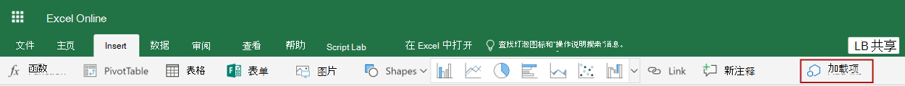

# <a name="tutorial-create-custom-functions-in-excel"></a>教程：在 Excel 中创建自定义函数

## <a name="introduction"></a>简介

用户可以借助自定义函数向 Excel 添加新函数，方法是在 JavaScript 中将这些函数定义为加载项的一部分。 Excel 中的用户可以访问自定义函数，就像他们访问 Excel 中的任何本机函数一样，比如 `SUM()`。 可以创建自定义函数，以执行简单的任务（如自定义计算）或更复杂的任务（如将实时数据从 Web 传送到工作表中）。

将在本教程中执行以下操作：
> [!div class="checklist"]
> * 通过使用 Yo Office 生成器创建自定义函数项目
> * 使用预生成的自定义函数来执行简单计算
> * 创建从 Web 请求数据的自定义函数
> * 创建从 Web 传送实时数据的自定义函数

[!include[Excel custom functions note](../includes/excel-custom-functions-note.md)]

## <a name="prerequisites"></a>先决条件

* [Node.js 和 npm](https://nodejs.org/en/)

* [Git Bash](https://git-scm.com/downloads)（或其他 Git 客户端）

* 最新版本的 [Yeoman](https://yeoman.io/) 和 [Yo Office 生成器](https://www.npmjs.com/package/generator-office)。 若要全局安装这些工具，请通过命令提示符运行以下命令：

    ```bash
    npm install -g yo generator-office
    ```

* Excel for Windows（版本 1810 或更高版本）或 Excel Online

* 加入 [Office 预览体验计划](https://products.office.com/office-insider)（**预览体验成员**级别 - 以前称为“预览体验成员 - 快”）

## <a name="create-a-custom-functions-project"></a>创建自定义函数项目

本教程首先使用 Yo Office 生成器创建自定义函数项目所需的文件。

1. 运行下面的命令，再回答如下所示的提示问题。

    ```bash
    yo office
    ```

    * 选择项目类型：`Excel Custom Functions Add-in project (...)`
    * 选择脚本类型：`JavaScript`
    * 要如何命名加载项？ `stock-ticker`

    

    完成此向导后，生成器将创建项目文件，并安装支持的 Node 组件。 项目文件来自 [Excel-Custom-Functions](https://github.com/OfficeDev/Excel-Custom-Functions) GitHub 存储库。

2. 导航到项目文件夹。

    ```bash
    cd stock-ticker
    ```

3. 启动本地 Web 服务器。

    * 如果要使用 Excel for Windows 测试自定义函数，请运行以下命令来启动本地 Web 服务器，启动 Excel，并旁加载加载项：

        ```bash
        npm run start-desktop
        ```

    * 如果要使用 Excel Online 测试自定义函数，请运行以下命令来启动本地 Web 服务器： 

        ```bash
        npm run start-web
        ```

## <a name="try-out-a-prebuilt-custom-function"></a>尝试预生成的自定义函数

使用 Yo Office 生成器创建的自定义函数项目包含一些预生成的自定义函数，这些函数在 **src/functions/functions.js** 文件中定义。 项目根目录中的 **manifest.xml** 文件指定所有自定义函数均属于 `CONTOSO` 名称空间。

在使用任何预生成的自定义函数之前，必须在 Excel 中注册自定义函数加载项。 通过完成针对本教程中将要使用的平台的相应步骤来执行上述操作。

* 如果要使用 Excel for Windows 测试自定义函数，请执行以下操作：

    1. 在 Excel 中，选择“插入”**** 选项卡，然后选择位于“我的加载项”**** 右侧的向下箭头。

    2. 在可用加载项列表中，找到“开发人员加载项”**** 部分，并选择“Excel 自定义函数”**** 加载项以进行注册。
        

* 如果要使用 Excel Online 测试自定义函数，请执行以下操作： 

    1. 在 Excel Online 中，选择“插入”**** 选项卡，然后选择“加载项”****。

    2. 选择“管理我的加载项”****，然后选择“上载我的加载项”****。 

    3. 选择“浏览...”****，并导航到 Yo Office 生成器创建的项目的根目录。 

    4. 依次选择文件“manifest.xml”****，“打开”****，然后选择“上载”****。

此时，在项目中预生成的自定义函数将在 Excel 中加载并在其中可用。 通过在 Excel 中完成以下步骤来尝试使用 `ADD` 自定义函数：

1. 在单元格内，键入 **=CONTOSO**。 请注意，自动完成菜单将显示 `CONTOSO` 命名空间中所有函数的列表。

2. 通过在单元格中指定值 `=CONTOSO.ADD(10,200)` 并按 Enter 来运行 `CONTOSO.ADD` 函数，并将数字 `10` 和 `200` 作为输入参数。

`ADD` 自定义函数计算指定为输入参数的两个数字的总和。 键入 `=CONTOSO.ADD(10,200)` 应在按下 Enter 后在单元格中生成结果 **210**。

## <a name="create-a-custom-function-that-requests-data-from-the-web"></a>创建从 Web 请求数据的自定义函数

如果需要一个可以从 API 请求股票价格并在工作表单元格中显示结果的函数，该怎么办？ 自定义函数旨在使用户可以轻松地以异步方式从 Web 中请求数据。

完成以下步骤，以创建一个名为 `stockPrice` 的自定义函数，该函数接受股票代码（例如，**MSFT**）并返回该股票的价格。 此自定义函数使用 IEX Trading API，该 API 是免费的，并且不需要身份验证。

1. 在 Yo Office 生成器创建的 **stock-ticker** 项目中，找到文件 **src/functions/functions.js** 并在代码编辑器中打开它。

2. 将以下代码添加到 **customfunctions.js**，并保存文件。

    ```js
    function stockPrice(ticker) {
        var url = "https://api.iextrading.com/1.0/stock/" + ticker + "/price";
        return fetch(url)
            .then(function(response) {
                return response.text();
            })
            .then(function(text) {
                return parseFloat(text);
            });

        // Note: in case of an error, the returned rejected Promise
        //    will be bubbled up to Excel to indicate an error.
    }

    CustomFunctionMappings.STOCKPRICE = stockPrice;
    ```

3. 用户必须指定说明新函数的元数据，Excel 才能为最终用户提供此新函数。 在 Yo Office 生成器创建的 **stock-ticker** 项目中，找到文件 **src/functions/functions.json** 并在代码编辑器中打开它。 将以下对象添加到 **src/functions/functions.json** 文件中的 `functions` 数组，并保存该文件。

    此 JSON 说明了 `stockPrice` 函数。

    ```json
    {
        "id": "STOCKPRICE",
        "name": "STOCKPRICE",
        "description": "Fetches current stock price",
        "helpUrl": "http://www.contoso.com/help",
        "result": {
            "type": "number",
            "dimensionality": "scalar"
        },  
        "parameters": [
            {
                "name": "ticker",
                "description": "stock ticker name",
                "type": "string",
                "dimensionality": "scalar"
            }
        ]
    }
    ```

4. 必须在 Excel 中重新注册加载项，以便最终用户可以使用此新函数。 完成针对本教程中将要使用的平台的下列相应步骤。

    * 如果使用的是 Excel for Windows，请执行以下操作：

        1. 关闭 Excel，然后重新打开 Excel。

        2. 在 Excel 中，选择“插入”**** 选项卡，然后选择位于“我的加载项”**** 右侧的向下箭头。

        1. 在可用加载项列表中，找到“开发人员加载项”**** 部分，并选择“Excel 自定义函数”**** 加载项以进行注册。
            

    * 如果使用的是 Excel Online，请执行以下操作： 

        1. 在 Excel Online 中，选择“插入”**** 选项卡，然后选择“加载项”****。

        2. 选择“管理我的加载项”****，然后选择“上载我的加载项”****。 

        3. 选择“浏览...”****，并导航到 Yo Office 生成器创建的项目的根目录。 

        4. 依次选择文件“manifest.xml”****，“打开”****，然后选择“上载”****。

5. 现在，让我们尝试使用新函数。 在单元格 **B1** 中，键入文本 `=CONTOSO.STOCKPRICE("MSFT")` 然后按 Enter。 应看到单元格 **B1** 中的结果是 Microsoft 一股股票的当前股票价格。

## <a name="create-a-streaming-asynchronous-custom-function"></a>创建流式处理异步自定义函数

刚刚创建的 `stockPrice` 函数返回特定时刻的股票价格，但股票价格一直在变化。 让我们创建一个自定义函数，它从 API 传送数据，以获取股票价格的实时更新。

完成以下步骤，创建一个名为 `stockPriceStream` 的自定义函数，该函数每 1000 毫秒请求指定股票的价格（假设之前的请求已经完成）。 正在进行初始请求时，用户可能会在调用函数的单元格中看到占位符值 **#GETTING_DATA**。 函数返回一个值后，**#GETTING_DATA** 将被替换为单元格中的该值。

1. 在 Yo Office 生成器创建的 **stock-ticker** 项目中，向 **src/functions/functions.js** 添加以下代码并保存文件。

    ```js
    function stockPriceStream(ticker, handler) {
        var updateFrequency = 1000 /* milliseconds*/;
        var isPending = false;

        var timer = setInterval(function() {
            // If there is already a pending request, skip this iteration:
            if (isPending) {
                return;
            }

            var url = "https://api.iextrading.com/1.0/stock/" + ticker + "/price";
            isPending = true;

            fetch(url)
                .then(function(response) {
                    return response.text();
                })
                .then(function(text) {
                    handler.setResult(parseFloat(text));
                })
                .catch(function(error) {
                    handler.setResult(error);
                })
                .then(function() {
                    isPending = false;
                });
        }, updateFrequency);

        handler.onCanceled = () => {
            clearInterval(timer);
        };
    }

    CustomFunctionMappings.STOCKPRICESTREAM = stockPriceStream;
    ```

2. 用户必须指定说明新函数的元数据，Excel 才能为最终用户提供此新函数。 在 Yo Office 生成器创建的 **stock-ticker** 项目中，向 **src/functions/functions.json** 文件中的 `functions` 数组添加以下对象，并保存文件。

    此 JSON 说明了 `stockPriceStream` 函数。 对于任何流式处理函数，必须在 `options` 对象中将 `stream` 属性和 `cancelable` 属性设置为 `true`，如本代码示例所示。

    ```json
    { 
        "id": "STOCKPRICESTREAM",
        "name": "STOCKPRICESTREAM",
        "description": "Streams real time stock price",
        "helpUrl": "http://www.contoso.com/help",
        "result": {
            "type": "number",
            "dimensionality": "scalar"
        },  
        "parameters": [
            {
                "name": "ticker",
                "description": "stock ticker name",
                "type": "string",
                "dimensionality": "scalar"
            }
        ],
        "options": {
            "stream": true,
            "cancelable": true
        }
    }
    ```

3. 必须在 Excel 中重新注册加载项，以便最终用户可以使用此新函数。 完成针对本教程中将要使用的平台的下列相应步骤。

    * 如果使用的是 Excel for Windows，请执行以下操作：

        1. 关闭 Excel，然后重新打开 Excel。
        
        2. 在 Excel 中，选择“插入”**** 选项卡，然后选择位于“我的加载项”**** 右侧的向下箭头。

        3. 在可用加载项列表中，找到“开发人员加载项”**** 部分，并选择“Excel 自定义函数”**** 加载项以进行注册。
            

    * 如果使用的是 Excel Online，请执行以下操作： 

        1. 在 Excel Online 中，选择“插入”**** 选项卡，然后选择“加载项”****。

        2. 选择“管理我的加载项”****，然后选择“上载我的加载项”****。 

        3. 选择“浏览...”****，并导航到 Yo Office 生成器创建的项目的根目录。 

        4. 依次选择文件“manifest.xml”****，“打开”****，然后选择“上载”****。

4. 现在，让我们尝试使用新函数。 在单元格 **C1** 中，键入文本 `=CONTOSO.STOCKPRICESTREAM("MSFT")`，然后按 Enter。 假设股票市场开盘，应该会看到单元格 **C1** 中的结果在不断更新，以反映 Microsoft 一股股票的实时价格。

## <a name="next-steps"></a>后续步骤

在本教程中，你已经创建新的自定义函数项目，尝试了预生成的函数，创建了从 Web 请求数据的自定义函数，并创建了从 Web 传送实时数据的自定义函数。 若要详细了解 Excel 中的自定义函数，请继续阅读以下文章： 

> [!div class="nextstepaction"]
> [在 Excel 中创建自定义函数](../excel/custom-functions-overview.md)

## <a name="legal-information"></a>法律信息

[IEX](https://iextrading.com/developer/) 免费提供的数据。 查看 [IEX 使用条款](https://iextrading.com/api-exhibit-a/)。 Microsoft 在本教程中使用的 IEX API 仅供教学使用。
