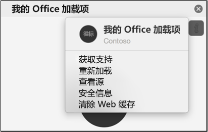

出于性能原因，加载项通常缓存在 mac Office中。 通常情况下，将通过重新加载加载项清除缓存。 如果同一文档中存在多个加载项，则重载后自动清除缓存的过程可能不可靠。

### 使用"个性"菜单清除缓存

可以通过使用任何任务窗格加载项的个性菜单来清除缓存。 但是，由于个性化菜单在 Outlook 外接程序中不受支持，因此，如果使用的是自定义菜单，可以尝试手动清除Outlook。

- 选择个性菜单。 然后选择“**清除 Web 缓存**”。
    > [!NOTE]
    > 必须运行 macOS 版本 10.13.6 或更高版本才能看到个性菜单。

    

### 手动清除缓存

也可以通过删除 `~/Library/Containers/com.Microsoft.OsfWebHost/Data/` 文件夹中的内容来手动清除缓存。 通过终端查找此文件夹。

> [!NOTE]
> 如果该文件夹不存在，请通过终端检查以下文件夹，如果找到，请删除该文件夹的内容。
>
> - `~/Library/Containers/com.microsoft.{host}/Data/Library/Caches/`，其中，`{host}` 是 Office 应用程序（例如 `Excel`）
> - `~/Library/Containers/com.microsoft.{host}/Data/Library/Application Support/Microsoft/Office/16.0/Wef/`，其中，`{host}` 是 Office 应用程序（例如 `Excel`）
> - `~/Library/Containers/com.microsoft.Office365ServiceV2/Data/Caches/com.microsoft.Office365ServiceV2/`
> - `~/Library/Containers/com.microsoft.Office365ServiceV2/Data/Library/Caches/com.microsoft.Office365ServiceV2/`
>
> 若要通过 Finder 查找这些文件夹，必须将 Finder 设置为显示隐藏文件。 Finder 按产品名称显示 **Containers** 目录中的文件夹，Microsoft Excel **而不是 com.microsoft.Excel**。