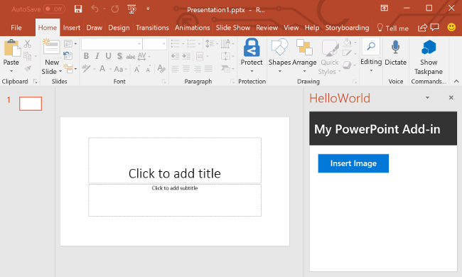

<span data-ttu-id="0de9f-101">本教程的这一步是，自定义任务窗格用户界面 (UI)。</span><span class="sxs-lookup"><span data-stu-id="0de9f-101">In this step of the tutorial, you'll customize the task pane user interface (UI).</span></span>

> [!NOTE]
> <span data-ttu-id="0de9f-102">此为 PowerPoint 加载项分步教程页面。</span><span class="sxs-lookup"><span data-stu-id="0de9f-102">This page describes an individual step of the PowerPoint add-in tutorial.</span></span> <span data-ttu-id="0de9f-103">如果是通过搜索引擎结果或其他直接链接到达此页面，请转到 [PowerPoint 加载项教程](../tutorials/powerpoint-tutorial.yml)介绍性页面，从头开始学习本教程。</span><span class="sxs-lookup"><span data-stu-id="0de9f-103">If you’ve arrived at this page via search engine results or other direct link, please go to the [PowerPoint add-in tutorial](../tutorials/powerpoint-tutorial.yml) introduction page to start the tutorial from the beginning.</span></span>

## <a name="customize-the-task-pane-ui"></a><span data-ttu-id="0de9f-104">自定义任务窗格 UI</span><span class="sxs-lookup"><span data-stu-id="0de9f-104">Customize the task pane UI</span></span> 

1. <span data-ttu-id="0de9f-105">在 **Home.html** 文件中，将 `TODO2` 替换为以下标记，以将页眉部分和标题添加到任务窗格。</span><span class="sxs-lookup"><span data-stu-id="0de9f-105">In the **Home.html** file, replace `TODO2` with the following markup to add a header section and title to the task pane.</span></span> <span data-ttu-id="0de9f-106">注意：</span><span class="sxs-lookup"><span data-stu-id="0de9f-106">Note:</span></span>

    - <span data-ttu-id="0de9f-107">以 `ms-` 开头的样式由 [Office UI Fabric](../design/office-ui-fabric.md) 进行定义，后者是用于生成 Office 和 Office 365 用户体验的 JavaScript 前端框架。</span><span class="sxs-lookup"><span data-stu-id="0de9f-107">The styles that begin with `ms-` are defined by [Office UI Fabric](../design/office-ui-fabric.md), a JavaScript front-end framework for building user experiences for Office and Office 365.</span></span> <span data-ttu-id="0de9f-108">**Home.html** 文件包含对 Fabric 样式表的引用。</span><span class="sxs-lookup"><span data-stu-id="0de9f-108">The **Home.html** file includes a reference to the Fabric stylesheet.</span></span>

    ```html
    <div id="content-header">
        <div class="ms-Grid ms-bgColor-neutralPrimary">
            <div class="ms-Grid-row">
                <div class="padding ms-Grid-col ms-u-sm12 ms-u-md12 ms-u-lg12"> <div class="ms-font-xl ms-fontColor-white ms-fontWeight-semibold">My PowerPoint Add-in</div></div>
            </div>
        </div>
    </div>
    ```

2. <span data-ttu-id="0de9f-109">在 **Home.html** 文件中，查找包含 `class="footer"` 的 **div**，并删除找到的整个 **div**，以从任务窗格中删除页脚部分。</span><span class="sxs-lookup"><span data-stu-id="0de9f-109">In the **Home.html** file, find the **div** with `class="footer"` and delete that entire **div** to remove the footer section from the task pane.</span></span>

## <a name="test-the-add-in"></a><span data-ttu-id="0de9f-110">测试加载项</span><span class="sxs-lookup"><span data-stu-id="0de9f-110">Test the add-in</span></span>

1. <span data-ttu-id="0de9f-p104">使用 Visual Studio 的同时，按 `F5` 或选择“开始”**** 按钮启动 PowerPoint，以测试 PowerPoint 加载项，功能区中显示有“显示任务窗格”**** 加载项按钮。加载项本地托管在 IIS 上。</span><span class="sxs-lookup"><span data-stu-id="0de9f-p104">Using Visual Studio, test the PowerPoint add-in by pressing `F5` or choosing the **Start** button to launch PowerPoint with the **Show Taskpane** add-in button displayed in the ribbon. The add-in will be hosted locally on IIS.</span></span>

    

2. <span data-ttu-id="0de9f-114">在 PowerPoint 中，选择功能区中的“显示任务窗格”**** 按钮，以打开加载项任务窗格。</span><span class="sxs-lookup"><span data-stu-id="0de9f-114">In PowerPoint, select the **Show Taskpane** button in the ribbon to open the add-in task pane.</span></span>

    

3. <span data-ttu-id="0de9f-116">请注意，任务窗格现在包含页眉部分和标题，并且不再包含页脚部分。</span><span class="sxs-lookup"><span data-stu-id="0de9f-116">Notice that the task pane now contains a header section and title, and no longer contains a footer section.</span></span>

    

4. <span data-ttu-id="0de9f-118">在 Visual Studio 中，按 `Shift + F5` 或选择“停止”**** 按钮，以停止加载项。</span><span class="sxs-lookup"><span data-stu-id="0de9f-118">In Visual Studio, stop the add-in by pressing `Shift + F5` or choosing the **Stop** button.</span></span> <span data-ttu-id="0de9f-119">PowerPoint 在加载项停止时自动关闭。</span><span class="sxs-lookup"><span data-stu-id="0de9f-119">PowerPoint will automatically close when the add-in is stopped.</span></span>

    

