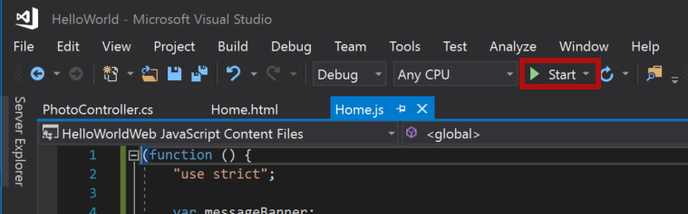

<span data-ttu-id="e5e16-101">本教程的这一步是，向包含一天中[必应](https://www.bing.com)照片的标题幻灯片添加文本。</span><span class="sxs-lookup"><span data-stu-id="e5e16-101">In this step of the tutorial, you'll add text to the title slide that contains the [Bing](https://www.bing.com) photo of the day.</span></span>

> [!NOTE]
> <span data-ttu-id="e5e16-102">此为 PowerPoint 加载项分步教程页面。</span><span class="sxs-lookup"><span data-stu-id="e5e16-102">This page describes an individual step of the PowerPoint add-in tutorial.</span></span> <span data-ttu-id="e5e16-103">如果是通过搜索引擎结果或其他直接链接到达此页面，请转到 [PowerPoint 加载项教程](../tutorials/powerpoint-tutorial.yml)介绍性页面，从头开始学习本教程。</span><span class="sxs-lookup"><span data-stu-id="e5e16-103">If you’ve arrived at this page via search engine results or other direct link, please go to the [PowerPoint add-in tutorial](../tutorials/powerpoint-tutorial.yml) introduction page to start the tutorial from the beginning.</span></span>

## <a name="add-text-to-a-slide"></a><span data-ttu-id="e5e16-104">向幻灯片添加文本</span><span class="sxs-lookup"><span data-stu-id="e5e16-104">Add text to a slide</span></span> 

1. <span data-ttu-id="e5e16-105">在 **Home.html** 文件中，将 `TODO3` 替换为以下标记。</span><span class="sxs-lookup"><span data-stu-id="e5e16-105">In the **Home.html** file, replace `TODO3` with the following markup.</span></span> <span data-ttu-id="e5e16-106">此标记定义在加载项任务窗格内显示的“插入文本”**** 按钮。</span><span class="sxs-lookup"><span data-stu-id="e5e16-106">This markup defines the **Insert Text** button that will appear within the add-in's task pane.</span></span>

    ```html
        <br /><br />
        <button class="ms-Button ms-Button--primary" id="insert-text">
            <span class="ms-Button-icon"><i class="ms-Icon ms-Icon--plus"></i></span>
            <span class="ms-Button-label">Insert Text</span>
            <span class="ms-Button-description">Inserts text into the slide.</span>
        </button>
    ```

2. <span data-ttu-id="e5e16-107">在 **Home.js** 文件中，将 `TODO4` 替换为下列代码，以分配“插入文本”**** 按钮的事件处理程序。</span><span class="sxs-lookup"><span data-stu-id="e5e16-107">In the **Home.js** file, replace `TODO4` with the following code to assign the event handler for the **Insert Text** button.</span></span>

    ```js
    $('#insert-text').click(insertText);
    ```

3. <span data-ttu-id="e5e16-108">在 **Home.js** 文件中，将 `TODO5` 替换为下列代码，以定义 **insertText** 函数。</span><span class="sxs-lookup"><span data-stu-id="e5e16-108">In the **Home.js** file, replace `TODO5` with the following code to define the **insertText** function.</span></span> <span data-ttu-id="e5e16-109">此函数将文本插入当前幻灯片。</span><span class="sxs-lookup"><span data-stu-id="e5e16-109">This function inserts text into the current slide.</span></span>

    ```js
    function insertText() {
        Office.context.document.setSelectedDataAsync('Hello World!',
            function (asyncResult) {
                if (asyncResult.status === Office.AsyncResultStatus.Failed) {
                    showNotification("Error", asyncResult.error.message);
                }
            });
    }
    ```

## <a name="test-the-add-in"></a><span data-ttu-id="e5e16-110">测试加载项</span><span class="sxs-lookup"><span data-stu-id="e5e16-110">Test the add-in</span></span>

1. <span data-ttu-id="e5e16-p104">使用 Visual Studio 的同时，按 `F5` 或选择“开始”**** 按钮启动 PowerPoint，以测试加载项，功能区中显示有“显示任务窗格”**** 加载项按钮。加载项本地托管在 IIS 上。</span><span class="sxs-lookup"><span data-stu-id="e5e16-p104">Using Visual Studio, test the add-in by pressing `F5` or choosing the **Start** button to launch PowerPoint with the **Show Taskpane** add-in button displayed in the ribbon. The add-in will be hosted locally on IIS.</span></span>

    

2. <span data-ttu-id="e5e16-114">在 PowerPoint 中，选择功能区中的“显示任务窗格”**** 按钮，以打开加载项任务窗格。</span><span class="sxs-lookup"><span data-stu-id="e5e16-114">In PowerPoint, select the **Show Taskpane** button in the ribbon to open the add-in task pane.</span></span>

    

3. <span data-ttu-id="e5e16-116">在任务窗格中，选择“插入图像”**** 按钮，将一天中的必应照片添加到当前幻灯片，再为包含标题文本框的幻灯片选择一种设计。</span><span class="sxs-lookup"><span data-stu-id="e5e16-116">In the task pane, choose the **Insert Image** button to add the Bing photo of the day to the current slide and choose a design for the slide that contains a text box for the title.</span></span>

    

4. <span data-ttu-id="e5e16-118">将光标置于标题幻灯片上的文本框中，再选择任务窗格中的“插入文本”**** 按钮，向幻灯片添加文本。</span><span class="sxs-lookup"><span data-stu-id="e5e16-118">Put your cursor in the text box on the title slide and then in the task pane, choose the **Insert Text** button to add text to the slide.</span></span>

    


5. <span data-ttu-id="e5e16-120">在 Visual Studio 中，按 `Shift + F5` 或选择“停止”**** 按钮，以停止加载项。</span><span class="sxs-lookup"><span data-stu-id="e5e16-120">In Visual Studio, stop the add-in by pressing `Shift + F5` or choosing the **Stop** button.</span></span> <span data-ttu-id="e5e16-121">PowerPoint 在加载项停止时自动关闭。</span><span class="sxs-lookup"><span data-stu-id="e5e16-121">PowerPoint will automatically close when the add-in is stopped.</span></span>

    