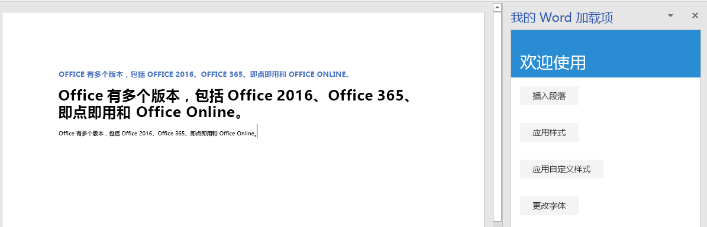

本教程的这一步是，更改文本字体，并向文本应用嵌入样式和自定义样式。

> [!NOTE]
> 此页面介绍了 Word 加载项教程的步骤之一。如果是通过搜索引擎结果或其他直接链接到达此页面，请转到 [Word 加载项教程](../tutorials/word-tutorial.yml)介绍性页面，从头开始学习本教程。

## <a name="apply-a-built-in-style-to-text"></a>向文本应用嵌入样式

1. 在代码编辑器中打开项目。 
2. 打开文件 index.html。
3. 在包含 `insert-paragraph` 按钮的 `div` 正下方，添加下列标记：

    ```html
    <div class="padding">            
        <button class="ms-Button" id="apply-style">Apply Style</button>            
    </div>
    ```

4. 打开 app.js 文件。

5. 在向 `insert-paragraph` 按钮分配单击处理程序的代码行正下方，添加下列代码：

    ```js
    $('#apply-style').click(applyStyle);
    ```

6. 在 `insertParagraph` 函数正下方，添加下列函数：

    ```js
    function applyStyle() {
        Word.run(function (context) {
            
            // TODO1: Queue commands to style text.

            return context.sync();
        })
        .catch(function (error) {
            console.log("Error: " + error);
            if (error instanceof OfficeExtension.Error) {
                console.log("Debug info: " + JSON.stringify(error.debugInfo));
            }
        });
    }
    ``` 

7. 将 `TODO1` 替换为下面的代码。 请注意，此代码向段落应用样式，但也可以向文本区域应用样式。

    ```js
    const firstParagraph = context.document.body.paragraphs.getFirst();
    firstParagraph.styleBuiltIn = Word.Style.intenseReference;
    ``` 

## <a name="apply-a-custom-style-to-text"></a>向文本应用自定义样式

1. 打开文件 index.html。
2. 在包含 `apply-style` 按钮的 `div` 下方，添加下列标记：

    ```html
    <div class="padding">            
        <button class="ms-Button" id="apply-custom-style">Apply Custom Style</button>            
    </div>
    ```

3. 打开 app.js 文件。

4. 在向 `apply-style` 按钮分配单击处理程序的代码行下方，添加下列代码：

    ```js
    $('#apply-custom-style').click(applyCustomStyle);
    ```

5. 在 `applyStyle` 函数下方，添加下列函数：

    ```js
    function applyCustomStyle() {
        Word.run(function (context) {
            
            // TODO1: Queue commands to apply the custom style.

            return context.sync();
        })
        .catch(function (error) {
            console.log("Error: " + error);
            if (error instanceof OfficeExtension.Error) {
                console.log("Debug info: " + JSON.stringify(error.debugInfo));
            }
        });
    }
    ``` 

7. 将 `TODO1` 替换为下面的代码。 请注意，此代码应用的自定义样式尚不存在。 将在[测试加载项](#test-the-add-in)步骤中创建 **MyCustomStyle** 样式。

    ```js
    const lastParagraph = context.document.body.paragraphs.getLast();
    lastParagraph.style = "MyCustomStyle";
    ``` 

## <a name="change-the-font-of-text"></a>更改文本字体

1. 打开文件 index.html。
2. 在包含 `apply-custom-style` 按钮的 `div` 下方，添加下列标记：

    ```html
    <div class="padding">            
        <button class="ms-Button" id="change-font">Change Font</button>            
    </div>
    ```

3. 打开 app.js 文件。

4. 在向 `apply-custom-style` 按钮分配单击处理程序的代码行下方，添加下列代码：

    ```js
    $('#change-font').click(changeFont);
    ```

5. 在 `applyCustomStyle` 函数下方，添加下列函数：

    ```js
    function changeFont() {
        Word.run(function (context) {
            
            // TODO1: Queue commands to apply a different font.

            return context.sync();
        })
        .catch(function (error) {
            console.log("Error: " + error);
            if (error instanceof OfficeExtension.Error) {
                console.log("Debug info: " + JSON.stringify(error.debugInfo));
            }
        });
    }
    ``` 

7. 将 `TODO1` 替换为下面的代码。 请注意，此代码使用链接到 `Paragraph.getNext` 方法的 `ParagraphCollection.getFirst` 方法，获取对第二个段落的引用。

    ```js
    const secondParagraph = context.document.body.paragraphs.getFirst().getNext();
    secondParagraph.font.set({
            name: "Courier New",
            bold: true,
            size: 18
        });
    ``` 

## <a name="test-the-add-in"></a>测试加载项

1. 如果上一阶段教程中的 Git Bash 窗口或已启用 Node.JS 的系统命令提示符仍处于打开状态，请按 Ctrl+C 两次，停止正在运行的 Web 服务器。 否则，打开 Git Bash 窗口或已启用 Node.JS 的系统命令提示符，并转到项目的“开始”****文件夹。

     > [!NOTE]
     > 虽然只要更改任意文件（包括 app.js 文件），浏览器同步服务器就会在任务窗格中重新加载加载项，但它不会重新转换 JavaScript。因此，必须重复执行生成命令，这样对 app.js 做出的更改才会生效。 为此，需要终止服务器进程，这样才能看到提示并输入生成命令。 生成后，重启服务器。 接下来的几步操作就是在执行此过程。

2. 运行命令 `npm run build`，以将 ES6 源代码转换为所有可运行 Office 加载项的主机支持的旧版 JavaScript。
3. 运行命令 `npm start`，以启动在 localhost 上运行的 Web 服务器。   
4. 通过关闭任务窗格来重新加载它，再选择“开始”****菜单上的“显示任务窗格”****，以重新打开加载项。
5. 请确保文档中至少有三个段落。 可以选择“插入段落”****三次。 *仔细检查文档末尾是否没有空白段落。若有，请予以删除。*
6. 在 Word 中，创建自定义样式“MyCustomStyle”。 其中可以包含所需的任何格式。
7. 选择“应用样式”****按钮。 第一个段落将采用嵌入样式“明显参考”****。
8. 选择“应用自定义样式”****按钮。 最后一个段落将采用自定义样式。 （如果好像什么都没有发生，很可能是因为最后一个段落是空白段落。 如果是这样，请向其中添加某文本。）
9. 选择“更改字体”****按钮。 第二个段落的字体更改为 18 磅的粗体 Courier New。

    
