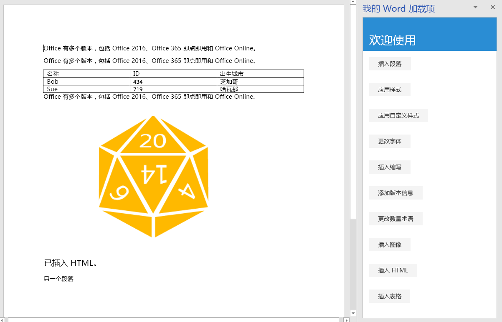

本教程的这一步是，了解如何在文档中插入图像、HTML 和表格。

> [!NOTE]
> 此页面介绍了 Word 加载项教程的步骤之一。如果是通过搜索引擎结果或其他直接链接到达此页面，请转到 [Word 加载项教程](../tutorials/word-tutorial.yml)介绍性页面，从头开始学习本教程。

## <a name="insert-an-image"></a>插入图像

1. 在代码编辑器中打开项目。 
2. 打开文件 index.html。
3. 在包含 `replace-text` 按钮的 `div` 下方，添加下列标记：

    ```html
    <div class="padding">            
        <button class="ms-Button" id="insert-image">Insert Image</button>            
    </div>
    ```

4. 打开 app.js 文件。

5. 在文件顶部附近的 use-strict 代码行正下方，添加下面的代码行。 此代码行导入另一个文件中的变量。 此变量是用于编码图像的 Base64 字符串。 若要查看已编码字符串，请打开项目根目录中的 base64Image.js 文件。

    ```js
    import { base64Image } from "./base64Image";
    ``` 

5. 在向 `replace-text` 按钮分配单击处理程序的代码行下方，添加下列代码：

    ```js
    $('#insert-image').click(insertImage);
    ```

6. 在 `replaceText` 函数下方，添加下列函数：

    ```js
    function insertImage() {
        Word.run(function (context) {
            
            // TODO1: Queue commands to insert an image.

            return context.sync();
        })
        .catch(function (error) {
            console.log("Error: " + error);
            if (error instanceof OfficeExtension.Error) {
                console.log("Debug info: " + JSON.stringify(error.debugInfo));
            }
        });
    }
    ``` 

7. 将 `TODO1` 替换为下面的代码。 请注意，此代码行在文档末尾插入 Base64 编码图像。 （`Paragraph` 对象还包含 `insertInlinePictureFromBase64` 方法和其他 `insert*` 方法。 有关示例，请参阅下面的 insertHTML 部分。）

    ```js
    context.document.body.insertInlinePictureFromBase64(base64Image, "End");
    ``` 

## <a name="insert-html"></a>插入 HTML

1. 打开文件 index.html。
2. 在包含 `insert-image` 按钮的 `div` 下方，添加下列标记：

    ```html
    <div class="padding">            
        <button class="ms-Button" id="insert-html">Insert HTML</button>            
    </div>
    ```

3. 打开 app.js 文件。

4. 在向 `insert-image` 按钮分配单击处理程序的代码行下方，添加下列代码：

    ```js
    $('#insert-html').click(insertHTML);
    ```

5. 在 `insertImage` 函数下方，添加下列函数：

    ```js
    function insertHTML() {
        Word.run(function (context) {
            
            // TODO1: Queue commands to insert a string of HTML.

            return context.sync();
        })
        .catch(function (error) {
            console.log("Error: " + error);
            if (error instanceof OfficeExtension.Error) {
                console.log("Debug info: " + JSON.stringify(error.debugInfo));
            }
        });
    }
    ``` 

6. 将 `TODO1` 替换为下面的代码。请注意以下几点：
   - 第一行代码在文档末尾添加空白段落。 
   - 第二行代码在段落末尾插入 HTML 字符串；具体而言是两个段落，一个设置使用 Verdana 字体格式，另一个采用 Word 文档的默认样式。 （如前面的 `insertImage` 方法一样，`context.document.body` 对象还包含 `insert*` 方法。）

    ```js
    const blankParagraph = context.document.body.paragraphs.getLast().insertParagraph("", "After");
    blankParagraph.insertHtml('<p style="font-family: verdana;">Inserted HTML.</p><p>Another paragraph</p>', "End");
    ``` 

## <a name="insert-table"></a>插入表格

1. 打开文件 index.html。
3. 在包含 `insert-html` 按钮的 `div` 下方，添加下列标记：

    ```html
    <div class="padding">            
        <button class="ms-Button" id="insert-table">Insert Table</button>            
    </div>
    ```

4. 打开 app.js 文件。

5. 在向 `insert-html` 按钮分配单击处理程序的代码行下方，添加下列代码：

    ```js
    $('#insert-table').click(insertTable);
    ```

6. 在 `insertHTML` 函数下方，添加下列函数：

    ```js
    function insertTable() {
        Word.run(function (context) {
            
            // TODO1: Queue commands to get a reference to the paragraph
            //        that will proceed the table.

            // TODO2: Queue commands to create a table and populate it with data.

            return context.sync();
        })
        .catch(function (error) {
            console.log("Error: " + error);
            if (error instanceof OfficeExtension.Error) {
                console.log("Debug info: " + JSON.stringify(error.debugInfo));
            }
        });
    }
    ``` 

7. 将 `TODO1` 替换为下面的代码。 请注意，此代码行先使用 `ParapgraphCollection.getFirst` 方法获取对第一个段落的引用，再使用 `Paragraph.getNext` 方法获取对第二个段落的引用。

    ```js
    const secondParagraph = context.document.body.paragraphs.getFirst().getNext();
    ``` 

8. 将 `TODO2` 替换为下面的代码。请注意以下几点：
   - 方法的前两个参数指定行数和列数。`insertTable`
   - 第三个参数指定要在哪里插入表格（在此示例中，是在段落后面插入）。
   - 第四个参数是用于设置表格单元格值的二维数组。
   - 虽然表格采用普通的默认样式，但 `insertTable` 方法返回的 `Table` 对象包含多个成员，其中部分成员用于设置表格样式。

     ```js
    const tableData = [
            ["Name", "ID", "Birth City"],
            ["Bob", "434", "Chicago"],
            ["Sue", "719", "Havana"],
        ];
    secondParagraph.insertTable(3, 3, "After", tableData);
    ``` 

## <a name="test-the-add-in"></a>测试加载项


1. 如果上一阶段教程中的 Git Bash 窗口或已启用 Node.JS 的系统命令提示符仍处于打开状态，请按 Ctrl+C 两次，停止正在运行的 Web 服务器。 否则，打开 Git Bash 窗口或已启用 Node.JS 的系统命令提示符，并转到项目的“开始”**** 文件夹。

     > [!NOTE]
     > 虽然只要更改任意文件（包括 app.js 文件），浏览器同步服务器就会在任务窗格中重新加载加载项，但它不会重新转换 JavaScript。因此，必须重复执行生成命令，这样对 app.js 做出的更改才会生效。 为此，需要终止服务器进程，这样才能看到提示并输入生成命令。 生成后，重启服务器。 接下来的几步操作就是在执行此过程。

2. 运行命令 `npm run build`，以将 ES6 源代码转换为所有可运行 Office 加载项的主机支持的旧版 JavaScript。
3. 运行命令 `npm start`，以启动在 localhost 上运行的 Web 服务器。
4. 通过关闭任务窗格来重新加载它，再选择“开始”**** 菜单上的“显示任务窗格”****，以重新打开加载项。
5. 在任务窗格中，至少选择“插入段落”**** 三次，以确保文档中有多个段落。
6. 选择“插入图像”**** 按钮，观察是否在文档末尾插入了图像。
7. 选择“插入 HTML”**** 按钮，观察是否在文档末尾插入了两个段落，第一个段落使用 Verdana 字体。
8. 选择“插入表格”**** 按钮，观察是否在第二个段落后面插入了表格。

    
