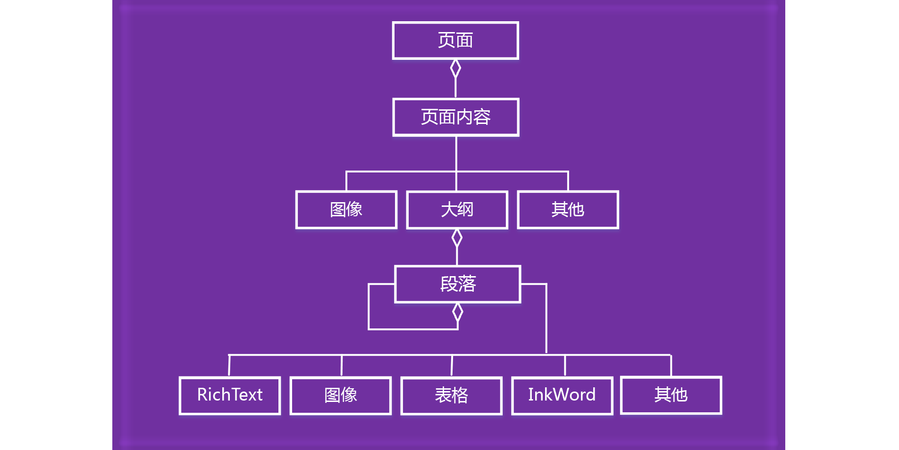

# 处理 OneNote 页面内容

在 OneNote 外接程序 JavaScript API 中，页面内容由以下对象模型表示。

  

- Page 对象包含一组 PageContent 对象。
- PageContent 对象包含类型为 Outline、Image 或 Other 的内容。
- Outline 对象包含一组 Paragraph 对象。
- Paragraph 对象包含 RichText、Image、Table 或 Other 这些内容类型。

若要创建空的 OneNote 页面，请使用下列方法之一：

- [Section.addPage](https://docs.microsoft.com/javascript/api/onenote/onenote.section#addpage-title-)
- [Page.insertPageAsSibling](https://docs.microsoft.com/javascript/api/onenote/onenote.section#insertsectionassibling-location--title-)

然后使用以下对象中的方法处理页面内容，如 `Page.addOutline` 和 `Outline.appendHtml`。

- [Page](https://docs.microsoft.com/javascript/api/onenote/onenote.page)
- [Outline](https://docs.microsoft.com/javascript/api/onenote/onenote.outline)
- [Paragraph](https://docs.microsoft.com/javascript/api/onenote/onenote.paragraph)

OneNote 页面的内容和结构由 HTML 进行表示。只有一部分 HTML 可用于创建或更新页面内容，如下所述。

## 受支持的 HTML

OneNote 外接程序 JavaScript API 支持使用以下 HTML 创建和更新页面内容：

- `<html>`, `<body>`, `
`, ``, ` `
- `
`
- ``
- `<a>`
- `<ul>`, `<ol>`, `<li>`
- `<table>`, `<tr>`, `<td>`
- `<h1>` ... `<h6>`
- `<b>`, `<em>`, `<strong>`, `<i>`, `<u>`, `<del>`, ``, ``, `<cite>`

> [!NOTE]
> 将 HTML 导入 OneNote 合并空白。 生成的内容将粘贴到一个大纲中。

OneNote 会尽力将 HTML 翻译成页面内容，同时确保用户的安全性。 HTML 和 CSS 标准并不完全与 OneNote 的内容模型匹配，因此，会存在外观上的差异，尤其是采用 CSS 样式时。 如果需要特定格式，则建议使用 JavaScript 对象。

## 访问页面内容

只可通过 `Page#load` 访问当前活动页的*页面内容*。若要更改活动页，请调用 `navigateToPage($page)`。

仍可查询任何页面的元数据（如标题）。

## 另请参阅

- [OneNote JavaScript API 编程概述](onenote-add-ins-programming-overview.md)
- [OneNote JavaScript API 参考](https://docs.microsoft.com/office/dev/add-ins/reference/overview/onenote-add-ins-javascript-reference)
- [Rubric Grader 示例](https://github.com/OfficeDev/OneNote-Add-in-Rubric-Grader)
- [Office 加载项平台概述](../overview/office-add-ins.md)
