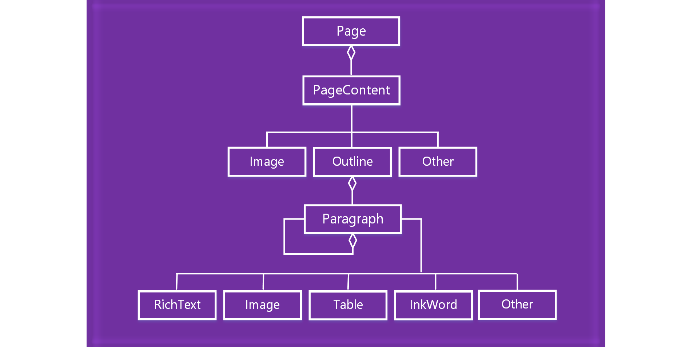

# 处理 OneNote 页面内容Work with OneNote page content 

在 OneNote 外接程序 JavaScript API 中，页面内容由以下对象模型表示。In the OneNote add-ins JavaScript API, page content is represented by the following object model.

  

- Page 对象包含一组 PageContent 对象。A Page object contains a collection of PageContent objects.
- PageContent 对象包含类型为 Outline、Image 或 Other 的内容。A PageContent object contains a content type of Outline, Image, or Other.
- Outline 对象包含一组 Paragraph 对象。An Outline object contains a collection of Paragraph objects.
- Paragraph 对象包含 RichText、Image、Table 或 Other 这些内容类型。A Paragraph object contains a content type of RichText, Image, Table, or Other.

若要创建空的 OneNote 页面，请使用下列方法之一：To create an empty OneNote page, use one of the following methods:

- [Section.addPageSection.addPage](https://dev.office.com/reference/add-ins/onenote/section#addpagetitle-string)
- [Page.insertPageAsSiblingPage.insertPageAsSibling](https://dev.office.com/reference/add-ins/onenote/page#insertpageassiblinglocation-string-title-string)

然后使用以下对象中的方法处理页面内容，如 Page.addOutline 和 Outline.appendHtml。Then use methods in the following objects to work with the page content, such as Page.addOutline and Outline.appendHtml. 

- [PagePage](https://dev.office.com/reference/add-ins/onenote/page)
- [OutlineOutline](https://dev.office.com/reference/add-ins/onenote/outline)
- [ParagraphParagraph](https://dev.office.com/reference/add-ins/onenote/paragraph)

OneNote 页面的内容和结构由 HTML 进行表示。只有一部分 HTML 可用于创建或更新页面内容，如下所述。The content and structure of a OneNote page are represented by HTML. Only a subset of HTML is supported for creating or updating page content, as described below.

## 受支持的 HTMLSupported HTML

OneNote 外接程序 JavaScript API 支持使用以下 HTML 创建和更新页面内容：The OneNote add-in JavaScript API supports the following HTML for creating and updating page content:

- `<html>`, `<body>`, `
`, ``, ` ` 
- `
`
- ``
- `<a>`
- `<ul>`, `<ol>`, `<li>` 
- `<table>`, `<tr>`, `<td>`
- `<h1>` ... `<h6>`
- `<b>`, `<em>`, `<strong>`, `<i>`, `<u>`, `<del>`, ``, ``, `<cite>`

## 访问页面内容Accessing page contents

只可通过 `Page#load` 访问当前活动页的*页面内容*。若要更改活动页，请调用 `navigateToPage($page)`。You are only able to access *Page Content* via `Page#load` for the currently active page. To change the active  page, invoke `navigateToPage($page)`.

仍可查询任何页面的元数据（如标题）。Metadata such as title can still be queried for any page.

## 另请参阅See also

- [OneNote JavaScript API 编程概述OneNote JavaScript API programming overview](onenote-add-ins-programming-overview.md)
- [OneNote JavaScript API 参考OneNote JavaScript API reference](https://dev.office.com/reference/add-ins/onenote/onenote-add-ins-javascript-reference)
- [Rubric Grader 示例Rubric Grader sample](https://github.com/OfficeDev/OneNote-Add-in-Rubric-Grader)
- [Office 加载项平台概述Office Add-ins platform overview](../overview/office-add-ins.md)
