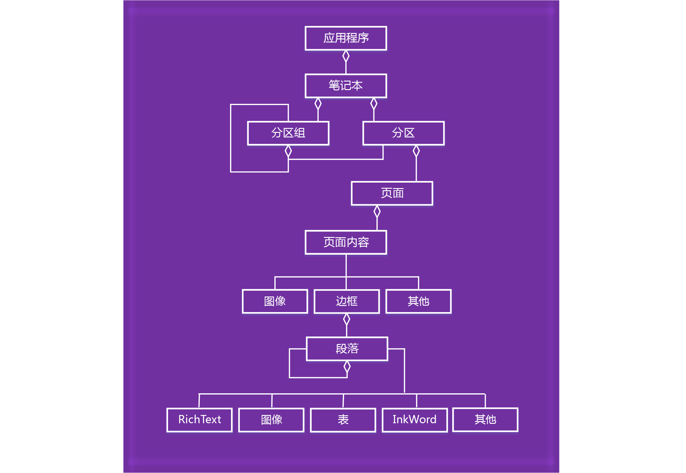

# <a name="onenote-javascript-api-programming-overview"></a><span data-ttu-id="a6cc2-102">OneNote JavaScript API 编程概述</span><span class="sxs-lookup"><span data-stu-id="a6cc2-102">OneNote JavaScript API programming overview</span></span>

<span data-ttu-id="a6cc2-103">OneNote 引入了适用于 OneNote Online 外接程序的 JavaScript API。你可以创建任务窗格外接程序、内容外接程序和与 OneNote 对象交互并连接至 Web 服务或其他基于 Web 的资源的外接程序命令。</span><span class="sxs-lookup"><span data-stu-id="a6cc2-103">OneNote introduces a JavaScript API for OneNote Online add-ins. You can create task pane add-ins, content add-ins, and add-in commands that interact with OneNote objects and connect to web services or other web-based resources.</span></span>

> [!NOTE]
> <span data-ttu-id="a6cc2-p101">如果计划将加载项[发布](../publish/publish.md)到 AppSource 并适用于 Office 体验，请务必遵循 [AppSource 验证策略](/office/dev/store/validation-policies)。例如，加载项必须适用于支持已定义方法的所有平台，才能通过验证（有关详细信息，请参阅[第 4.12 部分](/office/dev/store/validation-policies#4-apps-and-add-ins-behave-predictably)以及 [Office 加载项主机和可用性](../overview/office-add-in-availability.md)页面）。</span><span class="sxs-lookup"><span data-stu-id="a6cc2-p101">If you plan to [publish](../publish/publish.md) your add-in to AppSource and make it available within the Office experience, make sure that you conform to the [AppSource validation policies](/office/dev/store/validation-policies). For example, to pass validation, your add-in must work across all platforms that support the methods that you define (for more information, see [section 4.12](/office/dev/store/validation-policies#4-apps-and-add-ins-behave-predictably) and the [Office Add-in host and availability page](../overview/office-add-in-availability.md)).</span></span>

## <a name="components-of-an-office-add-in"></a><span data-ttu-id="a6cc2-106">Office 加载项的组件</span><span class="sxs-lookup"><span data-stu-id="a6cc2-106">Components of an Office Add-in</span></span>

<span data-ttu-id="a6cc2-107">加载项由两个基本部分组成：</span><span class="sxs-lookup"><span data-stu-id="a6cc2-107">Add-ins consist of two basic components:</span></span>

- <span data-ttu-id="a6cc2-p102">**Web 应用程序**包含网页和任何所需的 JavaScript、CSS 或其他文件。这些文件托管在 Web 服务器或 Web 托管服务上，例如 Microsoft Azure。在 OneNote Online 中，Web 应用程序在浏览器控件或 iframe 中显示。</span><span class="sxs-lookup"><span data-stu-id="a6cc2-p102">A **web application** consisting of a webpage and any required JavaScript, CSS, or other files. These files are hosted on a web server or web hosting service, such as Microsoft Azure. In OneNote Online, the web application displays in a browser control or iframe.</span></span>

- <span data-ttu-id="a6cc2-p103">**XML 清单**指定外接程序网页的 URL 和适用于外接程序的任何访问要求、设置和功能。此文件存储在客户端上。OneNote 外接程序使用与其他 Office 外接程序相同的 [清单](../develop/add-in-manifests.md)格式。</span><span class="sxs-lookup"><span data-stu-id="a6cc2-p103">An **XML manifest** that specifies the URL of the add-in's webpage and any access requirements, settings, and capabilities for the add-in. This file is stored on the client. OneNote add-ins use the same [manifest](../develop/add-in-manifests.md) format as other Office Add-ins.</span></span>

<span data-ttu-id="a6cc2-114">**Office 加载项 = 清单 + 网页**</span><span class="sxs-lookup"><span data-stu-id="a6cc2-114">**Office Add-in = Manifest + Webpage**</span></span>


## <a name="using-the-javascript-api"></a><span data-ttu-id="a6cc2-116">使用 JavaScript API</span><span class="sxs-lookup"><span data-stu-id="a6cc2-116">Using the JavaScript API</span></span>

<span data-ttu-id="a6cc2-p104">加载项使用托管应用程序的运行时上下文以访问 JavaScript API。API 有两层：</span><span class="sxs-lookup"><span data-stu-id="a6cc2-p104">Add-ins use the runtime context of the host application to access the JavaScript API. The API has two layers:</span></span> 

- <span data-ttu-id="a6cc2-119">用于执行 OneNote 专属操作的**主机特定 API**，可通过 **Application** 对象访问。</span><span class="sxs-lookup"><span data-stu-id="a6cc2-119">A **host-specific API** for OneNote-specific operations, accessed through the **Application** object.</span></span>
- <span data-ttu-id="a6cc2-120">跨 Office 应用程序分享的**通用 API**，通过**Document** 对象访问。</span><span class="sxs-lookup"><span data-stu-id="a6cc2-120">A **Common API** that's shared across Office applications, accessed through the **Document** object.</span></span>

### <a name="accessing-the-host-specific-api-through-the-application-object"></a><span data-ttu-id="a6cc2-121">通过 *Application* 对象访问主机特定 API。</span><span class="sxs-lookup"><span data-stu-id="a6cc2-121">Accessing the host-specific API through the *Application* object</span></span>

<span data-ttu-id="a6cc2-122">**Application** 对象可用于访问 OneNote 对象，如 **Notebook**、**Section** 和 **Page**。</span><span class="sxs-lookup"><span data-stu-id="a6cc2-122">Use the **Application** object to access OneNote objects such as **Notebook**, **Section**, and **Page**.</span></span> <span data-ttu-id="a6cc2-123">通过主机特定 API，可在代理对象上运行批处理操作。</span><span class="sxs-lookup"><span data-stu-id="a6cc2-123">With host-specific APIs, you run batch operations on proxy objects.</span></span> <span data-ttu-id="a6cc2-124">基本流程类似如下：</span><span class="sxs-lookup"><span data-stu-id="a6cc2-124">The basic flow goes something like this:</span></span> 

1. <span data-ttu-id="a6cc2-125">从上下文中获取应用程序实例。</span><span class="sxs-lookup"><span data-stu-id="a6cc2-125">Get the application instance from the context.</span></span>

2. <span data-ttu-id="a6cc2-p106">创建您想要使用的表示 OneNote 对象的代理。通过读取和写入代理对象的属性和调用其方法，您可以与其同步交互。</span><span class="sxs-lookup"><span data-stu-id="a6cc2-p106">Create a proxy that represents the OneNote object you want to work with. You interact synchronously with proxy objects by reading and writing their properties and calling their methods.</span></span>

3. <span data-ttu-id="a6cc2-p107">调用代理上的 **load** 以使用在参数中指定的属性值填充它。此调用将添加至命令队列中。</span><span class="sxs-lookup"><span data-stu-id="a6cc2-p107">Call **load** on the proxy to fill it with the property values specified in the parameter. This call is added to the queue of commands.</span></span>

   > [!NOTE]
   > <span data-ttu-id="a6cc2-130">API 方法调用（如 `context.application.getActiveSection().pages;`）也会添加到队列中。</span><span class="sxs-lookup"><span data-stu-id="a6cc2-130">Method calls to the API (such as `context.application.getActiveSection().pages;`) are also added to the queue.</span></span>

4. <span data-ttu-id="a6cc2-p108">调用 **context.sync** 以按它们已排队的顺序运行所有排队的命令。这将同步您正在运行的脚本和真实对象之间的状态，并通过检索已加载的用于您的脚本的 OneNote 对象的属性实现。您可以使用返回的 promise 对象以链接其他操作。</span><span class="sxs-lookup"><span data-stu-id="a6cc2-p108">Call **context.sync** to run all queued commands in the order that they were queued. This synchronizes the state between your running script and the real objects, and by retrieving properties of loaded OneNote objects for use in your script. You can use the returned promise object for chaining additional actions.</span></span>

<span data-ttu-id="a6cc2-134">例如：</span><span class="sxs-lookup"><span data-stu-id="a6cc2-134">For example:</span></span>

```js
function getPagesInSection() {
    OneNote.run(function (context) {

        // Get the pages in the current section.
        var pages = context.application.getActiveSection().pages;

        // Queue a command to load the id and title for each page.
        pages.load('id,title');

        // Run the queued commands, and return a promise to indicate task completion.
        return context.sync()
            .then(function () {

                // Read the id and title of each page.
                $.each(pages.items, function(index, page) {
                    var pageId = page.id;
                    var pageTitle = page.title;
                    console.log(pageTitle + ': ' + pageId);
                });
            })
            .catch(function (error) {
                app.showNotification("Error: " + error);
                console.log("Error: " + error);
                if (error instanceof OfficeExtension.Error) {
                    console.log("Debug info: " + JSON.stringify(error.debugInfo));
                }
            });
    });
}
```

<span data-ttu-id="a6cc2-135">可以在 [API 参考](/office/dev/add-ins/reference/overview/onenote-add-ins-javascript-reference) 中找到受支持的 OneNote 对象和操作。</span><span class="sxs-lookup"><span data-stu-id="a6cc2-135">You can find supported OneNote objects and operations in the [API reference](/office/dev/add-ins/reference/overview/onenote-add-ins-javascript-reference).</span></span>

### <a name="accessing-the-common-api-through-the-document-object"></a><span data-ttu-id="a6cc2-136">通过 *Document* 对象访问通用 API</span><span class="sxs-lookup"><span data-stu-id="a6cc2-136">Accessing the Common API through the *Document* object</span></span>

<span data-ttu-id="a6cc2-137">使用 **Document** 对象以访问通用 API，例如 [getSelectedDataAsync](/javascript/api/office/office.document#getselecteddataasync-coerciontype--options--callback-) 和 [setSelectedDataAsync](/javascript/api/office/office.document#setselecteddataasync-data--options--callback-) 方法。</span><span class="sxs-lookup"><span data-stu-id="a6cc2-137">Use the **Document** object to access the Common API, such as the [getSelectedDataAsync](/javascript/api/office/office.document#getselecteddataasync-coerciontype--options--callback-) and [setSelectedDataAsync](/javascript/api/office/office.document#setselecteddataasync-data--options--callback-) methods.</span></span> 


<span data-ttu-id="a6cc2-138">例如：</span><span class="sxs-lookup"><span data-stu-id="a6cc2-138">For example:</span></span>  

```js
function getSelectionFromPage() {
    Office.context.document.getSelectedDataAsync(
        Office.CoercionType.Text,
        { valueFormat: "unformatted" },
        function (asyncResult) {
            var error = asyncResult.error;
            if (asyncResult.status === Office.AsyncResultStatus.Failed) {
                console.log(error.message);
            }
            else $('#input').val(asyncResult.value);
        });
}
```

<span data-ttu-id="a6cc2-139">OneNote 加载项仅支持以下通用 API：</span><span class="sxs-lookup"><span data-stu-id="a6cc2-139">OneNote add-ins support only the following Common APIs:</span></span>

| <span data-ttu-id="a6cc2-140">API</span><span class="sxs-lookup"><span data-stu-id="a6cc2-140">API</span></span> | <span data-ttu-id="a6cc2-141">注释</span><span class="sxs-lookup"><span data-stu-id="a6cc2-141">Notes</span></span> |
|:------|:------|
| [<span data-ttu-id="a6cc2-142">Office.context.document.getSelectedDataAsync</span><span class="sxs-lookup"><span data-stu-id="a6cc2-142">Office.context.document.getSelectedDataAsync</span></span>](/javascript/api/office/office.document#getselecteddataasync-coerciontype--options--callback-) | <span data-ttu-id="a6cc2-143">仅限 **Office.CoercionType.Text** 和 **Office.CoercionType.Matrix**</span><span class="sxs-lookup"><span data-stu-id="a6cc2-143">**Office.CoercionType.Text** and **Office.CoercionType.Matrix** only</span></span> |
| [<span data-ttu-id="a6cc2-144">Office.context.document.setSelectedDataAsync</span><span class="sxs-lookup"><span data-stu-id="a6cc2-144">Office.context.document.setSelectedDataAsync</span></span>](/javascript/api/office/office.document#setselecteddataasync-data--options--callback-) | <span data-ttu-id="a6cc2-145">仅限 **Office.CoercionType.Text**、**Office.CoercionType.Image** 和 **Office.CoercionType.Html**</span><span class="sxs-lookup"><span data-stu-id="a6cc2-145">**Office.CoercionType.Text**, **Office.CoercionType.Image**, and **Office.CoercionType.Html** only</span></span> | 
| [<span data-ttu-id="a6cc2-146">var mySetting = Office.context.document.settings.get(name);</span><span class="sxs-lookup"><span data-stu-id="a6cc2-146">var mySetting = Office.context.document.settings.get(name);</span></span>](/javascript/api/office/office.settings#get-name-) | <span data-ttu-id="a6cc2-147">设置仅受内容外接程序支持</span><span class="sxs-lookup"><span data-stu-id="a6cc2-147">Settings are supported by content add-ins only</span></span> | 
| [<span data-ttu-id="a6cc2-148">Office.context.document.settings.set(name, value);</span><span class="sxs-lookup"><span data-stu-id="a6cc2-148">Office.context.document.settings.set(name, value);</span></span>](/javascript/api/office/office.settings#set-name--value-) | <span data-ttu-id="a6cc2-149">设置仅受内容外接程序支持</span><span class="sxs-lookup"><span data-stu-id="a6cc2-149">Settings are supported by content add-ins only</span></span> | 
| [<span data-ttu-id="a6cc2-150">Office.EventType.DocumentSelectionChanged</span><span class="sxs-lookup"><span data-stu-id="a6cc2-150">Office.EventType.DocumentSelectionChanged</span></span>](/javascript/api/office/office.documentselectionchangedeventargs) ||

<span data-ttu-id="a6cc2-151">一般情况下，仅使用通用 API 执行主机特定 API 不支持的操作。</span><span class="sxs-lookup"><span data-stu-id="a6cc2-151">In general, you only use the Common API to do something that isn't supported in the host-specific API.</span></span> <span data-ttu-id="a6cc2-152">若要详细了解如何使用通用 API，请参阅 Office 加载项[文档](../overview/office-add-ins.md)和[参考](../reference/javascript-api-for-office.md)。</span><span class="sxs-lookup"><span data-stu-id="a6cc2-152">To learn more about using the Common API, see the Office Add-ins [documentation](../overview/office-add-ins.md) and [reference](../reference/javascript-api-for-office.md).</span></span>


<a name="om-diagram"></a>
## <a name="onenote-object-model-diagram"></a><span data-ttu-id="a6cc2-153">OneNote 对象模型图</span><span class="sxs-lookup"><span data-stu-id="a6cc2-153">OneNote object model diagram</span></span> 
<span data-ttu-id="a6cc2-154">下图表示了 OneNote JavaScript API 中当前可用的内容。</span><span class="sxs-lookup"><span data-stu-id="a6cc2-154">The following diagram represents what's currently available in the OneNote JavaScript API.</span></span>

  


## <a name="see-also"></a><span data-ttu-id="a6cc2-156">另请参阅</span><span class="sxs-lookup"><span data-stu-id="a6cc2-156">See also</span></span>

- [<span data-ttu-id="a6cc2-157">生成首个 OneNote 加载项</span><span class="sxs-lookup"><span data-stu-id="a6cc2-157">Build your first OneNote add-in</span></span>](../quickstarts/onenote-quickstart.md)
- [<span data-ttu-id="a6cc2-158">OneNote JavaScript API 参考</span><span class="sxs-lookup"><span data-stu-id="a6cc2-158">OneNote JavaScript API reference</span></span>](/office/dev/add-ins/reference/overview/onenote-add-ins-javascript-reference)
- [<span data-ttu-id="a6cc2-159">Rubric Grader 示例</span><span class="sxs-lookup"><span data-stu-id="a6cc2-159">Rubric Grader sample</span></span>](https://github.com/OfficeDev/OneNote-Add-in-Rubric-Grader)
- [<span data-ttu-id="a6cc2-160">Office 加载项平台概述</span><span class="sxs-lookup"><span data-stu-id="a6cc2-160">Office Add-ins platform overview</span></span>](../overview/office-add-ins.md)
