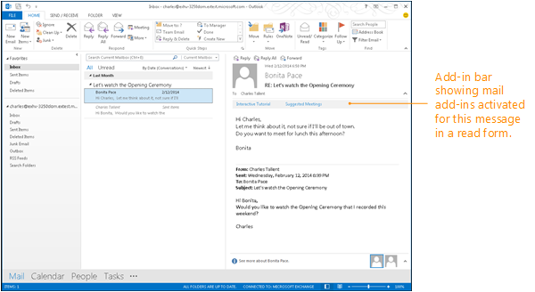

# <a name="activation-rules-for-contextual-outlook-add-ins"></a><span data-ttu-id="208b0-103">上下文 Outlook 加载项的激活规则</span><span class="sxs-lookup"><span data-stu-id="208b0-103">Activation rules for contextual Outlook add-ins</span></span>

<span data-ttu-id="208b0-p101">如果用户正在读取或撰写的邮件或约会符合外接程序的激活规则，则 Outlook 将激活某些类型的外接程序。这一点对使用 1.1 清单架构的所有外接程序均适用。然后，用户可从 Outlook UI 选择外接程序，以开始将其用于当前项目。</span><span class="sxs-lookup"><span data-stu-id="208b0-p101">Outlook activates some types of add-ins if the message or appointment that the user is reading or composing satisfies the activation rules of the add-in. This is true for all add-ins that use the 1.1 manifest schema. The user can then choose the add-in from the Outlook UI to start it for the current item.</span></span>

<span data-ttu-id="208b0-107">下图显示在“阅读”窗格中的邮件的外接程序栏中激活的 Outlook 外接程序。</span><span class="sxs-lookup"><span data-stu-id="208b0-107">The following figure shows Outlook add-ins activated in the add-in bar for the message in the Reading Pane.</span></span>




## <a name="specify-activation-rules-in-a-manifest"></a><span data-ttu-id="208b0-109">在清单中指定激活规则</span><span class="sxs-lookup"><span data-stu-id="208b0-109">Specify activation rules in a manifest</span></span>


<span data-ttu-id="208b0-110">若要让 Outlook 为特定条件激活外接程序，请使用以下元素之一在外接程序清单中指定激活规则 `Rule` ：</span><span class="sxs-lookup"><span data-stu-id="208b0-110">To have Outlook activate an add-in for specific conditions, specify activation rules in the add-in manifest by using one of the following `Rule` elements:</span></span>

- <span data-ttu-id="208b0-111">[Rule 元素 (MailApp complexType)](../reference/manifest/rule.md) - 指定单个规则。</span><span class="sxs-lookup"><span data-stu-id="208b0-111">[Rule element (MailApp complexType)](../reference/manifest/rule.md) - Specifies an individual rule.</span></span>
- <span data-ttu-id="208b0-112">[Rule 元素 (RuleCollection complexType)](../reference/manifest/rule.md#rulecollection) - 使用逻辑操作组合多个规则。</span><span class="sxs-lookup"><span data-stu-id="208b0-112">[Rule element (RuleCollection complexType)](../reference/manifest/rule.md#rulecollection) - Combines multiple rules using logical operations.</span></span>
    

 > [!NOTE]
 > <span data-ttu-id="208b0-113">`Rule`用于指定单个规则的元素是抽象的[rule](../reference/manifest/rule.md)复杂类型。</span><span class="sxs-lookup"><span data-stu-id="208b0-113">The `Rule` element that you use to specify an individual rule is of the abstract [Rule](../reference/manifest/rule.md) complex type.</span></span> <span data-ttu-id="208b0-114">以下每种类型的规则扩展此抽象 `Rule` 复杂类型。</span><span class="sxs-lookup"><span data-stu-id="208b0-114">Each of the following types of rules extends this abstract `Rule` complex type.</span></span> <span data-ttu-id="208b0-115">因此当你在清单中指定单个规则时，你必须使用 [xsi:type](https://www.w3.org/TR/xmlschema-1/) 属性来进一步定义某个以下类型的规则。</span><span class="sxs-lookup"><span data-stu-id="208b0-115">So when you specify an individual rule in a manifest, you must use the [xsi:type](https://www.w3.org/TR/xmlschema-1/) attribute to further define one of the following types of rules.</span></span>
 > 
 > <span data-ttu-id="208b0-116">例如，以下规则定义了 [ItemIs](../reference/manifest/rule.md#itemis-rule) 规则：`<Rule xsi:type="ItemIs" ItemType="Message" />`</span><span class="sxs-lookup"><span data-stu-id="208b0-116">For example, the following rule defines an [ItemIs](../reference/manifest/rule.md#itemis-rule) rule: `<Rule xsi:type="ItemIs" ItemType="Message" />`</span></span>
 > 
 > <span data-ttu-id="208b0-117">该 `FormType` 属性适用于清单 v1.1 中的激活规则，但未在 v1.0 中定义 `VersionOverrides` 。</span><span class="sxs-lookup"><span data-stu-id="208b0-117">The `FormType` attribute applies to activation rules in the manifest v1.1 but is not defined in `VersionOverrides` v1.0.</span></span> <span data-ttu-id="208b0-118">因此，当在节点中使用 [ItemIs](../reference/manifest/rule.md#itemis-rule) 时，不能使用它 `VersionOverrides` 。</span><span class="sxs-lookup"><span data-stu-id="208b0-118">So it can't be used when [ItemIs](../reference/manifest/rule.md#itemis-rule) is used in the `VersionOverrides` node.</span></span>

<span data-ttu-id="208b0-p104">下表列出了可用的规则类型。你可以在表后面以及[创建适用于阅读窗体的 Outlook 外接程序](read-scenario.md)中指定的文章中查找更多信息。</span><span class="sxs-lookup"><span data-stu-id="208b0-p104">The following table lists the types of rules that are available. You can find more information following the table and in the specified articles under [Create Outlook add-ins for read forms](read-scenario.md).</span></span>

<br/>

|<span data-ttu-id="208b0-121">**规则名称**</span><span class="sxs-lookup"><span data-stu-id="208b0-121">**Rule name**</span></span>|<span data-ttu-id="208b0-122">**适用的窗体**</span><span class="sxs-lookup"><span data-stu-id="208b0-122">**Applicable forms**</span></span>|<span data-ttu-id="208b0-123">**说明**</span><span class="sxs-lookup"><span data-stu-id="208b0-123">**Description**</span></span>|
|:-----|:-----|:-----|
|[<span data-ttu-id="208b0-124">ItemIs</span><span class="sxs-lookup"><span data-stu-id="208b0-124">ItemIs</span></span>](#itemis-rule)|<span data-ttu-id="208b0-125">读取，撰写</span><span class="sxs-lookup"><span data-stu-id="208b0-125">Read, Compose</span></span>|<span data-ttu-id="208b0-p105">检查当前项目是否属于指定类型（邮件或约会），另外还可以检查项目类别、窗体类型和（可选）项目邮件类别。</span><span class="sxs-lookup"><span data-stu-id="208b0-p105">Checks to see whether the current item is of the specified type (message or appointment). Can also check the item class and form type.and optionally, item message class.</span></span>|
|[<span data-ttu-id="208b0-128">ItemHasAttachment</span><span class="sxs-lookup"><span data-stu-id="208b0-128">ItemHasAttachment</span></span>](#itemhasattachment-rule)|<span data-ttu-id="208b0-129">读取</span><span class="sxs-lookup"><span data-stu-id="208b0-129">Read</span></span>|<span data-ttu-id="208b0-130">检查所选项是否包含附件。</span><span class="sxs-lookup"><span data-stu-id="208b0-130">Checks to see whether the selected item contains an attachment.</span></span>|
|[<span data-ttu-id="208b0-131">ItemHasKnownEntity</span><span class="sxs-lookup"><span data-stu-id="208b0-131">ItemHasKnownEntity</span></span>](#itemhasknownentity-rule)|<span data-ttu-id="208b0-132">读取</span><span class="sxs-lookup"><span data-stu-id="208b0-132">Read</span></span>|<span data-ttu-id="208b0-p106">检查所选项是否包含一个或多个已知实体。更多信息：[将 Outlook 项中的字符串作为已知实体进行匹配](match-strings-in-an-item-as-well-known-entities.md)。</span><span class="sxs-lookup"><span data-stu-id="208b0-p106">Checks to see whether the selected item contains one or more well-known entities. More information: [Match strings in an Outlook item as well-known entities](match-strings-in-an-item-as-well-known-entities.md).</span></span>|
|[<span data-ttu-id="208b0-135">ItemHasRegularExpressionMatch</span><span class="sxs-lookup"><span data-stu-id="208b0-135">ItemHasRegularExpressionMatch</span></span>](#itemhasregularexpressionmatch-rule)|<span data-ttu-id="208b0-136">读取</span><span class="sxs-lookup"><span data-stu-id="208b0-136">Read</span></span>|<span data-ttu-id="208b0-137">检查发件人的电子邮件地址、所选项的主题和/或所选项的正文是否包含正则表达式的匹配项。更多信息： [使用正则表达式激活规则显示 Outlook 外接程序](use-regular-expressions-to-show-an-outlook-add-in.md)。</span><span class="sxs-lookup"><span data-stu-id="208b0-137">Checks to see whether the sender's email address, the subject, and/or the body of the selected item contains a match to a regular expression.More information: [Use regular expression activation rules to show an Outlook add-in](use-regular-expressions-to-show-an-outlook-add-in.md).</span></span>|
|[<span data-ttu-id="208b0-138">RuleCollection</span><span class="sxs-lookup"><span data-stu-id="208b0-138">RuleCollection</span></span>](#rulecollection-rule)|<span data-ttu-id="208b0-139">读取，撰写</span><span class="sxs-lookup"><span data-stu-id="208b0-139">Read, Compose</span></span>|<span data-ttu-id="208b0-140">组合一组规则以便形成更复杂的规则。</span><span class="sxs-lookup"><span data-stu-id="208b0-140">Combines a set of rules so that you can form more complex rules.</span></span>|

## <a name="itemis-rule"></a><span data-ttu-id="208b0-141">ItemIs 规则</span><span class="sxs-lookup"><span data-stu-id="208b0-141">ItemIs rule</span></span>

<span data-ttu-id="208b0-142">**ItemIs** 复杂类型定义一个计算结果为 **true** 的规则（如果当前项与项类型匹配）和（可选）项邮件类别（如果在规则中指明）。</span><span class="sxs-lookup"><span data-stu-id="208b0-142">The **ItemIs** complex type defines a rule that evaluates to **true** if the current item matches the item type, and optionally the item message class if it's stated in the rule.</span></span>

<span data-ttu-id="208b0-143">在 ItemIs 规则的属性中指定以下项类型之一 `ItemType` 。 **ItemIs**</span><span class="sxs-lookup"><span data-stu-id="208b0-143">Specify one of the following item types in the `ItemType` attribute of an **ItemIs** rule.</span></span> <span data-ttu-id="208b0-144">可以在清单中指定多个 **ItemIs** 规则。</span><span class="sxs-lookup"><span data-stu-id="208b0-144">You can specify more than one **ItemIs** rule in a manifest.</span></span> <span data-ttu-id="208b0-145">ItemType simpleType 定义了支持 Outlook 加载项的 Outlook 项类型。</span><span class="sxs-lookup"><span data-stu-id="208b0-145">The ItemType simpleType defines the types of Outlook items that support Outlook add-ins.</span></span>

<br/>

|<span data-ttu-id="208b0-146">**Value**</span><span class="sxs-lookup"><span data-stu-id="208b0-146">**Value**</span></span>|<span data-ttu-id="208b0-147">**说明**</span><span class="sxs-lookup"><span data-stu-id="208b0-147">**Description**</span></span>|
|:-----|:-----|
|<span data-ttu-id="208b0-148">**约会**</span><span class="sxs-lookup"><span data-stu-id="208b0-148">**Appointment**</span></span>|<span data-ttu-id="208b0-p108">在 Outlook 日历中指定一个项目。这包括已获取响应并且具有组织者和参与者的会议项目，或者没有组织者或参与者且仅为日历上的一个项目的约会。这与 Outlook 中的 IPM.Appointment 邮件类别相对应。</span><span class="sxs-lookup"><span data-stu-id="208b0-p108">Specifies an item in an Outlook calendar. This includes a meeting item that has been responded to and has an organizer and attendees, or an appointment that does not have an organizer or attendee and is simply an item on the calendar.This corresponds to the IPM.Appointment message class in Outlook.</span></span>|
|<span data-ttu-id="208b0-151">**邮件**</span><span class="sxs-lookup"><span data-stu-id="208b0-151">**Message**</span></span>|<span data-ttu-id="208b0-152">指定通常在"收件箱"中收到的以下项目之一：</span><span class="sxs-lookup"><span data-stu-id="208b0-152">Specifies one of the following items received in typically the Inbox:</span></span> <ul><li><p><span data-ttu-id="208b0-p109">电子邮件。这与 Outlook 中的 IPM.Note 邮件类别相对应。</span><span class="sxs-lookup"><span data-stu-id="208b0-p109">An email message. This corresponds to the IPM.Note message class in Outlook.</span></span></p></li><li><p><span data-ttu-id="208b0-p110">会议请求、响应或取消。对应于 Outlook 中的以下邮件类别：</span><span class="sxs-lookup"><span data-stu-id="208b0-p110">A meeting request, response, or cancellation. This corresponds to the following  message classes in Outlook:</span></span></p><p><span data-ttu-id="208b0-157">IPM.Schedule.Meeting.Request</span><span class="sxs-lookup"><span data-stu-id="208b0-157">IPM.Schedule.Meeting.Request</span></span></p><p><span data-ttu-id="208b0-158">IPM.Schedule.Meeting.Neg</span><span class="sxs-lookup"><span data-stu-id="208b0-158">IPM.Schedule.Meeting.Neg</span></span></p><p><span data-ttu-id="208b0-159">IPM.Schedule.Meeting.Pos</span><span class="sxs-lookup"><span data-stu-id="208b0-159">IPM.Schedule.Meeting.Pos</span></span></p><p><span data-ttu-id="208b0-160">IPM.Schedule.Meeting.Tent</span><span class="sxs-lookup"><span data-stu-id="208b0-160">IPM.Schedule.Meeting.Tent</span></span></p><p><span data-ttu-id="208b0-161">IPM.Schedule.Meeting.Canceled</span><span class="sxs-lookup"><span data-stu-id="208b0-161">IPM.Schedule.Meeting.Canceled</span></span></p></li></ul>|

<span data-ttu-id="208b0-162">该 `FormType` 属性用于指定应在其中激活加载项)  (阅读或撰写的模式。</span><span class="sxs-lookup"><span data-stu-id="208b0-162">The `FormType` attribute is used to specify the mode (read or compose) in which the add-in should activate.</span></span>


 > [!NOTE]
 > <span data-ttu-id="208b0-163">ItemIs `FormType` 属性在架构 v1.1 和更高版本中定义，而不是在 v1.0 中定义 `VersionOverrides` 。</span><span class="sxs-lookup"><span data-stu-id="208b0-163">The ItemIs `FormType` attribute is defined in schema v1.1 and later but not in `VersionOverrides` v1.0.</span></span> <span data-ttu-id="208b0-164">`FormType`在定义加载项命令时不包括属性。</span><span class="sxs-lookup"><span data-stu-id="208b0-164">Do not include the `FormType` attribute when defining add-in commands.</span></span>

<span data-ttu-id="208b0-165">激活外接程序后，可以使用 [mailbox.item](../reference/objectmodel/preview-requirement-set/office.context.mailbox.item.md) 属性获取 Outlook 中的当前所选项，以及使用 [item.itemType](../reference/objectmodel/preview-requirement-set/office.context.mailbox.item.md#properties) 属性获取当前项的类型。</span><span class="sxs-lookup"><span data-stu-id="208b0-165">After an add-in is activated, you can use the [mailbox.item](../reference/objectmodel/preview-requirement-set/office.context.mailbox.item.md) property to obtain the currently selected item in Outlook, and the [item.itemType](../reference/objectmodel/preview-requirement-set/office.context.mailbox.item.md#properties) property to obtain the type of the current item.</span></span>

<span data-ttu-id="208b0-166">您可以选择使用 `ItemClass` 属性来指定项目的邮件类，并 `IncludeSubClasses` 指定当项目是指定类的子类时，该规则是否应为 **true** 的属性。</span><span class="sxs-lookup"><span data-stu-id="208b0-166">You can optionally use the `ItemClass` attribute to specify the message class of the item, and the `IncludeSubClasses` attribute to specify whether the rule should be **true** when the item is a subclass of the specified class.</span></span>

<span data-ttu-id="208b0-167">若要详细了解邮件类，请参阅[项类型和邮件类](/office/vba/outlook/Concepts/Forms/item-types-and-message-classes)。</span><span class="sxs-lookup"><span data-stu-id="208b0-167">For more information about message classes, see [Item Types and Message Classes](/office/vba/outlook/Concepts/Forms/item-types-and-message-classes).</span></span>

<span data-ttu-id="208b0-168">下面的示例展示了 **ItemIs** 规则，可便于用户在阅读邮件时在 Outlook 加载项栏中看到加载项：</span><span class="sxs-lookup"><span data-stu-id="208b0-168">The following example is an **ItemIs** rule that lets users see the add-in in the Outlook add-in bar when the user is reading a message:</span></span>

```xml
<Rule xsi:type="ItemIs" ItemType="Message" FormType="Read" />
```

<span data-ttu-id="208b0-169">下面的示例展示了 **ItemIs** 规则，可便于用户在阅读邮件或约会时在 Outlook 加载项栏中看到加载项。</span><span class="sxs-lookup"><span data-stu-id="208b0-169">The following example is an **ItemIs** rule that lets users see the add-in in the Outlook add-in bar when the user is reading a message or appointment.</span></span>

```xml
<Rule xsi:type="RuleCollection" Mode="Or">
  <Rule xsi:type="ItemIs" ItemType="Message" FormType="Read" />
  <Rule xsi:type="ItemIs" ItemType="Appointment" FormType="Read" />
</Rule>
```


## <a name="itemhasattachment-rule"></a><span data-ttu-id="208b0-170">ItemHasAttachment 规则</span><span class="sxs-lookup"><span data-stu-id="208b0-170">ItemHasAttachment rule</span></span>


<span data-ttu-id="208b0-171">`ItemHasAttachment`复杂类型定义检查所选项目是否包含附件的规则。</span><span class="sxs-lookup"><span data-stu-id="208b0-171">The `ItemHasAttachment` complex type defines a rule that checks if the selected item contains an attachment.</span></span>

```xml
<Rule xsi:type="ItemHasAttachment" />
```


## <a name="itemhasknownentity-rule"></a><span data-ttu-id="208b0-172">ItemHasKnownEntity 规则</span><span class="sxs-lookup"><span data-stu-id="208b0-172">ItemHasKnownEntity rule</span></span>

<span data-ttu-id="208b0-p112">在将项目提供给外接程序之前，服务器会检查它以确定主题和正文是否包含任何可能是已知实体之一的文本。如果找到这些实体中的任何实体，则会将其放置在通过使用 `getEntities` 该项目的或方法访问的已知实体集合中 `getEntitiesByType` 。</span><span class="sxs-lookup"><span data-stu-id="208b0-p112">Before an item is made available to an add-in, the server examines it to determine whether the subject and body contain any text that is likely to be one of the known entities. If any of these entities are found, it is placed in a collection of known entities that you access by using the `getEntities` or `getEntitiesByType` method of that item.</span></span>

<span data-ttu-id="208b0-p113">您可以通过使用 `ItemHasKnownEntity` 来指定当项目中存在指定类型的实体时显示您的外接程序的规则。您可以在规则的属性中指定以下已知实体 `EntityType` `ItemHasKnownEntity` ：</span><span class="sxs-lookup"><span data-stu-id="208b0-p113">You can specify a rule by using `ItemHasKnownEntity` that shows your add-in when an entity of the specified type is present in the item. You can specify the following known entities in the `EntityType` attribute of an `ItemHasKnownEntity` rule:</span></span>

- <span data-ttu-id="208b0-177">Address</span><span class="sxs-lookup"><span data-stu-id="208b0-177">Address</span></span>
- <span data-ttu-id="208b0-178">Contact</span><span class="sxs-lookup"><span data-stu-id="208b0-178">Contact</span></span>
- <span data-ttu-id="208b0-179">EmailAddress</span><span class="sxs-lookup"><span data-stu-id="208b0-179">EmailAddress</span></span>
- <span data-ttu-id="208b0-180">MeetingSuggestion</span><span class="sxs-lookup"><span data-stu-id="208b0-180">MeetingSuggestion</span></span>
- <span data-ttu-id="208b0-181">PhoneNumber</span><span class="sxs-lookup"><span data-stu-id="208b0-181">PhoneNumber</span></span>
- <span data-ttu-id="208b0-182">TaskSuggestion</span><span class="sxs-lookup"><span data-stu-id="208b0-182">TaskSuggestion</span></span>
- <span data-ttu-id="208b0-183">URL</span><span class="sxs-lookup"><span data-stu-id="208b0-183">URL</span></span>
    
<span data-ttu-id="208b0-p114">您可以选择在属性中包含正则表达式， `RegularExpression` 以便仅当存在与正则表达式匹配的实体时才显示外接程序。若要获取规则中指定的正则表达式的匹配项 `ItemHasKnownEntity` ，可以对 `getRegExMatches` `getFilteredEntitiesByName` 当前选定的 Outlook 项目使用或方法。</span><span class="sxs-lookup"><span data-stu-id="208b0-p114">You can optionally include a regular expression in the `RegularExpression` attribute so that your add-in is only shown when an entity that matches the regular expression in present. To obtain matches to regular expressions specified in `ItemHasKnownEntity` rules, you can use the `getRegExMatches` or `getFilteredEntitiesByName` method for the currently selected Outlook item.</span></span>

<span data-ttu-id="208b0-186">下面的示例演示 `Rule` 当邮件中存在其中一个指定的已知实体时显示外接程序的元素的集合。</span><span class="sxs-lookup"><span data-stu-id="208b0-186">The following example shows a collection of `Rule` elements that show the add-in when one of the specified well-known entities is present in the message.</span></span>

```xml
<Rule xsi:type="RuleCollection" Mode="Or">
    <Rule xsi:type="ItemHasKnownEntity" EntityType="Address" />
    <Rule xsi:type="ItemHasKnownEntity" EntityType="MeetingSuggestion" />
    <Rule xsi:type="ItemHasKnownEntity" EntityType="TaskSuggestion" />
</Rule>
```

<span data-ttu-id="208b0-187">下面的示例演示 `ItemHasKnownEntity` 具有一个 `RegularExpression` 属性的规则，该属性在邮件中存在包含 "contoso" 一词的 URL 时激活外接程序。</span><span class="sxs-lookup"><span data-stu-id="208b0-187">The following example shows an `ItemHasKnownEntity` rule with a `RegularExpression` attribute that activates the add-in when a URL that contains the word "contoso" is present in a message.</span></span>


```xml
<Rule xsi:type="ItemHasKnownEntity" EntityType="Url" RegularExpression="contoso" />
```

<span data-ttu-id="208b0-188">有关激活规则中的实体的详细信息，请参阅[将 Outlook 项中的字符串作为已知实体进行匹配](match-strings-in-an-item-as-well-known-entities.md)。</span><span class="sxs-lookup"><span data-stu-id="208b0-188">For more information about entities in activation rules, see [Match strings in an Outlook item as well-known entities](match-strings-in-an-item-as-well-known-entities.md).</span></span>


## <a name="itemhasregularexpressionmatch-rule"></a><span data-ttu-id="208b0-189">ItemHasRegularExpressionMatch 规则</span><span class="sxs-lookup"><span data-stu-id="208b0-189">ItemHasRegularExpressionMatch rule</span></span>

<span data-ttu-id="208b0-p115">`ItemHasRegularExpressionMatch`复杂类型定义了一个规则，该规则使用正则表达式来匹配项目的指定属性的内容。如果在项目的指定属性中找到与正则表达式匹配的文本，则 Outlook 将激活外接程序栏并显示外接程序。您可以使用 `getRegExMatches` `getRegExMatchesByName` 表示当前选定项的对象的或方法，以获取指定正则表达式的匹配项。</span><span class="sxs-lookup"><span data-stu-id="208b0-p115">The `ItemHasRegularExpressionMatch` complex type defines a rule that uses a regular expression to match the contents of the specified property of an item. If text that matches the regular expression is found in the specified property of the item, Outlook activates the add-in bar and displays the add-in. You can use the `getRegExMatches` or `getRegExMatchesByName` method of the object that represents the currently selected item to obtain matches for the specified regular expression.</span></span>

<span data-ttu-id="208b0-193">下面的示例显示了一个 `ItemHasRegularExpressionMatch` 在所选项目的正文包含 "apple"、"banana" 或 "coconut" （忽略大小写）时激活外接程序。</span><span class="sxs-lookup"><span data-stu-id="208b0-193">The following example shows an `ItemHasRegularExpressionMatch` that activates the add-in when the body of the selected item contains "apple", "banana", or "coconut", ignoring case.</span></span>

```xml
<Rule xsi:type="ItemHasRegularExpressionMatch" RegExName="fruits" RegExValue="apple|banana|coconut" pPropertyName="BodyAsPlaintext" IgnoreCase="true" />
```

<span data-ttu-id="208b0-194">有关使用规则的详细信息 `ItemHasRegularExpressionMatch` ，请参阅 [使用正则表达式激活规则显示 Outlook 外接程序](use-regular-expressions-to-show-an-outlook-add-in.md)。</span><span class="sxs-lookup"><span data-stu-id="208b0-194">For more information about using the `ItemHasRegularExpressionMatch` rule, see [Use regular expression activation rules to show an Outlook add-in](use-regular-expressions-to-show-an-outlook-add-in.md).</span></span>


## <a name="rulecollection-rule"></a><span data-ttu-id="208b0-195">RuleCollection 规则</span><span class="sxs-lookup"><span data-stu-id="208b0-195">RuleCollection rule</span></span>


<span data-ttu-id="208b0-p116">`RuleCollection`复杂类型将多个规则组合成一个规则。您可以使用属性指定是否应将集合中的规则与逻辑 OR 或逻辑 AND 组合在一起 `Mode` 。</span><span class="sxs-lookup"><span data-stu-id="208b0-p116">The `RuleCollection` complex type combines multiple rules into a single rule. You can specify whether the rules in the collection should be combined with a logical OR or a logical AND by using the `Mode` attribute.</span></span>

<span data-ttu-id="208b0-p117">指定逻辑 AND 时，项必须与集合中的所有指定规则匹配才能显示外接程序。指定逻辑 OR 时，与集合中的任何指定规则匹配的项都将显示外接程序。</span><span class="sxs-lookup"><span data-stu-id="208b0-p117">When a logical AND is specified, an item must match all the specified rules in the collection to show the add-in. When a logical OR is specified, an item that matches any of the specified rules in the collection will show the add-in.</span></span>

<span data-ttu-id="208b0-p118">您可以组合 `RuleCollection` 规则以形成复杂规则。下面的示例在用户查看约会或邮件项时激活外接程序，并且项目的主题或正文中包含一个地址。</span><span class="sxs-lookup"><span data-stu-id="208b0-p118">You can combine `RuleCollection` rules to form complex rules. The following example activates the add-in when the user is viewing an appointment or message item and the subject or body of the item contains an address.</span></span>

```xml
<Rule xsi:type="RuleCollection" Mode="And">
  <Rule xsi:type="RuleCollection" Mode="Or">
    <Rule xsi:type="ItemIs" ItemType="Message" FormType="Read" />
    <Rule xsi:type="ItemIs" ItemType="Appointment" FormType="Read"/>
  </Rule>
  <Rule xsi:type="ItemHasKnownEntity" EntityType="Address" />
</Rule>
```

<span data-ttu-id="208b0-202">以下示例在用户撰写邮件时或查看约会（约会的标题或正文包含地址）时激活外接程序。</span><span class="sxs-lookup"><span data-stu-id="208b0-202">The following example activates the add-in when the user is composing a message, or when the user is viewing an appointment and the subject or body of the appointment contains an address.</span></span>

```xml
<Rule xsi:type="RuleCollection" Mode="Or"> 
  <Rule xsi:type="ItemIs" ItemType="Message" FormType="Edit" /> 
  <Rule xsi:type="RuleCollection" Mode="And">
    <Rule xsi:type="ItemIs" ItemType="Appointment" FormType="Read" />
    <Rule xsi:type="ItemHasKnownEntity" EntityType="Address" />
  </Rule> 
</Rule>
```


## <a name="limits-for-rules-and-regular-expressions"></a><span data-ttu-id="208b0-203">规则和正则表达式的限制</span><span class="sxs-lookup"><span data-stu-id="208b0-203">Limits for rules and regular expressions</span></span>


<span data-ttu-id="208b0-p119">若要在 Outlook 外接程序中提供满意的体验，应遵循激活和 API 使用指南。下表显示了正则表达式和规则的常规限制，但对于不同的应用程序有特定的规则。有关详细信息，请参阅 [适用于激活的限制和适用于 outlook 外接程序的 JAVASCRIPT API](limits-for-activation-and-javascript-api-for-outlook-add-ins.md) 和 [疑难解答 outlook 外接程序激活](troubleshoot-outlook-add-in-activation.md)。</span><span class="sxs-lookup"><span data-stu-id="208b0-p119">To provide a satisfactory experience with Outlook add-ins, you should adhere to the activation and API usage guidelines. The following table shows general limits for regular expressions and rules but there are specific rules for different applications. For more information, see [Limits for activation and JavaScript API for Outlook add-ins](limits-for-activation-and-javascript-api-for-outlook-add-ins.md) and [Troubleshoot Outlook add-in activation](troubleshoot-outlook-add-in-activation.md).</span></span>

<br/>

|<span data-ttu-id="208b0-207">**外接程序元素**</span><span class="sxs-lookup"><span data-stu-id="208b0-207">**Add-in element**</span></span>|<span data-ttu-id="208b0-208">**准则**</span><span class="sxs-lookup"><span data-stu-id="208b0-208">**Guidelines**</span></span>|
|:-----|:-----|
|<span data-ttu-id="208b0-209">清单大小</span><span class="sxs-lookup"><span data-stu-id="208b0-209">Manifest Size</span></span>|<span data-ttu-id="208b0-210">不大于 256 KB。</span><span class="sxs-lookup"><span data-stu-id="208b0-210">No larger than 256 KB.</span></span>|
|<span data-ttu-id="208b0-211">规则</span><span class="sxs-lookup"><span data-stu-id="208b0-211">Rules</span></span>|<span data-ttu-id="208b0-212">不超过 15 条规则。</span><span class="sxs-lookup"><span data-stu-id="208b0-212">No more than 15 rules.</span></span>|
|<span data-ttu-id="208b0-213">ItemHasKnownEntity</span><span class="sxs-lookup"><span data-stu-id="208b0-213">ItemHasKnownEntity</span></span>|<span data-ttu-id="208b0-214">Outlook 富客户端将对正文的前 1 MB 内容应用规则，对正文其余部分则不应用。</span><span class="sxs-lookup"><span data-stu-id="208b0-214">An Outlook rich client will apply the rule against the first 1 MB of the body, and not to the rest of the body.</span></span>|
|<span data-ttu-id="208b0-215">正则表达式</span><span class="sxs-lookup"><span data-stu-id="208b0-215">Regular Expressions</span></span>|<span data-ttu-id="208b0-216">对于所有 Outlook 应用程序的 ItemHasKnownEntity 或 ItemHasRegularExpressionMatch 规则：</span><span class="sxs-lookup"><span data-stu-id="208b0-216">For ItemHasKnownEntity or ItemHasRegularExpressionMatch rules for all Outlook applications:</span></span><br><ul><li><span data-ttu-id="208b0-p120">在 Outlook 加载项的激活规则中指定不超过 5 个正则表达式。如果超过该限制，则无法安装加载项。</span><span class="sxs-lookup"><span data-stu-id="208b0-p120">Specify no more than 5 regular expressions in activation rules for an Outlook add-in. You cannot install an add-in if you exceed that limit.</span></span></li><li><span data-ttu-id="208b0-219">指定由 <b>getRegExMatches</b> 方法调用在前 50 个匹配项内返回其预期结果的正则表达式。</span><span class="sxs-lookup"><span data-stu-id="208b0-219">Specify regular expressions whose anticipated results are returned by the <b>getRegExMatches</b> method call within the first 50 matches.</span></span> </li><li><span data-ttu-id="208b0-220">在正则表达式中指定向前断言，但不支持向后 `(?<=text)` 和否定向后 `(?<!text)` 断言。</span><span class="sxs-lookup"><span data-stu-id="208b0-220">Specify look-ahead assertions in regular expressions, but not look-behind, `(?<=text)`, and negative look-behind `(?<!text)`.</span></span></li><li><span data-ttu-id="208b0-221">指定其匹配不超过下表中的限制的正则表达式。</span><span class="sxs-lookup"><span data-stu-id="208b0-221">Specify regular expressions whose match does not exceed the limits in the table below.</span></span><br/><br/><table><tr><th><span data-ttu-id="208b0-222">正则表达式匹配项的长度限制</span><span class="sxs-lookup"><span data-stu-id="208b0-222">Limit on length of a regex match</span></span></th><th><span data-ttu-id="208b0-223">Outlook 富客户端</span><span class="sxs-lookup"><span data-stu-id="208b0-223">Outlook rich clients</span></span></th><th><span data-ttu-id="208b0-224">iOS 版和 Android 版 Outlook</span><span class="sxs-lookup"><span data-stu-id="208b0-224">Outlook on iOS and Android</span></span></th></tr><tr><td><span data-ttu-id="208b0-225">项目正文采用纯文本</span><span class="sxs-lookup"><span data-stu-id="208b0-225">Item body is plain text</span></span></td><td><span data-ttu-id="208b0-226">1.5 KB</span><span class="sxs-lookup"><span data-stu-id="208b0-226">1.5 KB</span></span></td><td><span data-ttu-id="208b0-227">3 KB</span><span class="sxs-lookup"><span data-stu-id="208b0-227">3 KB</span></span></td></tr><tr><td><span data-ttu-id="208b0-228">项目正文采用 HTML</span><span class="sxs-lookup"><span data-stu-id="208b0-228">Item body it HTML</span></span></td><td><span data-ttu-id="208b0-229">3 KB</span><span class="sxs-lookup"><span data-stu-id="208b0-229">3 KB</span></span></td><td><span data-ttu-id="208b0-230">3KB</span><span class="sxs-lookup"><span data-stu-id="208b0-230">3 KB</span></span></td></tr></table>|

## <a name="see-also"></a><span data-ttu-id="208b0-231">另请参阅</span><span class="sxs-lookup"><span data-stu-id="208b0-231">See also</span></span>

- [<span data-ttu-id="208b0-232">创建适用于撰写窗体的 Outlook 加载项</span><span class="sxs-lookup"><span data-stu-id="208b0-232">Create Outlook add-ins for compose forms</span></span>](compose-scenario.md)
- [<span data-ttu-id="208b0-233">Outlook 加载项的激活限制和 JavaScript API</span><span class="sxs-lookup"><span data-stu-id="208b0-233">Limits for activation and JavaScript API for Outlook add-ins</span></span>](limits-for-activation-and-javascript-api-for-outlook-add-ins.md)
- [<span data-ttu-id="208b0-234">使用正则表达式激活规则显示 Outlook 加载项</span><span class="sxs-lookup"><span data-stu-id="208b0-234">Use regular expression activation rules to show an Outlook add-in</span></span>](use-regular-expressions-to-show-an-outlook-add-in.md)
- [<span data-ttu-id="208b0-235">将 Outlook 项中的字符串作为已知实体进行匹配</span><span class="sxs-lookup"><span data-stu-id="208b0-235">Match strings in an Outlook item as well-known entities</span></span>](match-strings-in-an-item-as-well-known-entities.md)
    
