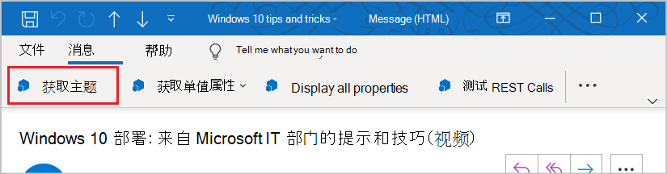
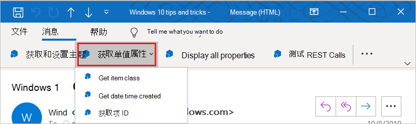

# 适用于 Outlook 的外接程序命令

Outlook 外接程序命令提供多种方法，通过添加按钮或下拉菜单从功能区启动特定外接程序操作。这使用户可以使用简单直观且不引人注目的方式访问外接程序。因为它们通过无缝的方式提供增强功能，因此您可以使用外接程序命令创建更具吸引力的解决方案。

> [!NOTE]
> 加载项命令仅适用于 Windows 版 Outlook 2013 或更高版本、Mac 版 Outlook 2016 或更高版本、iOS 版 Outlook、Android 版 Outlook、适用于 Exchange 2016 或更高版本的 Outlook 网页版、适用于 Microsoft 365 的 Outlook 网页版和 Outlook.com。
>
> 需要安装以下三个更新，Outlook 2013 才支持加载项命令：
> - [2016 年 3 月 8 日发布的 Outlook 安全更新程序](https://support.microsoft.com/kb/3114829)
> - [2016 年 3 月 8 日发布的 Office 安全更新程序 (KB3114816)](https://support.microsoft.com/topic/3d3eb171-78c2-0e61-62a2-85723bc4bcc0)
> - [2016 年 3 月 8 日发布的 Office 安全更新程序 (KB3114828)](https://support.microsoft.com/topic/54437016-d1e0-7aac-dbb7-4ecfbd57f5f0)
>
> 需要安装[累积更新 5](https://support.microsoft.com/topic/d67d7693-96a4-fb6e-b60b-e64984e267bd)，Exchange 2016 才支持加载项命令。

加载项命令仅适用于不使用 [ItemHasAttachment、ItemHasKnownEntity 或 ItemHasRegularExpressionMatch 规则](activation-rules.md)限制其激活的项目类型的加载项。不过，[上下文加载项](contextual-outlook-add-ins.md)可以显示不同的命令（具体取决于当前选定的项是邮件还是约会），并且可以选择是在阅读还是在撰写应用场景中显示命令。如可能，使用加载项命令将是[最佳做法](../concepts/add-in-development-best-practices.md)。

## 创建加载项命令

加载项命令在 [VersionOverrides 元素](/javascript/api/manifest/versionoverrides) 的加载项清单中声明。 该元素是对清单架构 v1.1 的额外添加，用以确保向后兼容性。 在不支持 **\<VersionOverrides\>** 的环境中，现有的加载项将照常像在没有加载项命令的情况下正常运行。

**\<VersionOverrides\>** 清单条目为加载项指定许多内容，如应用程序、要添加到功能区的控件的类型、文本、图标以及任何关联的功能。

当加载项需要提供状态更新（例如进度指示器或错误消息）时，它必须通过[通知 API](/javascript/api/outlook/office.notificationmessages) 来执行此操作。此外，必须在清单的 `FunctionFile` 节点中指定的单独 HTML 文件中定义对通知的处理。

开发人员应定义适用于所有所需大小的图标，以便外接程序命令顺利地调整功能区。所需图标大小为 80 x 80 像素、32 x 32 像素和 16 x 16 像素（以上适用于桌面）和 48 x 48 像素、32 x 32 像素和 25 x 25 像素（以上适用于移动电话）。

## 加载项命令的显示方式

加载项命令在功能区中显示为按钮，或在下拉菜单中显示为菜单项。 当用户安装加载项时，其命令将作为一组按钮显示在 UI 中。 这可能出现在功能区的默认选项卡上，也可能出现在自定义选项卡上。对于消息，默认为“**开始**”或“**消息**”选项卡。对于日历，则默认为“**会议**”、“**会议事件**”、“**会议系列**”或“**约会**”选项卡。对于模块扩展，默认为自定义选项卡。在默认选项卡上，每个加载项可以具有一个功能区组，最多包含 6 个命令。 在自定义选项卡上，外接程序最多具有 10 个组，每个组具有 6 个命令。 外接程序限定为仅一个自定义选项卡。

当功能区变得拥挤时，加载项命令将显示在溢出菜单中。 用于加载项的加载项命令通常将组合在一起。

向某个外接程序添加了外接程序命令后，外接程序名称将从应用栏删除。仅在功能区上保留外接程序命令按钮。

### 新式 Outlook 网页版

在 Outlook 网页版中，加载项名称显示在溢出菜单中。 如果加载项具有多个加载项命令，则可展开加载项菜单以查看一组标记有加载项名称的按钮。

## 加载项命令的类型是什么？

加载项命令的 UI 包括功能区按钮或下拉菜单中的项。 根据命令触发的操作类型，有两种类型的加载项命令。

- **任务窗格命令**：按钮或菜单项将打开加载项的任务窗格。 在清单中添加带有标记的此类加载项命令。 “代码隐藏”命令由 Office 提供。
- **函数命令**：按钮或菜单项运行任意 JavaScript。 代码几乎总是在 Office JavaScript 库中调用 API，但并非必须如此。 此类型的加载项通常不显示按钮或菜单项本身以外的 UI。 请注意以下有关函数命令的内容：

   - 触发的函数可以调用 [displayDialogAsync](/javascript/api/office/office.ui#office-office-ui-displaydialogasync-member(1)) 方法来显示对话框，这是显示错误、显示进度或提示用户输入的好方法。
   - 运行函数命令的 JavaScript 运行时是基于浏览器的完整运行时。 它可以呈现 HTML 并调用 Internet 以发送或获取数据。

### 运行函数命令

使用执行 JavaScript 函数的外接程序命令按钮用于用户无需进行任何其他选择就可以启动操作的方案。这可能适用于诸如跟踪、提醒我或打印，或在用户希望从某个服务获取详细信息之类的情况下使用的一些操作。

在模块扩展中，外接程序命令按钮可以执行与主要用户界面的内容交互的 JavaScript 函数。

### 启动任务窗格

使用外接程序命令按钮启动适用于用户需要与外接程序进行较长时间交互的方案的任务窗格。例如，外接程序要求更改设置或填写多个字段。

垂直任务窗格的默认宽度为 320 像素。在 Outlook 资源管理器和检查器中，可以调整垂直任务窗格的大小。 调整窗格的大小与调整待办事项窗格和列表视图大小的方法相同。

 

上述屏幕截图展示了一个垂直任务窗格示例。打开的任务窗格在左上角显示外接程序命令的名称。使用完外接程序后，用户可以单击任务窗格右上角的 **X** 按钮，关闭外接程序。默认情况下，此窗格不会跨邮件显示。外接程序可以 [支持固定](pinnable-taskpane.md)任务窗格，并在用户选择新邮件时接收事件。除了外接程序名称和关闭按钮外，任务窗格中呈现的其他所有 UI 元素都由外接程序提供。

如果用户选择另一个可打开任务窗格的外接程序命令，任务窗格将被替换为最近使用过的命令。当任务窗格处于打开状态时，如果用户选择执行函数的外接程序命令按钮或选择下拉菜单，会完成操作且任务窗格仍将保持为打开状态。

### 下拉菜单

下拉菜单加载项命令定义静态的项目列表。 菜单可以是执行函数或打开任务窗格的任何项组合。 不支持子菜单。

## 外接程序命令显示在 UI 中的什么位置？

以下四种方案支持外接程序命令：

### 阅读邮件

用户在阅读邮件时，如果在阅读窗格或“**邮件**”选项卡的弹出式阅读表单中查看邮件，添加到默认选项卡的外接程序命令将出现在“**主页**”选项卡上。

### 撰写邮件

用户在撰写邮件时，添加到默认选项卡的加载项命令将出现在“邮件”选项卡上。

### 以组织者的身份创建或查看约会或会议

以组织者身份创建或查看约会或会议时，添加到默认选项卡的加载项命令会显示在弹出式窗体的“会议”、“会议事件”、“会议序列”或“约会”选项卡上。但是，如果用户在日历中选择一个项目，但不打开弹出项，则加载项功能区组将不显示在功能区中。

### 以参与者的身份查看会议

以参与者身份查看会议时，添加到默认选项卡的加载项命令会显示在弹出式窗体的“会议”、“会议事件”或“会议序列”选项卡上。但是，如果用户在日历中选择一个项目，但不打开弹出项，则加载项功能区组将不显示在功能区中

### 使用模块扩展

使用模块扩展时，加载项命令显示在扩展的自定义选项卡上。

## 另请参阅

- [加载项命令演示 Outlook 加载项](https://github.com/officedev/outlook-add-in-command-demo)
- [在清单中创建 Excel、PowerPoint 和 Word 加载项命令](../develop/create-addin-commands.md)
- [Outlook 加载项中的调试函数命令](debug-ui-less.md)
- [教程：生成邮件撰写 Outlook 外接程序](../tutorials/outlook-tutorial.md)
