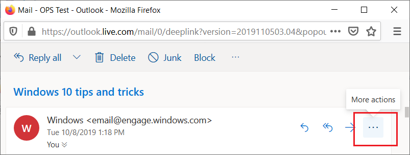

# 适用于 Outlook 的外接程序命令Add-in commands for Outlook

Outlook 外接程序命令提供多种方法，通过添加按钮或下拉菜单从功能区启动特定外接程序操作。这使用户可以使用简单直观且不引人注目的方式访问外接程序。因为它们通过无缝的方式提供增强功能，因此您可以使用外接程序命令创建更具吸引力的解决方案。Outlook add-in commands provide ways to initiate specific add-in actions from the ribbon by adding buttons or drop-down menus. This lets users access add-ins in a simple, intuitive, and unobtrusive way. Because they offer increased functionality in a seamless manner, you can use add-in commands to create more engaging solutions.

> [!NOTE]
> 加载项命令仅适用于 Windows 版 Outlook 2013 或更高版本、Mac 版 Outlook 2016 或更高版本、iPhone 版 Outlook、Android 版 Outlook、Outlook 网页版（Exchange 2016 或更高版本）、Outlook 网页版（Office 365 和 Outlook.com）。Add-in commands are available only in Outlook 2013 or later on Windows, Outlook 2016 or later on Mac, Outlook on iPhone, Outlook on Android, Outlook on the web for Exchange 2016 or later, and Outlook on the web for Office 365 and Outlook.com.
>
> 需要安装以下三个更新，Outlook 2013 才支持加载项命令：Support for add-in commands in Outlook 2013 requires three updates:
> - [2016 年 3 月 8 日发布的 Outlook 安全更新程序March 8, 2016 security update for Outlook](https://support.microsoft.com/kb/3114829)
> - [2016 年 3 月 8 日发布的 Office 安全更新程序 (KB3114816)March 8, 2016 security update for Office (KB3114816)](https://support.microsoft.com/help/3114816/march-8,-2016,-update-for-office-2013-kb3114816)
> - [2016 年 3 月 8 日发布的 Office 安全更新程序 (KB3114828)March 8, 2016 security update for Office (KB3114828)](https://support.microsoft.com/help/3114828/march-8,-2016,-update-for-office-2013-kb3114828)
>
> 需要安装[累积更新 5](https://support.microsoft.com/help/4012106/cumulative-update-5-for-exchange-server-2016)，Exchange 2016 才支持加载项命令。Support for add-in commands in Exchange 2016 requires [Cumulative Update 5](https://support.microsoft.com/help/4012106/cumulative-update-5-for-exchange-server-2016).

加载项命令仅适用于不使用 [ItemHasAttachment、ItemHasKnownEntity 或 ItemHasRegularExpressionMatch 规则](activation-rules.md)限制其激活的项目类型的加载项。不过，[上下文加载项](contextual-outlook-add-ins.md)可以显示不同的命令（具体取决于当前选定的项是邮件还是约会），并且可以选择是在阅读还是在撰写应用场景中显示命令。如可能，使用加载项命令将是[最佳做法](../concepts/add-in-development-best-practices.md)。Add-in commands are only available for add-ins that do not use [ItemHasAttachment, ItemHasKnownEntity, or ItemHasRegularExpressionMatch rules](activation-rules.md) to limit the types of items they activate on. However, [contextual add-ins](contextual-outlook-add-ins.md) can present different commands depending on whether the currently selected item is a message or appointment, and can choose to appear in read or compose scenarios. Using add-in commands if possible is a [best practice](../concepts/add-in-development-best-practices.md).

## 创建外接程序命令Creating the add-in command

加载项命令已在 [VersionOverrides 元素](../reference/manifest/versionoverrides.md)的加载项清单中声明。该元素是对清单架构 v1.1 的额外添加，用以确保向后兼容性。在不支持 `VersionOverrides` 的客户端中，现有的加载项会照常像没有加载项命令一样正常运行。Add-in commands are declared in the add-in manifest in the [VersionOverrides element](../reference/manifest/versionoverrides.md). This element is an addition to the manifest schema v1.1 that ensures backward compatibility. In a client that doesn't support `VersionOverrides`, existing add-ins will continue to function as they did without add-in commands.

`VersionOverrides` 清单条目会为加载项指定很多内容，如主机、要添加到功能区的控件的类型、文本、图标以及任何相关联的功能。The `VersionOverrides` manifest entries specify many things for the add-in, such as the host, types of controls to add to the ribbon, the text, the icons, and any associated functions.

当加载项需要提供状态更新（例如进度指示器或错误消息）时，它必须通过[通知 API](/javascript/api/outlook/office.notificationmessages) 来执行此操作。此外，必须在清单的 `FunctionFile` 节点中指定的单独 HTML 文件中定义对通知的处理。When an add-in needs to provide status updates, such as progress indicators or error messages, it must do so through the [notification APIs](/javascript/api/outlook/office.notificationmessages). The processing for the notifications must also be defined in a separate HTML file that is specified in the `FunctionFile` node of the manifest.

开发人员应定义适用于所有所需大小的图标，以便外接程序命令顺利地调整功能区。所需图标大小为 80 x 80 像素、32 x 32 像素和 16 x 16 像素（以上适用于桌面）和 48 x 48 像素、32 x 32 像素和 25 x 25 像素（以上适用于移动电话）。Developers should define icons for all required sizes so that the add-in commands will adjust smoothly along with the ribbon. The required icon sizes are 80 x 80 pixels, 32 x 32 pixels, and 16 x 16 pixels for desktop, and 48 x 48 pixels, 32 x 32 pixels, and 25 x 25 pixels for mobile.

要详细了解如何创建加载项命令，请参阅[在清单中创建加载项命令](../develop/create-addin-commands.md)。For more information about creating add-in commands, see [Create add-in commands in your manifest](../develop/create-addin-commands.md).

## 加载项命令的显示方式How do add-in commands appear?

加载项命令在功能区中显示为一个按钮。当用户安装加载项时，其命令在 UI 中显示为一组按钮。这可以是在功能区的默认选项卡上或在自定义选项卡上。对于邮件，默认为“**主页**”或“**邮件**”选项卡。对于日历，默认为“**会议**”、“**会议事件**”、“**会议序列**”或“**约会**”选项卡。对于模块扩展，默认为自定义选项卡。在默认选项卡上，每个加载项可以包含一个具有最多 6 个命令的功能区组。在自定义选项卡上，加载项最多具有 10 个组，每个组具有 6 个命令。加载项限定为仅一个自定义选项卡。An add-in command appears on the ribbon as a button. When a user installs an add-in, its commands appear in the UI as a group of buttons. This can either be on the ribbon's default tab or on a custom tab. For messages, the default is either the **Home** or **Message** tab. For the calendar, the default is the **Meeting**, **Meeting Occurrence**, **Meeting Series**, or **Appointment** tab. For module extensions, the default is a custom tab. On the default tab, each add-in can have one ribbon group with up to 6 commands. On custom tabs, the add-in can have up to 10 groups, each with 6 commands. Add-ins are limited to only one custom tab.

当功能区变得拥挤时，加载项命令将显示在溢出菜单中。As the ribbon gets more crowded, add-in commands will be displayed in the overflow menu. 用于加载项的加载项命令通常将组合在一起。The add-in commands for an add-in are usually grouped together.

向某个外接程序添加了外接程序命令后，外接程序名称将从应用栏删除。仅在功能区上保留外接程序命令按钮。When an add-in command is added to an add-in, the add-in name is removed from the app bar. Only the add-in command button on the ribbon remains.

### 新式 Outlook 网页版Modern Outlook on the web

在 Outlook 网页版中，加载项名称显示在溢出菜单中。In Outlook on the web, the add-in name is displayed in an overflow menu. 如果加载项具有多个加载项命令，则可展开加载项菜单以查看一组标记有加载项名称的按钮。If the add-in has multiple add-in commands, you can expand the add-in menu to see the group of buttons labeled with the add-in name.

## 外接程序命令存在哪些 UX 形状？What UX shapes exist for add-in commands?

外接程序命令的 UX 形状由主机应用程序中的一个功能区选项卡组成，其中包含可执行各种功能的按钮。当前支持三种 UI 形状：The UX shape for an add-in command consists of a ribbon tab in the host application that contains buttons that can perform various functions. Currently, three UI shapes are supported:

- 一个可执行 JavaScript 函数的按钮A button that executes a JavaScript function
- 一个启动任务窗格的按钮A button that launches a task pane
- 显示另外两种类型的一个或多个按钮的下拉菜单的按钮A button that shows a drop-down menu with one or more buttons of the other two types

### 执行 JavaScript 函数Executing a JavaScript function

使用执行 JavaScript 函数的外接程序命令按钮用于用户无需进行任何其他选择就可以启动操作的方案。这可能适用于诸如跟踪、提醒我或打印，或在用户希望从某个服务获取详细信息之类的情况下使用的一些操作。Use an add-in command button that executes a JavaScript function for scenarios where the user doesn't need to make any additional selections to initiate the action. This can be for actions such as track, remind me, or print, or scenarios when the user wants more in-depth information from a service.

在模块扩展中，外接程序命令按钮可以执行与主要用户界面的内容交互的 JavaScript 函数。In module extensions, the add-in command button can execute JavaScript functions that interact with the content in the main user interface.

### 启动任务窗格Launching a task pane

使用外接程序命令按钮启动适用于用户需要与外接程序进行较长时间交互的方案的任务窗格。例如，外接程序要求更改设置或填写多个字段。Use an add-in command button to launch a task pane for scenarios where a user needs to interact with an add-in for a longer period of time. For example, the add-in requires changes to settings or the completion of many fields.

垂直任务窗格的默认宽度为 320 像素。在 Outlook 资源管理器和检查器中，可以调整垂直任务窗格的大小。 调整窗格的大小与调整待办事项窗格和列表视图大小的方法相同。The default width of the vertical task pane is 320 px. The vertical task pane can be resized in both the Outlook Explorer and inspector. The pane can be resized in the same way the to-do pane and list view resize.

 

上述屏幕截图展示了一个垂直任务窗格示例。打开的任务窗格在左上角显示外接程序命令的名称。使用完外接程序后，用户可以单击任务窗格右上角的 **X** 按钮，关闭外接程序。默认情况下，此窗格不会跨邮件显示。外接程序可以[支持固定](pinnable-taskpane.md)任务窗格，并在用户选择新邮件时接收事件。除了外接程序名称和关闭按钮外，任务窗格中呈现的其他所有 UI 元素都由外接程序提供。This screenshot shows an example of a vertical task pane. The pane opens with the name of the add-in command in the top left corner. Users can use the **X** button in the upper-right corner of the pane to close the add-in when they are finished using it. By default, this pane will not persist across messages. Add-ins can [support pinning](pinnable-taskpane.md) for the task pane and receive events when a new message is selected. All UI elements rendered in the task pane, aside from the add-in name and the close button, are provided by the add-in.

如果用户选择另一个可打开任务窗格的外接程序命令，任务窗格将被替换为最近使用过的命令。当任务窗格处于打开状态时，如果用户选择执行函数的外接程序命令按钮或选择下拉菜单，会完成操作且任务窗格仍将保持为打开状态。If a user chooses another add-in command that opens a task pane, the task pane is replaced with the recently used command. If a user chooses an add-in command button that executes a function, or drop-down menu while the task pane is open, the action will be completed and the task pane will remain open.

### 下拉菜单Drop-down menu

下拉菜单外接程序命令定义按钮静态列表。菜单中的按钮可为执行函数或打开任务窗格的按钮的组合。不支持子菜单。A drop-down menu add-in command defines a static list of buttons. The buttons within the menu can be any mix of buttons that execute a function or buttons that open a task pane. Submenus are not supported.

## 外接程序命令显示在 UI 中的什么位置？Where do add-in commands appear in the UI?

以下四种方案支持外接程序命令：Add-in commands are supported for four scenarios:

### 阅读邮件Reading a message

用户在阅读邮件时，如果在阅读窗格或“**邮件**”选项卡的弹出式阅读表单中查看邮件，添加到默认选项卡的外接程序命令将出现在“**主页**”选项卡上。When the user is reading a message in the reading pane or in the **Message** tab for a pop-out read form, add-in commands added to the default tab appear on the **Home** tab.

### 撰写邮件Composing a message

用户在撰写邮件时，添加到默认选项卡的加载项命令将出现在“邮件”\*\*\*\* 选项卡上。When the user is composing a message, add-in commands added to the default tab appear on the **Message** tab.

### 以组织者的身份创建或查看约会或会议Creating or viewing an appointment or meeting as the organizer

以组织者身份创建或查看约会或会议时，添加到默认选项卡的加载项命令会显示在弹出式窗体的“会议”\*\*\*\*、“会议事件”\*\*\*\*、“会议序列”\*\*\*\* 或“约会”\*\*\*\* 选项卡上。但是，如果用户在日历中选择一个项目，但不打开弹出项，则加载项功能区组将不显示在功能区中。When creating or viewing an appointment or meeting as the organizer, add-in commands added to the default tab appear on the **Meeting**, **Meeting Occurrence**, **Meeting Series**, or **Appointment** tabs on pop-out forms. However, if the user selects an item in the calendar but doesn't open the pop-out, the add-in's ribbon group won't be visible in the ribbon.

### 以参与者的身份查看会议Viewing a meeting as an attendee

以参与者身份查看会议时，添加到默认选项卡的加载项命令会显示在弹出式窗体的“会议”\*\*\*\*、“会议事件”\*\*\*\* 或“会议序列”\*\*\*\* 选项卡上。但是，如果用户在日历中选择一个项目，但不打开弹出项，则加载项功能区组将不显示在功能区中When viewing a meeting as an attendee, add-in commands added to the default tab appear on the **Meeting**, **Meeting Occurrence**, or **Meeting Series** tabs on pop-out forms. However, if a user selects an item in the calendar but doesn't open the pop-out, the add-in's ribbon group won't be visible in the ribbon

### 使用模块扩展Using a module extension

使用模块扩展时，加载项命令显示在扩展的自定义选项卡上。When using a module extension, add-in commands appear on the extension's custom tab.

## 另请参阅See also

- [在清单中定义加载项命令Define add-in commands in your manifest](../develop/create-addin-commands.md)
-  [加载项命令演示 Outlook 加载项](https://github.com/officedev/outlook-add-in-command-demo)[Add-in command demo Outlook add-in](https://github.com/officedev/outlook-add-in-command-demo)
