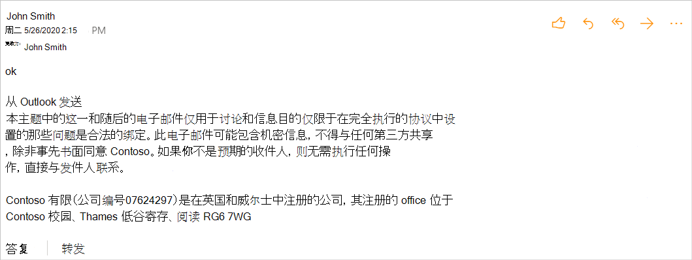

# <a name="implement-append-on-send-in-your-outlook-add-in"></a><span data-ttu-id="a8d1a-103">在 Outlook 外接程序中实现附加 On-send</span><span class="sxs-lookup"><span data-stu-id="a8d1a-103">Implement append-on-send in your Outlook add-in</span></span>

<span data-ttu-id="a8d1a-104">在此演练结束时，您将拥有一个 Outlook 外接程序，可以在邮件发送时插入免责声明。</span><span class="sxs-lookup"><span data-stu-id="a8d1a-104">By the end of this walkthrough, you'll have an Outlook add-in that can insert a disclaimer when a message is sent.</span></span>

> [!NOTE]
> <span data-ttu-id="a8d1a-105">要求集 1.9 中引入了对此功能的支持。</span><span class="sxs-lookup"><span data-stu-id="a8d1a-105">Support for this feature was introduced in requirement set 1.9.</span></span> <span data-ttu-id="a8d1a-106">请查看支持此要求集的[客户端和平台](../reference/requirement-sets/outlook-api-requirement-sets.md#requirement-sets-supported-by-exchange-servers-and-outlook-clients)。</span><span class="sxs-lookup"><span data-stu-id="a8d1a-106">See [clients and platforms](../reference/requirement-sets/outlook-api-requirement-sets.md#requirement-sets-supported-by-exchange-servers-and-outlook-clients) that support this requirement set.</span></span>

## <a name="set-up-your-environment"></a><span data-ttu-id="a8d1a-107">设置环境</span><span class="sxs-lookup"><span data-stu-id="a8d1a-107">Set up your environment</span></span>

<span data-ttu-id="a8d1a-108">使用 [适用于 Office](../quickstarts/outlook-quickstart.md?tabs=yeomangenerator) 加载项的 Yeoman 生成器完成创建外接程序项目的 Outlook 快速入门。</span><span class="sxs-lookup"><span data-stu-id="a8d1a-108">Complete the [Outlook quick start](../quickstarts/outlook-quickstart.md?tabs=yeomangenerator) which creates an add-in project with the Yeoman generator for Office Add-ins.</span></span>

## <a name="configure-the-manifest"></a><span data-ttu-id="a8d1a-109">配置清单</span><span class="sxs-lookup"><span data-stu-id="a8d1a-109">Configure the manifest</span></span>

<span data-ttu-id="a8d1a-110">若要在外接程序中启用附加 Ons 功能，必须在 `AppendOnSend` [ExtendedPermissions 集合中包括该权限](../reference/manifest/extendedpermissions.md)。</span><span class="sxs-lookup"><span data-stu-id="a8d1a-110">To enable the append-on-send feature in your add-in, you must include the `AppendOnSend` permission in the collection of [ExtendedPermissions](../reference/manifest/extendedpermissions.md).</span></span>

<span data-ttu-id="a8d1a-111">对于此方案，你将运行函数，而不是在选择"执行 `action` **操作** "按钮时运行 `appendOnSend` 函数。</span><span class="sxs-lookup"><span data-stu-id="a8d1a-111">For this scenario, instead of running the `action` function on choosing the **Perform an action** button, you'll be running the `appendOnSend` function.</span></span>

1. <span data-ttu-id="a8d1a-112">在代码编辑器中，打开快速启动项目。</span><span class="sxs-lookup"><span data-stu-id="a8d1a-112">In your code editor, open the quick start project.</span></span>

1. <span data-ttu-id="a8d1a-113">打开 **manifest.xml** 根目录下的文件。</span><span class="sxs-lookup"><span data-stu-id="a8d1a-113">Open the **manifest.xml** file located at the root of your project.</span></span>

1. <span data-ttu-id="a8d1a-114">选择整个 `<VersionOverrides>` 节点 (包括打开和关闭标记) 并将其替换为以下 XML。</span><span class="sxs-lookup"><span data-stu-id="a8d1a-114">Select the entire `<VersionOverrides>` node (including open and close tags) and replace it with the following XML.</span></span>

    ```XML
    <VersionOverrides xmlns="http://schemas.microsoft.com/office/mailappversionoverrides" xsi:type="VersionOverridesV1_0">
      <VersionOverrides xmlns="http://schemas.microsoft.com/office/mailappversionoverrides/1.1" xsi:type="VersionOverridesV1_1">
        <Requirements>
          <bt:Sets DefaultMinVersion="1.3">
            <bt:Set Name="Mailbox" />
          </bt:Sets>
        </Requirements>
        <Hosts>
          <Host xsi:type="MailHost">
            <DesktopFormFactor>
              <FunctionFile resid="Commands.Url" />
              <ExtensionPoint xsi:type="MessageComposeCommandSurface">
                <OfficeTab id="TabDefault">
                  <Group id="msgComposeGroup">
                    <Label resid="GroupLabel" />
                    <Control xsi:type="Button" id="msgComposeOpenPaneButton">
                      <Label resid="TaskpaneButton.Label" />
                      <Supertip>
                        <Title resid="TaskpaneButton.Label" />
                        <Description resid="TaskpaneButton.Tooltip" />
                      </Supertip>
                      <Icon>
                        <bt:Image size="16" resid="Icon.16x16" />
                        <bt:Image size="32" resid="Icon.32x32" />
                        <bt:Image size="80" resid="Icon.80x80" />
                      </Icon>
                      <Action xsi:type="ShowTaskpane">
                        <SourceLocation resid="Taskpane.Url" />
                      </Action>
                    </Control>
                    <Control xsi:type="Button" id="ActionButton">
                      <Label resid="ActionButton.Label"/>
                      <Supertip>
                        <Title resid="ActionButton.Label"/>
                        <Description resid="ActionButton.Tooltip"/>
                      </Supertip>
                      <Icon>
                        <bt:Image size="16" resid="Icon.16x16"/>
                        <bt:Image size="32" resid="Icon.32x32"/>
                        <bt:Image size="80" resid="Icon.80x80"/>
                      </Icon>
                      <Action xsi:type="ExecuteFunction">
                        <FunctionName>appendDisclaimerOnSend</FunctionName>
                      </Action>
                    </Control>
                  </Group>
                </OfficeTab>
              </ExtensionPoint>

              <!-- Configure AppointmentOrganizerCommandSurface extension point to support
              append on sending a new appointment. -->

            </DesktopFormFactor>
          </Host>
        </Hosts>
        <Resources>
          <bt:Images>
            <bt:Image id="Icon.16x16" DefaultValue="https://localhost:3000/assets/icon-16.png"/>
            <bt:Image id="Icon.32x32" DefaultValue="https://localhost:3000/assets/icon-32.png"/>
            <bt:Image id="Icon.80x80" DefaultValue="https://localhost:3000/assets/icon-80.png"/>
          </bt:Images>
          <bt:Urls>
            <bt:Url id="Commands.Url" DefaultValue="https://localhost:3000/commands.html" />
            <bt:Url id="Taskpane.Url" DefaultValue="https://localhost:3000/taskpane.html" />
            <bt:Url id="WebViewRuntime.Url" DefaultValue="https://localhost:3000/commands.html" />
            <bt:Url id="JSRuntime.Url" DefaultValue="https://localhost:3000/runtime.js" />
          </bt:Urls>
          <bt:ShortStrings>
            <bt:String id="GroupLabel" DefaultValue="Contoso Add-in"/>
            <bt:String id="TaskpaneButton.Label" DefaultValue="Show Taskpane"/>
            <bt:String id="ActionButton.Label" DefaultValue="Perform an action"/>
          </bt:ShortStrings>
          <bt:LongStrings>
            <bt:String id="TaskpaneButton.Tooltip" DefaultValue="Opens a pane displaying all available properties."/>
            <bt:String id="ActionButton.Tooltip" DefaultValue="Perform an action when clicked."/>
          </bt:LongStrings>
        </Resources>
        <ExtendedPermissions>
          <ExtendedPermission>AppendOnSend</ExtendedPermission>
        </ExtendedPermissions>
      </VersionOverrides>
    </VersionOverrides>
    ```

> [!TIP]
> <span data-ttu-id="a8d1a-115">若要了解有关 Outlook 外接程序清单的更多信息，请参阅 [Outlook 外接程序清单](manifests.md)。</span><span class="sxs-lookup"><span data-stu-id="a8d1a-115">To learn more about manifests for Outlook add-ins, see [Outlook add-in manifests](manifests.md).</span></span>

## <a name="implement-append-on-send-handling"></a><span data-ttu-id="a8d1a-116">实现附加发送处理</span><span class="sxs-lookup"><span data-stu-id="a8d1a-116">Implement append-on-send handling</span></span>

<span data-ttu-id="a8d1a-117">接下来，在发送事件上实现追加。</span><span class="sxs-lookup"><span data-stu-id="a8d1a-117">Next, implement appending on the send event.</span></span>

> [!IMPORTANT]
> <span data-ttu-id="a8d1a-118">如果加载项还使用实现[Ons send 事件 `ItemSend` ](outlook-on-send-addins.md)处理，则 `AppendOnSendAsync` Onss ons handler 中的调用将返回错误，因为不支持此方案。</span><span class="sxs-lookup"><span data-stu-id="a8d1a-118">If your add-in also implements [on-send event handling using `ItemSend`](outlook-on-send-addins.md), calling `AppendOnSendAsync` in the on-send handler returns an error as this scenario isn't supported.</span></span>

<span data-ttu-id="a8d1a-119">对于此方案，你将在用户发送时实现向项目附加免责声明。</span><span class="sxs-lookup"><span data-stu-id="a8d1a-119">For this scenario, you'll implement appending a disclaimer to the item when the user sends.</span></span>

1. <span data-ttu-id="a8d1a-120">从同一快速启动项目中，在代码编辑器中commands.js **./src/commands/commands.js** 文件。</span><span class="sxs-lookup"><span data-stu-id="a8d1a-120">From the same quick start project, open the file **./src/commands/commands.js** in your code editor.</span></span>

1. <span data-ttu-id="a8d1a-121">在函数 `action` 后插入以下 JavaScript 函数。</span><span class="sxs-lookup"><span data-stu-id="a8d1a-121">After the `action` function, insert the following JavaScript function.</span></span>

    ```js
    function appendDisclaimerOnSend(event) {
      var appendText =
        '<p style = "color:blue"> <i>This and subsequent emails on the same topic are for discussion and information purposes only. Only those matters set out in a fully executed agreement are legally binding. This email may contain confidential information and should not be shared with any third party without the prior written agreement of Contoso. If you are not the intended recipient, take no action and contact the sender immediately.<br><br>Contoso Limited (company number 01624297) is a company registered in England and Wales whose registered office is at Contoso Campus, Thames Valley Park, Reading RG6 1WG</i></p>';  
      /**
        *************************************************************
         Ideal Usage - Call the getBodyType API. Use the coercionType
         it returns as the parameter value below.
        *************************************************************
      */
      Office.context.mailbox.item.body.appendOnSendAsync(
        appendText,
        {
          coercionType: Office.CoercionType.Html
        },
        function(asyncResult) {
          console.log(asyncResult);
        }
      );

      event.completed();
    }
    ```

1. <span data-ttu-id="a8d1a-122">在文件的末尾，添加以下语句。</span><span class="sxs-lookup"><span data-stu-id="a8d1a-122">At the end of the file, add the following statement.</span></span>

    ```js
    g.appendDisclaimerOnSend = appendDisclaimerOnSend;
    ```

## <a name="try-it-out"></a><span data-ttu-id="a8d1a-123">试用</span><span class="sxs-lookup"><span data-stu-id="a8d1a-123">Try it out</span></span>

1. <span data-ttu-id="a8d1a-124">在项目的根目录中运行以下命令。</span><span class="sxs-lookup"><span data-stu-id="a8d1a-124">Run the following command in the root directory of your project.</span></span> <span data-ttu-id="a8d1a-125">运行此命令时，如果本地 Web 服务器尚未运行，将启动该服务器，并且加载项将旁加载。</span><span class="sxs-lookup"><span data-stu-id="a8d1a-125">When you run this command, the local web server will start if it's not already running and your add-in will be sideloaded.</span></span> 

    ```command&nbsp;line
    npm start
    ```

1. <span data-ttu-id="a8d1a-126">创建新邮件，并将自己添加到"收件人 **"** 行。</span><span class="sxs-lookup"><span data-stu-id="a8d1a-126">Create a new message, and add yourself to the **To** line.</span></span>

1. <span data-ttu-id="a8d1a-127">从功能区或溢出菜单中，选择 **"执行"操作**。</span><span class="sxs-lookup"><span data-stu-id="a8d1a-127">From the ribbon or overflow menu, choose **Perform an action**.</span></span>

1. <span data-ttu-id="a8d1a-128">发送邮件，然后从"收件箱"或"已发送邮件"文件夹中打开邮件以查看附加的免责声明。</span><span class="sxs-lookup"><span data-stu-id="a8d1a-128">Send the message, then open it from your **Inbox** or **Sent Items** folder to view the appended disclaimer.</span></span>

    

## <a name="see-also"></a><span data-ttu-id="a8d1a-130">另请参阅</span><span class="sxs-lookup"><span data-stu-id="a8d1a-130">See also</span></span>

[<span data-ttu-id="a8d1a-131">Outlook 加载项清单</span><span class="sxs-lookup"><span data-stu-id="a8d1a-131">Outlook add-in manifests</span></span>](manifests.md)
