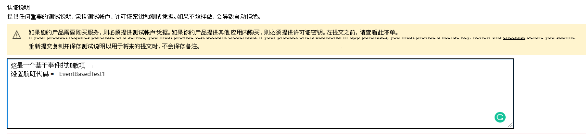
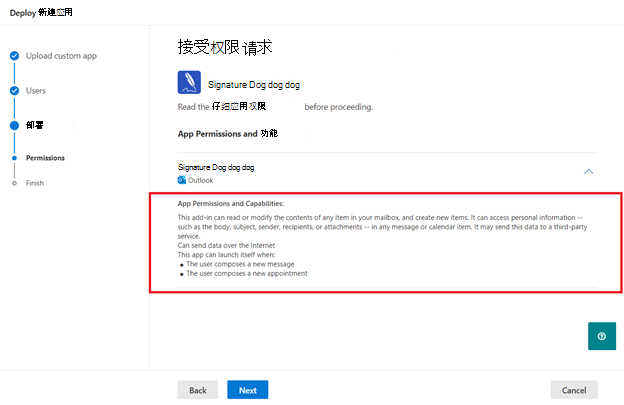
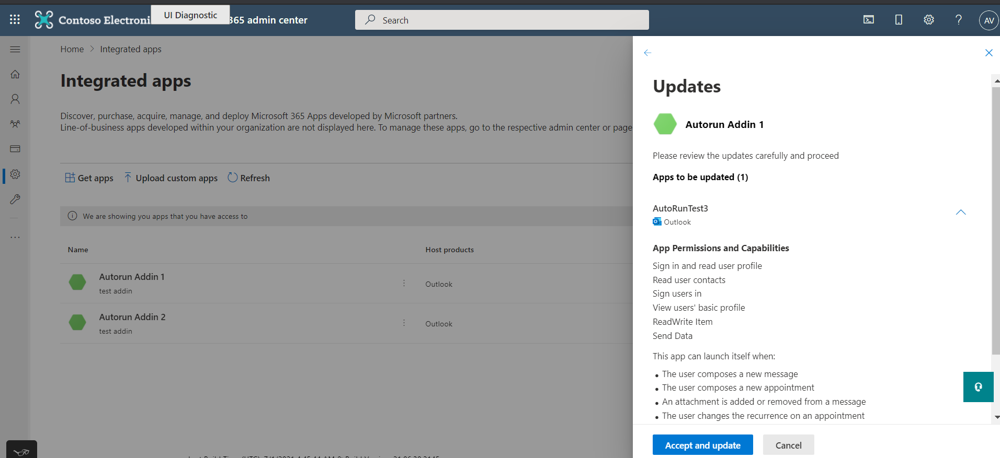

# <a name="appsource-listing-options-for-your-event-based-outlook-add-in"></a><span data-ttu-id="5aea7-103">基于事件的加载项的 AppSource Outlook选项</span><span class="sxs-lookup"><span data-stu-id="5aea7-103">AppSource listing options for your event-based Outlook add-in</span></span>

<span data-ttu-id="5aea7-104">目前，外接程序必须由组织的管理员部署，以便最终用户能够访问基于事件的功能。</span><span class="sxs-lookup"><span data-stu-id="5aea7-104">At present, add-ins must be deployed by an organization's admins for end-users to access the event-based feature functionality.</span></span> <span data-ttu-id="5aea7-105">如果最终用户直接从 AppSource 获取了加载项，我们将限制基于事件的激活。</span><span class="sxs-lookup"><span data-stu-id="5aea7-105">We're restricting event-based activation if the end-user acquired the add-in directly from AppSource.</span></span> <span data-ttu-id="5aea7-106">例如，如果 Contoso 外接程序包括在节点 (下至少定义了一个扩展点的扩展点，请参阅示例外接程序清单) 中的以下摘录，则只有当其组织的管理员为最终用户安装外接程序时，才自动调用外接程序。否则，外接程序的自动调用将被阻止。 `LaunchEvent` `LaunchEvent Type` `LaunchEvents`</span><span class="sxs-lookup"><span data-stu-id="5aea7-106">For example, if the Contoso add-in includes the `LaunchEvent` extension point with at least one defined `LaunchEvent Type` under the `LaunchEvents` node (see the following excerpt from an example add-in manifest), the automatic invocation of the add-in only happens if the add-in was installed for the end-user by their organization's admin. Otherwise, the automatic invocation of the add-in is blocked.</span></span>

```xml
...
<ExtensionPoint xsi:type="LaunchEvent">
  <LaunchEvents>
    <LaunchEvent Type="OnNewMessageCompose" FunctionName="onMessageComposeHandler"/>
    ...
```

<span data-ttu-id="5aea7-107">最终用户或管理员可以通过 AppSource 或客户端应用商店获取外接程序。</span><span class="sxs-lookup"><span data-stu-id="5aea7-107">An end-user or admin can acquire add-ins through AppSource or the inclient store.</span></span> <span data-ttu-id="5aea7-108">如果您的外接程序的主要方案或工作流需要基于事件的激活，您可能需要限制可用于管理员部署的外接程序。</span><span class="sxs-lookup"><span data-stu-id="5aea7-108">If your add-in's primary scenario or workflow requires event-based activation, you may want to restrict your add-ins available to admin deployment.</span></span> <span data-ttu-id="5aea7-109">若要启用此限制，我们可以提供测试代码 URL。</span><span class="sxs-lookup"><span data-stu-id="5aea7-109">To enable that restriction, we can provide flight code URLs.</span></span> <span data-ttu-id="5aea7-110">由于有航班代码，只有具有这些特殊 URL 的最终用户才能访问列表。</span><span class="sxs-lookup"><span data-stu-id="5aea7-110">Thanks to the flight codes, only end-users with these special URLs can access the listing.</span></span> <span data-ttu-id="5aea7-111">下面是一个示例 URL。</span><span class="sxs-lookup"><span data-stu-id="5aea7-111">The following is an example URL.</span></span>

`https://appsource.microsoft.com/product/office/WA200002862?flightCodes=EventBasedTest1`

<span data-ttu-id="5aea7-112">为加载项启用外部测试代码后，用户和管理员无法按加载项在 AppSource 或客户端存储中的名称显式搜索加载项。</span><span class="sxs-lookup"><span data-stu-id="5aea7-112">Users and admins can't explicitly search for an add-in by its name in AppSource or the inclient store when a flight code is enabled for it.</span></span> <span data-ttu-id="5aea7-113">作为外接程序创建者，你可以与外接程序部署的组织管理员私人共享这些测试代码。</span><span class="sxs-lookup"><span data-stu-id="5aea7-113">As the add-in creator, you can privately share these flight codes with organization admins for add-in deployment.</span></span>

> [!NOTE]
> <span data-ttu-id="5aea7-114">虽然最终用户可以使用测试代码安装外接程序，但外接程序不包括基于事件的激活。</span><span class="sxs-lookup"><span data-stu-id="5aea7-114">While end-users can install the add-in using a flight code, the add-in won't include event-based activation.</span></span>

## <a name="specify-a-flight-code"></a><span data-ttu-id="5aea7-115">指定航班代码</span><span class="sxs-lookup"><span data-stu-id="5aea7-115">Specify a flight code</span></span>

<span data-ttu-id="5aea7-116">可以通过在发布外接程序时在认证说明中共享该信息来指定外接程序的运行代码。 </span><span class="sxs-lookup"><span data-stu-id="5aea7-116">You can specify the flight code you want for your add-in by sharing that information in the **Notes for certification** when you're publishing your add-in.</span></span> <span data-ttu-id="5aea7-117">_**重要提示**：_ 航班代码区分大小写。</span><span class="sxs-lookup"><span data-stu-id="5aea7-117">_**Important**:_ Flight codes are case-sensitive.</span></span>



## <a name="deploy-add-in-with-flight-code"></a><span data-ttu-id="5aea7-119">使用测试代码部署外接程序</span><span class="sxs-lookup"><span data-stu-id="5aea7-119">Deploy add-in with flight code</span></span>

<span data-ttu-id="5aea7-120">设置测试代码后，你将从应用认证团队收到 URL。</span><span class="sxs-lookup"><span data-stu-id="5aea7-120">After the flight codes are set, you'll receive the URL from the app certification team.</span></span> <span data-ttu-id="5aea7-121">然后，你可以与管理员私人共享 URL。</span><span class="sxs-lookup"><span data-stu-id="5aea7-121">You can then share the URL with admins privately.</span></span>

<span data-ttu-id="5aea7-122">若要部署外接程序，管理员可以使用以下步骤。</span><span class="sxs-lookup"><span data-stu-id="5aea7-122">To deploy the add-in, the admin can use the following steps.</span></span>

- <span data-ttu-id="5aea7-123">Sign in to admin.microsoft.com or AppSource.com with your Microsoft 365 admin account.</span><span class="sxs-lookup"><span data-stu-id="5aea7-123">Sign in to admin.microsoft.com or AppSource.com with your Microsoft 365 admin account.</span></span> <span data-ttu-id="5aea7-124">如果加载项启用了单一登录 (SSO) ，需要全局管理员凭据。</span><span class="sxs-lookup"><span data-stu-id="5aea7-124">If the add-in has Single sign-on (SSO) enabled, global admin credentials are needed.</span></span>
- <span data-ttu-id="5aea7-125">将测试版本代码 URL 打开到 Web 浏览器中。</span><span class="sxs-lookup"><span data-stu-id="5aea7-125">Open the flight code URL into a web browser.</span></span>
- <span data-ttu-id="5aea7-126">在外接程序列表页面上，选择"**现在获取"。**</span><span class="sxs-lookup"><span data-stu-id="5aea7-126">On the add-in listing page, select **Get it now**.</span></span> <span data-ttu-id="5aea7-127">应重定向到集成应用门户。</span><span class="sxs-lookup"><span data-stu-id="5aea7-127">You should be redirected to the integrated app portal.</span></span>

## <a name="unrestricted-appsource-listing"></a><span data-ttu-id="5aea7-128">无限制 AppSource 一览</span><span class="sxs-lookup"><span data-stu-id="5aea7-128">Unrestricted AppSource listing</span></span>

<span data-ttu-id="5aea7-129">如果你的加载项未对关键方案（即 (无需自动调用) 即可正常使用基于事件的激活，请考虑在没有任何特殊外部测试代码的情况下在 AppSource 中列出加载项。</span><span class="sxs-lookup"><span data-stu-id="5aea7-129">If your add-in doesn't use event-based activation for critical scenarios (that is, your add-in works well without automatic invocation), consider listing your add-in in AppSource without any special flight codes.</span></span> <span data-ttu-id="5aea7-130">如果最终用户从 AppSource 获取加载项，则用户不会进行自动激活。</span><span class="sxs-lookup"><span data-stu-id="5aea7-130">If an end-user gets your add-in from AppSource, automatic activation won't happen for the user.</span></span> <span data-ttu-id="5aea7-131">但是，他们可以使用外接程序的其他组件，如任务窗格或无 UI 命令。</span><span class="sxs-lookup"><span data-stu-id="5aea7-131">However, they can use other components of your add-in such as a task pane or UI-less command.</span></span>

> [!IMPORTANT]
> <span data-ttu-id="5aea7-132">这是一个临时限制。</span><span class="sxs-lookup"><span data-stu-id="5aea7-132">This is a temporary restriction.</span></span> <span data-ttu-id="5aea7-133">将来，我们计划为直接获取外接程序的最终用户启用基于事件的外接程序激活。</span><span class="sxs-lookup"><span data-stu-id="5aea7-133">In future, we plan to enable event-based add-in activation for end-users who directly acquire your add-in.</span></span>

## <a name="update-existing-add-ins-to-include-event-based-activation"></a><span data-ttu-id="5aea7-134">更新现有外接程序以包含基于事件的激活</span><span class="sxs-lookup"><span data-stu-id="5aea7-134">Update existing add-ins to include event-based activation</span></span>

<span data-ttu-id="5aea7-135">你可以更新现有加载项以包含基于事件的激活，然后重新提交它进行验证，并决定是需要受限还是不受限制的 AppSource 一览。</span><span class="sxs-lookup"><span data-stu-id="5aea7-135">You can update your existing add-in to include event-based activation then resubmit it for validation and decide if you want a restricted or unrestricted AppSource listing.</span></span>

<span data-ttu-id="5aea7-136">更新后的加载项获得批准后，已部署加载项的组织管理员将在管理门户中收到更新消息。</span><span class="sxs-lookup"><span data-stu-id="5aea7-136">After the updated add-in has been approved, organization admins who have already deployed the add-in will receive an update message in the admin portal.</span></span> <span data-ttu-id="5aea7-137">该消息会向管理员建议基于事件的激活更改。</span><span class="sxs-lookup"><span data-stu-id="5aea7-137">The message advises the admin about the event-based activation changes.</span></span> <span data-ttu-id="5aea7-138">管理员接受更改后，更新将部署到最终用户。</span><span class="sxs-lookup"><span data-stu-id="5aea7-138">After the admin accepts the changes, the update will be deployed to end-users.</span></span>


<span data-ttu-id="5aea7-140">对于自己安装加载项的最终用户，即使加载项已更新，基于事件的激活功能也不起作用。</span><span class="sxs-lookup"><span data-stu-id="5aea7-140">For end-users who installed the add-in on their own, the event-based activation feature won't work even after the add-in has been updated.</span></span>

## <a name="admin-consent-for-installing-event-based-add-ins"></a><span data-ttu-id="5aea7-141">管理员同意安装基于事件的加载项</span><span class="sxs-lookup"><span data-stu-id="5aea7-141">Admin consent for installing event-based add-ins</span></span>

<span data-ttu-id="5aea7-142">只要从管理中心的"集成应用"部分部署基于事件的加载项，管理员就会在部署向导中了解有关加载项的基于事件的激活功能的详细信息。</span><span class="sxs-lookup"><span data-stu-id="5aea7-142">Whenever an event-based add-in is deployed from the **Integrated Apps** section of the admin center, the admin gets details about the add-in's event-based activation capabilities in the deployment wizard.</span></span> <span data-ttu-id="5aea7-143">详细信息显示在" **应用程序权限和功能"部分** 。</span><span class="sxs-lookup"><span data-stu-id="5aea7-143">The details appear in the **App Permissions and Capabilities** section.</span></span> <span data-ttu-id="5aea7-144">管理员应看到加载项可以自动激活的所有事件。</span><span class="sxs-lookup"><span data-stu-id="5aea7-144">The admin should see all the events where the add-in can automatically activate.</span></span>



<span data-ttu-id="5aea7-146">同样，当现有加载项更新为基于事件的功能时，管理员在加载项上会看到"更新挂起"状态。</span><span class="sxs-lookup"><span data-stu-id="5aea7-146">Similarly, when an existing add-in is updated to event-based functionality, the admin sees an "Update Pending" status on the add-in.</span></span> <span data-ttu-id="5aea7-147">只有在管理员同意"应用权限和功能"部分中介绍的更改（包括加载项可自动激活的事件集）时，才部署更新的加载项。</span><span class="sxs-lookup"><span data-stu-id="5aea7-147">The updated add-in is deployed only if the admin consents to the changes noted in the **App Permissions and Capabilities** section, including the set of events where the add-in can automatically activate.</span></span>

<span data-ttu-id="5aea7-148">每次向加载项添加新内容时，管理员都会在管理门户中看到更新流，并 `LaunchEvent Type` 需要同意其他事件。</span><span class="sxs-lookup"><span data-stu-id="5aea7-148">Each time you add any new `LaunchEvent Type` to your add-in, admins will see the update flow in the admin portal and need to provide consent for additional events.</span></span>



## <a name="see-also"></a><span data-ttu-id="5aea7-150">另请参阅</span><span class="sxs-lookup"><span data-stu-id="5aea7-150">See also</span></span>

- [<span data-ttu-id="5aea7-151">配置Outlook加载项进行基于事件的激活</span><span class="sxs-lookup"><span data-stu-id="5aea7-151">Configure your Outlook add-in for event-based activation</span></span>](autolaunch.md)
