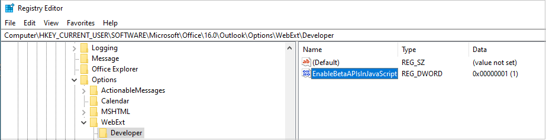

# <a name="configure-your-outlook-add-in-for-event-based-activation"></a><span data-ttu-id="2a1bb-103">配置Outlook加载项进行基于事件的激活</span><span class="sxs-lookup"><span data-stu-id="2a1bb-103">Configure your Outlook add-in for event-based activation</span></span>

<span data-ttu-id="2a1bb-104">如果没有基于事件的激活功能，用户必须显式启动外接程序才能完成其任务。</span><span class="sxs-lookup"><span data-stu-id="2a1bb-104">Without the event-based activation feature, a user has to explicitly launch an add-in to complete their tasks.</span></span> <span data-ttu-id="2a1bb-105">此功能使加载项能够运行基于特定事件的任务，尤其是适用于每个项目的操作。</span><span class="sxs-lookup"><span data-stu-id="2a1bb-105">This feature enables your add-in to run tasks based on certain events, particularly for operations that apply to every item.</span></span> <span data-ttu-id="2a1bb-106">还可以与任务窗格和无 UI 功能集成。</span><span class="sxs-lookup"><span data-stu-id="2a1bb-106">You can also integrate with the task pane and UI-less functionality.</span></span>

<span data-ttu-id="2a1bb-107">在此演练结束时，您将具有一个加载项，只要创建一个新建项目并设置主题，就会运行该加载项。</span><span class="sxs-lookup"><span data-stu-id="2a1bb-107">By the end of this walkthrough, you'll have an add-in that runs whenever a new item is created and sets the subject.</span></span>

> [!NOTE]
> <span data-ttu-id="2a1bb-108">要求集 [1.10](../reference/objectmodel/requirement-set-1.10/outlook-requirement-set-1.10.md)中引入了对此功能的支持。</span><span class="sxs-lookup"><span data-stu-id="2a1bb-108">Support for this feature was introduced in [requirement set 1.10](../reference/objectmodel/requirement-set-1.10/outlook-requirement-set-1.10.md).</span></span> <span data-ttu-id="2a1bb-109">请查看支持此要求集的[客户端和平台](../reference/requirement-sets/outlook-api-requirement-sets.md#requirement-sets-supported-by-exchange-servers-and-outlook-clients)。</span><span class="sxs-lookup"><span data-stu-id="2a1bb-109">See [clients and platforms](../reference/requirement-sets/outlook-api-requirement-sets.md#requirement-sets-supported-by-exchange-servers-and-outlook-clients) that support this requirement set.</span></span>

## <a name="supported-events"></a><span data-ttu-id="2a1bb-110">支持的事件</span><span class="sxs-lookup"><span data-stu-id="2a1bb-110">Supported events</span></span>

<span data-ttu-id="2a1bb-111">目前，Web 和 Web 上支持以下Windows。</span><span class="sxs-lookup"><span data-stu-id="2a1bb-111">At present, the following events are supported on the web and on Windows.</span></span>

|<span data-ttu-id="2a1bb-112">事件</span><span class="sxs-lookup"><span data-stu-id="2a1bb-112">Event</span></span>|<span data-ttu-id="2a1bb-113">说明</span><span class="sxs-lookup"><span data-stu-id="2a1bb-113">Description</span></span>|<span data-ttu-id="2a1bb-114">最小值</span><span class="sxs-lookup"><span data-stu-id="2a1bb-114">Minimum</span></span><br><span data-ttu-id="2a1bb-115">要求集</span><span class="sxs-lookup"><span data-stu-id="2a1bb-115">requirement set</span></span>|
|---|---|---|
|`OnNewMessageCompose`|<span data-ttu-id="2a1bb-116">撰写新邮件时 (包括答复、全部答复和转发) ，但不包括编辑时，例如草稿。</span><span class="sxs-lookup"><span data-stu-id="2a1bb-116">On composing a new message (includes reply, reply all, and forward) but not on editing, for example, a draft.</span></span>|<span data-ttu-id="2a1bb-117">1.10</span><span class="sxs-lookup"><span data-stu-id="2a1bb-117">1.10</span></span>|
|`OnNewAppointmentOrganizer`|<span data-ttu-id="2a1bb-118">创建新约会但不编辑现有约会时。</span><span class="sxs-lookup"><span data-stu-id="2a1bb-118">On creating a new appointment but not on editing an existing one.</span></span>|<span data-ttu-id="2a1bb-119">1.10</span><span class="sxs-lookup"><span data-stu-id="2a1bb-119">1.10</span></span>|
|`OnMessageAttachmentsChanged`|<span data-ttu-id="2a1bb-120">在撰写邮件时添加或删除附件。</span><span class="sxs-lookup"><span data-stu-id="2a1bb-120">On adding or removing attachments while composing a message.</span></span>|<span data-ttu-id="2a1bb-121">预览</span><span class="sxs-lookup"><span data-stu-id="2a1bb-121">Preview</span></span>|
|`OnAppointmentAttachmentsChanged`|<span data-ttu-id="2a1bb-122">在撰写约会时添加或删除附件。</span><span class="sxs-lookup"><span data-stu-id="2a1bb-122">On adding or removing attachments while composing an appointment.</span></span>|<span data-ttu-id="2a1bb-123">预览</span><span class="sxs-lookup"><span data-stu-id="2a1bb-123">Preview</span></span>|
|`OnMessageRecipientsChanged`|<span data-ttu-id="2a1bb-124">在撰写邮件时添加或删除收件人。</span><span class="sxs-lookup"><span data-stu-id="2a1bb-124">On adding or removing recipients while composing a message.</span></span>|<span data-ttu-id="2a1bb-125">预览</span><span class="sxs-lookup"><span data-stu-id="2a1bb-125">Preview</span></span>|
|`OnAppointmentAttendeesChanged`|<span data-ttu-id="2a1bb-126">在撰写约会时添加或删除与会者。</span><span class="sxs-lookup"><span data-stu-id="2a1bb-126">On adding or removing attendees while composing an appointment.</span></span>|<span data-ttu-id="2a1bb-127">预览</span><span class="sxs-lookup"><span data-stu-id="2a1bb-127">Preview</span></span>|
|`OnAppointmentTimeChanged`|<span data-ttu-id="2a1bb-128">在撰写约会时更改日期/时间。</span><span class="sxs-lookup"><span data-stu-id="2a1bb-128">On changing date/time while composing an appointment.</span></span>|<span data-ttu-id="2a1bb-129">预览</span><span class="sxs-lookup"><span data-stu-id="2a1bb-129">Preview</span></span>|
|`OnAppointmentRecurrenceChanged`|<span data-ttu-id="2a1bb-130">在撰写约会时添加、更改或删除定期详细信息。</span><span class="sxs-lookup"><span data-stu-id="2a1bb-130">On adding, changing, or removing the recurrence details while composing an appointment.</span></span> <span data-ttu-id="2a1bb-131">如果日期/时间发生更改， `OnAppointmentTimeChanged` 也会触发该事件。</span><span class="sxs-lookup"><span data-stu-id="2a1bb-131">If the date/time is changed, the `OnAppointmentTimeChanged` event will also be fired.</span></span>|<span data-ttu-id="2a1bb-132">预览</span><span class="sxs-lookup"><span data-stu-id="2a1bb-132">Preview</span></span>|
|`OnInfoBarDismissClicked`|<span data-ttu-id="2a1bb-133">在撰写邮件或约会项目时关闭通知。</span><span class="sxs-lookup"><span data-stu-id="2a1bb-133">On dismissing a notification while composing a message or appointment item.</span></span> <span data-ttu-id="2a1bb-134">仅通知添加了通知的外接程序。</span><span class="sxs-lookup"><span data-stu-id="2a1bb-134">Only the add-in that added the notification will be notified.</span></span>|<span data-ttu-id="2a1bb-135">预览</span><span class="sxs-lookup"><span data-stu-id="2a1bb-135">Preview</span></span>|

> [!IMPORTANT]
> <span data-ttu-id="2a1bb-136">仍在预览中的事件仅适用于 Microsoft 365 订阅Outlook 网页版和 Windows。</span><span class="sxs-lookup"><span data-stu-id="2a1bb-136">Events still in preview are only available with a Microsoft 365 subscription in Outlook on the web and on Windows.</span></span> <span data-ttu-id="2a1bb-137">有关详细信息，请参阅 [本文中的](#how-to-preview) 如何预览。</span><span class="sxs-lookup"><span data-stu-id="2a1bb-137">For more details, see [How to preview](#how-to-preview) in this article.</span></span> <span data-ttu-id="2a1bb-138">预览事件不应在生产外接程序中使用。</span><span class="sxs-lookup"><span data-stu-id="2a1bb-138">Preview events shouldn't be used in production add-ins.</span></span>

### <a name="how-to-preview"></a><span data-ttu-id="2a1bb-139">如何预览</span><span class="sxs-lookup"><span data-stu-id="2a1bb-139">How to preview</span></span>

<span data-ttu-id="2a1bb-140">我们邀请你立即预览一下事件！</span><span class="sxs-lookup"><span data-stu-id="2a1bb-140">We invite you to try out the events now in preview!</span></span> <span data-ttu-id="2a1bb-141">请告诉我们你的方案，以及我们如何通过反馈提供反馈GitHub (请参阅此页面末尾的反馈部分) 。 </span><span class="sxs-lookup"><span data-stu-id="2a1bb-141">Let us know your scenarios and how we can improve by giving us feedback through GitHub (see the **Feedback** section at the end of this page).</span></span>

<span data-ttu-id="2a1bb-142">预览这些事件：</span><span class="sxs-lookup"><span data-stu-id="2a1bb-142">To preview these events:</span></span>

- <span data-ttu-id="2a1bb-143">例如Outlook 网页版：</span><span class="sxs-lookup"><span data-stu-id="2a1bb-143">For Outlook on the web:</span></span>
  - <span data-ttu-id="2a1bb-144">[在租户 上配置Microsoft 365版本](/microsoft-365/admin/manage/release-options-in-office-365?view=o365-worldwide&preserve-view=true#set-up-the-release-option-in-the-admin-center)。</span><span class="sxs-lookup"><span data-stu-id="2a1bb-144">[Configure targeted release on your Microsoft 365 tenant](/microsoft-365/admin/manage/release-options-in-office-365?view=o365-worldwide&preserve-view=true#set-up-the-release-option-in-the-admin-center).</span></span>
  - <span data-ttu-id="2a1bb-145">在 上 **引用** beta https://appsforoffice.microsoft.com/lib/beta/hosted/office.js) CDN (。</span><span class="sxs-lookup"><span data-stu-id="2a1bb-145">Reference the **beta** library on the CDN (https://appsforoffice.microsoft.com/lib/beta/hosted/office.js).</span></span> <span data-ttu-id="2a1bb-146">TypeScript[编译和](https://appsforoffice.microsoft.com/lib/beta/hosted/office.d.ts)定义类型定义IntelliSense位于 CDN[和 DefinitelyTyped 中](https://raw.githubusercontent.com/DefinitelyTyped/DefinitelyTyped/master/types/office-js-preview/index.d.ts)。</span><span class="sxs-lookup"><span data-stu-id="2a1bb-146">The [type definition file](https://appsforoffice.microsoft.com/lib/beta/hosted/office.d.ts) for TypeScript compilation and IntelliSense is found at the CDN and [DefinitelyTyped](https://raw.githubusercontent.com/DefinitelyTyped/DefinitelyTyped/master/types/office-js-preview/index.d.ts).</span></span> <span data-ttu-id="2a1bb-147">可以使用 安装这些类型 `npm install --save-dev @types/office-js-preview` 。</span><span class="sxs-lookup"><span data-stu-id="2a1bb-147">You can install these types with `npm install --save-dev @types/office-js-preview`.</span></span>
- <span data-ttu-id="2a1bb-148">有关Outlook Windows：</span><span class="sxs-lookup"><span data-stu-id="2a1bb-148">For Outlook on Windows:</span></span>
  - <span data-ttu-id="2a1bb-149">最低要求版本为 16.0.14026.20000。</span><span class="sxs-lookup"><span data-stu-id="2a1bb-149">The minimum required build is 16.0.14026.20000.</span></span> <span data-ttu-id="2a1bb-150">加入[Office 预览体验计划](https://insider.office.com)，以访问 Office beta 版本。</span><span class="sxs-lookup"><span data-stu-id="2a1bb-150">Join the [Office Insider program](https://insider.office.com) for access to Office beta builds.</span></span>
  - <span data-ttu-id="2a1bb-151">配置注册表。</span><span class="sxs-lookup"><span data-stu-id="2a1bb-151">Configure the registry.</span></span> <span data-ttu-id="2a1bb-152">Outlook包括 Office.js 的生产和 beta 版本的本地副本，而不是从 CDN。</span><span class="sxs-lookup"><span data-stu-id="2a1bb-152">Outlook includes a local copy of the production and beta versions of Office.js instead of loading from the CDN.</span></span> <span data-ttu-id="2a1bb-153">默认情况下，将引用 API 的本地生产副本。</span><span class="sxs-lookup"><span data-stu-id="2a1bb-153">By default, the local production copy of the API is referenced.</span></span> <span data-ttu-id="2a1bb-154">若要切换到 JavaScript API 的本地 beta Outlook，需要添加此注册表项，否则可能无法找到 beta API。</span><span class="sxs-lookup"><span data-stu-id="2a1bb-154">To switch to the local beta copy of the Outlook JavaScript APIs, you need to add this registry entry, otherwise beta APIs may not be found.</span></span>
    1. <span data-ttu-id="2a1bb-155">创建注册表项 `HKEY_CURRENT_USER\SOFTWARE\Microsoft\Office\16.0\Outlook\Options\WebExt\Developer` 。</span><span class="sxs-lookup"><span data-stu-id="2a1bb-155">Create the registry key `HKEY_CURRENT_USER\SOFTWARE\Microsoft\Office\16.0\Outlook\Options\WebExt\Developer`.</span></span>
    1. <span data-ttu-id="2a1bb-156">添加一个名为 的 `EnableBetaAPIsInJavaScript` 条目，将值设置为 `1` 。</span><span class="sxs-lookup"><span data-stu-id="2a1bb-156">Add an entry named `EnableBetaAPIsInJavaScript` and set the value to `1`.</span></span> <span data-ttu-id="2a1bb-157">下图显示注册表应该呈现的状态。</span><span class="sxs-lookup"><span data-stu-id="2a1bb-157">The following image shows what the registry should look like.</span></span>

        

## <a name="set-up-your-environment"></a><span data-ttu-id="2a1bb-159">设置环境</span><span class="sxs-lookup"><span data-stu-id="2a1bb-159">Set up your environment</span></span>

<span data-ttu-id="2a1bb-160">完成[Outlook](../quickstarts/outlook-quickstart.md?tabs=yeomangenerator)使用适用于加载项的 Yeoman 生成器创建加载项Office快速入门。</span><span class="sxs-lookup"><span data-stu-id="2a1bb-160">Complete the [Outlook quick start](../quickstarts/outlook-quickstart.md?tabs=yeomangenerator) which creates an add-in project with the Yeoman generator for Office Add-ins.</span></span>

## <a name="configure-the-manifest"></a><span data-ttu-id="2a1bb-161">配置清单</span><span class="sxs-lookup"><span data-stu-id="2a1bb-161">Configure the manifest</span></span>

<span data-ttu-id="2a1bb-162">若要启用加载项的基于事件的激活，必须在清单节点中配置 [Runtimes](../reference/manifest/runtimes.md) 元素和 [LaunchEvent](../reference/manifest/extensionpoint.md#launchevent) `VersionOverridesV1_1` 扩展点。</span><span class="sxs-lookup"><span data-stu-id="2a1bb-162">To enable event-based activation of your add-in, you must configure the [Runtimes](../reference/manifest/runtimes.md) element and [LaunchEvent](../reference/manifest/extensionpoint.md#launchevent) extension point in the `VersionOverridesV1_1` node of the manifest.</span></span> <span data-ttu-id="2a1bb-163">目前， `DesktopFormFactor` 是唯一受支持的外形类型。</span><span class="sxs-lookup"><span data-stu-id="2a1bb-163">For now, `DesktopFormFactor` is the only supported form factor.</span></span>

1. <span data-ttu-id="2a1bb-164">在代码编辑器中，打开快速启动项目。</span><span class="sxs-lookup"><span data-stu-id="2a1bb-164">In your code editor, open the quick start project.</span></span>

1. <span data-ttu-id="2a1bb-165">打开 **manifest.xml** 根目录下的文件。</span><span class="sxs-lookup"><span data-stu-id="2a1bb-165">Open the **manifest.xml** file located at the root of your project.</span></span>

1. <span data-ttu-id="2a1bb-166">选择整个节点 (包括打开和关闭) `<VersionOverrides>` 并将其替换为以下 XML，然后保存更改。</span><span class="sxs-lookup"><span data-stu-id="2a1bb-166">Select the entire `<VersionOverrides>` node (including open and close tags) and replace it with the following XML, then save your changes.</span></span>

```XML
<VersionOverrides xmlns="http://schemas.microsoft.com/office/mailappversionoverrides" xsi:type="VersionOverridesV1_0">
  <VersionOverrides xmlns="http://schemas.microsoft.com/office/mailappversionoverrides/1.1" xsi:type="VersionOverridesV1_1">
    <Requirements>
      <bt:Sets DefaultMinVersion="1.3">
        <bt:Set Name="Mailbox" />
      </bt:Sets>
    </Requirements>
    <Hosts>
      <Host xsi:type="MailHost">
        <!-- Event-based activation happens in a lightweight runtime.-->
        <Runtimes>
          <!-- HTML file including reference to or inline JavaScript event handlers.
               This is used by Outlook on the web. -->
          <Runtime resid="WebViewRuntime.Url">
            <!-- JavaScript file containing event handlers. This is used by Outlook Desktop. -->
            <Override type="javascript" resid="JSRuntime.Url"/>
          </Runtime>
        </Runtimes>
        <DesktopFormFactor>
          <FunctionFile resid="Commands.Url" />
          <ExtensionPoint xsi:type="MessageReadCommandSurface">
            <OfficeTab id="TabDefault">
              <Group id="msgReadGroup">
                <Label resid="GroupLabel" />
                <Control xsi:type="Button" id="msgReadOpenPaneButton">
                  <Label resid="TaskpaneButton.Label" />
                  <Supertip>
                    <Title resid="TaskpaneButton.Label" />
                    <Description resid="TaskpaneButton.Tooltip" />
                  </Supertip>
                  <Icon>
                    <bt:Image size="16" resid="Icon.16x16" />
                    <bt:Image size="32" resid="Icon.32x32" />
                    <bt:Image size="80" resid="Icon.80x80" />
                  </Icon>
                  <Action xsi:type="ShowTaskpane">
                    <SourceLocation resid="Taskpane.Url" />
                  </Action>
                </Control>
                <Control xsi:type="Button" id="ActionButton">
                  <Label resid="ActionButton.Label"/>
                  <Supertip>
                    <Title resid="ActionButton.Label"/>
                    <Description resid="ActionButton.Tooltip"/>
                  </Supertip>
                  <Icon>
                    <bt:Image size="16" resid="Icon.16x16"/>
                    <bt:Image size="32" resid="Icon.32x32"/>
                    <bt:Image size="80" resid="Icon.80x80"/>
                  </Icon>
                  <Action xsi:type="ExecuteFunction">
                    <FunctionName>action</FunctionName>
                  </Action>
                </Control>
              </Group>
            </OfficeTab>
          </ExtensionPoint>

          <!-- Can configure other command surface extension points for add-in command support. -->

          <!-- Enable launching the add-in on the included events. -->
          <ExtensionPoint xsi:type="LaunchEvent">
            <LaunchEvents>
              <LaunchEvent Type="OnNewMessageCompose" FunctionName="onMessageComposeHandler"/>
              <LaunchEvent Type="OnNewAppointmentOrganizer" FunctionName="onAppointmentComposeHandler"/>
              <LaunchEvent Type="OnMessageAttachmentsChanged" FunctionName="onMessageAttachmentsChangedHandler" />
              <LaunchEvent Type="OnAppointmentAttachmentsChanged" FunctionName="onAppointmentAttachmentsChangedHandler" />
              <LaunchEvent Type="OnMessageRecipientsChanged" FunctionName="onMessageRecipientsChangedHandler" />
              <LaunchEvent Type="OnAppointmentAttendeesChanged" FunctionName="onAppointmentAttendeesChangedHandler" />
              <LaunchEvent Type="OnAppointmentTimeChanged" FunctionName="onAppointmentTimeChangedHandler" />
              <LaunchEvent Type="OnAppointmentRecurrenceChanged" FunctionName="onAppointmentRecurrenceChangedHandler" />
              <LaunchEvent Type="OnInfoBarDismissClicked" FunctionName="onInfobarDismissClickedHandler" />
            </LaunchEvents>
            <!-- Identifies the runtime to be used (also referenced by the Runtime element). -->
            <SourceLocation resid="WebViewRuntime.Url"/>
          </ExtensionPoint>
        </DesktopFormFactor>
      </Host>
    </Hosts>
    <Resources>
      <bt:Images>
        <bt:Image id="Icon.16x16" DefaultValue="https://localhost:3000/assets/icon-16.png"/>
        <bt:Image id="Icon.32x32" DefaultValue="https://localhost:3000/assets/icon-32.png"/>
        <bt:Image id="Icon.80x80" DefaultValue="https://localhost:3000/assets/icon-80.png"/>
      </bt:Images>
      <bt:Urls>
        <bt:Url id="Commands.Url" DefaultValue="https://localhost:3000/commands.html" />
        <bt:Url id="Taskpane.Url" DefaultValue="https://localhost:3000/taskpane.html" />
        <bt:Url id="WebViewRuntime.Url" DefaultValue="https://localhost:3000/commands.html" />
        <!-- Entry needed for Outlook Desktop. -->
        <bt:Url id="JSRuntime.Url" DefaultValue="https://localhost:3000/src/commands/commands.js" />
      </bt:Urls>
      <bt:ShortStrings>
        <bt:String id="GroupLabel" DefaultValue="Contoso Add-in"/>
        <bt:String id="TaskpaneButton.Label" DefaultValue="Show Taskpane"/>
        <bt:String id="ActionButton.Label" DefaultValue="Perform an action"/>
      </bt:ShortStrings>
      <bt:LongStrings>
        <bt:String id="TaskpaneButton.Tooltip" DefaultValue="Opens a pane displaying all available properties."/>
        <bt:String id="ActionButton.Tooltip" DefaultValue="Perform an action when clicked."/>
      </bt:LongStrings>
    </Resources>
  </VersionOverrides>
</VersionOverrides>
```

<span data-ttu-id="2a1bb-167">Outlook Windows使用 JavaScript 文件，Outlook 网页版使用可引用同一 JavaScript 文件的 HTML 文件。</span><span class="sxs-lookup"><span data-stu-id="2a1bb-167">Outlook on Windows uses a JavaScript file, while Outlook on the web uses an HTML file that can reference the same JavaScript file.</span></span> <span data-ttu-id="2a1bb-168">你必须在清单的节点中提供对这两个文件的引用，因为 Outlook 平台最终确定是使用 HTML 还是基于 Outlook `Resources` 客户端的 JavaScript。</span><span class="sxs-lookup"><span data-stu-id="2a1bb-168">You must provide references to both these files in the `Resources` node of the manifest as the Outlook platform ultimately determines whether to use HTML or JavaScript based on the Outlook client.</span></span> <span data-ttu-id="2a1bb-169">因此，若要配置事件处理，请提供 HTML 在 元素中的位置，然后在其子元素中提供 JavaScript 文件内附或 HTML `Runtime` `Override` 引用的位置。</span><span class="sxs-lookup"><span data-stu-id="2a1bb-169">As such, to configure event handling, provide the location of the HTML in the `Runtime` element, then in its `Override` child element provide the location of the JavaScript file inlined or referenced by the HTML.</span></span>

> [!TIP]
> <span data-ttu-id="2a1bb-170">若要了解有关加载项清单Outlook，请参阅Outlook[加载项清单](manifests.md)。</span><span class="sxs-lookup"><span data-stu-id="2a1bb-170">To learn more about manifests for Outlook add-ins, see [Outlook add-in manifests](manifests.md).</span></span>

## <a name="implement-event-handling"></a><span data-ttu-id="2a1bb-171">实现事件处理</span><span class="sxs-lookup"><span data-stu-id="2a1bb-171">Implement event handling</span></span>

<span data-ttu-id="2a1bb-172">您必须对所选事件实现处理。</span><span class="sxs-lookup"><span data-stu-id="2a1bb-172">You have to implement handling for your selected events.</span></span>

<span data-ttu-id="2a1bb-173">在此方案中，您将添加用于撰写新项的处理。</span><span class="sxs-lookup"><span data-stu-id="2a1bb-173">In this scenario, you'll add handling for composing new items.</span></span>

1. <span data-ttu-id="2a1bb-174">从同一快速启动项目中，在代码编辑器中打开 **commands.js./src/commands/commands.js** 文件。</span><span class="sxs-lookup"><span data-stu-id="2a1bb-174">From the same quick start project, open the file **./src/commands/commands.js** in your code editor.</span></span>

1. <span data-ttu-id="2a1bb-175">在 函数 `action` 之后，插入以下 JavaScript 函数。</span><span class="sxs-lookup"><span data-stu-id="2a1bb-175">After the `action` function, insert the following JavaScript functions.</span></span>

    ```js
    function onMessageComposeHandler(event) {
      setSubject(event);
    }
    function onAppointmentComposeHandler(event) {
      setSubject(event);
    }
    function setSubject(event) {
      Office.context.mailbox.item.subject.setAsync(
        "Set by an event-based add-in!",
        {
          "asyncContext" : event
        },
        function (asyncResult) {
          // Handle success or error.
          if (asyncResult.status !== Office.AsyncResultStatus.Succeeded) {
            console.error("Failed to set subject: " + JSON.stringify(asyncResult.error));
          }
    
          // Call event.completed() after all work is done.
          asyncResult.asyncContext.completed();
        });
    }
    ```

1. <span data-ttu-id="2a1bb-176">在文件末尾添加以下 JavaScript 代码。</span><span class="sxs-lookup"><span data-stu-id="2a1bb-176">Add the following JavaScript code at the end of the file.</span></span>

    ```js
    // 1st parameter: FunctionName of LaunchEvent in the manifest; 2nd parameter: Its implementation in this .js file.
    Office.actions.associate("onMessageComposeHandler", onMessageComposeHandler);
    Office.actions.associate("onAppointmentComposeHandler", onAppointmentComposeHandler);
    ```

1. <span data-ttu-id="2a1bb-177">保存所做的更改。</span><span class="sxs-lookup"><span data-stu-id="2a1bb-177">Save your changes.</span></span>

> [!IMPORTANT]
> <span data-ttu-id="2a1bb-178">Windows：目前，在执行基于事件的激活的处理的 JavaScript 文件中不支持导入。</span><span class="sxs-lookup"><span data-stu-id="2a1bb-178">Windows: At present, imports are not supported in the JavaScript file where you implement the handling for event-based activation.</span></span>

## <a name="try-it-out"></a><span data-ttu-id="2a1bb-179">试用</span><span class="sxs-lookup"><span data-stu-id="2a1bb-179">Try it out</span></span>

1. <span data-ttu-id="2a1bb-180">在项目的根目录中运行以下命令。</span><span class="sxs-lookup"><span data-stu-id="2a1bb-180">Run the following command in the root directory of your project.</span></span> <span data-ttu-id="2a1bb-181">如果运行此命令，本地 Web 服务器将启动（如果尚未运行），并将旁加载加载项。</span><span class="sxs-lookup"><span data-stu-id="2a1bb-181">When you run this command, the local web server will start (if it's not already running) and your add-in will be sideloaded.</span></span>

    ```command&nbsp;line
    npm start
    ```

    > [!NOTE]
    > <span data-ttu-id="2a1bb-182">如果加载项未自动旁加载，请按照旁加载[Outlook](../outlook/sideload-outlook-add-ins-for-testing.md#sideload-manually)加载项进行测试中的说明，在加载项中手动旁加载Outlook。</span><span class="sxs-lookup"><span data-stu-id="2a1bb-182">If your add-in wasn't automatically sideloaded, then follow the instructions in [Sideload Outlook add-ins for testing](../outlook/sideload-outlook-add-ins-for-testing.md#sideload-manually) to manually sideload the add-in in Outlook.</span></span>

1. <span data-ttu-id="2a1bb-183">在 Outlook 网页版中，创建新邮件。</span><span class="sxs-lookup"><span data-stu-id="2a1bb-183">In Outlook on the web, create a new message.</span></span>

    

1. <span data-ttu-id="2a1bb-185">在Outlook中Windows新建一封邮件。</span><span class="sxs-lookup"><span data-stu-id="2a1bb-185">In Outlook on Windows, create a new message.</span></span>

    

    > [!NOTE]
    > <span data-ttu-id="2a1bb-187">如果您从 localhost 运行您的外接程序，并且看到错误"很抱歉，我们无法访问 *{your-add-in-name-here}*。</span><span class="sxs-lookup"><span data-stu-id="2a1bb-187">If you're running your add-in from localhost and see the error "We're sorry, we couldn't access *{your-add-in-name-here}*.</span></span> <span data-ttu-id="2a1bb-188">请确保具有网络连接。</span><span class="sxs-lookup"><span data-stu-id="2a1bb-188">Make sure you have a network connection.</span></span> <span data-ttu-id="2a1bb-189">如果问题继续，请稍后重试。"，你可能需要启用环回豁免。</span><span class="sxs-lookup"><span data-stu-id="2a1bb-189">If the problem continues, please try again later.", you may need to enable a loopback exemption.</span></span>
    >
    > 1. <span data-ttu-id="2a1bb-190">关闭 Outlook。</span><span class="sxs-lookup"><span data-stu-id="2a1bb-190">Close Outlook.</span></span>
    > 1. <span data-ttu-id="2a1bb-191">打开 **任务管理器** ， **并确保msoadfsb.exe进程** 未运行。</span><span class="sxs-lookup"><span data-stu-id="2a1bb-191">Open the **Task Manager** and ensure that the **msoadfsb.exe** process is not running.</span></span>
    > 1. <span data-ttu-id="2a1bb-192">运行以下命令：</span><span class="sxs-lookup"><span data-stu-id="2a1bb-192">Run the following command.</span></span>
    >
    >    ```command&nbsp;line
    >    call %SystemRoot%\System32\CheckNetIsolation.exe LoopbackExempt -a -n=1_http___localhost_300004ACA5EC-D79A-43EA-AB47-E50E47DD96FC
    >    ```
    >
    > 1. <span data-ttu-id="2a1bb-193">重新启动 Outlook。</span><span class="sxs-lookup"><span data-stu-id="2a1bb-193">Restart Outlook.</span></span>

## <a name="debug"></a><span data-ttu-id="2a1bb-194">Debug</span><span class="sxs-lookup"><span data-stu-id="2a1bb-194">Debug</span></span>

<span data-ttu-id="2a1bb-195">在外接程序中对启动事件处理进行更改时，应注意：</span><span class="sxs-lookup"><span data-stu-id="2a1bb-195">As you make changes to launch-event handling in your add-in, you should be aware that:</span></span>

- <span data-ttu-id="2a1bb-196">如果更新了清单 [，请删除加载项，](sideload-outlook-add-ins-for-testing.md#remove-a-sideloaded-add-in) 然后再次旁加载它。</span><span class="sxs-lookup"><span data-stu-id="2a1bb-196">If you updated the manifest, [remove the add-in](sideload-outlook-add-ins-for-testing.md#remove-a-sideloaded-add-in) then sideload it again.</span></span>
- <span data-ttu-id="2a1bb-197">如果对清单外的文件进行了更改，请关闭并重新打开Outlook或Windows浏览器选项卡以Outlook 网页版。</span><span class="sxs-lookup"><span data-stu-id="2a1bb-197">If you made changes to files other than the manifest, close and reopen Outlook on Windows, or refresh the browser tab running Outlook on the web.</span></span>

<span data-ttu-id="2a1bb-198">实现自己的功能时，可能需要调试代码。</span><span class="sxs-lookup"><span data-stu-id="2a1bb-198">While implementing your own functionality, you may need to debug your code.</span></span> <span data-ttu-id="2a1bb-199">有关如何调试基于事件的外接程序激活的指南，请参阅调试基于事件Outlook[外接程序](debug-autolaunch.md)。</span><span class="sxs-lookup"><span data-stu-id="2a1bb-199">For guidance on how to debug event-based add-in activation, see [Debug your event-based Outlook add-in](debug-autolaunch.md).</span></span>

<span data-ttu-id="2a1bb-200">运行时日志记录还可用于 Windows。</span><span class="sxs-lookup"><span data-stu-id="2a1bb-200">Runtime logging is also available for this feature on Windows.</span></span> <span data-ttu-id="2a1bb-201">有关详细信息，请参阅使用运行时 [日志记录调试加载项](../testing/runtime-logging.md#runtime-logging-on-windows)。</span><span class="sxs-lookup"><span data-stu-id="2a1bb-201">For more information, see [Debug your add-in with runtime logging](../testing/runtime-logging.md#runtime-logging-on-windows).</span></span>

## <a name="deploy-to-users"></a><span data-ttu-id="2a1bb-202">部署到用户</span><span class="sxs-lookup"><span data-stu-id="2a1bb-202">Deploy to users</span></span>

<span data-ttu-id="2a1bb-203">可以通过在加载项中上传清单来部署基于事件的Microsoft 365 管理中心。</span><span class="sxs-lookup"><span data-stu-id="2a1bb-203">You can deploy event-based add-ins by uploading the manifest through the Microsoft 365 admin center.</span></span> <span data-ttu-id="2a1bb-204">在管理门户中，展开设置窗格中的"集成应用"部分，然后选择"**集成应用"。**</span><span class="sxs-lookup"><span data-stu-id="2a1bb-204">In the admin portal, expand the **Settings** section in the navigation pane then select **Integrated apps**.</span></span> <span data-ttu-id="2a1bb-205">在"**集成应用"** 页上，选择 **"Upload应用"** 操作。</span><span class="sxs-lookup"><span data-stu-id="2a1bb-205">On the **Integrated apps** page, choose the **Upload custom apps** action.</span></span>


<span data-ttu-id="2a1bb-207">AppSource 和客户端存储：即将推出部署基于事件的加载项或更新现有加载项以包含基于事件的激活功能的功能。</span><span class="sxs-lookup"><span data-stu-id="2a1bb-207">AppSource and inclient stores: The ability to deploy event-based add-ins or update existing add-ins to include the event-based activation feature should be available soon.</span></span>

> [!IMPORTANT]
> <span data-ttu-id="2a1bb-208">基于事件的外接程序仅限于管理员托管的部署。</span><span class="sxs-lookup"><span data-stu-id="2a1bb-208">Event-based add-ins are restricted to admin-managed deployments only.</span></span> <span data-ttu-id="2a1bb-209">目前，用户无法从 AppSource 或客户端应用商店获取基于事件的加载项。</span><span class="sxs-lookup"><span data-stu-id="2a1bb-209">For now, users can't get event-based add-ins from AppSource or inclient stores.</span></span>

## <a name="event-based-activation-behavior-and-limitations"></a><span data-ttu-id="2a1bb-210">基于事件的激活行为和限制</span><span class="sxs-lookup"><span data-stu-id="2a1bb-210">Event-based activation behavior and limitations</span></span>

<span data-ttu-id="2a1bb-211">加载项启动事件处理程序应尽量短运行、轻量且无影响。</span><span class="sxs-lookup"><span data-stu-id="2a1bb-211">Add-in launch-event handlers are expected to be short-running, lightweight, and as noninvasive as possible.</span></span> <span data-ttu-id="2a1bb-212">激活后，外接程序将在大约 300 秒（运行基于事件的外接程序所允许的最大时间长度）内退出。若要指示加载项已完成对启动事件的处理，我们建议让关联的处理程序调用 `event.completed` 方法。</span><span class="sxs-lookup"><span data-stu-id="2a1bb-212">After activation, your add-in will time out within approximately 300 seconds, the maximum length of time allowed for running event-based add-ins. To signal that your add-in has completed processing a launch event, we recommend you have the associated handler call the `event.completed` method.</span></span> <span data-ttu-id="2a1bb-213"> (请注意，语句后包含的代码不能保证运行。) 每次触发外接程序处理的事件时，外接程序将重新激活并运行关联的事件处理程序，超时窗口将重置。 `event.completed`</span><span class="sxs-lookup"><span data-stu-id="2a1bb-213">(Note that code included after the `event.completed` statement is not guaranteed to run.) Each time an event that your add-in handles is triggered, the add-in is reactivated and runs the associated event handler, and the timeout window is reset.</span></span> <span data-ttu-id="2a1bb-214">外接程序在时间结束后结束，或者用户关闭撰写窗口或发送项目。</span><span class="sxs-lookup"><span data-stu-id="2a1bb-214">The add-in ends after it times out, or the user closes the compose window or sends the item.</span></span>

<span data-ttu-id="2a1bb-215">如果用户有多个订阅了同一事件的加载项，Outlook平台将按特定顺序启动加载项。</span><span class="sxs-lookup"><span data-stu-id="2a1bb-215">If the user has multiple add-ins that subscribed to the same event, the Outlook platform launches the add-ins in no particular order.</span></span> <span data-ttu-id="2a1bb-216">目前，只能主动运行五个基于事件的加载项。</span><span class="sxs-lookup"><span data-stu-id="2a1bb-216">Currently, only five event-based add-ins can be actively running.</span></span>

<span data-ttu-id="2a1bb-217">用户可以切换或导航离开外接程序开始运行的当前邮件项目。</span><span class="sxs-lookup"><span data-stu-id="2a1bb-217">The user can switch or navigate away from the current mail item where the add-in started running.</span></span> <span data-ttu-id="2a1bb-218">启动的加载项将在后台完成其操作。</span><span class="sxs-lookup"><span data-stu-id="2a1bb-218">The add-in that was launched will finish its operation in the background.</span></span>

<span data-ttu-id="2a1bb-219">JavaScript 文件中不支持导入，在 JavaScript 文件中，您可以在 Windows 客户端中执行基于事件的激活。</span><span class="sxs-lookup"><span data-stu-id="2a1bb-219">Imports are not supported in the JavaScript file where you implement the handling for event-based activation in the Windows client.</span></span>

<span data-ttu-id="2a1bb-220">某些Office.js更改或更改 UI 的 API 不允许来自基于事件的外接程序。以下是阻止的 API。</span><span class="sxs-lookup"><span data-stu-id="2a1bb-220">Some Office.js APIs that change or alter the UI are not allowed from event-based add-ins. The following are the blocked APIs.</span></span>

- <span data-ttu-id="2a1bb-221">在 `OfficeRuntime.auth` 下：</span><span class="sxs-lookup"><span data-stu-id="2a1bb-221">Under `OfficeRuntime.auth`:</span></span>
  - <span data-ttu-id="2a1bb-222">`getAccessToken` (Windows仅) </span><span class="sxs-lookup"><span data-stu-id="2a1bb-222">`getAccessToken` (Windows only)</span></span>
- <span data-ttu-id="2a1bb-223">在 `Office.context.auth` 下：</span><span class="sxs-lookup"><span data-stu-id="2a1bb-223">Under `Office.context.auth`:</span></span>
  - `getAccessToken`
  - `getAccessTokenAsync`
- <span data-ttu-id="2a1bb-224">在 `Office.context.mailbox` 下：</span><span class="sxs-lookup"><span data-stu-id="2a1bb-224">Under `Office.context.mailbox`:</span></span>
  - `displayAppointmentForm`
  - `displayMessageForm`
  - `displayNewAppointmentForm`
  - `displayNewMessageForm`
- <span data-ttu-id="2a1bb-225">在 `Office.context.mailbox.item` 下：</span><span class="sxs-lookup"><span data-stu-id="2a1bb-225">Under `Office.context.mailbox.item`:</span></span>
  - `close`
- <span data-ttu-id="2a1bb-226">在 `Office.context.ui` 下：</span><span class="sxs-lookup"><span data-stu-id="2a1bb-226">Under `Office.context.ui`:</span></span>
  - `displayDialogAsync`
  - `messageParent`

### <a name="requesting-external-data"></a><span data-ttu-id="2a1bb-227">请求外部数据</span><span class="sxs-lookup"><span data-stu-id="2a1bb-227">Requesting external data</span></span>

<span data-ttu-id="2a1bb-228">可以使用提取等 API 或[XmlHttpRequest (XHR) （](https://developer.mozilla.org/docs/Web/API/XMLHttpRequest)一种用于发送 HTTP 请求以与服务器交互的标准 Web API）请求外部数据。 [](https://developer.mozilla.org/docs/Web/API/Fetch_API)</span><span class="sxs-lookup"><span data-stu-id="2a1bb-228">You can request external data by using an API like [Fetch](https://developer.mozilla.org/docs/Web/API/Fetch_API) or by using [XmlHttpRequest (XHR)](https://developer.mozilla.org/docs/Web/API/XMLHttpRequest), a standard web API that issues HTTP requests to interact with servers.</span></span>

<span data-ttu-id="2a1bb-229">请注意，在生成 XmlHttpRequest 时，必须使用其他安全措施，要求使用同源[策略和简单的](https://developer.mozilla.org/docs/Web/Security/Same-origin_policy) [CORS。](https://www.w3.org/TR/cors/)</span><span class="sxs-lookup"><span data-stu-id="2a1bb-229">Be aware that you must use additional security measures when making XmlHttpRequests, requiring [Same Origin Policy](https://developer.mozilla.org/docs/Web/Security/Same-origin_policy) and simple [CORS](https://www.w3.org/TR/cors/).</span></span>

<span data-ttu-id="2a1bb-230">简单的 CORS 实现无法使用 Cookie，并且仅支持 GET、HEAD、POST (简单) 。</span><span class="sxs-lookup"><span data-stu-id="2a1bb-230">A simple CORS implementation cannot use cookies and only supports simple methods (GET, HEAD, POST).</span></span> <span data-ttu-id="2a1bb-231">简单的 CORS 接受字段名称为 `Accept`、`Accept-Language`、`Content-Language` 的简单标题。</span><span class="sxs-lookup"><span data-stu-id="2a1bb-231">Simple CORS accepts simple headers with field names `Accept`, `Accept-Language`, `Content-Language`.</span></span> <span data-ttu-id="2a1bb-232">还可以在简单 `Content-Type` CORS 中使用标头，只要内容类型为 、 或 `application/x-www-form-urlencoded` `text/plain` `multipart/form-data` 。</span><span class="sxs-lookup"><span data-stu-id="2a1bb-232">You can also use a `Content-Type` header in simple CORS, provided that the content type is `application/x-www-form-urlencoded`, `text/plain`, or `multipart/form-data`.</span></span>

<span data-ttu-id="2a1bb-233">即将提供完整的 CORS 支持。</span><span class="sxs-lookup"><span data-stu-id="2a1bb-233">Full CORS support is coming soon.</span></span>

## <a name="see-also"></a><span data-ttu-id="2a1bb-234">另请参阅</span><span class="sxs-lookup"><span data-stu-id="2a1bb-234">See also</span></span>

- [<span data-ttu-id="2a1bb-235">Outlook 加载项清单</span><span class="sxs-lookup"><span data-stu-id="2a1bb-235">Outlook add-in manifests</span></span>](manifests.md)
- [<span data-ttu-id="2a1bb-236">如何调试基于事件的外接程序</span><span class="sxs-lookup"><span data-stu-id="2a1bb-236">How to debug event-based add-ins</span></span>](debug-autolaunch.md)
- [<span data-ttu-id="2a1bb-237">基于事件的加载项的 AppSource Outlook选项</span><span class="sxs-lookup"><span data-stu-id="2a1bb-237">AppSource listing options for your event-based Outlook add-in</span></span>](autolaunch-store-options.md)
- <span data-ttu-id="2a1bb-238">PnP 示例：</span><span class="sxs-lookup"><span data-stu-id="2a1bb-238">PnP samples:</span></span>
  - [<span data-ttu-id="2a1bb-239">使用Outlook基于事件的激活设置签名</span><span class="sxs-lookup"><span data-stu-id="2a1bb-239">Use Outlook event-based activation to set the signature</span></span>](https://github.com/OfficeDev/PnP-OfficeAddins/tree/main/Samples/outlook-set-signature)
  - [<span data-ttu-id="2a1bb-240">使用Outlook基于事件的激活来标记外部收件人</span><span class="sxs-lookup"><span data-stu-id="2a1bb-240">Use Outlook event-based activation to tag external recipients</span></span>](https://github.com/OfficeDev/PnP-OfficeAddins/tree/main/Samples/outlook-tag-external)
