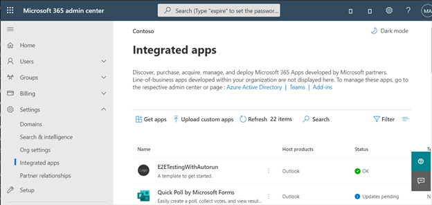

# <a name="configure-your-outlook-add-in-for-event-based-activation"></a>配置Outlook加载项进行基于事件的激活

如果没有基于事件的激活功能，用户必须显式启动外接程序才能完成其任务。 此功能使加载项能够运行基于特定事件的任务，尤其是适用于每个项目的操作。 还可以与任务窗格和无 UI 功能集成。

在此演练结束时，您将具有一个加载项，只要创建一个新建项目并设置主题，就会运行该加载项。

> [!NOTE]
> 要求集 [1.10 中引入了](/javascript/api/requirement-sets/outlook/requirement-set-1.10/outlook-requirement-set-1.10)对此功能的支持。 请查看支持此要求集的[客户端和平台](/javascript/api/requirement-sets/outlook/outlook-api-requirement-sets#requirement-sets-supported-by-exchange-servers-and-outlook-clients)。

## <a name="supported-events"></a>支持的事件

下表列出了当前可用的事件以及每个事件支持的客户端。 引发事件时，处理程序会收到一 `event` 个对象，该对象可能包含特定于事件类型的详细信息。 " **说明** "列包含指向相关对象的链接（如果适用）。

> [!IMPORTANT]
> 仍在预览中的事件可能仅可用于 Microsoft 365 订阅和下表中说明的一组有限的受支持客户端。 有关客户端配置的详细信息，请参阅 [本文中的](#how-to-preview) 如何预览。 预览事件不应在生产外接程序中使用。

|事件|说明|最低要求集和支持的客户端|
|---|---|---|
|`OnNewMessageCompose`|撰写新邮件时 (包括答复、全部答复和转发) 而不是编辑时，例如草稿。|[1.10](/javascript/api/requirement-sets/outlook/requirement-set-1.10/outlook-requirement-set-1.10)<br><br>- Windows<br>- Web 浏览器<br>- 新 Mac UI 预览|
|`OnNewAppointmentOrganizer`|创建新约会但不编辑现有约会时。|[1.10](/javascript/api/requirement-sets/outlook/requirement-set-1.10/outlook-requirement-set-1.10)<br><br>- Windows<br>- Web 浏览器<br>- 新 Mac UI 预览|
|`OnMessageAttachmentsChanged`|在撰写邮件时添加或删除附件。<br><br>特定于事件的数据对象： [AttachmentsChangedEventArgs](/javascript/api/outlook/office.attachmentschangedeventargs?view=outlook-js-1.11&preserve-view=true)|[1.11](/javascript/api/requirement-sets/outlook/requirement-set-1.11/outlook-requirement-set-1.11)<br><br>- Windows<br>- Web 浏览器|
|`OnAppointmentAttachmentsChanged`|在撰写约会时添加或删除附件。<br><br>特定于事件的数据对象： [AttachmentsChangedEventArgs](/javascript/api/outlook/office.attachmentschangedeventargs?view=outlook-js-1.11&preserve-view=true)|[1.11](/javascript/api/requirement-sets/outlook/requirement-set-1.11/outlook-requirement-set-1.11)<br><br>- Windows<br>- Web 浏览器|
|`OnMessageRecipientsChanged`|在撰写邮件时添加或删除收件人。<br><br>特定于事件的数据对象： [RecipientsChangedEventArgs](/javascript/api/outlook/office.recipientschangedeventargs?view=outlook-js-1.11&preserve-view=true)|[1.11](/javascript/api/requirement-sets/outlook/requirement-set-1.11/outlook-requirement-set-1.11)<br><br>- Windows<br>- Web 浏览器|
|`OnAppointmentAttendeesChanged`|在撰写约会时添加或删除与会者。<br><br>特定于事件的数据对象： [RecipientsChangedEventArgs](/javascript/api/outlook/office.recipientschangedeventargs?view=outlook-js-1.11&preserve-view=true)|[1.11](/javascript/api/requirement-sets/outlook/requirement-set-1.11/outlook-requirement-set-1.11)<br><br>- Windows<br>- Web 浏览器|
|`OnAppointmentTimeChanged`|在撰写约会时更改日期/时间。<br><br>特定于事件的数据对象： [AppointmentTimeChangedEventArgs](/javascript/api/outlook/office.appointmenttimechangedeventargs?view=outlook-js-1.11&preserve-view=true)|[1.11](/javascript/api/requirement-sets/outlook/requirement-set-1.11/outlook-requirement-set-1.11)<br><br>- Windows<br>- Web 浏览器|
|`OnAppointmentRecurrenceChanged`|在撰写约会时添加、更改或删除定期详细信息。 如果日期/时间发生更改， `OnAppointmentTimeChanged` 也会触发该事件。<br><br>特定于事件的数据对象： [RecurrenceChangedEventArgs](/javascript/api/outlook/office.recurrencechangedeventargs?view=outlook-js-1.11&preserve-view=true)|[1.11](/javascript/api/requirement-sets/outlook/requirement-set-1.11/outlook-requirement-set-1.11)<br><br>- Windows<br>- Web 浏览器|
|`OnInfoBarDismissClicked`|在撰写邮件或约会项目时关闭通知。 仅通知添加了通知的外接程序。<br><br>特定于事件的数据对象： [InfobarClickedEventArgs](/javascript/api/outlook/office.infobarclickedeventargs?view=outlook-js-1.11&preserve-view=true)|[1.11](/javascript/api/requirement-sets/outlook/requirement-set-1.11/outlook-requirement-set-1.11)<br><br>- Windows<br>- Web 浏览器|
|`OnMessageSend`|发送邮件项目时。 若要了解详情，请参阅 [智能警报演练](smart-alerts-onmessagesend-walkthrough.md)。|[预览](/javascript/api/requirement-sets/outlook/preview-requirement-set/outlook-requirement-set-preview)<br><br>- Windows|
|`OnAppointmentSend`|发送约会项目时。 若要了解详情，请参阅 [智能警报演练](smart-alerts-onmessagesend-walkthrough.md)。|[预览](/javascript/api/requirement-sets/outlook/preview-requirement-set/outlook-requirement-set-preview)<br><br>- Windows|

### <a name="how-to-preview"></a>如何预览

我们邀请你立即预览一下事件！ 请告诉我们你的方案，以及我们如何通过反馈提供反馈GitHub (请参阅此页面结尾的反馈部分) 。

若要预览这些事件（如果可用）：

- 例如Outlook 网页版：
  - [在租户上配置Microsoft 365版本。](/microsoft-365/admin/manage/release-options-in-office-365?view=o365-worldwide&preserve-view=true#set-up-the-release-option-in-the-admin-center)
  - 在 上 **引用** beta CDN (https://appsforoffice.microsoft.com/lib/beta/hosted/office.js)。 用于 TypeScript 编译和 IntelliSense 的[类型定义文件](https://appsforoffice.microsoft.com/lib/beta/hosted/office.d.ts)位于 CDN 和 [DefinitelyTyped](https://raw.githubusercontent.com/DefinitelyTyped/DefinitelyTyped/master/types/office-js-preview/index.d.ts) 中。 可以使用 `npm install --save-dev @types/office-js-preview` 来安装这些类型。
- 有关Outlook Mac UI 预览版的详细信息：
  - 最低要求版本为 16.54 (21101001) 。 加入 [预览Office](https://insider.office.com/join/Mac)计划并选择 **Beta 渠道** 以访问 Office beta 版本。
- 有关Outlook Windows：
  - 所需的最低内部版本为 16.0.14511.10000。 加入 [预览Office](https://insider.office.com/join/windows)计划并选择 **Beta 渠道** 以访问 Office beta 版本。

## <a name="set-up-your-environment"></a>设置环境

完成[Outlook](../quickstarts/outlook-quickstart.md?tabs=yeomangenerator)使用适用于加载项的 Yeoman 生成器创建加载项Office快速入门。

## <a name="configure-the-manifest"></a>配置清单

若要启用加载项的基于事件的激活，必须在清单节点中配置 [Runtimes](/javascript/api/manifest/runtimes) 元素和 [LaunchEvent](/javascript/api/manifest/extensionpoint#launchevent) `VersionOverridesV1_1` 扩展点。 目前， `DesktopFormFactor` 是唯一受支持的外形类型。

1. 在代码编辑器中，打开快速启动项目。

1. 打开 **manifest.xml** 根目录下的文件。

1. 选择整个节点 `<VersionOverrides>` (包括打开和关闭) 并将其替换为以下 XML，然后保存更改。

```XML
<VersionOverrides xmlns="http://schemas.microsoft.com/office/mailappversionoverrides" xsi:type="VersionOverridesV1_0">
  <VersionOverrides xmlns="http://schemas.microsoft.com/office/mailappversionoverrides/1.1" xsi:type="VersionOverridesV1_1">
    <Requirements>
      <bt:Sets DefaultMinVersion="1.3">
        <bt:Set Name="Mailbox" />
      </bt:Sets>
    </Requirements>
    <Hosts>
      <Host xsi:type="MailHost">
        <!-- Event-based activation happens in a lightweight runtime.-->
        <Runtimes>
          <!-- HTML file including reference to or inline JavaScript event handlers.
               This is used by Outlook on the web and Outlook on the new Mac UI preview. -->
          <Runtime resid="WebViewRuntime.Url">
            <!-- JavaScript file containing event handlers. This is used by Outlook Desktop. -->
            <Override type="javascript" resid="JSRuntime.Url"/>
          </Runtime>
        </Runtimes>
        <DesktopFormFactor>
          <FunctionFile resid="Commands.Url" />
          <ExtensionPoint xsi:type="MessageReadCommandSurface">
            <OfficeTab id="TabDefault">
              <Group id="msgReadGroup">
                <Label resid="GroupLabel" />
                <Control xsi:type="Button" id="msgReadOpenPaneButton">
                  <Label resid="TaskpaneButton.Label" />
                  <Supertip>
                    <Title resid="TaskpaneButton.Label" />
                    <Description resid="TaskpaneButton.Tooltip" />
                  </Supertip>
                  <Icon>
                    <bt:Image size="16" resid="Icon.16x16" />
                    <bt:Image size="32" resid="Icon.32x32" />
                    <bt:Image size="80" resid="Icon.80x80" />
                  </Icon>
                  <Action xsi:type="ShowTaskpane">
                    <SourceLocation resid="Taskpane.Url" />
                  </Action>
                </Control>
                <Control xsi:type="Button" id="ActionButton">
                  <Label resid="ActionButton.Label"/>
                  <Supertip>
                    <Title resid="ActionButton.Label"/>
                    <Description resid="ActionButton.Tooltip"/>
                  </Supertip>
                  <Icon>
                    <bt:Image size="16" resid="Icon.16x16"/>
                    <bt:Image size="32" resid="Icon.32x32"/>
                    <bt:Image size="80" resid="Icon.80x80"/>
                  </Icon>
                  <Action xsi:type="ExecuteFunction">
                    <FunctionName>action</FunctionName>
                  </Action>
                </Control>
              </Group>
            </OfficeTab>
          </ExtensionPoint>

          <!-- Can configure other command surface extension points for add-in command support. -->

          <!-- Enable launching the add-in on the included events. -->
          <ExtensionPoint xsi:type="LaunchEvent">
            <LaunchEvents>
              <LaunchEvent Type="OnNewMessageCompose" FunctionName="onMessageComposeHandler"/>
              <LaunchEvent Type="OnNewAppointmentOrganizer" FunctionName="onAppointmentComposeHandler"/>
              
              <!-- Other available events (currently released) -->
              <!--
              <LaunchEvent Type="OnMessageAttachmentsChanged" FunctionName="onMessageAttachmentsChangedHandler" />
              <LaunchEvent Type="OnAppointmentAttachmentsChanged" FunctionName="onAppointmentAttachmentsChangedHandler" />
              <LaunchEvent Type="OnMessageRecipientsChanged" FunctionName="onMessageRecipientsChangedHandler" />
              <LaunchEvent Type="OnAppointmentAttendeesChanged" FunctionName="onAppointmentAttendeesChangedHandler" />
              <LaunchEvent Type="OnAppointmentTimeChanged" FunctionName="onAppointmentTimeChangedHandler" />
              <LaunchEvent Type="OnAppointmentRecurrenceChanged" FunctionName="onAppointmentRecurrenceChangedHandler" />
              <LaunchEvent Type="OnInfoBarDismissClicked" FunctionName="onInfobarDismissClickedHandler" />
              -->

              <!-- Other available events (currently in preview) -->
              <!--
              <LaunchEvent Type="OnMessageSend" FunctionName="onMessageSendHandler" SendMode="PromptUser" />
              <LaunchEvent Type="OnAppointmentSend" FunctionName="onAppointmentSendHandler" SendMode="PromptUser" />
              -->
            </LaunchEvents>
            <!-- Identifies the runtime to be used (also referenced by the Runtime element). -->
            <SourceLocation resid="WebViewRuntime.Url"/>
          </ExtensionPoint>
        </DesktopFormFactor>
      </Host>
    </Hosts>
    <Resources>
      <bt:Images>
        <bt:Image id="Icon.16x16" DefaultValue="https://localhost:3000/assets/icon-16.png"/>
        <bt:Image id="Icon.32x32" DefaultValue="https://localhost:3000/assets/icon-32.png"/>
        <bt:Image id="Icon.80x80" DefaultValue="https://localhost:3000/assets/icon-80.png"/>
      </bt:Images>
      <bt:Urls>
        <bt:Url id="Commands.Url" DefaultValue="https://localhost:3000/commands.html" />
        <bt:Url id="Taskpane.Url" DefaultValue="https://localhost:3000/taskpane.html" />
        <bt:Url id="WebViewRuntime.Url" DefaultValue="https://localhost:3000/commands.html" />
        <!-- Entry needed for Outlook Desktop. -->
        <bt:Url id="JSRuntime.Url" DefaultValue="https://localhost:3000/launchevent.js" />
      </bt:Urls>
      <bt:ShortStrings>
        <bt:String id="GroupLabel" DefaultValue="Contoso Add-in"/>
        <bt:String id="TaskpaneButton.Label" DefaultValue="Show Taskpane"/>
        <bt:String id="ActionButton.Label" DefaultValue="Perform an action"/>
      </bt:ShortStrings>
      <bt:LongStrings>
        <bt:String id="TaskpaneButton.Tooltip" DefaultValue="Opens a pane displaying all available properties."/>
        <bt:String id="ActionButton.Tooltip" DefaultValue="Perform an action when clicked."/>
      </bt:LongStrings>
    </Resources>
  </VersionOverrides>
</VersionOverrides>
```

Outlook Windows使用 JavaScript 文件，而 Outlook 网页版 和新的 Mac UI 预览版使用可引用同一 JavaScript 文件的 HTML 文件。 你必须在清单`Resources`节点中提供对这两个文件的引用，因为 Outlook 平台最终确定是使用 HTML 还是基于 Outlook 客户端的 JavaScript。 因此，若要配置事件处理，请提供 HTML `Runtime` `Override` 在 元素中的位置，然后在其子元素中提供 JAVAScript 文件内附或 HTML 引用的位置。

> [!TIP]
> 若要了解有关加载项清单Outlook，请参阅Outlook[加载项清单](manifests.md)。

## <a name="implement-event-handling"></a>实现事件处理

您必须对所选事件实现处理。

在此方案中，您将添加用于撰写新项的处理。

1. 从同一快速启动项目中，在 **./src** 目录下新建一个名为 **launchevent** 的文件夹。

1. 在 **"./src/launchevent** "文件夹中，新建一个名为"launchevent.js **"**。

1. 在代码编辑器 **中打开文件 ./src/launchevent/launchevent.js** 并添加以下 JavaScript 代码。

    ```js
    /*
    * Copyright (c) Microsoft Corporation. All rights reserved. Licensed under the MIT license.
    * See LICENSE in the project root for license information.
    */

    function onMessageComposeHandler(event) {
      setSubject(event);
    }
    function onAppointmentComposeHandler(event) {
      setSubject(event);
    }
    function setSubject(event) {
      Office.context.mailbox.item.subject.setAsync(
        "Set by an event-based add-in!",
        {
          "asyncContext": event
        },
        function (asyncResult) {
          // Handle success or error.
          if (asyncResult.status !== Office.AsyncResultStatus.Succeeded) {
            console.error("Failed to set subject: " + JSON.stringify(asyncResult.error));
          }

          // Call event.completed() after all work is done.
          asyncResult.asyncContext.completed();
        });
    }

    // 1st parameter: FunctionName of LaunchEvent in the manifest; 2nd parameter: Its implementation in this .js file.
    Office.actions.associate("onMessageComposeHandler", onMessageComposeHandler);
    Office.actions.associate("onAppointmentComposeHandler", onAppointmentComposeHandler);
    ```

1. 保存所做的更改。

> [!IMPORTANT]
> Windows：目前，在执行基于事件的激活的处理的 JavaScript 文件中不支持导入。

## <a name="update-the-commands-html-file"></a>更新命令 HTML 文件

1. 在 **"./src/commands** "文件夹中，打开"commands.html **"**。

1. 紧接在结束 **head** 标记 (`<\head>`) ，添加一个脚本条目以包含事件处理 JavaScript 代码。

    ```html
    <script type="text/javascript" src="../launchevent/launchevent.js"></script>
    ```

1. 保存所做的更改。

## <a name="update-webpack-config-settings"></a>更新 webpack 配置设置

1. 打开 **webpack.config.js** 根目录中找到的目录文件，并完成以下步骤。

1. 在 对象 `plugins` 中查找 `config` 数组，在数组的开头添加此新对象。

    ```js
    new CopyWebpackPlugin({
      patterns: [
        {
          from: "./src/launchevent/launchevent.js",
          to: "launchevent.js",
        },
      ],
    }),
    ```

1. 保存所做的更改。

## <a name="try-it-out"></a>试用

1. 在项目的根目录中运行以下命令。 运行 时 `npm start`，如果本地 Web 服务器尚未运行 (将启动) 外接程序将旁加载。

    ```command&nbsp;line
    npm run build
    ```
    ```command&nbsp;line
    npm start
    ```

    > [!NOTE]
    > 如果加载项未自动旁加载，请按照旁加载 [Outlook](../outlook/sideload-outlook-add-ins-for-testing.md#sideload-manually) 加载项进行测试中的说明，在加载项中手动旁加载Outlook。

1. 在 Outlook 网页版中，创建新邮件。

    

1. In Outlook on the new Mac UI preview， create a new message.

    

1. 在Outlook中Windows新建一封邮件。

    

## <a name="debug"></a>调试

在外接程序中对启动事件处理进行更改时，应注意：

- 如果更新了清单 [，请删除加载项](sideload-outlook-add-ins-for-testing.md#remove-a-sideloaded-add-in)，然后再次旁加载它。 如果要在打开时Outlook，Windows请关闭并重新打开它。
- 如果对清单外的文件进行了更改，请关闭并重新打开Outlook或Windows浏览器选项卡以运行Outlook 网页版。

实现自己的功能时，可能需要调试代码。 有关如何调试基于事件的加载项激活的指南，请参阅调试基于事件Outlook[加载项](debug-autolaunch.md)。

运行时日志记录还可用于 Windows。 有关详细信息，请参阅 [使用运行时日志记录调试外接程序](../testing/runtime-logging.md#runtime-logging-on-windows)。

[!INCLUDE [Loopback exemption note](../includes/outlook-loopback-exemption.md)]

## <a name="deploy-to-users"></a>部署到用户

可以通过在加载项中上传清单来部署基于事件的Microsoft 365 管理中心。 在管理门户中，展开设置窗格中的"集成应用"部分，然后选择"**集成应用"**。 在"**集成应用"** 页上，选择"**Upload应用"** 操作。



AppSource 和应用Office应用商店：即将推出部署基于事件的加载项或更新现有加载项以包含基于事件的激活功能的功能。

> [!IMPORTANT]
> 基于事件的外接程序仅限于管理员托管的部署。 目前，用户无法从 AppSource 或应用内应用商店获取Office加载项。 若要了解详情，请参阅[基于事件和加载项Outlook AppSource 一览选项](autolaunch-store-options.md)。

## <a name="event-based-activation-behavior-and-limitations"></a>基于事件的激活行为和限制

加载项启动事件处理程序应尽量短运行、轻量且无影响。 激活后，外接程序将在大约 300 秒（运行基于事件的外接程序所允许的最大时间长度）内退出。若要指示加载项已完成对启动事件的处理，我们建议让关联的处理程序调用 `event.completed` 方法。 `event.completed` (请注意，语句之后包含的代码不能保证运行。) 每次触发外接程序句柄的事件时，外接程序将重新激活并运行关联的事件处理程序，超时窗口将重置。 外接程序在时间结束后结束，或者用户关闭撰写窗口或发送项目。

如果用户有多个订阅了同一事件的加载项，Outlook平台将按特定顺序启动加载项。 目前，只能主动运行五个基于事件的加载项。

用户可以切换或导航离开外接程序开始运行的当前邮件项目。 启动的加载项将在后台完成其操作。

在 JavaScript 文件中不支持导入，因为 JavaScript 文件在客户端中对基于事件的激活Windows处理。

某些Office.js更改或更改 UI 的 API 不允许来自基于事件的外接程序。以下是阻止的 API。

- 在 `Office.context.auth`下：
  - `getAccessToken`
  - `getAccessTokenAsync`
    > [!NOTE]
    > `OfficeRuntime.auth` 支持。 有关详细信息，请参阅使用基于事件的激活 (SSO) Outlook启用[单一登录。](use-sso-in-event-based-activation.md)
- 在 `Office.context.mailbox`下：
  - `displayAppointmentForm`
  - `displayMessageForm`
  - `displayNewAppointmentForm`
  - `displayNewMessageForm`
- 在 `Office.context.mailbox.item`下：
  - `close`
- 在 `Office.context.ui`下：
  - `displayDialogAsync`
  - `messageParent`

### <a name="requesting-external-data"></a>请求外部数据

可以使用提取等 API 或 [XHR) XmlHttpRequest (XHR) ](https://developer.mozilla.org/docs/Web/API/XMLHttpRequest)（一种用于发送 HTTP 请求以与服务器交互的标准 Web API）请求外部数据。[](https://developer.mozilla.org/docs/Web/API/Fetch_API)

请注意，在生成 XmlHttpRequest 时，必须使用其他安全措施 [，要求使用](https://developer.mozilla.org/docs/Web/Security/Same-origin_policy) 同源策略和简单 [CORS](https://www.w3.org/TR/cors/)。

简单的 CORS 实现无法使用 Cookie，并且仅支持 GET、HEAD、POST (简单) 。 简单的 CORS 接受字段名称为 `Accept`、`Accept-Language`、`Content-Language` 的简单标题。 还可以在简单 `Content-Type` CORS 中使用标头，只要内容类型为 `application/x-www-form-urlencoded`、 `text/plain`或 `multipart/form-data`。

即将提供完整的 CORS 支持。

## <a name="see-also"></a>另请参阅

- [Outlook 加载项清单](manifests.md)
- [如何调试基于事件的外接程序](debug-autolaunch.md)
- [基于事件的加载项的 AppSource Outlook选项](autolaunch-store-options.md)
- [智能警报和 OnMessageSend 演练](smart-alerts-onmessagesend-walkthrough.md)
- PnP 示例：
  - [使用Outlook事件激活加密附件、处理会议请求与会者和响应约会日期/时间更改](https://github.com/OfficeDev/Office-Add-in-samples/tree/main/Samples/outlook-encrypt-attachments)
  - [使用 Outlook 基于事件的激活设置签名](https://github.com/OfficeDev/Office-Add-in-samples/tree/main/Samples/outlook-set-signature)
  - [使用 Outlook 基于事件的激活标记外部收件人](https://github.com/OfficeDev/Office-Add-in-samples/tree/main/Samples/outlook-tag-external)
