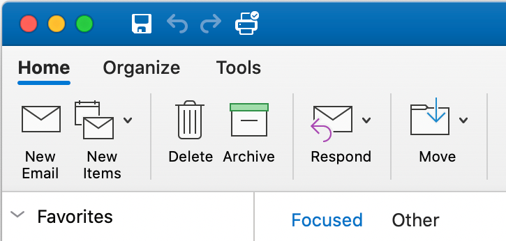

# 将 Mac 上 outlook 加载项支持与其他 Outlook 客户端进行比较Compare Outlook add-in support in Outlook on Mac with other Outlook clients

您可以像在其他客户端（包括 Outlook 网页版、Windows、iOS 和 Android）中一样，在 Mac 上以相同的方式创建和运行 Outlook 加载项，而无需自定义每个客户端的 JavaScript。You can create and run an Outlook add-in the same way in Outlook on Mac as in the other clients, including Outlook on the web, Windows, iOS, and Android, without customizing the JavaScript for each client. 除了下表中所述的区域，从外接程序到 Office JavaScript API 的相同调用通常的工作方式相同。The same calls from the add-in to the Office JavaScript API generally work the same way, except for the areas described in the following table.

有关详细信息，请参阅[部署和安装 Outlook 外接程序以进行测试](testing-and-tips.md)。For more information, see [Deploy and install Outlook add-ins for testing](testing-and-tips.md).

有关 Mac 上新的 UI 支持的信息，请参阅[新建 Outlook On mac](#new-outlook-on-mac-preview)。For information about new UI support on Mac, see [New Outlook on Mac](#new-outlook-on-mac-preview).

| 区域Area | Outlook 网页版、Windows 版和移动设备Outlook on the web, Windows, and mobile devices | Mac 版 OutlookOutlook on Mac |
|:-----|:-----|:-----|
| office.js 和 Office 外接程序清单架构支持的版本Supported versions of office.js and Office Add-ins manifest schema | Office.js 和架构 v1.1 中的所有 API。All APIs in Office.js and schema v1.1. | Office.js 和架构 v1.1 中的所有 API。All APIs in Office.js and schema v1.1.  **注意**：在 Mac 上的 Outlook 中，仅生成16.35.308 或更高版本支持保存会议。**NOTE**: In Outlook on Mac, only build 16.35.308 or later supports saving a meeting. 否则，在 `saveAsync` 撰写模式下从会议中调用时，此方法将失败。Otherwise, the `saveAsync` method fails when called from a meeting in compose mode. 若需解决办法，请参阅[无法在 Outlook for Mac 中使用 Office JS API 将会议另存为草稿](https://support.microsoft.com/help/4505745)。See [Cannot save a meeting as a draft in Outlook for Mac by using Office JS API](https://support.microsoft.com/help/4505745) for a workaround. |
| 定期约会系列实例Instances of a recurring appointment series | <ul><li>可以获得主约会的项目 ID 和其他属性或定期系列约会的实例Can get the item ID and other properties of a master appointment or appointment instance of a recurring series.</li><li>可以使用 [mailbox.displayAppointmentForm](../reference/objectmodel/preview-requirement-set/office.context.mailbox.md#methods) 显示定期序列的实例或主项目。Can use [mailbox.displayAppointmentForm](../reference/objectmodel/preview-requirement-set/office.context.mailbox.md#methods) to display an instance or the master of a recurring series.</li></ul> | <ul><li>可以获得主约会的项目 ID 和其他属性，但无法获得定期系列约会的实例Can get the item ID and other properties of the master appointment, but not those of an instance of a recurring series.</li><li>可以显示定期系列的主约会。不显示项目 ID 和定期系列的实例。Can display the master appointment of a recurring series. Without the item ID, cannot display an instance of a recurring series.</li></ul> |
| 约会参与者的收件人类型Recipient type of an appointment attendee | 可以使用 [EmailAddressDetails.recipientType](/javascript/api/outlook/office.emailaddressdetails#recipienttype) 标识与会者的收件人类型。Can use [EmailAddressDetails.recipientType](/javascript/api/outlook/office.emailaddressdetails#recipienttype) to identify the recipient type of an attendee. | `EmailAddressDetails.recipientType` 为约会与会者返回 `undefined`。`EmailAddressDetails.recipientType` returns `undefined` for appointment attendees. |
| 主机客户端的版本字符串Version string of the host client | 由[diagnostics.hostversion](/javascript/api/outlook/office.diagnostics#hostversion)返回的版本字符串的格式取决于客户端的实际类型。The format of the version string returned by [diagnostics.hostVersion](/javascript/api/outlook/office.diagnostics#hostversion) depends on the actual type of client. 例如：For example:<ul><li>Windows 上的 Outlook：`15.0.4454.1002`Outlook on Windows: `15.0.4454.1002`</li><li>Outlook 网页：`15.0.918.2`Outlook on the web: `15.0.918.2`</li></ul> |Outlook on Mac 上返回的版本字符串的示例 `Diagnostics.hostVersion` ：`15.0 (140325)`An example of the version string returned by `Diagnostics.hostVersion` on Outlook on Mac: `15.0 (140325)` |
| 项目自定义属性Custom properties of an item | 如果网络出现故障，外接程序仍可以访问缓存的自定义属性。If the network goes down, an add-in can still access cached custom properties. | 由于 Mac 上的 Outlook 不缓存自定义属性，因此，如果网络出现故障，外接程序将无法访问它们。Because Outlook on Mac does not cache custom properties, if the network goes down, add-ins would not be able to access them. |
| 附件详细信息Attachment details | [AttachmentDetails](/javascript/api/outlook/office.attachmentdetails)对象中的内容类型和附件名称取决于客户端的类型：The content type and attachment names in an [AttachmentDetails](/javascript/api/outlook/office.attachmentdetails) object depend on the type of client:<ul><li>`AttachmentDetails.contentType` 的 JSON 示例：`"contentType": "image/x-png"`。A JSON example of `AttachmentDetails.contentType`: `"contentType": "image/x-png"`. </li><li>`AttachmentDetails.name` 不包含任何文件名扩展名。例如，如果附件是一封主题为“RE: Summer activity”的邮件，则表示附件名称的 JSON 对象将为 `"name": "RE: Summer activity"`。`AttachmentDetails.name` does not contain any filename extension. As an example, if the attachment is a message that has the subject "RE: Summer activity", the JSON object that represents the attachment name would be `"name": "RE: Summer activity"`.</li></ul> | <ul><li>`AttachmentDetails.contentType` 的 JSON 示例：`"contentType" "image/png"`A JSON example of `AttachmentDetails.contentType`: `"contentType" "image/png"`</li><li>`AttachmentDetails.name` 始终包含一个文件名扩展名。作为邮件项目的附件包含 .eml 扩展名，约会包含 .ics 扩展名。例如，如果附件是主题为“RE: Summer activity”的电子邮件，那么表示附件名称的 JSON 对象为 `"name": "RE: Summer activity.eml"`。`AttachmentDetails.name` always includes a filename extension. Attachments that are mail items have a .eml extension, and appointments have a .ics extension. As an example, if an attachment is an email with the subject "RE: Summer activity", the JSON object that represents the attachment name would be `"name": "RE: Summer activity.eml"`.
**注意：** 如果以编程方式附加（例如通过加载项）不带扩展名的文件，`AttachmentDetails.name` 将不会在文件名中包含扩展名。**NOTE**: If a file is programmatically attached (e.g through an add-in) without an extension then the `AttachmentDetails.name`  will not contain the extension as part of filename.
</li></ul> |
| 表示 `dateTimeCreated` 和 `dateTimeModified` 属性中的时区的字符串String representing the time zone in the `dateTimeCreated` and `dateTimeModified` properties |示例：`Thu Mar 13 2014 14:09:11 GMT+0800 (China Standard Time)`As an example: `Thu Mar 13 2014 14:09:11 GMT+0800 (China Standard Time)` | 示例：`Thu Mar 13 2014 14:09:11 GMT+0800 (CST)`As an example: `Thu Mar 13 2014 14:09:11 GMT+0800 (CST)` |
| `dateTimeCreated` 和 `dateTimeModified` 的时间准确度Time accuracy of `dateTimeCreated` and `dateTimeModified` | 如果加载项使用以下代码，准确度精确到毫秒：If an add-in uses the following code, the accuracy is up to a millisecond: `JSON.stringify(Office.context.mailbox.item, null, 4);`| 准确度精确到秒。The accuracy is up to only a second. |

## 新建 Mac 版 Outlook （预览）New Outlook on Mac (preview)

Outlook 外接程序现在在新的 Mac UI （最高为要求集1.6）中受支持。Outlook add-ins are now supported in the new Mac UI, up to requirement set 1.6. 但是，尚**不**支持以下要求集和功能。However, the following requirement sets and features are **NOT** supported yet.

1. API 要求集1.7 和1。8API requirement sets 1.7 and 1.8
1. 可固定任务窗格， `ItemChanged` 事件Pinnable task pane, `ItemChanged` event
1. 上下文加载项Contextual add-ins
1. 发送时On-send
1. 共享文件夹支持Shared folder support
1. `saveAsync`撰写会议时`saveAsync` when composing a meeting
1. 单一登录 (SSO)Single sign-on (SSO)

我们鼓励您预览新的 Outlook on Mac，可从版本16.38.506。We encourage you to preview the new Outlook on Mac, available from version 16.38.506. 若要了解有关如何试用的详细信息，请参阅[适用于内部版本快速生成的 Outlook For Mac 发行说明](https://support.microsoft.com/office/d6347358-5613-433e-a49e-a9a0e8e0462a)。To learn more about how to try it out, see [Outlook for Mac - Release notes for Insider Fast builds](https://support.microsoft.com/office/d6347358-5613-433e-a49e-a9a0e8e0462a).

您可以确定您所处的 UI 版本，如下所示。You can determine which UI version you're on, as follows.

**当前 UI****Current UI**

&nbsp;&nbsp;&nbsp;&nbsp;

**新 UI （预览）****New UI (preview)**

&nbsp;&nbsp;&nbsp;&nbsp;