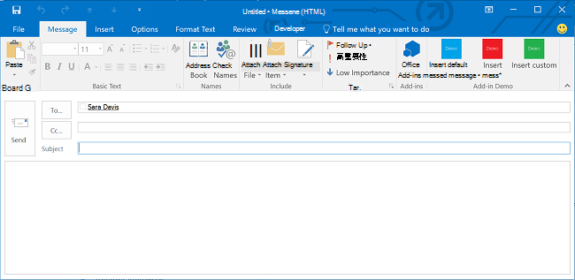
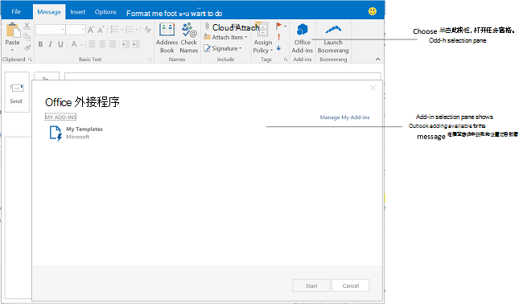

# 创建适用于撰写窗体的 Outlook 加载项

从 Office 外接程序清单的版本 1.1 的架构和 office.js v1.1 开始，可以创建撰写外接程序（即在撰写窗体中激活的 Outlook 外接程序）。与阅读外接程序（用户查看邮件或约会时在阅读模式中激活的 Outlook 外接程序）相反，撰写外接程序在以下用户方案中可用。

- 在撰写窗体中撰写新的邮件、会议请求或约会。

- 查看或编辑现有约会或用户是组织者的会议项目。

   > [!NOTE]
   > 如果用户在 Outlook 2013 和 Exchange 2013 的 RTM 版本上，并查看由用户组织的会议项目，则用户可以发现读取外接程序是可用的。从 Office 2013 SP1 版本开始进行了更改，在同一场景中，只有撰写外接程序能够激活并可用。

- 在单独的撰写窗体中撰写内嵌响应邮件或答复邮件。

- 编辑会议请求或会议项目答复（“接受”、“暂定”或“拒绝”）。

- 建议新的会议项目时间。

- 转发或答复会议请求或会议项目。

在每个撰写方案中，显示由外接程序定义的任何外接程序命令按钮。对于未执行外接程序命令的较旧外接程序，用户可以选择功能区中的“**Office 外接程序**”打开外接程序选择窗格，然后选择并启动撰写外接程序。下图显示了撰写窗体中的外接程序命令。

下图显示了外接程序选择窗格，该窗格由两个不实施外接程序命令的撰写外接程序组成，当用户在 Outlook 中撰写内嵌答复时将激活这两个撰写外接程序。

## 撰写模式下可用的外接程序的类型

撰写加载项作为[用于 Outlook 的加载项命令](add-in-commands-for-outlook.md)实现。 若要激活用于撰写电子邮件或会议答复的加载项，则加载项在清单中包括 [MessageComposeCommandSurface 扩展点元素](../reference/manifest/extensionpoint.md#messagecomposecommandsurface)。 若要激活用于撰写或编辑用户是组织者的约会或会议的加载项，则加载项包括 [AppointmentOrganizerCommandSurface 扩展点元素](../reference/manifest/extensionpoint.md#appointmentorganizercommandsurface)。

> [!NOTE]
> 为不支持加载项命令在包含在 [OfficeApp](../reference/manifest/officeapp.md) 元素中的 [Rule](../reference/manifest/rule.md) 元素使用[激活规则](activation-rules.md)的服务器或客户端开发的加载项。 除非加载项是为较早的客户端和服务器专门开发的，否则新加载项应使用加载项命令。

## 撰写加载项可用的 API 功能

- [在 Outlook 的撰写窗体中添加和删除项目附件](add-and-remove-attachments-to-an-item-in-a-compose-form.md)
- [在 Outlook 的撰写窗体中获取和设置项目数据](get-and-set-item-data-in-a-compose-form.md)
- [在 Outlook 中撰写约会或邮件时获取、设置或添加收件人](get-set-or-add-recipients.md)
- [在 Outlook 中撰写约会或邮件时获取或设置主题](get-or-set-the-subject.md)
- [在 Outlook 中撰写约会或邮件时将数据插入到正文中](insert-data-in-the-body.md)
- [在 Outlook 中撰写约会时获取或设置位置](get-or-set-the-location-of-an-appointment.md)
- [在 Outlook 中撰写约会时获取或设置时间](get-or-set-the-time-of-an-appointment.md)

## 另请参阅

- [适用于 Office 的 Outlook 加载项入门](../quickstarts/outlook-quickstart.md)
