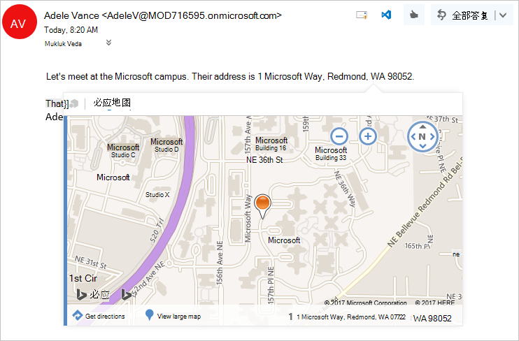

# <a name="contextual-outlook-add-ins"></a>上下文 Outlook 加载项

Contextual add-ins are Outlook add-ins that activate based on text in a message or appointment. By using contextual add-ins, a user can initiate tasks related to a message without leaving the message itself, which results in an easier and richer user experience.

[!include[JSON manifest does not support contextual add-ins](../includes/json-manifest-outlook-contextual-not-supported.md)]

下面是上下文加载项的示例。

- 选择地址以打开位置地图。
- 选择会打开会议建议加载项的字符串。
- 选择要添加到你的联系人的电话号码。


> [!NOTE]
> 上下文加载项暂不适用于 Android 版和 iOS 版 Outlook。 今后将推出此功能。
>
> 要求集1.6 中引入了对此功能的支持。 请查看支持此要求集的[客户端和平台](/javascript/api/requirement-sets/outlook/outlook-api-requirement-sets#requirement-sets-supported-by-exchange-servers-and-outlook-clients)。

## <a name="how-to-make-a-contextual-add-in"></a>如何生成上下文加载项

上下文外接程序的清单必须包含将 `xsi:type` 属性设置为 `DetectedEntity` 的 [ExtensionPoint](/javascript/api/manifest/extensionpoint#detectedentity) 元素。 在元素中 **\<ExtensionPoint\>** ，外接程序指定可以激活它的实体或正则表达式。 如果指定实体，则该实体可以是 [Entities](/javascript/api/outlook/office.entities) 对象中的任何属性。

因此，外接程序清单必须包含类型为 **ItemHasKnownEntity** 或 **ItemHasRegularExpressionMatch** 的规则。 以下示例演示如何指定加载项应在具有检测到的实体（即电话号码）的消息上激活。

```XML
<ExtensionPoint xsi:type="DetectedEntity">
  <Label resid="contextLabel" />
  <!--If you opt to include RequestedHeight, it must be between 140px to 450px, inclusive.-->
  <!--<RequestedHeight>360</RequestedHeight>-->
  <SourceLocation resid="detectedEntityURL" />
  <Rule xsi:type="RuleCollection" Mode="And">
    <Rule xsi:type="ItemIs" ItemType="Message" />
    <Rule xsi:type="ItemHasKnownEntity" EntityType="PhoneNumber" Highlight="all" />
  </Rule>
</ExtensionPoint>
```

在上下文加载项与帐户关联后，当用户单击突出显示的实体或正则表达式时，加载项会自动启动。 若要详细了解 Outlook 加载项正则表达式，请参阅[使用正则表达式激活规则显示 Outlook 加载项](use-regular-expressions-to-show-an-outlook-add-in.md)。

上下文加载项有一些限制：

- 上下文外接程序可以仅存在于阅读加载项中（而不是撰写加载项中）。
- 不能指定突出显示的实体颜色。
- 未突出显示的实体无法启动卡片中的上下文外接程序。

由于未突出显示的实体或正则表达式无法启动上下文外接程序，因此外接程序至少必须包含一个将 `Highlight` 属性设置为 `all` 的 `Rule` 元素。

> [!NOTE]
> The `EmailAddress` and `Url` entity types do not support highlighting, so they cannot be used to launch a contextual add-in. They can however be combined in a `RuleCollection` rule type as an additional activation criteria.

## <a name="how-to-launch-a-contextual-add-in"></a>如何启动上下文外接程序

A user launches a contextual add-in through text, either a known entity or a developer's regular expression. Typically, a user identifies a contextual add-in because the entity is highlighted. The following example shows how highlighting appears in a message. Here the entity (an address) is colored blue and underlined with a dotted blue line. A user launches the contextual add-in by clicking the highlighted entity. 

**含有突出显示实体（地址）的文本示例**


    
当邮件中含有多个实体或上下文外接程序时，用户交互规则如下所示：

- 如果有多个实体，用户必须单击不同的实体才能启动对应的外接程序。
- 如果一个实体激活多个外接程序，则每个外接程序会打开一个新选项卡。用户可在选项卡之间切换，以在外接程序之间更改。例如，名称和地址可以触发电话外接程序和地图。
- If a single string contains multiple entities that activate multiple add-ins, the entire string is highlighted, and clicking the string shows all add-ins relevant to the string on separate tabs. For example, a string that describes a proposed meeting at a restaurant might activate the Suggested Meeting add-in and a restaurant rating add-in.

## <a name="how-a-contextual-add-in-displays"></a>上下文外接程序的显示方式

An activated contextual add-in appears in a card, which is a separate window near the entity. The card will normally appear below the entity and centered with respect to the entity as much as possible. If there is not enough room below the entity, the card is placed above it. The following screenshot shows the highlighted entity, and below it, an activated add-in (Bing Maps) in a card.

**显示在卡片中的外接程序示例**



若要关闭卡片并结束该外接程序，用户可单击该卡片外的任意位置。

## <a name="current-contextual-add-ins"></a>当前上下文外接程序

默认情况下，为具有 Outlook 外接程序的用户安装以下上下文加载项。

- 必应地图
- 建议的会议

## <a name="see-also"></a>另请参阅

- [Outlook 加载项：Contoso 订单编号](https://github.com/OfficeDev/Outlook-Add-In-Contextual-Regex)（根据正则表达式匹配项激活的示例上下文加载项）
- [编写第一个 Outlook 加载项](../quickstarts/outlook-quickstart.md)
- [使用正则表达式激活规则显示 Outlook 外接程序](use-regular-expressions-to-show-an-outlook-add-in.md)
- [Entities 对象](/javascript/api/outlook/office.entities)
