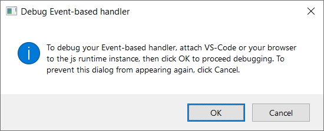
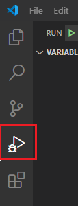
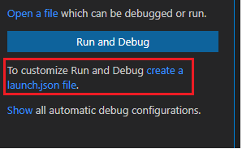
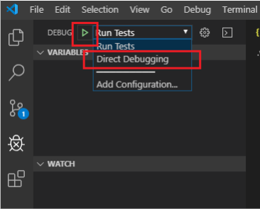

# <a name="debug-your-event-based-outlook-add-in-preview"></a>调试基于事件Outlook加载项 (预览) 

本文提供了在外接程序中实现基于 [事件的](autolaunch.md) 激活时调试指南。 基于事件的激活功能当前处于预览阶段。

> [!IMPORTANT]
> 此调试功能仅在使用 Outlook 订阅Windows预览Microsoft 365支持。 有关详细信息，请参阅本文中的预览调试基于 [事件的](#preview-debugging-for-the-event-based-activation-feature) 激活功能部分。

本文将讨论启用调试的关键阶段。

- [标记加载项进行调试](#mark-your-add-in-for-debugging)
- [配置Visual Studio Code](#configure-visual-studio-code)
- [附加Visual Studio Code](#attach-visual-studio-code)
- [Debug](#debug)

有几种创建加载项项目的选项。 根据你使用的选项，步骤可能会有所不同。 在这种情况下，如果使用 Office 加载项的 Yeoman 生成器创建加载项项目 (，例如，通过执行基于事件的激活演练 [) ，](autolaunch.md)请按照 **yo office** 步骤操作，否则执行其他步骤。  Visual Studio Code版本 1.56.1。

## <a name="preview-debugging-for-the-event-based-activation-feature"></a>预览基于事件的激活功能调试

我们邀请你试用基于事件的激活功能调试功能！ 请告诉我们你的方案，以及我们如何通过反馈提供反馈GitHub (请参阅此页面末尾的反馈部分) 。 

若要预览此功能，Outlook上Windows，最低要求版本为 16.0.13729.20000。 若要访问 Office beta 版本，请加入[Office 预览体验计划](https://insider.office.com)。

## <a name="mark-your-add-in-for-debugging"></a>标记加载项进行调试

1. 设置注册表项 `HKEY_CURRENT_USER\SOFTWARE\Microsoft\Office\16.0\Wef\Developer\[Add-in ID]\UseDirectDebugger` 。 `[Add-in ID]`是加载项清单中的 **ID。**

    **yo office：** 在命令行窗口中，导航到加载项文件夹的根目录，然后运行以下命令。

    ```command&nbsp;line
    npm start
    ```

    除了生成代码和启动本地服务器之外，此命令还应将此加载项的注册表项 `UseDirectDebugger` 设置为 `1` 。

    **其他**：在 `UseDirectDebugger` 下添加注册表项 `HKEY_CURRENT_USER\SOFTWARE\Microsoft\Office\16.0\WEF\Developer\[Add-in ID]\` 。 将 `[Add-in ID]` 替换为外接程序清单中的 **Id。** 将注册表项设置为 `1` 。

    [!include[Developer registry key](../includes/developer-registry-key.md)]

1. 如果Outlook桌面 (桌面Outlook，请启动桌面) 。
1. 撰写新邮件或约会。 应看到以下对话框。 *不要* 与对话框进行交互。

    

## <a name="configure-visual-studio-code"></a>配置Visual Studio Code

### <a name="yo-office"></a>yo office

1. 返回到命令行窗口，打开Visual Studio Code。

    ```command&nbsp;line
    code .
    ```

1. In Visual Studio Code， open the file **./.vscode/launch.json** and add the following excerpt to your list of configurations. 保存所做的更改。

    ```json
    {
      "name": "Direct Debugging",
      "type": "node",
      "request": "attach",
      "port": 9229,
      "protocol": "inspector",
      "timeout": 600000,
      "trace": true
    }
    ```

### <a name="other"></a>其他

1. 在桌面 **文件夹中创建一** (调试文件夹) 。 
1. 打开Visual Studio Code。
1. 转到"**文件**  >  **""打开** 文件夹"，导航到刚创建的文件夹，然后选择"**选择文件夹"。**
1. 在活动栏上，选择"调试" (Ctrl+Shift+D) 。

    

1. 选择" **创建launch.js文件"** 链接。

    

1. 在" **选择环境** "下拉列表中，选择" **边缘： 启动** "以创建launch.js文件。
1. 将以下摘录添加到配置列表中。 保存所做的更改。

    ```json
    {
      "name": "Direct Debugging",
      "type": "node",
      "request": "attach",
      "port": 9229,
      "protocol": "inspector",
      "timeout": 600000,
      "trace": true
    }
    ```

## <a name="attach-visual-studio-code"></a>附加Visual Studio Code

1. 若要查找外接程序的 **bundle.js，** 在 Windows 资源管理器中打开以下文件夹，并搜索在清单 (找到的) 。 

    ```text
    %LOCALAPPDATA%\Microsoft\Office\16.0\Wef
    ```

    打开以此 ID 作为前缀的文件夹并复制其完整路径。 In Visual Studio Code， open **bundle.js** from that folder. 文件路径的模式应如下所示：

    `%LOCALAPPDATA%\Microsoft\Office\16.0\Wef\{[Outlook profile GUID]}\[encoding]\Javascript\[Add-in ID]_[Add-in Version]_[locale]\bundle.js`

1. 将断点bundle.js调试器停止的位置。
1. 在 **"调试**"下拉列表中，选择名称 **"Direct Debugging"，** 然后选择"运行 **"。**

    

## <a name="debug"></a>Debug

1. 确认已附加调试程序后，返回到Outlook，在"调试基于 **事件的处理程序**"对话框中，选择"确定 **"。**

1. 现在，你可以点击 Visual Studio Code 断点，从而可以调试基于事件的激活代码。

## <a name="stop-debugging"></a>停止调试

若要停止调试当前桌面会话Outlook，在"调试基于 **事件的处理程序**"对话框中，选择"取消 **"。** 若要重新启用调试，请重新启动Outlook桌面。

若要阻止 **"调试** 基于事件的处理程序"对话框弹出并停止后续 Outlook 会话的调试，请删除关联的注册表项或将其值设置为 `0` ： `HKEY_CURRENT_USER\SOFTWARE\Microsoft\Office\16.0\Wef\Developer\[Add-in ID]\UseDirectDebugger` 。

## <a name="see-also"></a>另请参阅

- [配置Outlook加载项进行基于事件的激活](autolaunch.md)
- [使用运行时日志记录功能调试加载项](../testing/runtime-logging.md#runtime-logging-on-windows)
