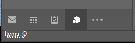
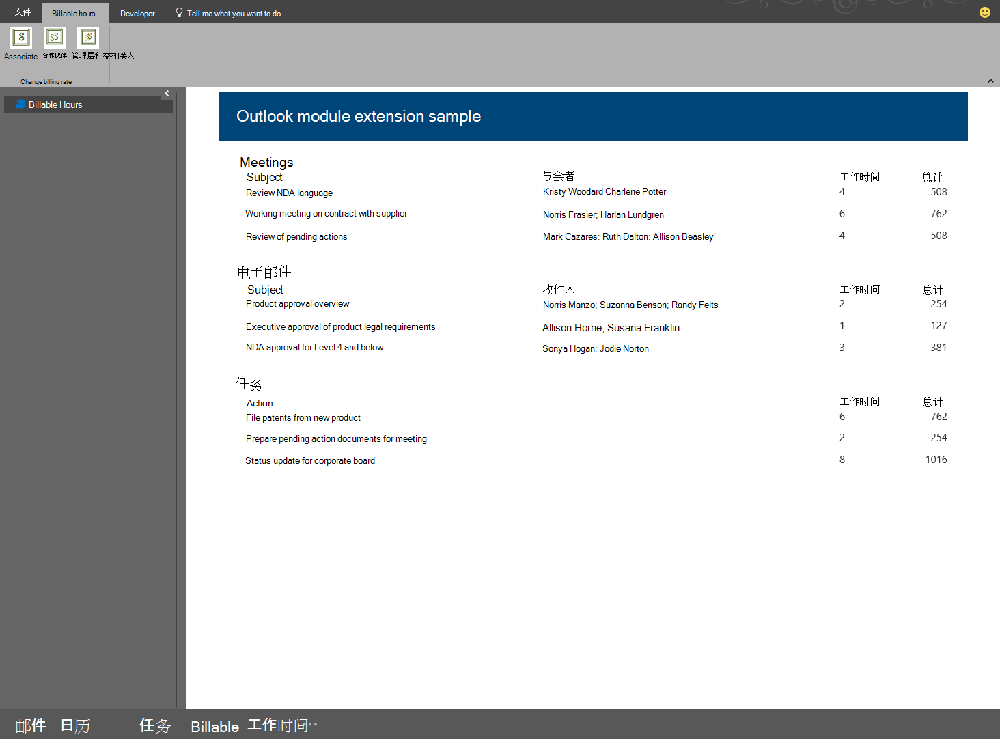

# <a name="module-extension-outlook-add-ins"></a>模块扩展 Outlook 加载项

模块扩展加载项与邮件、任务和日历一起显示在 Outlook 导航栏中。 模块扩展不限于使用邮件和约会信息。 可以创建在 Outlook 中运行的应用程序，以便用户无需退出 Outlook 即可轻松地访问业务信息和工作效率工具。

> [!NOTE]
> 仅 Windows 上的 Outlook 2016 或更高版本支持模块扩展。  

## <a name="open-a-module-extension"></a>打开模块扩展

要打开模块扩展，用户单击 Outlook 导航栏中的模块的名称或图标即可。如果用户选择了紧凑型导航，导航栏有一个显示已加载扩展的图标。



如果用户没有使用紧凑型导航，则导航栏有两种外观。 加载一个扩展后，它将显示加载项的名称。


在加载多个加载项时，会显示 **加载项** 一词。单击其中任何一个即可打开扩展的用户界面。


在单击扩展时，Outlook 会将内置模块替换为自定义模块，以便用户可以与该加载项进行交互。 你可以使用外接程序中 Outlook JavaScript API 的所有功能，可以在与外接程序内容交互的 Outlook 功能区中创建命令按钮。 以下屏幕截图显示集成在 Outlook 导航栏中的加载项，并拥有将更新该加载项内容的功能区命令。



## <a name="example"></a>示例

下面是定义模块扩展的清单文件部分。

```xml
<!-- Add Outlook module extension point -->
<VersionOverrides xmlns="http://schemas.microsoft.com/office/mailappversionoverrides"
                  xsi:type="VersionOverridesV1_0">
  <VersionOverrides xmlns="http://schemas.microsoft.com/office/mailappversionoverrides/1.1"
                    xsi:type="VersionOverridesV1_1">

    <!-- Begin override of existing elements -->
    <Description resid="residVersionOverrideDesc" />

    <Requirements>
      <bt:Sets DefaultMinVersion="1.3">
        <bt:Set Name="Mailbox" />
      </bt:Sets>
    </Requirements>
    <!-- End override of existing elements -->

    <Hosts>
      <Host xsi:type="MailHost">
        <DesktopFormFactor>
          <!-- Set the URL of the file that contains the
                JavaScript function that controls the extension -->
          <FunctionFile resid="residFunctionFileUrl" />

          <!--New Extension Point - Module for a ModuleApp -->
          <ExtensionPoint xsi:type="Module">
            <SourceLocation resid="residExtensionPointUrl" />
            <Label resid="residExtensionPointLabel" />

            <CommandSurface>
              <CustomTab id="idTab">
                <Group id="idGroup">
                  <Label resid="residGroupLabel" />

                  <Control xsi:type="Button" id="group.changeToAssociate">
                    <Label resid="residChangeToAssociateLabel" />
                    <Supertip>
                      <Title resid="residChangeToAssociateLabel" />
                      <Description resid="residChangeToAssociateDesc" />
                    </Supertip>
                    <Icon>
                      <bt:Image size="16" resid="residAssociateIcon16" />
                      <bt:Image size="32" resid="residAssociateIcon32" />
                      <bt:Image size="80" resid="residAssociateIcon80" />
                    </Icon>
                    <Action xsi:type="ExecuteFunction">
                      <FunctionName>changeToAssociateRate</FunctionName>
                    </Action>
                  </Control>
                  
              </Group>
                <Label resid="residCustomTabLabel" />
              </CustomTab>
            </CommandSurface>
          </ExtensionPoint>
        </DesktopFormFactor>
      </Host>
    </Hosts>

    <Resources>
      <bt:Images>
        <bt:Image id="residAddinIcon16" 
                  DefaultValue="https://localhost:8080/Executive-16.png" />
        <bt:Image id="residAddinIcon32" 
                  DefaultValue="https://localhost:8080/Executive-32.png" />
        <bt:Image id="residAddinIcon80" 
                  DefaultValue="https://localhost:8080/Executive-80.png" />
      
        <bt:Image id="residAssociateIcon16" 
                  DefaultValue="https://localhost:8080/Associate-16.png" />
        <bt:Image id="residAssociateIcon32" 
                  DefaultValue="https://localhost:8080/Associate-32.png" />
        <bt:Image id="residAssociateIcon80" 
                  DefaultValue="https://localhost:8080/Associate-80.png" />
      </bt:Images>

      <bt:Urls>
        <bt:Url id="residFunctionFileUrl" 
                DefaultValue="https://localhost:8080/" />
        <bt:Url id="residExtensionPointUrl" 
                DefaultValue="https://localhost:8080/" />
      </bt:Urls>

      <!--Short strings must be less than 30 characters long -->
      <bt:ShortStrings>
        <bt:String id="residExtensionPointLabel" 
                    DefaultValue="Billable Hours" />
        <bt:String id="residGroupLabel" 
                    DefaultValue="Change billing rate" />
        <bt:String id="residCustomTabLabel" 
                    DefaultValue="Billable hours" />

        <bt:String id="residChangeToAssociateLabel" 
                    DefaultValue="Associate" />
      </bt:ShortStrings>

      <bt:LongStrings>
        <bt:String id="residVersionOverrideDesc" 
                    DefaultValue="Version override description" />

        <bt:String id="residChangeToAssociateDesc" 
                    DefaultValue="Change to the associate billing rate: $127/hr" />
      </bt:LongStrings>
    </Resources>
  </VersionOverrides>
</VersionOverrides>
```

## <a name="see-also"></a>另请参阅

- [Outlook 加载项清单](manifests.md)
- [适用于 Outlook 的外接程序命令](add-in-commands-for-outlook.md)
- [Outlook 模块扩展计酬时间示例](https://github.com/OfficeDev/Outlook-Add-in-JavaScript-ModuleExtension)
