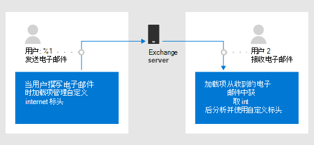

# <a name="get-and-set-internet-headers-on-a-message-in-an-outlook-add-in"></a>在 Outlook 外接程序中获取和设置邮件的 internet 邮件头

## <a name="background"></a>背景

Outlook 外接程序开发中的一个常见要求是，将与外接程序关联的自定义属性存储在不同的级别。 目前，自定义属性存储在项目或邮箱级别。

- 项目级别-适用于特定项目的属性，使用[CustomProperties](/javascript/api/outlook/office.customproperties)对象。 例如，存储与发送电子邮件的人员关联的客户代码。
- 邮箱级别-对于应用于用户邮箱中的所有邮件项目的属性，使用[RoamingSettings](/javascript/api/outlook/office.roamingsettings)对象。 例如，存储用户首选项以按特定比例显示温度。

在项目离开 Exchange 服务器后，这两种类型的属性都不会保留，因此电子邮件收件人无法获取项目上设置的任何属性。 因此，开发人员无法访问这些设置或其他 MIME 属性以实现更好的阅读方案。

虽然有一种方法可以将 internet 标头设置为 EWS 请求，但在某些情况下，不能进行 EWS 请求。 例如，在 Outlook 桌面的撰写模式下，项目 id 在缓存模式下 `saveAsync` 不会同步。

> [!TIP]
> 请参阅[获取和设置 Outlook 外接程序的外接程序元数据](metadata-for-an-outlook-add-in.md)，以了解有关使用这些选项的详细信息。

## <a name="purpose-of-the-internet-headers-api"></a>Internet 标头 API 的用途

在[要求集 1.8](../reference/objectmodel/requirement-set-1.8/outlook-requirement-set-1.8.md)中引入，internet 标头 api 使开发人员能够：

- 戳在所有客户端上保留 Exchange 后保留的电子邮件的信息。
- 阅读有关在邮件读取应用场景中的所有客户端上的电子邮件保留后保留的电子邮件的信息。
- 访问电子邮件的整个 MIME 标头。



## <a name="set-internet-headers-while-composing-a-message"></a>在撰写邮件时设置 internet 邮件头

尝试使用[internetHeaders](/javascript/api/outlook/office.messagecompose#internetheaders)属性来管理在撰写模式下放置在当前邮件上的自定义 internet 邮件头。

### <a name="set-get-and-remove-custom-headers-example"></a>设置、获取和删除自定义标头示例

下面的示例演示如何设置、获取和删除自定义标头。

```js
// Set custom internet headers.
function setCustomHeaders() {
  Office.context.mailbox.item.internetHeaders.setAsync(
    { "x-preferred-fruit": "orange", "x-preferred-vegetable": "broccoli", "x-best-vegetable": "spinach" },
    setCallback
  );
}

function setCallback(asyncResult) {
  if (asyncResult.status === Office.AsyncResultStatus.Succeeded) {
    console.log("Successfully set headers");
  } else {
    console.log("Error setting headers: " + JSON.stringify(asyncResult.error));
  }
}

// Get custom internet headers.
function getSelectedCustomHeaders() {
  Office.context.mailbox.item.internetHeaders.getAsync(
    ["x-preferred-fruit", "x-preferred-vegetable", "x-best-vegetable", "x-nonexistent-header"],
    getCallback
  );
}

function getCallback(asyncResult) {
  if (asyncResult.status === Office.AsyncResultStatus.Succeeded) {
    console.log("Selected headers: " + JSON.stringify(asyncResult.value));
  } else {
    console.log("Error getting selected headers: " + JSON.stringify(asyncResult.error));
  }
}

// Remove custom internet headers.
function removeSelectedCustomHeaders() {
  Office.context.mailbox.item.internetHeaders.removeAsync(
    ["x-best-vegetable", "x-nonexistent-header"],
    removeCallback);
}

function removeCallback(asyncResult) {
  if (asyncResult.status === Office.AsyncResultStatus.Succeeded) {
    console.log("Successfully removed selected headers");
  } else {
    console.log("Error removing selected headers: " + JSON.stringify(asyncResult.error));
  }
}

setCustomHeaders();
getSelectedCustomHeaders();
removeSelectedCustomHeaders();
getSelectedCustomHeaders();

/* Sample output:
Successfully set headers
Selected headers: {"x-best-vegetable":"spinach","x-preferred-fruit":"orange","x-preferred-vegetable":"broccoli"}
Successfully removed selected headers
Selected headers: {"x-preferred-fruit":"orange","x-preferred-vegetable":"broccoli"}
*/
```

## <a name="get-internet-headers-while-reading-a-message"></a>在阅读邮件时获取 internet 邮件头

尝试调用[getAllInternetHeadersAsync](/javascript/api/outlook/office.messageread#getallinternetheadersasync-options--callback-)以在阅读模式下获取当前邮件的 internet 邮件头。

### <a name="get-sender-preferences-from-current-mime-headers-example"></a>从当前 MIME 标头获取发件人首选项示例

根据上一节中的示例，以下代码演示如何从当前电子邮件的 MIME 标头中获取发件人的首选项。

```js
Office.context.mailbox.item.getAllInternetHeadersAsync(getCallback);

function getCallback(asyncResult) {
  if (asyncResult.status === Office.AsyncResultStatus.Succeeded) {
    console.log("Sender's preferred fruit: " + asyncResult.value.match(/x-preferred-fruit:.*/gim)[0].slice(19));
    console.log("Sender's preferred vegetable: " + asyncResult.value.match(/x-preferred-vegetable:.*/gim)[0].slice(23));
  } else {
    console.log("Error getting preferences from header: " + JSON.stringify(asyncResult.error));
  }
}

/* Sample output:
Sender's preferred fruit: orange
Sender's preferred vegetable: broccoli
*/
```

> [!IMPORTANT]
> 此示例适用于简单的情况。 若要获取更复杂的信息检索（例如，多实例标头或折叠的值（如[RFC 2822](https://tools.ietf.org/html/rfc2822)中所述），请尝试使用相应的 MIME 分析库。

## <a name="recommended-practices"></a>建议的做法

目前，internet 邮件头是用户邮箱的有限资源。 当配额耗尽时，您不能在该邮箱上创建更多的 internet 标头，这可能导致依赖于此的客户端的意外行为能够正常运行。

在外接程序中创建 internet 邮件头时，请应用以下准则。

- 创建所需的最小标头数。
- 名称标头，以便以后可以重复使用和更新其值。 因此，应避免以变量方式命名标头（例如，基于用户输入、时间戳等）。

## <a name="see-also"></a>另请参阅

- [获取和设置 Outlook 加载项的元数据](metadata-for-an-outlook-add-in.md)
