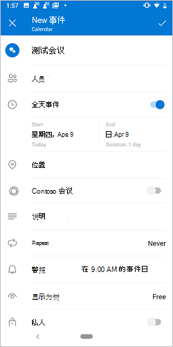
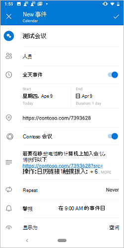
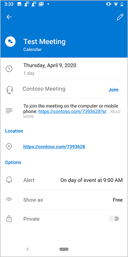
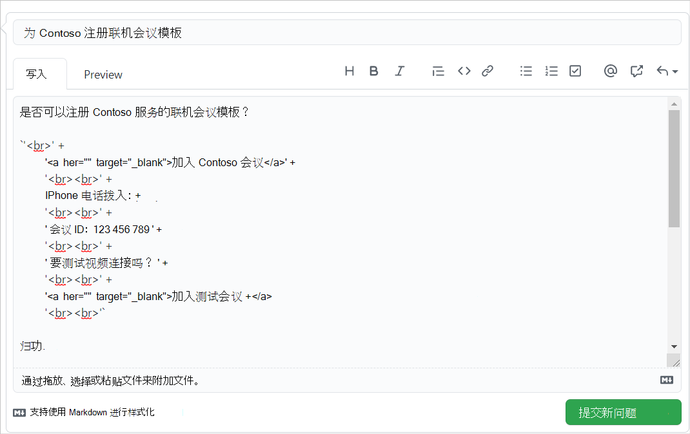

# <a name="create-an-outlook-mobile-add-in-for-an-online-meeting-provider"></a><span data-ttu-id="add8f-103">为联机会议提供商创建 Outlook mobile 外接程序</span><span class="sxs-lookup"><span data-stu-id="add8f-103">Create an Outlook mobile add-in for an online-meeting provider</span></span>

<span data-ttu-id="add8f-104">设置联机会议是 Outlook 用户的核心体验，可轻松[创建使用 outlook mobile 的团队会议](/microsoftteams/teams-add-in-for-outlook)。</span><span class="sxs-lookup"><span data-stu-id="add8f-104">Setting up an online meeting is a core experience for an Outlook user, and it's easy to [create a Teams meeting with Outlook](/microsoftteams/teams-add-in-for-outlook) mobile.</span></span> <span data-ttu-id="add8f-105">但是，在 Outlook 中使用非 Microsoft 服务创建联机会议可能很麻烦。</span><span class="sxs-lookup"><span data-stu-id="add8f-105">However, creating an online meeting in Outlook with a non-Microsoft service can be cumbersome.</span></span> <span data-ttu-id="add8f-106">通过实施此功能，服务提供商可以为其 Outlook 外接程序用户简化联机会议创建体验。</span><span class="sxs-lookup"><span data-stu-id="add8f-106">By implementing this feature, service providers can streamline the online meeting creation experience for their Outlook add-in users.</span></span>

> [!IMPORTANT]
> <span data-ttu-id="add8f-107">仅适用于使用 Microsoft 365 订阅的 Android 支持此功能。</span><span class="sxs-lookup"><span data-stu-id="add8f-107">This feature is only supported on Android with a Microsoft 365 subscription.</span></span>

<span data-ttu-id="add8f-108">在本文中，您将了解如何设置 Outlook 移动外接程序，以使用户能够使用您的联机会议服务来组织和加入会议。</span><span class="sxs-lookup"><span data-stu-id="add8f-108">In this article, you'll learn how to set up your Outlook mobile add-in to enable users to organize and join a meeting using your online-meeting service.</span></span> <span data-ttu-id="add8f-109">在整篇文章中，我们将使用虚构的联机会议服务提供商 "Contoso"。</span><span class="sxs-lookup"><span data-stu-id="add8f-109">Throughout this article, we'll be using a fictional online-meeting service provider, "Contoso".</span></span>

## <a name="set-up-your-environment"></a><span data-ttu-id="add8f-110">设置环境</span><span class="sxs-lookup"><span data-stu-id="add8f-110">Set up your environment</span></span>

<span data-ttu-id="add8f-111">完成[Outlook 快速入门](../quickstarts/outlook-quickstart.md?tabs=yeomangenerator)，它将使用 Office 外接程序的 Yeoman 生成器创建外接程序项目。</span><span class="sxs-lookup"><span data-stu-id="add8f-111">Complete the [Outlook quick start](../quickstarts/outlook-quickstart.md?tabs=yeomangenerator) which creates an add-in project with the Yeoman generator for Office Add-ins.</span></span>

## <a name="configure-the-manifest"></a><span data-ttu-id="add8f-112">配置清单</span><span class="sxs-lookup"><span data-stu-id="add8f-112">Configure the manifest</span></span>

<span data-ttu-id="add8f-113">若要使用户能够使用您的外接程序创建联机会议，必须在 `MobileOnlineMeetingCommandSurface` 父元素下的清单中配置扩展点 `MobileFormFactor` 。</span><span class="sxs-lookup"><span data-stu-id="add8f-113">To enable users to create online meetings with your add-in, you must configure the `MobileOnlineMeetingCommandSurface` extension point in the manifest under the parent element `MobileFormFactor`.</span></span> <span data-ttu-id="add8f-114">不支持其他外观因素。</span><span class="sxs-lookup"><span data-stu-id="add8f-114">Other form factors are not supported.</span></span>

1. <span data-ttu-id="add8f-115">在代码编辑器中，打开 "快速启动" 项目。</span><span class="sxs-lookup"><span data-stu-id="add8f-115">In your code editor, open the quick start project.</span></span>

1. <span data-ttu-id="add8f-116">打开位于项目根目录中的**manifest.xml**文件。</span><span class="sxs-lookup"><span data-stu-id="add8f-116">Open the **manifest.xml** file located at the root of your project.</span></span>

1. <span data-ttu-id="add8f-117">选择整个 `<VersionOverrides>` 节点 (包括 "打开" 和 "关闭" 标记) 并将其替换为以下 XML。</span><span class="sxs-lookup"><span data-stu-id="add8f-117">Select the entire `<VersionOverrides>` node (including open and close tags) and replace it with the following XML.</span></span>

```xml
<VersionOverrides xmlns="http://schemas.microsoft.com/office/mailappversionoverrides" xsi:type="VersionOverridesV1_0">
  <VersionOverrides xmlns="http://schemas.microsoft.com/office/mailappversionoverrides/1.1" xsi:type="VersionOverridesV1_1">
    <Description resid="residDescription"></Description>
    <Requirements>
      <bt:Sets>
        <bt:Set Name="Mailbox" MinVersion="1.3"/>
      </bt:Sets>
    </Requirements>
    <Hosts>
      <Host xsi:type="MailHost">
        <DesktopFormFactor>
          <FunctionFile resid="residFunctionFile"/>
          <ExtensionPoint xsi:type="AppointmentOrganizerCommandSurface">
            <OfficeTab id="TabDefault">
              <Group id="apptComposeGroup">
                <Label resid="residDescription"/>
                <Control xsi:type="Button" id="insertMeetingButton">
                  <Label resid="residLabel"/>
                  <Supertip>
                    <Title resid="residLabel"/>
                    <Description resid="residTooltip"/>
                  </Supertip>
                  <Icon>
                    <bt:Image size="16" resid="icon-16"/>
                    <bt:Image size="32" resid="icon-32"/>
                    <bt:Image size="64" resid="icon-64"/>
                    <bt:Image size="80" resid="icon-80"/>
                  </Icon>
                  <Action xsi:type="ExecuteFunction">
                    <FunctionName>insertContosoMeeting</FunctionName>
                  </Action>
                </Control>
              </Group>
            </OfficeTab>
          </ExtensionPoint>
        </DesktopFormFactor>

        <MobileFormFactor>
          <FunctionFile resid="residFunctionFile"/>
          <ExtensionPoint xsi:type="MobileOnlineMeetingCommandSurface">
            <Control xsi:type="MobileButton" id="insertMeetingButton">
              <Label resid="residLabel"/>
              <Icon>
                <bt:Image size="25" scale="1" resid="icon-16"/>
                <bt:Image size="25" scale="2" resid="icon-16"/>
                <bt:Image size="25" scale="3" resid="icon-16"/>

                <bt:Image size="32" scale="1" resid="icon-32"/>
                <bt:Image size="32" scale="2" resid="icon-32"/>
                <bt:Image size="32" scale="3" resid="icon-32"/>

                <bt:Image size="48" scale="1" resid="icon-48"/>
                <bt:Image size="48" scale="2" resid="icon-48"/>
                <bt:Image size="48" scale="3" resid="icon-48"/>
              </Icon>
              <Action xsi:type="ExecuteFunction">
                <FunctionName>insertContosoMeeting</FunctionName>
              </Action>
            </Control>
          </ExtensionPoint>
        </MobileFormFactor>
      </Host>
    </Hosts>
    <Resources>
      <bt:Images>
        <bt:Image id="icon-16" DefaultValue="https://contoso.com/assets/icon-16.png"/>
        <bt:Image id="icon-32" DefaultValue="https://contoso.com/assets/icon-32.png"/>
        <bt:Image id="icon-48" DefaultValue="https://contoso.com/assets/icon-48.png"/>
        <bt:Image id="icon-64" DefaultValue="https://contoso.com/assets/icon-64.png"/>
        <bt:Image id="icon-80" DefaultValue="https://contoso.com/assets/icon-80.png"/>
      </bt:Images>
      <bt:Urls>
        <bt:Url id="residFunctionFile" DefaultValue="https://contoso.com/commands.html"/>
      </bt:Urls>
      <bt:ShortStrings>
        <bt:String id="residDescription" DefaultValue="Contoso meeting"/>
        <bt:String id="residLabel" DefaultValue="Add a contoso meeting"/>
      </bt:ShortStrings>
      <bt:LongStrings>
        <bt:String id="residTooltip" DefaultValue="Add a contoso meeting to this appointment."/>
      </bt:LongStrings>
    </Resources>
  </VersionOverrides>
</VersionOverrides>
```

> [!TIP]
> <span data-ttu-id="add8f-118">若要了解有关 Outlook 外接程序清单的详细信息，请参阅[outlook 外接程序清单](manifests.md)和[添加对适用于 outlook Mobile 的外接程序命令的支持](add-mobile-support.md)。</span><span class="sxs-lookup"><span data-stu-id="add8f-118">To learn more about manifests for Outlook add-ins, see [Outlook add-in manifests](manifests.md) and [Add support for add-in commands for Outlook Mobile](add-mobile-support.md).</span></span>

## <a name="implement-adding-online-meeting-details"></a><span data-ttu-id="add8f-119">实施添加联机会议详细信息</span><span class="sxs-lookup"><span data-stu-id="add8f-119">Implement adding online meeting details</span></span>

<span data-ttu-id="add8f-120">在本节中，了解外接程序脚本如何更新用户的会议以包含联机会议详细信息。</span><span class="sxs-lookup"><span data-stu-id="add8f-120">In this section, learn how your add-in script can update a user's meeting to include online meeting details.</span></span>

1. <span data-ttu-id="add8f-121">在同一 "快速启动" 项目中，在代码编辑器中打开 **/src/commands/commands.js** 。</span><span class="sxs-lookup"><span data-stu-id="add8f-121">From the same quick start project, open the file **./src/commands/commands.js** in your code editor.</span></span>

1. <span data-ttu-id="add8f-122">将**commands.js**文件的整个内容替换为以下 JavaScript。</span><span class="sxs-lookup"><span data-stu-id="add8f-122">Replace the entire content of the **commands.js** file with the following JavaScript.</span></span>

    ```js
    // 1. How to construct online meeting details.
    // Not shown: How to get the meeting organizer's ID and other details from your service.
    const newBody = '<br>' +
        '<a href="https://contoso.com/meeting?id=123456789" target="_blank">Join Contoso meeting</a>' +
        '<br><br>' +
        'Phone Dial-in: +1(123)456-7890' +
        '<br><br>' +
        'Meeting ID: 123 456 789' +
        '<br><br>' +
        'Want to test your video connection?' +
        '<br><br>' +
        '<a href="https://contoso.com/testmeeting" target="_blank">Join test meeting</a>' +
        '<br><br>';

    var mailboxItem;

    // Office is ready.
    Office.onReady(function () {
            mailboxItem = Office.context.mailbox.item;
        }
    );

    // 2. How to define a UI-less function named `insertContosoMeeting` (referenced in the manifest)
    //    to update the meeting body with the online meeting details.
    function insertContosoMeeting(event) {
        // Get HTML body from the client.
        mailboxItem.body.getAsync("html",
            { asyncContext: event },
            function (getBodyResult) {
                if (getBodyResult.status === Office.AsyncResultStatus.Succeeded) {
                    updateBody(getBodyResult.asyncContext, getBodyResult.value);
                } else {
                    console.error("Failed to get HTML body.");
                    getBodyResult.asyncContext.completed({ allowEvent: false });
                }
            }
        );
    }

    // 3. How to implement a supporting function `updateBody`
    //    that appends the online meeting details to the current body of the meeting.
    function updateBody(event, existingBody) {
        // Append new body to the existing body.
        mailboxItem.body.setAsync(existingBody + newBody,
            { asyncContext: event, coercionType: "html" },
            function (setBodyResult) {
                if (setBodyResult.status === Office.AsyncResultStatus.Succeeded) {
                    setBodyResult.asyncContext.completed({ allowEvent: true });
                } else {
                    console.error("Failed to set HTML body.");
                    setBodyResult.asyncContext.completed({ allowEvent: false });
                }
            }
        );
    }

    function getGlobal() {
      return typeof self !== "undefined"
        ? self
        : typeof window !== "undefined"
        ? window
        : typeof global !== "undefined"
        ? global
        : undefined;
    }

    const g = getGlobal();

    // The add-in command functions need to be available in global scope.
    g.insertContosoMeeting = insertContosoMeeting;
    ```

## <a name="testing-and-validation"></a><span data-ttu-id="add8f-123">测试和验证</span><span class="sxs-lookup"><span data-stu-id="add8f-123">Testing and validation</span></span>

<span data-ttu-id="add8f-124">按照通常的指导来[测试和验证您的外接程序](testing-and-tips.md)。</span><span class="sxs-lookup"><span data-stu-id="add8f-124">Follow the usual guidance to [test and validate your add-in](testing-and-tips.md).</span></span> <span data-ttu-id="add8f-125">在 Outlook 网页版、Windows 版或 Mac 版中进行[旁加载](sideload-outlook-add-ins-for-testing.md)后，在你的 Android 移动设备上重新启动 outlook。</span><span class="sxs-lookup"><span data-stu-id="add8f-125">After [sideloading](sideload-outlook-add-ins-for-testing.md) in Outlook on the web, Windows, or Mac, restart Outlook on your Android mobile device.</span></span> <span data-ttu-id="add8f-126"> (Android 是目前唯一受支持的客户端。 ) 然后，在新的会议屏幕上，验证 Microsoft 团队或 Skype 切换是否已替换为您自己的。</span><span class="sxs-lookup"><span data-stu-id="add8f-126">(Android is the only supported client for now.) Then, on a new meeting screen, verify that the Microsoft Teams or Skype toggle is replaced with your own.</span></span>

### <a name="create-meeting-ui"></a><span data-ttu-id="add8f-127">创建会议用户界面</span><span class="sxs-lookup"><span data-stu-id="add8f-127">Create meeting UI</span></span>

<span data-ttu-id="add8f-128">作为会议组织者，在创建会议时，您应看到类似于以下三幅图像的屏幕。</span><span class="sxs-lookup"><span data-stu-id="add8f-128">As a meeting organizer, you should see screens similar to the following three images when you create a meeting.</span></span>

<span data-ttu-id="add8f-129">在 android 上创建会议屏幕的[ ](../images/outlook-android-create-online-meeting-off-expanded.png#lightbox)在 android 上创建会议屏幕[ ](../images/outlook-android-create-online-meeting-load-expanded.png#lightbox)打开在 android 上创建会议屏幕的屏幕截图[ ](../images/outlook-android-create-online-meeting-on-expanded.png#lightbox)</span><span class="sxs-lookup"><span data-stu-id="add8f-129">[](../images/outlook-android-create-online-meeting-off-expanded.png#lightbox) [](../images/outlook-android-create-online-meeting-load-expanded.png#lightbox) [](../images/outlook-android-create-online-meeting-on-expanded.png#lightbox)</span></span>

### <a name="join-meeting-ui"></a><span data-ttu-id="add8f-130">加入会议 UI</span><span class="sxs-lookup"><span data-stu-id="add8f-130">Join meeting UI</span></span>

<span data-ttu-id="add8f-131">作为会议与会者，查看会议时，您应该会看到类似于下图的屏幕。</span><span class="sxs-lookup"><span data-stu-id="add8f-131">As a meeting attendee, you should see a screen similar to the following image when you view the meeting.</span></span>

<span data-ttu-id="add8f-132">[](../images/outlook-android-join-online-meeting-view-1-expanded.png#lightbox)</span><span class="sxs-lookup"><span data-stu-id="add8f-132">[](../images/outlook-android-join-online-meeting-view-1-expanded.png#lightbox)</span></span>

> [!IMPORTANT]
> <span data-ttu-id="add8f-133">如果看不到**Join**链接，则可能是你的服务的联机会议模板未在我们的服务器上注册。</span><span class="sxs-lookup"><span data-stu-id="add8f-133">If you don't see the **Join** link, it may be that the online-meeting template for your service is not registered on our servers.</span></span> <span data-ttu-id="add8f-134">有关详细信息，请参阅[注册联机会议模板](#register-your-online-meeting-template)部分。</span><span class="sxs-lookup"><span data-stu-id="add8f-134">See the [Register your online-meeting template](#register-your-online-meeting-template) section for details.</span></span>

## <a name="register-your-online-meeting-template"></a><span data-ttu-id="add8f-135">注册您的联机会议模板</span><span class="sxs-lookup"><span data-stu-id="add8f-135">Register your online-meeting template</span></span>

<span data-ttu-id="add8f-136">如果您想要为服务注册联机会议模板，则可以使用详细信息创建 GitHub 问题。</span><span class="sxs-lookup"><span data-stu-id="add8f-136">If you would like to register the online-meeting template for your service, you can create a GitHub issue with the details.</span></span> <span data-ttu-id="add8f-137">之后，我们将与您联系以协调注册日程表。</span><span class="sxs-lookup"><span data-stu-id="add8f-137">After that, we'll contact you to coordinate registration timeline.</span></span>

1. <span data-ttu-id="add8f-138">请转到本文结尾处的 "**反馈**" 部分。</span><span class="sxs-lookup"><span data-stu-id="add8f-138">Go to the **Feedback** section at the end of this article.</span></span>
1. <span data-ttu-id="add8f-139">按 "**此页面**" 链接。</span><span class="sxs-lookup"><span data-stu-id="add8f-139">Press the **This page** link.</span></span>
1. <span data-ttu-id="add8f-140">将新问题的**标题**设置为 "为我的服务注册联机会议模板"，并将其替换 `my-service` 为您的服务名称。</span><span class="sxs-lookup"><span data-stu-id="add8f-140">Set the **Title** of the new issue to "Register the online-meeting template for my-service", replacing `my-service` with your service name.</span></span>
1. <span data-ttu-id="add8f-141">在问题正文中，将字符串 "[输入反馈此处]" 替换为您在 `newBody` 本文前面的 "[实现添加联机会议详细信息" 部分中的 "实现添加联机会议详细信息](#implement-adding-online-meeting-details)" 部分中设置的字符串。</span><span class="sxs-lookup"><span data-stu-id="add8f-141">In the issue body, replace the string "[Enter feedback here]" with the string you set in the `newBody` or similar variable from the [Implement adding online meeting details](#implement-adding-online-meeting-details) section earlier in this article.</span></span>
1. <span data-ttu-id="add8f-142">单击 "**提交新问题**"。</span><span class="sxs-lookup"><span data-stu-id="add8f-142">Click **Submit new issue**.</span></span>



## <a name="available-apis"></a><span data-ttu-id="add8f-144">可用 Api</span><span class="sxs-lookup"><span data-stu-id="add8f-144">Available APIs</span></span>

<span data-ttu-id="add8f-145">以下 Api 可用于此功能。</span><span class="sxs-lookup"><span data-stu-id="add8f-145">The following APIs are available for this feature.</span></span>

- <span data-ttu-id="add8f-146">约会组织者 Api</span><span class="sxs-lookup"><span data-stu-id="add8f-146">Appointment Organizer APIs</span></span>
  - <span data-ttu-id="add8f-147">[使用者](/javascript/api/outlook/office.appointmentcompose?view=outlook-js-preview#subject) ([主题](/javascript/api/outlook/office.subject?view=outlook-js-preview)) 的主题</span><span class="sxs-lookup"><span data-stu-id="add8f-147">[Office.context.mailbox.item.subject](/javascript/api/outlook/office.appointmentcompose?view=outlook-js-preview#subject) ([Subject](/javascript/api/outlook/office.subject?view=outlook-js-preview))</span></span>
  - <span data-ttu-id="add8f-148"> (时间) [的开始](/javascript/api/outlook/office.appointmentcompose?view=outlook-js-preview#start)[时间](/javascript/api/outlook/office.time?view=outlook-js-preview)</span><span class="sxs-lookup"><span data-stu-id="add8f-148">[Office.context.mailbox.item.start](/javascript/api/outlook/office.appointmentcompose?view=outlook-js-preview#start) ([Time](/javascript/api/outlook/office.time?view=outlook-js-preview))</span></span>
  - <span data-ttu-id="add8f-149"> (时间) [的结束](/javascript/api/outlook/office.appointmentcompose?view=outlook-js-preview#end)[时间](/javascript/api/outlook/office.time?view=outlook-js-preview)</span><span class="sxs-lookup"><span data-stu-id="add8f-149">[Office.context.mailbox.item.end](/javascript/api/outlook/office.appointmentcompose?view=outlook-js-preview#end) ([Time](/javascript/api/outlook/office.time?view=outlook-js-preview))</span></span>
  - <span data-ttu-id="add8f-150"> ([位置](/javascript/api/outlook/office.location?view=outlook-js-preview)) [的位置。](/javascript/api/outlook/office.appointmentcompose?view=outlook-js-preview#location)</span><span class="sxs-lookup"><span data-stu-id="add8f-150">[Office.context.mailbox.item.location](/javascript/api/outlook/office.appointmentcompose?view=outlook-js-preview#location) ([Location](/javascript/api/outlook/office.location?view=outlook-js-preview))</span></span>
  - <span data-ttu-id="add8f-151">[OptionalAttendees](/javascript/api/outlook/office.appointmentcompose?view=outlook-js-preview#optionalattendees) ([收件人](/javascript/api/outlook/office.recipients?view=outlook-js-preview)) 中的</span><span class="sxs-lookup"><span data-stu-id="add8f-151">[Office.context.mailbox.item.optionalAttendees](/javascript/api/outlook/office.appointmentcompose?view=outlook-js-preview#optionalattendees) ([Recipients](/javascript/api/outlook/office.recipients?view=outlook-js-preview))</span></span>
  - <span data-ttu-id="add8f-152">[RequiredAttendees](/javascript/api/outlook/office.appointmentcompose?view=outlook-js-preview#requiredattendees) ([收件人](/javascript/api/outlook/office.recipients?view=outlook-js-preview)) 中的</span><span class="sxs-lookup"><span data-stu-id="add8f-152">[Office.context.mailbox.item.requiredAttendees](/javascript/api/outlook/office.appointmentcompose?view=outlook-js-preview#requiredattendees) ([Recipients](/javascript/api/outlook/office.recipients?view=outlook-js-preview))</span></span>
  - <span data-ttu-id="add8f-153"> ([setAsync](/javascript/api/outlook/office.body?view=outlook-js-preview#setasync-data--options--callback-)) 的 " [context.subname](/javascript/api/outlook/office.appointmentcompose?view=outlook-js-preview#body) [" 的 "](/javascript/api/outlook/office.body?view=outlook-js-preview#getasync-coerciontype--options--callback-)正文"。</span><span class="sxs-lookup"><span data-stu-id="add8f-153">[Office.context.mailbox.item.body](/javascript/api/outlook/office.appointmentcompose?view=outlook-js-preview#body) ([Body.getAsync](/javascript/api/outlook/office.body?view=outlook-js-preview#getasync-coerciontype--options--callback-), [Body.setAsync](/javascript/api/outlook/office.body?view=outlook-js-preview#setasync-data--options--callback-))</span></span>
  - <span data-ttu-id="add8f-154">[LoadCustomPropertiesAsync](/javascript/api/outlook/office.appointmentcompose?view=outlook-js-preview#loadcustompropertiesasync-callback--usercontext-) ([CustomProperties](/javascript/api/outlook/office.customproperties?view=outlook-js-preview)) 的</span><span class="sxs-lookup"><span data-stu-id="add8f-154">[Office.context.mailbox.item.loadCustomPropertiesAsync](/javascript/api/outlook/office.appointmentcompose?view=outlook-js-preview#loadcustompropertiesasync-callback--usercontext-) ([CustomProperties](/javascript/api/outlook/office.customproperties?view=outlook-js-preview))</span></span>
  - <span data-ttu-id="add8f-155">[RoamingSettings](../reference/objectmodel/preview-requirement-set/office.context.md?view=outlook-js-preview#roamingsettings-roamingsettings) ([roamingSettings](/javascript/api/outlook/office.roamingsettings?view=outlook-js-preview)) </span><span class="sxs-lookup"><span data-stu-id="add8f-155">[Office.context.roamingSettings](../reference/objectmodel/preview-requirement-set/office.context.md?view=outlook-js-preview#roamingsettings-roamingsettings) ([RoamingSettings](/javascript/api/outlook/office.roamingsettings?view=outlook-js-preview))</span></span>
- <span data-ttu-id="add8f-156">处理身份验证流</span><span class="sxs-lookup"><span data-stu-id="add8f-156">Handle auth flow</span></span>
  - [<span data-ttu-id="add8f-157">Dialog API</span><span class="sxs-lookup"><span data-stu-id="add8f-157">Dialog APIs</span></span>](../develop/dialog-api-in-office-add-ins.md)

## <a name="restrictions"></a><span data-ttu-id="add8f-158">条件</span><span class="sxs-lookup"><span data-stu-id="add8f-158">Restrictions</span></span>

<span data-ttu-id="add8f-159">应用了多个限制。</span><span class="sxs-lookup"><span data-stu-id="add8f-159">Several restrictions apply.</span></span>

- <span data-ttu-id="add8f-160">仅适用于联机会议服务提供商。</span><span class="sxs-lookup"><span data-stu-id="add8f-160">Applicable only to online-meeting service providers.</span></span>
- <span data-ttu-id="add8f-161">目前，Android 是唯一受支持的客户端。</span><span class="sxs-lookup"><span data-stu-id="add8f-161">At present, Android is the only supported client.</span></span> <span data-ttu-id="add8f-162">即将推出对 iOS 的支持。</span><span class="sxs-lookup"><span data-stu-id="add8f-162">Support on iOS is coming soon.</span></span>
- <span data-ttu-id="add8f-163">只有管理员安装的加载项才会显示在会议撰写屏幕上，替换默认团队或 Skype 选项。</span><span class="sxs-lookup"><span data-stu-id="add8f-163">Only admin-installed add-ins will appear on the meeting compose screen, replacing the default Teams or Skype option.</span></span> <span data-ttu-id="add8f-164">无法激活用户安装的外接程序。</span><span class="sxs-lookup"><span data-stu-id="add8f-164">User-installed add-ins won't activate.</span></span>
- <span data-ttu-id="add8f-165">外接端图标应使用十六进制代码 `#919191` 或以[其他颜色格式](https://convertingcolors.com/hex-color-919191.html)的等效项进行灰度。</span><span class="sxs-lookup"><span data-stu-id="add8f-165">The add-in icon should be in grayscale using hex code `#919191` or its equivalent in [other color formats](https://convertingcolors.com/hex-color-919191.html).</span></span>
- <span data-ttu-id="add8f-166">约会组织者 (撰写) 模式中仅支持一个无 UI 的命令。</span><span class="sxs-lookup"><span data-stu-id="add8f-166">Only one UI-less command is supported in Appointment Organizer (compose) mode.</span></span>

## <a name="see-also"></a><span data-ttu-id="add8f-167">另请参阅</span><span class="sxs-lookup"><span data-stu-id="add8f-167">See also</span></span>

- [<span data-ttu-id="add8f-168">适用于 Outlook Mobile 的加载项</span><span class="sxs-lookup"><span data-stu-id="add8f-168">Add-ins for Outlook Mobile</span></span>](outlook-mobile-addins.md)
- [<span data-ttu-id="add8f-169">添加对适用于 Outlook Mobile 的外接程序命令的支持</span><span class="sxs-lookup"><span data-stu-id="add8f-169">Add support for add-in commands for Outlook Mobile</span></span>](add-mobile-support.md)
