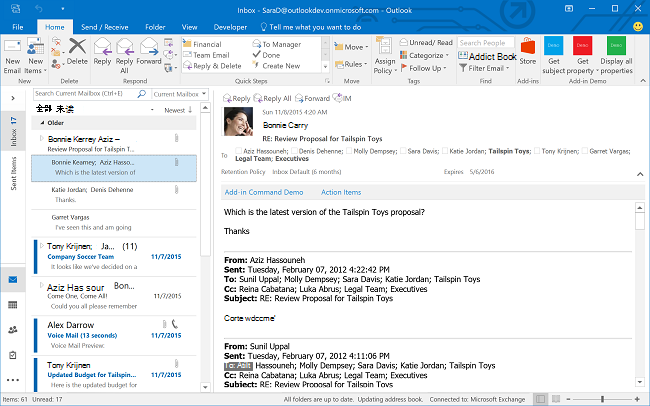
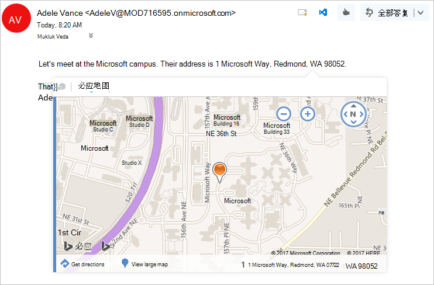

# Outlook 加载项概述

Outlook 加载项是由第三方通过使用基于 Web 的平台构建到 Outlook 中的集成。Outlook 加载项具有三个关键方面：

- 相同的加载项和业务逻辑可跨桌面（Windows 版和 Mac 版 Outlook）、Web（Microsoft 365 和 Outlook.com）和移动平台使用。
- Outlook 外接程序包括一个清单，其中介绍了如何将外接程序集成到 Outlook（例如，按钮或任务窗格）中，以及构成外接程序 UI 和业务逻辑的 JavaScript/HTML 代码。
- 最终用户或管理员可以从 [AppSource](https://appsource.microsoft.com) 获取 Outlook 加载项，也可以进行[旁加载](sideload-outlook-add-ins-for-testing.md)。

Outlook 外接程序与 COM 或 VSTO 外接程序（特定于在 Windows 上运行的 Outlook 的较早集成项）不同。与 COM 外接程序不同的是，Outlook 外接程序不具有任何实际安装到用户设备或 Outlook 客户端的代码。对于 Outlook 外接程序，Outlook 读取清单并挂钩在 UI 中指定的控件，然后加载 JavaScript 和 HTML。web 部件全部在沙盒的浏览器的上下文中执行。

支持加载项的 Outlook 项目包括电子邮件、会议请求、响应和取消及约会。每个 Outlook 加载项均定义其可用的上下文，包括项目类型以及用户是在阅读还是撰写项目。

[!INCLUDE [publish policies note](../includes/note-publish-policies.md)]

## 扩展点

扩展点是加载项与 Outlook 集成的方式。以下是执行此操作的方法。

- 加载项可以声明出现在所有邮件和约会的命令界面中的按钮。有关详细信息，请参阅 [用于 Outlook 的加载项命令](add-in-commands-for-outlook.md)。

    **功能区上具有命令按钮的加载项**

    

- 加载项可以在邮件和约会中中断与正则表达式匹配项或检测实体的链接。 有关详细信息，请参阅 [上下文 Outlook 加载项](contextual-outlook-add-ins.md)。

    **用于突出显示的实体（地址）的上下文相关加载项**

    

## 外接程序可用的邮箱项目

当用户正在撰写或阅读邮件或约会，而不是其他项目类型时，Outlook 加载项会激活。 但是，如果撰写或阅读窗体中的当前邮件项目为以下项之一，则 Outlook *不会* 激活邮件加载项：

- 使用信息权限管理 (IRM) 进行保护，或使用其他保护方式进行加密。数字签名邮件便是其中一个例子，因为数字签名依赖于这些机制之一。

  > [!IMPORTANT]
  >
  > - 加载项在与 Microsoft 365 订阅相关联的 Outlook 电子签名邮件上激活。 在Windows上，这个支持是通过8711.1000版本中引入的。
  >
  > - 现在，Windows 版 Outlook 从内部版本 13229.10000 开始可以在受 IRM 保护的项目上激活加载项。 有关处于预览阶段的此功能的详细信息，请参阅 [在受信息权限管理 (IRM) 保护的项目上激活加载项](../reference/objectmodel/preview-requirement-set/outlook-requirement-set-preview.md#add-in-activation-on-items-protected-by-information-rights-management-irm)。

- 具有邮件类别 IPM.Report.* 的送达报告或通知，包括送达和未送达报告 (NDR)，以及已读、未读和延迟通知。

- 属于其他邮件的附件的 .msg 或 .eml 文件。

- 从文件系统打开的 .msg 或 .eml 文件。

- 在 [组邮箱](/microsoft-365/admin/create-groups/compare-groups?view=o365-worldwide&preserve-view=true#shared-mailboxes)、共享邮箱\*、另一用户邮箱\*、 [存档邮箱](/office365/servicedescriptions/exchange-online-archiving-service-description/archive-features#archive-mailbox)或公用文件夹中。

  > [!IMPORTANT]
  > [要求集 1.8](../reference/objectmodel/requirement-set-1.8/outlook-requirement-set-1.8.md)中引入了 \* 对委托访问方案的支持（例如，从其他用户的邮箱共享的文件夹）。 共享邮箱支持现已提供预览版。 要了解详细信息，请参阅 [启用共享文件夹和共享邮箱方案](delegate-access.md)。

- 使用自定义窗体。

- 通过[简单 MAPI](https://support.microsoft.com/topic/a3d3f856-eaf6-b6d8-3617-186c0a1123c5) 创建。 如果 Outlook 关闭时，Office 用户从 Windows 上的 Office 应用程序创建或发送电子邮件，则将使用简单 MAPI。 例如，用户在 Word 中工作时可以创建 Outlook 电子邮件，这会触发 Outlook 撰写窗口，而无需启动完整的 Outlook 应用程序。 但是，如果用户从 Word 创建电子邮件时 Outlook 已在运行，则这不属于简单 MAPI 方案，因此只要满足其他激活要求，Outlook 加载项就会在撰写窗体中工作。

通常，Outlook 可以为"已发送邮件"文件夹中的项目在阅读窗体中激活加载项，基于已知实体字符串匹配激活的加载项除外。 欲了解其背后原因的详细信息，请参阅[将 Outlook 项中的字符串作为已知实体进行匹配](match-strings-in-an-item-as-well-known-entities.md)。

## 支持的客户端

Windows 版 Outlook 2013 或更高版本、Mac 版 Outlook 2016 或更高版本、适用于本地 Exchange 2013 和更高版本的 Outlook 网页版、iOS 版 Outlook、Android 版 Outlook 及 Outlook 网页版和 Outlook.com 支持 Outlook 加载项。 并非所有[客户端](../reference/requirement-sets/outlook-api-requirement-sets.md#requirement-sets-supported-by-exchange-servers-and-outlook-clients)都同时支持全部最新功能。 请参阅有关这些功能的文章和 API 参考，了解它们可能在哪些应用程序中受支持或不受支持。

## 开始构建 Outlook 外接程序

要开始生成 Outlook 加载项，请尝试执行以下操作：

- [快速入门](../quickstarts/outlook-quickstart.md) - 生成简单的任务窗格。
- [教程](../tutorials/outlook-tutorial.md) - 了解如何创建将 GitHub Gist 插入新邮件的加载项。

## 另请参阅

- [了解 Microsoft 365 开发人员计划](https://developer.microsoft.com/microsoft-365/dev-program)
- [Office 加载项开发最佳做法](../concepts/add-in-development-best-practices.md)
- [Office 加载项的设计准则](../design/add-in-design.md)
- [许可 Office 和 SharePoint 加载项](/office/dev/store/license-your-add-ins)
- [发布 Office 加载项](../publish/publish.md)
- [将解决方案提交到 AppSource 和 Office 应用商店](/office/dev/store/submit-to-the-office-store)
