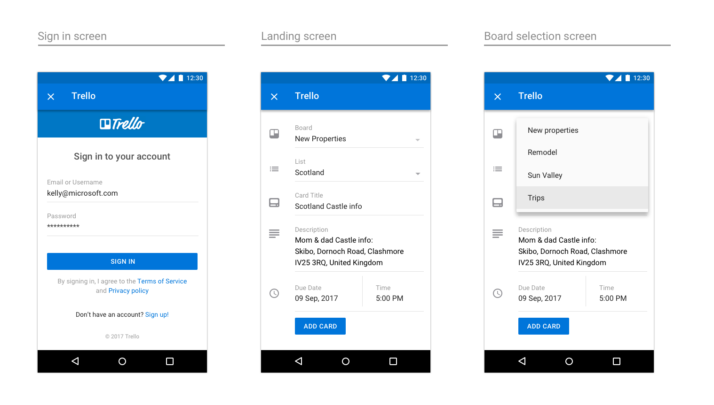

# Outlook 外接程序设计准则Outlook add-in design guidelines

外接程序是一种可供合作伙伴在我们的核心功能集之外进一步扩展 Outlook 功能的绝佳方式。通过外接程序，用户无需离开收件箱即可访问第三方体验、任务和内容。安装后，Outlook 外接程序将在所有平台和设备上可用。Add-ins are a great way for partners to extend the functionality of Outlook beyond our core feature set. Add-ins enable users to access third-party experiences, tasks, and content without needing to leave their inbox. Once installed, Outlook add-ins are available on every platform and device.  

以下高级指南将有助于设计和生成引人注目的加载项，可将应用的最佳功能直接引入 Windows、Web、iOS、Mac 和 Android 设备上的 Outlook。The following high-level guidelines will help you design and build a compelling add-in, which brings the best of your app right into Outlook&mdash;on Windows, Web, iOS, Mac, and Android.

## 原则Principles

1. **重点关注几个关键任务；并将其做好****Focus on a few key tasks; do them well**

   设计一流的加载项易于使用、目标明确并且可为用户带来实际价值。由于加载项将在 Outlook 内部运行，因此这一原则额外重要。Outlook 是生产力应用，人们使用此应用来完成工作。The best designed add-ins are simple to use, focused, and provide real value to users. Because your add-in will run inside of Outlook, there is additional emphasis placed on this principle. Outlook is a productivity app&mdash;it's where people go to get things done.

   你将成为我们体验的扩展测试人员，请务必确保启用方案就像是在 Outlook 内部进行操作一样自然恰当。认真考虑你的哪些常用用例通过与这些方案挂钩可以从我们的电子邮件和日历体验中获益最大。You will be an extension of our experience and it is important to make sure the scenarios you enable feel like a natural fit inside of Outlook. Think carefully about which of your common use cases will benefit the most from having hooks to them from within our email and calendaring experiences.

   外接程序不应尝试执行应用所执行的一切操作。重点应放在 Outlook 内容的上下文中使用最频繁的恰当操作。考虑操作调用并明确任务窗格打开时用户应执行什么操作。An add-in should not attempt to do everything your app does. The focus should be on the most frequently used, and appropriate, actions in the context of Outlook content. Think about your call to action and make it clear what the user should do when your task pane opens.

2. **使其尽可能类似于本机模式****Make it feel as native as possible**

   应使用正在运行 Outlook 的平台上的本机模式设计外接程序。若要实现这一点，务必尊重并实现各个平台规定的交互和外观准则。Outlook 具有自己的准则，同样也必须考虑这些准则。设计良好的外接程序将恰当地融合体验、平台和 Outlook。Your add-in should be designed using patterns native to the platform that Outlook is running on. To achieve this, be sure to respect and implement the interaction and visual guidelines set forth by each platform. Outlook has its own guidelines and those are also important to consider. A well-designed add-in will be an appropriate blend of your experience, the platform, and Outlook.

   这就是说，加载项在 iOS 版 Outlook 与在 Android 版 Outlook 上运行时的外观必须不同。我们建议不妨使用 [Framework7](https://framework7.io/) 作为样式设置选项。This does mean that your add-in will have to visually be different when it runs in Outlook on iOS versus Android. We recommend taking a look at [Framework7](https://framework7.io/) as one option to help you with styling.

3. **确保使用体验令人满意，并正确设置详细信息****Make it enjoyable to use and get the details right**

   人们喜欢使用实用且外观吸引人的产品。在已仔细考虑每个交互和外观细节的情况下精心构建体验有助于确保加载项成功。完成任务的必要步骤必须清楚并相互关联。理想情况下，操作不应超过一次或两次单击。People enjoy using products that are both functionally and visually appealing. You can help ensure the success of your add-in by crafting an experience where you've carefully considered every interaction and visual detail. The necessary steps to complete a task must be clear and relevant. Ideally, no action should be further than a click or two away. 
   
   尽量不要使用户脱离上下文来完成操作。Try not to take a user out of context to complete an action. 用户应可以轻松进入和退出加载项并可轻松返回至用户之前正在执行的操作。A user should easily be able to get in and out of your add-in and back to whatever she was doing before. 不应对加载项花费大量的时间，它主要用于增强核心功能。An add-in is not meant to be a destination to spend a lot of time in&mdash;it is an enhancement to our core functionality. 如果处理得当，加载项将有助于实现使用户更高效的目标。If done properly, your add-in will help us deliver on the goal of making people more productive.

4. **明智地进行品牌打造****Brand wisely**

   我们非常重视品牌打造，同时我们知道向用户提供唯一体验至关重要。We value great branding, and we know it is important to provide users with your unique experience. 但是我们认为确保加载项成功的最佳方式是生成巧妙整合品牌元素的直观体验，而非显示重复或突兀的品牌元素，它们只会分散用户无阻碍进入系统的注意力。But we feel the best way to ensure your add-in's success is to build an intuitive experience that subtly incorporates elements of your brand versus displaying persistent or obtrusive brand elements that only distract a user from moving through your system in an unencumbered manner. 
    
   有效地整合品牌的良好方式是使用品牌颜色、图标和声音（假定这些与首选的平台模式或辅助功能要求不冲突）。A good way to incorporate your brand in a meaningful way is through the use of your brand colors, icons, and voice&mdash;assuming these don't conflict with the preferred platform patterns or accessibility requirements. 努力将重点集中在内容和任务完成方面，而非品牌关注。Strive to keep the focus on content and task completion, not brand attention. 
    
   > [!NOTE]
   >  iOS 或 Android 上的加载项中不应显示广告。Ads should not be shown within add-ins on iOS or Android.

## 设计模式Design patterns

> [!NOTE]
> 上述准则适用于所有端点/平台，但以下模式和示例特定于 iOS 平台上的移动外接程序。While the above principles apply to all endpoints/platforms, the following patterns and examples are specific to mobile add-ins on the iOS platform.

我们提供了包含适用于 Outlook Mobile 环境的 iOS 移动模式的[模板](../design/ux-design-pattern-templates.md)，以帮助创建设计良好的外接程序。利用这些特定模式有助于确保外接程序如同在 iOS 平台和 Outlook Mobile 本机自带一般。下面详细介绍了这些模式。虽不全面，但这只是构建库的开始，在我们发现合作伙伴希望纳入其外接程序的其他范例时我们将继续构建此库。To help you create a well-designed add-in, we have [templates](../design/ux-design-pattern-templates.md) that contain iOS mobile patterns that work within the Outlook Mobile environment. Leveraging these specific patterns will help ensure your add-in feels native to both the iOS platform and Outlook Mobile. These patterns are also detailed below. While not exhaustive, this is the start of a library that we will continue to build upon as we uncover additional paradigms partners wish to include in their add-ins.  

### 概述Overview

典型的外接程序由下列组件组成。A typical add-in is made up of the following components.

### 加载Loading

用户点击外接程序后，UX 应尽快显示。如果出现任何延迟，则使用进度栏或活动指示器。时间量可确定时应使用进度栏，时间量不可确定时应使用活动指示器。When a user taps on your add-in, the UX should display as quickly as possible. If there is any delay, use a progress bar or activity indicator. A progress bar should be used when the amount of time is determinable and an activity indicator should be used when the amount of time is indeterminable.

**iOS 上的加载页示例****An example of loading pages on iOS**

**Android 上的加载页示例****An example of loading pages on Android**

### 登录/注册Sign in/Sign up

使登录（和注册）流程简单易用。Make your sign in (and sign up) flow straightforward and simple to use.

**iOS 上的登录和注册页示例****An example sign in and sign up page on iOS**

**Android 上的登录页示例****An example sign in page on Android**

### 品牌栏Brand bar

外接程序的第一个屏幕应包含品牌元素。品牌栏用于进行识别，同时也有助于为用户设置上下文。由于导航栏包含公司/品牌的名称，因此没有必要在后续页面上重复品牌栏。The first screen of your add-in should include your branding element. Designed for recognition, the brand bar also helps set context for the user. Because the navigation bar contains the name of your company/brand, it's unnecessary to repeat the brand bar on subsequent pages.

**iOS 上的品牌打造示例****An example of branding on iOS**

**Android 上的品牌打造示例****An example of branding on Android**

### 边距Margins

移动电话边距每侧应设置为 15px（屏幕的 8%），与 Outlook iOS 一致；每侧应设置为 16px 以与 Outlook Android 一致。Mobile margins should be set to 15px (8% of screen) for each side, to align with Outlook iOS and 16px for each side to align with Outlook Android.

### 版式Typography

版式使用与 Outlook iOS 对齐并尽量简单以保证易于浏览。Typography usage is aligned to Outlook iOS and is kept simple for scannability.

**iOS 上的版式****Typography on iOS**

**Android 上的版式****Typography on Android**

### 调色板Color palette

颜色使用在 Outlook iOS 中比较微妙。我们要求颜色使用本地化到操作和错误状态，以保证一致，仅品牌栏使用唯一的颜色。Color usage is subtle in Outlook iOS.  To align, we ask that usage of color is localized to actions and error states, with only the brand bar using a unique color.

### 单元格Cells

由于导航栏不能用于标记页面，因此使用节标题标记页面。Since the navigation bar cannot be used to label a page, use section titles to label pages.

**iOS 上的单元格示例****Examples of cells on iOS**

* * *

* * *

* * *

**Android 上的单元格示例****Examples of cells on Android**

* * *

* * *

* * *

### 操作Actions

即使应用要处理大量操作，也要考虑想要外接程序执行的最重要的操作，并重点关注这些操作。Even if your app handles a multitude of actions, think about the most important ones you want your add-in to perform, and concentrate on those.

**iOS 上的操作示例****Examples of actions on iOS**

* * *

**Android 上的操作示例****Examples of actions on Android**

* * *

### 按钮Buttons

存在以下其他 UX 元素时使用按钮（相对于操作，其中操作是屏幕上的最后一个元素）。Buttons are used when there are other UX elements below (vs. actions, where the action is the last element on the screen).

**iOS 上的按钮示例****Examples of buttons on iOS**

**Android 上的按钮示例****Examples of buttons on Android**

### 选项卡Tabs

选项卡可帮助组织内容。Tabs can aid in content organization.

**iOS 上的选项卡示例****Examples of tabs on iOS**

**Android 上的选项卡示例****Examples of tabs on Android**

### 图标Icons

图标应尽可能遵循当前 Outlook iOS 的设计。使用标准大小和颜色。Icons should follow the current Outlook iOS design when possible. Use our standard size and color.

**iOS 上的图标示例****Examples of icons on iOS**

**Android 上的图标示例****Examples of icons on Android**

## 端到端示例End-to-end examples

为了推动 v1 Outlook Mobile 外接程序的启动，我们已与正在生成外接程序的合作伙伴密切合作。作为展示其外接程序在 Outlook Mobile 上的潜力的方式，我们的设计人员使用我们的准则和模式将每个外接程序的端到端流组合在一起。For our v1 Outlook Mobile Add-ins launch, we worked closely with our partners who were building add-ins. As a way to showcase the potential of their add-ins on Outlook Mobile, our designer put together end-to-end flows for each add-in, leveraging our guidelines and patterns.

> [!IMPORTANT]
> 这些示例旨在强调同时处理加载项的交互和可视化设计的理想方法，可能与加载项发布版本中的准确功能集不匹配。These examples are meant to highlight the ideal way to approach both the interaction and visual design of an add-in and may not match the exact feature sets in the shipped versions of the add-ins. 

### GIPHYGIPHY

**iOS 上的 GIPHY 示例****An example of GIPHY on iOS**

**Android 上的 GIPHY 示例****An example of GIPHY on Android**

### NimbleNimble

**iOS 上的 Nimble 示例****An example of Nimble on iOS**

**Android 上的 Nimble 示例****An example of Nimble on Android**

### TrelloTrello

**iOS 上的 Trello 示例****An example of Trello on iOS**

* * *

* * *

**Android 上的 Trello 示例****An example of Trello on Android**

* * *

### Dynamics CRMDynamics CRM

**iOS 上的 Dynamics CRM 示例****An example of Dynamics CRM on iOS**

**Android 上的 Dynamics CRM 示例****An example of Dynamics CRM on Android**

