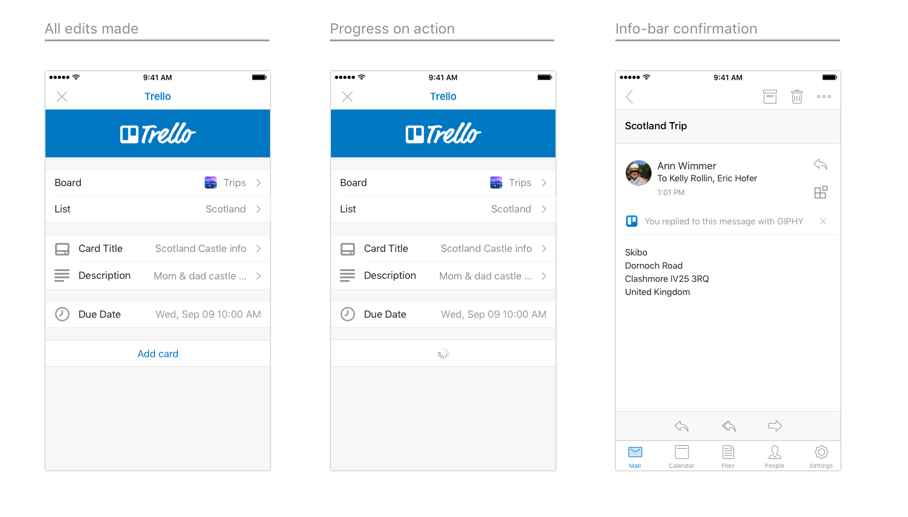

# Outlook 外接程序设计准则

加载项是一种可供合作伙伴在我们的核心功能集之外进一步扩展 Outlook 功能的绝佳方式。通过加载项，用户无需离开收件箱即可访问外部体验、任务和内容。安装后，Outlook 加载项将在所有平台和设备上可用。  

以下高级指南将有助于设计和生成引人注目的加载项，可将应用的最佳功能直接引入 Windows、Web、iOS、Mac 和 Android 设备上的 Outlook。

## 原则

1. **重点关注几个关键任务；并将其做好**

   设计一流的加载项易于使用、目标明确并且可为用户带来实际价值。由于加载项将在 Outlook 内部运行，因此这一原则额外重要。Outlook 是生产力应用，人们使用此应用来完成工作。

   你将成为我们体验的扩展测试人员，请务必确保启用方案就像是在 Outlook 内部进行操作一样自然恰当。认真考虑你的哪些常用用例通过与这些方案挂钩可以从我们的电子邮件和日历体验中获益最大。

   外接程序不应尝试执行应用所执行的一切操作。重点应放在 Outlook 内容的上下文中使用最频繁的恰当操作。考虑操作调用并明确任务窗格打开时用户应执行什么操作。

2. **使其尽可能类似于本机模式**

   应使用正在运行 Outlook 的平台上的本机模式设计外接程序。若要实现这一点，务必尊重并实现各个平台规定的交互和外观准则。Outlook 具有自己的准则，同样也必须考虑这些准则。设计良好的外接程序将恰当地融合体验、平台和 Outlook。

   这意味着，在 iOS 版 Outlook 与 Android 版 Outlook 中运行加载项时，加载项在外观上必须不同。 

3. **确保使用体验令人满意，并正确设置详细信息**

   人们喜欢使用实用且外观吸引人的产品。在已仔细考虑每个交互和外观细节的情况下精心构建体验有助于确保加载项成功。完成任务的必要步骤必须清楚并相互关联。理想情况下，操作不应超过一次或两次单击。 
   
   请尽量不要让用户脱离上下文来完成操作。用户应能够轻松地进出加载项，并返回到之前执行的任何操作。加载项不是要在其中花费大量时间的目标&mdash;，而是增强我们的核心功能。如果操作正确，你的加载项将帮助我们实现提高人员工作效率的目标。

4. **明智地进行品牌打造**

   我们非常重视品牌打造，同时我们知道向用户提供唯一体验至关重要。但是我们认为确保外接程序成功的最佳方式是生成巧妙整合品牌元素的直观体验，而非显示重复或突兀的品牌元素，它们只会分散用户无阻碍进入系统的注意力。 
    
   以有意义的方式整合品牌的一个好方法是使用品牌颜色、图标和语音&mdash;，假定这些与首选平台模式或辅助功能要求不存在冲突。请努力保持对内容和任务完成的关注，而不是品牌关注。 
    
   > [!NOTE]
   >  iOS 或 Android 上的加载项中不应显示广告。

## 设计模式

> [!NOTE]
> 上述准则适用于所有端点/平台，但以下模式和示例特定于 iOS 平台上的移动外接程序。

我们提供了包含适用于 Outlook Mobile 环境的 iOS 移动模式的[模板](../design/ux-design-pattern-templates.md)，以帮助创建设计良好的外接程序。利用这些特定模式有助于确保外接程序如同在 iOS 平台和 Outlook Mobile 本机自带一般。下面详细介绍了这些模式。虽不全面，但这只是构建库的开始，在我们发现合作伙伴希望纳入其外接程序的其他范例时我们将继续构建此库。  

### 概述

典型的外接程序由下列组件组成。

### 加载

用户点击外接程序后，UX 应尽快显示。如果出现任何延迟，则使用进度栏或活动指示器。时间量可确定时应使用进度栏，时间量不可确定时应使用活动指示器。

**iOS 上的加载页示例**

**Android 上的加载页示例**

### 登录/注册

使登录（和注册）流程简单易用。

**iOS 上的登录和注册示例页**

**Android 上的登录页示例**

### 品牌栏

外接程序的第一个屏幕应包含品牌元素。品牌栏用于进行识别，同时也有助于为用户设置上下文。由于导航栏包含公司/品牌的名称，因此没有必要在后续页面上重复品牌栏。

**iOS 上的品牌打造示例**

**Android 上的品牌打造示例**

### 边距

移动电话边距每侧应设置为 15px（屏幕的 8%），与 Outlook iOS 一致；每侧应设置为 16px 以与 Outlook Android 一致。

### 版式

版式使用与 Outlook iOS 对齐并尽量简单以保证易于浏览。

**iOS 上的版式**

**Android 上的版式**

### 调色板

颜色使用在 Outlook iOS 中比较微妙。我们要求颜色使用本地化到操作和错误状态，以保证一致，仅品牌栏使用唯一的颜色。

### 单元格

由于导航栏不能用于标记页面，因此使用节标题标记页面。

**iOS 上的单元格示例**

* * *

* * *

* * *

**Android 上的单元格示例**

* * *

* * *

* * *

### 操作

即使应用要处理大量操作，也要考虑想要外接程序执行的最重要的操作，并重点关注这些操作。

**iOS 上的操作示例**

* * *

**Android 上的操作示例**

* * *

### 按钮

存在以下其他 UX 元素时使用按钮（相对于操作，其中操作是屏幕上的最后一个元素）。

**iOS 上的按钮示例**

**Android 上的按钮示例**

### 选项卡

选项卡可帮助组织内容。

**iOS 上的选项卡示例**

**Android 上的选项卡示例**

### 图标

图标应尽可能遵循当前 Outlook iOS 的设计。使用标准大小和颜色。

**iOS 上的图标示例**

**Android 上的图标示例**

## 端到端示例

为了推动 v1 Outlook Mobile 外接程序的启动，我们已与正在生成外接程序的合作伙伴密切合作。作为展示其外接程序在 Outlook Mobile 上的潜力的方式，我们的设计人员使用我们的准则和模式将每个外接程序的端到端流组合在一起。

> [!IMPORTANT]
> 这些示例旨在强调同时处理加载项的交互和可视化设计的理想方法，可能与加载项发布版本中的准确功能集不匹配。 

### GIPHY

**iOS 上的 GIPHY 示例**

**Android 上的 GIPHY 示例**

### Nimble

**iOS 上的 Nimble 示例**

**Android 上的 Nimble 示例**

### Trello

**iOS 上的 Trello 示例**

* * *

* * *

**Android 上的 Trello 示例**

* * *

### Dynamics CRM

**iOS 上的 Dynamics CRM 示例**

**Android 上的 Dynamics CRM 示例**

