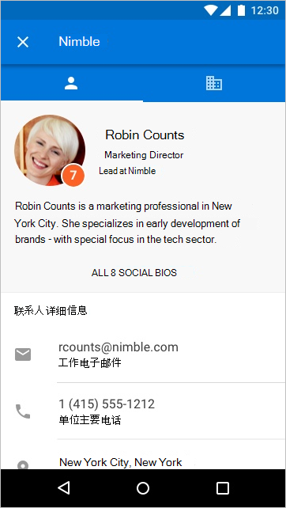

# 适用于 Outlook Mobile 的外接程序

现在，外接程序在 Outlook Mobile 上可用，它们使用适用于其他 Outlook 终结点的相同 API。如果已经生成适用于 Outlook 的外接程序，那么则可以很轻松地在 Outlook Mobile 上使用该外接程序。

Outlook 移动外接程序在所有 Microsoft 365 商业版帐户、Outlook.com帐户上均受支持，并且即将向 Gmail 帐户提供支持。

**iOS 版 Outlook 中的任务窗格示例**

 

**Android 版 Outlook 中的任务窗格示例**

> [!IMPORTANT]
> 外接程序在移动浏览器中的 Outlook 新式版本中不起作用。 有关详细信息，请参阅 [移动浏览器上的 Outlook 正在升级](https://techcommunity.microsoft.com/t5/outlook-blog/outlook-on-your-mobile-browser-is-being-upgraded/ba-p/1125816)。

## 在移动电话上会有什么不同？

- 移动电话尺寸小，需要进行快速交互，这为设计适用于移动电话的加载项带来了挑战。为了确保客户体验的质量，我们正在设置严格的验证标准，声明提供移动支持的加载项必须符合这一标准，以便在 AppSource 中获得批准。
  - 外接程序 **必须** 遵循 [UI 准则](outlook-addin-design.md)。
  - 外接程序的方案 **必须**[能够在移动电话上实现](#what-makes-a-good-scenario-for-mobile-add-ins)。

- 一般情况下，目前仅支持邮件读取模式。 这意味着 `MobileMessageReadCommandSurface` ，唯一应在清单的移动部分中声明的[ExtensionPoint。](../reference/manifest/extensionpoint.md#mobilemessagereadcommandsurface) 但是，联机会议提供商集成加载项支持约会管理器模式，这些加载项会声明 [MobileOnlineMeetingCommandSurface 扩展点](../reference/manifest/extensionpoint.md#mobileonlinemeetingcommandsurface)。 有关 [此方案的信息，](online-meeting.md) 请参阅联机会议提供商文章的"创建 Outlook 移动外接程序"。

- [makeEwsRequestAsync](../reference/objectmodel/preview-requirement-set/office.context.mailbox.md#methods) API 在移动电话上不受支持，因为移动应用使用 REST API 与服务器进行通信。如果应用后端需要连接到 Exchange 服务器，则可以使用回调令牌进行 REST API 调用。有关详细信息，请参阅[从 Outlook 外接程序使用 Outlook REST API](use-rest-api.md)。

- 如果将外接程序和清单中的 [MobileFormFactor](../reference/manifest/mobileformfactor.md) 一起提交至应用商店，则需要同意我们添加针对 iOS 上的外接程序的开发人员附录，并且必须提交你的 Apple 开发人员 ID 以进行验证。

- 最后，清单将需要声明 `MobileFormFactor`，并包含正确的[控件](../reference/manifest/control.md)和[图标大小](../reference/manifest/icon.md)类型。

## 适用于移动外接程序的优秀方案应具备哪些特点？

请记住，电话上 Outlook 会话的平均长度要比在 PC 上短得多。这意味着外接程序必须快速运行，且方案必须允许用户进入、退出，并继续处理他们的电子邮件工作流。

以下是在 Outlook Mobile 中可用的方案示例。

- 外接程序为 Outlook 带来了有价值的信息，帮助用户会审他们的电子邮件并进行适当地响应。示例：可让用户查看客户信息并共享相应信息的 CRM 外接程序。

- 外接程序通过将信息保存到跟踪、协作或类似系统，为用户的电子邮件内容增加价值。示例：允许用户将电子邮件转化为任务项以供项目跟踪，或转化为支持团队的帮助票证的外接程序。

**从 iOS 上的电子邮件创建 Trello 卡片的用户交互示例**

 

**从 Android 上的电子邮件创建 Trello 卡片的用户交互示例**

## 在移动电话上测试外接程序

若要在 Outlook Mobile 上测试加载项，可以将加载项旁加载到 O365 或 Outlook.com 帐户。在 Outlook 网页版中，转到设置齿轮，并选择“**管理集成**”或“**管理加载项**”。在靠近顶部的位置，单击显示的“**单击此处添加自定义加载项**”并上传清单。请确保清单格式正确以包含 `MobileFormFactor`，否则将无法上传。

在加载项正常运行后，请务必在不同尺寸的屏幕（包括电话和平板电脑）上测试加载项。应确保加载项符合与对比度、字号和颜色有关的辅助功能准则，并且还适用于屏幕阅读器（如 iOS 上的 VoiceOver 或 Android 上的 TalkBack）。

在移动设备上进行故障排除可能很难，因为您可能没有习惯使用的工具。 但是，在 iOS 上进行疑难解答的一个选项是使用 Fiddler (查看本教程，以将 Fiddler 与 [iOS 设备](https://www.telerik.com/blogs/using-fiddler-with-apple-ios-devices)) 。

## 后续步骤

了解如何：

- [向外接程序的清单添加移动支持](add-mobile-support.md)。
- [为外接程序设计出色的移动体验](outlook-addin-design.md)。
- [从外接程序获取访问令牌并调用 Outlook REST API](use-rest-api.md)。
