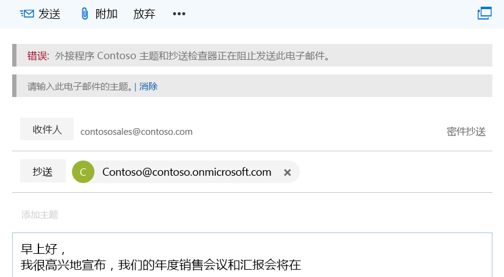
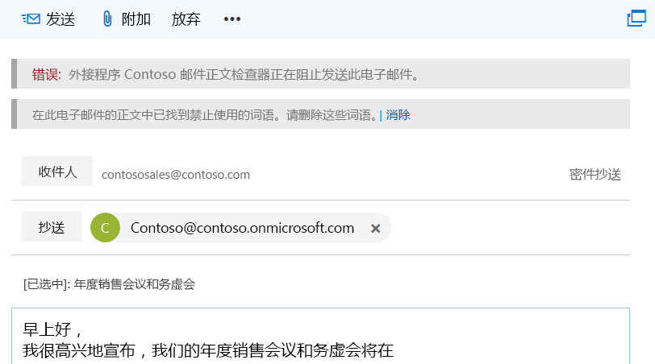

# <a name="on-send-feature-for-outlook-add-ins"></a>Outlook 加载项的 Onsend 功能

The on-send feature for Outlook add-ins provides a way to handle a message or meeting item, or block users from certain actions, and allows an add-in to set certain properties on send. For example, you can use the on-send feature to:

- 防止用户发送敏感信息或将主题行留空。  
- 将特定的收件人添加到邮件中的“抄送”行中，或添加到会议中的“可选收件人”行中。

on-send 功能是由事件类型 `ItemSend` 触发的，无 UI。

有关 Onsend 功能的限制信息，请参阅本文稍后部分中介绍的[限制](#limitations)。

## <a name="supported-clients-and-platforms"></a>支持的客户端和平台

下表显示了用于 "发送" 功能的受支持的客户端/服务器组合。 不支持排除的组合。

| 客户端 | Exchange Online | Exchange 2016 本地<br>（累积更新6或更高版本） | Exchange 2019 本地<br>（累积更新1或更高版本） |
|---|:---:|:---:|:---:|
|Windows：<br>版本1910（内部版本12130.20272）或更高版本|是|是|是|
|Mac<br>生成16.30 或更高版本|是|否|否|
|Web 浏览器：<br>新式 Outlook UI|是|不适用|不适用|
|Web 浏览器：<br>经典 Outlook UI|不适用|是|是|

> [!NOTE]
> 按发送功能在要求集1.8 中发布（有关详细信息[，请参阅当前服务器和客户端支持](../reference/requirement-sets/outlook-api-requirement-sets.md#requirement-sets-supported-by-exchange-servers-and-outlook-clients)）。

> [!IMPORTANT]
> [AppSource](https://appsource.microsoft.com)中不允许使用 "发送时" 功能的外接程序。

## <a name="how-does-the-on-send-feature-work"></a>Onsend 功能的工作原理

可使用 Onsend 功能生成集成了 `ItemSend` 同步事件的 Outlook 加载项。 此事件检测到用户正在按“**发送**”按钮（或现有会议的“**发送更新**”按钮），并且如果验证失败，则可用于阻止该项目发送。 例如，当用户触发邮件发送事件时，使用 Onsend 功能的 Outlook 加载项可以执行以下操作：

- 读取和验证电子邮件内容
- 验证邮件是否包含主题行
- 设置预先确定的收件人

当触发 send 事件时，将在 Outlook 中对客户端进行验证，并且外接程序在超时之前最长可达5分钟。如果验证失败，将阻止发送项目，并在信息栏中显示一条错误消息，提示用户执行操作。

以下屏幕截图显示了通知发件人添加主题的信息栏。

<br/>



<br/>

<br/>

以下屏幕截图显示了一个信息栏，通知发件人已找到禁止使用的词语。

<br/>



## <a name="limitations"></a>限制

Onsend 功能目前具有以下限制。

- **AppSource** &ndash; 无法在 [AppSource](https://appsource.microsoft.com) 中发布使用 Onsend 功能的 Outlook 加载项，因为它们将无法通过 AppSource 验证。 使用 Onsend 功能的加载项应由管理员部署。
- **清单**&ndash; - 每个加载项仅支持一个 `ItemSend` 事件。 如果清单中有两个或多个 `ItemSend` 事件，则该清单将无法通过验证。
- **Performance** &ndash; Multiple roundtrips to the web server that hosts the add-in can affect the performance of the add-in. Consider the effects on performance when you create add-ins that require multiple message- or meeting-based operations.
- **稍后发送**（仅适用于 Mac）&ndash; 如果有 Onsend 加载项，**稍后发送**功能将不可用。

### <a name="mailbox-typemode-limitations"></a>邮箱类型/模式限制

只有 Outlook 网页版、Windows 版和 Mac 版中的用户邮箱支持 Onsend 功能。 当前不可对以下邮箱类型和模式使用此功能。

- 共享邮箱\*
- 组邮箱
- 脱机模式

如果对这些邮箱场景启用了 Onsend 功能，则 Outlook 将不允许进行发送。 但是，如果用户答复组邮箱中的电子邮件，则 Onsend 加载项将不运行且系统将发送邮件。

> [!IMPORTANT]
> \*如果外接程序还[实现对代理访问方案的支持](delegate-access.md)，则发送时功能应适用于共享邮箱或文件夹。

## <a name="multiple-on-send-add-ins"></a>多个 Onsend 加载项

如果安装了多个 Onsend 加载项，则加载项将按照从 API `getAppManifestCall` 或 `getExtensibilityContext` 接收到的顺序运行。 如果第一个外接程序允许发送，则第二个外接程序可以更改阻止第一个外接程序进行发送的某些设置。 但是，如果所有已安装的外接程序均允许发送，则第一个外接程序将不会重新运行。

例如，Add-in1 和 Add-in2 均使用 Onsend 功能。 首先安装的是 Add-in1，接着安装的是 Add-in2。 Add-in1 验证邮件中出现的 Fabrikam 一词作为外接程序允许发送的条件。  但是，Add-in2 可以删除出现的所有 Fabrikam 词语。 邮件将与已删除 Fabrikam 的所有实例一同发送（归因于 Add-in1 和 Add-in2 的安装顺序）。

## <a name="deploy-outlook-add-ins-that-use-on-send"></a>部署使用 Onsend 的 Outlook 加载项

建议管理员部署使用 Onsend 功能的 Outlook 加载项。 管理员必须确保 Onsend 加载项满足以下条件：

- 任何时候打开撰写项目时均可用（针对电子邮件：新建、回复或转发）。
- 用户无法关闭或禁用。

## <a name="install-outlook-add-ins-that-use-on-send"></a>安装使用 Onsend 的 Outlook 加载项

Outlook 中的 Onsend 功能要求针对发送事件类型配置加载项。 选择要配置的平台。

### <a name="web-browser---classic-outlook"></a>[Web 浏览器 - 经典 Outlook](#tab/classic)

对于分配了将 *OnSendAddinsEnabled* 标志设置为 **true** 的 Outlook 网页版邮箱策略的用户，系统会为其运行使用 Onsend 功能的 Outlook 网页版（经典）的加载项。

若要安装新的外接程序，请运行以下 Exchange Online PowerShell cmdlet。

```powershell
$Data=Get-Content -Path '.\Contoso Message Body Checker.xml' -Encoding Byte –ReadCount 0
```

```powershell
New-App -OrganizationApp -FileData $Data -DefaultStateForUser Enabled
```

> [!NOTE]
> 若要了解如何使用远程 PowerShell 连接到 Exchange Online，请参阅[连接到 Exchange Online PowerShell](/powershell/exchange/exchange-online/connect-to-exchange-online-powershell/connect-to-exchange-online-powershell)。

#### <a name="enable-the-on-send-feature"></a>启用 Onsend 功能

默认情况下，Onsend 功能处于禁用状态。 管理员可以通过运行 Exchange Online PowerShell cmdlet 启用 Onsend。

要为所有用户启用 Onsend 加载项，请执行以下操作：

1. 创建新的 Outlook 网页版邮箱策略。

   ```powershell
    New-OWAMailboxPolicy OWAOnSendAddinAllUserPolicy
   ```

    > [!NOTE]
    > 管理员可以使用现有策略，但只有某些邮箱类型才支持 Onsend 功能。 系统将默认阻止 Outlook 网页版中不受支持的邮箱进行发送。

2. 启用 Onsend 功能。

   ```powershell
    Get-OWAMailboxPolicy OWAOnSendAddinAllUserPolicy | Set-OWAMailboxPolicy –OnSendAddinsEnabled:$true
   ```

3. 将策略分配给用户。

   ```powershell
    Get-User -Filter {RecipientTypeDetails -eq 'UserMailbox'}|Set-CASMailbox -OwaMailboxPolicy OWAOnSendAddinAllUserPolicy
   ```

#### <a name="enable-the-on-send-feature-for-a-group-of-users"></a>为一组用户启用 Onsend 功能

为特定用户组启用 Onsend 功能的步骤如下。  在此示例中，管理员仅希望在财务用户（其中财务用户属于财务部门）的环境中启用 Outlook 网页版 Onsend 加载项功能。

1. 为该组创建新的 Outlook 网页版邮箱策略。

   ```powershell
    New-OWAMailboxPolicy FinanceOWAPolicy
   ```

   > [!NOTE]
   > 管理员可以使用现有策略，但只有某些邮箱类型才支持 Onsend 功能（有关详细信息，请参阅本文前面介绍的[邮箱类型限制](#multiple-on-send-add-ins)）。 系统将默认阻止 Outlook 网页版中不受支持的邮箱进行发送。

2. 启用 Onsend 功能。

   ```powershell
    Get-OWAMailboxPolicy FinanceOWAPolicy | Set-OWAMailboxPolicy –OnSendAddinsEnabled:$true
   ```

3. 将策略分配给用户。

   ```powershell
    $targetUsers = Get-Group 'Finance'|select -ExpandProperty members
    $targetUsers | Get-User -Filter {RecipientTypeDetails -eq 'UserMailbox'}|Set-CASMailbox -OwaMailboxPolicy FinanceOWAPolicy
   ```

> [!NOTE]
> 需要等待 60 分钟该策略才能生效，或重启 Internet Information Services (IIS)。 策略生效后，将为该组启用 Onsend 功能。

#### <a name="disable-the-on-send-feature"></a>禁用 Onsend 功能

若要禁用用户的 Onsend 功能或分配未启用该标志的 Outlook 网页版邮箱策略，请运行以下 cmdlet。 在此示例中，该邮箱策略是 *ContosoCorpOWAPolicy*。

```powershell
Get-CASMailbox joe@contoso.com | Set-CASMailbox –OWAMailboxPolicy "ContosoCorpOWAPolicy"
```

> [!NOTE]
> 有关如何使用 **Set-OwaMailboxPolicy** cmdlet 配置现有 Outlook 网页版邮箱策略的详细信息，请参阅 [Set-OwaMailboxPolicy](/powershell/module/exchange/client-access/Set-OwaMailboxPolicy)。

若要禁用所有分配了指定 Outlook 网页版邮箱策略的用户的 Onsend 功能，请运行以下 cmdlet。

```powershell
Get-OWAMailboxPolicy OWAOnSendAddinAllUserPolicy | Set-OWAMailboxPolicy –OnSendAddinsEnabled:$false
```

### <a name="web-browser---modern-outlook"></a>[Web 浏览器 - 新式 Outlook](#tab/modern)

对于安装了使用 Onsend 功能的 Outlook 网页版（新式）加载项的任何用户，系统会为其运行该加载项。 但是，如果用户需要运行该加载项来满足合规性标准，则邮箱策略必须将 *OnSendAddinsEnabled* 标志设置为 **true**。

若要安装新的外接程序，请运行以下 Exchange Online PowerShell cmdlet。

```powershell
$Data=Get-Content -Path '.\Contoso Message Body Checker.xml' -Encoding Byte –ReadCount 0
```

```powershell
New-App -OrganizationApp -FileData $Data -DefaultStateForUser Enabled
```

> [!NOTE]
> 若要了解如何使用远程 PowerShell 连接到 Exchange Online，请参阅[连接到 Exchange Online PowerShell](/powershell/exchange/exchange-online/connect-to-exchange-online-powershell/connect-to-exchange-online-powershell)。

#### <a name="disable-the-on-send-policy"></a>禁用 Onsend 策略

默认情况下，启用发送策略。 若要禁用用户的 Onsend 策略或分配未启用该标志的 Outlook 网页版邮箱策略，请运行以下 cmdlet。 在此示例中，该邮箱策略是 *ContosoCorpOWAPolicy*。

```powershell
Get-CASMailbox joe@contoso.com | Set-CASMailbox –OWAMailboxPolicy "ContosoCorpOWAPolicy"
```

> [!NOTE]
> 有关如何使用 **Set-OwaMailboxPolicy** cmdlet 配置现有 Outlook 网页版邮箱策略的详细信息，请参阅 [Set-OwaMailboxPolicy](/powershell/module/exchange/client-access/Set-OwaMailboxPolicy)。

若要禁用所有分配了指定 Outlook 网页版邮箱策略的用户的 Onsend 策略，请运行以下 cmdlet。

```powershell
Get-OWAMailboxPolicy OWAOnSendAddinAllUserPolicy | Set-OWAMailboxPolicy –OnSendAddinsEnabled:$false
```

#### <a name="enable-the-on-send-policy"></a>启用 Onsend 策略

管理员可以通过运行 Exchange Online PowerShell cmdlet 启用 Onsend。

要为所有用户启用 Onsend 加载项，请执行以下操作：

1. 创建新的 Outlook 网页版邮箱策略。

   ```powershell
    New-OWAMailboxPolicy OWAOnSendAddinAllUserPolicy
   ```

    > [!NOTE]
    > 管理员可以使用现有策略，但只有某些邮箱类型才支持 Onsend 功能。 系统将默认阻止 Outlook 网页版中不受支持的邮箱进行发送。

2. 启用 Onsend 功能。

   ```powershell
    Get-OWAMailboxPolicy OWAOnSendAddinAllUserPolicy | Set-OWAMailboxPolicy –OnSendAddinsEnabled:$true
   ```

3. 将策略分配给用户。

   ```powershell
    Get-User -Filter {RecipientTypeDetails -eq 'UserMailbox'}|Set-CASMailbox -OwaMailboxPolicy OWAOnSendAddinAllUserPolicy
   ```

#### <a name="enable-the-on-send-policy-for-a-group-of-users"></a>为一组用户启用 Onsend 策略

为特定用户组启用 Onsend 策略的步骤如下。  在此示例中，管理员仅希望在财务用户（其中财务用户属于财务部门）的环境中启用 Outlook 网页版 Onsend 加载项策略。

1. 为该组创建新的 Outlook 网页版邮箱策略。

   ```powershell
    New-OWAMailboxPolicy FinanceOWAPolicy
   ```

   > [!NOTE]
   > 管理员可以使用现有策略，但只有某些邮箱类型才支持 Onsend 功能（有关详细信息，请参阅本文前面介绍的[邮箱类型限制](#multiple-on-send-add-ins)）。 系统将默认阻止 Outlook 网页版中不受支持的邮箱进行发送。

2. 启用 Onsend 策略。

   ```powershell
    Get-OWAMailboxPolicy FinanceOWAPolicy | Set-OWAMailboxPolicy –OnSendAddinsEnabled:$true
   ```

3. 将策略分配给用户。

   ```powershell
    $targetUsers = Get-Group 'Finance'|select -ExpandProperty members
    $targetUsers | Get-User -Filter {RecipientTypeDetails -eq 'UserMailbox'}|Set-CASMailbox -OwaMailboxPolicy FinanceOWAPolicy
   ```

> [!NOTE]
> 需要等待 60 分钟该策略才能生效，或重启 Internet Information Services (IIS)。 策略生效后，将为该组强制执行 Onsend 功能。

### <a name="windows"></a>[Windows](#tab/windows)

对于安装了使用 Onsend 功能的 Windows 版 Outlook 加载项的任何用户，系统会为其运行该加载项。 但是，如果用户需要运行该加载项来满足合规性标准，则必须在每台适用的计算机上将组策略“**无法加载 Web 扩展时禁用发送**”设置为“**已启用**”。

若要设置邮箱策略，管理员可以下载[管理模板工具](https://www.microsoft.com/download/details.aspx?id=49030)，然后通过运行本地组策略编辑器 **(gpedit.msc)** 访问最新的管理模板。

#### <a name="what-the-policy-does"></a>策略的用途

出于合规性原因，管理员可能需要在用户具有可供运行的最新 Onsend 加载项前，确保其无法发送邮件或会议项目。 管理员必须启用组策略“**无法加载 Web 扩展时禁用发送**”，以便所有加载项都从 Exchange 进行更新，并可用于在发送时验证每封邮件或每个会议项目是否符合预期的规则和规定。

|策略状态|结果|
|---|---|
|已禁用|允许发送。 即使尚未从 Exchange 中更新加载项，也可以在不运行 Onsend 加载项的情况下发送邮件或会议项目。|
|已启用|仅当加载项已从 Exchange 更新时才允许发送；否则，将阻止发送。|

#### <a name="manage-the-on-send-policy"></a>管理 Onsend 策略

默认情况下，Onsend 策略处于禁用状态。 管理员可以通过确保用户的组策略设置“**无法加载 Web 扩展时禁用发送**”设置为“**已启用**”来启用 Onsend 策略。 若为用户禁用策略，管理员应将其设置为“**已禁用**”。 若要管理此策略设置，可执行下列操作。

1. 下载最新的[管理模板工具](https://www.microsoft.com/download/details.aspx?id=49030)。
1. 打开本地组策略编辑器 (**gpedit.msc**)。
1. 导航到 **“用户配置”>“管理模板”>“Microsoft Outlook 2016”>“安全性”>“信任中心”**。
1. 选择“**无法加载 Web 扩展时禁用发送**”设置。
1. 打开链接以编辑策略设置。
1. 在“**无法加载 Web 扩展时禁用发送**”对话框窗口中，根据需要选择“**已启用**”或“**已禁用**”，然后选择“**确定**”或“**应用**”以使更新生效。

### <a name="mac"></a>[Mac](#tab/unix)

对于安装了使用 Onsend 功能的 Mac 版 Outlook 加载项的任何用户，系统会为其运行该加载项。 但是，如果用户需要运行该加载项来满足合规性标准，则必须在每个用户的计算机上应用以下邮箱设置。 此设置或键与 CFPreferences 兼容，这意味着可以使用适用于 Mac 的企业管理软件（例如，Jamf Pro）来对其进行设置。

|||
|:---|:---|
|**域**|com.microsoft.outlook|
|**键**|OnSendAddinsWaitForLoad|
|**DataType**|Boolean|
|**可能的值**|false（默认值）<br>true|
|**可用性**|16.27|
|**备注**|此键将创建 onSendMailbox 策略。|

#### <a name="what-the-setting-does"></a>设置的用途

出于合规性原因，管理员可能需要在用户具有可供运行的最新 Onsend 加载项前，确保其无法发送邮件或会议项目。 管理员必须启用键 **OnSendAddinsWaitForLoad**，以便所有加载项都从 Exchange 进行更新，并可用于在发送时验证每封邮件或每个会议项目是否符合预期的规则和规定。

|键的状态|结果|
|---|---|
|false|允许发送。 即使尚未从 Exchange 中更新加载项，也可以在不运行 Onsend 加载项的情况下发送邮件或会议项目。|
|true|仅当加载项已从 Exchange 更新时才允许发送；否则，将阻止发送，并且禁用“**发送**”按钮。|

---

## <a name="on-send-feature-scenarios"></a>Onsend 功能的应用场景

以下是支持和不支持使用 Onsend 功能的加载项的应用场景。

### <a name="user-mailbox-has-the-on-send-add-in-feature-enabled-but-no-add-ins-are-installed"></a>用户邮箱启用了 Onsend 加载项功能，但未安装任何加载项

在这种场景中，用户将能够在不执行任何加载项的情况下发送邮件或会议项目。

### <a name="user-mailbox-has-the-on-send-add-in-feature-enabled-and-add-ins-that-supports-on-send-are-installed-and-enabled"></a>用户邮箱启用了 Onsend 加载项功能，并且安装并启用了支持 Onsend 的加载项

外接程序在发送事件期间运行，然后允许或阻止用户发送。

### <a name="mailbox-delegation-where-mailbox-1-has-full-access-permissions-to-mailbox-2"></a>邮箱委派，其中邮箱 1 具有对邮箱 2 的完全访问权限

#### <a name="web-browser-classic-outlook"></a>Web 浏览器（经典 Outlook）

|方案|邮箱 1 Onsend 功能|邮箱 2 Onsend 功能|Outlook Web 会话（经典）|结果|是否支持？|
|:------------|:------------|:--------------------------|:---------|:-------------|:-------------|
|1 |启用|启用|新会话|邮箱 1 无法从邮箱 2 发送邮件或会议项目。|Not currently supported. As a workaround, use scenario 3.|
|2 |已禁用|启用|新会话|邮箱 1 无法从邮箱 2 发送邮件或会议项目。|Not currently supported. As a workaround, use scenario 3.|
|3 |已启用|已启用|同一个会话|分配给邮箱 1 的 Onsend 加载项运行 Onsend。|支持。|
|4 |启用|已禁用|新会话|未运行 Onsend 加载项；邮件或会议项目已发送。|支持。|

#### <a name="web-browser-modern-outlook-windows-mac"></a>Web 浏览器（新式 Outlook）、Windows、Mac

若要强制执行 Onsend，管理员应确保对两个邮箱都启用了该策略。 若要了解如何在加载项中支持委派访问，请参阅[在 Outlook 加载项中启用委派访问方案](delegate-access.md)。

### <a name="group-1-is-a-modern-group-mailbox-and-user-mailbox-1-is-a-member-of-group-1"></a>组 1 是新式组邮箱，用户邮箱 1 是组 1 的成员

<br/>

|方案|邮箱 1 Onsend 策略|是否启用了 Onsend 加载项？|邮箱 1 操作|结果|是否支持？|
|:------------|:-------------------------|:-------------------|:---------|:----------|:-------------|
|1 |已启用|是|邮箱 1 撰写发送到组 1 的新邮件或会议。|发送期间，Onsend 加载项运行。|是|
|2 |已启用|是|邮箱 1 在 Outlook 网页版组 1 的组窗口中撰写发送到组 1 的新邮件或会议。|Onsend 加载项不会在发送期间运行。|目前尚不支持。 可以使用方案 1 作为一种解决办法。|

### <a name="user-mailbox-with-on-send-add-in-featurepolicy-enabled-add-ins-that-support-on-send-are-installed-and-enabled-and-offline-mode-is-enabled"></a>用户邮箱启用了 Onsend 加载项功能/策略，并且安装并启用了支持 Onsend 的加载项，启用了脱机模式

Onsend 加载项将根据用户、加载项后端和 Exchange 的联机状态运行。

#### <a name="users-state"></a>用户的状态

如果用户处于联机状态，则 Onsend 加载项将在发送期间运行。 如果用户处于脱机状态，Onsend 加载项不会在发送期间运行，也不会发送邮件或会议项目。

#### <a name="add-in-backends-state"></a>加载项后端的状态

如果 Onsend 加载项的后端处于联机状态且可访问，则将运行该加载项。 如果后端处于脱机状态，则将禁用发送。

#### <a name="exchanges-state"></a>Exchange 的状态

如果 Exchange 服务器处于联机状态且可访问，则 Onsend 加载项将在发送期间运行。 如果 Onsend 加载项无法访问 Exchange 并且已启用适用的策略或 cmdlet，则将禁用发送。

> [!NOTE]
> 在处于任何脱机状态的 Mac 上，“**发送**”按钮（或现有会议的“**发送更新**”按钮）将被禁用，并显示当用户脱机时其组织不允许发送的通知。


## <a name="code-examples"></a>代码示例

以下代码示例说明如何创建一个简单的 Onsend 加载项。 若要下载这些示例所基于的代码示例，请参阅 [Outlook-Add-in-On-Send](https://github.com/OfficeDev/Outlook-Add-in-On-Send)。

> [!TIP]
> 如果将对话框与发送时事件结合使用，请确保在完成该事件之前关闭对话框。

### <a name="manifest-version-override-and-event"></a>清单、版本重写和事件

[Outlook-Add-in-On-Send](https://github.com/OfficeDev/Outlook-Add-in-On-Send) 代码示例包括两个清单：

- `Contoso Message Body Checker.xml` &ndash; 展示了如何在发送时检查邮件正文是否包含限制字词或敏感信息。  

- `Contoso Subject and CC Checker.xml` &ndash; 展示了如何将收件人添加到抄送行，并在发送时验证邮件是否包含主题行。  

在 `Contoso Message Body Checker.xml` 清单文件中，将包含在 `ItemSend` 事件中应调用的函数文件和函数名称。 该操作将同步运行。

```xml
<Hosts>
    <Host xsi:type="MailHost">
        <DesktopFormFactor>
            <!-- The functionfile and function name to call on message send.  -->
            <!-- In this case, the function validateBody will be called within the JavaScript code referenced in residUILessFunctionFileUrl. -->
            <FunctionFile resid="residUILessFunctionFileUrl" />
            <ExtensionPoint xsi:type="Events">
                <Event Type="ItemSend" FunctionExecution="synchronous" FunctionName="validateBody" />
            </ExtensionPoint>
        </DesktopFormFactor>
    </Host>
</Hosts>
```

> [!IMPORTANT]
> 如果使用 Visual Studio 2019 开发你的发送外接程序，则可能会收到类似于以下的验证警告： "这是一个无效的 xsi： type ' http://schemas.microsoft.com/office/mailappversionoverrides/1.1:Events "。 "若要解决此问题，您需要在[有关此警告的博客](https://theofficecontext.com/2018/11/29/visual-studio-2017-this-is-an-invalid-xsitype-mailappversionoverrides-1-1event/)中提供了 MailAppVersionOverridesV1_1 的较新版本的 .Xsd 作为 GitHub gist 提供。

对于 `Contoso Subject and CC Checker.xml` 清单文件，以下示例中显示了邮件发送事件中要调用的函数文件和函数名称。

```xml
<Hosts>
    <Host xsi:type="MailHost">
        <DesktopFormFactor>
            <!-- The functionfile and function name to call on message send.  -->
            <!-- In this case the function validateSubjectAndCC will be called within the JavaScript code referenced in residUILessFunctionFileUrl. -->
            <FunctionFile resid="residUILessFunctionFileUrl" />
            <ExtensionPoint xsi:type="Events">
                <Event Type="ItemSend" FunctionExecution="synchronous" FunctionName="validateSubjectAndCC" />
            </ExtensionPoint>
        </DesktopFormFactor>
    </Host>
</Hosts>
```

<br/>

Onsend API 需要 `VersionOverrides v1_1`。 以下显示如何在清单中添加 `VersionOverrides` 节点。

```xml
 <VersionOverrides xmlns="http://schemas.microsoft.com/office/mailappversionoverrides" xsi:type="VersionOverridesV1_0">
     <!-- On Send requires VersionOverridesV1_1 -->
     <VersionOverrides xmlns="http://schemas.microsoft.com/office/mailappversionoverrides/1.1" xsi:type="VersionOverridesV1_1">
         ...
     </VersionOverrides>
</VersionOverrides>
```

> [!NOTE]
> 有关详细信息，请参阅：
> - [Outlook 外接程序清单](manifests.md)
> - [Office 加载项 XML 清单](../overview/add-in-manifests.md)


### <a name="event-and-item-objects-and-bodygetasync-and-bodysetasync-methods"></a>`Event` 和 `item` 对象以及 `body.getAsync` 和 `body.setAsync` 方法

若要访问当前选择的邮件或会议项目（在本示例中为新撰写的邮件），请使用 `Office.context.mailbox.item` 命名空间。 `ItemSend` 事件由 Onsend 功能自动传递到清单中指定的函数&mdash;在本示例中为 `validateBody` 函数。

```js
var mailboxItem;

Office.initialize = function (reason) {
    mailboxItem = Office.context.mailbox.item;
}

// Entry point for Contoso Message Body Checker add-in before send is allowed.
// <param name="event">ItemSend event is automatically passed by on-send code to the function specified in the manifest.</param>
function validateBody(event) {
    mailboxItem.body.getAsync("html", { asyncContext: event }, checkBodyOnlyOnSendCallBack);
}
```

`validateBody` 函数以指定格式 (HTML) 获取当前正文，并在回调方法中传递代码想要访问的 `ItemSend` 事件对象。 除 `getAsync` 方法之外，`Body` 对象还提供了 `setAsync` 方法，可用于将正文替换为指定的文本。

> [!NOTE]
> 有关详细信息，请参阅 [Event 对象](/javascript/api/office/office.addincommands.event)和 [Body.getAsync](/javascript/api/outlook/office.Body#getasync-coerciontype--options--callback-)。
  

### <a name="notificationmessages-object-and-eventcompleted-method"></a>`NotificationMessages` 对象和 `event.completed` 方法

`checkBodyOnlyOnSendCallBack` 函数使用正则表达式来确定邮件正文是否包含禁止使用的词语。 如果该函数发现受限词语数组的匹配项，则将阻止发送电子邮件，并通过信息栏通知发件人。 为了做到这一点，它使用 `Item` 对象的 `notificationMessages` 属性来返回 `NotificationMessages` 对象。 然后，通过调用 `addAsync` 方法向该项目添加通知，如以下示例所示。

```js
// Determine whether the body contains a specific set of blocked words. If it contains the blocked words, block email from being sent. Otherwise allow sending.
// <param name="asyncResult">ItemSend event passed from the calling function.</param>
function checkBodyOnlyOnSendCallBack(asyncResult) {
    var listOfBlockedWords = new Array("blockedword", "blockedword1", "blockedword2");
    var wordExpression = listOfBlockedWords.join('|');

    // \b to perform a "whole words only" search using a regular expression in the form of \bword\b.
    // i to perform case-insensitive search.
    var regexCheck = new RegExp('\\b(' + wordExpression + ')\\b', 'i');
    var checkBody = regexCheck.test(asyncResult.value);

    if (checkBody) {
        mailboxItem.notificationMessages.addAsync('NoSend', { type: 'errorMessage', message: 'Blocked words have been found in the body of this email. Please remove them.' });
        // Block send.
        asyncResult.asyncContext.completed({ allowEvent: false });
    }

    // Allow send.
    asyncResult.asyncContext.completed({ allowEvent: true });
}
```

以下是 `addAsync` 方法的参数：

- `NoSend` &ndash; 一个字符串，即开发人员指定用于引用通知邮件的密钥。 可用于在以后修改此邮件。 密钥长度不能超过32个字符。
- `type` &ndash; JSON 对象参数的一个属性。 表示邮件的类型；类型对应于 [Office.MailboxEnums.ItemNotificationMessageType](/javascript/api/outlook/office.mailboxenums.itemnotificationmessagetype) 枚举的值。 可能的值是进度指示器、信息消息或错误消息。 在此示例中，`type` 是错误消息。  
- `message` &ndash; JSON 对象参数的一个属性。 在此示例中，`message` 是通知邮件的文本。

为表明加载项对由发送操作触发的 `ItemSend` 事件的处理已完成，请调用 `event.completed({allowEvent:Boolean})` 方法。 `allowEvent` 属性是一个布尔值。 如果设置为 `true`，则允许发送。 如果设置为 `false`，则将阻止发送电子邮件。

> [!NOTE]
> 有关详细信息，请参阅 [notificationMessages](../reference/objectmodel/preview-requirement-set/office.context.mailbox.item.md#properties) 和 [completed](/javascript/api/office/office.addincommands.event)。

### <a name="replaceasync-removeasync-and-getallasync-methods"></a>`replaceAsync`、`removeAsync` 和 `getAllAsync` 方法

除了 `addAsync` 方法之外，`NotificationMessages` 对象还包括 `replaceAsync`、`removeAsync` 和 `getAllAsync` 方法。  此代码示例中不使用这些方法。  有关详细信息，请参阅 [NotificationMessages](/javascript/api/outlook/office.NotificationMessages)。


### <a name="subject-and-cc-checker-code"></a>主题和抄送检查器代码

以下代码示例介绍如何将收件人添加到抄送行，并验证邮件在发送时是否包含主题。 此示例使用 Onsend 功能允许或禁止发送电子邮件。  

```js
// Invoke by Contoso Subject and CC Checker add-in before send is allowed.
// <param name="event">ItemSend event is automatically passed by on-send code to the function specified in the manifest.</param>
function validateSubjectAndCC(event) {
    shouldChangeSubjectOnSend(event);
}

// Determine whether the subject should be changed. If it is already changed, allow send. Otherwise change it.
// <param name="event">ItemSend event passed from the calling function.</param>
function shouldChangeSubjectOnSend(event) {
    mailboxItem.subject.getAsync(
        { asyncContext: event },
        function (asyncResult) {
            addCCOnSend(asyncResult.asyncContext);
            //console.log(asyncResult.value);
            // Match string.
            var checkSubject = (new RegExp(/\[Checked\]/)).test(asyncResult.value)
            // Add [Checked]: to subject line.
            subject = '[Checked]: ' + asyncResult.value;

            // Determine whether a string is blank, null, or undefined.
            // If yes, block send and display information bar to notify sender to add a subject.
            if (asyncResult.value === null || (/^\s*$/).test(asyncResult.value)) {
                mailboxItem.notificationMessages.addAsync('NoSend', { type: 'errorMessage', message: 'Please enter a subject for this email.' });
                asyncResult.asyncContext.completed({ allowEvent: false });
            }
            else {
                // If can't find a [Checked]: string match in subject, call subjectOnSendChange function.
                if (!checkSubject) {
                    subjectOnSendChange(subject, asyncResult.asyncContext);
                    //console.log(checkSubject);
                }
                else {
                    // Allow send.
                    asyncResult.asyncContext.completed({ allowEvent: true });
                }
            }
        });
}

// Add a CC to the email. In this example, CC contoso@contoso.onmicrosoft.com
// <param name="event">ItemSend event passed from calling function</param>
function addCCOnSend(event) {
    mailboxItem.cc.setAsync(['Contoso@contoso.onmicrosoft.com'], { asyncContext: event });
}

// Determine whether the subject should be changed. If it is already changed, allow send, otherwise change it.
// <param name="subject">Subject to set.</param>
// <param name="event">ItemSend event passed from the calling function.</param>
function subjectOnSendChange(subject, event) {
    mailboxItem.subject.setAsync(
        subject,
        { asyncContext: event },
        function (asyncResult) {
            if (asyncResult.status == Office.AsyncResultStatus.Failed) {
                mailboxItem.notificationMessages.addAsync('NoSend', { type: 'errorMessage', message: 'Unable to set the subject.' });

                // Block send.
                asyncResult.asyncContext.completed({ allowEvent: false });
            }
            else {
                // Allow send.
                asyncResult.asyncContext.completed({ allowEvent: true });
            }
        });
}
```

To learn more about how to add a recipient to the CC line and verify that the email message includes a subject line on send, and to see the APIs you can use, see the [Outlook-Add-in-On-Send sample](https://github.com/OfficeDev/Outlook-Add-in-On-Send). The code is well commented.

## <a name="see-also"></a>另请参阅

- [Outlook 加载项体系结构和功能概述](outlook-add-ins-overview.md)
- [加载项命令演示 Outlook 加载项](https://github.com/OfficeDev/outlook-add-in-command-demo)
