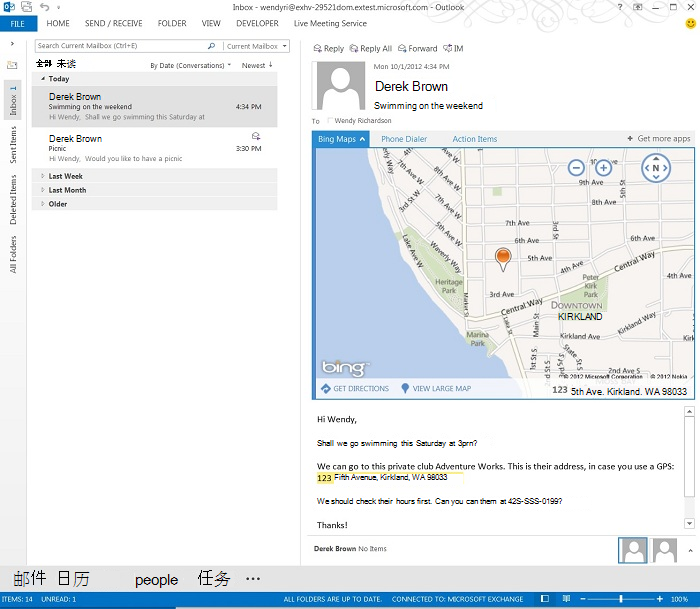

# 创建适用于阅读窗体的 Outlook 加载项

阅读外接程序是在 Outlook 中的阅读窗格或阅读检查器中激活的 Outlook 外接程序。与撰写外接程序（用户创建邮件或约会时激活的 Outlook 外接程序）不同，阅读外接程序在以下用户方案中可用： 

- 查看电子邮件、会议请求、会议响应或会议取消。

   > [!NOTE]
   > Outlook 不会在阅读窗体中针对特定邮件类型激活外接程序，这些类型包括另一封邮件附加的项目、Outlook“草稿”文件夹中的项目，或以其他方式加密或保护的项目。
    
- 查看用户参与的会议项。
    
- 查看用户作为组织者的会议项目（仅限 Outlook 2013 和 Exchange 2013 的 RTM 版本）。
    
   > [!NOTE]
   > 从 Office 2013 SP1 版本开始，如果用户查看由用户组织的会议项目，则只有撰写外接程序才能够激活并可用。这种情况下不再提供读取外接程序。

在每个阅读应用场景中，当激活条件满足时，Outlook 便会激活加载项，用户可以在加载项栏中选择并打开在阅读窗格或阅读检查器中激活的加载项。下图展示了当用户在阅读包含地理位置地址的邮件时激活和打开的**必应地图**加载项。

**加载项窗格，展示了包含地址的选定 Outlook 邮件的必应地图加载项的实际效果**

## 阅读模式下可用的外接程序的类型

阅读外接程序可以为下列类型的任意组合。

- [适用于 Outlook 的外接程序命令](add-in-commands-for-outlook.md)   
- [上下文 Outlook 外接程序](contextual-outlook-add-ins.md)
    

## 阅读外接程序可用的 API 功能

- 要激活阅读窗体中的外接程序：请参阅[在清单中指定激活规则](activation-rules.md#specify-activation-rules-in-a-manifest)中的表 1。    
- [使用正则表达式激活规则显示 Outlook 外接程序](use-regular-expressions-to-show-an-outlook-add-in.md)    
- [将 Outlook 项中的字符串作为已知实体进行匹配](match-strings-in-an-item-as-well-known-entities.md)    
- [从 Outlook 项中提取实体字符串](extract-entity-strings-from-an-item.md)   
- [从服务器获取 Outlook 项的附件](get-attachments-of-an-outlook-item.md)
    

## 另请参阅

- [编写第一个 Outlook 加载项](../quickstarts/outlook-quickstart.md)
