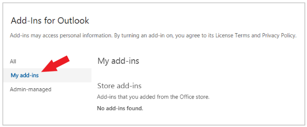
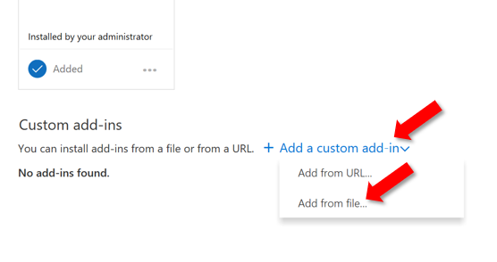
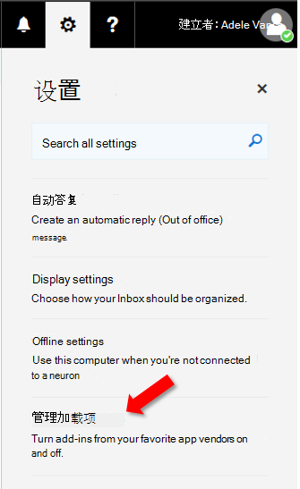
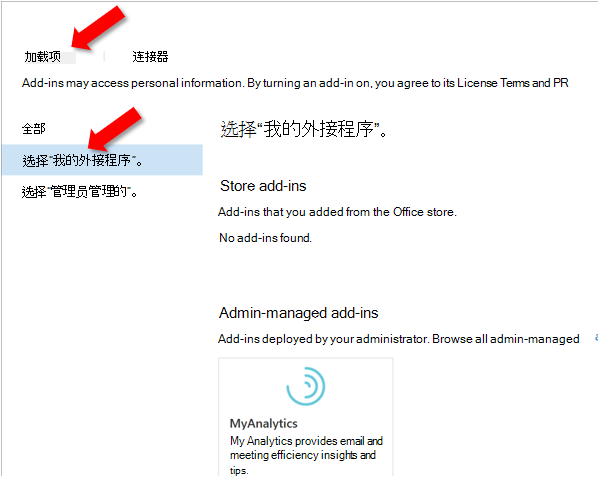

# 旁加载 Outlook 外接程序进行测试

可以使用旁加载安装 Outlook 外接程序进行测试，而无需首先将其置于外接程序目录中。

> [!IMPORTANT]
> 如果您的 Outlook 外接程序支持移动，请按照本文中针对 web、Windows 或 Mac 上的 Outlook 客户端的说明旁加载清单，然后按照 Outlook [Mobile](outlook-mobile-addins.md#testing-your-add-ins-on-mobile) 外接程序一文的移动外接程序部分中的指导进行操作。

## 自动旁加载

如果使用适用于 Office 加载项的 [Yeoman](../develop/yeoman-generator-overview.md) 生成器创建了 Outlook 加载项，则最好通过 Windows 上的命令行进行旁加载。 这将利用我们的工具和通过一个命令跨所有受支持的设备进行旁加载。

1. On Windows， open a command prompt and navigate to the root directory of your Yeoman generated add-in project. 运行命令 `npm start`。

1. 你的Outlook加载项将自动旁加载Outlook桌面计算机上。 你将看到一个对话框，说明尝试旁加载外接程序，列出清单文件的名称和位置。 选择 **"** 确定"，这将注册清单。

    > [!IMPORTANT]
    > 如果清单包含错误或清单路径无效，您将收到错误消息。

1. 如果清单中不包含任何错误且路径有效，外接程序现在将旁加载，并且可在桌面和 Outlook 网页版。 它还将安装在所有受支持的设备上。

## 手动旁加载

尽管我们强烈建议通过命令行自动旁加载，如上一节所述，但您也可以基于 Outlook 客户端手动旁加载 Outlook 外接程序。

### Outlook 网页版

加载项旁加载过程取决于Outlook 网页版是使用新版本还是经典版本。

- 如果邮箱工具栏类似于下图，请参阅[在全新 Outlook 网页版中旁加载外接程序](#new-outlook-on-the-web)。

    

- 如果邮箱工具栏类似于下图，请参阅[在经典 Outlook 网页版中旁加载外接程序](#classic-outlook-on-the-web)。

    

> [!NOTE]
> 如果你的组织在邮箱工具栏中添加了自己的徽标，则你看到的界面可能会与前面的图像略有不同。

### 新Outlook 网页版

1. 转到 [Outlook 网页版](https://outlook.office.com)。

1. 创建新邮件。

1. 从新邮件的底部选择 **...**，然后从出现的菜单中选择“**获取外接程序**”。

    

1. 在“**Outlook 外接程序**”对话框中，选择“**我的外接程序**”。

    

1. 在对话框底部找到“**自定义外接程序**”部分。 选择“**添加自定义外接程序**”链接，然后选择“**从文件添加**”。

    

1. 找到您的自定义外接程序清单文件并进行安装。在安装过程中接受所有提示。

### 经典Outlook 网页版

1. 转到 [Outlook 网页版](https://outlook.office.com)。

1. 选择右上部分的齿轮图标，然后选择“**管理外接程序**”。

    

1. 在“管理加载项”页中，选择“加载项”，然后选择“我的加载项”。

    

1. 在对话框底部找到“**自定义外接程序**”部分。 选择“**添加自定义外接程序**”链接，然后选择“**从文件添加**”。

    

1. 找到您的自定义外接程序清单文件并进行安装。在安装过程中接受所有提示。

### Outlook桌面

### Outlook 2016或更高版本

1. 在 Outlook 2016 或 Mac 上打开 Windows 或更高版本。

1. 选择功能区上的“**获取外接程序**”按钮。

    

    > [!IMPORTANT]
    > 如果在加载项版本中看不到"获取加载项"按钮，Outlook：
    >
    > - **功能** 区上的"存储"按钮（如果可用）。
    >
    >   或
    >
    > - **"** 文件"菜单 **，然后选择"** 信息"选项卡上的"管理外接程序"按钮，以打开"加载项"Outlook 网页版。 有关 Web 体验的更多内容，请参阅上一部分在加载项中[旁加载Outlook 网页版](#outlook-on-the-web)。

1. 如果对话框顶部附近有选项卡，请确保已选中" **加载项** "选项卡。 选择 **"我的外接程序"**。

    

1. 在对话框底部找到“自定义加载项”部分。 选择“添加自定义加载项”链接，然后选择“从文件添加”。

    

1. 找到您的自定义外接程序清单文件并进行安装。在安装过程中接受所有提示。

### Outlook 2013

1. 在 Outlook 2013 上Windows。

1. 选择 **"文件**"菜单，然后选择"信息"选项卡上的"管理外接程序"按钮。Outlook浏览器中打开 Web 版本。

1. 按照根据加载项版本在加载项Outlook 网页版旁加载Outlook 网页版。

## 删除旁加载的外接程序

在所有版本的 Outlook 中，删除旁加载加载项的关键是列出已安装加载项的"我的加载项"对话框。选择外接程序 (`...`) 省略号，然后选择"删除 **"**。

若要 **导航到 Outlook** 客户端的"我的外接程序"对话框，请使用本文前面部分中列出的用于手动旁加载的最后步骤。

若要从 Outlook 中删除旁加载的外接程序，请使用本文前面介绍的步骤在列出已安装外接程序的对话框的"自定义外接程序"部分查找外接程序。选择外接程序 (`...`) 省略号，然后选择"删除"以删除该特定外接程序。 关闭该对话框。

## 另请参阅

- [适用于 Outlook Mobile 的加载项](outlook-mobile-addins.md)