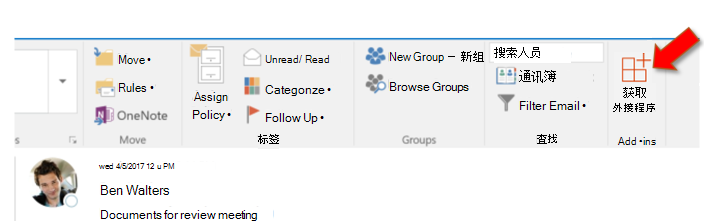

# 旁加载 Outlook 外接程序进行测试Sideload Outlook add-ins for testing

可以使用旁加载安装 Outlook 外接程序进行测试，而无需首先将其置于外接程序目录中。You can use sideloading to install an Outlook add-in for testing without having to first put it in an add-in catalog.

## 在 Outlook 网页版中旁加载外接程序Sideload an add-in in Outlook on the web

在 web 上的 Outlook 中旁加载外接程序的过程取决于您使用的是新版本还是经典版本。The process for sideloading an add-in in Outlook on the web depends upon whether you are using the new or classic version.

- 如果邮箱工具栏类似于下图，请参阅[在全新 Outlook 网页版中旁加载外接程序](#sideload-an-add-in-in-the-new-outlook-on-the-web)。If your mailbox toolbar looks like the following image, see [Sideload an add-in in the new Outlook on the web](#sideload-an-add-in-in-the-new-outlook-on-the-web).

    

- 如果邮箱工具栏类似于下图，请参阅[在经典 Outlook 网页版中旁加载外接程序](#sideload-an-add-in-in-classic-outlook-on-the-web)。If your mailbox toolbar looks like the following image, see [Sideload an add-in in classic Outlook on the web](#sideload-an-add-in-in-classic-outlook-on-the-web).

    

> [!NOTE]
> 如果你的组织在邮箱工具栏中添加了自己的徽标，则你看到的界面可能会与前面的图像略有不同。If your organization has included its logo in the mailbox toolbar, you might see something slightly different than shown in the preceding images.

### 在全新 Outlook 网页版中旁加载外接程序Sideload an add-in in the new Outlook on the web

1. 转到 [Office 365 中的 Outlook](https://outlook.office.com)。Go to [Outlook in Office 365](https://outlook.office.com).

1. 在 Outlook 网页版中，创建新邮件。In Outlook on the web, create a new message.

1. 从新邮件的底部选择 **...**，然后从出现的菜单中选择“**获取外接程序**”。Choose **...** from the bottom of the new message and then select **Get Add-ins** from the menu that appears.

    

1. 在“**Outlook 外接程序**”对话框中，选择“**我的外接程序**”。In the **Add-Ins for Outlook** dialog box, select **My add-ins**.

    

1. 在对话框底部找到“**自定义外接程序**”部分。Locate the **Custom add-ins** section at the bottom of the dialog box. 选择“**添加自定义外接程序**”链接，然后选择“**从文件添加**”。Select the **Add a custom add-in** link, and then select **Add from file**.

    

1. 找到自定义外接程序的清单文件并进行安装。在安装过程中接受所有提示。Locate the manifest file for your custom add-in and install it. Accept all prompts during the installation.

### 在经典 Outlook 网页版中旁加载外接程序Sideload an add-in in classic Outlook on the web

1. 转到 [Office 365 中的 Outlook](https://outlook.office.com)。Go to [Outlook in Office 365](https://outlook.office.com).

1. 选择右上部分的齿轮图标，然后选择“**管理外接程序**”。Choose the gear icon in the top-right section of the toolbar and select **Manage add-ins**.

    

1. 在“管理加载项”页中，选择“加载项”，然后选择“我的加载项”。On the **Manage add-ins** page, select **Add-Ins**, and then select **My add-ins**.

    

1. 在对话框底部找到“**自定义外接程序**”部分。Locate the **Custom add-ins** section at the bottom of the dialog box. 选择“**添加自定义外接程序**”链接，然后选择“**从文件添加**”。Select the **Add a custom add-in** link, and then select **Add from file**.

    

1. 找到您的自定义外接程序清单文件并进行安装。在安装过程中接受所有提示。Locate the manifest file for your custom add-in and install it. Accept all prompts during the installation.

## 在 Outlook 桌面版中旁加载外接程序Sideload an add-in in Outlook on the desktop

### Outlook 2016 或更高版本Outlook 2016 or later

1. 在 Windows 或 Mac 上打开 Outlook 2016 或更高版本。Open Outlook 2016 or later on Windows or Mac.

1. 选择功能区上的“**获取外接程序**”按钮。Select the **Get Add-ins** button on the ribbon.

    

    > [!IMPORTANT]
    > 如果您在您的 Outlook 版本中看不到 " **获取外接程序** " 按钮，请选择：If you don't see the **Get Add-ins** button in your version of Outlook, select:
    >
    > - 功能区上的 "**存储**" 按钮（如果有）。**Store** button on the ribbon, if available.
    >
    >   OROR
    >
    > - **文件**"菜单上，选择"**信息**"选项卡上的"**管理外接程序**"按钮，以在 Outlook 网页中打开"**外** 接程序 "对话框。**File** menu, then select the **Manage Add-ins** button on the **Info** tab to open the **Add-ins** dialog in Outlook on the web. 您可以在 [Outlook 网页](#sideload-an-add-in-in-outlook-on-the-web)版本的旁加载中查看有关上一节中的 web 体验的详细信息。You can see more about the web experience in the previous section [Sideload an add-in in Outlook on the web](#sideload-an-add-in-in-outlook-on-the-web).

1. 如果对话框顶部附近有选项卡，请确保选择了 " **外接程序** " 选项卡。If there are tabs near the top of the dialog, ensure that the **Add-ins** tab is selected. 选择 **"我的外接程序"**。Choose **My add-ins**.

    

1. 在对话框底部找到“自定义加载项”部分。Locate the **Custom add-ins** section at the bottom of the dialog. 选择“添加自定义加载项”链接，然后选择“从文件添加”。Select the **Add a custom add-in** link, and then select **Add from file**.

    

1. 找到您的自定义外接程序清单文件并进行安装。在安装过程中接受所有提示。Locate the manifest file for your custom add-in and install it. Accept all prompts during the installation.

### Outlook 2013Outlook 2013

1. 在 Windows 上打开 Outlook 2013。Open Outlook 2013 on Windows.

1. 选择 "**文件**" 菜单，然后选择 "**信息**" 选项卡上的 "**管理外接程序**" 按钮。Outlook 将在浏览器中打开 web 版本。Select the **File** menu, then select the **Manage Add-ins** button on the **Info** tab. Outlook will open the web version in a browser.

1. 按照您的 Outlook 网页版上的 [旁加载中的加载](#sideload-an-add-in-in-outlook-on-the-web) 项中的步骤，在 web 上的 outlook 的 "web" 部分中执行。Follow the steps in the [Sideload an add-in in Outlook on the web](#sideload-an-add-in-in-outlook-on-the-web) section according to your version of Outlook on the web.

## 删除旁加载加载项Remove a sideloaded add-in

若要从 Outlook 中删除旁加载外接程序，请使用本文中前面所述的步骤，在列出已安装加载项的对话框的 " **自定义外接程序** " 部分中查找该外接程序。选择外接程序的省略号 (`...`) ，然后选择 " **删除** " 以删除该特定外接程序。To remove a sideloaded add-in from Outlook, use the steps previously described in this article to find the add-in in the **Custom add-ins** section of the dialog box that lists your installed add-ins. Choose the ellipsis (`...`) for the the add-in and then choose **Remove** to remove that specific add-in.