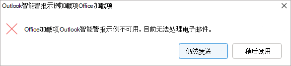
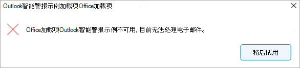
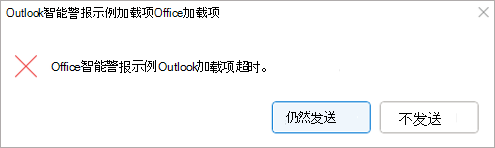

# <a name="use-smart-alerts-and-the-onmessagesend-and-onappointmentsend-events-in-your-outlook-add-in"></a>在 Outlook 外接程序中使用智能警报以及 OnMessageSend 和 OnAppointmentSend 事件

这些 `OnMessageSend` 事件和 `OnAppointmentSend` 事件利用智能警报，在用户选择 **“在其** Outlook 消息或约会中发送”后，可以运行逻辑。 通过事件处理程序，你可以为用户提供在发送电子邮件和会议邀请之前改进电子邮件和会议邀请的机会。

以下演练使用该 `OnMessageSend` 事件。 本演练结束时，你将拥有一个在发送消息时运行的加载项，并检查用户是否忘记添加他们在电子邮件中提到的文档或图片。

> [!NOTE]
> 要求`OnMessageSend`[集 1.12](/javascript/api/requirement-sets/outlook/requirement-set-1.12/outlook-requirement-set-1.12) 中引入了这些事件和`OnAppointmentSend`事件。 请查看支持此要求集的[客户端和平台](/javascript/api/requirement-sets/outlook/outlook-api-requirement-sets)。

## <a name="prerequisites"></a>先决条件

该 `OnMessageSend` 事件可通过基于事件的激活功能获得。 若要了解如何将外接程序配置为使用此功能，请使用其他可用事件、调试外接程序等，请参阅 [配置 Outlook 外接程序以进行基于事件的激活](autolaunch.md)。

## <a name="set-up-your-environment"></a>设置环境

完成 [Outlook 快速入](../quickstarts/outlook-quickstart.md?tabs=yeomangenerator)门，使用 Office 外接程序的 [Yeoman 生成器](../develop/yeoman-generator-overview.md)创建加载项项目。

> [!NOTE]
> 如果要使用 [Office 加载项的 Teams 清单 (预览)](../develop/json-manifest-overview.md)，请在 Outlook 快速入门中完成备用快速入门，其中 [包含 Teams 清单 (预览)](../quickstarts/outlook-quickstart-json-manifest.md)，但请在 **“试用”** 部分后跳过所有部分。

## <a name="configure-the-manifest"></a>配置清单

若要配置清单，请选择所使用的清单类型的选项卡。

# <a name="xml-manifest"></a>[XML 清单](#tab/xmlmanifest)

1. 在代码编辑器中，打开快速启动项目。

1. 打开位于项目根 **目录的manifest.xml** 文件。

1. 选择整个 **\<VersionOverrides\>** 节点 (包括打开和关闭标记) 并将其替换为以下 XML，然后保存所做的更改。

```XML
<VersionOverrides xmlns="http://schemas.microsoft.com/office/mailappversionoverrides" xsi:type="VersionOverridesV1_0">
  <VersionOverrides xmlns="http://schemas.microsoft.com/office/mailappversionoverrides/1.1" xsi:type="VersionOverridesV1_1">
    <Requirements>
      <bt:Sets DefaultMinVersion="1.12">
        <bt:Set Name="Mailbox" />
      </bt:Sets>
    </Requirements>
    <Hosts>
      <Host xsi:type="MailHost">
        <!-- Event-based activation happens in a lightweight runtime.-->
        <Runtimes>
          <!-- HTML file including reference to or inline JavaScript event handlers.
               This is used by Outlook on the web and on the new Mac UI. -->
          <Runtime resid="WebViewRuntime.Url">
            <!-- JavaScript file containing event handlers. This is used by Outlook on Windows. -->
            <Override type="javascript" resid="JSRuntime.Url"/>
          </Runtime>
        </Runtimes>
        <DesktopFormFactor>
          <FunctionFile resid="Commands.Url" />
          <ExtensionPoint xsi:type="MessageReadCommandSurface">
            <OfficeTab id="TabDefault">
              <Group id="msgReadGroup">
                <Label resid="GroupLabel" />
                <Control xsi:type="Button" id="msgReadOpenPaneButton">
                  <Label resid="TaskpaneButton.Label" />
                  <Supertip>
                    <Title resid="TaskpaneButton.Label" />
                    <Description resid="TaskpaneButton.Tooltip" />
                  </Supertip>
                  <Icon>
                    <bt:Image size="16" resid="Icon.16x16" />
                    <bt:Image size="32" resid="Icon.32x32" />
                    <bt:Image size="80" resid="Icon.80x80" />
                  </Icon>
                  <Action xsi:type="ShowTaskpane">
                    <SourceLocation resid="Taskpane.Url" />
                  </Action>
                </Control>
                <Control xsi:type="Button" id="ActionButton">
                  <Label resid="ActionButton.Label"/>
                  <Supertip>
                    <Title resid="ActionButton.Label"/>
                    <Description resid="ActionButton.Tooltip"/>
                  </Supertip>
                  <Icon>
                    <bt:Image size="16" resid="Icon.16x16"/>
                    <bt:Image size="32" resid="Icon.32x32"/>
                    <bt:Image size="80" resid="Icon.80x80"/>
                  </Icon>
                  <Action xsi:type="ExecuteFunction">
                    <FunctionName>action</FunctionName>
                  </Action>
                </Control>
              </Group>
            </OfficeTab>
          </ExtensionPoint>

          <!-- Can configure other command surface extension points for add-in command support. -->

          <!-- Enable launching the add-in on the included event. -->
          <ExtensionPoint xsi:type="LaunchEvent">
            <LaunchEvents>
              <LaunchEvent Type="OnMessageSend" FunctionName="onMessageSendHandler" SendMode="PromptUser" />
            </LaunchEvents>
            <!-- Identifies the runtime to be used (also referenced by the Runtime element). -->
            <SourceLocation resid="WebViewRuntime.Url"/>
          </ExtensionPoint>
        </DesktopFormFactor>
      </Host>
    </Hosts>
    <Resources>
      <bt:Images>
        <bt:Image id="Icon.16x16" DefaultValue="https://localhost:3000/assets/icon-16.png"/>
        <bt:Image id="Icon.32x32" DefaultValue="https://localhost:3000/assets/icon-32.png"/>
        <bt:Image id="Icon.80x80" DefaultValue="https://localhost:3000/assets/icon-80.png"/>
      </bt:Images>
      <bt:Urls>
        <bt:Url id="Commands.Url" DefaultValue="https://localhost:3000/commands.html" />
        <bt:Url id="Taskpane.Url" DefaultValue="https://localhost:3000/taskpane.html" />
        <bt:Url id="WebViewRuntime.Url" DefaultValue="https://localhost:3000/commands.html" />
        <!-- Entry needed for Outlook on Windows. -->
        <bt:Url id="JSRuntime.Url" DefaultValue="https://localhost:3000/launchevent.js" />
      </bt:Urls>
      <bt:ShortStrings>
        <bt:String id="GroupLabel" DefaultValue="Contoso Add-in"/>
        <bt:String id="TaskpaneButton.Label" DefaultValue="Show Taskpane"/>
        <bt:String id="ActionButton.Label" DefaultValue="Perform an action"/>
      </bt:ShortStrings>
      <bt:LongStrings>
        <bt:String id="TaskpaneButton.Tooltip" DefaultValue="Opens a pane displaying all available properties."/>
        <bt:String id="ActionButton.Tooltip" DefaultValue="Perform an action when clicked."/>
      </bt:LongStrings>
    </Resources>
  </VersionOverrides>
</VersionOverrides>
```

> [!TIP]
>
> - 有关可用的 `OnMessageSend` **SendMode** 选项和`OnAppointmentSend`事件，请参阅 [“可用 SendMode”选项](/javascript/api/manifest/launchevent#available-sendmode-options)。
> - 若要详细了解 Outlook 外接程序的清单，请参阅 [Outlook 加载项清单](manifests.md)。

# <a name="teams-manifest-developer-preview"></a>[Teams 清单 (开发人员预览) ](#tab/jsonmanifest)

1. 打开 **manifest.json** 文件。

1. 将以下对象添加到“extensions.runtimes”数组。 关于此标记，请注意以下几点：

   - 邮箱要求集的“minVersion”设置为“1.12”，因为 [受支持的事件表](autolaunch.md#supported-events) 指定这是支持 `OnMessageSend` 事件的要求集的最低版本。
   - 运行时的“id”设置为描述性名称“autorun_runtime”。
   - “code”属性具有一个子“page”属性，该属性设置为 HTML 文件和一个设置为 JavaScript 文件的子“script”属性。 你将在后续步骤中创建或编辑这些文件。 Office 根据平台使用其中一个值或另一个值。
       - Windows 上的 Office 在仅限 JavaScript 的运行时中执行事件处理程序，该运行时直接加载 JavaScript 文件。
       - Office on Mac 和 Web 在加载 HTML 文件的浏览器运行时中执行处理程序。 该文件又包含 `<script>` 加载 JavaScript 文件的标记。
     有关详细信息，请参阅 [Office 加载项中的运行时](../testing/runtimes.md)。
   - “lifetime”属性设置为“short”，这意味着运行时在事件触发时启动，并在处理程序完成时关闭。  (在某些情况下，运行时会在处理程序完成之前关闭。 请参阅 [Office 加载项.) 中的运行时](../testing/runtimes.md)
   - 有一个操作可为 `OnMessageSend` 事件运行处理程序。 你将在后面的步骤中创建处理程序函数。

    ```json
     {
        "requirements": {
            "capabilities": [
                {
                    "name": "Mailbox",
                    "minVersion": "1.12"
                }
            ]
        },
        "id": "autorun_runtime",
        "type": "general",
        "code": {
            "page": "https://localhost:3000/commands.html",
            "script": "https://localhost:3000/launchevent.js"
        },
        "lifetime": "short",
        "actions": [
            {
                "id": "onMessageSendHandler",
                "type": "executeFunction",
                "displayName": "onMessageSendHandler"
            }
        ]
    }
    ```

1. 将以下“autoRunEvents”数组添加为“扩展”数组中对象的属性。

    ```json
    "autoRunEvents": [
    
    ]
    ```

1. 将以下对象添加到“autoRunEvents”数组。 关于此代码，请注意以下几点：

   - 事件对象使用事件的 Teams 清单名称“messageSending”为事件 (分配处理程序 `OnMessageSend` 函数，如 [支持的事件表](autolaunch.md#supported-events)) 中所述。 “actionId”中提供的函数名称必须与前面步骤中“actions”数组中对象的“id”属性中使用的名称匹配。
   - “sendMode”选项设置为“promptUser”。 这意味着，如果消息不符合加载项设置的发送条件，系统会提示用户取消发送或发送。

    ```json
      {
          "requirements": {
              "capabilities": [
                  {
                      "name": "Mailbox",
                      "minVersion": "1.12"
                  }
              ],
              "scopes": [
                  "mail"
              ]
          },
          "events": [
            {
                "type": "messageSending",
                "actionId": "onMessageSendHandler",
                "options": {
                    "sendMode": "promptUser"
                }
            }
          ]
      }
    ```

---

## <a name="implement-event-handling"></a>实现事件处理

必须为所选事件实现处理。

在此方案中，你将添加发送消息的处理。 加载项将检查消息中的某些关键字。 如果找到这些关键字中的任何一个，它将检查是否有任何附件。 如果没有附件，外接程序将建议用户添加可能缺失的附件。

1. 在同一快速入门项目中，在 **./src** 目录下创建名为 **launchevent** 的新文件夹。

1. 在 **./src/launchevent** 文件夹中，创建名为 **launchevent.js** 的新文件。

1. 在代码编辑器中打开文件 **./src/launchevent/launchevent.js** ，并添加以下 JavaScript 代码。

    ```js
    /*
    * Copyright (c) Microsoft Corporation. All rights reserved. Licensed under the MIT license.
    * See LICENSE in the project root for license information.
    */

    function onMessageSendHandler(event) {
      Office.context.mailbox.item.body.getAsync(
        "text",
        { asyncContext: event },
        getBodyCallback
      );
    }

    function getBodyCallback(asyncResult){
      let event = asyncResult.asyncContext;
      let body = "";
      if (asyncResult.status !== Office.AsyncResultStatus.Failed && asyncResult.value !== undefined) {
        body = asyncResult.value;
      } else {
        let message = "Failed to get body text";
        console.error(message);
        event.completed({ allowEvent: false, errorMessage: message });
        return;
      }

      let matches = hasMatches(body);
      if (matches) {
        Office.context.mailbox.item.getAttachmentsAsync(
          { asyncContext: event },
          getAttachmentsCallback);
      } else {
        event.completed({ allowEvent: true });
      }
    }

    function hasMatches(body) {
      if (body == null || body == "") {
        return false;
      }

      const arrayOfTerms = ["send", "picture", "document", "attachment"];
      for (let index = 0; index < arrayOfTerms.length; index++) {
        const term = arrayOfTerms[index].trim();
        const regex = RegExp(term, 'i');
        if (regex.test(body)) {
          return true;
        }
      }

      return false;
    }

    function getAttachmentsCallback(asyncResult) {
      let event = asyncResult.asyncContext;
      if (asyncResult.value.length > 0) {
        for (let i = 0; i < asyncResult.value.length; i++) {
          if (asyncResult.value[i].isInline == false) {
            event.completed({ allowEvent: true });
            return;
          }
        }

        event.completed({ allowEvent: false, errorMessage: "Looks like you forgot to include an attachment?" });
      } else {
        event.completed({ allowEvent: false, errorMessage: "Looks like you're forgetting to include an attachment?" });
      }
    }

    // 1st parameter: FunctionName of LaunchEvent in the manifest; 2nd parameter: Its implementation in this .js file.
    Office.actions.associate("onMessageSendHandler", onMessageSendHandler);
    ```

## <a name="update-the-commands-html-file"></a>更新命令 HTML 文件

1. 在 **./src/commands** 文件夹中，打开 **commands.html**。

1. 紧接在结束 **头** 标记 () `</head>` 之前，为事件处理 JavaScript 代码添加脚本条目。

   ```js
   <script type="text/javascript" src="../launchevent/launchevent.js"></script> 
   ```

1. 保存所做的更改。

## <a name="update-webpack-config-settings"></a>更新 webpack 配置设置

1. 打开在项目的根目录中找到的 **webpack.config.js** 文件并完成以下步骤。

1. `plugins`在对象中`config`找到数组，并将此新对象添加到数组的开头。

    ```js
    new CopyWebpackPlugin({
      patterns: [
        {
          from: "./src/launchevent/launchevent.js",
          to: "launchevent.js",
        },
      ],
    }),
    ```

1. 保存所做的更改。

## <a name="try-it-out"></a>试用

1. 在项目的根目录中运行以下命令。 运行 `npm start`时，如果本地 Web 服务器尚未运行) 并且加载项将旁加载，则会启动 (。

    ```command&nbsp;line
    npm run build
    ```

    ```command&nbsp;line
    npm start
    ```

    > [!NOTE]
    > 如果加载项未自动旁加载，请按照 [Sideload Outlook 加载项中的说明进行测试](../outlook/sideload-outlook-add-ins-for-testing.md#sideload-manually) ，以便在 Outlook 中手动旁加载加载项。

1. 在 Outlook on Windows 中，创建新消息并设置主题。 在身体里，添加文本，如“嘿，看看这张我的狗的照片！
1. 发送消息. 应该会弹出一个对话框，其中包含添加附件的建议。

    

1. 添加附件，然后再次发送消息。 这次不应有警报。

## <a name="deploy-to-users"></a>部署到用户

与其他基于事件的外接程序类似，使用智能警报功能的外接程序必须由组织的管理员部署。 有关如何通过Microsoft 365 管理中心部署外接程序的指南，请参阅“配置 Outlook 外接程序以 [进行基于事件的激活](autolaunch.md#deploy-to-users)”中的 **“部署到用户**”部分。

> [!IMPORTANT]
> 仅当清单的 [SendMode 属性](/javascript/api/manifest/launchevent#available-sendmode-options)设置为或`PromptUser`选项时，使用智能警报功能的外接程序才能发布到 `SoftBlock` AppSource。 如果外接程序的 **SendMode** 属性设置为 `Block`，则只能由组织的管理员部署，因为它将无法通过 AppSource 验证。 若要详细了解如何将基于事件的外接程序发布到 AppSource，请参阅 [基于事件的 Outlook 外接程序的 AppSource 列表选项](autolaunch-store-options.md)。

## <a name="smart-alerts-feature-behavior-and-scenarios"></a>智能警报功能行为和方案

有关 **SendMode** 选项的说明以及何时使用它们的建议，请参阅 [“可用 SendMode”选项](/javascript/api/manifest/launchevent#available-sendmode-options)。 下面介绍了某些方案的功能行为。

### <a name="add-in-is-unavailable"></a>加载项不可用

例如，如果在发送消息或约会时加载项不可用 (，则会发生错误，阻止加载项加载) ，则会向用户发出警报。 用户可用的选项因应用于加载项的 **SendMode** 选项而异。

如果使用此 `PromptUser` 或 `SoftBlock` 选项，则用户可以选择 **“发送还是** 发送”以在不检查外接程序的情况下发送项目，或者在加载项再次可用时 **，请稍后尝试** 允许外接程序检查该项目。



如果使用此 `Block` 选项，则在加载项可用之前，用户无法发送该项。  (如果加载项使用 Teams 清单 (预览版) .) ，则 `Block` 不支持此选项



### <a name="long-running-add-in-operations"></a>长时间运行的加载项操作

如果加载项运行时间超过 5 秒，但不到 5 分钟，则会提醒用户加载项处理消息或约会所需的时间比预期要长。

如果使用此 `PromptUser` 选项，则用户可以选择 **“无论如何发送** ”以发送项目，而无需加载项完成其检查。 或者，用户可以选择 **“不发送** ”来阻止加载项处理。


但是，如果使用此 `SoftBlock` 或 `Block` 选项，则在加载项完成处理之前，用户将无法发送该项目。


`OnMessageSend` 加 `OnAppointmentSend` 载项应为短运行和轻型。 若要避免长时间运行的操作对话框，请使用其他事件在激活或`OnAppointmentSend`事件之前`OnMessageSend`处理条件检查。 例如，如果要求用户对每条消息或约会的附件进行加密，请考虑使用 `OnMessageAttachmentsChanged` 或 `OnAppointmentAttachmentsChanged` 事件执行检查。

### <a name="add-in-timed-out"></a>加载项超时

如果外接程序运行 5 分钟或更长时间，则会超时。如果使用此 `PromptUser` 选项，则用户可以选择 **“无论如何发送** ”以发送项目，而无需加载项完成其检查。 或者，用户可以选择 **“不发送**”。



如果使用该 `SoftBlock` 或 `Block` 选项，则在加载项完成检查之前，用户无法发送该项目。 用户必须再次尝试发送项以重新激活加载项。


## <a name="limitations"></a>限制

`OnMessageSend`由于基于事件的激活功能支持这些事件和`OnAppointmentSend`事件，因此，由于这些事件而激活的外接程序也适用相同的功能限制。 有关这些限制的说明，请参阅 [基于事件的激活行为和限制](autolaunch.md#event-based-activation-behavior-and-limitations)。

除了这些约束之外，清单中每个实例和`OnAppointmentSend`事件只能声明一个`OnMessageSend`实例。 如果需要多个或`OnAppointmentSend`多个`OnMessageSend`事件，则必须在单独的加载项中声明每个事件。

虽然可以使用 event.completed 方法 [的 errorMessage 属性](/javascript/api/office/office.addincommands.eventcompletedoptions) 更改“智能警报”对话框消息以适应外接程序方案，但无法自定义以下内容。

- 对话框的标题栏。 加载项的名称始终显示在该处。
- 消息的格式。 例如，不能更改文本的字号和颜色，也不能插入项目符号列表。
- 对话框选项。 例如，“ **无论如何发送** ”和 **“不发送** ”选项是固定的，并且取决于所选 [的 SendMode 选项](/javascript/api/manifest/launchevent#available-sendmode-options) 。
- 基于事件的激活处理和进度信息对话框。 例如，无法更改超时和长时间运行的操作对话框中显示的文本和选项。

## <a name="differences-between-smart-alerts-and-the-on-send-feature"></a>智能警报与发送功能之间的差异

虽然智能警报和 [随发送功能](outlook-on-send-addins.md) 为用户提供了在发送邮件和会议邀请之前改进其消息和会议邀请的机会，但智能警报是一项较新的功能，可让你更灵活地提示用户采取进一步操作。 下表概述了两个功能之间的主要差异。

|属性|智能警报|发送时|
|-----|-----|-----|
|**支持的最低要求集**|[邮箱 1.12](/javascript/api/requirement-sets/outlook/requirement-set-1.12/outlook-requirement-set-1.12)|[Mailbox 1.8](/javascript/api/requirement-sets/outlook/requirement-set-1.8/outlook-requirement-set-1.8)|
|**支持的 Outlook 客户端**|-窗户<br>- Web 浏览器 (新式 UI) |-窗户<br>- Web 浏览器 (经典和新式 UI) <br>- Mac (经典和新的 UI)  |
|**支持的事件**|**XML 清单**<br>- `OnMessageSend`<br>- `OnAppointmentSend`<br><br>**Teams 清单 (预览)**<br>- “messageSending”<br>- “appointmentSending”|**XML 清单**<br>- `ItemSend`<br><br>**Teams 清单 (预览)**<br>- 不支持|
|**清单扩展属性**|**XML 清单**<br>- `LaunchEvent`<br><br>**Teams 清单 (预览)**<br>- “autoRunEvents”|**XML 清单**<br>- `Events`<br><br>**Teams 清单 (预览)**<br>- 不支持|
|**支持的发送模式选项**|- 提示用户<br>- 软块<br>- 如果加载项使用 Teams 清单 (预览版) ) ，则不支持阻止 (|阻止|
|**加载项中支持的最大事件数**|一个 `OnMessageSend` 和一个 `OnAppointmentSend` 事件。|一个 `ItemSend` 事件。|
|**加载项部署**|如果加载项的属性设置为或`PromptUser`选项，`SoftBlock`则可将其`SendMode`发布到 AppSource。 否则，加载项必须由组织的管理员部署。|加载项无法发布到 AppSource。 它必须由组织的管理员部署。|
|**加载项安装的其他配置**|将清单上传到Microsoft 365 管理中心后，无需其他配置。|根据组织的合规性标准和使用的 Outlook 客户端，必须将某些邮箱策略配置为安装外接程序。|

## <a name="see-also"></a>另请参阅

- [Outlook 加载项清单](manifests.md)
- [配置 Outlook 外接程序以进行基于事件的激活](autolaunch.md)
- [如何调试基于事件的加载项](debug-autolaunch.md)
- [基于事件的 Outlook 外接程序的 AppSource 列表选项](autolaunch-store-options.md)
- [Office 加载项代码示例：使用 Outlook 智能警报](https://github.com/OfficeDev/Office-Add-in-samples/tree/main/Samples/outlook-check-item-categories)
