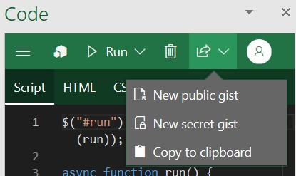
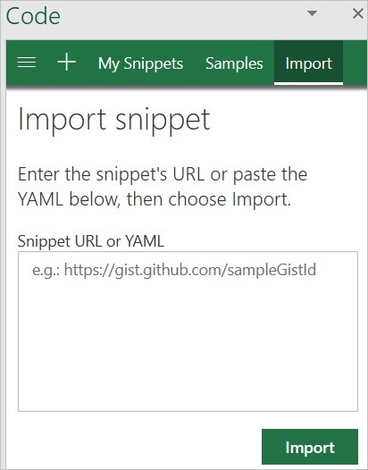

# 使用脚本实验室浏览 Office JavaScript API

通过 Office 应用商店免费提供的[脚本实验室外接程序](https://store.office.com/app.aspx?assetid=WA104380862), 您可以在使用 office 程序 (如 Excel 或 Word) 时浏览 OFFICE JavaScript API。 当您在外接程序中原型和验证所需功能时, 脚本实验室是一个方便的工具, 可将其添加到开发工具包中。

## 什么是脚本实验室？

脚本实验室是任何希望了解如何使用 Excel、Word 或 PowerPoint 中的 Office JavaScript API 开发 Office 外接程序的工具。 它提供了智能感知功能, 以便您可以查看在摩纳哥框架 (由 Visual Studio Code 使用的相同框架) 中构建的可用功能。 通过脚本实验室, 您可以访问示例库以快速试用功能, 也可以将示例用作您自己的代码的起始点。 您甚至可以使用脚本实验室尝试预览 Api。

我到目前为止听起来正常吗？ 查看此一分钟视频可查看脚本实验室的实际效果。

## 关键功能

脚本实验室提供了许多功能, 可帮助您探索 Office JavaScript API 和原型加载项功能。

### 浏览示例

使用内置示例代码段集合快速入门, 其中展示了如何使用 API 完成特定任务。 您可以运行示例来即时查看任务窗格或文档中的结果, 检查示例以了解 API 的工作原理, 甚至将示例代码段用作您自己的外接程序的原型功能的基础。

### 代码和样式

除了调用 Office JS API 的 JavaScript 或 TypeScript 代码外, 每个代码段还包含用于定义任务窗格外观的任务窗格和 CSS 内容的 HTML 标记。 您可以自定义 HTML 标记和 CSS 以在为自己的外接程序设置任务窗格设计原型时体验元素的放置和样式。

> [!TIP]
> 若要在代码段中调用预览 Api, 您需要更新代码段的库以使用 beta CDN (`https://appsforoffice.microsoft.com/lib/beta/hosted/office.js`) 和预览类型定义。 `@types/office-js-preview` 此外, 某些预览 Api 仅当你注册[Office 预览体验计划](https://products.office.com/office-insider)并运行内部版本的 office 时才可访问。

### 保存和共享代码段

默认情况下, 在脚本实验室中打开的代码段将保存到您的浏览器缓存中。 若要永久保存代码段, 可以将其导出到[GitHub gist](https://gist.github.com)。 创建一个机密 gist 以仅用于您自己使用的代码段, 或者创建共享的 gist (如果您计划与其他人共享它)。

### 导入代码段

您可以通过指定存储代码段 YAML 的公共[GitHub gist](https://gist.github.com)的 URL 或在代码段的完整 YAML 中粘贴, 将代码段导入脚本实验室。 如果其他人已通过将代码段发布到 GitHub gist 或提供代码段的 YAML, 则此功能可能对您共享其代码段的方案有用。

## 支持的客户端

以下客户端上的 Excel、Word 和 PowerPoint 支持脚本实验室。

- Windows 上的 Office 2013 或更高版本
- Mac 上的 Office 2016 或更高版本
- 网上的 Office

## 后续步骤

欢迎您通过将新代码片段发布到[office js](https://github.com/OfficeDev/office-js-snippets#office-js-snippets)的 GitHub 存储库来扩展脚本实验室中的示例库。

当您准备好创建 Office 加载项时, 请参阅首选 Office 应用程序的[5 分钟快速入门](/office/dev/add-ins/#5-minute-quick-starts)。

## 另请参阅

- [获取脚本实验室](https://store.office.com/app.aspx?assetid=WA104380862)
- [了解有关脚本实验室的详细信息](https://github.com/OfficeDev/script-lab#script-lab-a-microsoft-garage-project)
- [注册开发计划](https://developer.microsoft.com/office/dev-program)
