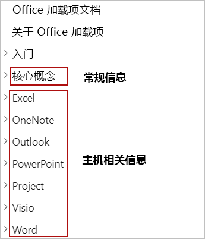

# 构建 Office 加载项Building Office Add-ins

> [!TIP]
> 阅读本文之前，请查看 [Office 加载项平台概述](office-add-ins.md)。Please review [Office Add-ins platform overview](office-add-ins.md) before reading this article.

Office 加载项可扩展 Office 应用程序的 UI 和功能，并与 Office 文档中的内容交互。Office Add-ins extend the UI and functionality of Office applications and interact with content in Office documents. 你将使用熟悉的 Web 技术创建 Office 加载项来扩展 Word、Excel、PowerPoint、OneNote、Project 或 Outlook 并与之交互。You'll use familiar web technologies to create Office Add-ins that extend and interact with Word, Excel, PowerPoint, OneNote, Project, or Outlook. 你构建的加载项可跨多个平台在 Office 中运行，包括 Windows、Mac、iPad 和在浏览器中。The add-ins you build can run in Office across multiple platforms, including Windows, Mac, iPad, and in a browser. 本文简要介绍了如何开发 Office 加载项。This article provides an introduction to developing Office Add-ins.

## 创建 Office 加载项Creating an Office Add-in 

你可通过适用于 Office 加载项的 Yeoman 生成器或 Visual Studio 来创建 Office 加载项。You can create an Office Add-in by using the Yeoman generator for Office Add-ins or Visual Studio.

### 适用于 Office 加载项的 Yeoman 生成器Yeoman generator for Office Add-ins

可用来创建 Node.js Office 加载项项目，而后者可通过 Visual Studio Code 或任何其他编辑器进行管理。The [Yeoman generator for Office Add-ins](https://github.com/officedev/generator-office) can be used to create a Node.js Office Add-in project that can be managed with Visual Studio Code or any other editor. 该生成器可创建适合下述任一应用的 Office 加载项：The generator can create Office Add-ins for any of the following:

- ExcelExcel
- OneNoteOneNote
- OutlookOutlook
- PowerPointPowerPoint
- ProjectProject
- WordWord
- Excel 自定义函数Excel custom functions

你可选择使用 HTML、CSS 和 JavaScript 创建该项目，也可使用 Angular 或 React 进行创建。You can choose to create the project using HTML, CSS and JavaScript, or using Angular or React. 此外，无论选择哪种框架，都可在 JavaScript 和 Typescript 之间进行选择。For whichever framework you choose, you can choose between JavaScript and Typescript as well. 有关使用 Yeoman 生成器创建加载项的详细信息，请参阅[使用 Visual Studio Code 开发 Office 加载项](../develop/develop-add-ins-vscode.md)。For more information about creating add-ins with the Yeoman generator, see [Develop Office Add-ins with Visual Studio Code](../develop/develop-add-ins-vscode.md).

### Visual StudioVisual Studio

Visual Studio 可用于创建适用于 Excel、Outlook、Word 和 PowerPoint 的 Office 加载项。Visual Studio can be used to create Office Add-ins for Excel, Outlook, Word, and PowerPoint. Office 加载项项目是作为 Visual Studio 解决方案的一部分创建的，它使用 HTML、CSS 和 JavaScript。An Office Add-in project gets created as part of a Visual Studio solution and uses HTML, CSS, and JavaScript. 有关使用 Visual Studio 创建加载项的详细信息，请参阅[使用 Visual Studio 开发 Office 加载项](../develop/develop-add-ins-visual-studio.md)。For more information about creating add-ins with Visual Studio, see [Develop Office Add-ins with Visual Studio](../develop/develop-add-ins-visual-studio.md).

[!include[Yeoman vs Visual Studio comparision](../includes/yeoman-generator-recommendation.md)]

## 使用 Script Lab 了解 APIExploring APIs with Script Lab

Script Lab 是一款加载项，在 Excel 或 Word 等 Office 程序中工作时，你可用它来了解 Office JavaScript API 和运行代码片段。Script Lab is an add-in that enables you to explore the Office JavaScript API and run code snippets while you're working in an Office program such as Excel or Word. 该工具通过 [AppSource](https://appsource.microsoft.com/product/office/WA104380862) 免费提供，随附在你的开发工具包中，在你建立希望加载项中拥有的功能原型和验证该功能时非常有用。It's available for free via [AppSource](https://appsource.microsoft.com/product/office/WA104380862) and is a useful tool to include in your development toolkit as you prototype and verify the functionality you want in your add-in. 在 Script Lab 中，你可访问内置示例库以快速试用 API，甚至还可将示例用作你自己的代码的起点。In Script Lab, you can access a library of built-in samples to quickly try out APIs or even use a sample as the starting point for your own code. 

下面时长一分钟的视频展示了 Script Lab 的实际运行情况。The following one-minute video shows Script Lab in action.

有关 Script Lab 的详细信息，请参阅[使用 Script Lab 了解 Office JavaScript API](../overview/explore-with-script-lab.md)。For more information about Script Lab, see [Explore Office JavaScript APIs using Script Lab](../overview/explore-with-script-lab.md).

## 扩展 Office UIExtending the Office UI

Office 加载项可使用加载项命令和 HTML 容器（如任务窗格、内容加载项或对话框）来扩展 Office UI。An Office Add-in can extend the Office UI by using add-in commands and HTML containers such as task panes, content add-ins, or dialog boxes.

- [加载项命令](../design/add-in-commands.md)可用于向 Office 中的默认功能区添加自定义选项卡、按钮和菜单，或者扩展当用户右键单击 Office 文档中的文本或 Excel 中的对象时显示的默认上下文菜单。[Add-in commands](../design/add-in-commands.md) can be used to add custom tabs, buttons, and menus to the default ribbon in Office, or to extend the default context menu that appears when users right-click text in an Office document or an object in Excel. 当用户选择加载项命令时，他们将启动该加载项命令指定的任务，例如运行 JavaScript 代码、打开任务窗格或启动对话框。When users select an add-in command, they initiate the task that the add-in command specifies, such as running JavaScript code, opening a task pane, or launching a dialog box.

- [任务窗格](../design/task-pane-add-ins.md)、[内容加载项](../design/content-add-ins.md)和[对话框](../design/dialog-boxes.md)等 HTML 容器可用于显示自定义 UI 和探索 Office 应用程序中的附加功能。HTML containers like [task panes](../design/task-pane-add-ins.md), [content add-ins](../design/content-add-ins.md), and [dialog boxes](../design/dialog-boxes.md) can be used to display custom UI and expose additional functionality within an Office application. 每个任务窗格、内容加载项或对话框的内容和功能派生自你指定的网页。The content and functionality of each task pane, content add-in, or dialog box derives from a web page that you specify. 这些网页可使用 Office JavaScript API 来与其中正在运行加载项的 Office 文档中的内容进行交互，还可执行网页通常可实现的其他操作，例如调用外部 Web 服务和简化用户身份验证等等。Those web pages can use the Office JavaScript API to interact with content in the Office document where the add-in is running, and can also do other things that web pages typically do, like call external web services, facilitate user authentication, and more.

下图显示功能区中有一个加载项命令、文档右侧有一个任务窗格，且文档上方有一个对话框或内容加载项。The following image shows an add-in command in the ribbon, a task pane to the right of the document, and a dialog box or content add-in over the document.

要详细了解如何扩展 Office UI，请参阅 [Office 加载项的 Office UI 元素](../design/interface-elements.md)。For more information about extending the Office UI, see [Office UI elements for Office Add-ins](../design/interface-elements.md).

## 核心开发概念Core development concepts 

Office 加载项由两部分组成：An Office Add-in consists of two parts:

- 加载项清单（XML 文件），它定义了加载项的设置和功能。The add-in manifest (an XML file) that defines the settings and capabilities of the add-in.

- Web 应用程序，它定义了加载项组件的 UI 和功能，例如任务窗格、内容加载项和对话框。The web application that defines the UI and functionality of add-in components such as task panes, content add-ins, and dialog boxes.

Web 应用程序使用 Office JavaScript API 来与其中在运行加载项的 Office 文档中的内容进行交互。The web application uses the Office JavaScript API to interact with content in the Office document where the add-in is running. 你的加载项还可执行 Web 应用程序通常可实现的其他操作，例如调用外部 Web 服务和简化用户身份验证等等。Your add-in can also do other things that web applications typically do, like call external web services, facilitate user authentication, and more.

### 定义加载项的设置和功能Defining an add-in's settings and capabilities

Office 加载项的清单是一个 XML 文件，它定义了加载项的设置和功能。An Office Add-in's manifest (an XML file) defines the settings and capabilities of the add-in. 你需配置清单来指定如下内容：You'll configure the manifest to specify things such as:

- 描述加载项的元数据（例如 ID、版本、说明、显示名称和默认区域设置）。Metadata that describes the add-in (for example, ID, version, description, display name, default locale).
- 将在其中运行加载项的 Office 应用程序。Office applications where the add-in will run.
- 加载项所需的权限。Permissions that the add-in requires.
- 加载项与 Office 集成的方式，包括与加载项创建的自定义选项卡和功能区按钮等自定义 UI 的集成。How the add-in integrates with Office, including any custom UI that the add-in creates (for example, custom tabs, ribbon buttons).
- 加载项对品牌和命令图标使用的图像的位置。Location of images that the add-in uses for branding and command iconography.
- 加载项的尺寸（例如内容加载项的尺寸、Outlook 加载项请求的高度）。Dimensions of the add-in (for example, dimensions for content add-ins, requested height for Outlook add-ins).
- 指定何时在消息或约会上下文中激活加载项的规则（仅限 Outlook 加载项）。Rules that specify when the add-in activates in the context of a message or appointment (for Outlook add-ins only).

有关清单的详细信息，请参阅 [Office 加载项 XML 清单](add-in-manifests.md)。For detailed information about the manifest, see [Office Add-ins XML manifest](add-in-manifests.md).

### 与 Office 文档中的内容交互Interacting with content in an Office document

Office 加载项可使用 Office JavaScript API 来与其中在运行加载项的 Office 文档中的内容进行交互。An Office Add-in can use the Office JavaScript APIs to interact with content in the Office document where the add-in is running. 

#### 访问 Office JavaScript API 库Accessing the Office JavaScript API library

[!include[information about accessing the Office JS API library](../includes/office-js-access-library.md)]

#### API 模型API models

[!include[information about the Office JS API models](../includes/office-js-api-models.md)]

#### API 要求集API requirement sets

[!include[information about the Office JS API requirement sets](../includes/office-js-requirement-sets.md)]

## 测试和调试 Office 加载项Testing and debugging an Office Add-in

开发加载项时，可使用一种名为_旁加载_的技术在本地测试它。As you develop your add-in, you can test it locally by using a technique known as _sideloading_. 加载项的旁加载过程因平台而异，在某些情况下，也因产品而异。The procedure for sideloading an add-in varies by platform, and in some cases, by product as well. 同样地，加载项的调试流程也因平台和产品而异。Likewise, the procedure for debugging an add-in can also vary by platform and product. 有关测试和调试的详细信息，请参阅[测试和调试 Office 加载项](../testing/test-debug-office-add-ins.md)。For more information about testing and debugging, see [Test and debug Office Add-ins](../testing/test-debug-office-add-ins.md).

## 发布 Office 加载项Publishing an Office Add-in

当准备好与他人共享加载项时，可使用最符合你的目标的部署方法实现这一点。When you're ready to share your add-in with others, you'll do so by using the deployment method that best meets your objectives. 例如，若要将加载项部署给组织内部用户，可使用集中式部署或在 SharePoint 应用目录中发布加载项。For example, to deploy an add-in to users within your organization, you might use centralized deployment or publish the add-in to a SharePoint app catalog. 如果想要公开共享加载项供任何人获取，可在 AppSource 中发布加载项。If you want to share your add-in publicly for anyone to obtain, you can publish the add-in to AppSource. 有关发布的详细信息，请参阅[部署和发布 Office 加载项](../publish/publish.md)。For more information about publishing, see [Deploy and publish Office Add-ins](../publish/publish.md).

## 后续步骤Next steps

本文概述了创建 Office 加载项的不同方法、介绍了 Script Lab（一种用来了解 Office JavaScript API 和建立加载项功能原型的宝贵工具），还描述了重要的 Office 加载项开发、测试和发布概念。This article has outlined the different ways to create Office Add-ins, introduced Script Lab as a valuable tool for exploring Office JavaScript APIs and prototyping add-in functionality, and described important Office Add-ins development, testing, and publishing concepts. 现在，你了解这一介绍性信息，请考虑沿着以下学习路径继续你的 Office 加载项之旅。Now that you've explored this introductory information, consider continuing your Office Add-ins journey along the following paths.

### 创建 Office 加载项Create an Office add-in

可完成 [5 分钟快速入门](../index.md)，快速创建适合 Excel、OneNote、Outlook、PowerPoint、Project 或 Word 的基本加载项。You can quickly create a basic add-in for Excel, OneNote, Outlook, PowerPoint, Project, or Word by completing a [5-minute quick start](../index.md). 如果你之前已完成快速入门，并且想要创建更复杂一些的加载项，请尝试本[教程](../index.md)。If you've previously completed a quick start and want to create a slightly more complex add-in, you should try the [tutorial](../index.md).

### 使用 Script Lab 了解 APIExplore the APIs with Script Lab

了解 [Script Lab](explore-with-script-lab.md) 中的内置示例库，熟悉 Office JavaScript API 的功能。Explore the library of built-in samples in [Script Lab](explore-with-script-lab.md) to get a sense for the capabilities of the Office JavaScript APIs.

### 了解详细信息Learn more

查看此文档，详细了解如何开发、测试和发布 Office 加载项。Learn more about developing, testing, and publishing Office Add-ins by exploring this documentation.

> [!TIP]
> 对于你构建的任何加载项，都可查看本文档的[核心概念](core-concepts-office-add-ins.md)部分中的信息，还可查看与你要构建的加载项类型（例如 [Excel](../excel/index.md)）相对应的主机特定部分中的信息。For any add-in that you build, you'll use information in the [Core concepts](core-concepts-office-add-ins.md) section of this documentation, along with information in the host-specific section that corresponds to the type of add-in you're building (for example, [Excel](../excel/index.md)).
>
> 

## 另请参阅See also 

- [Office 加载项平台概述Office Add-ins platform overview](office-add-ins.md)
- [Office 加载项的核心概念Core concepts for Office Add-ins](../overview/core-concepts-office-add-ins.md)
- [开发 Office 加载项Develop Office Add-ins](../develop/develop-overview.md)
- [使用 Visual Studio Code 开发 Office 加载项Develop Office Add-ins with Visual Studio Code](../develop/develop-add-ins-vscode.md)
- [使用 Visual Studio 开发 Office 加载项Develop Office Add-ins with Visual Studio](../develop/develop-add-ins-visual-studio.md)
- [设计 Office 加载项Design Office Add-ins](../design/add-in-design.md)
- [测试和调试 Office 加载项Test and debug Office Add-ins](../testing/test-debug-office-add-ins.md)
- [发布 Office 加载项Publish Office Add-ins](../publish/publish.md)