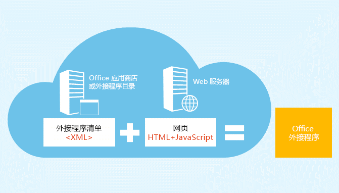
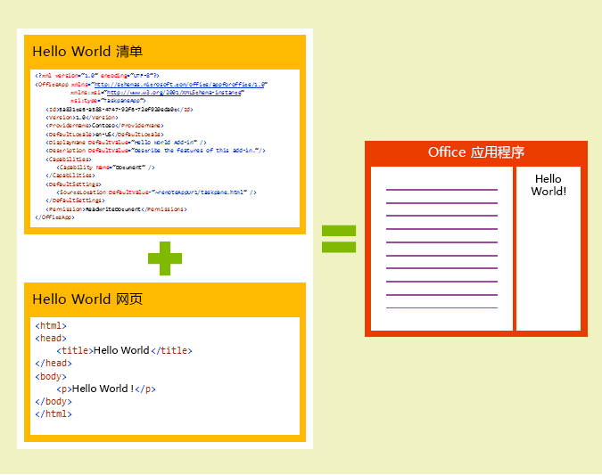
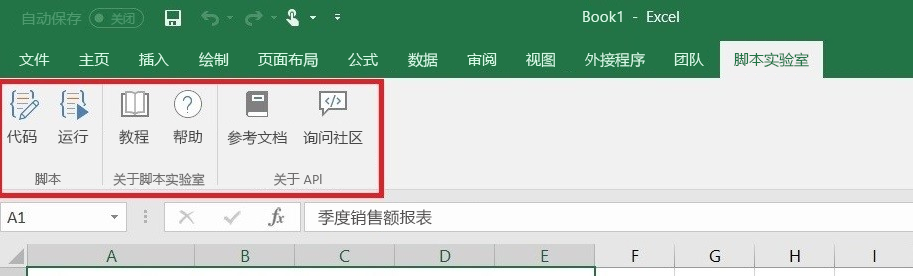
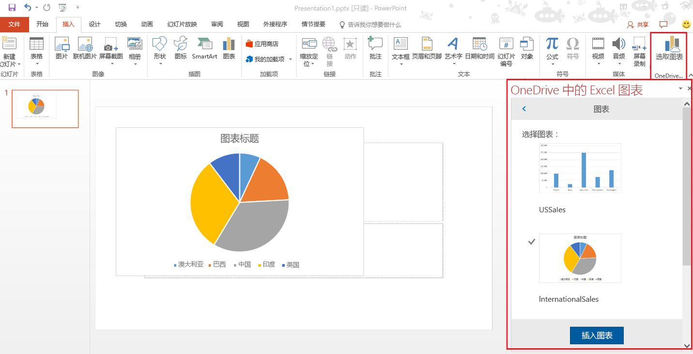
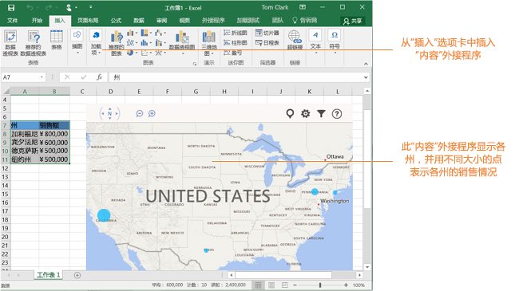

# Office 外接程序平台概述

可以使用 Office 外接程序平台来生成解决方案，通过解决方案扩展 Office 应用程序，并与 Office 文档中的内容进行交互。通过 Office 外接程序，可以使用熟悉的 Web 技术，例如 HTML、CSS 和 JavaScript 来扩展 Word、Excel、PowerPoint、OneNote，Project 和 Outlook，并与其进行交互。解决方案可以跨多个平台在 Office 中运行，包括 Office for Windows、Office Online、Office for Mac 和 Office for iPad。

网页在浏览器中能执行的操作，Office 外接程序差不多都能执行。使用 Office 外接程序平台执行以下操作：

-  **将新功能添加到 Office 客户端** - 将外部数据引入 Office，自动处理 Office 文档、公开 Office 客户端中的第三方功能等。例如，使用 Microsoft Graph API 连接到可提高工作效率的数据。 
    
-  **新建可嵌入到 Office 文档的丰富、交互式对象** - 用户可添加到其自己的 Excel 电子表格和 PowerPoint 演示文稿的嵌入式地图、图表和交互式可视化效果。 
    
## Office 外接程序与 COM 和 VSTO 外接程序有何不同？ 

COM 或 VSTO 外接程序是早期的 Office 集成解决方案，仅在 Office for Windows 上运行。 与 COM 外接程序不同，Office 外接程序不包括在用户设备或 Office 客户端中运行的代码。 对于 Office 外接程序，主机应用程序（例如 Excel）会读取外接程序清单，并在 UI 中挂钩外接程序的自定义功能区按钮和菜单命令。 然后，在需要时，主机应用程序将加载外接程序的 JavaScript 以及在沙盒中的浏览器上下文中执行的 HTML 代码。 

Office 外接程序通过使用 VBA、COM 或 VSTO 生成的外接程序提供以下优势： 

- 跨平台支持。在 Office for Windows、Mac、iOS 和 Office Online 中运行 Office 外接程序。 

- 单一登录 (SSO)。Office 外接程序可以轻松地与用户的 Office 365 帐户集成。 

- 集中部署和分发。管理员可以在组织中集成部署 Office 外接程序。 

- 轻松通过 Office 应用商店进行访问。可以通过将解决方案提交到 Office 应用商店来供广大受众使用。 

- 基于标准的 Web 技术。可以使用任何喜欢的库来生成 Office 外接程序。 

## Office 外接程序的组件 

Office 外接程序包括两个基本组件：XML 清单文件和你自己的 Web 应用程序。此清单定义各种设置，包括将外接程序与 Office 客户端集成的方式。需要在 Web 服务器或 Web 托管服务上托管 Web 应用程序，例如 Microsoft Azure。

**清单 + 网页 = Office 外接程序**

### 清单 

清单是一个 XML 文件，它指定外接程序的设置和功能，例如： 

- 外接程序的显示名称、说明、ID、版本和默认区域设置。 

- 如何将外接程序与 Office 集成。  

- 外接程序的权限级别和数据访问要求。 

### Web 应用 

最基本的 Office 外接程序包括一个静态 HTML 页面，该页面在一个 Office 应用程序中显示，但不与 Office 文档或任何其他 Internet 资源交互。但是，若要创建与 Office 文档交互的体验，或允许用户与 Office 主机应用程序的在线资源进行交互，可以使用托管提供程序支持的客户端和服务器端的任何技术（如 ASP.NET、PHP 或 Node.js）。若要与 Office 客户端及文档进行交互，可以使用 Office.js JavaScript API。 

**Hello World Office 外接程序的组件**

## 扩展并与 Office 客户端交互 

Office 外接程序可以在 Office 主机应用程序中执行下列操作： 

-  扩展功能（任何 Office 应用程序） 

-  创建新的对象（Excel 或 PowerPoint） 
 
### 扩展 Office 功能 

可以通过以下方式向 Office 应用程序添加新功能：  

-  自定义功能区按钮和菜单命令（统称为“外接程序命令”） 

-  可插入的任务窗格 

自定义 UI 和任务窗格在外接程序清单中进行指定。  

#### 自定义按钮和菜单命令  

可以向 Office for Windows Desktop 和 Office Online 中的功能区添加自定义功能区按钮和菜单项。这便于用户直接从他们的 Office 应用程序访问外接程序。命令按钮可以启动不同操作，如显示带有自定义 HTML 的任务窗格或执行一个 JavaScript 函数。  

**在 Excel Desktop 上运行的外接程序命令**

#### 任务窗格  

除了外接程序命令，还可以使用任务窗格来使用户与解决方案进行交互。不支持外接程序命令（Office 2013 和 Office for iPad）的客户端会将外接程序作为任务窗格运行。用户通过“插入”选项卡上的“我的外接程序”****按钮启动任务窗格外接程序。 

**任务窗格**

### 扩展 Outlook 功能 

Outlook 外接程序可扩展 Office 功能区，还可以在查看或撰写 Outlook 项目时在其旁边的上下文中显示。当用户查看接收的项目或回复或创建新项目时，它们可以与电子邮件、会议请求、会议响应、会议取消或约会一起使用。 

Outlook 外接程序可以从该项目中访问上下文信息，如地址或跟踪 ID，然后使用该数据访问有关服务器的其他信息并从 Web 服务创建最佳用户体验。在大多数情况下，Outlook 外接程序在各种支持的主机应用程序上运行而无需进行任何修改，包括 Outlook、Outlook for Mac、Outlook Web App，以及适用于设备的 Outlook Web App，从而在桌面、Web 和平板电脑以及移动设备上提供无缝体验。 

有关 Outlook 外接程序的概述，请参阅 [Outlook 外接程序概述](https://docs.microsoft.com/en-us/outlook/add-ins/)。 

### 在 Office 文档中创建新对象 

可以在 Excel 和 PowerPoint 文档中嵌入基于 Web 的对象 – 称之为内容外接程序。通过内容外接程序，可以集成基于 Web 的丰富数据可视化内容、媒体（例如，YouTube 视频播放器或图片库）以及其他外部内容。

**内容外接程序**

## Office JavaScript API 

Office JavaScript API 包含的对象和成员适用于生成加载项，并与 Office 内容和 Web 服务进行交互。Excel、Outlook、Word、PowerPoint、OneNote 和 Project 共用一个常见对象模型。对于 Excel 和 Word，还有更多主机专用对象模型。这些 API 提供对已知对象（如段落和工作簿）的访问权限，这样可以更轻松地为特定主机创建加载项。  

## 后续步骤 

若要了解有关如何开始生成 Office 外接程序的详细信息，请尝试[入门](https://dev.office.com/getting-started/addins)体验。可以使用 [Visual Studio](../../docs/get-started/create-and-debug-office-add-ins-in-visual-studio.md) 或[自己的工具](../../docs/get-started/create-an-office-add-in-using-any-editor)马上开始生成外接程序。 

若要开始规划创建高效且引人注目的用户体验的解决方案，请熟悉 Office 外接程序的[设计指南](../../docs/design/add-in-design)和[最佳做法](../../docs/add-ins/overview/add-in-development-best-practices)。    
   
## 其他资源

- [Office 外接程序示例](https://dev.office.com/code-samples)
    
- [了解适用于 Office 的 JavaScript API](../../docs/develop/understanding-the-javascript-api-for-office.md)

- [Office 外接程序主机和平台可用性](https://dev.office.com/add-in-availability)

    
