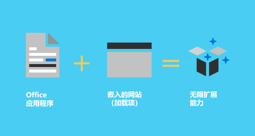
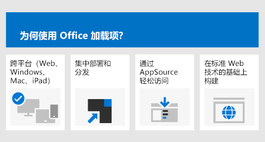
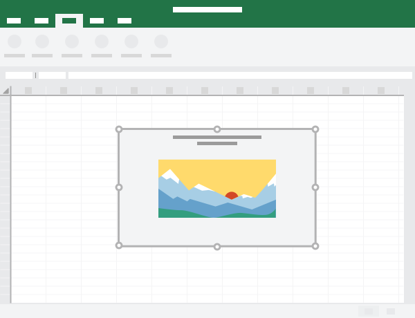

# Office 加载项平台概述Office Add-ins platform overview

可以使用 Office 加载项平台来生成解决方案，用于扩展 Office 应用程序，并与 Office 文档中的内容进行交互。通过 Office 加载项，可以使用熟悉的 Web 技术（如 HTML、CSS 和 JavaScript）来扩展 Word、Excel、PowerPoint、OneNote，Project 和 Outlook，并与之交互。解决方案可以跨多个平台（包括 Windows、Mac、iPad 和浏览器）在 Office 中运行。You can use the Office Add-ins platform to build solutions that extend Office applications and interact with content in Office documents. With Office Add-ins, you can use familiar web technologies such as HTML, CSS, and JavaScript to extend and interact with Word, Excel, PowerPoint, OneNote, Project, and Outlook. Your solution can run in Office across multiple platforms, including Windows, Mac, iPad, and in a browser.

网页在浏览器中能执行的操作，Office 加载项差不多都能执行。使用 Office 加载项平台可以执行下列操作：Office Add-ins can do almost anything a webpage can do inside a browser. Use the Office Add-ins platform to:

-  **将新功能添加到 Office 客户端** - 将外部数据引入 Office、自动处理 Office 文档、在 Office 客户端中公开第三方功能等。例如，使用 Microsoft Graph API，可以连接到提升工作效率的数据。**Add new functionality to Office clients** - Bring external data into Office, automate Office documents, expose third-party functionality in Office clients, and more. For example, use Microsoft Graph API to connect to data that drives productivity.

-  **新建可嵌入到 Office 文档的丰富、交互式对象** - 用户可添加到其自己的 Excel 电子表格和 PowerPoint 演示文稿的嵌入式地图、图表和交互式可视化效果。**Create new rich, interactive objects that can be embedded in Office documents** - Embed maps, charts, and interactive visualizations that users can add to their own Excel spreadsheets and PowerPoint presentations.

## Office 加载项与 COM 和 VSTO 加载项有何不同？How are Office Add-ins different from COM and VSTO add-ins?

COM 或 VSTO 加载项是旧 Office 集成解决方案，仅在 Windows 版 Office 上运行。与 COM 加载项不同，Office 加载项不涉及在用户设备或 Office 客户端中运行的代码。对于 Office 加载项，该应用程序（例如 Excel）会读取加载项清单，并挂钩 UI 中的加载项自定义功能区按钮和菜单命令。如果需要，它加载加载项的 JavaScript 和 HTML 代码，此代码在沙盒中的浏览器上下文范围内执行。COM or VSTO add-ins are earlier Office integration solutions that run only in Office on Windows. Unlike COM add-ins, Office Add-ins don't involve code that runs on the user's device or in the Office client. For an Office Add-in, the application (for example, Excel), reads the add-in manifest and hooks up the add-in’s custom ribbon buttons and menu commands in the UI. When needed, it loads the add-in's JavaScript and HTML code, which executes in the context of a browser in a sandbox.

相较于使用 VBA、COM 或 VSTO 生成的加载项，Office 加载项提供以下优势：Office Add-ins provide the following advantages over add-ins built using VBA, COM, or VSTO:

- 跨平台支持。Office 加载项在 Office 网页版、Windows 版 Office、Mac 版 Office 和 iPad 版 Office中运行。Cross-platform support. Office Add-ins run in Office on the web, Windows, Mac, and iPad.

- 集中部署和分发：管理员可以在整个组织内集中部署 Office 加载项。Centralized deployment and distribution. Admins can deploy Office Add-ins centrally across an organization.

- 可通过 AppSource 轻松使用：可以将解决方案提交到 AppSource，供广大受众使用。Easy access via AppSource. You can make your solution available to a broad audience by submitting it to AppSource.

- 以标准 Web 技术为依据：可以使用所需的任何库来生成 Office 加载项。Based on standard web technology. You can use any library you like to build Office Add-ins.

## Office 外接程序的组件Components of an Office Add-in

Office 外接程序包括两个基本组件：XML 清单文件和你自己的 Web 应用程序。此清单定义各种设置，包括将外接程序与 Office 客户端集成的方式。需要在 Web 服务器或 Web 托管服务上托管 Web 应用程序，例如 Microsoft Azure。An Office Add-in includes two basic components: an XML manifest file, and your own web application. The manifest defines various settings, including how your add-in integrates with Office clients. Your web application needs to be hosted on a web server, or web hosting service, such as Microsoft Azure.

### 清单Manifest

清单是一个 XML 文件，它指定外接程序的设置和功能，例如：The manifest is an XML file that specifies settings and capabilities of the add-in, such as:

- 外接程序的显示名称、说明、ID、版本和默认区域设置。The add-in's display name, description, ID, version, and default locale.

- 如何将外接程序与 Office 集成。How the add-in integrates with Office.  

- 外接程序的权限级别和数据访问要求。The permission level and data access requirements for the add-in.

### Web 应用Web app

最基本的 Office 加载项包括在 Office 应用中显示的静态 HTML 页面，但此页面并不与 Office 文档或其他任何 Internet 资源交互。不过，若要创建与 Office 文档交互的体验，或创建允许用户通过 Office 客户端应用程序与在线资源交互的体验，可以使用托管提供程序支持的任何客户端和服务器端技术（如 ASP.NET、PHP 或 Node.js）。若要与 Office 客户端和文档交互，可以使用 Office.js JavaScript API。The most basic Office Add-in consists of a static HTML page that is displayed inside an Office application, but that doesn't interact with either the Office document or any other Internet resource. However, to create an experience that interacts with Office documents or allows the user to interact with online resources from an Office client application, you can use any technologies, both client and server side, that your hosting provider supports (such as ASP.NET, PHP, or Node.js). To interact with Office clients and documents, you use the Office.js JavaScript APIs.

*图 2：Hello World Office 加载项的组件**Figure 2. Components of a Hello World Office Add-in*

## 扩展并与 Office 客户端交互Extending and interacting with Office clients

Office 加载项可以在 Office 客户端应用程序中执行下列操作：Office Add-ins can do the following within an Office client application:

-  扩展功能（任何 Office 应用程序）Extend functionality (any Office application)

-  创建新的对象（Excel 或 PowerPoint）Create new objects (Excel or PowerPoint)
 
### 扩展 Office 功能Extend Office functionality

可以通过以下方式向 Office 应用程序添加新功能：You can add new functionality to Office applications via the following:  

-  自定义功能区按钮和菜单命令（统称为“外接程序命令”）Custom ribbon buttons and menu commands (collectively called “add-in commands”)

-  可插入的任务窗格Insertable task panes

自定义 UI 和任务窗格在外接程序清单中进行指定。Custom UI and task panes are specified in the add-in manifest.  

#### 自定义按钮和菜单命令Custom buttons and menu commands  

可以向 Office 网页版和 Windows 版 Office 中的功能区添加自定义功能区按钮和菜单项。这样一来，用户可以直接从 Office 应用程序访问加载项。命令按钮可以启动不同的操作，如显示包含自定义 HTML 的任务窗格或执行 JavaScript 函数。You can add custom ribbon buttons and menu items to the ribbon in Office on the web and Windows. This makes it easy for users to access your add-in directly from their Office application. Command buttons can launch different actions such as showing a task pane with custom HTML or executing a JavaScript function.  

*图 3. 功能区中的加载项命令**Figure 3. Add-in commands in the ribbon*

#### 任务窗格Task panes  

除了通过加载项命令以外，用户还可以使用任务窗格与解决方案进行交互。不支持加载项命令的客户端（Office 2013 和 iPad 版 Office）以任务窗格的形式运行加载项。用户通过“插入”\*\*\*\* 选项卡上的“我的加载项”\*\*\*\* 按钮，启动任务窗格加载项。You can use task panes in addition to add-in commands to enable users to interact with your solution. Clients that do not support add-in commands (Office 2013 and Office on iPad) run your add-in as a task pane. Users launch task pane add-ins via the **My Add-ins** button on the **Insert** tab.

*图 4：任务窗格**Figure 4. Task pane*

### 扩展 Outlook 功能Extend Outlook functionality

Outlook 加载项可扩展 Office 应用功能区，还可以在查看或撰写 Outlook 项目时在其旁边的上下文中显示。当用户查看接收的项目或回复或创建新项目时，它们可以与电子邮件、会议请求、会议响应、会议取消或约会一起使用。Outlook add-ins can extend the Office app ribbon and also display contextually next to an Outlook item when you're viewing or composing it. They can work with an email message, meeting request, meeting response, meeting cancellation, or appointment when a user is viewing a received item or replying or creating a new item. 

Outlook 加载项可以访问邮件项目中的上下文信息（如地址或跟踪 ID），然后使用此类数据来访问服务器和 Web 服务上的其他信息，以打造极具吸引力的用户体验。在大多数情况下，Outlook 加载项无需修改即可在 Outlook 应用程序上运行，以在桌面、Web 以及平板电脑和移动设备上提供无缝体验。Outlook add-ins can access contextual information from the item, such as an address or tracking ID, and then use that data to access additional information on the server and from web services to create compelling user experiences. In most cases, an Outlook add-in runs without modification in the Outlook application to provide a seamless experience on the desktop, web, and tablet and mobile devices.

有关 Outlook 加载项的概述，请参阅 [Outlook 加载项概述](../outlook/outlook-add-ins-overview.md)。For an overview of Outlook add-ins, see [Outlook add-ins overview](../outlook/outlook-add-ins-overview.md).

### 在 Office 文档中新建对象Create new objects in Office documents

可以在 Excel 和 PowerPoint 文档中嵌入基于 Web 的对象（称为“内容加载项”）。通过内容加载项，可以集成基于 Web 的丰富数据可视化、媒体（如 YouTube 视频播放器或图片库）和其他外部内容。You can embed web-based objects called content add-ins within Excel and PowerPoint documents. With content add-ins, you can integrate rich, web-based data visualizations, media (such as a YouTube video player or a picture gallery), and other external content.

*图 5：内容加载项**Figure 5. Content add-in*

## Office JavaScript APIOffice JavaScript APIs

Office JavaScript API 包含的对象和成员适用于生成加载项，并与 Office 内容和 Web 服务交互。Excel、Outlook、Word、PowerPoint、OneNote 和 Project 共用一个常见对象模型。对于 Excel 和 Word，还有更多特定于应用程序的对象模型。这些 API 提供对已知对象（如段落和工作簿）的访问权限，以便于能够更轻松地为特定应用程序创建加载项。The Office JavaScript APIs contain objects and members for building add-ins and interacting with Office content and web services. There is a common object model that is shared by Excel, Outlook, Word, PowerPoint, OneNote and Project. There are also more extensive application-specific object models for Excel and Word. These APIs provide access to well-known objects such as paragraphs and workbooks, which makes it easier to create an add-in for a specific application.

## 后续步骤Next steps

有关开发 Office 加载项的更多详细介绍，请参阅[构建 Office 加载项](../overview/office-add-ins-fundamentals.md)。For a more detailed introduction to developing Office Add-ins, see [Building Office Add-ins](../overview/office-add-ins-fundamentals.md).

## 另请参阅See also

- [构建 Office 加载项Building Office Add-ins](../overview/office-add-ins-fundamentals.md)
- [Office 加载项的核心概念Core concepts for Office Add-ins](../overview/core-concepts-office-add-ins.md)
- [开发 Office 加载项Develop Office Add-ins](../develop/develop-overview.md)
- [设计 Office 加载项Design Office Add-ins](../design/add-in-design.md)
- [测试和调试 Office 加载项Test and debug Office Add-ins](../testing/test-debug-office-add-ins.md)
- [发布 Office 加载项Publish Office Add-ins](../publish/publish.md)
