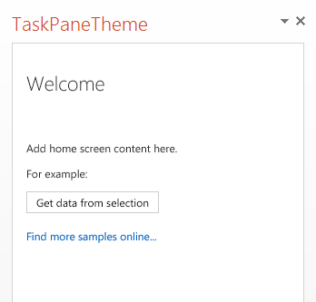

# <a name="use-document-themes-in-your-powerpoint-add-ins"></a><span data-ttu-id="259d8-103">在 PowerPoint 加载项中使用文档主题</span><span class="sxs-lookup"><span data-stu-id="259d8-103">Use document themes in your PowerPoint add-ins</span></span>

<span data-ttu-id="259d8-p101">[Office 主题](https://support.office.com/article/create-your-own-theme-in-powerpoint-83e68627-2c17-454a-9fd8-62deb81951a6)在某种程度上包括一组视觉协调的字体和颜色，可应用于演示文稿、文档、工作表和电子邮件。若要在 PowerPoint 中应用或自定义演示文稿的主题，请使用功能区上“设计”\*\*\*\* 选项卡中的“主题”\*\*\*\* 和“变量”\*\*\*\* 组。虽然 PowerPoint 向新空白演示文稿分配默认的“Office 主题”\*\*\*\*，但也可以选择“设计”\*\*\*\* 选项卡上的其他主题、从 Office.com 下载其他主题，或创建并自定义自己的主题。</span><span class="sxs-lookup"><span data-stu-id="259d8-p101">An [Office theme](https://support.office.com/article/create-your-own-theme-in-powerpoint-83e68627-2c17-454a-9fd8-62deb81951a6) consists, in part, of a visually coordinated set of fonts and colors that you can apply to presentations, documents, worksheets, and emails. To apply or customize the theme of a presentation in PowerPoint, you use the **Themes** and **Variants** groups on **Design** tab of the ribbon. PowerPoint assigns a new blank presentation with the default **Office Theme**, but you can choose other themes available on the **Design** tab, download additional themes from Office.com, or create and customize your own theme.</span></span>

<span data-ttu-id="259d8-107">使用 OfficeThemes.css，有助于以两种方式设计与 PowerPoint 相协调的加载项：</span><span class="sxs-lookup"><span data-stu-id="259d8-107">Using OfficeThemes.css, helps you design add-ins that are coordinated with PowerPoint in two ways:</span></span>

- <span data-ttu-id="259d8-p102">**在 PowerPoint 内容加载项中**。使用 OfficeThemes.css 的文档主题类指定字体和颜色，与内容加载项要插入到的演示文稿的主题匹配（这些颜色和字体将在用户更改或自定义演示文稿主题时动态更新）。</span><span class="sxs-lookup"><span data-stu-id="259d8-p102">**In content add-ins for PowerPoint**. Use the document theme classes of OfficeThemes.css to specify fonts and colors that match the theme of the presentation your content add-in is inserted into - and those fonts and colors will dynamically update if a user changes or customizes the presentation's theme.</span></span>
    
- <span data-ttu-id="259d8-p103">**在 PowerPoint 任务窗格加载项中**。使用 OfficeThemes.css 的 Office UI 主题类，指定 UI 中使用的相同字体和背景颜色，这样任务窗格加载项就会与内置任务窗格的颜色匹配（这些颜色将在用户更改 Office UI 主题时动态更新）。</span><span class="sxs-lookup"><span data-stu-id="259d8-p103">**In task pane add-ins for PowerPoint**. Use the Office UI theme classes of OfficeThemes.css to specify the same fonts and background colors used in the UI so that your task pane add-ins will match the colors of built-in task panes - and those colors will dynamically update if a user changes the Office UI theme.</span></span>

### <a name="document-theme-colors"></a><span data-ttu-id="259d8-112">文档主题颜色</span><span class="sxs-lookup"><span data-stu-id="259d8-112">Document theme colors</span></span>

<span data-ttu-id="259d8-p104">每个 Office 文档主题定义了 12 种颜色。通过颜色选取器在演示文稿中设置字体、背景和其他颜色设置时，可以使用其中 10 种颜色。</span><span class="sxs-lookup"><span data-stu-id="259d8-p104">Every Office document theme defines 12 colors. Ten of these colors are available when you set font, background, and other color settings in a presentation with the color picker.</span></span>


<span data-ttu-id="259d8-116">若要在 PowerPoint 中查看或自定义一组完整的12种主题颜色，请在 "**设计**" 选项卡上的 "**变体**" 组中，单击 "**更多**" 下拉框，然后选择 "**颜色**  >  **自定义颜色**" 以显示 "新建**主题颜色**" 对话框。</span><span class="sxs-lookup"><span data-stu-id="259d8-116">To view or customize the full set of 12 theme colors in PowerPoint, in the **Variants** group on the **Design** tab, click the **More** drop-down - then select **Colors** > **Customize Colors** to display the **Create New Theme Colors** dialog box.</span></span>


<span data-ttu-id="259d8-p105">前四种颜色适用于文本和背景。使用浅色创建的文本始终在深色背景上清晰显示，使用深色创建的文本始终在浅色背景上清晰显示。接下来六种颜色是个性色，始终在四种潜在背景色上可见。最后两种颜色适用于超链接和已访问过的超链接。</span><span class="sxs-lookup"><span data-stu-id="259d8-p105">The first four colors are for text and backgrounds. Text that is created with the light colors will always be legible over the dark colors, and text that is created with dark colors will always be legible over the light colors. The next six are accent colors that are always visible over the four potential background colors. The last two colors are for hyperlinks and followed hyperlinks.</span></span>

### <a name="document-theme-fonts"></a><span data-ttu-id="259d8-122">文档主题字体</span><span class="sxs-lookup"><span data-stu-id="259d8-122">Document theme fonts</span></span>

<span data-ttu-id="259d8-123">每个 Office 文档主题还定义两种字体 -- 一种用于标题，另一种用于正文文本。</span><span class="sxs-lookup"><span data-stu-id="259d8-123">Every Office document theme also defines two fonts -- one for headings and one for body text.</span></span> <span data-ttu-id="259d8-124">PowerPoint 使用这些字体来构造自动文本样式。</span><span class="sxs-lookup"><span data-stu-id="259d8-124">PowerPoint uses these fonts to construct automatic text styles.</span></span> <span data-ttu-id="259d8-125">此外，文本和“艺术字”\*\*\*\* 的“快速样式”\*\*\*\* 库使用这些相同的主题字体。</span><span class="sxs-lookup"><span data-stu-id="259d8-125">In addition, **Quick Styles** galleries for text and **WordArt** use these same theme fonts.</span></span> <span data-ttu-id="259d8-126">使用字体选取器选择字体时，这两种字体就是最靠上的两个选项。</span><span class="sxs-lookup"><span data-stu-id="259d8-126">These two fonts are available as the first two selections when you select fonts with the font picker.</span></span>


<span data-ttu-id="259d8-128">若要在 PowerPoint 中查看或自定义主题字体，请在 "**设计**" 选项卡上的 "**变体**" 组中，单击 "**更多**" 下拉框，然后选择 "**字体**  >  **自定义字体**" 以显示 "**新建主题字体**" 对话框。</span><span class="sxs-lookup"><span data-stu-id="259d8-128">To view or customize theme fonts in PowerPoint, in the **Variants** group on the **Design** tab, click the **More** drop-down - then select **Fonts** > **Customize Fonts** to display the **Create New Theme Fonts** dialog box.</span></span>


### <a name="office-ui-theme-fonts-and-colors"></a><span data-ttu-id="259d8-130">Office UI 主题字体和颜色</span><span class="sxs-lookup"><span data-stu-id="259d8-130">Office UI theme fonts and colors</span></span>

<span data-ttu-id="259d8-131">Office also lets you choose between several predefined themes that specify some of the colors and fonts used in the UI of all Office applications.</span><span class="sxs-lookup"><span data-stu-id="259d8-131">Office also lets you choose between several predefined themes that specify some of the colors and fonts used in the UI of all Office applications.</span></span> <span data-ttu-id="259d8-132">若要执行此操作，请使用 "**文件**  >  **帐户**" "  >  **office 主题**" 下拉（来自任何 Office 应用程序）。</span><span class="sxs-lookup"><span data-stu-id="259d8-132">To do that, you use the **File** > **Account** > **Office Theme** drop-down (from any Office application).</span></span>


<span data-ttu-id="259d8-p108">OfficeThemes.css 包含您可在 PowerPoint 任务窗格加载项中使用的类，以便它们使用这些相同的字体和颜色。这可使您设计与内置任务窗格外观一致的任务窗格加载项。</span><span class="sxs-lookup"><span data-stu-id="259d8-p108">OfficeThemes.css includes classes that you can use in your task pane add-ins for PowerPoint so they will use these same fonts and colors. This lets you design your task pane add-ins that match the appearance of built-in task panes.</span></span>

## <a name="using-officethemescss"></a><span data-ttu-id="259d8-136">使用 OfficeThemes.css</span><span class="sxs-lookup"><span data-stu-id="259d8-136">Using OfficeThemes.css</span></span>

<span data-ttu-id="259d8-p109">使用 OfficeThemes.css 文件处理 PowerPoint 内容加载项，使您可将 外接程序 的外观与它运行的演示文稿所应用的主题相协调。使用 OfficeThemes.css 文件处理 PowerPoint 任务窗格加载项，使您可将您 外接程序 的外观与 Office UI 的字体和颜色相协调。</span><span class="sxs-lookup"><span data-stu-id="259d8-p109">Using the OfficeThemes.css file with your content add-ins for PowerPoint lets you coordinate the appearance of your add-in with the theme applied to the presentation it's running with. Using the OfficeThemes.css file with your task pane add-ins for PowerPoint lets you coordinate the appearance of your add-in with the fonts and colors of the Office UI.</span></span>

### <a name="adding-the-officethemescss-file-to-your-project"></a><span data-ttu-id="259d8-139">将 OfficeThemes.css 文件添加到您的项目中</span><span class="sxs-lookup"><span data-stu-id="259d8-139">Adding the OfficeThemes.css file to your project</span></span>

<span data-ttu-id="259d8-140">使用以下步骤将 OfficeThemes.css 文件添加到您的 外接程序 项目中并进行引用。</span><span class="sxs-lookup"><span data-stu-id="259d8-140">Use the following steps to add and reference the OfficeThemes.css file to your add-in project.</span></span>

#### <a name="to-add-officethemescss-to-your-visual-studio-project"></a><span data-ttu-id="259d8-141">将 OfficeThemes.css 添加到 Visual Studio 项目中的具体步骤</span><span class="sxs-lookup"><span data-stu-id="259d8-141">To add OfficeThemes.css to your Visual Studio project</span></span>

> [!NOTE]
> <span data-ttu-id="259d8-142">此过程中的步骤仅适用于 Visual Studio 2015。</span><span class="sxs-lookup"><span data-stu-id="259d8-142">The steps in this procedure only apply to Visual Studio 2015.</span></span> <span data-ttu-id="259d8-143">如果使用的是 Visual Studio 2019，则会自动为您创建的任何新 PowerPoint 外接程序项目创建 OfficeThemes 文件。</span><span class="sxs-lookup"><span data-stu-id="259d8-143">If you are using Visual Studio 2019, the OfficeThemes.css file is created automatically for any new PowerPoint add-in projects that you create.</span></span>

1. <span data-ttu-id="259d8-144">在“解决方案资源管理器”\*\*\*\* 中，右键单击 _**project_name**_**Web** 项目中的“内容”\*\*\*\* 文件夹，选择“添加”\*\*\*\*，然后选择“样式表”\*\*\*\*。</span><span class="sxs-lookup"><span data-stu-id="259d8-144">In **Solution Explorer**, right-click the **Content** folder in the _**project_name**_**Web** project, choose **Add**, and then select **Style Sheet**.</span></span>
    
2. <span data-ttu-id="259d8-145">将新的样式表命名为“OfficeThemes”\*\*\*\*。</span><span class="sxs-lookup"><span data-stu-id="259d8-145">Name the new style sheet **OfficeThemes**.</span></span>
    
   > [!IMPORTANT]
   > <span data-ttu-id="259d8-146">必须将样式表命名为 OfficeThemes，否则在用户更改主题时动态更新加载项字体和颜色的功能将无法正常运行。</span><span class="sxs-lookup"><span data-stu-id="259d8-146">The style sheet must be named OfficeThemes, or the feature that dynamically updates add-in fonts and colors when a user changes the theme won't work.</span></span>
   
3. <span data-ttu-id="259d8-147">删除文件中的默认 **body** 类 (`body {}`)，并将以下 CSS 代码复制并粘贴到文件中。</span><span class="sxs-lookup"><span data-stu-id="259d8-147">Delete the default **body** class (`body {}`) in the file, and copy and paste the following CSS code into the file.</span></span>
    
    ```css
    /* The following classes describe the common theme information for office documents */ 

    /* Basic Font and Background Colors for text */ 
    .office-docTheme-primary-fontColor { color:#000000; } 
    .office-docTheme-primary-bgColor { background-color:#ffffff; } 
    .office-docTheme-secondary-fontColor { color: #000000; } 
    .office-docTheme-secondary-bgColor { background-color: #ffffff; } 

    /* Accent color definitions for fonts */ 
    .office-contentAccent1-color { color:#5b9bd5; } 
    .office-contentAccent2-color { color:#ed7d31; } 
    .office-contentAccent3-color { color:#a5a5a5; } 
    .office-contentAccent4-color { color:#ffc000; } 
    .office-contentAccent5-color { color:#4472c4; } 
    .office-contentAccent6-color { color:#70ad47; } 

    /* Accent color for backgrounds */ 
    .office-contentAccent1-bgColor { background-color:#5b9bd5; } 
    .office-contentAccent2-bgColor { background-color:#ed7d31; } 
    .office-contentAccent3-bgColor { background-color:#a5a5a5; } 
    .office-contentAccent4-bgColor { background-color:#ffc000; } 
    .office-contentAccent5-bgColor { background-color:#4472c4; } 
    .office-contentAccent6-bgColor { background-color:#70ad47; } 

    /* Accent color for borders */ 
    .office-contentAccent1-borderColor { border-color:#5b9bd5; } 
    .office-contentAccent2-borderColor { border-color:#ed7d31; } 
    .office-contentAccent3-borderColor { border-color:#a5a5a5; } 
    .office-contentAccent4-borderColor { border-color:#ffc000; } 
    .office-contentAccent5-borderColor { border-color:#4472c4; } 
    .office-contentAccent6-borderColor { border-color:#70ad47; } 

    /* links */ 
    .office-a { color: #0563c1; } 
    .office-a:visited { color: #954f72; } 

    /* Body Fonts */ 
    .office-bodyFont-eastAsian { } /* East Asian name of the Font */ 
    .office-bodyFont-latin { font-family:"Calibri"; } /* Latin name of the Font */ 
    .office-bodyFont-script { } /* Script name of the Font */ 
    .office-bodyFont-localized { font-family:"Calibri"; } /* Localized name of the Font. Corresponds to the default font of the culture currently used in Office.*/ 

    /* Headers Font */ 
    .office-headerFont-eastAsian { } 
    .office-headerFont-latin { font-family:"Calibri Light"; } 
    .office-headerFont-script { } 
    .office-headerFont-localized { font-family:"Calibri Light"; } 

    /* The following classes define font and background colors for Office UI themes. These classes should only be used in task pane add-ins */ 

    /* Basic Font and Background Colors for PPT */ 
    .office-officeTheme-primary-fontColor { color:#b83b1d; } 
    .office-officeTheme-primary-bgColor { background-color:#dedede; } 
    .office-officeTheme-secondary-fontColor { color:#262626; } 
    .office-officeTheme-secondary-bgColor { background-color:#ffffff; }
    ```
4. <span data-ttu-id="259d8-148">如果您使用非 Visual Studio 的工具来创建您的 外接程序，请将步骤 3 的 CSS 代码复制到文本文件中，确保将文件保存为 OfficeThemes.css。</span><span class="sxs-lookup"><span data-stu-id="259d8-148">If you are using a tool other than Visual Studio to create your add-in, copy the CSS code from step 3 into a text file, making sure to save the file as OfficeThemes.css.</span></span>   

### <a name="referencing-officethemescss-in-your-add-ins-html-pages"></a><span data-ttu-id="259d8-149">在加载项的 HTML 页面中引用 OfficeThemes.css</span><span class="sxs-lookup"><span data-stu-id="259d8-149">Referencing OfficeThemes.css in your add-in's HTML pages</span></span>

<span data-ttu-id="259d8-150">若要在加载项项目中使用 OfficeThemes.css 文件，请在网页（如 .html、.aspx 或 .php 文件）的 `<head>` 标记内，添加引用 OfficeThemes.css 文件的 `<link>` 标记，网页按照下面的格式实现加载项 UI：</span><span class="sxs-lookup"><span data-stu-id="259d8-150">To use the OfficeThemes.css file in your add-in project, add a `<link>` tag that references the OfficeThemes.css file inside the `<head>` tag of the web pages (such as an .html, .aspx, or .php file) that implement the UI of your add-in in this format:</span></span>

```HTML
<link href="<local_path_to_OfficeThemes.css>" rel="stylesheet" type="text/css" />
```

<span data-ttu-id="259d8-151">为此，请在 Visual Studio 中执行以下步骤。</span><span class="sxs-lookup"><span data-stu-id="259d8-151">To do this in Visual Studio, follow these steps.</span></span>

#### <a name="to-reference-officethemescss-in-your-add-in-for-powerpoint"></a><span data-ttu-id="259d8-152">在 PowerPoint 加载项中引用 OfficeThemes.css 的具体步骤</span><span class="sxs-lookup"><span data-stu-id="259d8-152">To reference OfficeThemes.css in your add-in for PowerPoint</span></span>

1. <span data-ttu-id="259d8-153">选择“**创建新项目**”。</span><span class="sxs-lookup"><span data-stu-id="259d8-153">Choose **Create a new project**.</span></span>

2. <span data-ttu-id="259d8-154">使用搜索框，输入“**加载项**”。</span><span class="sxs-lookup"><span data-stu-id="259d8-154">Using the search box, enter **add-in**.</span></span> <span data-ttu-id="259d8-155">选择“**PowerPoint 外接程序**”，然后选择“**下一步**”。</span><span class="sxs-lookup"><span data-stu-id="259d8-155">Choose **PowerPoint Web Add-in**, then select **Next**.</span></span>

3. <span data-ttu-id="259d8-156">对项目命名，然后选择“**创建**”。</span><span class="sxs-lookup"><span data-stu-id="259d8-156">Name your project and select **Create**.</span></span>

3. <span data-ttu-id="259d8-157">在“创建 Office 加载项”\*\*\*\* 对话框窗口中，选择“将新功能添加到 PowerPoint”\*\*\*\*，再选择“完成”\*\*\*\* 以创建项目。</span><span class="sxs-lookup"><span data-stu-id="259d8-157">In the **Create Office Add-in** dialog window, choose **Add new functionalities to PowerPoint**, and then choose **Finish** to create the project.</span></span>

4. <span data-ttu-id="259d8-p112">此时，Visual Studio 创建解决方案，且它的两个项目显示在“解决方案资源管理器”\*\*\*\* 中。**Home.html** 文件在 Visual Studio 中打开。</span><span class="sxs-lookup"><span data-stu-id="259d8-p112">Visual Studio creates a solution and its two projects appear in **Solution Explorer**. The **Home.html** file opens in Visual Studio.</span></span>

5. <span data-ttu-id="259d8-160">在实现加载项 UI 的 HTML 页面（如默认模板中的 Home.html）中，在 `<head>` 标记内添加以下引用 OfficeThemes.css 文件的 `<link>` 标记：</span><span class="sxs-lookup"><span data-stu-id="259d8-160">In the HTML pages that implement the UI of your add-in, such as Home.html in the default template, add the following `<link>` tag inside the `<head>` tag that references the OfficeThemes.css file:</span></span>
    
    ```HTML
    <link href="../../Content/OfficeThemes.css" rel="stylesheet" type="text/css" />
    ```

<span data-ttu-id="259d8-161">若要使用非 Visual Studio 工具创建加载项，请添加相同格式的 `<link>` 标记，同时指定与加载项一起部署的 OfficeThemes.css 副本的相对路径。</span><span class="sxs-lookup"><span data-stu-id="259d8-161">If you are creating your add-in with a tool other than Visual Studio, add a `<link>` tag with the same format specifying a relative path to the copy of OfficeThemes.css that will be deployed with your add-in.</span></span>

### <a name="using-officethemescss-document-theme-classes-in-your-content-add-ins-html-page"></a><span data-ttu-id="259d8-162">在内容加载项的 HTML 页面中使用 OfficeThemes.css 文档主题类</span><span class="sxs-lookup"><span data-stu-id="259d8-162">Using OfficeThemes.css document theme classes in your content add-in's HTML page</span></span>

<span data-ttu-id="259d8-p113">以下演示了使用 OfficeTheme.css 文档主题类的内容 外接程序 中的 HTML 简单示例。有关与文档主题中 12 种颜色和 2 种字体对应的 OfficeThemes.css 类的详细信息，请参阅 [适用于内容加载项的主题类](#theme-classes-for-content-add-ins)。</span><span class="sxs-lookup"><span data-stu-id="259d8-p113">The following shows a simple example of HTML in a content add-in that uses the OfficeTheme.css document theme classes. For details about the OfficeThemes.css classes that correspond to the 12 colors and 2 fonts used in a document theme, see [Theme classes for content add-ins](#theme-classes-for-content-add-ins).</span></span>

```HTML
<body>
    <div id="themeSample" class="office-docTheme-primary-fontColor ">
        <h1 class="office-headerFont-latin">Hello world!</h1> 
        <h1 class="office-headerFont-latin office-contentAccent1-bgColor">Hello world!</h1> 
        <h1 class="office-headerFont-latin office-contentAccent2-bgColor">Hello world!</h1> 
        <h1 class="office-headerFont-latin office-contentAccent3-bgColor">Hello world!</h1> 
        <h1 class="office-headerFont-latin office-contentAccent4-bgColor">Hello world!</h1> 
        <h1 class="office-headerFont-latin office-contentAccent5-bgColor">Hello world!</h1> 
        <h1 class="office-headerFont-latin office-contentAccent6-bgColor">Hello world!</h1> 
        <p class="office-bodyFont-latin office-docTheme-secondary-fontColor">Hello world!</p> 
    </div>
</body>
```

<span data-ttu-id="259d8-165">在运行时，在使用默认**Office 主题**的演示文稿中插入内容外接程序时，将呈现如下所示。</span><span class="sxs-lookup"><span data-stu-id="259d8-165">At runtime, when inserted into a presentation that uses the default **Office Theme**, the content add-in is rendered like this.</span></span>


<span data-ttu-id="259d8-p114">如果将演示文稿更改为使用其他主题或自定义演示文稿主题，OfficeThemes.css 类指定的字体和颜色会动态更新为，与演示文稿主题的字体和颜色相对应。使用与上述相同的 HTML 示例，如果加载项插入到的演示文稿使用 **Facet** 主题，加载项如下所示。</span><span class="sxs-lookup"><span data-stu-id="259d8-p114">If you change the presentation to use another theme or customize the presentation's theme, the fonts and colors specified with OfficeThemes.css classes will dynamically update to correspond to the fonts and colors of the presentation's theme. Using the same HTML example as above, if the presentation the add-in is inserted into uses the **Facet** theme, the add-in rendering will look like this.</span></span>


### <a name="using-officethemescss-office-ui-theme-classes-in-your-task-pane-add-ins-html-page"></a><span data-ttu-id="259d8-170">在任务窗格加载项的 HTML 页面中使用 OfficeThemes.css Office UI 主题类</span><span class="sxs-lookup"><span data-stu-id="259d8-170">Using OfficeThemes.css Office UI theme classes in your task pane add-in's HTML page</span></span>

<span data-ttu-id="259d8-171">除文档主题之外，用户还可以为所有 Office 应用的 Office 用户界面自定义颜色主题，具体方法是使用“文件”\*\*\*\* > “帐户”\*\*\*\* > “Office 主题”\*\*\*\* 下拉框。</span><span class="sxs-lookup"><span data-stu-id="259d8-171">In addition to the document theme, users can customize the color scheme of the Office user interface for all Office applications using the **File** > **Account** > **Office Theme** drop-down box.</span></span>

<span data-ttu-id="259d8-p115">以下演示了 HTML 的简单示例，该示例在任务窗格 外接程序 中使用 OfficeTheme.css 类指定字体颜色和背景色。有关与 Office UI 主题字体和颜色对应的 OfficeThemes.css 类的详细信息，请参阅 [适用于任务窗格加载项的主题类](#theme-classes-for-task-pane-add-ins)。</span><span class="sxs-lookup"><span data-stu-id="259d8-p115">The following shows a simple example of HTML in a task pane add-in that uses OfficeTheme.css classes to specify font color and background color. For details about the OfficeThemes.css classes that correspond to fonts and colors of the Office UI theme, see [Theme classes for task pane add-ins](#theme-classes-for-task-pane-add-ins).</span></span>

```HTML
<body> 
    <div id="content-header" class="office-officeTheme-primary-fontColor office-officeTheme-primary-bgColor"> 
        <div class="padding">
            <h1>Welcome</h1>
        </div> 
    </div> 
    <div id="content-main" class="office-officeTheme-secondary-fontColor office-officeTheme-secondary-bgColor"> 
        <div class="padding"> 
            <p>Add home screen content here.</p> 
            <p>For example:</p> 
            <button id="get-data-from-selection">Get data from selection</button> 
            <p><a target="_blank" class="office-a" href="https://go.microsoft.com/fwlink/?LinkId=276812">Find more samples online...</a></p>
        </div>
    </div>
</body> 
```

<br/>

<span data-ttu-id="259d8-174">当在 PowerPoint 中运行时，如果“文件”\*\*\*\* > “帐户”\*\*\*\* > “Office 主题”\*\*\*\* 设置为“白色”\*\*\*\*，任务窗格加载项如下所示。</span><span class="sxs-lookup"><span data-stu-id="259d8-174">When running in PowerPoint with **File** > **Account** > **Office Theme** set to **White**, the task pane add-in is rendered like this.</span></span>



<br/>

<span data-ttu-id="259d8-176">如果将 **Office 主题**更改为**深灰色**，OfficeThemes.css 类指定的字体和颜色会动态更新，如下所示。</span><span class="sxs-lookup"><span data-stu-id="259d8-176">If you change **OfficeTheme** to **Dark Gray**, the fonts and colors specified with OfficeThemes.css classes will dynamically update to render like this.</span></span>


<br/>

## <a name="officethemecss-classes"></a><span data-ttu-id="259d8-178">OfficeTheme.css 类</span><span class="sxs-lookup"><span data-stu-id="259d8-178">OfficeTheme.css classes</span></span>

<span data-ttu-id="259d8-179">OfficeThemes.css 文件包括两组类，您可用于 PowerPoint 内容和任务窗格加载项。</span><span class="sxs-lookup"><span data-stu-id="259d8-179">The OfficeThemes.css file contains two sets of classes you can use with your content and task pane add-ins for PowerPoint.</span></span>

### <a name="theme-classes-for-content-add-ins"></a><span data-ttu-id="259d8-180">适用于内容加载项的主题类</span><span class="sxs-lookup"><span data-stu-id="259d8-180">Theme classes for content add-ins</span></span>

<span data-ttu-id="259d8-p116">OfficeThemes.css 文件提供与文档主题中的 2 种字体和 12 种颜色对应的类。这些类很适合用于 PowerPoint 内容加载项，以便您的加载项字体和颜色与它要插入的演示文稿相协调。</span><span class="sxs-lookup"><span data-stu-id="259d8-p116">The OfficeThemes.css file provides classes that correspond to the 2 fonts and 12 colors used in a document theme. These classes are appropriate to use with content add-ins for PowerPoint so that your add-in's fonts and colors will be coordinated with the presentation it's inserted into.</span></span>

#### <a name="theme-fonts-for-content-add-ins"></a><span data-ttu-id="259d8-183">适用于内容加载项的主题字体</span><span class="sxs-lookup"><span data-stu-id="259d8-183">Theme fonts for content add-ins</span></span>

|<span data-ttu-id="259d8-184">**类**</span><span class="sxs-lookup"><span data-stu-id="259d8-184">**Class**</span></span>|<span data-ttu-id="259d8-185">**说明**</span><span class="sxs-lookup"><span data-stu-id="259d8-185">**Description**</span></span>|
|:-----|:-----|
| `office-bodyFont-eastAsian`|<span data-ttu-id="259d8-186">正文字体的东亚名称。</span><span class="sxs-lookup"><span data-stu-id="259d8-186">East Asian name of the body font.</span></span>|
| `office-bodyFont-latin`|<span data-ttu-id="259d8-p117">正文字体的拉丁名称。默认为"Calabri"</span><span class="sxs-lookup"><span data-stu-id="259d8-p117">Latin name of the body font. Default "Calabri"</span></span>|
| `office-bodyFont-script`|<span data-ttu-id="259d8-189">正文字体的脚本名称。</span><span class="sxs-lookup"><span data-stu-id="259d8-189">Script name of the body font.</span></span>|
| `office-bodyFont-localized`|<span data-ttu-id="259d8-p118">正文字体的本地化名称。根据当前在 Office 中使用的区域性，指定默认字体名称。</span><span class="sxs-lookup"><span data-stu-id="259d8-p118">Localized name of the body font. Specifies the default font name according to the culture currently used in Office.</span></span>|
| `office-headerFont-eastAsian`|<span data-ttu-id="259d8-192">标题字体的东亚名称。</span><span class="sxs-lookup"><span data-stu-id="259d8-192">East Asian name of the headers font.</span></span>|
| `office-headerFont-latin`|<span data-ttu-id="259d8-p119">标题字体的拉丁名称。默认为"Calabri Light"</span><span class="sxs-lookup"><span data-stu-id="259d8-p119">Latin name of the headers font. Default "Calabri Light"</span></span>|
| `office-headerFont-script`|<span data-ttu-id="259d8-195">标题字体的脚本名称。</span><span class="sxs-lookup"><span data-stu-id="259d8-195">Script name of the headers font.</span></span>|
| `office-headerFont-localized`|<span data-ttu-id="259d8-p120">标题字体的本地化名称。根据当前在 Office 中使用的区域性，指定默认字体名称。</span><span class="sxs-lookup"><span data-stu-id="259d8-p120">Localized name of the headers font. Specifies the default font name according to the culture currently used in Office.</span></span>|

<br/>

#### <a name="theme-colors-for-content-add-ins"></a><span data-ttu-id="259d8-198">适用于内容加载项的主题颜色</span><span class="sxs-lookup"><span data-stu-id="259d8-198">Theme colors for content add-ins</span></span>

|<span data-ttu-id="259d8-199">**类**</span><span class="sxs-lookup"><span data-stu-id="259d8-199">**Class**</span></span>|<span data-ttu-id="259d8-200">**说明**</span><span class="sxs-lookup"><span data-stu-id="259d8-200">**Description**</span></span>|
|:-----|:-----|
| `office-docTheme-primary-fontColor`|<span data-ttu-id="259d8-p121">首选字体颜色。默认为 #000000</span><span class="sxs-lookup"><span data-stu-id="259d8-p121">Primary font color. Default #000000</span></span>|
| `office-docTheme-primary-bgColor`|<span data-ttu-id="259d8-p122">首选字体背景色。默认为 #FFFFFF</span><span class="sxs-lookup"><span data-stu-id="259d8-p122">Primary font background color. Default #FFFFFF</span></span>|
| `office-docTheme-secondary-fontColor`|<span data-ttu-id="259d8-p123">辅助字体颜色。默认为 #000000</span><span class="sxs-lookup"><span data-stu-id="259d8-p123">Secondary font color. Default #000000</span></span>|
| `office-docTheme-secondary-bgColor`|<span data-ttu-id="259d8-p124">辅助字体背景色。默认为 #FFFFFF</span><span class="sxs-lookup"><span data-stu-id="259d8-p124">Secondary font background color. Default #FFFFFF</span></span>|
| `office-contentAccent1-color`|<span data-ttu-id="259d8-p125">字体个性色 1。默认为 #5B9BD5</span><span class="sxs-lookup"><span data-stu-id="259d8-p125">Font accent color 1. Default #5B9BD5</span></span>|
| `office-contentAccent2-color`|<span data-ttu-id="259d8-p126">字体个性色 2。默认为 #ED7D31</span><span class="sxs-lookup"><span data-stu-id="259d8-p126">Font accent color 2. Default #ED7D31</span></span>|
| `office-contentAccent3-color`|<span data-ttu-id="259d8-p127">字体个性色 3。默认为 #A5A5A5</span><span class="sxs-lookup"><span data-stu-id="259d8-p127">Font accent color 3. Default #A5A5A5</span></span>|
| `office-contentAccent4-color`|<span data-ttu-id="259d8-p128">字体个性色 4。默认为 #FFC000</span><span class="sxs-lookup"><span data-stu-id="259d8-p128">Font accent color 4. Default #FFC000</span></span>|
| `office-contentAccent5-color`|<span data-ttu-id="259d8-p129">字体个性色 5。默认为 #4472C4</span><span class="sxs-lookup"><span data-stu-id="259d8-p129">Font accent color 5. Default #4472C4</span></span>|
| `office-contentAccent6-color`|<span data-ttu-id="259d8-p130">字体个性色 6。默认为 #70AD47</span><span class="sxs-lookup"><span data-stu-id="259d8-p130">Font accent color 6. Default #70AD47</span></span>|
| `office-contentAccent1-bgColor`|<span data-ttu-id="259d8-p131">背景个性色 1。默认为 #5B9BD5</span><span class="sxs-lookup"><span data-stu-id="259d8-p131">Background accent color 1. Default #5B9BD5</span></span>|
| `office-contentAccent2-bgColor`|<span data-ttu-id="259d8-p132">背景个性色 2。默认为 #ED7D31</span><span class="sxs-lookup"><span data-stu-id="259d8-p132">Background accent color 2. Default #ED7D31</span></span>|
| `office-contentAccent3-bgColor`|<span data-ttu-id="259d8-p133">背景个性色 3。默认为 #A5A5A5</span><span class="sxs-lookup"><span data-stu-id="259d8-p133">Background accent color 3. Default #A5A5A5</span></span>|
| `office-contentAccent4-bgColor`|<span data-ttu-id="259d8-p134">背景个性色 4。默认为 #FFC000</span><span class="sxs-lookup"><span data-stu-id="259d8-p134">Background accent color 4. Default #FFC000</span></span>|
| `office-contentAccent5-bgColor`|<span data-ttu-id="259d8-p135">背景个性色 5。默认为 #4472C4</span><span class="sxs-lookup"><span data-stu-id="259d8-p135">Background accent color 5. Default #4472C4</span></span>|
| `office-contentAccent6-bgColor`|<span data-ttu-id="259d8-p136">背景个性色 6。默认为 #70AD47</span><span class="sxs-lookup"><span data-stu-id="259d8-p136">Background accent color 6. Default #70AD47</span></span>|
| `office-contentAccent1-borderColor`|<span data-ttu-id="259d8-p137">边框个性色 1。默认为 #5B9BD5</span><span class="sxs-lookup"><span data-stu-id="259d8-p137">Border accent color 1. Default #5B9BD5</span></span>|
| `office-contentAccent2-borderColor`|<span data-ttu-id="259d8-p138">边框个性色 2。默认为 #ED7D31</span><span class="sxs-lookup"><span data-stu-id="259d8-p138">Border accent color 2. Default #ED7D31</span></span>|
| `office-contentAccent3-borderColor`|<span data-ttu-id="259d8-p139">边框个性色 3。默认为 #A5A5A5</span><span class="sxs-lookup"><span data-stu-id="259d8-p139">Border accent color 3. Default #A5A5A5</span></span>|
| `office-contentAccent4-borderColor`|<span data-ttu-id="259d8-p140">边框强调文字颜色 4。默认为 #FFC000</span><span class="sxs-lookup"><span data-stu-id="259d8-p140">Border accent color 4. Default #FFC000</span></span>|
| `office-contentAccent5-borderColor`|<span data-ttu-id="259d8-p141">边框个性色 5。默认为 #4472C4</span><span class="sxs-lookup"><span data-stu-id="259d8-p141">Border accent color 5. Default #4472C4</span></span>|
| `office-contentAccent6-borderColor`|<span data-ttu-id="259d8-p142">边框个性色 6。默认为 #70AD47</span><span class="sxs-lookup"><span data-stu-id="259d8-p142">Border accent color 6. Default #70AD47</span></span>|
| `office-a`|<span data-ttu-id="259d8-p143">超链接颜色。默认为 #0563C1</span><span class="sxs-lookup"><span data-stu-id="259d8-p143">Hyperlink color. Default #0563C1</span></span>|
| `office-a:visited`|<span data-ttu-id="259d8-p144">已访问的超链接颜色。默认为 #954F72</span><span class="sxs-lookup"><span data-stu-id="259d8-p144">Followed hyperlink color. Default #954F72</span></span>|

<br/>

<span data-ttu-id="259d8-249">以下屏幕截图显示，在使用默认 Office 主题时，分配给 外接程序 文本的所有主题颜色类（两种超链接颜色除外）的示例。</span><span class="sxs-lookup"><span data-stu-id="259d8-249">The following screenshot shows examples of all of the theme color classes (except for the two hyperlink colors) assigned to add-in text when using the default Office theme.</span></span>


### <a name="theme-classes-for-task-pane-add-ins"></a><span data-ttu-id="259d8-251">适用于任务窗格加载项的主题类</span><span class="sxs-lookup"><span data-stu-id="259d8-251">Theme classes for task pane add-ins</span></span>

<span data-ttu-id="259d8-p145">OfficeThemes.css 文件提供的类与分配给 Office 应用程序 UI 主题所使用的字体和背景的 4 种颜色对应。这些类很适合用于 PowerPoint 相关的任务加载项，以便您的加载项颜色与其他 Office 内置的任务窗格协调。</span><span class="sxs-lookup"><span data-stu-id="259d8-p145">The OfficeThemes.css file provides classes that correspond to the 4 colors assigned to fonts and backgrounds used by the Office application UI theme. These classes are appropriate to use with task add-ins for PowerPoint so that your add-in's colors will be coordinated with the other built-in task panes in Office.</span></span>

#### <a name="theme-font-and-background-colors-for-task-pane-add-ins"></a><span data-ttu-id="259d8-254">适用于任务窗格加载项的主题字体和背景色</span><span class="sxs-lookup"><span data-stu-id="259d8-254">Theme font and background colors for task pane add-ins</span></span>

|<span data-ttu-id="259d8-255">**类**</span><span class="sxs-lookup"><span data-stu-id="259d8-255">**Class**</span></span>|<span data-ttu-id="259d8-256">**说明**</span><span class="sxs-lookup"><span data-stu-id="259d8-256">**Description**</span></span>|
|:-----|:-----|
| `office-officeTheme-primary-fontColor`|<span data-ttu-id="259d8-p146">首选字体颜色。默认为 #B83B1D</span><span class="sxs-lookup"><span data-stu-id="259d8-p146">Primary font color. Default #B83B1D</span></span>|
| `office-officeTheme-primary-bgColor`|<span data-ttu-id="259d8-p147">首选背景色。默认为 #DEDEDE</span><span class="sxs-lookup"><span data-stu-id="259d8-p147">Primary background color. Default #DEDEDE</span></span>|
| `office-officeTheme-secondary-fontColor`|<span data-ttu-id="259d8-p148">辅助字体颜色。默认为 #262626</span><span class="sxs-lookup"><span data-stu-id="259d8-p148">Secondary font color. Default #262626</span></span>|
| `office-officeTheme-secondary-bgColor`|<span data-ttu-id="259d8-p149">辅助背景色。默认为 #FFFFFF</span><span class="sxs-lookup"><span data-stu-id="259d8-p149">Secondary background color. Default #FFFFFF</span></span>|

## <a name="see-also"></a><span data-ttu-id="259d8-265">另请参阅</span><span class="sxs-lookup"><span data-stu-id="259d8-265">See also</span></span>

- [<span data-ttu-id="259d8-266">创建 PowerPoint 内容和任务窗格加载项</span><span class="sxs-lookup"><span data-stu-id="259d8-266">Create content and task pane add-ins for PowerPoint</span></span>](../powerpoint/powerpoint-add-ins.md)
