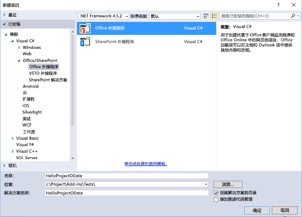
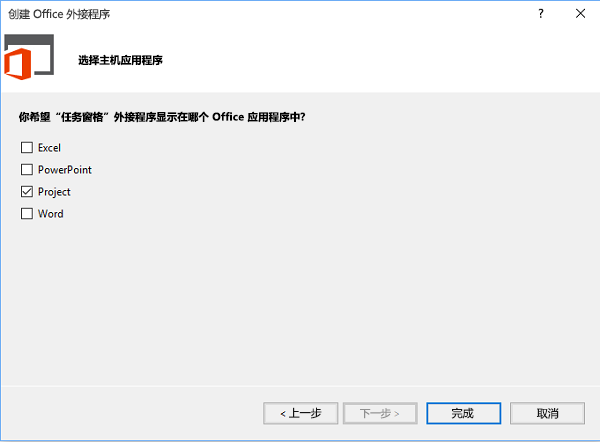
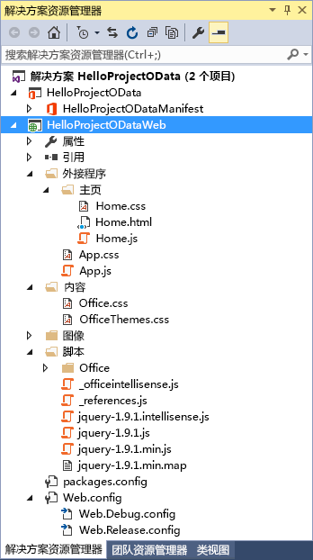
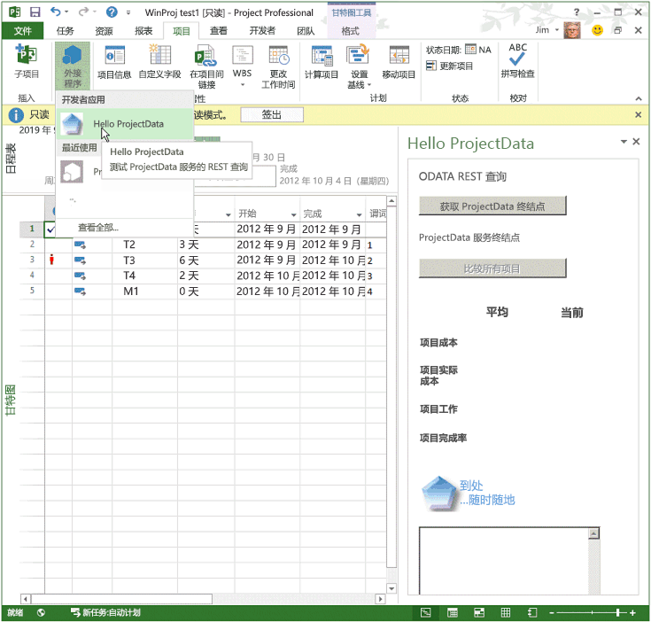
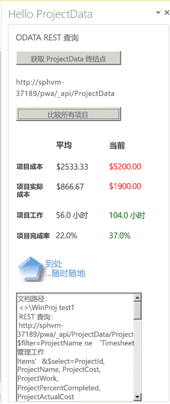
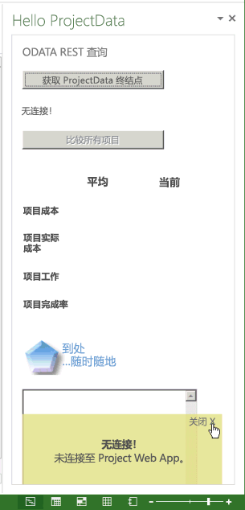
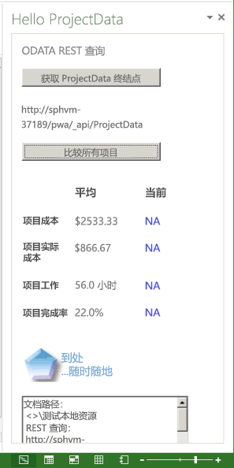

# <a name="create-a-project-add-in-that-uses-rest-with-an-on-premises-project-server-odata-service"></a><span data-ttu-id="3652d-102">创建将 REST 与本地 Project Server OData 服务结合使用的 Project 加载项</span><span class="sxs-lookup"><span data-stu-id="3652d-102">Create a Project add-in that uses REST with an on-premises Project Server OData service</span></span>

<span data-ttu-id="3652d-p101">本文介绍如何为 Project Professional 2013 构建一个任务窗格外接程序，以将活动项目中的成本和工作数据与当前 Project Web App 实例中的所有项目的平均值进行对比。该外接程序将 REST 与 jQuery 库结合使用来访问 Project Server 2013 中的 **ProjectData** OData 报告服务。</span><span class="sxs-lookup"><span data-stu-id="3652d-p101">This article describes how to build a task pane add-in for Project Professional 2013 that compares cost and work data in the active project with the averages for all projects in the current Project Web App instance. The add-in uses REST with the jQuery library to access the  **ProjectData** OData reporting service in Project Server 2013.</span></span>

<span data-ttu-id="3652d-105">本文中的代码基于由 Microsoft Corporation 的 Saurabh Sanghvi 和 Arvind Iyer 开发的示例。</span><span class="sxs-lookup"><span data-stu-id="3652d-105">The code in this article is based on a sample developed by Saurabh Sanghvi and Arvind Iyer, Microsoft Corporation.</span></span>

## <a name="prerequisites-for-creating-a-task-pane-add-in-that-reads-project-server-reporting-data"></a><span data-ttu-id="3652d-106">创建可读取 Project Server 报告数据的任务窗格加载项的先决条件</span><span class="sxs-lookup"><span data-stu-id="3652d-106">Prerequisites for creating a task pane add-in that reads Project Server reporting data</span></span>

<span data-ttu-id="3652d-107">以下是创建 Project 任务窗格加载项的先决条件，该加载项可读取内部部署安装的 Project Server 2013 中 Project Web App 实例的 **ProjectData** 服务：</span><span class="sxs-lookup"><span data-stu-id="3652d-107">The following are the prerequisites for creating a Project task pane add-in that reads the  **ProjectData** service of a Project Web App instance in an on-premises installation of Project Server 2013:</span></span>

- <span data-ttu-id="3652d-p102">确保您已在本地开发计算机上安装最新的 Service Pack 和 Windows 更新。操作系统可以是 Windows 7、Windows 8、Windows Server 2008 或 Windows Server 2012。</span><span class="sxs-lookup"><span data-stu-id="3652d-p102">Ensure that you have installed the most recent service packs and Windows updates on your local development computer. The operating system can be Windows 7, Windows 8, Windows Server 2008, or Windows Server 2012.</span></span>

- <span data-ttu-id="3652d-p103">Project Professional 2013 需要与 Project Web App 连接。开发计算机必须安装 Project Professional 2013 以使 Visual Studio 使用  **F5** 进行调试。</span><span class="sxs-lookup"><span data-stu-id="3652d-p103">Project Professional 2013 is required to connect with Project Web App. The development computer must have Project Professional 2013 installed to enable  **F5** debugging with Visual Studio.</span></span>

    > [!NOTE]
    > <span data-ttu-id="3652d-112">虽然 Project Standard 2013 也可以托管任务窗格加载项，但无法登录 Project Web App。</span><span class="sxs-lookup"><span data-stu-id="3652d-112">Project Standard 2013 can also host task pane add-ins, but cannot log on to Project Web App.</span></span>

- <span data-ttu-id="3652d-113">带有 Visual Studio 的 Office 开发人员工具的 Visual Studio 2015 中包括用于创建 Office 和 SharePoint 外接程序的模板。请确保你已安装最新版本的 Office 开发人员工具；请参阅 [Office 外接程序和 SharePoint 下载](https://developer.microsoft.com/office/docs)的_工具_部分。</span><span class="sxs-lookup"><span data-stu-id="3652d-113">Visual Studio 2015 with Office Developer Tools for Visual Studio includes templates for creating Office and SharePoint Add-ins. Ensure that you have installed the most recent version of Office Developer Tools; see the  _Tools_ section of the [Office Add-ins and SharePoint downloads](https://developer.microsoft.com/office/docs).</span></span>

- <span data-ttu-id="3652d-p104">本文中的过程和代码示例在本地域中访问 Project Server 2013 的 **ProjectData** 服务。本文中的 jQuery 方法不适用于 Project 网页版。</span><span class="sxs-lookup"><span data-stu-id="3652d-p104">The procedures and code examples in this article access the  **ProjectData** service of Project Server 2013 in a local domain. The jQuery methods in this article do not work with Project Online.</span></span>

    <span data-ttu-id="3652d-116">验证可从你的开发计算机访问 **ProjectData** 服务。</span><span class="sxs-lookup"><span data-stu-id="3652d-116">Verify that the  **ProjectData** service is accessible from your development computer.</span></span>

### <a name="procedure-1-to-verify-that-the-projectdata-service-is-accessible"></a><span data-ttu-id="3652d-p105">过程 1：验证 ProjectData 服务是否可访问</span><span class="sxs-lookup"><span data-stu-id="3652d-p105">Procedure 1. To verify that the ProjectData service is accessible</span></span>

1. <span data-ttu-id="3652d-p106">若要使浏览器直接显示来自 REST 查询的 XML 数据，请关闭源阅读视图。有关如何在 Internet Explorer 中执行此操作的信息，请参阅 [查询 Project Server 2013 报告数据的 OData 源](/previous-versions/office/project-odata/jj163048(v=office.15))中过程 1 的第 4 步。</span><span class="sxs-lookup"><span data-stu-id="3652d-p106">To enable your browser to directly show the XML data from a REST query, turn off the feed reading view. For information about how to do this in Internet Explorer, see Procedure 1, step 4 in [Querying OData feeds for Project reporting data](/previous-versions/office/project-odata/jj163048(v=office.15)).</span></span>

2. <span data-ttu-id="3652d-121">在浏览器中使用以下 URL 查询 **ProjectData** 服务：**http://ServerName /ProjectServerName /_api/ProjectData**。</span><span class="sxs-lookup"><span data-stu-id="3652d-121">Query the  **ProjectData** service by using your browser with the following URL: **http://ServerName /ProjectServerName /_api/ProjectData**.</span></span> <span data-ttu-id="3652d-122">例如，如果 Project Web App 实例是 `http://MyServer/pwa`，浏览器会显示以下结果：</span><span class="sxs-lookup"><span data-stu-id="3652d-122">For example, if the Project Web App instance is  `http://MyServer/pwa`, the browser shows the following results:</span></span>

    ```xml
    <?xml version="1.0" encoding="utf-8"?>
        <service xml:base="http://myserver/pwa/_api/ProjectData/"
        xmlns="https://www.w3.org/2007/app"
        xmlns:atom="https://www.w3.org/2005/Atom">
        <workspace>
            <atom:title>Default</atom:title>
            <collection href="Projects">
                <atom:title>Projects</atom:title>
            </collection>
            <collection href="ProjectBaselines">
                <atom:title>ProjectBaselines</atom:title>
            </collection>
            <!-- ... and 33 more collection elements -->
        </workspace>
        </service>
    ```

3. <span data-ttu-id="3652d-p108">必须提供网络凭据，才能查看结果。如果浏览器显示“错误 403，访问遭拒”，要么是因为无权登录相应 Project Web App 实例，要么是因为网络出现问题，需要获取管理员的帮助。</span><span class="sxs-lookup"><span data-stu-id="3652d-p108">You may have to provide your network credentials to see the results. If the browser shows "Error 403, Access Denied," either you do not have logon permission for that Project Web App instance, or there is a network problem that requires administrative help.</span></span>

## <a name="using-visual-studio-to-create-a-task-pane-add-in-for-project"></a><span data-ttu-id="3652d-125">使用 Visual Studio 创建 Project 任务窗格加载项</span><span class="sxs-lookup"><span data-stu-id="3652d-125">Using Visual Studio to create a task pane add-in for Project</span></span>

<span data-ttu-id="3652d-p109">Visual Studio Office 开发人员工具包含 Project 2013 任务窗格外接程序的模板。如果您创建一个名为  **HelloProjectOData** 的解决方案，则该解决方案将包含以下两个 Visual Studio 项目：</span><span class="sxs-lookup"><span data-stu-id="3652d-p109">Office Developer Tools for Visual Studio includes a template for task pane add-ins for Project 2013. If you create a solution named  **HelloProjectOData**, the solution contains the following two Visual Studio projects:</span></span>

- <span data-ttu-id="3652d-p110">加载项项目采用该解决方案的名称。它包含该加载项的 XML 清单文件并以 .NET Framework 4.5 为目标。过程 3 演示了修改  **HelloProjectOData** 加载项的清单的步骤。</span><span class="sxs-lookup"><span data-stu-id="3652d-p110">The add-in project takes the name of the solution. It includes the XML manifest file for the add-in and targets the .NET Framework 4.5. Procedure 3 shows the steps to modify the manifest for the  **HelloProjectOData** add-in.</span></span>

- <span data-ttu-id="3652d-p111">Web 项目名为  **HelloProjectODataWeb**。它在任务窗格中包含 Web 内容的网页、JavaScript 文件、CSS 文件、图像、引用和配置文件。Web 项目以 .NET Framework 4 为目标。过程 4 和过程 5 演示了如何修改 Web 项目中的文件以创建  **HelloProjectOData** 加载项的功能。</span><span class="sxs-lookup"><span data-stu-id="3652d-p111">The web project is named  **HelloProjectODataWeb**. It includes the webpages, JavaScript files, CSS files, images, references, and configuration files for the web content in the task pane. The web project targets the .NET Framework 4. Procedure 4 and Procedure 5 show how to modify the files in the web project to create the functionality of the  **HelloProjectOData** add-in.</span></span>

### <a name="procedure-2-to-create-the-helloprojectodata-add-in-for-project"></a><span data-ttu-id="3652d-p112">过程 2. 为 Project 创建 HelloProjectOData 加载项</span><span class="sxs-lookup"><span data-stu-id="3652d-p112">Procedure 2. To create the HelloProjectOData add-in for Project</span></span>

1. <span data-ttu-id="3652d-137">以管理员身份运行 Visual Studio 2015，再选择起始页上的“新建项目”\*\*\*\*。</span><span class="sxs-lookup"><span data-stu-id="3652d-137">Run Visual Studio 2015 as an administrator, and then select  **New Project** on the Start page.</span></span>

2. <span data-ttu-id="3652d-p113">在“新建项目”\*\*\*\* 对话框中，依次展开“模板”\*\*\*\*、“Visual C#”\*\*\*\* 和“Office/SharePoint”\*\*\*\* 节点，再选择“Office 加载项”\*\*\*\*。在中心窗格顶部的目标框架下拉列表中，依次选择“.NET Framework 4.5.2”\*\*\*\* 和“Office 加载项”\*\*\*\*（见接下来的屏幕截图）。</span><span class="sxs-lookup"><span data-stu-id="3652d-p113">In the  **New Project** dialog box, expand the **Templates**,  **Visual C#**, and  **Office/SharePoint** nodes, and then select \*\* Office Add-ins\*\*. Select  **.NET Framework 4.5.2** in the target framework drop-down list at the top of the center pane, and then select **Office Add-in** (see the next screenshot).</span></span>

3. <span data-ttu-id="3652d-140">若要将这两个 Visual Studio 项目置于同一目录中，请选择“**创建解决方案的目录**”，然后浏览到所需位置。</span><span class="sxs-lookup"><span data-stu-id="3652d-140">To place both of the Visual Studio projects in the same directory, select  **Create directory for solution**, and then browse to the location you want.</span></span>

4. <span data-ttu-id="3652d-141">在“名称”\*\*\*\* 字段中，键入“HelloProjectOData”，再选择“确定”\*\*\*\*。</span><span class="sxs-lookup"><span data-stu-id="3652d-141">In the  **Name** field, typeHelloProjectOData, and then choose  **OK**.</span></span>

    <span data-ttu-id="3652d-142">*图 1：创建 Office 加载项*</span><span class="sxs-lookup"><span data-stu-id="3652d-142">*Figure 1. Creating an Office Add-in*</span></span>

    

5. <span data-ttu-id="3652d-144">在“选择加载项类型”对话框中\*\*\*\*，选中“任务窗格”\*\*\*\*，再选择“下一步”\*\*\*\*（见接下来的屏幕截图）。</span><span class="sxs-lookup"><span data-stu-id="3652d-144">In the  **Choose the add-in type** dialog box, select **Task pane** and choose **Next** (see the next screenshot).</span></span>

    <span data-ttu-id="3652d-145">*图 2：选择要创建的加载项类型*</span><span class="sxs-lookup"><span data-stu-id="3652d-145">*Figure 2. Choosing the type of add-in to create*</span></span>

    

6. <span data-ttu-id="3652d-147">在“**选择主机应用程序**”对话框中，清除除“**项目**”复选框以外的所有复选框（请参阅下一个屏幕截图），然后选择“**完成**”。</span><span class="sxs-lookup"><span data-stu-id="3652d-147">In the  **Choose the host applications** dialog box, clear all check boxes except the **Project** check box (see the next screenshot) and choose **Finish**.</span></span>

    <span data-ttu-id="3652d-148">*图 3：选择主机应用*</span><span class="sxs-lookup"><span data-stu-id="3652d-148">*Figure 3. Choosing the host application*</span></span>

    

    <span data-ttu-id="3652d-150">Visual Studio 创建 **HelloProjectOdata** 项目和 **HelloProjectODataWeb** 项目。</span><span class="sxs-lookup"><span data-stu-id="3652d-150">Visual Studio creates the  **HelloProjectOdata** project and the **HelloProjectODataWeb** project.</span></span>

<span data-ttu-id="3652d-151">“**外接程序**”文件夹（请参阅下一个屏幕截图）中包含自定义 CSS 样式的 App.css 文件。</span><span class="sxs-lookup"><span data-stu-id="3652d-151">The  **AddIn** folder (see the next screenshot) contains the App.css file for custom CSS styles.</span></span> <span data-ttu-id="3652d-152">在“**主页**”子文件夹中，Home.html 文件中包含外接程序使用的 CSS 文件和 JavaScript 文件的引用，及用于外接程序的 HTML5 内容。</span><span class="sxs-lookup"><span data-stu-id="3652d-152">In the **Home** subfolder , the Home.html file contains references to the CSS files and the JavaScript files that the add-in uses, and the HTML5 content for the add-in.</span></span> <span data-ttu-id="3652d-153">此外，Home.js 文件用于你的自定义 JavaScript 代码。</span><span class="sxs-lookup"><span data-stu-id="3652d-153">Also, the Home.js file is for your custom JavaScript code.</span></span> <span data-ttu-id="3652d-154">“**脚本**”文件夹中包括 jQuery 库文件。</span><span class="sxs-lookup"><span data-stu-id="3652d-154">The **Scripts** folder includes the jQuery library files.</span></span> <span data-ttu-id="3652d-155">“**Office**”子文件夹中包括 JavaScript 库（例如 office.js 和 project-15.js），及 Office 加载项中的标准字符串的语言库。在“**内容**”文件夹中，Office.css 文件包含所有的 Office 加载项的默认样式。</span><span class="sxs-lookup"><span data-stu-id="3652d-155">The **Office** subfolder includes the JavaScript libraries such as office.js and project-15.js, plus the language libraries for standard strings in the Office Add-ins. In the **Content** folder, the Office.css file contains the default styles for all of the Office Add-ins.</span></span>

<span data-ttu-id="3652d-156">*图 4：在解决方案资源管理器中查看默认 Web 项目文件*</span><span class="sxs-lookup"><span data-stu-id="3652d-156">*Figure 4. Viewing the default web project files in Solution Explorer*</span></span>



<span data-ttu-id="3652d-p115">**HelloProjectOData** 项目的清单是 HelloProjectOData.xml 文件。你可以根据需要修改该清单，以添加有关加载项的描述、对图标的引用、其他语言的信息和其他设置。过程 3 只修改了加载项显示名称和描述，并添加了一个图标。</span><span class="sxs-lookup"><span data-stu-id="3652d-p115">The manifest for the  **HelloProjectOData** project is the HelloProjectOData.xml file. You can optionally modify the manifest to add a description of the add-in, a reference to an icon, information for additional languages, and other settings. Procedure 3 simply modifies the add-in display name and description, and adds an icon.</span></span>

<span data-ttu-id="3652d-161">若要详细了解清单，请参阅 [Office 加载项 XML 清单](../develop/add-in-manifests.md)和 [Office 加载项清单的架构参考 (v1.1)](../develop/add-in-manifests.md#see-also)。</span><span class="sxs-lookup"><span data-stu-id="3652d-161">For more information about the manifest, see [Office Add-ins XML manifest](../develop/add-in-manifests.md) and [Schema reference for Office Add-ins manifests (v1.1)](../develop/add-in-manifests.md#see-also).</span></span>

### <a name="procedure-3-to-modify-the-add-in-manifest"></a><span data-ttu-id="3652d-p116">过程 3. 修改加载项清单</span><span class="sxs-lookup"><span data-stu-id="3652d-p116">Procedure 3. To modify the add-in manifest</span></span>

1. <span data-ttu-id="3652d-164">在 Visual Studio 中，打开 HelloProjectOData.xml 文件。</span><span class="sxs-lookup"><span data-stu-id="3652d-164">In Visual Studio, open the HelloProjectOData.xml file.</span></span>

2. <span data-ttu-id="3652d-p117">默认显示名称是 Visual Studio 项目名称（"HelloProjectOData"）。例如，将  **DisplayName** 元素的默认值更改为"Hello ProjectData"。</span><span class="sxs-lookup"><span data-stu-id="3652d-p117">The default display name is the name of the Visual Studio project ("HelloProjectOData"). For example, change the default value of the  **DisplayName** element to"Hello ProjectData".</span></span>

3. <span data-ttu-id="3652d-p118">默认描述也是"HelloProjectOData"。例如，将 Description 元素的默认值更改为"测试 ProjectData 服务的 REST 查询"。</span><span class="sxs-lookup"><span data-stu-id="3652d-p118">The default description is also "HelloProjectOData". For example, change the default value of the Description element to "Test REST queries of the ProjectData service".</span></span>

4. <span data-ttu-id="3652d-p119">添加图标以显示在功能区的“**项目**”选项卡上的“**Office 外接程序**”下拉列表中。你可以在 Visual Studio 解决方案中添加图标文件或使用图标的 URL。</span><span class="sxs-lookup"><span data-stu-id="3652d-p119">Add an icon to show in the  **Office Add-ins** drop-down list on the **PROJECT** tab of the ribbon. You can add an icon file in the Visual Studio solution or use a URL for an icon.</span></span> 

<span data-ttu-id="3652d-171">下列步骤显示如何向 Visual Studio 解决方案添加图标文件：</span><span class="sxs-lookup"><span data-stu-id="3652d-171">The following steps show how to add an icon file to the Visual Studio solution:</span></span>

1. <span data-ttu-id="3652d-172">在“**解决方案资源管理器**”中，请转到名为“图像”的文件夹。</span><span class="sxs-lookup"><span data-stu-id="3652d-172">In  **Solution Explorer**, go to the folder named Images.</span></span>

2. <span data-ttu-id="3652d-p120">若要显示在“**Office 外接程序**”下拉列表中，图标的像素必须为 32 x 32。例如，安装 Project 2013 SDK，然后选择“**图像**”文件夹并添加 SDK 的以下文件：`\Samples\Apps\HelloProjectOData\HelloProjectODataWeb\Images\NewIcon.png`</span><span class="sxs-lookup"><span data-stu-id="3652d-p120">To be displayed in the  **Office Add-ins** drop-down list, the icon must be 32 x 32 pixels. For example, install the Project 2013 SDK, and then choose the **Images** folder and add the following file from the SDK: `\Samples\Apps\HelloProjectOData\HelloProjectODataWeb\Images\NewIcon.png`</span></span>

    <span data-ttu-id="3652d-175">也可以使用自己的 32x32 图标，或将下列图像复制到 NewIcon.png 文件中，再将此文件添加到 `HelloProjectODataWeb\Images` 文件夹中：</span><span class="sxs-lookup"><span data-stu-id="3652d-175">Alternately, use your own 32 x 32 icon; or, copy the following image to a file named NewIcon.png, and then add that file to the  `HelloProjectODataWeb\Images` folder:</span></span>

    

3. <span data-ttu-id="3652d-p121">在 HelloProjectOData.xml 清单中，在 **Description** 元素下面添加一个 **IconUrl** 元素，其中图标 URL 的值是指向 32x32 图标文件的相对路径。例如，添加以下行：**<IconUrl DefaultValue="~remoteAppUrl/Images/NewIcon.png" />**。HelloProjectOData.xml 清单文件现在包含以下内容（你的 **Id** 值将不同）：</span><span class="sxs-lookup"><span data-stu-id="3652d-p121">In the HelloProjectOData.xml manifest, add an  **IconUrl** element below the **Description** element, where the value of the icon URL is the relative path to the 32x32 icon file. For example, add the following line: **<IconUrl DefaultValue="~remoteAppUrl/Images/NewIcon.png" />**. The HelloProjectOData.xml manifest file now contains the following (your  **Id** value will be different):</span></span>

    ```XML
    <?xml version="1.0" encoding="UTF-8"?>
    <OfficeApp xmlns="http://schemas.microsoft.com/office/appforoffice/1.1"
            xmlns:xsi="http://www.w3.org/2001/XMLSchema-instance" xsi:type="TaskPaneApp">
        <!--IMPORTANT! Id must be unique for each add-in. If you copy this manifest ensure that you change this id to your own GUID. -->
        <Id>c512df8d-a1c5-4d74-8a34-d30f6bbcbd82</Id>
        <Version>1.0</Version>
        <ProviderName> [Provider name]</ProviderName>
        <DefaultLocale>en-US</DefaultLocale>
        <DisplayName DefaultValue="Hello ProjectData" />
        <Description DefaultValue="Test REST queries of the ProjectData service"/>
        <IconUrl DefaultValue="~remoteAppUrl/Images/NewIcon.png" />
        <SupportUrl DefaultValue="[Insert the URL of a page that provides support information for the app]" />
        <Hosts>
            <Host Name="Project" />
        </Hosts>
        <DefaultSettings>
            <SourceLocation DefaultValue="~remoteAppUrl/AddIn/Home/Home.html" />
        </DefaultSettings>
        <Permissions>ReadWriteDocument</Permissions>
    </OfficeApp>
    ```

## <a name="creating-the-html-content-for-the-helloprojectodata-add-in"></a><span data-ttu-id="3652d-180">为 HelloProjectOData 加载项创建 HTML 内容</span><span class="sxs-lookup"><span data-stu-id="3652d-180">Creating the HTML content for the HelloProjectOData add-in</span></span>

<span data-ttu-id="3652d-p122">**HelloProjectOData** 外接程序是包括调试和错误输出的示例；不能用于生产目的。在开始编写 HTML 内容代码之前，要先设计外接程序的 UI 和用户体验，并概括与 HTML 代码交互的 JavaScript 函数。有关详细信息，请参阅 [Office 外接程序的设计准则](../design/add-in-design.md)。</span><span class="sxs-lookup"><span data-stu-id="3652d-p122">The  **HelloProjectOData** add-in is a sample that includes debugging and error output; it is not intended for production use. Before you start coding the HTML content, design the UI and user experience for the add-in, and outline the JavaScript functions that interact with the HTML code. For more information, see[Design guidelines for Office Add-ins](../design/add-in-design.md).</span></span> 

<span data-ttu-id="3652d-p123">任务窗格将在顶部显示外接程序的显示名称，该名称是清单中  **DisplayName** 元素的值。HelloProjectOData.html 文件中的 **body** 元素包含其他 UI 元素，如下所示：</span><span class="sxs-lookup"><span data-stu-id="3652d-p123">The task pane shows the add-in display name at the top, which is the value of the  **DisplayName** element in the manifest. The **body** element in the HelloProjectOData.html file contains the other UI elements, as follows:</span></span>

- <span data-ttu-id="3652d-186">副标题指示常规功能或操作类型，例如“**ODATA REST 查询**”。</span><span class="sxs-lookup"><span data-stu-id="3652d-186">A subtitle indicates the general functionality or type of operation, for example,  **ODATA REST QUERY**.</span></span>

- <span data-ttu-id="3652d-p124">“**获取 ProjectData 端点**”按钮调用 **setOdataUrl** 函数以获取 **ProjectData** 服务的端点，并将其显示在文本框中。如果 Project 未连接 Project Web App，则外接程序会调用一个错误处理程序来显示一个弹出错误消息。</span><span class="sxs-lookup"><span data-stu-id="3652d-p124">The  **Get ProjectData Endpoint** button calls the **setOdataUrl** function to get the endpoint of the **ProjectData** service, and display it in a text box. If Project is not connected with Project Web App, the add-in calls an error handler to display a pop-up error message.</span></span>

- <span data-ttu-id="3652d-p125">外接程序获取有效的 OData 终结点前，“**比较所有项目**”按钮处于禁用状态。选择该按钮时，它将调用 **retrieveOData** 函数，该函数使用 REST 查询从 **ProjectData** 服务中获取项目成本和工作数据。</span><span class="sxs-lookup"><span data-stu-id="3652d-p125">The  **Compare All Projects** button is disabled until the add-in gets a valid OData endpoint. When you select the button, it calls the **retrieveOData** function, which uses a REST query to get project cost and work data from the **ProjectData** service.</span></span>

- <span data-ttu-id="3652d-p126">表格将显示项目成本、实际成本、工作和完成百分比的平均值。表格还会将当前的活动项目值和平均值进行比较。如果当前值大于所有项目的平均值，则此值将显示为红色。如果当前值小于平均值，则此值将显示为绿色。如果当前值不可用，则表格显示蓝色的 **NA**。</span><span class="sxs-lookup"><span data-stu-id="3652d-p126">A table displays the average values for project cost, actual cost, work, and percent complete. The table also compares the current active project values with the average. If the current value is greater than the average for all projects, the value is displayed as red. If the current value is less than the average, the value is displayed as green. If the current value is not available, the table displays a blue  **NA**.</span></span>

    <span data-ttu-id="3652d-196">**retrieveOData** 函数调用 **parseODataResult** 函数，以计算并显示表格的值。</span><span class="sxs-lookup"><span data-stu-id="3652d-196">The  **retrieveOData** function calls the **parseODataResult** function, which calculates and displays values for the table.</span></span>

    > [!NOTE]
    > <span data-ttu-id="3652d-p127">在此示例中，有效项目的成本和工作数据是通过已发布的值得出。如果在 Project 中更改值，那么除非项目已发布，否则 **ProjectData** 服务不会进行更改。</span><span class="sxs-lookup"><span data-stu-id="3652d-p127">In this example, cost and work data for the active project are derived from the published values. If you change values in Project, the  **ProjectData** service does not have the changes until the project is published.</span></span>

### <a name="procedure-4-to-create-the-html-content"></a><span data-ttu-id="3652d-p128">过程 4：创建 HTML 内容</span><span class="sxs-lookup"><span data-stu-id="3652d-p128">Procedure 4. To create the HTML content</span></span>

1. <span data-ttu-id="3652d-p129">在 Home.html 文件的  **head** 元素中，为外接程序使用的 CSS 文件添加任何其他 **link** 元素。Visual Studio 项目模板包含一个指向可用于自定义 CSS 样式的 App.css 文件的链接。</span><span class="sxs-lookup"><span data-stu-id="3652d-p129">In the  **head** element of the Home.html file, add any additional **link** elements for CSS files that your add-in uses. The Visual Studio project template includes a link for the App.css file that you can use for custom CSS styles.</span></span>

2. <span data-ttu-id="3652d-p130">为外接程序使用的 JavaScript 库添加任何其他的 **script** 元素。此项目模板包括 jQuery - _[version]_.js、office.js 和 **Scripts** 文件夹中的 MicrosoftAjax.js 文件的链接。</span><span class="sxs-lookup"><span data-stu-id="3652d-p130">Add any additional  **script** elements for JavaScript libraries that your add-in uses. The project template includes links for the jQuery- _[version]_.js, office.js, and MicrosoftAjax.js files in the  **Scripts** folder.</span></span>

    > [!NOTE]
    > <span data-ttu-id="3652d-p131">部署加载项之前，请将 office.js 引用和 jQuery 引用更改为内容发布网络 (CDN) 引用。CDN 引用可提供最新的版本和更好的性能。</span><span class="sxs-lookup"><span data-stu-id="3652d-p131">Before you deploy the add-in, change the office.js reference and the jQuery reference to the content delivery network (CDN) reference. The CDN reference provides the most recent version and better performance.</span></span>

    <span data-ttu-id="3652d-p132">**HelloProjectOData** 外接程序还会使用 SurfaceErrors.js 文件，该文件会在弹出消息中显示错误。可以从 [通过使用文本编辑器创建第一个用于 Project 2013 的任务窗格外接程序](../project/create-your-first-task-pane-add-in-for-project-by-using-a-text-editor.md) 的_可靠编程_部分复制代码，然后在 **HelloProjectODataWeb** 项目的 **Scripts\Office** 文件夹中添加 SurfaceErrors.js 文件。</span><span class="sxs-lookup"><span data-stu-id="3652d-p132">The  **HelloProjectOData** add-in also uses the SurfaceErrors.js file, which displays errors in a pop-up message. You can copy the code from the _Robust Programming_ section of [Create your first task pane add-in for Project 2013 by using a text editor](../project/create-your-first-task-pane-add-in-for-project-by-using-a-text-editor.md), and then add a SurfaceErrors.js file in the  **Scripts\Office** folder of the **HelloProjectODataWeb** project.</span></span>

    <span data-ttu-id="3652d-209">下面是 **head** 元素的更新后 HTML 代码，其中为 SurfaceErrors.js 文件附加了一行：</span><span class="sxs-lookup"><span data-stu-id="3652d-209">Following is the updated HTML code for the  **head** element, with the additional line for the SurfaceErrors.js file:</span></span>

    ```HTML
    <!DOCTYPE html>
    <html>
    <head>
    <meta charset="UTF-8" />
    <meta http-equiv="X-UA-Compatible" content="IE=Edge" />
    <title>Test ProjectData Service</title>

    <link rel="stylesheet" type="text/css" href="../Content/Office.css" />

    <!-- Add your CSS styles to the following file -->
    <link rel="stylesheet" type="text/css" href="../Content/App.css" />

    <!-- Use the CDN reference to the mini-version of jQuery when deploying your add-in. -->
    <!--<script src="http://ajax.aspnetcdn.com/ajax/jquery/jquery-1.9.0.min.js"></script> -->
    <script src="../Scripts/jquery-1.7.1.js"></script>

    <!-- Use the CDN reference to office.js when deploying your add-in. -->
    <!--<script src="https://appsforoffice.microsoft.com/lib/1/hosted/office.js"></script>-->

    <!-- Use the local script references for Office.js to enable offline debugging -->
    <script src="../Scripts/Office/1.0/MicrosoftAjax.js"></script>
    <script src="../Scripts/Office/1.0/Office.js"></script>

    <!-- Add your JavaScript to the following files -->
    <script src="../Scripts/HelloProjectOData.js"></script>
    <script src="../Scripts/SurfaceErrors.js"></script>
    </head>
    <body>
    <!-- See the code in Step 3. -->
    </body>
    </html>
    ```

3. <span data-ttu-id="3652d-p133">在 **body** 元素中，删除模板中的现有代码，再添加用户界面的代码。如果某个元素要用数据来填充或由 jQuery 语句控制，此元素必须包含唯一的 **id** 属性。在下面的代码中，jQuery 函数使用的 **button**、**span** 和 **td**（表格单元格定义）元素的 **id** 属性以粗体显示。</span><span class="sxs-lookup"><span data-stu-id="3652d-p133">In the **body** element, delete the existing code from the template, and then add the code for the user interface. If an element is to be filled with data or manipulated by a jQuery statement, the element must include a unique **id** attribute. In the following code, the **id** attributes for the **button**,  **span**, and  **td** (table cell definition) elements that jQuery functions use are shown in bold font.</span></span>

   <span data-ttu-id="3652d-p134">以下 HTML 添加图形图像，这可以是公司徽标。你可以使用所选的徽标，或从 Project 2013 SDK 下载复制 NewLogo.png 文件，然后使用**解决方案资源管理器**将文件添加到 `HelloProjectODataWeb\Images` 文件夹。</span><span class="sxs-lookup"><span data-stu-id="3652d-p134">The following HTML adds a graphic image, which could be a company logo. You can use a logo of your choice, or copy the NewLogo.png file from the Project 2013 SDK download, and then use  **Solution Explorer** to add the file to the `HelloProjectODataWeb\Images` folder.</span></span>

    ```HTML
    <body>
        <div id="SectionContent">
        <div id="odataQueries">
            ODATA REST QUERY
        </div>
        <div id="odataInfo">
            <button class="button-wide" onclick="setOdataUrl()">Get ProjectData Endpoint</button>
            <br /><br />
            <span class="rest" id="projectDataEndPoint">Endpoint of the 
                <strong>ProjectData</strong> service</span>
            <br />
        </div>
        <div id="compareProjectData">
            <button class="button-wide" disabled="disabled" id="compareProjects"
            onclick="retrieveOData()">Compare All Projects</button>
            <br />
        </div>
        </div>
        <div id="corpInfo">
            <table class="infoTable" aria-readonly="True" style="width: 100%;">
                <tr>
                    <td class="heading_leftCol"></td>
                    <td class="heading_midCol"><strong>Average</strong></td>
                    <td class="heading_rightCol"><strong>Current</strong></td>
                </tr>
                <tr>
                    <td class="row_leftCol"><strong>Project Cost</strong></td>
                    <td class="row_midCol" id="AverageProjectCost">&amp;nbsp;</td>
                    <td class="row_rightCol" id="CurrentProjectCost">&amp;nbsp;</td>
                </tr>
                <tr>
                    <td class="row_leftCol"><strong>Project Actual Cost</strong></td>
                    <td class="row_midCol" id="AverageProjectActualCost">&amp;nbsp;</td>
                    <td class="row_rightCol" id="CurrentProjectActualCost">&amp;nbsp;</td>
                </tr>
                <tr>
                    <td class="row_leftCol"><strong>Project Work</strong></td>
                    <td class="row_midCol" id="AverageProjectWork">&amp;nbsp;</td>
                    <td class="row_rightCol" id="CurrentProjectWork">&amp;nbsp;</td>
                </tr>
                <tr>
                    <td class="row_leftCol"><strong>Project % Complete</strong></td>
                    <td class="row_midCol" id="AverageProjectPercentComplete">&amp;nbsp;</td>
                    <td class="row_rightCol" id="CurrentProjectPercentComplete">&amp;nbsp;</td>
                </tr>
            </table>
        </div>
        
        <br />
        <textarea id="odataText" rows="12" cols="40"></textarea>
    </body>
    ```

## <a name="creating-the-javascript-code-for-the-add-in"></a><span data-ttu-id="3652d-215">为加载项创建 JavaScript 代码</span><span class="sxs-lookup"><span data-stu-id="3652d-215">Creating the JavaScript code for the add-in</span></span>

<span data-ttu-id="3652d-p135">Project 任务窗格加载项的模板包含旨在演示关于典型 Office 2013 加载项文档中的数据的基本获取和设置操作的默认初始化代码。由于 Project 2013 不支持写入活动项目的操作，并且  **HelloProjectOData** 加载项不使用 **getSelectedDataAsync** 方法，因此可以删除 **Office.initialize** 函数内的脚本，以及删除默认 HelloProjectOData.js 文件中的 **setData** 函数和 **getData** 函数。</span><span class="sxs-lookup"><span data-stu-id="3652d-p135">The template for a Project task pane add-in includes default initialization code that is designed to demonstrate basic get and set actions for data in a document for a typical Office 2013 add-in. Because Project 2013 does not support actions that write to the active project, and the  **HelloProjectOData** add-in does not use the **getSelectedDataAsync** method, you can delete the script within the **Office.initialize** function, and delete the **setData** function and **getData** function in the default HelloProjectOData.js file.</span></span>

<span data-ttu-id="3652d-p136">JavaScript 中包括用于 REST 查询的全局常数和用于多个函数的全局变量。“**获取 ProjectData 端点**”按钮调用 **setOdataUrl** 函数，此函数初始化全局变量并确定 Project 是否连接到 Project Web App。</span><span class="sxs-lookup"><span data-stu-id="3652d-p136">The JavaScript includes global constants for the REST query and global variables that are used in several functions. The  **Get ProjectData Endpoint** button calls the **setOdataUrl** function, which initializes the global variables and determines whether Project is connected with Project Web App.</span></span>

<span data-ttu-id="3652d-220">HelloProjectOData.js 文件的剩余部分包含两个函数：当用户选择“**比较所有项目**”时会调用 **retrieveOData** 函数；**parseODataResult** 函数可计算平均值并使用设置好颜色和单位的值填充对照表。</span><span class="sxs-lookup"><span data-stu-id="3652d-220">The remainder of the HelloProjectOData.js file includes two functions: the  **retrieveOData** function is called when the user selects **Compare All Projects**; and the  **parseODataResult** function calculates averages and then populates the comparison table with values that are formatted for color and units.</span></span>

### <a name="procedure-5-to-create-the-javascript-code"></a><span data-ttu-id="3652d-p137">过程 5. 创建 JavaScript 代码</span><span class="sxs-lookup"><span data-stu-id="3652d-p137">Procedure 5. To create the JavaScript code</span></span>

1. <span data-ttu-id="3652d-p138">删除默认 HelloProjectOData.js 文件中的所有代码，然后添加全局变量和  **Office.initialize** 函数。变量名称全部大写表示它们是常量；稍后它们将与 **_pwa** 变量一起用于在此示例中创建 REST 查询。</span><span class="sxs-lookup"><span data-stu-id="3652d-p138">Delete all code in the default HelloProjectOData.js file, and then add the global variables and  **Office.initialize** function. Variable names that are all capitals imply that they are constants; they are later used with the **_pwa** variable to create the REST query in this example.</span></span>

    ```js
    var PROJDATA = "/_api/ProjectData";
    var PROJQUERY = "/Projects?";
    var QUERY_FILTER = "$filter=ProjectName ne 'Timesheet Administrative Work Items'";
    var QUERY_SELECT1 = "&amp;$select=ProjectId, ProjectName";
    var QUERY_SELECT2 = ", ProjectCost, ProjectWork, ProjectPercentCompleted, ProjectActualCost";
    var _pwa;           // URL of Project Web App.
    var _projectUid;    // GUID of the active project.
    var _docUrl;        // Path of the project document.
    var _odataUrl = ""; // URL of the OData service: http[s]://ServerName /ProjectServerName /_api/ProjectData

    // The initialize function is required for all add-ins.
    Office.initialize = function (reason) {
        // Checks for the DOM to load using the jQuery ready function.
        $(document).ready(function () {
            // After the DOM is loaded, app-specific code can run.
        });
    }
    ```

2. <span data-ttu-id="3652d-p139">添加 **setOdataUrl** 和相关函数。**setOdataUrl** 函数调用 **getProjectGuid** 和 **getDocumentUrl** 以初始化全局变量。在 [getProjectFieldAsync method](/javascript/api/office/office.document) 中，_callback_ 参数的匿名函数通过使用 jQuery 库中的 **removeAttr** 方法启用“**比较所有项目**”按钮，并显示 **ProjectData** 服务的 URL。如果 Project 未连接 Project Web App，则函数会提示错误，该错误会显示一个弹出错误消息。SurfaceErrors.js 文件中包括 **throwError** 方法。</span><span class="sxs-lookup"><span data-stu-id="3652d-p139">Add  **setOdataUrl** and related functions. The **setOdataUrl** function calls **getProjectGuid** and **getDocumentUrl** to initialize the global variables. In the [getProjectFieldAsync method](/javascript/api/office/office.document), the anonymous function for the  _callback_ parameter enables the **Compare All Projects** button by using the **removeAttr** method in the jQuery library, and then displays the URL of the **ProjectData** service. If Project is not connected with Project Web App, the function throws an error, which displays a pop-up error message. The SurfaceErrors.js file includes the **throwError** method.</span></span>

   > [!NOTE]
   > <span data-ttu-id="3652d-p140">若要在装有 Project Server 的计算机上运行 Visual Studio 时按 **F5** 调试，请取消注释初始化 **_pwa** 全局变量的代码行后面的代码。若要在装有 Project Server 计算机上进行调试时启用 jQuery **ajax** 方法，必须设置 PWA URL 的 **localhost** 值。如果在远程计算机上运行 Visual Studio，那么 **localhost** URL 是可选的。部署加载项前，请注释掉相应代码。</span><span class="sxs-lookup"><span data-stu-id="3652d-p140">If you run Visual Studio on the Project Server computer, to use  **F5** debugging, uncomment the code after the line that initializes the **_pwa** global variable. To enable using the jQuery **ajax** method when debugging on the Project Server computer, you must set the **localhost** value for the PWA URL.If you run Visual Studio on a remote computer, the  **localhost** URL is not required. Before you deploy the add-in, comment out that code.</span></span>

    ```js
    function setOdataUrl() {
        Office.context.document.getProjectFieldAsync(
            Office.ProjectProjectFields.ProjectServerUrl,
            function (asyncResult) {
                if (asyncResult.status == Office.AsyncResultStatus.Succeeded) {
                    _pwa = String(asyncResult.value.fieldValue);

                    // If you debug with Visual Studio on a local Project Server computer, 
                    // uncomment the following lines to use the localhost URL.
                    //var localhost = location.host.split(":", 1);
                    //var pwaStartPosition = _pwa.lastIndexOf("/");
                    //var pwaLength = _pwa.length - pwaStartPosition;
                    //var pwaName = _pwa.substr(pwaStartPosition, pwaLength);
                    //_pwa = location.protocol + "//" + localhost + pwaName;

                    if (_pwa.substring(0, 4) == "http") {
                        _odataUrl = _pwa + PROJDATA;
                        $("#compareProjects").removeAttr("disabled");
                        getProjectGuid();
                    }
                    else {
                        _odataUrl = "No connection!";
                        throwError(_odataUrl, "You are not connected to Project Web App.");
                    }
                    getDocumentUrl();
                    $("#projectDataEndPoint").text(_odataUrl);
                }
                else {
                    throwError(asyncResult.error.name, asyncResult.error.message);
                }
            }
        );
    }

    // Get the GUID of the active project.
    function getProjectGuid() {
        Office.context.document.getProjectFieldAsync(
            Office.ProjectProjectFields.GUID,
            function (asyncResult) {
                if (asyncResult.status == Office.AsyncResultStatus.Succeeded) {
                    _projectUid = asyncResult.value.fieldValue;
                }
                else {
                    throwError(asyncResult.error.name, asyncResult.error.message);
                }
            }
        );
    }

    // Get the path of the project in Project web app, which is in the form <>\ProjectName .
    function getDocumentUrl() {
        _docUrl = "Document path:\r\n" + Office.context.document.url;
    }
    ```

3. <span data-ttu-id="3652d-p141">添加 **retrieveOData** 函数，此函数连接 REST 查询的值并调用 jQuery 中的 **ajax** 函数以获取 **ProjectData** 服务中的请求数据。**support.cors** 变量通过 **ajax** 函数启用跨域资源共享 (CORS)。如果 **support.cors** 语句丢失或设置为 **false**，则 **ajax** 函数会返回一个**无传输**错误。</span><span class="sxs-lookup"><span data-stu-id="3652d-p141">Add the  **retrieveOData** function, which concatenates values for the REST query and then calls the **ajax** function in jQuery to get the requested data from the **ProjectData** service. The **support.cors** variable enables cross-origin resource sharing (CORS) with the **ajax** function. If the **support.cors** statement is missing or is set to **false**, the  **ajax** function returns a **No transport** error.</span></span>

   > [!NOTE]
   > <span data-ttu-id="3652d-p142">下面的代码适用于 Project Server 2013 本地安装。对于 Project 网页版，可以使用 OAuth 执行基于令牌的身份验证。有关详细信息，请参阅[解决 Office 加载项中的同源策略限制](../develop/addressing-same-origin-policy-limitations.md)。</span><span class="sxs-lookup"><span data-stu-id="3652d-p142">The following code works with an on-premises installation of Project Server 2013. For Project Online, you can use OAuth for token-based authentication. For more information, see [Addressing same-origin policy limitations in Office Add-ins](../develop/addressing-same-origin-policy-limitations.md).</span></span>

   <span data-ttu-id="3652d-p143">在 **ajax** 调用中，可以使用 _headers_ 参数或 _beforeSend_ 参数。_complete_ 参数是匿名函数，这样它就与 **retrieveOData** 中的变量处于同一范围内。_complete_ 参数对应的函数在 **odataText** 控件中显示结果，并且还调用 **parseODataResult** 方法来分析和显示 JSON 响应。_error_ 参数指定命名函数 **getProjectDataErrorHandler**（将错误消息写入 **odataText** 控件），并且还使用 **throwError** 方法显示弹出消息。</span><span class="sxs-lookup"><span data-stu-id="3652d-p143">In the **ajax** call, you can use either the _headers_ parameter or the _beforeSend_ parameter. The _complete_ parameter is an anonymous function so that it is in the same scope as the variables in **retrieveOData**. The function for the  _complete_ parameter displays results in the **odataText** control and also calls the **parseODataResult** method to parse and display the JSON response. The _error_ parameter specifies the named **getProjectDataErrorHandler** function, which writes an error message to the **odataText** control and also uses the **throwError** method to display a pop-up message.</span></span>

    ```js
    /****************************************************************
    * Functions to get and parse the Project Server reporting data.
    *****************************************************************/

    // Get data about all projects on Project Server,
    // by using a REST query with the ajax method in jQuery.
    function retrieveOData() {
        var restUrl = _odataUrl + PROJQUERY + QUERY_FILTER + QUERY_SELECT1 + QUERY_SELECT2;
        var accept = "application/json; odata=verbose";
        accept.toLocaleLowerCase();

        // Enable cross-origin scripting (required by jQuery 1.5 and later).
        // This does not work with Project on the web.
        $.support.cors = true;

        $.ajax({
            url: restUrl,
            type: "GET",
            contentType: "application/json",
            data: "",      // Empty string for the optional data.
            //headers: { "Accept": accept },
            beforeSend: function (xhr) {
                xhr.setRequestHeader("ACCEPT", accept);
            },
            complete: function (xhr, textStatus) {
                // Create a message to display in the text box.
                var message = "\r\ntextStatus: " + textStatus +
                    "\r\nContentType: " + xhr.getResponseHeader("Content-Type") +
                    "\r\nStatus: " + xhr.status +
                    "\r\nResponseText:\r\n" + xhr.responseText;

                // xhr.responseText is the result from an XmlHttpRequest, which
                // contains the JSON response from the OData service.
                parseODataResult(xhr.responseText, _projectUid);

                // Write the document name, response header, status, and JSON to the odataText control.
                $("#odataText").text(_docUrl);
                $("#odataText").append("\r\nREST query:\r\n" + restUrl);
                $("#odataText").append(message);

                if (xhr.status != 200 &amp;&amp; xhr.status != 1223 &amp;&amp; xhr.status != 201) {
                    $("#odataInfo").append("<div>" + htmlEncode(restUrl) + "</div>");
                }
            },
            error: getProjectDataErrorHandler
        });
    }

    function getProjectDataErrorHandler(data, errorCode, errorMessage) {
        $("#odataText").text("Error code: " + errorCode + "\r\nError message: \r\n"
        + errorMessage);
        throwError(errorCode, errorMessage);
    }
    ```

4. <span data-ttu-id="3652d-p144">添加 **parseODataResult** 方法，以反序列化和处理 OData 服务返回的 JSON 响应。**parseODataResult** 方法计算成本和工作数据的平均值，精确到小数点后一位或后两位，并为值设置正确的颜色格式，同时添加单位（**$**、**hrs** 或 **%**），再在指定的表格单元格中显示这些值。</span><span class="sxs-lookup"><span data-stu-id="3652d-p144">Add the **parseODataResult** method, which deserializes and processes the JSON response from the OData service. The **parseODataResult** method calculates average values of the cost and work data to an accuracy of one or two decimal places, formats values with the correct color and adds a unit ( **$**,  **hrs**, or  **%**), and then displays the values in specified table cells.</span></span>

   <span data-ttu-id="3652d-p145">如果活动项目的 GUID 与 **ProjectId** 值匹配，则将 **myProjectIndex** 变量设置为项目索引。如果 **myProjectIndex** 表示活动项目已发布到 Project Server 上，则 **parseODataResult** 方法会格式化并显示该项目的成本和工作数据。如果活动项目尚未发布，则活动项目的值会显示为一个蓝色 **NA**。</span><span class="sxs-lookup"><span data-stu-id="3652d-p145">If the GUID of the active project matches the  **ProjectId** value, the **myProjectIndex** variable is set to the project index. If **myProjectIndex** indicates the active project is published on Project Server, the **parseODataResult** method formats and displays cost and work data for that project. If the active project is not published, values for the active project are displayed as a blue **NA**.</span></span>

    ```js
    // Calculate the average values of actual cost, cost, work, and percent complete
    // for all projects, and compare with the values for the current project.
    function parseODataResult(oDataResult, currentProjectGuid) {
        // Deserialize the JSON string into a JavaScript object.
        var res = Sys.Serialization.JavaScriptSerializer.deserialize(oDataResult);
        var len = res.d.results.length;
        var projActualCost = 0;
        var projCost = 0;
        var projWork = 0;
        var projPercentCompleted = 0;
        var myProjectIndex = -1;
        for (i = 0; i < len; i++) {
            // If the current project GUID matches the GUID from the OData query,  
            // store the project index.
            if (currentProjectGuid.toLocaleLowerCase() == res.d.results[i].ProjectId) {
                myProjectIndex = i;
            }
            projCost += Number(res.d.results[i].ProjectCost);
            projWork += Number(res.d.results[i].ProjectWork);
            projActualCost += Number(res.d.results[i].ProjectActualCost);
            projPercentCompleted += Number(res.d.results[i].ProjectPercentCompleted);
        }
        var avgProjCost = projCost / len;
        var avgProjWork = projWork / len;
        var avgProjActualCost = projActualCost / len;
        var avgProjPercentCompleted = projPercentCompleted / len;

        // Round off cost to two decimal places, and round off other values to one decimal place.
        avgProjCost = avgProjCost.toFixed(2);
        avgProjWork = avgProjWork.toFixed(1);
        avgProjActualCost = avgProjActualCost.toFixed(2);
        avgProjPercentCompleted = avgProjPercentCompleted.toFixed(1);

        // Display averages in the table, with the correct units.
        document.getElementById("AverageProjectCost").innerHTML = "$"
            + avgProjCost;
        document.getElementById("AverageProjectActualCost").innerHTML
            = "$" + avgProjActualCost;
        document.getElementById("AverageProjectWork").innerHTML
            = avgProjWork + " hrs";
        document.getElementById("AverageProjectPercentComplete").innerHTML
            = avgProjPercentCompleted + "%";

        // Calculate and display values for the current project.
        if (myProjectIndex != -1) {
            var myProjCost = Number(res.d.results[myProjectIndex].ProjectCost);
            var myProjWork = Number(res.d.results[myProjectIndex].ProjectWork);
            var myProjActualCost = Number(res.d.results[myProjectIndex].ProjectActualCost);
            var myProjPercentCompleted =
            Number(res.d.results[myProjectIndex].ProjectPercentCompleted);

            myProjCost = myProjCost.toFixed(2);
            myProjWork = myProjWork.toFixed(1);
            myProjActualCost = myProjActualCost.toFixed(2);
            myProjPercentCompleted = myProjPercentCompleted.toFixed(1);

            document.getElementById("CurrentProjectCost").innerHTML = "$" + myProjCost;

            if (Number(myProjCost) <= Number(avgProjCost)) {
                document.getElementById("CurrentProjectCost").style.color = "green"
            }
            else {
                document.getElementById("CurrentProjectCost").style.color = "red"
            }

            document.getElementById("CurrentProjectActualCost").innerHTML = "$" + myProjActualCost;

            if (Number(myProjActualCost) <= Number(avgProjActualCost)) {
                document.getElementById("CurrentProjectActualCost").style.color = "green"
            }
            else {
                document.getElementById("CurrentProjectActualCost").style.color = "red"
            }

            document.getElementById("CurrentProjectWork").innerHTML = myProjWork + " hrs";

            if (Number(myProjWork) <= Number(avgProjWork)) {
                document.getElementById("CurrentProjectWork").style.color = "red"
            }
            else {
                document.getElementById("CurrentProjectWork").style.color = "green"
            }

            document.getElementById("CurrentProjectPercentComplete").innerHTML = myProjPercentCompleted + "%";

            if (Number(myProjPercentCompleted) <= Number(avgProjPercentCompleted)) {
                document.getElementById("CurrentProjectPercentComplete").style.color = "red"
            }
            else {
                document.getElementById("CurrentProjectPercentComplete").style.color = "green"
            }
        }
        else {
            document.getElementById("CurrentProjectCost").innerHTML = "NA";
            document.getElementById("CurrentProjectCost").style.color = "blue"

            document.getElementById("CurrentProjectActualCost").innerHTML = "NA";
            document.getElementById("CurrentProjectActualCost").style.color = "blue"

            document.getElementById("CurrentProjectWork").innerHTML = "NA";
            document.getElementById("CurrentProjectWork").style.color = "blue"

            document.getElementById("CurrentProjectPercentComplete").innerHTML = "NA";
            document.getElementById("CurrentProjectPercentComplete").style.color = "blue"
        }
    }
    ```

## <a name="testing-the-helloprojectodata-add-in"></a><span data-ttu-id="3652d-248">测试 HelloProjectOData 加载项</span><span class="sxs-lookup"><span data-stu-id="3652d-248">Testing the HelloProjectOData add-in</span></span>

<span data-ttu-id="3652d-p146">若要使用 Visual Studio 2015 测试并调试  **HelloProjectOData** 外接程序，您必须在开发计算机上安装 Project Professional 2013。若要启用不同的测试方案，请确保您可以选择 Project 打开本地计算机文件还是与 Project Web App 连接。例如，执行下列步骤：</span><span class="sxs-lookup"><span data-stu-id="3652d-p146">To test and debug the  **HelloProjectOData** add-in with Visual Studio 2015, Project Professional 2013 must be installed on the development computer. To enable different test scenarios, ensure that you can choose whether Project opens for files on the local computer or connects with Project Web App. For example, do the following steps:</span></span>

1. <span data-ttu-id="3652d-252">在功能区的“**文件**”选项卡上，选择 Backstage 视图中的“**信息**”选项卡，然后选择“**管理帐户**”。</span><span class="sxs-lookup"><span data-stu-id="3652d-252">On the  **FILE** tab on the ribbon, choose the **Info** tab in the Backstage view, and then choose **Manage Accounts**.</span></span>

2. <span data-ttu-id="3652d-p147">在“**Project Web App 帐户**”对话框中，“**可用帐户**”列表除了有本地“**计算机**”帐户外还可以有多个 Project Web App 帐户。在“**准备工作**”部分，选择“**选择帐户**”。</span><span class="sxs-lookup"><span data-stu-id="3652d-p147">In the  **Project web app Accounts** dialog box, the **Available accounts** list can have multiple Project Web App accounts in addition to the local **Computer** account. In the **When starting** section, select **Choose an account**.</span></span>

3. <span data-ttu-id="3652d-255">关闭 Project 以便 Visual Studio 能够启动它以对加载项进行调试。</span><span class="sxs-lookup"><span data-stu-id="3652d-255">Close Project so that Visual Studio can start it for debugging the add-in.</span></span>

<span data-ttu-id="3652d-256">基本测试应当包括以下内容：</span><span class="sxs-lookup"><span data-stu-id="3652d-256">Basic tests should include the following:</span></span>

- <span data-ttu-id="3652d-p148">从 Visual Studio 运行加载项，然后从 Project Web App 中打开一个包含成本和工作数据的已发布项目。确认加载项显示  **ProjectData** 终结点并在表格中正确显示成本和工作数据。您可以使用 **odataText** 控件中的输出来检查 REST 查询和其他信息。</span><span class="sxs-lookup"><span data-stu-id="3652d-p148">Run the add-in from Visual Studio, and then open a published project from Project Web App that contains cost and work data. Verify that the add-in displays the  **ProjectData** endpoint and correctly displays the cost and work data in the table. You can use the output in the **odataText** control to check the REST query and other information.</span></span>

- <span data-ttu-id="3652d-p149">再次运行外接程序，Project 启动时，在“**登录**”对话框中选择本地计算机配置文件。打开本地的 .mpp 文件，然后测试外接程序。验证在尝试获取 **ProjectData** 终结点时外接程序是否显示错误消息。</span><span class="sxs-lookup"><span data-stu-id="3652d-p149">Run the add-in again, where you choose the local computer profile in the  **Login** dialog box when Project starts. Open a local .mpp file, and then test the add-in. Verify that the add-in displays an error message when you try to get the **ProjectData** endpoint.</span></span>

- <span data-ttu-id="3652d-p150">再次运行外接程序，在此过程中创建含有附带成本和工作数据任务的项目。你可以将此项目保存到 Project Web App 中，但请勿将其发布。验证外接程序是否显示 Project 服务器中的信息，但当前项目**不可用**。</span><span class="sxs-lookup"><span data-stu-id="3652d-p150">Run the add-in again, where you create a project that has tasks with cost and work data. You can save the project to Project Web App, but don't publish it. Verify that the add-in displays data from Project Server, but  **NA** for the current project.</span></span>

### <a name="procedure-6-to-test-the-add-in"></a><span data-ttu-id="3652d-p151">过程 6. 测试加载项</span><span class="sxs-lookup"><span data-stu-id="3652d-p151">Procedure 6. To test the add-in</span></span>

1. <span data-ttu-id="3652d-p152">运行 Project Professional 2013，与 Project Web App 连接，然后创建一个测试项目。将任务分配到本地资源或企业资源，对部分任务设置不同的完成百分比值，然后发布该项目。退出 Project，从而让 Visual Studio 启动 Project 以对加载项进行调试。</span><span class="sxs-lookup"><span data-stu-id="3652d-p152">Run Project Professional 2013, connect with Project Web App, and then create a test project. Assign tasks to local resources or to enterprise resources, set various values of percent complete on some tasks, and then publish the project. Quit Project, which enables Visual Studio to start Project for debugging the add-in.</span></span>

2. <span data-ttu-id="3652d-p153">在 Visual Studio 中，按  **F5**。登录 Project Web App，然后打开在上一步中创建的项目。您可以只读模式或编辑模式打开该项目。</span><span class="sxs-lookup"><span data-stu-id="3652d-p153">In Visual Studio, press  **F5**. Log on to Project Web App, and then open the project that you created in the previous step. You can open the project in read-only mode or in edit mode.</span></span>

3. <span data-ttu-id="3652d-p154">在功能区的“项目”\*\*\*\* 选项卡上的“Office 加载项”\*\*\*\* 下拉列表中，选择“Hello ProjectData”\*\*\*\*（见图 5）。“比较所有项目”\*\*\*\* 按钮应处于禁用状态。</span><span class="sxs-lookup"><span data-stu-id="3652d-p154">On the  **PROJECT** tab of the ribbon, in the **Office Add-ins** drop-down list, select **Hello ProjectData** (see Figure 5). The **Compare All Projects** button should be disabled.</span></span>

    <span data-ttu-id="3652d-276">*图 5：启动 HelloProjectOData 加载项*</span><span class="sxs-lookup"><span data-stu-id="3652d-276">*Figure 5. Starting the HelloProjectOData add-in*</span></span>

    

4. <span data-ttu-id="3652d-p155">在“Hello ProjectData”\*\*\*\* 任务窗格中，选择“获取 ProjectData 终结点”\*\*\*\*。此时，**projectDataEndPoint** 行应显示 **ProjectData** 服务 URL，并且“比较所有项目”\*\*\*\* 按钮应处于启用状态（见图 6）。</span><span class="sxs-lookup"><span data-stu-id="3652d-p155">In the  **Hello ProjectData** task pane, select **Get ProjectData Endpoint**. The  **projectDataEndPoint** line should show the URL of the **ProjectData** service, and the **Compare All Projects** button should be enabled (see Figure 6).</span></span>

5. <span data-ttu-id="3652d-p156">选择“**比较所有项目**”。外接程序在从 **ProjectData** 服务中检索数据时可能会暂停，然后会在表格中显示带有格式的平均值和当前值。</span><span class="sxs-lookup"><span data-stu-id="3652d-p156">Select  **Compare All Projects**. The add-in may pause while it retrieves data from the  **ProjectData** service, and then it should display the formatted average and current values in the table.</span></span>

    <span data-ttu-id="3652d-282">*图 6：查看 REST 查询结果*</span><span class="sxs-lookup"><span data-stu-id="3652d-282">*Figure 6. Viewing results of the REST query*</span></span>

    

6. <span data-ttu-id="3652d-p157">查看文本框中的输出。该输出应当显示来自对  **ajax** 和 **parseODataResult** 的调用的文档路径、REST 查询、状态信息和 JSON 结果。该输出有助于了解、创建和调试 **parseODataResult** 方法中的代码，如 `projCost += Number(res.d.results[i].ProjectCost);`。</span><span class="sxs-lookup"><span data-stu-id="3652d-p157">Examine output in the text box. It should show the document path, REST query, status information, and JSON results from the calls to  **ajax** and **parseODataResult**. The output helps to understand, create, and debug code in the  **parseODataResult** method such as `projCost += Number(res.d.results[i].ProjectCost);`.</span></span>

    <span data-ttu-id="3652d-287">下面是一个输出示例，为清晰起见，该输出在 Project Web App 实例的三个项目中将换行符和空格添加到文本中：</span><span class="sxs-lookup"><span data-stu-id="3652d-287">Following is an example of the output with line breaks and spaces added to the text for clarity, for three projects in a Project Web App instance:</span></span>

    ```json
    Document path: <>\WinProj test1

    REST query:
    http://sphvm-37189/pwa/_api/ProjectData/Projects?$filter=ProjectName ne 'Timesheet Administrative Work Items'
        &amp;$select=ProjectId, ProjectName, ProjectCost, ProjectWork, ProjectPercentCompleted, ProjectActualCost

    textStatus: success
    ContentType: application/json;odata=verbose;charset=utf-8
    Status: 200

    ResponseText:
    {"d":{"results":[
    {"__metadata":
        {"id":"http://sphvm-37189/pwa/_api/ProjectData/Projects(guid'ce3d0d65-3904-e211-96cd-00155d157123')",
        "uri":"http://sphvm-37189/pwa/_api/ProjectData/Projects(guid'ce3d0d65-3904-e211-96cd-00155d157123')",
        "type":"ReportingData.Project"},
        "ProjectId":"ce3d0d65-3904-e211-96cd-00155d157123",
        "ProjectActualCost":"0.000000",
        "ProjectCost":"0.000000",
        "ProjectName":"Task list created in PWA",
        "ProjectPercentCompleted":0,
        "ProjectWork":"16.000000"},
    {"__metadata":
        {"id":"http://sphvm-37189/pwa/_api/ProjectData/Projects(guid'c31023fc-1404-e211-86b2-3c075433b7bd')",
        "uri":"http://sphvm-37189/pwa/_api/ProjectData/Projects(guid'c31023fc-1404-e211-86b2-3c075433b7bd')",
        "type":"ReportingData.Project"},
        "ProjectId":"c31023fc-1404-e211-86b2-3c075433b7bd",
        "ProjectActualCost":"700.000000",
        "ProjectCost":"2400.000000",
        "ProjectName":"WinProj test 2",
        "ProjectPercentCompleted":29,
        "ProjectWork":"48.000000"},
    {"__metadata":
        {"id":"http://sphvm-37189/pwa/_api/ProjectData/Projects(guid'dc81fbb2-b801-e211-9d2a-3c075433b7bd')",
        "uri":"http://sphvm-37189/pwa/_api/ProjectData/Projects(guid'dc81fbb2-b801-e211-9d2a-3c075433b7bd')",
        "type":"ReportingData.Project"},
        "ProjectId":"dc81fbb2-b801-e211-9d2a-3c075433b7bd",
        "ProjectActualCost":"1900.000000",
        "ProjectCost":"5200.000000",
        "ProjectName":"WinProj test1",
        "ProjectPercentCompleted":37,
        "ProjectWork":"104.000000"}
    ]}}
    ```

7. <span data-ttu-id="3652d-p158">停止调试（按 **Shift + F5**），再重新按 **F5**，以运行新的 Project 实例。在“登录”\*\*\*\* 对话框中，选择本地的“计算机”\*\*\*\* 配置文件，而不是 Project Web App。创建或打开本地项目 .mpp 文件，打开“Hello ProjectData”\*\*\*\* 任务窗格，再选择“获取 ProjectData 终结点”\*\*\*\*。此时，加载项应显示“无连接!”\*\*\*\* 错误（见图 7），并且“比较所有项目”\*\*\*\* 按钮应继续处于禁用状态。</span><span class="sxs-lookup"><span data-stu-id="3652d-p158">Stop debugging (press  **Shift + F5**), and then press  **F5** again to run a new instance of Project. In the **Login** dialog box, choose the local **Computer** profile, not Project Web App. Create or open a local project .mpp file, open the **Hello ProjectData** task pane, and then select **Get ProjectData Endpoint**. The add-in should show a  **No connection!** error (see Figure 7), and the **Compare All Projects** button should remain disabled.</span></span>

   <span data-ttu-id="3652d-293">*图 7：在未连接 Project Web App 的情况下使用加载项*</span><span class="sxs-lookup"><span data-stu-id="3652d-293">*Figure 7. Using the add-in without a Project web app connection*</span></span>

   

8. <span data-ttu-id="3652d-p159">停止调试，然后再次按  **F5**。登录 Project Web App，然后创建一个包含成本和工作数据的项目。您可以保存该项目，但不发布它。</span><span class="sxs-lookup"><span data-stu-id="3652d-p159">Stop debugging, and then press  **F5** again. Log on to Project Web App, and then create a project that contains cost and work data. You can save the project, but don't publish it.</span></span>

   <span data-ttu-id="3652d-298">在“Hello ProjectData”\*\*\*\* 任务窗格中，选择“比较所有项目”\*\*\*\* 后，应该会看到“当前”\*\*\*\* 列的字段显示蓝色的“NA”\*\*\*\*（见图 8）。</span><span class="sxs-lookup"><span data-stu-id="3652d-298">In the  **Hello ProjectData** task pane, when you select **Compare All Projects**, you should see a blue  **NA** for fields in the **Current** column (see Figure 8).</span></span>

   <span data-ttu-id="3652d-299">*图 8：比较未发布的项目和其他项目*</span><span class="sxs-lookup"><span data-stu-id="3652d-299">*Figure 8. Comparing an unpublished project with other projects*</span></span>

   

<span data-ttu-id="3652d-p160">即使您的加载项在上述测试中运行正常，也应运行其他测试。例如：</span><span class="sxs-lookup"><span data-stu-id="3652d-p160">Even if your add-in is working correctly in the previous tests, there are other tests that should be run. For example:</span></span>

- <span data-ttu-id="3652d-p161">打开 Project Web App 中的一个项目，其中不含任务的任何成本或工作数据。你应该可以在“**当前**”列的字段中看到为 zero 的值。</span><span class="sxs-lookup"><span data-stu-id="3652d-p161">Open a project from Project Web App that has no cost or work data for the tasks. You should see values of zero in the fields in the  **Current** column.</span></span>

- <span data-ttu-id="3652d-305">测试一个没有任务的项目。</span><span class="sxs-lookup"><span data-stu-id="3652d-305">Test a project that has no tasks.</span></span>

- <span data-ttu-id="3652d-p162">如果修改加载项并发布它，您应当对已发布的加载项再次运行类似的测试。有关其他注意事项，请参阅 [后续步骤](#next-steps)。</span><span class="sxs-lookup"><span data-stu-id="3652d-p162">If you modify the add-in and publish it, you should run similar tests again with the published add-in. For other considerations, see [Next steps](#next-steps).</span></span>

> [!NOTE]
> <span data-ttu-id="3652d-p163">在 **ProjectData** 服务的一次查询中可返回的数据量有限制；数据量因实体而异。例如，**Projects** 实体集的默认限制为每次查询最多返回 100 个项目的数据，而 **Risks** 实体集的默认限制则为 200。对于生产安装，应将 **HelloProjectOData** 示例中的代码修改为，支持每次查询返回超过 100 个项目的数据。有关详细信息，请参阅[后续步骤](#next-steps)和[查询 OData 源以获取 Project 报表数据](/previous-versions/office/project-odata/jj163048(v=office.15))。</span><span class="sxs-lookup"><span data-stu-id="3652d-p163">There are limits to the amount of data that can be returned in one query of the  **ProjectData** service; the amount of data varies by entity. For example, the **Projects** entity set has a default limit of 100 projects per query, but the **Risks** entity set has a default limit of 200. For a production installation, the code in the **HelloProjectOData** example should be modified to enable queries of more than 100 projects. For more information, see [Next steps](#next-steps) and [Querying OData feeds for Project reporting data](/previous-versions/office/project-odata/jj163048(v=office.15)).</span></span>

## <a name="example-code-for-the-helloprojectodata-add-in"></a><span data-ttu-id="3652d-312">HelloProjectOData 加载项的示例代码</span><span class="sxs-lookup"><span data-stu-id="3652d-312">Example code for the HelloProjectOData add-in</span></span>

### <a name="helloprojectodatahtml-file"></a><span data-ttu-id="3652d-313">HelloProjectOData.html 文件</span><span class="sxs-lookup"><span data-stu-id="3652d-313">HelloProjectOData.html file</span></span>

<span data-ttu-id="3652d-314">下面的代码位于 **HelloProjectODataWeb** 项目的 `Pages\HelloProjectOData.html` 文件中。</span><span class="sxs-lookup"><span data-stu-id="3652d-314">The following code is in the `Pages\HelloProjectOData.html` file of the **HelloProjectODataWeb** project.</span></span>

```HTML
<!DOCTYPE html>
<html>
    <head>
        <meta charset="UTF-8" />
        <meta http-equiv="X-UA-Compatible" content="IE=Edge" />
        <title>Test ProjectData Service</title>

        <link rel="stylesheet" type="text/css" href="../Content/Office.css" />

        <!-- Add your CSS styles to the following file -->
        <link rel="stylesheet" type="text/css" href="../Content/App.css" />

        <!-- Use the CDN reference to the mini-version of jQuery when deploying your add-in. -->
        <!--<script src="http://ajax.aspnetcdn.com/ajax/jquery/jquery-1.9.0.min.js"></script> -->
        <script src="../Scripts/jquery-1.7.1.js"></script>

        <!-- Use the CDN reference to Office.js when deploying your add-in -->
        <!--<script src="https://appsforoffice.microsoft.com/lib/1/hosted/office.js"></script>-->

        <!-- Use the local script references for Office.js to enable offline debugging -->
        <script src="../Scripts/Office/1.0/MicrosoftAjax.js"></script>
        <script src="../Scripts/Office/1.0/Office.js"></script>

        <!-- Add your JavaScript to the following files -->
        <script src="../Scripts/HelloProjectOData.js"></script>
        <script src="../Scripts/SurfaceErrors.js"></script>
    </head>
    <body>
        <div id="SectionContent">
        <div id="odataQueries">
            ODATA REST QUERY
        </div>
        <div id="odataInfo">
            <button class="button-wide" onclick="setOdataUrl()">Get ProjectData Endpoint</button>
            <br />
            <br />
            <span class="rest" id="projectDataEndPoint">Endpoint of the 
            <strong>ProjectData</strong> service</span>
            <br />
        </div>
        <div id="compareProjectData">
            <button class="button-wide" disabled="disabled" id="compareProjects"
            onclick="retrieveOData()">
            Compare All Projects</button>
            <br />
        </div>
        </div>
        <div id="corpInfo">
        <table class="infoTable" aria-readonly="True" style="width: 100%;">
            <tr>
            <td class="heading_leftCol"></td>
            <td class="heading_midCol"><strong>Average</strong></td>
            <td class="heading_rightCol"><strong>Current</strong></td>
            </tr>
            <tr>
            <td class="row_leftCol"><strong>Project Cost</strong></td>
            <td class="row_midCol" id="AverageProjectCost">&amp;nbsp;</td>
            <td class="row_rightCol" id="CurrentProjectCost">&amp;nbsp;</td>
            </tr>
            <tr>
            <td class="row_leftCol"><strong>Project Actual Cost</strong></td>
            <td class="row_midCol" id="AverageProjectActualCost">&amp;nbsp;</td>
            <td class="row_rightCol" id="CurrentProjectActualCost">&amp;nbsp;</td>
            </tr>
            <tr>
            <td class="row_leftCol"><strong>Project Work</strong></td>
            <td class="row_midCol" id="AverageProjectWork">&amp;nbsp;</td>
            <td class="row_rightCol" id="CurrentProjectWork">&amp;nbsp;</td>
            </tr>
            <tr>
            <td class="row_leftCol"><strong>Project % Complete</strong></td>
            <td class="row_midCol" id="AverageProjectPercentComplete">&amp;nbsp;</td>
            <td class="row_rightCol" id="CurrentProjectPercentComplete">&amp;nbsp;</td>
            </tr>
        </table>
        </div>
        
        <br />
        <textarea id="odataText" rows="12" cols="40"></textarea>
    </body>
</html>
```

### <a name="helloprojectodatajs-file"></a><span data-ttu-id="3652d-315">HelloProjectOData.js 文件</span><span class="sxs-lookup"><span data-stu-id="3652d-315">HelloProjectOData.js file</span></span>

<span data-ttu-id="3652d-316">下面的代码位于 **HelloProjectODataWeb** 项目的 `Scripts\Office\HelloProjectOData.js` 文件中。</span><span class="sxs-lookup"><span data-stu-id="3652d-316">The following code is in the `Scripts\Office\HelloProjectOData.js` file of the **HelloProjectODataWeb** project.</span></span>

```js
/* File: HelloProjectOData.js
* JavaScript functions for the HelloProjectOData example task pane app.
* October 2, 2012
*/

var PROJDATA = "/_api/ProjectData";
var PROJQUERY = "/Projects?";
var QUERY_FILTER = "$filter=ProjectName ne 'Timesheet Administrative Work Items'";
var QUERY_SELECT1 = "&amp;$select=ProjectId, ProjectName";
var QUERY_SELECT2 = ", ProjectCost, ProjectWork, ProjectPercentCompleted, ProjectActualCost";
var _pwa;           // URL of Project Web App.
var _projectUid;    // GUID of the active project.
var _docUrl;        // Path of the project document.
var _odataUrl = ""; // URL of the OData service: http[s]://ServerName /ProjectServerName /_api/ProjectData

// The initialize function is required for all add-ins.
Office.initialize = function (reason) {
    // Checks for the DOM to load using the jQuery ready function.
    $(document).ready(function () {
        // After the DOM is loaded, app-specific code can run.
    });
}

// Set the global variables, enable the Compare All Projects button,
// and display the URL of the ProjectData service.
// Display an error if Project is not connected with Project Web App.
function setOdataUrl() {
    Office.context.document.getProjectFieldAsync(
        Office.ProjectProjectFields.ProjectServerUrl,
        function (asyncResult) {
            if (asyncResult.status == Office.AsyncResultStatus.Succeeded) {
                _pwa = String(asyncResult.value.fieldValue);

                // If you debug with Visual Studio on a local Project Server computer,
                // uncomment the following lines to use the localhost URL.
                //var localhost = location.host.split(":", 1);
                //var pwaStartPosition = _pwa.lastIndexOf("/");
                //var pwaLength = _pwa.length - pwaStartPosition;
                //var pwaName = _pwa.substr(pwaStartPosition, pwaLength);
                //_pwa = location.protocol + "//" + localhost + pwaName;

                if (_pwa.substring(0, 4) == "http") {
                    _odataUrl = _pwa + PROJDATA;
                    $("#compareProjects").removeAttr("disabled");
                    getProjectGuid();
                }
                else {
                    _odataUrl = "No connection!";
                    throwError(_odataUrl, "You are not connected to Project Web App.");
                }
                getDocumentUrl();
                $("#projectDataEndPoint").text(_odataUrl);
            }
            else {
                throwError(asyncResult.error.name, asyncResult.error.message);
            }
        }
    );
}

// Get the GUID of the active project.
function getProjectGuid() {
    Office.context.document.getProjectFieldAsync(
        Office.ProjectProjectFields.GUID,
        function (asyncResult) {
            if (asyncResult.status == Office.AsyncResultStatus.Succeeded) {
                _projectUid = asyncResult.value.fieldValue;
            }
            else {
                throwError(asyncResult.error.name, asyncResult.error.message);
            }
        }
    );
}

// Get the path of the project in Project web app, which is in the form <>\ProjectName .
function getDocumentUrl() {
    _docUrl = "Document path:\r\n" + Office.context.document.url;
}

/****************************************************************
* Functions to get and parse the Project Server reporting data.
*****************************************************************/

// Get data about all projects on Project Server,
// by using a REST query with the ajax method in jQuery.
function retrieveOData() {
    var restUrl = _odataUrl + PROJQUERY + QUERY_FILTER + QUERY_SELECT1 + QUERY_SELECT2;
    var accept = "application/json; odata=verbose";
    accept.toLocaleLowerCase();

    // Enable cross-origin scripting (required by jQuery 1.5 and later).
    // This does not work with Project on the web.
    $.support.cors = true;

    $.ajax({
        url: restUrl,
        type: "GET",
        contentType: "application/json",
        data: "",      // Empty string for the optional data.
        //headers: { "Accept": accept },
        beforeSend: function (xhr) {
            xhr.setRequestHeader("ACCEPT", accept);
        },
        complete: function (xhr, textStatus) {
            // Create a message to display in the text box.
            var message = "\r\ntextStatus: " + textStatus +
                "\r\nContentType: " + xhr.getResponseHeader("Content-Type") +
                "\r\nStatus: " + xhr.status +
                "\r\nResponseText:\r\n" + xhr.responseText;

            // xhr.responseText is the result from an XmlHttpRequest, which 
            // contains the JSON response from the OData service.
            parseODataResult(xhr.responseText, _projectUid);

            // Write the document name, response header, status, and JSON to the odataText control.
            $("#odataText").text(_docUrl);
            $("#odataText").append("\r\nREST query:\r\n" + restUrl);
            $("#odataText").append(message);

            if (xhr.status != 200 &amp;&amp; xhr.status != 1223 &amp;&amp; xhr.status != 201) {
                $("#odataInfo").append("<div>" + htmlEncode(restUrl) + "</div>");
            }
        },
        error: getProjectDataErrorHandler
    });
}

function getProjectDataErrorHandler(data, errorCode, errorMessage) {
    $("#odataText").text("Error code: " + errorCode + "\r\nError message: \r\n"
        + errorMessage);
    throwError(errorCode, errorMessage);
}

// Calculate the average values of actual cost, cost, work, and percent complete
// for all projects, and compare with the values for the current project.
function parseODataResult(oDataResult, currentProjectGuid) {
    // Deserialize the JSON string into a JavaScript object.
    var res = Sys.Serialization.JavaScriptSerializer.deserialize(oDataResult);
    var len = res.d.results.length;
    var projActualCost = 0;
    var projCost = 0;
    var projWork = 0;
    var projPercentCompleted = 0;
    var myProjectIndex = -1;

    for (i = 0; i < len; i++) {
        // If the current project GUID matches the GUID from the OData query,  
        // then store the project index.
        if (currentProjectGuid.toLocaleLowerCase() == res.d.results[i].ProjectId) {
            myProjectIndex = i;
        }
        projCost += Number(res.d.results[i].ProjectCost);
        projWork += Number(res.d.results[i].ProjectWork);
        projActualCost += Number(res.d.results[i].ProjectActualCost);
        projPercentCompleted += Number(res.d.results[i].ProjectPercentCompleted);

    }
    var avgProjCost = projCost / len;
    var avgProjWork = projWork / len;
    var avgProjActualCost = projActualCost / len;
    var avgProjPercentCompleted = projPercentCompleted / len;

    // Round off cost to two decimal places, and round off other values to one decimal place.
    avgProjCost = avgProjCost.toFixed(2);
    avgProjWork = avgProjWork.toFixed(1);
    avgProjActualCost = avgProjActualCost.toFixed(2);
    avgProjPercentCompleted = avgProjPercentCompleted.toFixed(1);

    // Display averages in the table, with the correct units. 
    document.getElementById("AverageProjectCost").innerHTML = "$"
        + avgProjCost;
    document.getElementById("AverageProjectActualCost").innerHTML
        = "$" + avgProjActualCost;
    document.getElementById("AverageProjectWork").innerHTML
        = avgProjWork + " hrs";
    document.getElementById("AverageProjectPercentComplete").innerHTML
        = avgProjPercentCompleted + "%";

    // Calculate and display values for the current project.
    if (myProjectIndex != -1) {

        var myProjCost = Number(res.d.results[myProjectIndex].ProjectCost);
        var myProjWork = Number(res.d.results[myProjectIndex].ProjectWork);
        var myProjActualCost = Number(res.d.results[myProjectIndex].ProjectActualCost);
        var myProjPercentCompleted = Number(res.d.results[myProjectIndex].ProjectPercentCompleted);

        myProjCost = myProjCost.toFixed(2);
        myProjWork = myProjWork.toFixed(1);
        myProjActualCost = myProjActualCost.toFixed(2);
        myProjPercentCompleted = myProjPercentCompleted.toFixed(1);

        document.getElementById("CurrentProjectCost").innerHTML = "$" + myProjCost;

        if (Number(myProjCost) <= Number(avgProjCost)) {
            document.getElementById("CurrentProjectCost").style.color = "green"
        }
        else {
            document.getElementById("CurrentProjectCost").style.color = "red"
        }

        document.getElementById("CurrentProjectActualCost").innerHTML = "$" + myProjActualCost;

        if (Number(myProjActualCost) <= Number(avgProjActualCost)) {
            document.getElementById("CurrentProjectActualCost").style.color = "green"
        }
        else {
            document.getElementById("CurrentProjectActualCost").style.color = "red"
        }

        document.getElementById("CurrentProjectWork").innerHTML = myProjWork + " hrs";

        if (Number(myProjWork) <= Number(avgProjWork)) {
            document.getElementById("CurrentProjectWork").style.color = "red"
        }
        else {
            document.getElementById("CurrentProjectWork").style.color = "green"
        }

        document.getElementById("CurrentProjectPercentComplete").innerHTML = myProjPercentCompleted + "%";

        if (Number(myProjPercentCompleted) <= Number(avgProjPercentCompleted)) {
            document.getElementById("CurrentProjectPercentComplete").style.color = "red"
        }
        else {
            document.getElementById("CurrentProjectPercentComplete").style.color = "green"
        }
    }
    else {    // The current project is not published.
        document.getElementById("CurrentProjectCost").innerHTML = "NA";
        document.getElementById("CurrentProjectCost").style.color = "blue"

        document.getElementById("CurrentProjectActualCost").innerHTML = "NA";
        document.getElementById("CurrentProjectActualCost").style.color = "blue"

        document.getElementById("CurrentProjectWork").innerHTML = "NA";
        document.getElementById("CurrentProjectWork").style.color = "blue"

        document.getElementById("CurrentProjectPercentComplete").innerHTML = "NA";
        document.getElementById("CurrentProjectPercentComplete").style.color = "blue"
    }
}
```

### <a name="appcss-file"></a><span data-ttu-id="3652d-317">App.css 文件</span><span class="sxs-lookup"><span data-stu-id="3652d-317">App.css file</span></span>

<span data-ttu-id="3652d-318">下面的代码位于 **HelloProjectODataWeb** 项目的 `Content\App.css` 文件中。</span><span class="sxs-lookup"><span data-stu-id="3652d-318">The following code is in the `Content\App.css` file of the **HelloProjectODataWeb** project.</span></span>

```css
/*
*  File: App.css for the HelloProjectOData app.
*  Updated: 10/2/2012
*/

body
{
    font-size: 11pt;
}
h1
{
    font-size: 22pt;
}
h2
{
    font-size: 16pt;
}

/******************************************************************
Code label class
******************************************************************/

.rest 
{
    font-family: 'Courier New';
    font-size: 0.9em;
}

/******************************************************************
Button classes
******************************************************************/

.button-wide {
    width: 210px;
    margin-top: 2px;
}
.button-narrow 
{
    width: 80px;
    margin-top: 2px;
}

/******************************************************************
Table styles
******************************************************************/

.infoTable
{
    text-align: center; 
    vertical-align: middle
}
.heading_leftCol
{
    width: 20px;
    height: 20px;
}
.heading_midCol
{
    width: 100px;
    height: 20px;
    font-size: medium; 
    font-weight: bold; 
}
.heading_rightCol
{
    width: 101px;
    height: 20px;
    font-size: medium;
    font-weight: bold;
}
.row_leftCol
{
    width: 20px;
    font-size: small;
    font-weight: bold;
}
.row_midCol
{
    width: 100px;
}
.row_rightCol
{
    width: 101px;
}
.logo
{
    width: 135px;
    height: 53px;
}
```

### <a name="surfaceerrorsjs-file"></a><span data-ttu-id="3652d-319">SurfaceErrors.js 文件</span><span class="sxs-lookup"><span data-stu-id="3652d-319">SurfaceErrors.js file</span></span>

<span data-ttu-id="3652d-320">可以从[使用文本编辑器创建首个 Project 2013 任务窗格加载项](../project/create-your-first-task-pane-add-in-for-project-by-using-a-text-editor.md)的_可靠编程_部分中复制 SurfaceErrors.js 文件的代码。</span><span class="sxs-lookup"><span data-stu-id="3652d-320">You can copy code for the SurfaceErrors.js file from the _Robust Programming_ section of [Create your first task pane add-in for Project 2013 by using a text editor](../project/create-your-first-task-pane-add-in-for-project-by-using-a-text-editor.md).</span></span>

## <a name="next-steps"></a><span data-ttu-id="3652d-321">后续步骤</span><span class="sxs-lookup"><span data-stu-id="3652d-321">Next steps</span></span>

<span data-ttu-id="3652d-p164">如果 **HelloProjectOData** 是要在 AppSource 中销售或通过 SharePoint 应用目录分发的生产加载项，它的设计将有所不同。例如，文本框中没有调试输出，并且可能没有按钮可用于获取 **ProjectData** 终结点。还必须将 **retireveOData** 函数重写为，处理包含超过 100 个项目的 Project Web App 实例。</span><span class="sxs-lookup"><span data-stu-id="3652d-p164">If  **HelloProjectOData** were a production add-in to be sold in AppSource or distributed in a SharePoint add-in catalog, it would be designed differently. For example, there would be no debug output in a text box, and probably no button to get the **ProjectData** endpoint. You would also have to rewrite the **retireveOData** function to handle Project Web App instances that have more than 100 projects.</span></span>

<span data-ttu-id="3652d-p165">加载项应当包含其他错误检查以及相关逻辑以便了解并说明或演示边界情况。例如，如果某个 Project Web App 实例具有 1000 个项目（项目的平均持续时间为 5 天，平均成本为 2400 美元），且该活动项目是唯一一个持续时间大于 20 天的项目，则成本和工作对比可能会不均衡。这可以采用频率图显示。您可以添加选项以显示持续时间、对比类似长度的项目或对比相同或不同部门的项目。或者，为用户添加一种方法以供用户从要显示的字段列表中选择。</span><span class="sxs-lookup"><span data-stu-id="3652d-p165">The add-in should contain additional error checks, plus logic to catch and explain or show edge cases. For example, if a Project Web App instance has 1000 projects with an average duration of five days and average cost of $2400, and the active project is the only one that has a duration longer than 20 days, the cost and work comparison would be skewed. That could be shown with a frequency graph. You could add options to display duration, compare similar length projects, or compare projects from the same or different departments. Or, add a way for the user to select from a list of fields to display.</span></span>

<span data-ttu-id="3652d-p166">对于  **ProjectData** 服务的其他查询，查询字符串的长度有限制，该长度会影响查询从父集合到子集合中的对象所采取的步骤数。例如， **Projects** 到 **Tasks** 到任务项的两步查询可以正常运行，但 **Projects** 到 **Tasks** 到 **Assignments** 到分配项的三步查询可能超过默认的最大 URL 长度。有关详细信息，请参阅 [查询 Project Server 2013 报告数据的 OData 源](/previous-versions/office/project-odata/jj163048(v=office.15))。</span><span class="sxs-lookup"><span data-stu-id="3652d-p166">For other queries of the  **ProjectData** service, there are limits to the length of the query string, which affects the number of steps that a query can take from a parent collection to an object in a child collection. For example, a two-step query of **Projects** to **Tasks** to task item works, but a three-step query such as **Projects** to **Tasks** to **Assignments** to assignment item may exceed the default maximum URL length. For more information, see [Querying OData feeds for Project reporting data](/previous-versions/office/project-odata/jj163048(v=office.15)).</span></span>

<span data-ttu-id="3652d-333">如果您修改  **HelloProjectOData** 加载项以供生产使用，请执行下列步骤：</span><span class="sxs-lookup"><span data-stu-id="3652d-333">If you modify the  **HelloProjectOData** add-in for production use, do the following steps:</span></span>

- <span data-ttu-id="3652d-334">在 HelloProjectOData.html 文件中，为了提升性能，请将 office.js 引用从本地项目更改为 CDN 引用：</span><span class="sxs-lookup"><span data-stu-id="3652d-334">In the HelloProjectOData.html file, for better performance, change the office.js reference from the local project to the CDN reference:</span></span>

    ```HTML
    <script src="https://appsforoffice.microsoft.com/lib/1/hosted/office.js"></script>
    ```

- <span data-ttu-id="3652d-p167">将 **retrieveOData** 函数重写为，支持每次查询返回超过 100 个项目的数据。例如，可以使用 `~/ProjectData/Projects()/$count` 查询获取项目数，并在用于获取项目数据的 REST 查询中使用 _$skip_ 运算符和 _$top_ 运算符。循环运行多次查询，再计算所有查询返回的数据的平均值。用于获取项目数据的每个查询的格式为：</span><span class="sxs-lookup"><span data-stu-id="3652d-p167">Rewrite the  **retrieveOData** function to enable queries of more than 100 projects. For example, you could get the number of projects with a `~/ProjectData/Projects()/$count` query, and use the _$skip_ operator and _$top_ operator in the REST query for project data. Run multiple queries in a loop, and then average the data from each query. Each query for project data would be of the form:</span></span> 

  `~/ProjectData/Projects()?skip= [numSkipped]&amp;$top=100&amp;$filter=[filter]&amp;$select=[field1,field2, ???????]`

  <span data-ttu-id="3652d-p168">For more information, see [OData System Query Options Using the REST Endpoint](/previous-versions/dynamicscrm-2015/developers-guide/gg309461(v=crm.7)). You can also use the [Set-SPProjectOdataConfiguration](/powershell/module/sharepoint-server/Set-SPProjectOdataConfiguration?view=sharepoint-ps) command in Windows PowerShell to override the default page size for a query of the **Projects** entity set (or any of the 33 entity sets). See [ProjectData - Project OData service reference](/previous-versions/office/project-odata/jj163015(v=office.15)).</span><span class="sxs-lookup"><span data-stu-id="3652d-p168">For more information, see [OData System Query Options Using the REST Endpoint](/previous-versions/dynamicscrm-2015/developers-guide/gg309461(v=crm.7)). You can also use the [Set-SPProjectOdataConfiguration](/powershell/module/sharepoint-server/Set-SPProjectOdataConfiguration?view=sharepoint-ps) command in Windows PowerShell to override the default page size for a query of the **Projects** entity set (or any of the 33 entity sets). See [ProjectData - Project OData service reference](/previous-versions/office/project-odata/jj163015(v=office.15)).</span></span>

- <span data-ttu-id="3652d-342">若要部署加载项，请参阅 [发布 Office 加载项](../publish/publish.md)。</span><span class="sxs-lookup"><span data-stu-id="3652d-342">To deploy the add-in, see [Publish your Office Add-in](../publish/publish.md).</span></span>

## <a name="see-also"></a><span data-ttu-id="3652d-343">另请参阅</span><span class="sxs-lookup"><span data-stu-id="3652d-343">See also</span></span>

- [<span data-ttu-id="3652d-344">Project 任务窗格加载项</span><span class="sxs-lookup"><span data-stu-id="3652d-344">Task pane add-ins for Project</span></span>](project-add-ins.md)
- [<span data-ttu-id="3652d-345">使用文本编辑器创建首个 Project 2013 任务窗格加载项</span><span class="sxs-lookup"><span data-stu-id="3652d-345">Create your first task pane add-in for Project 2013 by using a text editor</span></span>](create-your-first-task-pane-add-in-for-project-by-using-a-text-editor.md)
- <span data-ttu-id="3652d-346">[ProjectData - Project 2013 OData 服务引用](/previous-versions/office/project-odata/jj163015(v=office.15))</span><span class="sxs-lookup"><span data-stu-id="3652d-346">[ProjectData - Project OData service reference](/previous-versions/office/project-odata/jj163015(v=office.15))</span></span>
- [<span data-ttu-id="3652d-347">Office 加载项 XML 清单</span><span class="sxs-lookup"><span data-stu-id="3652d-347">Office Add-ins XML manifest</span></span>](../develop/add-in-manifests.md)
- [<span data-ttu-id="3652d-348">发布 Office 外接程序</span><span class="sxs-lookup"><span data-stu-id="3652d-348">Publish your Office Add-in</span></span>](../publish/publish.md)
