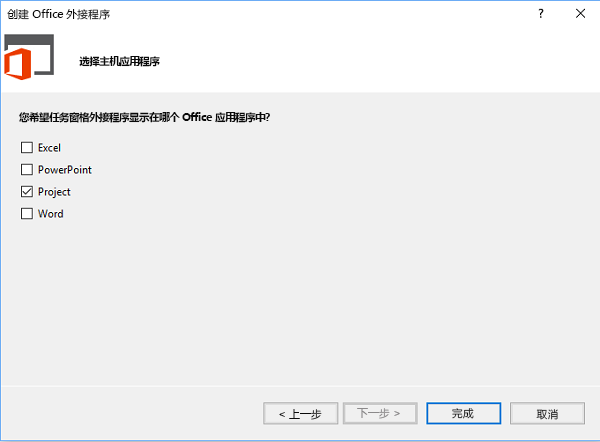
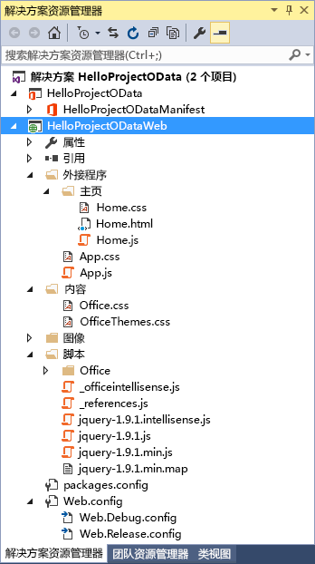
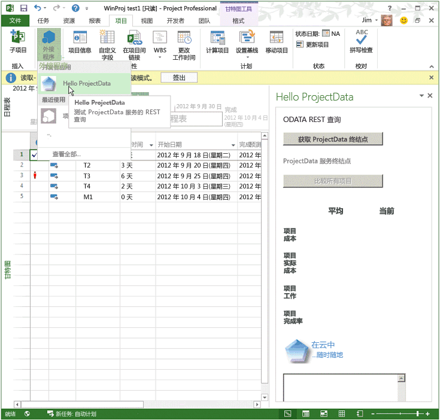
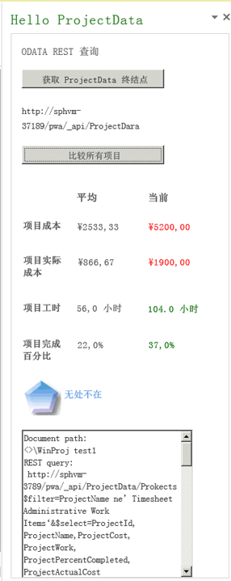
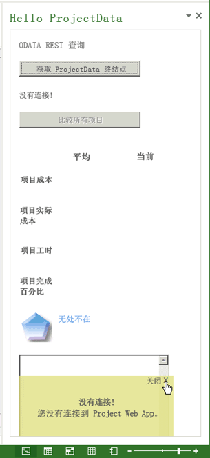
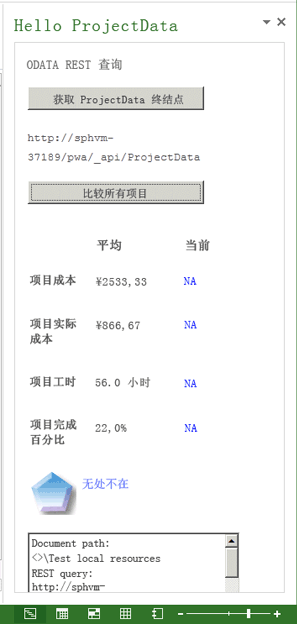

# <a name="create-a-project-add-in-that-uses-rest-with-an-on-premises-project-server-odata-service"></a>创建将 REST 与本地 Project Server OData 服务结合使用的 Project 加载项

本文介绍如何为 Project Professional 2013 构建一个任务窗格外接程序，以将活动项目中的成本和工作数据与当前 Project Web App 实例中的所有项目的平均值进行对比。该外接程序将 REST 与 jQuery 库结合使用来访问 Project Server 2013 中的 **ProjectData** OData 报告服务。


本文中的代码基于由 Microsoft Corporation 的 Saurabh Sanghvi 和 Arvind Iyer 开发的示例。

## <a name="prerequisites-for-creating-a-task-pane-add-in-that-reads-project-server-reporting-data"></a>创建可读取 Project Server 报告数据的任务窗格加载项的先决条件


以下是创建 Project 任务窗格加载项的先决条件，该加载项可读取内部部署安装的 Project Server 2013 中 Project Web App 实例的 **ProjectData** 服务：


- 确保您已在本地开发计算机上安装最新的 Service Pack 和 Windows 更新。操作系统可以是 Windows 7、Windows 8、Windows Server 2008 或 Windows Server 2012。
    
- Project Professional 2013 需要与 Project Web App 连接。开发计算机必须安装 Project Professional 2013 以使 Visual Studio 使用  **F5** 进行调试。
    
     >**注意**  Project Standard 2013 也可以承载主机任务窗格外接程序，但是无法登录到 Project Web App。
- 带有 Visual Studio 的 Office 开发人员工具的 Visual Studio 2015 中包括用于创建 Office 和 SharePoint 外接程序的模板。请确保你已安装最新版本的 Office 开发人员工具；请参阅 [Office 外接程序和 SharePoint 下载](http://msdn.microsoft.com/en-us/office/apps/fp123627.aspx)的_工具_部分。
    
- 本文中的过程和代码示例可访问本地域中 Project Server 2013 的  **ProjectData** 服务。本文中的 jQuery 方法不适用于 Project Online。
    
    验证可从你的开发计算机访问 **ProjectData** 服务。
    

### <a name="procedure-1-to-verify-that-the-projectdata-service-is-accessible"></a>过程 1. 确认可访问 ProjectData 服务


1- 若要使浏览器直接显示来自 REST 查询的 XML 数据，请关闭源阅读视图。有关如何在 Internet Explorer 中执行此操作的信息，请参阅 [查询 Project Server 2013 报告数据的 OData 源](http://msdn.microsoft.com/library/3eafda3b-f006-48be-baa6-961b2ed9fe01%28Office.15%29.aspx)中过程 1 的第 4 步。
    
2- 在浏览器中使用以下 URL 查询 **ProjectData** 服务：**http://ServerName /ProjectServerName /_api/ProjectData**。例如，如果 Project Web App 实例是 `http://MyServer/pwa`，浏览器会显示以下结果：
    
```xml
     <?xml version="1.0" encoding="utf-8"?>
        <service xml:base="http://myserver/pwa/_api/ProjectData/" 
        xmlns="http://www.w3.org/2007/app" 
        xmlns:atom="http://www.w3.org/2005/Atom">
        <workspace>
            <atom:title>Default</atom:title>
            <collection href="Projects">
                <atom:title>Projects</atom:title>
            </collection>
            <collection href="ProjectBaselines">
                <atom:title>ProjectBaselines</atom:title>
            </collection>
            <!-- ... and 33 more collection elements -->
        </workspace>
        </service>
```
3- 可能必须提供网络凭据才能查看结果。如果浏览器显示“错误 403，拒绝访问”，则你没有该 Project Web App 实例的登录权限，或者出现需要管理员帮助的网络问题。
    

## <a name="using-visual-studio-to-create-a-task-pane-add-in-for-project"></a>使用 Visual Studio 为 Project 创建任务窗格加载项

Visual Studio Office 开发人员工具包含 Project 2013 任务窗格外接程序的模板。如果您创建一个名为  **HelloProjectOData** 的解决方案，则该解决方案将包含以下两个 Visual Studio 项目：


- 加载项项目采用该解决方案的名称。它包含该加载项的 XML 清单文件并以 .NET Framework 4.5 为目标。过程 3 演示了修改  **HelloProjectOData** 加载项的清单的步骤。
    
- Web 项目名为  **HelloProjectODataWeb**。它在任务窗格中包含 Web 内容的网页、JavaScript 文件、CSS 文件、图像、引用和配置文件。Web 项目以 .NET Framework 4 为目标。过程 4 和过程 5 演示了如何修改 Web 项目中的文件以创建  **HelloProjectOData** 加载项的功能。
    

### <a name="procedure-2-to-create-the-helloprojectodata-add-in-for-project"></a>过程 2. 为 Project 创建 HelloProjectOData 加载项


1. 以管理员身份运行 Visual Studio 2015，然后在起始页上选择“新建项目”****。
    
2. 在“新建项目”****对话框中，展开“模板”****、“Visual C#”****和“Office/SharePoint”****节点，然后选择“Office 外接程序”。在中心窗格顶部的目标框架下拉列表中选择“.NET Framework 4.5.2”****，然后选择“Office 外接程序”****（请参阅下一个屏幕截图）。
    
3. 若要将这两个 Visual Studio 项目置于同一目录中，请选择“**创建解决方案的目录**”，然后浏览到所需位置。
    
4. 在“**名称**”字段中键入“HelloProjectOData”，然后选择“**确定**”。
    
    **创建 Office 外接程序**

    

5. 在“**选择外接程序类型**”对话框中，选择“**任务窗格**”，然后选择“**下一步**”（请参阅下一个屏幕截图）。
    
    **选择要创建的外接程序类型**

    

6. 在“**选择主机应用程序**”对话框中，清除除“**项目**”复选框以外的所有复选框（请参阅下一个屏幕截图），然后选择“**完成**”。
    
    **选择主机应用程序**

    
    
    Visual Studio 创建 **HelloProjectOdata** 项目和 **HelloProjectODataWeb** 项目。
    
“**外接程序**”文件夹（请参阅下一个屏幕截图）中包含自定义 CSS 样式的 App.css 文件。在“**主页**”子文件夹中，Home.html 文件中包含外接程序使用的 CSS 文件和 JavaScript 文件的引用，及用于外接程序的 HTML5 内容。此外，Home.js 文件用于自定义 JavaScript 代码。“**脚本**”文件夹中包括 jQuery 库文件。“**Office**”子文件夹中包括 JavaScript 库（例如 office.js 和 project-15.js），及 Office 外接程序中的标准字符串的语言库。在“**内容**”文件夹中，Office.css 文件包含所有的 Office 外接程序的默认样式。

**在解决方案资源管理器中查看默认 Web 项目文件**



**HelloProjectOData** 项目的清单是 HelloProjectOData.xml 文件。你可以根据需要修改该清单，以添加有关加载项的描述、对图标的引用、其他语言的信息和其他设置。过程 3 只修改了加载项显示名称和描述，并添加了一个图标。

有关清单的详细信息，请参阅 [Office 外接程序 XML 清单](../../docs/overview/add-in-manifests.md)和 [Office 外接程序清单的架构参考 (v1.1)](../overview/add-in-manifests.md)。


### <a name="procedure-3-to-modify-the-add-in-manifest"></a>过程 3. 修改加载项清单


1. 在 Visual Studio 中，打开 HelloProjectOData.xml 文件。
    
2. 默认显示名称是 Visual Studio 项目名称（"HelloProjectOData"）。例如，将  **DisplayName** 元素的默认值更改为"Hello ProjectData"。
    
3. 默认描述也是"HelloProjectOData"。例如，将 Description 元素的默认值更改为"测试 ProjectData 服务的 REST 查询"。
    
4. 添加图标以显示在功能区的“**项目**”选项卡上的“**Office 外接程序**”下拉列表中。你可以在 Visual Studio 解决方案中添加图标文件或使用图标的 URL。 

下列步骤显示如何向 Visual Studio 解决方案添加图标文件：
    
1. 在“**解决方案资源管理器**”中，请转到名为“图像”的文件夹。
    
2. 若要显示在“**Office 外接程序**”下拉列表中，图标的像素必须为 32 x 32。例如，安装 Project 2013 SDK，然后选择“**图像**”文件夹并添加 SDK 的以下文件：`\Samples\Apps\HelloProjectOData\HelloProjectODataWeb\Images\NewIcon.png`
    
    Alternately, use your own 32 x 32 icon; or, copy the following image to a file named NewIcon.png, and then add that file to the  `HelloProjectODataWeb\Images` folder: 

3. 在 HelloProjectOData.xml 清单中，在 **Description** 元素下面添加一个 **IconUrl** 元素，其中图标 URL 的值是指向 32x32 图标文件的相对路径。例如，添加以下行：**<IconUrl DefaultValue="~remoteAppUrl/Images/NewIcon.png" />**。HelloProjectOData.xml 清单文件现在包含以下内容（你的 **Id** 值将不同）：

```XML
    <?xml version="1.0" encoding="UTF-8"?>
    <OfficeApp xmlns="http://schemas.microsoft.com/office/appforoffice/1.1" 
           xmlns:xsi="http://www.w3.org/2001/XMLSchema-instance" xsi:type="TaskPaneApp">
        <Id>c512df8d-a1c5-4d74-8a34-d30f6bbcbd82 </Id>
        <Version>1.0</Version>
        <ProviderName> [Provider name]</ProviderName>
        <DefaultLocale>en-US</DefaultLocale>
        <DisplayName DefaultValue="Hello ProjectData" />
        <Description DefaultValue="Test REST queries of the ProjectData service"/>
        <IconUrl DefaultValue="~remoteAppUrl/Images/NewIcon.png" />
    
        <Hosts>
            <Host Name="Project" />
        </Hosts>
        <DefaultSettings>
            <SourceLocation DefaultValue="~remoteAppUrl/AddIn/Home/Home.html" />
        </DefaultSettings>
        <Permissions>ReadWriteDocument</Permissions>
    </OfficeApp>
```

## <a name="creating-the-html-content-for-the-helloprojectodata-add-in"></a>为 HelloProjectOData 加载项创建 HTML 内容

**HelloProjectOData** 外接程序是包括调试和错误输出的示例；不能用于生产目的。在开始编写 HTML 内容代码之前，要先设计外接程序的 UI 和用户体验，并概括与 HTML 代码交互的 JavaScript 函数。有关详细信息，请参阅 [Office 外接程序的设计准则](../../docs/design/add-in-design.md)。 

任务窗格将在顶部显示外接程序的显示名称，该名称是清单中  **DisplayName** 元素的值。HelloProjectOData.html 文件中的 **body** 元素包含其他 UI 元素，如下所示：

- 副标题指示常规功能或操作类型，例如“**ODATA REST 查询**”。
    
- “**获取 ProjectData 端点**”按钮调用 **setOdataUrl** 函数以获取 **ProjectData** 服务的端点，并将其显示在文本框中。如果 Project 未连接 Project Web App，则外接程序会调用一个错误处理程序来显示一个弹出错误消息。
    
- 外接程序获取有效的 OData 终结点前，“**比较所有项目**”按钮处于禁用状态。选择该按钮时，它将调用 **retrieveOData** 函数，该函数使用 REST 查询从 **ProjectData** 服务中获取项目成本和工作数据。
    
- 表格将显示项目成本、实际成本、工作和完成百分比的平均值。表格还会将当前的活动项目值和平均值进行比较。如果当前值大于所有项目的平均值，则此值将显示为红色。如果当前值小于平均值，则此值将显示为绿色。如果当前值不可用，则表格显示蓝色的 **NA**。
    
    **retrieveOData** 函数调用 **parseODataResult** 函数，后者计算并显示表格的值。
    
     >**注意**  在本示例中，活动项目的成本和工作数据源于已发布值。如果在 Project 中更改值，那么在项目发布之前 **ProjectData** 服务不会具有这些更改。


### <a name="procedure-4-to-create-the-html-content"></a>过程 4. 创建 HTML 内容

1. 在 Home.html 文件的  **head** 元素中，为外接程序使用的 CSS 文件添加任何其他 **link** 元素。Visual Studio 项目模板包含一个指向可用于自定义 CSS 样式的 App.css 文件的链接。
    
2. 为外接程序使用的 JavaScript 库添加任何其他的 **script** 元素。此项目模板包括 jQuery - _[version]_.js、office.js 和 **Scripts** 文件夹中的 MicrosoftAjax.js 文件的链接。
    
     >**注意**  部署加载项之前，请将 office.js 引用和 jQuery 引用更改为内容发布网络 (CDN) 引用。CDN 引用可提供最新的版本和更好的性能。

    **HelloProjectOData** 外接程序还会使用 SurfaceErrors.js 文件，该文件会在弹出消息中显示错误。可以从 [通过使用文本编辑器创建第一个用于 Project 2013 的任务窗格外接程序](../project/create-your-first-task-pane-add-in-for-project-by-using-a-text-editor.md) 的_可靠编程_部分复制代码，然后在 **HelloProjectODataWeb** 项目的 **Scripts\Office** 文件夹中添加 SurfaceErrors.js 文件。
    
    下面是 **head** 元素的更新 HTML 代码，其中包含 SurfaceErrors.js 文件的附加行：
    
```html
      <!DOCTYPE html>
    <html>
    <head>
      <meta charset="UTF-8" />
      <meta http-equiv="X-UA-Compatible" content="IE=Edge" />
      <title>Test ProjectData Service</title>
    
      <link rel="stylesheet" type="text/css" href="../Content/Office.css" />
    
      <!-- Add your CSS styles to the following file -->
      <link rel="stylesheet" type="text/css" href="../Content/App.css" />
    
      <!-- Use the CDN reference to the mini-version of jQuery when deploying your add-in. -->
      <!--<script src="http://ajax.aspnetcdn.com/ajax/jquery/jquery-1.9.0.min.js"></script> -->
      <script src="../Scripts/jquery-1.7.1.js"></script>
    
      <!-- Use the CDN reference to office.js when deploying your add-in. -->
      <!--<script src="https://appsforoffice.microsoft.com/lib/1/hosted/office.js"></script>-->
    
      <!-- Use the local script references for Office.js to enable offline debugging -->
      <script src="../Scripts/Office/1.0/MicrosoftAjax.js"></script>
      <script src="../Scripts/Office/1.0/Office.js"></script>
    
      <!-- Add your JavaScript to the following files -->
      <script src="../Scripts/HelloProjectOData.js"></script>
      <script src="../Scripts/SurfaceErrors.js"></script>
    </head>
    <body>
    <!-- See the code in Step 3. -->
    </body>
    </html>
```

3. 在  **body** 元素中，删除模板中的现有代码，然后添加用户界面的代码。如果某个元素要用数据来填充或由 jQuery 语句控制，则该元素必须包含唯一的 **id** 属性。在以下代码中， jQuery 函数使用的 **button**、 **span** 和 **td**（表单元格定义）元素的  **id** 属性以粗体显示。
    
    以下 HTML 添加图形图像，这可以是公司徽标。你可以使用所选的徽标，或从 Project 2013 SDK 下载复制 NewLogo.png 文件，然后使用**解决方案资源管理器**将文件添加到 `HelloProjectODataWeb\Images` 文件夹。
    


```HTML
      <body>
      <div id="SectionContent">
        <div id="odataQueries">
          ODATA REST QUERY
        </div>
        <div id="odataInfo">
          <button class="button-wide" onclick="setOdataUrl()">Get ProjectData Endpoint</button>
          <br /><br />
          <span class="rest" id="projectDataEndPoint">Endpoint of the 
            <strong>ProjectData</strong> service</span>
          <br />
        </div>
        <div id="compareProjectData">
          <button class="button-wide" disabled="disabled" id="compareProjects"
            onclick="retrieveOData()">Compare All Projects</button>
          <br />
        </div>
      </div>
      <div id="corpInfo">
        <table class="infoTable" aria-readonly="True" style="width: 100%;">
          <tr>
            <td class="heading_leftCol"></td>
            <td class="heading_midCol"><strong>Average</strong></td>
            <td class="heading_rightCol"><strong>Current</strong></td>
          </tr>
          <tr>
            <td class="row_leftCol"><strong>Project Cost</strong></td>
            <td class="row_midCol" id="AverageProjectCost">&amp;nbsp;</td>
            <td class="row_rightCol" id="CurrentProjectCost">&amp;nbsp;</td>
          </tr>
          <tr>
            <td class="row_leftCol"><strong>Project Actual Cost</strong></td>
            <td class="row_midCol" id="AverageProjectActualCost">&amp;nbsp;</td>
            <td class="row_rightCol" id="CurrentProjectActualCost">&amp;nbsp;</td>
          </tr>
          <tr>
            <td class="row_leftCol"><strong>Project Work</strong></td>
            <td class="row_midCol" id="AverageProjectWork">&amp;nbsp;</td>
            <td class="row_rightCol" id="CurrentProjectWork">&amp;nbsp;</td>
          </tr>
          <tr>
            <td class="row_leftCol"><strong>Project % Complete</strong></td>
            <td class="row_midCol" id="AverageProjectPercentComplete">&amp;nbsp;</td>
            <td class="row_rightCol" id="CurrentProjectPercentComplete">&amp;nbsp;</td>
          </tr>
        </table>
      </div>
      
      <br />
      <textarea id="odataText" rows="12" cols="40"></textarea>
    </body>
```


## <a name="creating-the-javascript-code-for-the-add-in"></a>为加载项创建 JavaScript 代码


Project 任务窗格加载项的模板包含旨在演示关于典型 Office 2013 加载项文档中的数据的基本获取和设置操作的默认初始化代码。由于 Project 2013 不支持写入活动项目的操作，并且  **HelloProjectOData** 加载项不使用 **getSelectedDataAsync** 方法，因此可以删除 **Office.initialize** 函数内的脚本，以及删除默认 HelloProjectOData.js 文件中的 **setData** 函数和 **getData** 函数。

JavaScript 中包括用于 REST 查询的全局常数和用于多个函数的全局变量。“**获取 ProjectData 端点**”按钮调用 **setOdataUrl** 函数，此函数初始化全局变量并确定 Project 是否连接到 Project Web App。

HelloProjectOData.js 文件的剩余部分包含两个函数：当用户选择“**比较所有项目**”时会调用 **retrieveOData** 函数；**parseODataResult** 函数可计算平均值并使用设置好颜色和单位的值填充对照表。


### <a name="procedure-5-to-create-the-javascript-code"></a>过程 5. 创建 JavaScript 代码


1. 删除默认 HelloProjectOData.js 文件中的所有代码，然后添加全局变量和  **Office.initialize** 函数。变量名称全部大写表示它们是常量；稍后它们将与 **_pwa** 变量一起用于在此示例中创建 REST 查询。
    
```js
      var PROJDATA = "/_api/ProjectData";
    var PROJQUERY = "/Projects?";
    var QUERY_FILTER = "$filter=ProjectName ne 'Timesheet Administrative Work Items'";
    var QUERY_SELECT1 = "&amp;$select=ProjectId, ProjectName";
    var QUERY_SELECT2 = ", ProjectCost, ProjectWork, ProjectPercentCompleted, ProjectActualCost";
    var _pwa;           // URL of Project Web App.
    var _projectUid;    // GUID of the active project.
    var _docUrl;        // Path of the project document.
    var _odataUrl = ""; // URL of the OData service: http[s]://ServerName /ProjectServerName /_api/ProjectData
    
    // The initialize function is required for all add-ins.
    Office.initialize = function (reason) {
        // Checks for the DOM to load using the jQuery ready function.
        $(document).ready(function () {
            // After the DOM is loaded, app-specific code can run.
        });
    }
```

2. 添加 **setOdataUrl** 和相关函数。**setOdataUrl** 函数调用 **getProjectGuid** 和 **getDocumentUrl** 以初始化全局变量。在 [getProjectFieldAsync method](../../reference/shared/projectdocument.getprojectfieldasync.md) 中，_callback_ 参数的匿名函数通过使用 jQuery 库中的 **removeAttr** 方法启用“**比较所有项目**”按钮，并显示 **ProjectData** 服务的 URL。如果 Project 未连接 Project Web App，则函数会提示错误，该错误会显示一个弹出错误消息。SurfaceErrors.js 文件中包括 **throwError** 方法。
    
     >**注意**  如果在装有 Project Server 的计算机上运行 Visual Studio，若要使用 **F5** 调试，请取消注释初始化 **_pwa** 全局变量的行后的代码。若要在装有 Project Server 计算机上进行调试时使用 jQuery **ajax** 方法启用，必须设置 PWA URL 的 **ocalhost** 值。如果在远程计算机上运行 Visual Studio，那么 **localhost** URL 不是必需的。在部署外接程序前，请注释该代码。

```js
      function setOdataUrl() {
        Office.context.document.getProjectFieldAsync(
            Office.ProjectProjectFields.ProjectServerUrl,
            function (asyncResult) {
                if (asyncResult.status == Office.AsyncResultStatus.Succeeded) {
                    _pwa = String(asyncResult.value.fieldValue);
    
                    // If you debug with Visual Studio on a local Project Server computer, 
                    // uncomment the following lines to use the localhost URL.
                    //var localhost = location.host.split(":", 1);
                    //var pwaStartPosition = _pwa.lastIndexOf("/");
                    //var pwaLength = _pwa.length - pwaStartPosition;
                    //var pwaName = _pwa.substr(pwaStartPosition, pwaLength);
                    //_pwa = location.protocol + "//" + localhost + pwaName;
    
                    if (_pwa.substring(0, 4) == "http") {
                        _odataUrl = _pwa + PROJDATA;
                        $("#compareProjects").removeAttr("disabled");
                        getProjectGuid();
                    }
                    else {
                        _odataUrl = "No connection!";
                        throwError(_odataUrl, "You are not connected to Project Web App.");
                    }
                    getDocumentUrl();
                    $("#projectDataEndPoint").text(_odataUrl);
                }
                else {
                    throwError(asyncResult.error.name, asyncResult.error.message);
                }
            }
        );
    }

    // Get the GUID of the active project.
    function getProjectGuid() {
        Office.context.document.getProjectFieldAsync(
            Office.ProjectProjectFields.GUID,
            function (asyncResult) {
                if (asyncResult.status == Office.AsyncResultStatus.Succeeded) {
                    _projectUid = asyncResult.value.fieldValue;
                }
                else {
                    throwError(asyncResult.error.name, asyncResult.error.message);
                }
            }
        );
    }
    
    // Get the path of the project in Project web app, which is in the form <>\ProjectName .
    function getDocumentUrl() {
        _docUrl = "Document path:\r\n" + Office.context.document.url;
    }
```

3. 添加 **retrieveOData** 函数，此函数连接 REST 查询的值并调用 jQuery 中的 **ajax** 函数以获取 **ProjectData** 服务中的请求数据。**support.cors** 变量通过 **ajax** 函数启用跨域资源共享 (CORS)。如果 **support.cors** 语句丢失或设置为 **false**，则 **ajax** 函数会返回一个**无传输**错误。
    
     >**注意**  以下代码可用于 Project Server 2013 的本地安装。对于 Project Online，可以使用 OAuth 进行基于令牌的身份验证。有关详细信息，请参阅 [解决 Office 外接程序中的同源策略限制](../../docs/develop/addressing-same-origin-policy-limitations.md)。

    在 **ajax** 调用中，可以使用 _headers_ 参数或 _beforeSend_ 参数。_complete_ 参数是匿名函数，因此，它与 **retrieveOData** 中的变量位于同一作用域。_complete_ 参数的函数在 **odataText** 控件中显示结果，并且还调用 **parseODataResult** 方法来分析和显示 JSON 响应。_error_ 参数指定命名的 **getProjectDataErrorHandler** 函数，该函数将错误消息写入 **odataText** 控件，并且还使用 **throwError** 方法显示一条弹出消息。
    


```js
      /****************************************************************
    * Functions to get and parse the Project Server reporting data.
    *****************************************************************/
    
    // Get data about all projects on Project Server, 
    // by using a REST query with the ajax method in jQuery.
    function retrieveOData() {
        var restUrl = _odataUrl + PROJQUERY + QUERY_FILTER + QUERY_SELECT1 + QUERY_SELECT2;
        var accept = "application/json; odata=verbose";
        accept.toLocaleLowerCase();
    
        // Enable cross-origin scripting (required by jQuery 1.5 and later).
        // This does not work with Project Online.
        $.support.cors = true;
    
        $.ajax({
            url: restUrl,
            type: "GET",
            contentType: "application/json",
            data: "",      // Empty string for the optional data.
            //headers: { "Accept": accept },
            beforeSend: function (xhr) {
                xhr.setRequestHeader("ACCEPT", accept);
            },
            complete: function (xhr, textStatus) {
                // Create a message to display in the text box.
                var message = "\r\ntextStatus: " + textStatus +
                    "\r\nContentType: " + xhr.getResponseHeader("Content-Type") +
                    "\r\nStatus: " + xhr.status +
                    "\r\nResponseText:\r\n" + xhr.responseText;
    
                // xhr.responseText is the result from an XmlHttpRequest, which 
                // contains the JSON response from the OData service.
                parseODataResult(xhr.responseText, _projectUid);
    
                // Write the document name, response header, status, and JSON to the odataText control.
                $("#odataText").text(_docUrl);
                $("#odataText").append("\r\nREST query:\r\n" + restUrl);
                $("#odataText").append(message);
    
                if (xhr.status != 200 &amp;&amp; xhr.status != 1223 &amp;&amp; xhr.status != 201) {
                    $("#odataInfo").append("<div>" + htmlEncode(restUrl) + "</div>");
                }
            },
            error: getProjectDataErrorHandler
        });
    }
    
    function getProjectDataErrorHandler(data, errorCode, errorMessage) {
        $("#odataText").text("Error code: " + errorCode + "\r\nError message: \r\n"
          + errorMessage);
        throwError(errorCode, errorMessage);
    }
```

4. 添加  **parseODataResult** 方法，该方法可反序列化和处理来自 OData 服务的 JSON 响应。 **parseODataResult** 方法将成本和工作数据的平均值精确计算到一或两位小数位、为值设置正确的颜色格式并添加单位（ **$**、 **hrs** 或 **%**），然后在指定的表单元格中显示这些值。
    
    如果活动项目的 GUID 与 **ProjectId** 值匹配，则将 **myProjectIndex** 变量设置为项目索引。如果 **myProjectIndex** 表示活动项目已发布到 Project Server 上，则 **parseODataResult** 方法会格式化并显示该项目的成本和工作数据。如果活动项目尚未发布，则活动项目的值会显示为一个蓝色 **NA**。
    


```js
      // Calculate the average values of actual cost, cost, work, and percent complete   
    // for all projects, and compare with the values for the current project.
    function parseODataResult(oDataResult, currentProjectGuid) {
        // Deserialize the JSON string into a JavaScript object.
        var res = Sys.Serialization.JavaScriptSerializer.deserialize(oDataResult);
        var len = res.d.results.length;
        var projActualCost = 0;
        var projCost = 0;
        var projWork = 0;
        var projPercentCompleted = 0;
        var myProjectIndex = -1;
        for (i = 0; i < len; i++) {
            // If the current project GUID matches the GUID from the OData query,  
            // store the project index.
            if (currentProjectGuid.toLocaleLowerCase() == res.d.results[i].ProjectId) {
                myProjectIndex = i;
            }
            projCost += Number(res.d.results[i].ProjectCost);
            projWork += Number(res.d.results[i].ProjectWork);
            projActualCost += Number(res.d.results[i].ProjectActualCost);
            projPercentCompleted += Number(res.d.results[i].ProjectPercentCompleted);
        }
        var avgProjCost = projCost / len;
        var avgProjWork = projWork / len;
        var avgProjActualCost = projActualCost / len;
        var avgProjPercentCompleted = projPercentCompleted / len;
        
        // Round off cost to two decimal places, and round off other values to one decimal place.
        avgProjCost = avgProjCost.toFixed(2);
        avgProjWork = avgProjWork.toFixed(1);
        avgProjActualCost = avgProjActualCost.toFixed(2);
        avgProjPercentCompleted = avgProjPercentCompleted.toFixed(1);
        
        // Display averages in the table, with the correct units. 
        document.getElementById("AverageProjectCost").innerHTML = "$"
            + avgProjCost;
        document.getElementById("AverageProjectActualCost").innerHTML
            = "$" + avgProjActualCost;
        document.getElementById("AverageProjectWork").innerHTML
            = avgProjWork + " hrs";
        document.getElementById("AverageProjectPercentComplete").innerHTML
            = avgProjPercentCompleted + "%";
            
        // Calculate and display values for the current project.
        if (myProjectIndex != -1) {
            var myProjCost = Number(res.d.results[myProjectIndex].ProjectCost);
            var myProjWork = Number(res.d.results[myProjectIndex].ProjectWork);
            var myProjActualCost = Number(res.d.results[myProjectIndex].ProjectActualCost);
            var myProjPercentCompleted =
              Number(res.d.results[myProjectIndex].ProjectPercentCompleted);
              
            myProjCost = myProjCost.toFixed(2);
            myProjWork = myProjWork.toFixed(1);
            myProjActualCost = myProjActualCost.toFixed(2);
            myProjPercentCompleted = myProjPercentCompleted.toFixed(1);
            
            document.getElementById("CurrentProjectCost").innerHTML = "$" + myProjCost;
            
            if (Number(myProjCost) <= Number(avgProjCost)) {
                document.getElementById("CurrentProjectCost").style.color = "green"
            }
            else {
                document.getElementById("CurrentProjectCost").style.color = "red"
            }
            
            document.getElementById("CurrentProjectActualCost").innerHTML = "$" + myProjActualCost;
            
            if (Number(myProjActualCost) <= Number(avgProjActualCost)) {
                document.getElementById("CurrentProjectActualCost").style.color = "green"
            }
            else {
                document.getElementById("CurrentProjectActualCost").style.color = "red"
            }
            
            document.getElementById("CurrentProjectWork").innerHTML = myProjWork + " hrs";
            
            if (Number(myProjWork) <= Number(avgProjWork)) {
                document.getElementById("CurrentProjectWork").style.color = "red"
            }
            else {
                document.getElementById("CurrentProjectWork").style.color = "green"
            }
            
            document.getElementById("CurrentProjectPercentComplete").innerHTML = myProjPercentCompleted + "%";
            
            if (Number(myProjPercentCompleted) <= Number(avgProjPercentCompleted)) {
                document.getElementById("CurrentProjectPercentComplete").style.color = "red"
            }
            else {
                document.getElementById("CurrentProjectPercentComplete").style.color = "green"
            }
        }
        else {
            document.getElementById("CurrentProjectCost").innerHTML = "NA";
            document.getElementById("CurrentProjectCost").style.color = "blue"
            
            document.getElementById("CurrentProjectActualCost").innerHTML = "NA";
            document.getElementById("CurrentProjectActualCost").style.color = "blue"
            
            document.getElementById("CurrentProjectWork").innerHTML = "NA";
            document.getElementById("CurrentProjectWork").style.color = "blue"
            
            document.getElementById("CurrentProjectPercentComplete").innerHTML = "NA";
            document.getElementById("CurrentProjectPercentComplete").style.color = "blue"
        }
    }
```


## <a name="testing-the-helloprojectodata-add-in"></a>测试 HelloProjectOData 加载项


若要使用 Visual Studio 2015 测试并调试  **HelloProjectOData** 外接程序，您必须在开发计算机上安装 Project Professional 2013。若要启用不同的测试方案，请确保您可以选择 Project 打开本地计算机文件还是与 Project Web App 连接。例如，执行下列步骤：


1. 在功能区的“**文件**”选项卡上，选择 Backstage 视图中的“**信息**”选项卡，然后选择“**管理帐户**”。
    
2. 在“**Project Web App 帐户**”对话框中，“**可用帐户**”列表除了有本地“**计算机**”帐户外还可以有多个 Project Web App 帐户。在“**准备工作**”部分，选择“**选择帐户**”。
    
3. 关闭 Project 以便 Visual Studio 能够启动它以对加载项进行调试。
    
基本测试应当包括以下内容：


- 从 Visual Studio 运行加载项，然后从 Project Web App 中打开一个包含成本和工作数据的已发布项目。确认加载项显示  **ProjectData** 终结点并在表格中正确显示成本和工作数据。您可以使用 **odataText** 控件中的输出来检查 REST 查询和其他信息。
    
- 再次运行外接程序，Project 启动时，在“**登录**”对话框中选择本地计算机配置文件。打开本地的 .mpp 文件，然后测试外接程序。验证在尝试获取 **ProjectData** 终结点时外接程序是否显示错误消息。
    
- 再次运行外接程序，在此过程中创建含有附带成本和工作数据任务的项目。你可以将此项目保存到 Project Web App 中，但请勿将其发布。验证外接程序是否显示 Project 服务器中的信息，但当前项目**不可用**。
    

### <a name="procedure-6-to-test-the-add-in"></a>过程 6. 测试加载项


1. 运行 Project Professional 2013，与 Project Web App 连接，然后创建一个测试项目。将任务分配到本地资源或企业资源，对部分任务设置不同的完成百分比值，然后发布该项目。退出 Project，从而让 Visual Studio 启动 Project 以对加载项进行调试。
    
2. 在 Visual Studio 中，按  **F5**。登录 Project Web App，然后打开在上一步中创建的项目。您可以只读模式或编辑模式打开该项目。
    
3. 在功能区的“**项目**”选项卡上的“**Office 外接程序**”下拉列表中，选择“**Hello ProjectData**”（见图 4）。“**比较所有项目**”按钮应禁用。
    
    **图 4.启动 HelloProjectOData 外接程序**

    

4. 在“**Hello ProjectData**”任务窗格中，选择“**获取 ProjectData 终结点**”。**projectDataEndPoint** 行应显示 **ProjectData** 服务的 URL，且“**比较所有项目**”按钮应启用（见图 5）。
    
5. 选择“**比较所有项目**”。外接程序在从 **ProjectData** 服务中检索数据时可能会暂停，然后会在表格中显示带有格式的平均值和当前值。
    
    **图 5.查看 REST 查询的结果**

    

6. 查看文本框中的输出。该输出应当显示来自对  **ajax** 和 **parseODataResult** 的调用的文档路径、REST 查询、状态信息和 JSON 结果。该输出有助于了解、创建和调试 **parseODataResult** 方法中的代码，如 `projCost += Number(res.d.results[i].ProjectCost);`。
    
    下面是一个输出示例，为清晰起见，该输出在 Project Web App 实例的三个项目中将换行符和空格添加到文本中：
    


```
          Document path: <>\WinProj test1
    
        REST query:
        http://sphvm-37189/pwa/_api/ProjectData/Projects?$filter=ProjectName ne 'Timesheet Administrative Work Items'
            &amp;$select=ProjectId, ProjectName, ProjectCost, ProjectWork, ProjectPercentCompleted, ProjectActualCost
        
        textStatus: success
        ContentType: application/json;odata=verbose;charset=utf-8
        Status: 200
        
        ResponseText:
        {"d":{"results":[
        {"__metadata":
            {"id":"http://sphvm-37189/pwa/_api/ProjectData/Projects(guid'ce3d0d65-3904-e211-96cd-00155d157123')",
            "uri":"http://sphvm-37189/pwa/_api/ProjectData/Projects(guid'ce3d0d65-3904-e211-96cd-00155d157123')",
            "type":"ReportingData.Project"},
            "ProjectId":"ce3d0d65-3904-e211-96cd-00155d157123",
            "ProjectActualCost":"0.000000",
            "ProjectCost":"0.000000",
            "ProjectName":"Task list created in PWA",
            "ProjectPercentCompleted":0,
            "ProjectWork":"16.000000"},
        {"__metadata":
            {"id":"http://sphvm-37189/pwa/_api/ProjectData/Projects(guid'c31023fc-1404-e211-86b2-3c075433b7bd')",
            "uri":"http://sphvm-37189/pwa/_api/ProjectData/Projects(guid'c31023fc-1404-e211-86b2-3c075433b7bd')",
            "type":"ReportingData.Project"},
            "ProjectId":"c31023fc-1404-e211-86b2-3c075433b7bd",
            "ProjectActualCost":"700.000000",
            "ProjectCost":"2400.000000",
            "ProjectName":"WinProj test 2",
            "ProjectPercentCompleted":29,
            "ProjectWork":"48.000000"},
        {"__metadata":
            {"id":"http://sphvm-37189/pwa/_api/ProjectData/Projects(guid'dc81fbb2-b801-e211-9d2a-3c075433b7bd')",
            "uri":"http://sphvm-37189/pwa/_api/ProjectData/Projects(guid'dc81fbb2-b801-e211-9d2a-3c075433b7bd')",
            "type":"ReportingData.Project"},
            "ProjectId":"dc81fbb2-b801-e211-9d2a-3c075433b7bd",
            "ProjectActualCost":"1900.000000",
            "ProjectCost":"5200.000000",
            "ProjectName":"WinProj test1",
            "ProjectPercentCompleted":37,
            "ProjectWork":"104.000000"}
        ]}}
```

7. 停止调试（按 **Shift + F5**），然后再次按 **F5** 以运行新的 Project 实例。在“**登录**”对话框中，选择本地的“**计算机**”配置文件，而不是 Project Web App。创建或打开本地项目 .mpp 文件，打开“**Hello ProjectData**”任务窗格，然后选择“**获取 ProjectData 终结点**”。外接程序应显示**无连接!**错误（见图 6），且“**比较所有项目**”按钮应保持禁用状态。
    
    **图 6.使用没有 Project Web App 连接的外接程序**

    

8. 停止调试，然后再次按  **F5**。登录 Project Web App，然后创建一个包含成本和工作数据的项目。您可以保存该项目，但不发布它。
    
    在“**Hello ProjectData**”任务窗格中，选择“**比较所有项目**”，你应该会看到 **Current** 列的字段中的蓝色 **NA**（请参见图 7）。
    

    **图 7.将未发布的项目与其他项目进行比较**

    

即使您的加载项在上述测试中运行正常，也应运行其他测试。例如：

- 打开 Project Web App 中的一个项目，其中不含任务的任何成本或工作数据。你应该可以在“**当前**”列的字段中看到为 zero 的值。
    
- 测试一个没有任务的项目。
    
- 如果修改加载项并发布它，您应当对已发布的加载项再次运行类似的测试。有关其他注意事项，请参阅 [后续步骤](#next-steps)。
    

 >**注释**  在  **ProjectData** 服务的一次查询中可返回的数据量有限制；数据量因实体而异。例如， **Projects** 实体集的默认限制为每次查询 100 个项目，但 **Risks** 实体集的默认限制为 200。对于生产安装， **HelloProjectOData** 示例中的代码应进行修改以支持多于 100 个项目的查询。有关详细信息，请参阅 [后续步骤](#next-steps)和 [查询 Project Server 2013 报告数据的 OData 源](http://msdn.microsoft.com/library/3eafda3b-f006-48be-baa6-961b2ed9fe01%28Office.15%29.aspx)。


## <a name="example-code-for-the-helloprojectodata-add-in"></a>HelloProjectOData 加载项的示例代码


 **HelloProjectOData.html 文件**???以下代码出自  **HelloProjectODataWeb** 项目的 `Pages\HelloProjectOData.html` 文件：


```html
    <!DOCTYPE html>
    <html>
    <head>
      <meta charset="UTF-8" />
      <meta http-equiv="X-UA-Compatible" content="IE=Edge" />
      <title>Test ProjectData Service</title>
    
      <link rel="stylesheet" type="text/css" href="../Content/Office.css" />
    
      <!-- Add your CSS styles to the following file -->
      <link rel="stylesheet" type="text/css" href="../Content/App.css" />
    
      <!-- Use the CDN reference to the mini-version of jQuery when deploying your add-in. -->
      <!--<script src="http://ajax.aspnetcdn.com/ajax/jquery/jquery-1.9.0.min.js"></script> -->
      <script src="../Scripts/jquery-1.7.1.js"></script>
    
      <!-- Use the CDN reference to Office.js when deploying your add-in -->
      <!--<script src="https://appsforoffice.microsoft.com/lib/1/hosted/office.js"></script>-->
    
      <!-- Use the local script references for Office.js to enable offline debugging -->
      <script src="../Scripts/Office/1.0/MicrosoftAjax.js"></script>
      <script src="../Scripts/Office/1.0/Office.js"></script>
    
      <!-- Add your JavaScript to the following files -->
      <script src="../Scripts/HelloProjectOData.js"></script>
      <script src="../Scripts/SurfaceErrors.js"></script>
    </head>
    <body>
      <div id="SectionContent">
        <div id="odataQueries">
          ODATA REST QUERY
        </div>
        <div id="odataInfo">
          <button class="button-wide" onclick="setOdataUrl()">Get ProjectData Endpoint</button>
          <br />
          <br />
          <span class="rest" id="projectDataEndPoint">Endpoint of the 
            <strong>ProjectData</strong> service</span>
          <br />
        </div>
        <div id="compareProjectData">
          <button class="button-wide" disabled="disabled" id="compareProjects"
            onclick="retrieveOData()">
            Compare All Projects</button>
          <br />
        </div>
      </div>
      <div id="corpInfo">
        <table class="infoTable" aria-readonly="True" style="width: 100%;">
          <tr>
            <td class="heading_leftCol"></td>
            <td class="heading_midCol"><strong>Average</strong></td>
            <td class="heading_rightCol"><strong>Current</strong></td>
          </tr>
          <tr>
            <td class="row_leftCol"><strong>Project Cost</strong></td>
            <td class="row_midCol" id="AverageProjectCost">&amp;nbsp;</td>
            <td class="row_rightCol" id="CurrentProjectCost">&amp;nbsp;</td>
          </tr>
          <tr>
            <td class="row_leftCol"><strong>Project Actual Cost</strong></td>
            <td class="row_midCol" id="AverageProjectActualCost">&amp;nbsp;</td>
            <td class="row_rightCol" id="CurrentProjectActualCost">&amp;nbsp;</td>
          </tr>
          <tr>
            <td class="row_leftCol"><strong>Project Work</strong></td>
            <td class="row_midCol" id="AverageProjectWork">&amp;nbsp;</td>
            <td class="row_rightCol" id="CurrentProjectWork">&amp;nbsp;</td>
          </tr>
          <tr>
            <td class="row_leftCol"><strong>Project % Complete</strong></td>
            <td class="row_midCol" id="AverageProjectPercentComplete">&amp;nbsp;</td>
            <td class="row_rightCol" id="CurrentProjectPercentComplete">&amp;nbsp;</td>
          </tr>
        </table>
      </div>
      
      <br />
      <textarea id="odataText" rows="12" cols="40"></textarea>
    </body>
    </html>
```

    **HelloProjectOData.js file** The following code is in the `Scripts\Office\HelloProjectOData.js` file of the **HelloProjectODataWeb** project:


```js
    /* File: HelloProjectOData.js
    * JavaScript functions for the HelloProjectOData example task pane app.
    * October 2, 2012
    */
    
    var PROJDATA = "/_api/ProjectData";
    var PROJQUERY = "/Projects?";
    var QUERY_FILTER = "$filter=ProjectName ne 'Timesheet Administrative Work Items'";
    var QUERY_SELECT1 = "&amp;$select=ProjectId, ProjectName";
    var QUERY_SELECT2 = ", ProjectCost, ProjectWork, ProjectPercentCompleted, ProjectActualCost";
    var _pwa;           // URL of Project Web App.
    var _projectUid;    // GUID of the active project.
    var _docUrl;        // Path of the project document.
    var _odataUrl = ""; // URL of the OData service: http[s]://ServerName /ProjectServerName /_api/ProjectData
    
    // The initialize function is required for all add-ins.
    Office.initialize = function (reason) {
        // Checks for the DOM to load using the jQuery ready function.
        $(document).ready(function () {
            // After the DOM is loaded, app-specific code can run.
        });
    }
    
    // Set the global variables, enable the Compare All Projects button,
    // and display the URL of the ProjectData service.
    // Display an error if Project is not connected with Project Web App.
    function setOdataUrl() {
        Office.context.document.getProjectFieldAsync(
            Office.ProjectProjectFields.ProjectServerUrl,
            function (asyncResult) {
                if (asyncResult.status == Office.AsyncResultStatus.Succeeded) {
                    _pwa = String(asyncResult.value.fieldValue);
    
                    // If you debug with Visual Studio on a local Project Server computer, 
                    // uncomment the following lines to use the localhost URL.
                    //var localhost = location.host.split(":", 1);
                    //var pwaStartPosition = _pwa.lastIndexOf("/");
                    //var pwaLength = _pwa.length - pwaStartPosition;
                    //var pwaName = _pwa.substr(pwaStartPosition, pwaLength);
                    //_pwa = location.protocol + "//" + localhost + pwaName;
    
                    if (_pwa.substring(0, 4) == "http") {
                        _odataUrl = _pwa + PROJDATA;
                        $("#compareProjects").removeAttr("disabled");
                        getProjectGuid();
                    }
                    else {
                        _odataUrl = "No connection!";
                        throwError(_odataUrl, "You are not connected to Project Web App.");
                    }
                    getDocumentUrl();
                    $("#projectDataEndPoint").text(_odataUrl);
                }
                else {
                    throwError(asyncResult.error.name, asyncResult.error.message);
                }
            }
        );
    }
    
    // Get the GUID of the active project.
    function getProjectGuid() {
        Office.context.document.getProjectFieldAsync(
            Office.ProjectProjectFields.GUID,
            function (asyncResult) {
                if (asyncResult.status == Office.AsyncResultStatus.Succeeded) {
                    _projectUid = asyncResult.value.fieldValue;
                }
                else {
                    throwError(asyncResult.error.name, asyncResult.error.message);
                }
            }
        );
    }
    
    // Get the path of the project in Project web app, which is in the form <>\ProjectName .
    function getDocumentUrl() {
        _docUrl = "Document path:\r\n" + Office.context.document.url;
    }
    
    /****************************************************************
    * Functions to get and parse the Project Server reporting data.
    *****************************************************************/
    
    // Get data about all projects on Project Server, 
    // by using a REST query with the ajax method in jQuery.
    function retrieveOData() {
        var restUrl = _odataUrl + PROJQUERY + QUERY_FILTER + QUERY_SELECT1 + QUERY_SELECT2;
        var accept = "application/json; odata=verbose";
        accept.toLocaleLowerCase();
    
        // Enable cross-origin scripting (required by jQuery 1.5 and later).
        // This does not work with Project Online.
        $.support.cors = true;
    
        $.ajax({
            url: restUrl,
            type: "GET",
            contentType: "application/json",
            data: "",      // Empty string for the optional data.
            //headers: { "Accept": accept },
            beforeSend: function (xhr) {
                xhr.setRequestHeader("ACCEPT", accept);
            },
            complete: function (xhr, textStatus) {
                // Create a message to display in the text box.
                var message = "\r\ntextStatus: " + textStatus +
                    "\r\nContentType: " + xhr.getResponseHeader("Content-Type") +
                    "\r\nStatus: " + xhr.status +
                    "\r\nResponseText:\r\n" + xhr.responseText;
    
                // xhr.responseText is the result from an XmlHttpRequest, which 
                // contains the JSON response from the OData service.
                parseODataResult(xhr.responseText, _projectUid);
    
                // Write the document name, response header, status, and JSON to the odataText control.
                $("#odataText").text(_docUrl);
                $("#odataText").append("\r\nREST query:\r\n" + restUrl);
                $("#odataText").append(message);
    
                if (xhr.status != 200 &amp;&amp; xhr.status != 1223 &amp;&amp; xhr.status != 201) {
                    $("#odataInfo").append("<div>" + htmlEncode(restUrl) + "</div>");
                }
            },
            error: getProjectDataErrorHandler
        });
    }
    
    function getProjectDataErrorHandler(data, errorCode, errorMessage) {
        $("#odataText").text("Error code: " + errorCode + "\r\nError message: \r\n"
          + errorMessage);
        throwError(errorCode, errorMessage);
    }
    
    // Calculate the average values of actual cost, cost, work, and percent complete   
    // for all projects, and compare with the values for the current project.
    function parseODataResult(oDataResult, currentProjectGuid) {
        // Deserialize the JSON string into a JavaScript object.
        var res = Sys.Serialization.JavaScriptSerializer.deserialize(oDataResult);
        var len = res.d.results.length;
        var projActualCost = 0;
        var projCost = 0;
        var projWork = 0;
        var projPercentCompleted = 0;
        var myProjectIndex = -1;
    
        for (i = 0; i < len; i++) {
            // If the current project GUID matches the GUID from the OData query,  
            // then store the project index.
            if (currentProjectGuid.toLocaleLowerCase() == res.d.results[i].ProjectId) {
                myProjectIndex = i;
            }
            projCost += Number(res.d.results[i].ProjectCost);
            projWork += Number(res.d.results[i].ProjectWork);
            projActualCost += Number(res.d.results[i].ProjectActualCost);
            projPercentCompleted += Number(res.d.results[i].ProjectPercentCompleted);
    
        }
        var avgProjCost = projCost / len;
        var avgProjWork = projWork / len;
        var avgProjActualCost = projActualCost / len;
        var avgProjPercentCompleted = projPercentCompleted / len;
    
        // Round off cost to two decimal places, and round off other values to one decimal place.
        avgProjCost = avgProjCost.toFixed(2);
        avgProjWork = avgProjWork.toFixed(1);
        avgProjActualCost = avgProjActualCost.toFixed(2);
        avgProjPercentCompleted = avgProjPercentCompleted.toFixed(1);
    
        // Display averages in the table, with the correct units. 
        document.getElementById("AverageProjectCost").innerHTML = "$"
            + avgProjCost;
        document.getElementById("AverageProjectActualCost").innerHTML
            = "$" + avgProjActualCost;
        document.getElementById("AverageProjectWork").innerHTML
            = avgProjWork + " hrs";
        document.getElementById("AverageProjectPercentComplete").innerHTML
            = avgProjPercentCompleted + "%";
    
        // Calculate and display values for the current project.
        if (myProjectIndex != -1) {
    
            var myProjCost = Number(res.d.results[myProjectIndex].ProjectCost);
            var myProjWork = Number(res.d.results[myProjectIndex].ProjectWork);
            var myProjActualCost = Number(res.d.results[myProjectIndex].ProjectActualCost);
            var myProjPercentCompleted = Number(res.d.results[myProjectIndex].ProjectPercentCompleted);
    
            myProjCost = myProjCost.toFixed(2);
            myProjWork = myProjWork.toFixed(1);
            myProjActualCost = myProjActualCost.toFixed(2);
            myProjPercentCompleted = myProjPercentCompleted.toFixed(1);
    
            document.getElementById("CurrentProjectCost").innerHTML = "$" + myProjCost;
    
            if (Number(myProjCost) <= Number(avgProjCost)) {
                document.getElementById("CurrentProjectCost").style.color = "green"
            }
            else {
                document.getElementById("CurrentProjectCost").style.color = "red"
            }
    
            document.getElementById("CurrentProjectActualCost").innerHTML = "$" + myProjActualCost;
    
            if (Number(myProjActualCost) <= Number(avgProjActualCost)) {
                document.getElementById("CurrentProjectActualCost").style.color = "green"
            }
            else {
                document.getElementById("CurrentProjectActualCost").style.color = "red"
            }
    
            document.getElementById("CurrentProjectWork").innerHTML = myProjWork + " hrs";
    
            if (Number(myProjWork) <= Number(avgProjWork)) {
                document.getElementById("CurrentProjectWork").style.color = "red"
            }
            else {
                document.getElementById("CurrentProjectWork").style.color = "green"
            }
    
            document.getElementById("CurrentProjectPercentComplete").innerHTML = myProjPercentCompleted + "%";
    
            if (Number(myProjPercentCompleted) <= Number(avgProjPercentCompleted)) {
                document.getElementById("CurrentProjectPercentComplete").style.color = "red"
            }
            else {
                document.getElementById("CurrentProjectPercentComplete").style.color = "green"
            }
        }
        else {    // The current project is not published.
            document.getElementById("CurrentProjectCost").innerHTML = "NA";
            document.getElementById("CurrentProjectCost").style.color = "blue"
    
            document.getElementById("CurrentProjectActualCost").innerHTML = "NA";
            document.getElementById("CurrentProjectActualCost").style.color = "blue"
    
            document.getElementById("CurrentProjectWork").innerHTML = "NA";
            document.getElementById("CurrentProjectWork").style.color = "blue"
    
            document.getElementById("CurrentProjectPercentComplete").innerHTML = "NA";
            document.getElementById("CurrentProjectPercentComplete").style.color = "blue"
        }
    }
```

 **App.css 文件**???以下代码出自  **HelloProjectODataWeb** 项目的 `Content\App.css` 文件：


```
/*
*  File: App.css for the HelloProjectOData app.
*  Updated: 10/2/2012
*/
 
body
{
    font-size: 11pt;
}
h1 
{
    font-size: 22pt;
}
h2 
{
    font-size: 16pt;
}

/******************************************************************
Code label class
******************************************************************/

.rest 
{
    font-family: 'Courier New';
    font-size: 0.9em;
}

/******************************************************************
Button classes
******************************************************************/

.button-wide {
    width: 210px;
    margin-top: 2px;
}
.button-narrow 
{
    width: 80px;
    margin-top: 2px;
}

/******************************************************************
Table styles
******************************************************************/

.infoTable
{
    text-align: center; 
    vertical-align: middle
}
.heading_leftCol
{
    width: 20px;
    height: 20px;
}
.heading_midCol
{
    width: 100px;
    height: 20px;
    font-size: medium; 
    font-weight: bold; 
}
.heading_rightCol
{
    width: 101px;
    height: 20px;
    font-size: medium; 
    font-weight: bold; 
}
.row_leftCol
{
    width: 20px;
    font-size: small; 
    font-weight: bold; 
}
.row_midCol
{
    width: 100px;
}
.row_rightCol
{
    width: 101px;
}
.logo
{
    width: 135px;
    height: 53px;
}
```

 **SurfaceErrors.js 文件** 你可以从 [使用文本编辑器创建 Project 2013 的第一个任务窗格外接程序](../project/create-your-first-task-pane-add-in-for-project-by-using-a-text-editor.md)的“_强大的编程功能_”一节中复制 SurfaceErrors.js 文件的代码。


## <a name="next-steps"></a>后续步骤


如果  **HelloProjectOData** 是一个要在 Office 商店中销售或在 SharePoint 加载项目录中分发的生产加载项，则它的设计将有所不同。例如，在文本框中将没有调试输出，并且可能没有用于获取 **ProjectData** 终结点的按钮。您还必须重新编写 **retireveOData** 函数以处理项目数多于 100 的 Project Web App 实例。

加载项应当包含其他错误检查以及相关逻辑以便了解并说明或演示边界情况。例如，如果某个 Project Web App 实例具有 1000 个项目（项目的平均持续时间为 5 天，平均成本为 2400 美元），且该活动项目是唯一一个持续时间大于 20 天的项目，则成本和工作对比可能会不均衡。这可以采用频率图显示。您可以添加选项以显示持续时间、对比类似长度的项目或对比相同或不同部门的项目。或者，为用户添加一种方法以供用户从要显示的字段列表中选择。

对于  **ProjectData** 服务的其他查询，查询字符串的长度有限制，该长度会影响查询从父集合到子集合中的对象所采取的步骤数。例如， **Projects** 到 **Tasks** 到任务项的两步查询可以正常运行，但 **Projects** 到 **Tasks** 到 **Assignments** 到分配项的三步查询可能超过默认的最大 URL 长度。有关详细信息，请参阅 [查询 Project Server 2013 报告数据的 OData 源](http://msdn.microsoft.com/library/3eafda3b-f006-48be-baa6-961b2ed9fe01%28Office.15%29.aspx)。

如果您修改  **HelloProjectOData** 加载项以供生产使用，请执行下列步骤：


- 在 HelloProjectOData.html 文件中，为获得更好的性能，请将本地项目的 office.js 引用更改为 CDN 引用：
    
```HTML
  <script src="https://appsforoffice.microsoft.com/lib/1/hosted/office.js"></script>
```

- 重新编写 **retrieveOData** 函数以支持多于 100 个项目的查询。例如，你可以使用 `~/ProjectData/Projects()/$count` 查询获取项目数，并在项目数据的 REST 查询中使用 _$skip_ 运算符和 _$top_ 运算符。循环运行多个查询，然后计算每个查询数据的平均值。项目数据的每个查询的格式为：`~/ProjectData/Projects()?skip= [numSkipped]&amp;$top=100&amp;$filter=[filter]&amp;$select=[field1,field2, ???????]`。
    
    For more information, see [OData System Query Options Using the REST Endpoint](http://msdn.microsoft.com/library/8a938b9b-7fdb-45a3-a04c-4d2d5cf2e353.aspx). You can also use the [Set-SPProjectOdataConfiguration](http://technet.microsoft.com/library/jj219516%28v=office.15%29.aspx) command in Windows PowerShell to override the default page size for a query of the **Projects** entity set (or any of the 33 entity sets). See [ProjectData - Project OData service reference](http://msdn.microsoft.com/library/1ed14ee9-1a1a-4960-9b66-c24ef92cdf6b%28Office.15%29.aspx).
    
- 若要部署加载项，请参阅 [发布 Office 外接程序](../publish/publish.md)。
    

## <a name="additional-resources"></a>其他资源


- [Project 任务窗格外接程序](../project/project-add-ins.md)
    
- [使用文本编辑器创建 Project 2013 的第一个任务窗格外接程序](../project/create-your-first-task-pane-add-in-for-project-by-using-a-text-editor.md)
    
- [ProjectData - Project 2013 OData 服务引用](http://msdn.microsoft.com/library/1ed14ee9-1a1a-4960-9b66-c24ef92cdf6b%28Office.15%29.aspx)
    
- [Office 外接程序 XML 清单](../../docs/overview/add-in-manifests.md)
    
- [发布 Office 外接程序](../publish/publish.md)
    
