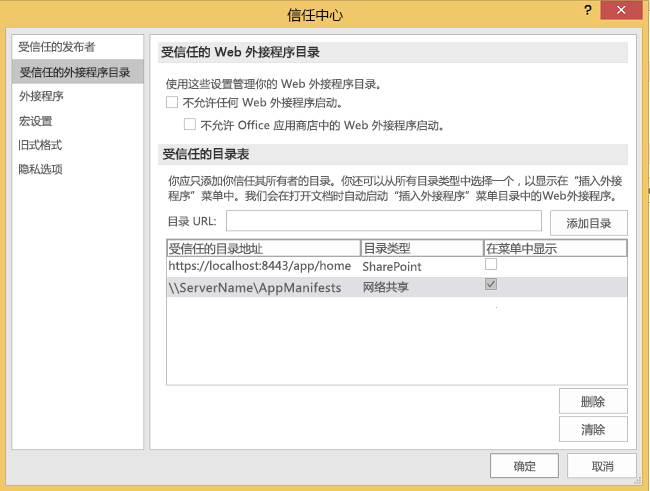
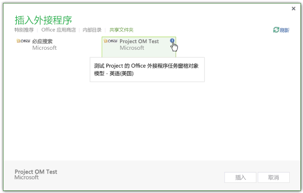
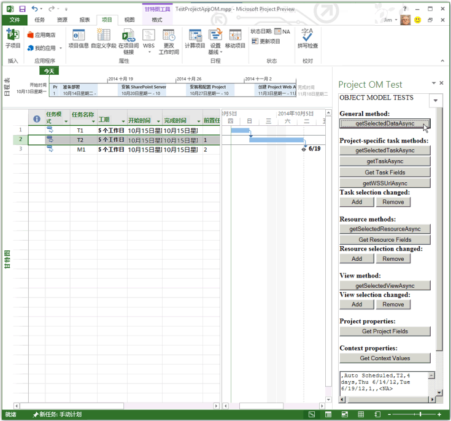
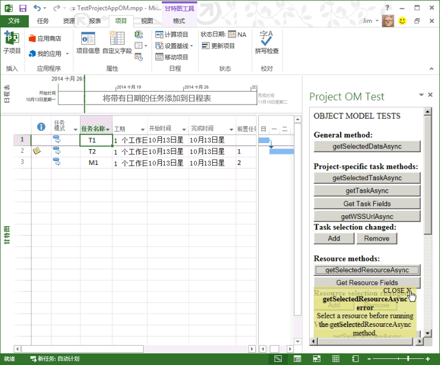

# <a name="create-your-first-task-pane-add-in-for-project-2013-by-using-a-text-editor"></a>使用文本编辑器创建 Project 2013 的第一个任务窗格加载项

可以通过使用 Visual Studio 2015 创建复杂 Web 应用程序或使用文本编辑器创建本地外接程序的文件来创建 Project Standard 2013 或 Project Professional 2013 的任务窗格外接程序。本文介绍了如何使用指向文件共享上的 HTML 文件的 XML 清单来创建简单的外接程序。Project OM Test 示例外接程序测试一些 JavaScript 功能，这些功能使用对象模型，用于外接程序。使用 Project 2013 中的“**信任中心**”注册包含清单文件的文件共享后，可以从功能区上的“**项目**”选项卡打开任务窗格外接程序。（本文中的示例代码基于 Microsoft Corporation 的 Arvind lyer 所做的测试应用程序。）

Project 2013 使用与其他 Microsoft Office 2013 客户端相同的加载项清单架构，以及大部分相同的 JavaScript API。可从 Project 2013 SDK 下载的 `Samples\Apps` 子目录获取本文中描述的加载项的完整代码。

Project OM Test 示例加载项可以获得任务的 GUID 以及应用程序和活动项目的属性。如果 Project Professional 2013 打开 SharePoint 库中的一个项目，则该加载项可以显示该项目的 URL。[Project 2013 SDK 下载](https://www.microsoft.com/en-us/download/details.aspx?id=30435%20)包括完整的源代码。当提取并安装 SDK 和 Project2013SDK.msi 文件中的示例时，请查看 `\Samples\Apps\Copy_to_AppManifests_FileShare` 子目录下的指令清单文件，以及 `\Samples\Apps\Copy_to_AppSource_FileShare` 子目录下的源代码。JSOMCall.html 样本使用所包括的 office.js 文件和 project-15.js 文件中的 JavaScript 函数。可以使用相应的调试文件（office.debug.js 和project-15.debug.js）来检查这些函数。有关在 Office 外接程序中使用 JavaScript 的说明，请参见[了解适用于 Office 的 JavaScript API](../../docs/develop/understanding-the-javascript-api-for-office.md)。

## <a name="procedure-1-to-create-the-add-in-manifest-file"></a>过程 1. 创建加载项清单文件


- 在本地目录中创建一个 XML 文件。该 XML 文件包括 **Office 外接程序 XML 清单**中描述的 [OfficeApp](../../docs/overview/add-in-manifests.md) 元素和子元素。例如，创建一个名为 JSOM_SimpleOMCalls.xml 并包含以下 XML 的文件（更改 **Id** 元素的 GUID 值）。
    
```XML
     <?xml version="1.0" encoding="utf-8"?>
   <OfficeApp xmlns="http://schemas.microsoft.com/office/appforoffice/1.1" 
              xmlns:xsi="http://www.w3.org/2001/XMLSchema-instance" 
              xsi:type="TaskPaneApp">
     <Id>93A26520-9414-492F-994B-4983A1C7A607</Id>
     <Version>15.0</Version>
     <ProviderName>Microsoft</ProviderName>
     <DefaultLocale>en-us</DefaultLocale>
     <DisplayName DefaultValue="Project OM Test">
       <Override Locale="fr-fr" Value="Le Project OM Test"/>
     </DisplayName>
     <Description DefaultValue="Test the task pane add-in object model for Project - English (US)">
       <Override Locale="fr-fr" Value="Test the task pane add-in object model for Project - French (France)"/>
     </Description>
     <Hosts>
       <Host Name="Project"/>
       <Host Name="Workbook"/>
       <Host Name="Document"/>
     </Hosts>
    <DefaultSettings>
       <SourceLocation DefaultValue="\\ServerName\AppSource\JSOMCall.html">
         <Override Locale="fr-fr" Value="\\ServerName\AppSource\JSOMCall.html"/>
       </SourceLocation>
     </DefaultSettings>
     <Permissions>ReadWriteDocument</Permissions>
     <IconUrl DefaultValue="http://officeimg.vo.msecnd.net/_layouts/images/general/office_logo.jpg">
       <Override Locale="fr-fr" Value="http://officeimg.vo.msecnd.net/_layouts/images/general/office_logo.jpg"/>
     </IconUrl>
     <AllowSnapshot>true</AllowSnapshot>
   </OfficeApp>
```


    For Project, the  **OfficeApp** element must include the `xsi:type="TaskPaneApp"` attribute value. The **Id** element is a GUID. The **SourceLocation** value must be a file share path or a SharePoint URL for the add-in HTML source file or the web application that runs in the task pane. For an explanation of the other elements in manifest file, see [Task pane add-ins for Project](../project/project-add-ins.md).
    
过程 2 演示如何创建 JSOM_SimpleOMCalls.XML 清单为 Project 测试加载项指定的 HTML 文件。HTML 文件中指定的按钮调用相关 JavaScript 函数。可以在 HTML 文件内添加 JavaScript 函数，或将它们放在一个单独的 .js 文件中。

## <a name="procedure-2-to-create-the-source-files-for-the-project-om-test-add-in"></a>过程 2. 创建 Project OM Test 加载项的源文件


1. 在 JSOM_SimpleOMCalls.xml 清单中创建由 **SourceLocation** 元素指定名称的 HTML 文件。例如，在 `C:\Project\AppSource` 目录中创建 theJSOMCall.html 文件。可以使用简单的文本编辑器创建源文件，但是使用诸如 Visual Studio 2015 的工具可以使操作更为简单，这适用于特定文档类型（如 HTML 和 JavaScript），并具有其他编辑辅助功能。如果还未执行 [Project 任务窗格外接程序](../project/project-add-ins.md) 中所述的必应搜索示例，过程 3 将演示如何创建清单指定的 `\\ServerName\AppSource` 文件共享。
    
    JSOMCall.html 文件在 Microsoft Office 2013 应用程序中使用通用 MicrosoftAjax.js 文件实现 AJAX 功能并使用 Office.js 文件实现外接程序功能。
    


```HTML
  <!DOCTYPE html>
<html>
<head>
    <title>Project OM Sample Code</title>
    <meta http-equiv="X-UA-Compatible" content="IE=Edge" />
    <script type="text/javascript" src="MicrosoftAjax.js"></script>

    <!-- Use the CDN reference to office.js when deploying your add-in. -->
    <!-- <script src="https://appsforoffice.microsoft.com/lib/1/hosted/Office.js"></script> -->
    <script type="text/javascript" src="Office.js"></script>
    <script type="text/javascript" src="JSOM_Sample.js"></script>
</head>
<body>
    <div id="Common_JSOM_API">
        OBJECT MODEL TESTS
    </div>

    <textarea id="text" rows="6" cols="25">This is the text result.</textarea>
</body>
</html>
```


    The  **textarea** element specifies a text box that shows results of the JavaScript functions.
    
     >**Note**  For the Project OM Test sample to work, copy the following files from the Project 2013 SDK download to the same directory as the JSOMCall.html file: Office.js, Project-15.js, and MicrosoftAjax.js.

    Step 2 adds the JSOM_Sample.js file for specific functions that the Project OM Test sample add-in uses. In later steps, you will add other HTML elements for buttons that call JavaScript functions.
    
2. 在与 JSOMCall.html 文件相同的目录中创建一个名为 JSOM_Sample.js 的 JavaScript 文件。下面的代码使用 Office.js 文件中的函数来获取应用程序上下文和文档信息。**text** 对象是 HTML 文件中 ** textarea** 控件的 ID。
    
    使用 **ProjectDocument** 对象初始化 **_projDoc** 变量。代码包含一些简单的错误处理函数以及获取应用程序上下文和项目文档上下文属性的 **getContextValues** 函数。有关 Project 的 JavaScript 对象模型的详细信息，请参阅 [适用于 Office 的 JavaScript API](../../reference/javascript-api-for-office.md)。
    


```js
  /*
* JavaScript functions for the Project OM Test example app
* in the Project 2013 SDK.
*/

var _projDoc;
var _app;
var taskGuid;
var resourceGuid;

// The initialize function is required for all add-ins.
Office.initialize = function (reason) {
    // Checks for the DOM to load using the jQuery ready function.
    $(document).ready(function () {
        // After the DOM is loaded, app-specific code can run.
        _projDoc = Office.context.document;
        _app = Office.context;
    });
}

function logError(errorText) {
    text.value = "Error in " + errorText;
}

function logEventError(erroneousEvent) {
    logError("event " + erroneousEvent);
}

function logMethodError(methodName, errorName, errorMessage) {
    logError(methodName + " method.\nError name: " + errorName + "\nMessage: " + errorMessage);
}

// . . . Add other JavaScript functions here.

function getContextValues() {
    getDocumentUrl();
    getDocumentMode();
    getApplicationContentLanguage();
    getApplicationDisplayLanguage();
}

function getDocumentUrl() {
    text.value ="Document URL:\n" +_projDoc.url;
}

function getDocumentMode() {
    var docMode = _projDoc.mode;
    text.value = text.value + "\n\nDocument mode: " + docMode;
}

function getApplicationContentLanguage() {
    text.value = text.value + "\nApp language: " + _app.contentLanguage;
}

function getApplicationDisplayLanguage() {
    text.value = text.value + "\nDisplay language: " + _app.displayLanguage;
}
```


    For information about the functions in the Office.debug.js file, see [JavaScript API for Office](../../reference/javascript-api-for-office.md). For example, the  **getDocumentUrl** function gets the URL or file path of the open project.
    
3. 添加调用 Office.js 和 Project-15.js 中异步函数的 JavaScript 函数来获取选定数据：
    
      - 例如，**getSelectedDataAsync** 是 Office.js 中的一个普通函数，用于获取选定数据的无格式文本。有关详细信息，请参阅 [AsyncResult 对象](../../reference/shared/asyncresult.md)。
    
  - Project-15.js 中的 **getSelectedTaskAsync** 函数获取选定任务的 GUID。类似，**getSelectedResourceAsync** 函数获取选定资源的 GUID。如果在未选定任务或资源时调用这些函数，函数将显示未定义错误。
    
  - **getTaskAsync** 函数获取任务名称和已分配资源的名称。如果任务在同步 SharePoint 任务列表中，**getTaskAsync** 将获取 SharePoint 列表中的任务 ID；否则，SharePoint 的任务 ID 为 0。
    
     >**注意**  出于演示目的，示例代码包含一个 bug。如果 **taskGuid** 未定义，则 **getTaskAsync** 函数出现错误。如果得到一个有效的任务 GUID，然后选择其他任务，**getTaskAsync** 函数会获取由 **getSelectedTaskAsync** 函数操作的最新任务的数据。
  -  **getTaskFields**、**getResourceFields** 和 **getProjectFields** 是本地函数，可多次调用 **getTaskFieldAsync**、**getResourceFieldAsync** 或 **getProjectFieldAsync** 来获得任务或资源的指定域。在 project-15.debug.js 文件中，**ProjectTaskFields** 枚举和 **ProjectResourceFields** 枚举显示哪些域受支持。
    
  - **getSelectedViewAsync** 函数获取视图类型（在 project-15.debug.js 的 **ProjectViewTypes** 枚举中定义）以及视图名称。
    
  - 如果项目与 SharePoint 任务列表同步，则 **getWSSUrlAsync** 函数获取任务列表的 URL 和名称。如果项目不与 SharePoint 任务列表同步，则 **getWSSUrlAsync** 函数错误关闭。
    
     >**注意**  若要获取 SharePoint URL 和任务列表名称，我们建议你在 [ProjectProjectFields](../../reference/shared/projectprojectfields-enumeration.md) 枚举中使用带有 **WSSUrl** 和 **WSSList** 常量的 **getProjectFieldAsync** 函数。

    以下代码的每个函数中都包含由 `function (asyncResult)` 指定的匿名函数，该函数是获取异步结果的回叫。你可以使用命名函数，而不是匿名函数，前者有助于实现复杂外接程序的可维护性。
    


```js
  // Get the data in the selected cells of the grid in the active view.
function getSelectedDataAsync() {
    _projDoc.getSelectedDataAsync(
        Office.CoercionType.Text,
        { ValueFormat: "Formatted" },
        function (asyncResult) {
            if (asyncResult.status == Office.AsyncResultStatus.Succeeded)
                text.value = asyncResult.value;
            else
                logMethodError("getSelectedDataAsync", asyncResult.error.name,
                               asyncResult.error.message);
        }
    );
}

// Get the GUID of the selected task.
function getSelectedTaskAsync() {
    _projDoc.getSelectedTaskAsync(function (asyncResult) {
        if (asyncResult.status == Office.AsyncResultStatus.Succeeded) {
            text.value = asyncResult.value;
            taskGuid = asyncResult.value;
        }
        else {
            logMethodError("getSelectedTaskAsync", asyncResult.error.name,
                               asyncResult.error.message);
        }
    });
}

// Get the GUID of the selected resource.
function getSelectedResourceAsync() {
    _projDoc.getSelectedResourceAsync(function (asyncResult) {
        if (asyncResult.status == Office.AsyncResultStatus.Succeeded) {
            text.value = asyncResult.value;
            resourceGuid = asyncResult.value;
        }
        else {
            logMethodError("getSelectedResourceAsync", asyncResult.error.name,
                               asyncResult.error.message);
        }
    });
}

// Get data for the specified task.
function getTaskAsync() {
    if (taskGuid != undefined) {
        _projDoc.getTaskAsync(
            taskGuid,
            function (asyncResult) {
                if (asyncResult.status === Office.AsyncResultStatus.Failed) {
                    logMethodError("getTaskAsync", asyncResult.error.name,
                               asyncResult.error.message);
                } else {
                    var taskInfo = asyncResult.value;
                    var taskOutput = "Task name: " + taskInfo.taskName +
                                     "\nGUID: " + taskGuid +
                                     "\nWSS Id: " + taskInfo.wssTaskId +
                                     "\nResourceNames: " + taskInfo.resourceNames;
                    text.value = taskOutput;
                }
            }
        );
    } else {
        text.value = 'Task GUID not valid:\n' + taskGuid;
    } 
}

// Get additional data for task fields.
function getTaskFields() {
    text.value = "";

    _projDoc. getTaskFieldAsync(taskGuid, Office.ProjectTaskFields.Name,
        function (asyncResult) {
            if (asyncResult.status == Office.AsyncResultStatus.Succeeded) {
                text.value = text.value + "Name: "
                    + asyncResult.value.fieldValue + "\n";
            }
            else {
                logMethodError("getTaskFieldAsync", asyncResult.error.name,
                               asyncResult.error.message);
            }
        }
    );

    _projDoc.getTaskFieldAsync(taskGuid, Office.ProjectTaskFields.ID,
        function (asyncResult) {
            if (asyncResult.status == Office.AsyncResultStatus.Succeeded) {
                text.value = text.value + "ID: "
                    + asyncResult.value.fieldValue + "\n";
            }
            else {
                logMethodError("getTaskFieldAsync", asyncResult.error.name,
                               asyncResult.error.message);
            }
        }
    );

    _projDoc.getTaskFieldAsync(taskGuid, Office.ProjectTaskFields.Start,
        function (asyncResult) {
            if (asyncResult.status == Office.AsyncResultStatus.Succeeded) {
                text.value = text.value + "Start: "
                    + asyncResult.value.fieldValue + "\n";
            }
            else {
                logMethodError("getTaskFieldAsync", asyncResult.error.name,
                               asyncResult.error.message);
            }
        }
    );

    _projDoc.getTaskFieldAsync(taskGuid, Office.ProjectTaskFields.Duration,
        function (asyncResult) {
            if (asyncResult.status == Office.AsyncResultStatus.Succeeded) {
                text.value = text.value + "Duration: "
                    + asyncResult.value.fieldValue + "\n";
            }
            else {
                logMethodError("getTaskFieldAsync", asyncResult.error.name,
                               asyncResult.error.message);
            }
        }
    );

    _projDoc.getTaskFieldAsync(taskGuid, Office.ProjectTaskFields.Priority,
        function (asyncResult) {
            if (asyncResult.status == Office.AsyncResultStatus.Succeeded) {
                text.value = text.value + "Priority: "
                    + asyncResult.value.fieldValue + "\n";
            }
            else {
                logMethodError("getTaskFieldAsync", asyncResult.error.name,
                               asyncResult.error.message);
            }
        }
    );

    _projDoc.getTaskFieldAsync(taskGuid, Office.ProjectTaskFields.Notes,
        function (asyncResult) {
            if (asyncResult.status == Office.AsyncResultStatus.Succeeded) {
                text.value = text.value + "Notes: "
                    + asyncResult.value.fieldValue + "\n";
            }
            else {
                logMethodError("getTaskFieldAsync", asyncResult.error.name,
                               asyncResult.error.message);
            }
        }
    ); 
}

// Get data for the specified resource fields.
function getResourceFields() {
    text.value = "";

    _projDoc.getResourceFieldAsync(resourceGuid, Office.ProjectResourceFields.Name,
        function (asyncResult) {
            if (asyncResult.status == Office.AsyncResultStatus.Succeeded) {
                text.value = text.value + "Resource name: " + asyncResult.value.fieldValue + "\n";
            }
            else {
                logMethodError("getResourceFieldAsync", asyncResult.error.name,
                               asyncResult.error.message);
            }
        }
    );

    _projDoc.getResourceFieldAsync(resourceGuid, Office.ProjectResourceFields.Cost,
        function (asyncResult) {
            if (asyncResult.status == Office.AsyncResultStatus.Succeeded) {
                text.value = text.value + "Cost: " + asyncResult.value.fieldValue + "\n";
            }
            else {
                logMethodError("getResourceFieldAsync", asyncResult.error.name,
                               asyncResult.error.message);
            }
        }
    );

    _projDoc.getResourceFieldAsync(resourceGuid, Office.ProjectResourceFields.StandardRate,
        function (asyncResult) {
            if (asyncResult.status == Office.AsyncResultStatus.Succeeded) {
                text.value = text.value + "Standard Rate: " + asyncResult.value.fieldValue + "\n";
            }
            else {
                logMethodError("getResourceFieldAsync", asyncResult.error.name, asyncResult.error.message);
            }
        }
    );

    _projDoc.getResourceFieldAsync(resourceGuid, Office.ProjectResourceFields.ActualCost,
        function (asyncResult) {
            if (asyncResult.status == Office.AsyncResultStatus.Succeeded) {
                text.value = text.value + "Actual Cost: " + asyncResult.value.fieldValue + "\n";
            }
            else {
                logMethodError("getResourceFieldAsync", asyncResult.error.name, asyncResult.error.message);
            }
        }
    );

    _projDoc.getResourceFieldAsync(resourceGuid, Office.ProjectResourceFields.ActualWork,
        function (asyncResult) {
            if (asyncResult.status == Office.AsyncResultStatus.Succeeded) {
                text.value = text.value + "Actual Work: " + asyncResult.value.fieldValue + "\n";
            }
            else {
                logMethodError("getResourceFieldAsync", asyncResult.error.name,
                               asyncResult.error.message);
            }
        }
    );

    _projDoc.getResourceFieldAsync(resourceGuid, Office.ProjectResourceFields.Units,
        function (asyncResult) {
            if (asyncResult.status == Office.AsyncResultStatus.Succeeded) {
                text.value = text.value + "Units: " + asyncResult.value.fieldValue + "\n";
            }
            else {
                logMethodError("getResourceFieldAsync", asyncResult.error.name,
                               asyncResult.error.message);
            }
        }
    );
}

// Get the URL and list name of the synchronized SharePoint task list.
// Recommended: use getProjectField instead.
function getWSSUrlAsync() {
    _projDoc.getWSSUrlAsync(function (asyncResult) {
        if (asyncResult.status == Office.AsyncResultStatus.Succeeded) {
            text.value = "SharePoint URL:\n" + asyncResult.value.serverUrl
                + "\nList name: " + asyncResult.value.listName;
        }
        else {
            logMethodError("getWSSUrlAsync", asyncResult.error.name, asyncResult.error.message);
        }
    });
}

// Get the type and name of the selected view.
function getSelectedViewAsync() {
    _projDoc.getSelectedViewAsync(function (asyncResult) {
        text.value = "View type: " + asyncResult.value.viewType
            + "\nName: " + asyncResult.value.viewName;
    });
}

// Get information about the active project.
function getProjectFields() {
    text.value = "";

    _projDoc.getProjectFieldAsync(Office.ProjectProjectFields.GUID,
        function (asyncResult) {
            if (asyncResult.status == Office.AsyncResultStatus.Succeeded) {
                text.value = text.value + "Project GUID: " + asyncResult.value.fieldValue + "\n";
            }
            else {
                logMethodError("getProjectFieldAsync", asyncResult.error.name, asyncResult.error.message);
            }
        }
    );

    _projDoc.getProjectFieldAsync(Office.ProjectProjectFields.Start,
        function (asyncResult) {
            if (asyncResult.status == Office.AsyncResultStatus.Succeeded) {
                text.value = text.value + "\nStart: " + asyncResult.value.fieldValue + "\n";
            }
            else {
                logMethodError("getProjectFieldAsync", asyncResult.error.name, asyncResult.error.message);
            }
        }
    );

    _projDoc.getProjectFieldAsync(Office.ProjectProjectFields.Finish,
        function (asyncResult) {
            if (asyncResult.status == Office.AsyncResultStatus.Succeeded) {
                text.value = text.value + "\nFinish: " + asyncResult.value.fieldValue + "\n";
            }
            else {
                logMethodError("getProject " + errorText);
            }
        }
    );

    _projDoc.getProjectFieldAsync(Office.ProjectProjectFields.CurrencyDigits,
        function (asyncResult) {
            if (asyncResult.status == Office.AsyncResultStatus.Succeeded) {
                text.value = text.value + "\nCurrency digits: " + asyncResult.value.fieldValue + "\n";
            }
            else {
                logMethodError("getProjectFieldAsync", asyncResult.error.name, asyncResult.error.message);
            }
        }
    );


    _projDoc.getProjectFieldAsync(Office.ProjectProjectFields.CurrencySymbol,
        function (asyncResult) {
            if (asyncResult.status == Office.AsyncResultStatus.Succeeded) {
                text.value = text.value + "Currency symbol: " + asyncResult.value.fieldValue + "\n";
            }
            else {
                logMethodError("getProjectFieldAsync", asyncResult.error.name, asyncResult.error.message);
            }
        }
    );

    _projDoc.getProjectFieldAsync(Office.ProjectProjectFields.CurrencySymbolPosition,
        function (asyncResult) {
            if (asyncResult.status == Office.AsyncResultStatus.Succeeded) {
                text.value = text.value + "\nSymbol position: " + asyncResult.value.fieldValue + "\n";
            }
            else {
                logMethodError("getProjectFieldAsync", asyncResult.error.name, asyncResult.error.message);
            }
        }
    );

    _projDoc.getProjectFieldAsync(Office.ProjectProjectFields.ProjectServerUrl,
        function (asyncResult) {
            if (asyncResult.status == Office.AsyncResultStatus.Succeeded) {
                text.value = text.value + "\nProject web app URL:\n  " + asyncResult.value.fieldValue + "\n";
            }
            else {
                logMethodError("getProjectFieldAsync", asyncResult.error.name, asyncResult.error.message);
            }
        }
    );

    _projDoc.getProjectFieldAsync(Office.ProjectProjectFields.WSSUrl,
        function (asyncResult) {
            if (asyncResult.status == Office.AsyncResultStatus.Succeeded) {
                text.value = text.value + "\nSharePoint URL:\n  " + asyncResult.value.fieldValue + "\n";
            }
            else {
                logMethodError("getProjectFieldAsync", asyncResult.error.name, asyncResult.error.message);
            }
        }
    );

    _projDoc.getProjectFieldAsync(Office.ProjectProjectFields.WSSList,
        function (asyncResult) {
            if (asyncResult.status == Office.AsyncResultStatus.Succeeded) {
                text.value = text.value + "\nSharePoint list: " + asyncResult.value.fieldValue + "\n";
            }
            else {
                logMethodError("getProjectFieldAsync", asyncResult.error.name, asyncResult.error.message);
            }
        }
    );
}
```

4. 添加 JavaScript 事件处理程序回调和函数来注册任务选择、资源选择，以及查看选定内容更改事件处理程序和注销事件处理程序。**manageEventHandlerAsync** 函数添加或删除指定的事件处理程序，具体情况取决于 _operation_ 参数。该操作可以是 **addHandlerAsync** 或 **removeHandlerAsync**。
    
    **manageTaskEventHandler**、**manageResourceEventHandler** 和 **manageViewEventHandler** 函数可以添加或删除 _docMethod_ 参数指定的事件处理程序。
    


```js
  // Task selection changed event handler.
function onTaskSelectionChanged(eventArgs) {
    text.value = "In task selection change event handler";
}

// Resource selection changed event handler.
function onResourceSelectionChanged(eventArgs) {
    text.value = "In Resource selection changed event handler";
}

// View selection changed event handler.
function onViewSelectionChanged(eventArgs) {
    text.value = "In View selection changed event handler";
}

// Add or remove the specified event handler.
function manageEventHandlerAsync(eventType, handler, operation, onComplete) {
    _projDoc[operation]   //The operation is addHandlerAsync or removeHandlerAsync.
    (
        eventType,
        handler,
        function (asyncResult) {
            if (onComplete) {
                onComplete(asyncResult, operation);
            } else {
                var message = "Operation: " + operation;
                message = message + "\nStatus: " + asyncResult.status + "\n";
                text.value = message;
            }
        }
    );
}

// Write the asyncResult status from the manageEventHandlerAsync function (optional). 
function onComplete(asyncResult, operation) {
    var message = "In onComplete function for " + operation;
    message = message + "\nStatus: " + asyncResult.status;
    text.value = message;
}

// Add or remove a task selection changed event handler.
function manageTaskEventHandler(docMethod) {
    manageEventHandlerAsync(
        Office.EventType.TaskSelectionChanged,      // The task selection changed event.
        onTaskSelectionChanged,                     // The event handler.
        docMethod,                // The Office.Document method to add or remove an event handler.
        onComplete                // Manages the successful asyncResult data (optional).
    );
}

// Add or remove a resource selection changed event handler.
function manageResourceEventHandler(docMethod) {
    manageEventHandlerAsync(
        Office.EventType.ResourceSelectionChanged,  // The resource selection changed event.
        onResourceSelectionChanged,                 // The event handler.
        docMethod,                // The Office.Document method to add or remove an event handler.
        onComplete                // Manages the successful asyncResult data (optional).
    );
}

// Add or remove a view selection changed event handler.
function manageViewEventHandler(docMethod) {
    manageEventHandlerAsync(
        Office.EventType.ViewSelectionChanged,      // The view selection changed event.
        onViewSelectionChanged,                     // The event handler.
        docMethod,                // The Office.Document method to add or remove an event handler.
        onComplete                // Manages the successful asyncResult data (optional).
    );
}
```

5. 对于 HTML 文档正文，添加调用 JavaScript 函数的按钮进行测试。例如，在公共 JSOM API 的 **div** 元素中，添加调用普通 **getSelectedDataAsync** 函数的输入按钮。
    
```HTML
  <body>
    <div id="Common_JSOM_API">
    OBJECT MODEL TESTS
    <br /><br />       
    <strong>General function:</strong>
    <br />
    <input id="Button5" class="button-wide" type="button" onclick="getSelectedDataAsync()" 
        value="getSelectedDataAsync" />
    </div>
   <!--  more code . . .  -->
```

6. 在 **div** 部分中添加有关项目特定任务函数和 **TaskSelectionChanged** 事件的按钮。
    
```HTML
  <div id="ProjectSpecificTask">
  <br />
  <strong>Project-specific task methods:</strong><br />
  <button class="button-wide" onclick="getSelectedTaskAsync()">getSelectedTaskAsync</button><br />
  <button class="button-wide" onclick="getTaskAsync()">getTaskAsync</button><br />
  <button class="button-wide" onclick="getTaskFields()">Get Task Fields</button><br />
  <button class="button-wide" onclick="getWSSUrlAsync()">getWSSUrlAsync</button>
  <strong>Task selection changed:</strong>
  <button class="button-narrow" onclick="manageTaskEventHandler('addHandlerAsync')">Add</button>
  <button class="button-narrow" onclick="manageTaskEventHandler('removeHandlerAsync')">Remove</button>         
</div>
```

7. 在 **div** 部分中添加有关资源方法和事件、查看方法和事件、项目属性和上下文属性的按钮
    
```HTML
  <div id="ResourceMethods">
  <br />
  <strong>Resource methods:</strong>
  <button class="button-wide" onclick="getSelectedResourceAsync()">getSelectedResourceAsync</button><br />
  <button class="button-wide" onclick="getResourceFields()">Get Resource Fields</button><br />
  <strong>Resource selection changed:</strong>
  <button class="button-narrow" onclick="manageResourceEventHandler('addHandlerAsync')">Add</button>
  <button class="button-narrow" onclick="manageResourceEventHandler('removeHandlerAsync')">Remove</button>
</div>
<div id="ViewMethods">
  <br />
  <strong>View method:</strong>
  <button class="button-wide" onclick="getSelectedViewAsync()">getSelectedViewAsync</button><br />
  <strong>View selection changed:</strong>
  <button class="button-narrow" onclick="manageViewEventHandler('addHandlerAsync')">Add</button>
  <button class="button-narrow" onclick="manageViewEventHandler('removeHandlerAsync')">Remove</button>         
</div>
<div id="ProjectMethods">
  <br />
  <strong>Project properties:</strong>
  <button class="button-wide" onclick="getProjectFields()">Get Project Fields</button><br />
</div>
<div id="ContextVariables">
  <br />
  <strong>Context properties:</strong>
  <button class="button-wide" onclick="getContextValues()">Get Context Values</button>
</div>
```

8. 要设置按钮元素的格式，可添加 CSS **style** 元素。例如，添加以下内容作为 **head** 元素的子元素。
    
```HTML
  <style type="text/css">
    .button-wide
    {
        width: 210px;
        margin-top: 2px;
    }
    .button-narrow
    {
        width: 80px;
        margin-top: 2px;
    }
</style>
```


     >**Note**  The  **Task Pane Add-in (Project)** template in Visual Studio 2015 includes default .css files for a common look and feel of add-ins.
过程 3 显示如何安装和使用 Project OM Test 加载项功能。

## <a name="procedure-3-to-install-and-use-the-project-om-test-add-in"></a>过程 3. 安装和使用 Project OM Test 加载项


1. 为包含 JSOM_SimpleOMCalls.XML 清单的目录创建一个文件共享。可以在本地计算机或可通过网络访问的远程计算机上创建该文件共享。例如，如果清单位于本地计算机上的 `C:\Project\AppManifests` 目录中，则运行以下命令：
    
```
  Net share AppManifests=C:\Project\AppManifests
```

    
2. 为包含 Project OM Test 加载项的 HTML 和 JavaScript 文件的目录创建一个文件共享。确保文件共享路径与在 JSOM_SimpleOMCalls.xml 清单中指定的路径匹配。例如，如果文件位于本地计算机上的 `C:\Project\AppSource` 目录中，则运行以下命令：
    
```
  net share AppSource=C:\Project\AppSource
```

3. 在项目中，打开“**项目选项**”对话框，选择“**信任中心**”，然后选择“**信任中心设置**”。
    
    注册外接程序的过程在 [适用于 Project 的任务窗格外接程序](../project/project-add-ins.md)也有介绍，并提供详细信息。
    
4. 在“**信任中心**”对话框的左窗格中，选择“**受信任的外接程序目录**”。
    
5. 如果已为必应搜索外接程序添加了 `\\ServerName\AppManifests`，则跳过此步骤。否则，在“**受信任的外接程序目录**”窗格中的“**目录 Url**”文本框中添加 `\\ServerName\AppManifests` 路径，选择“**添加目录**”，启用网络共享作为默认源（见图 1），然后选择“**确定**”。
    
    **图 1.为外接程序清单添加网络文件共享**

    

6. 添加新的外接程序或更改源代码后，重新启动项目。在“**项目**”功能区，选择“**Office 外接程序**”下拉菜单，然后选择“**查看所有**”。在“**插入外接程序**”对话框中，选择“**共享文件夹**”（见图 2），选择“**Project OM Test**”，然后选择“**插入**”。Project OM Test 外接程序在任务窗格启动。
    
    **图 2.启动文件共享上的 Project OM Test 外接程序**

    

7. 在 Project 中，创建并保存具有至少两个任务的简单项目。例如，创建名为 T1、T2 的任务和名为 M1 的里程碑，然后将任务工期和前置任务设置为与图 3 中的类似。选择功能区上的“**项目**”选项卡，选择任务 T2 的整个行，然后在任务窗格中选择“**getSelectedDataAsync**”按钮。图 3 显示在 **Project OM Test** 外接程序的文本框中选择的数据。
    
    **图 3.使用 Project OM Test 外接程序**

    

8. 选择第一项任务的“**工期**”列中的单元格，然后选择 **Project OM Test** 外接程序中的“**getSelectedDataAsync**”按钮。**getSelectedDataAsync** 函数将文本框值设置为显示 `2 days`。 
    
9. 选择所有三项任务的三个**工期**单元格。**getSelectedDataAsync** 函数为在不同行中选定的单元格返回以分号分隔的文本值，例如，`2 days;4 days;0 days`。
    
    **getSelectedDataAsync** 函数返回行中选定单元格的以逗号分隔的文本值。有关图 3 中的示例，选中任务 T2 的整行。在选择 **getSelectedDataAsync** 时，文本框显示以下内容：`,Auto Scheduled,T2,4 days,Thu 6/14/12,Tue 6/19/12,1,,<NA>`
    
    “**标记**”列和“**资源名称**”列均为空，因此，文本数组显示这些列的空值。`<NA>` 值代表“**添加新列**”单元格。
    
10. 选择任务 T2 行中的任何单元格，或任务 T2 的整行，然后选择 **getSelectedTaskAsync**。文本框显示任务 GUID 值，例如，`{25D3E03B-9A7D-E111-92FC-00155D3BA208}`。Project 在 **Project OM Test** 加载项的全局 **taskGuid** 变量中存储该值。
    
11. 选择  **getTaskAsync**。如果 **taskGuid** 变量包含任务 T2 的 GUID，文本框中将显示任务信息。**ResourceNames** 的值为空。
    
    创建两个本地资源 R1 和 R2，将其分配给任务 T2（每个分配 50%），然后重新选择 **getTaskAsync**。文本框中的结果包含资源信息。如果任务位于同步的 SharePoint 任务列表中，那么结果还会包含 SharePoint 任务 ID。
    


```
  Task name: T2
GUID: {25D3E03B-9A7D-E111-92FC-00155D3BA208}
WSS Id: 0
ResourceNames: R1[50%],R2[50%]
```

12. 选择“**获取任务字段**”按钮。**getTaskFields** 函数将多次调用 **getTaskfieldAsync** 函数，以获取任务名称、索引、开始日期、工期、优先事项和任务备注。
    
```
  Name: T2
ID: 2
Start: Thu 6/14/12
Duration: 4d
Priority: 500
Notes: This is a note for task T2. It is only a test note. If it had been a real note, there would be some real information.
```

13. 选择 **getWSSUrlAsync** 按钮。如果该项目是以下类型之一，则结果中显示任务列表 URL 和名称。
    
      - 导入到 Project Server 的 SharePoint 任务列表。
    
  - 导入到 Project Professional，然后保存回 SharePoint（未使用 Project Server）的 SharePoint 任务列表。
    
     >**注意**  如果在 Windows Server 计算机安装了 Project Professional，为了能够将项目重新保存到 SharePoint，你可以使用“**服务器管理器**”来添加“**桌面体验**”功能。

    如果项目是本地项目，或者如果你使用 Project Professional 打开由 Project Server 管理的项目，那么 **getWSSUrlAsync** 方法会显示一个未定义错误。
    


```
  SharePoint URL: http://ServerName
List name: Test task list
```

14. 选择 **TaskSelectionChanged 事件**部分中的“**添加**”按钮，该操作将调用 **manageTaskEventHandler** 函数以注册任务选择更改事件并返回文本框中的 `In onComplete function for addHandlerAsync Status: succeeded`。选择一个不同的任务；文本框显示 `In task selection changed event handler`，它是任务选择更改事件的回调函数的输出。选择“**删除**”按钮以取消注册事件处理程序。
    
15. 若要使用资源方法，首先选择视图（如“**资源工作表**”、“**资源使用状况**”或“**资源窗体**”），然后选择该视图中的资源。选择 **getSelectedResourceAsync** 以初始化 **resourceGuid** 变量，然后选择“**获取资源域**”以对资源属性的 **getResourceFieldAsync** 进行多次调用。还可以添加或删除资源选择更改事件处理程序。
    
```
  Resource name: R1
Cost: $800.00
Standard Rate: $50.00/h
Actual Cost: $0.00
Actual Work: 0h
Units: 100%
```

16. 选择 **getSelectedViewAsync** 显示活动视图的类型和名称。还可以添加或删除视图选择更改事件处理程序。例如，如果**资源窗体**是活动视图，则 **getSelectedViewAsync** 函数将在文本框中显示以下内容：
    
```
  View type: 6
Name: Resource Form
```

17. 选择“**获取项目域**”对活动项目的不同属性多次调用 **getProjectFieldAsync** 函数。如果项目从 Project Web App 打开，则 **getProjectFieldAsync** 函数可以获取 Project Web App 实例的 URL。
    
```
  Project GUID: 9845922E-DAB4-E111-8AF3-00155D3BA208

Start: Tue 6/12/12
Finish: Tue 6/19/12

Currency digits: 2
Currency symbol: $
Symbol position: 0

Project web app URL:
  http://servername/pwa
```

18. 选择“**获取上下文值**”按钮，通过获取 **Office.Context.document** 对象和 **Office.context.application** 对象的属性来获取文档的属性和外接程序在其中运行的应用程序。例如，如果 Project1.mpp 文件在本地计算机桌面上，则文档 URL 为 `C:\Users\UserAlias\Desktop\Project1.mpp`。如果 .mpp 文件在 SharePoint 库中，则值为文档的 URL。如果使用 Project Professional 2013 从 Project Web App 打开一个名为 Project1 的项目，则文档 URL 为 `<>\Project1`。
    
```
  Document URL:
<>\Project1
Document mode: readWrite
App language: en-US
Display language: en-US
```

19. 可以通过关闭并重启 Project 以在编辑源代码后刷新外接程序。在“**项目**”功能区中，“**Office 外接程序**”下拉列表维护最近使用的外接程序列表。
    

## <a name="example"></a>示例


Project 2013 SDK 下载包含 JSOMCall.html 文件、JSOM_Sample.js 文件和相关 Office.js、Office.debug.js、Project-15.js、Project-15.debug.js 文件的完整代码。以下是 JSOMCall.html 文件中的代码。


```HTML
<!DOCTYPE html>
<html>
    <head>
        <title>Project OM Sample Code</title>
        <meta http-equiv="X-UA-Compatible" content="IE=Edge"/>

        <script type="text/javascript" src="MicrosoftAjax.js"></script>

        <!-- Use the CDN reference to office.js when deploying your add-in. -->
        <!-- <script src="https://appsforoffice.microsoft.com/lib/1/hosted/Office.js"></script> -->
        <script type="text/javascript" src="Office.js"></script>
        <script type="text/javascript" src="JSOM_Sample.js"></script>

        <style type="text/css">           
            .button-wide {
                width: 210px;
                margin-top: 2px;
            }
            .button-narrow 
            {
                width: 80px;
                margin-top: 2px;
            }
        </style>
    </head>

    <body>
      <div id="Common_JSOM_API">
        OBJECT MODEL TESTS
        <br /><br />       
        <strong>General method:</strong>
        <br />
        <input id="Button5" class="button-wide" type="button" onclick="getSelectedDataAsync()" 
            value="getSelectedDataAsync" />
      </div>

      <div id="ProjectSpecificTask">
        <br />
        <strong>Project-specific task methods:</strong><br />
        <button class="button-wide" onclick="getSelectedTaskAsync()">getSelectedTaskAsync</button><br />
        <button class="button-wide" onclick="getTaskAsync()">getTaskAsync</button><br />
        <button class="button-wide" onclick="getTaskFields()">Get Task Fields</button><br />
        <button class="button-wide" onclick="getWSSUrlAsync()">getWSSUrlAsync</button>
        <strong>Task selection changed:</strong>
        <button class="button-narrow" onclick="manageTaskEventHandler('addHandlerAsync')">Add</button>
        <button class="button-narrow" onclick="manageTaskEventHandler('removeHandlerAsync')">Remove</button>         
      </div>
<div id="ResourceMethods">
  <br />
  <strong>Resource methods:</strong>
  <button class="button-wide" onclick="getSelectedResourceAsync()">getSelectedResourceAsync</button><br />
  <button class="button-wide" onclick="getResourceFields()">Get Resource Fields</button><br />
  <strong>Resource selection changed:</strong>
  <button class="button-narrow" onclick="manageResourceEventHandler('addHandlerAsync')">Add</button>
  <button class="button-narrow" onclick="manageResourceEventHandler('removeHandlerAsync')">Remove</button>
</div>
<div id="ViewMethods">
  <br />
  <strong>View method:</strong>
  <button class="button-wide" onclick="getSelectedViewAsync()">getSelectedViewAsync</button><br />
  <strong>View selection changed:</strong>
  <button class="button-narrow" onclick="manageViewEventHandler('addHandlerAsync')">Add</button>
  <button class="button-narrow" onclick="manageViewEventHandler('removeHandlerAsync')">Remove</button>         
</div>
<div id="ProjectMethods">
  <br />
  <strong>Project properties:</strong>
  <button class="button-wide" onclick="getProjectFields()">Get Project Fields</button><br />
</div>
<div id="ContextVariables">
  <br />
  <strong>Context properties:</strong>
  <button class="button-wide" onclick="getContextValues()">Get Context Values</button>
</div>

      <br />
      <textarea id="text" rows="10" cols="25">This is the text result.</textarea>
    </body>
</html
```


## <a name="robust-programming"></a>可靠编程


**Project OM Test** 加载项是一个示例，显示如何使用 Project-15.js 和 Office.js 文件中 Project 2013 的某些 JavaScript 函数。此示例仅供测试用，不包括可靠的错误检查。例如，如果你未选择资源而运行 **getSelectedResourceAsync** 函数，则 **resourceGuid** 变量不进行初始化，并且对 **getResourceFieldAsync** 的调用将返回错误。对于生产加载项，应检查特定错误并忽略结果，隐藏未应用的功能，或通知用户选择视图并在使用函数前先进行有效选择。

对于简单示例，下列代码中的错误输出包括 **actionMessage** 变量，该变量指定为避免 **getSelectedResourceAsync** 函数出错而执行的操作。


```js
function logError(errorText) {
    text.value = "Error in " + errorText;
}

function logMethodError(methodName, errorName, errorMessage, actionMessage) {
    logError(methodName + " method.\nError name: " + errorName
        + "\nMessage: " + errorMessage
        + "\n\nAction: " + actionMessage);
}
// Get the GUID of the selected resource.
function getSelectedResourceAsync() {
    _projDoc.getSelectedResourceAsync(function (asyncResult) {
        if (asyncResult.status == Office.AsyncResultStatus.Succeeded) {
            text.value = asyncResult.value;
            resourceGuid = asyncResult.value;
        }
        else {
            var actionMessage = "Select a resource before running the getSelectedResourceAsync method.";
            logMethodError("getSelectedResourceAsync", asyncResult.error.name,
                               asyncResult.error.message, actionMessage);
        }
    });
}
```

使用 Visual Studio 2015 会更容易进行开发，你可以在其中设置断点以帮助调试 JavaScript 代码并快速集成错误处理的公共例程。例如，Project 2013 SDK 中的 **HelloProject_OData** 示例下载包括使用 JQuery 库以显示弹出错误消息的 SurfaceErrors.js 文件。图 4 显示“toast”通知中的错误消息。该示例还包括 Office-vsdoc.js 文件，该文件提供对 Office.js 文件和 Project-15.js 文件的 JavaScript 函数的智能感知。

SurfaceErrors.js 文件中的以下代码包括创建 **Toast** 对象的 **throwError** 函数。


```js
/*
 * Show error messages in a "toast" notification.
 */

// Throws a custom defined error.
function throwError(errTitle, errMessage) {
    try {
        // Define and throw a custom error.
        var customError = { name: errTitle, message: errMessage }
        throw customError;
    }
    catch (err) {
        // Catch the error and display it to the user.
        Toast.showToast(err.name, err.message);
    }
}

// Add a dynamically-created div "toast" for displaying errors to the user.
var Toast = {

    Toast: "divToast",
    Close: "btnClose",
    Notice: "lblNotice",
    Output: "lblOutput",

    // Show the toast with the specified information.
    showToast: function (title, message) {

        if (document.getElementById(this.Toast) == null) {
            this.createToast();
        }

        document.getElementById(this.Notice).innerText = title;
        document.getElementById(this.Output).innerText = message;

        $("#" + this.Toast).hide();
        $("#" + this.Toast).show("slow");
    },

    // Create the display for the toast.
    createToast: function () {
        var divToast;
        var lblClose;
        var btnClose;
        var divOutput;
        var lblOutput;
        var lblNotice;

        // Create the container div.
        divToast = document.createElement("div");
        var toastStyle = "background-color:rgba(220, 220, 128, 0.80);" +
            "position:absolute;" +
            "bottom:0px;" +
            "width:90%;" +
            "text-align:center;" +
            "font-size:11pt;";
        divToast.setAttribute("style", toastStyle);
        divToast.setAttribute("id", this.Toast);

        // Create the close button.
        lblClose = document.createElement("div");
        lblClose.setAttribute("id", this.Close);
        var btnStyle = "text-align:right;" +
            "padding-right:10px;" +
            "font-size:10pt;" +
            "cursor:default";
        lblClose.setAttribute("style", btnStyle);
        lblClose.appendChild(document.createTextNode("CLOSE "));

        btnClose = document.createElement("span");
        btnClose.setAttribute("style", "cursor:pointer;");
        btnClose.setAttribute("onclick", "Toast.close()");
        btnClose.innerText = "X";
        lblClose.appendChild(btnClose);

        // Create the div to contain the toast title and message.
        divOutput = document.createElement("div");
        divOutput.setAttribute("id", "divOutput");
        var outputStyle = "margin-top:0px;";
        divOutput.setAttribute("style", outputStyle);

        lblNotice = document.createElement("span");
        lblNotice.setAttribute("id", this.Notice);
        var labelStyle = "font-weight:bold;margin-top:0px;";
        lblNotice.setAttribute("style", labelStyle);

        lblOutput = document.createElement("span");
        lblOutput.setAttribute("id", this.Output);

        // Add the child nodes to the toast div.
        divOutput.appendChild(lblNotice);
        divOutput.appendChild(document.createElement("br"));
        divOutput.appendChild(lblOutput);
        divToast.appendChild(lblClose);
        divToast.appendChild(divOutput);

        // Add the toast div to the document body.
        document.body.appendChild(divToast);
    },

    // Close the toast.
    close: function () {
        $("#" + this.Toast).hide("slow");
    }
}
```

要使用 **throwError** 函数，可在 JSOMCall.html 文件中包括 JQuery 库和 SurfaceErrors.js 脚本，然后在其他 JavaScript 函数（如 **logMethodError**）中添加对 **throwError** 的调用。


 >**注意**  部署加载项之前，请将 office.js 引用和 jQuery 引用更改为内容发布网络 (CDN) 引用。CDN 引用可提供最新的版本和更好的性能。


```HTML
<!DOCTYPE html>
<html>
<head>
    <title>Project OM Sample Code</title>
    <meta http-equiv="X-UA-Compatible" content="IE=Edge" />

    <script type="text/javascript" src="MicrosoftAjax.js"></script>

    <!-- Use the CDN reference to Office.js and jQuery when deploying your add-in. -->
    <!-- <script src="https://appsforoffice.microsoft.com/lib/1/hosted/Office.js"></script> -->
    <script type="text/javascript" src="Office.js"></script>
    <script type="text/javascript" src="http://ajax.microsoft.com/ajax/jQuery/jquery-1.9.0.min.js"></script>

    <script type="text/javascript" src="JSOM_Sample.js"></script>
    <script type="text/javascript" src="SurfaceErrors.js"></script>

    <!-- . . . INVALID USE OF SYMBOLS
</head>

```


```js
function logMethodError(methodName, errorName, errorMessage, actionMessage) {
    logError(methodName + " method.\nError name: " + errorName
        + "\nMessage: " + errorMessage
        + "\n\nAction: " + actionMessage);

    throwError(methodName + " error", actionMessage);
}
```


**图 4.SurfaceErrors.js 文件中的函数可以显示“toast”通知**




## <a name="additional-resources"></a>其他资源


- [Project 任务窗格外接程序](../project/project-add-ins.md)
    
- [了解外接程序的 JavaScript API](../develop/understanding-the-javascript-api-for-office.md)
    
- [适用于 Office 的 JavaScript API 外接程序](../../reference/javascript-api-for-office.md)

- [Office 外接程序清单的架构参考 (v1.1)](../overview/add-in-manifests.md)     
    
- [Project 2013 SDK 下载](https://www.microsoft.com/en-us/download/details.aspx?id=30435%20)
    
