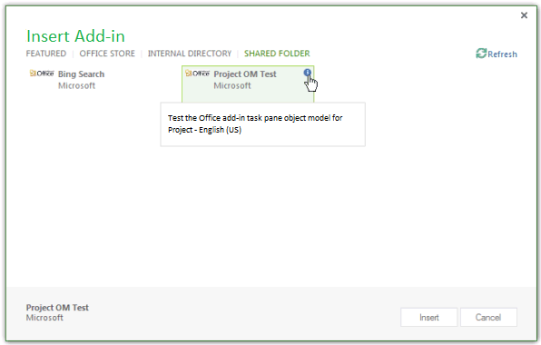

# <a name="create-your-first-task-pane-add-in-for-microsoft-project-by-using-a-text-editor"></a><span data-ttu-id="d5e22-103">使用文本编辑器为 Microsoft Project 创建首个任务窗格加载项</span><span class="sxs-lookup"><span data-stu-id="d5e22-103">Create your first task pane add-in for Microsoft Project by using a text editor</span></span>

<span data-ttu-id="d5e22-104">您可以使用适用于 Project Standard 外接程序的 Yeo Office man 生成器为 Project Standard 2013、Project Professional 2013 或更高版本创建任务窗格外接程序。本文介绍如何创建一个简单的外接程序，该外接程序使用指向文件共享上的 HTML 文件的 XML 清单。</span><span class="sxs-lookup"><span data-stu-id="d5e22-104">You can create a task pane add-in for Project Standard 2013, Project Professional 2013, or later versions using the Yeoman generator for Office Add-ins. This article describes how to create a simple add-in that uses an XML manifest that points to an HTML file on a file share.</span></span> <span data-ttu-id="d5e22-105">the Project OM Test sample add-in tests some JavaScript functions that use the object model for add-ins.使用 Project中的"信任中心"注册包含清单文件的文件共享后，可以从功能区的"Project"**选项卡** 中打开任务窗格外接程序。</span><span class="sxs-lookup"><span data-stu-id="d5e22-105">The Project OM Test sample add-in tests some JavaScript functions that use the object model for add-ins. After you use the **Trust Center** in Project to register the file share that contains the manifest file, you can open the task pane add-in from the **Project** tab on the ribbon.</span></span> <span data-ttu-id="d5e22-106">（本文中的示例代码基于 Microsoft Corporation 的 Arvind lyer 所做的测试应用程序。）</span><span class="sxs-lookup"><span data-stu-id="d5e22-106">(The sample code in this article is based on a test application by Arvind Iyer, Microsoft Corporation.)</span></span>

<span data-ttu-id="d5e22-107">Project使用与其他客户端相同的外接程序清单Office，以及大部分相同的 JavaScript API。</span><span class="sxs-lookup"><span data-stu-id="d5e22-107">Project uses the same add-in manifest schema that other Office clients use, and much of the same JavaScript API.</span></span> <span data-ttu-id="d5e22-108">Project 2013 SDK 下载的 `Samples\Apps` 子目录中提供了本文所述的加载项的完整代码。</span><span class="sxs-lookup"><span data-stu-id="d5e22-108">The complete code for the add-in that is described in this article is available in the  `Samples\Apps` subdirectory of the Project 2013 SDK download.</span></span>

<span data-ttu-id="d5e22-109">“Project OM 测试”示例加载项可以获取任务的 GUID，以及应用和有效项目的属性。</span><span class="sxs-lookup"><span data-stu-id="d5e22-109">The Project OM Test sample add-in can get the GUID of a task and properties of the application and the active project.</span></span> <span data-ttu-id="d5e22-110">如果 Project Professional 2013 打开 SharePoint 库中的项目，加载项可以显示项目的 URL。</span><span class="sxs-lookup"><span data-stu-id="d5e22-110">If Project Professional 2013 opens a project that is in a SharePoint library, the add-in can show the URL of the project.</span></span> 

<span data-ttu-id="d5e22-p104">[Project 2013 SDK 下载内容](https://www.microsoft.com/download/details.aspx?id=30435%20)包含完整源代码。提取和安装 Project2013SDK.msi 文件中的 SDK 和示例时，请在 `\Samples\Apps\Copy_to_AppManifests_FileShare` 子目录中查找清单文件，并在 `\Samples\Apps\Copy_to_AppSource_FileShare` 子目录中查找源代码。</span><span class="sxs-lookup"><span data-stu-id="d5e22-p104">The [Project 2013 SDK download](https://www.microsoft.com/download/details.aspx?id=30435%20) includes the complete source code. When you extract and install the SDK and samples that are in the Project2013SDK.msi file, see the `\Samples\Apps\Copy_to_AppManifests_FileShare` subdirectory for the manifest file and the `\Samples\Apps\Copy_to_AppSource_FileShare` subdirectory for the source code.</span></span> 

<span data-ttu-id="d5e22-113">JSOMCall.html 示例使用 office.js 文件和 project-15.js 文件中包含的 JavaScript 函数。</span><span class="sxs-lookup"><span data-stu-id="d5e22-113">The JSOMCall.html sample uses JavaScript functions in the office.js file and project-15.js file, which are included.</span></span> <span data-ttu-id="d5e22-114">可以使用相应的调试文件（office.debug.js 和 project-15.debug.js）检查这些函数。</span><span class="sxs-lookup"><span data-stu-id="d5e22-114">You can use the corresponding debug files (office.debug.js and project-15.debug.js) to examine the functions.</span></span>

<span data-ttu-id="d5e22-115">有关在加载项中Office JavaScript 的简介，请参阅了解 Office [JavaScript API。](../develop/understanding-the-javascript-api-for-office.md)</span><span class="sxs-lookup"><span data-stu-id="d5e22-115">For an introduction to using JavaScript in Office Add-ins, see [Understanding the Office JavaScript API](../develop/understanding-the-javascript-api-for-office.md).</span></span>

## <a name="procedure-1-to-create-the-add-in-manifest-file"></a><span data-ttu-id="d5e22-p106">过程 1. 创建加载项清单文件</span><span class="sxs-lookup"><span data-stu-id="d5e22-p106">Procedure 1. To create the add-in manifest file</span></span>

<span data-ttu-id="d5e22-118">在本地目录中创建一个 XML 文件。</span><span class="sxs-lookup"><span data-stu-id="d5e22-118">Create an XML file in a local directory.</span></span> <span data-ttu-id="d5e22-119">XML 文件包括 元素和子元素，如 Office `OfficeApp` [外接程序 XML 清单中所述](../develop/add-in-manifests.md)。</span><span class="sxs-lookup"><span data-stu-id="d5e22-119">The XML file includes the `OfficeApp` element and child elements, which are described in the [Office Add-ins XML manifest](../develop/add-in-manifests.md).</span></span> <span data-ttu-id="d5e22-120">例如，创建一个名为 JSOM_SimpleOMCalls.xml 的文件，该文件包含以下 XML (更改元素的 GUID `Id`) 。</span><span class="sxs-lookup"><span data-stu-id="d5e22-120">For example, create a file named JSOM_SimpleOMCalls.xml that contains the following XML (change the GUID value of the `Id` element).</span></span>

```XML
<?xml version="1.0" encoding="utf-8"?>
   <OfficeApp xmlns="http://schemas.microsoft.com/office/appforoffice/1.1"
              xmlns:xsi="http://www.w3.org/2001/XMLSchema-instance"
              xsi:type="TaskPaneApp">
     <!--IMPORTANT! Id must be unique for each add-in. If you copy this manifest ensure that you change this id to your own GUID. -->
     <Id>93A26520-9414-492F-994B-4983A1C7A607</Id>
     <Version>15.0</Version>
     <ProviderName>Microsoft</ProviderName>
     <DefaultLocale>en-us</DefaultLocale>
     <DisplayName DefaultValue="Project OM Test">
       <Override Locale="fr-fr" Value="Le Project OM Test"/>
     </DisplayName>
     <Description DefaultValue="Test the task pane add-in object model for Project - English (US)">
       <Override Locale="fr-fr" Value="Test the task pane add-in object model for Project - French (France)"/>
     </Description>
     <SupportUrl DefaultValue="[Insert the URL of a page that provides support information for the app]" />
     <Hosts>
       <Host Name="Project"/>
       <Host Name="Workbook"/>
       <Host Name="Document"/>
     </Hosts>
    <DefaultSettings>
       <SourceLocation DefaultValue="\\ServerName\AppSource\JSOMCall.html">
         <Override Locale="fr-fr" Value="\\ServerName\AppSource\JSOMCall.html"/>
       </SourceLocation>
     </DefaultSettings>
     <Permissions>ReadWriteDocument</Permissions>
     <IconUrl DefaultValue="http://officeimg.vo.msecnd.net/_layouts/images/general/office_logo.jpg">
       <Override Locale="fr-fr" Value="http://officeimg.vo.msecnd.net/_layouts/images/general/office_logo.jpg"/>
     </IconUrl>
     <AllowSnapshot>true</AllowSnapshot>
   </OfficeApp>
```

<span data-ttu-id="d5e22-121">对于Project， `OfficeApp` 元素必须包含 `xsi:type="TaskPaneApp"` 属性值。</span><span class="sxs-lookup"><span data-stu-id="d5e22-121">For Project, the `OfficeApp` element must include the `xsi:type="TaskPaneApp"` attribute value.</span></span> <span data-ttu-id="d5e22-122">元素 `Id` 是 GUID。</span><span class="sxs-lookup"><span data-stu-id="d5e22-122">The `Id` element is a GUID.</span></span> <span data-ttu-id="d5e22-123">该值必须是文件共享路径或SharePoint HTML 源文件或任务窗格中运行的 Web 应用程序的 `SourceLocation` URL。</span><span class="sxs-lookup"><span data-stu-id="d5e22-123">The `SourceLocation` value must be a file share path or a SharePoint URL for the add-in HTML source file or the web application that runs in the task pane.</span></span> <span data-ttu-id="d5e22-124">有关清单文件中其他元素的解释，请参阅 [Task pane add-ins for Project](../project/project-add-ins.md)。</span><span class="sxs-lookup"><span data-stu-id="d5e22-124">For an explanation of the other elements in manifest file, see [Task pane add-ins for Project](../project/project-add-ins.md).</span></span>

<span data-ttu-id="d5e22-p109">过程 2 演示如何创建 JSOM_SimpleOMCalls.XML 清单为 Project 测试加载项指定的 HTML 文件。HTML 文件中指定的按钮调用相关 JavaScript 函数。可以在 HTML 文件内添加 JavaScript 函数，或将它们放在一个单独的 .js 文件中。</span><span class="sxs-lookup"><span data-stu-id="d5e22-p109">Procedure 2 shows how to create the HTML file that the JSOM_SimpleOMCalls.xml manifest specifies for the Project test add-in. Buttons that are specified in the HTML file call related JavaScript functions. You can add the JavaScript functions within the HTML file, or put them in a separate .js file.</span></span>

## <a name="procedure-2-to-create-the-source-files-for-the-project-om-test-add-in"></a><span data-ttu-id="d5e22-p110">过程 2. 创建 Project OM Test 加载项的源文件</span><span class="sxs-lookup"><span data-stu-id="d5e22-p110">Procedure 2. To create the source files for the Project OM Test add-in</span></span>

1. <span data-ttu-id="d5e22-130">使用由清单中的 元素指定的名称创建 HTML `SourceLocation` JSOM_SimpleOMCalls.xml文件。</span><span class="sxs-lookup"><span data-stu-id="d5e22-130">Create an HTML file with a name that is specified by the `SourceLocation` element in the JSOM_SimpleOMCalls.xml manifest.</span></span> 

   <span data-ttu-id="d5e22-131">例如，在 `C:\Project\AppSource` 目录中创建 theJSOMCall.html 文件。</span><span class="sxs-lookup"><span data-stu-id="d5e22-131">For example, create theJSOMCall.html file in the `C:\Project\AppSource` directory.</span></span> <span data-ttu-id="d5e22-132">虽然您可以使用简单的文本编辑器创建源文件，但使用诸如 Visual Studio Code 这样的工具会更容易，该工具适用于特定的文档类型 (如 HTML 和 JavaScript) ，并且具有其他编辑帮助。</span><span class="sxs-lookup"><span data-stu-id="d5e22-132">Although you can use a simple text editor to create the source files, it is easier to use a tool such as Visual Studio Code, which works with specific document types (such as HTML and JavaScript) and has other editing aids.</span></span> <span data-ttu-id="d5e22-133">如果还未执行 [Project 任务窗格加载项](../project/project-add-ins.md)所述的必应搜索示例，过程 3 将演示如何创建清单指定的 `\\ServerName\AppSource` 文件共享。</span><span class="sxs-lookup"><span data-stu-id="d5e22-133">If you have not already done the Bing Search example that is described in [Task pane add-ins for Project](../project/project-add-ins.md), Procedure 3 shows how to create the `\\ServerName\AppSource` file share that the manifest specifies.</span></span>

   <span data-ttu-id="d5e22-134">the JSOMCall.html file uses the common MicrosoftAjax.js file for AJAX functionality and the Office.js file for the add-in functionality in Office 2013 applications.</span><span class="sxs-lookup"><span data-stu-id="d5e22-134">The JSOMCall.html file uses the common MicrosoftAjax.js file for AJAX functionality and the Office.js file for the add-in functionality in Office 2013 applications.</span></span>

    ```HTML
    <!DOCTYPE html>
    <html>
        <head>
            <title>Project OM Sample Code</title>
            <meta http-equiv="X-UA-Compatible" content="IE=Edge" />
            <script type="text/javascript" src="MicrosoftAjax.js"></script>

            <!-- Use the CDN reference to office.js when deploying your add-in. -->
            <!-- <script src="https://appsforoffice.microsoft.com/lib/1/hosted/office.js"></script> -->
            <script type="text/javascript" src="office.js"></script>
            <script type="text/javascript" src="JSOM_Sample.js"></script>
        </head>
        <body>
            <div id="Common_JSOM_API">
                OBJECT MODEL TESTS
            </div>

            <textarea id="text" rows="6" cols="25">This is the text result.</textarea>
        </body>
    </html>
    ```

   <span data-ttu-id="d5e22-135">元素 `textarea` 指定显示 JavaScript 函数结果的文本框。</span><span class="sxs-lookup"><span data-stu-id="d5e22-135">The `textarea` element specifies a text box that shows results of the JavaScript functions.</span></span>

   > [!NOTE]
   > <span data-ttu-id="d5e22-136">为了让“Project OM 测试”示例能够正常运行，请将 Project 2013 SDK 下载内容中的下列文件复制到 JSOMCall.html 文件所在的相同目录：Office.js、Project-15.js 和 MicrosoftAjax.js。</span><span class="sxs-lookup"><span data-stu-id="d5e22-136">For the Project OM Test sample to work, copy the following files from the Project 2013 SDK download to the same directory as the JSOMCall.html file: Office.js, Project-15.js, and MicrosoftAjax.js.</span></span>

   <span data-ttu-id="d5e22-p112">第 2 步为“Project OM 测试”示例加载项使用的特定函数添加 JSOM_Sample.js 文件。在后续步骤中，将为调用 JavaScript 函数的按钮添加其他 HTML 元素。</span><span class="sxs-lookup"><span data-stu-id="d5e22-p112">Step 2 adds the JSOM_Sample.js file for specific functions that the Project OM Test sample add-in uses. In later steps, you will add other HTML elements for buttons that call JavaScript functions.</span></span>

2. <span data-ttu-id="d5e22-139">在 JSOMCall.html 文件所在的相同目录中，创建 JavaScript 文件 JSOM_Sample.js。</span><span class="sxs-lookup"><span data-stu-id="d5e22-139">Create a JavaScript file named JSOM_Sample.js in the same directory as the JSOMCall.html file.</span></span> 

   <span data-ttu-id="d5e22-140">下面的代码使用 Office.js 文件中的函数来获取应用程序上下文和文档信息。</span><span class="sxs-lookup"><span data-stu-id="d5e22-140">The following code gets the application context and document information by using functions in the Office.js file.</span></span> <span data-ttu-id="d5e22-141">`text`对象是 HTML `textarea` 文件中控件的 ID。</span><span class="sxs-lookup"><span data-stu-id="d5e22-141">The `text` object is the ID of the `textarea` control in the HTML file.</span></span>

   <span data-ttu-id="d5e22-142">**\_ projDoc** 变量使用对象 `ProjectDocument` 进行初始化。</span><span class="sxs-lookup"><span data-stu-id="d5e22-142">The **\_projDoc** variable is initialized with a `ProjectDocument` object.</span></span> <span data-ttu-id="d5e22-143">该代码包括一些简单的错误处理函数，以及 `getContextValues` 获取应用程序上下文和项目文档上下文属性的函数。</span><span class="sxs-lookup"><span data-stu-id="d5e22-143">The code includes some simple error handling functions, and the `getContextValues` function that gets application context and project document context properties.</span></span> <span data-ttu-id="d5e22-144">有关 Project 的 JavaScript 对象模型的详细信息，请参阅 [适用于 Office 的 JavaScript API](../reference/javascript-api-for-office.md)。</span><span class="sxs-lookup"><span data-stu-id="d5e22-144">For more information about the JavaScript object model for Project, see [JavaScript API for Office](../reference/javascript-api-for-office.md).</span></span>


    ```js
    /*
    * JavaScript functions for the Project OM Test example app
    * in the Project 2013 SDK.
    */

    var _projDoc;
    var _app;
    var taskGuid;
    var resourceGuid;

    // The initialize function is required for all add-ins.
    Office.initialize = function (reason) {
        // Checks for the DOM to load using the jQuery ready function.
        $(document).ready(function () {
            // After the DOM is loaded, app-specific code can run.
            _projDoc = Office.context.document;
            _app = Office.context;
        });
    }

    function logError(errorText) {
        text.value = "Error in " + errorText;
    }

    function logEventError(erroneousEvent) {
        logError("event " + erroneousEvent);
    }

    function logMethodError(methodName, errorName, errorMessage) {
        logError(methodName + " method.\nError name: " + errorName + "\nMessage: " + errorMessage);
    }

    // . . . Add other JavaScript functions here.

    function getContextValues() {
        getDocumentUrl();
        getDocumentMode();
        getApplicationContentLanguage();
        getApplicationDisplayLanguage();
    }

    function getDocumentUrl() {
        text.value ="Document URL:\n" +_projDoc.url;
    }

    function getDocumentMode() {
        var docMode = _projDoc.mode;
        text.value = text.value + "\n\nDocument mode: " + docMode;
    }

    function getApplicationContentLanguage() {
        text.value = text.value + "\nApp language: " + _app.contentLanguage;
    }

    function getApplicationDisplayLanguage() {
        text.value = text.value + "\nDisplay language: " + _app.displayLanguage;
    }
    ```

   <span data-ttu-id="d5e22-145">有关应用程序文件中函数Office.debug.js，请参阅 Office [JavaScript API。](../reference/javascript-api-for-office.md)</span><span class="sxs-lookup"><span data-stu-id="d5e22-145">For information about the functions in the Office.debug.js file, see [Office JavaScript API](../reference/javascript-api-for-office.md).</span></span> <span data-ttu-id="d5e22-146">例如， `getDocumentUrl` 函数获取打开的项目的 URL 或文件路径。</span><span class="sxs-lookup"><span data-stu-id="d5e22-146">For example, the `getDocumentUrl` function gets the URL or file path of the open project.</span></span>

3. <span data-ttu-id="d5e22-147">添加调用 Office.js 和 Project-15.js 中异步函数的 JavaScript 函数来获取选定数据：</span><span class="sxs-lookup"><span data-stu-id="d5e22-147">Add JavaScript functions that call asynchronous functions in Office.js and Project-15.js to get selected data:</span></span>

   - <span data-ttu-id="d5e22-148">例如， `getSelectedDataAsync` 是一个Office.js函数，用于获取选定数据的无格式文本。</span><span class="sxs-lookup"><span data-stu-id="d5e22-148">For example, `getSelectedDataAsync` is a general function in Office.js that gets unformatted text for the selected data.</span></span> <span data-ttu-id="d5e22-149">有关详细信息，请参阅 [AsyncResult 对象](/javascript/api/office/office.asyncresult)。</span><span class="sxs-lookup"><span data-stu-id="d5e22-149">For more information, see [AsyncResult object](/javascript/api/office/office.asyncresult).</span></span>

   - <span data-ttu-id="d5e22-150">`getSelectedTaskAsync`任务Project-15.js函数获取选定任务的 GUID。</span><span class="sxs-lookup"><span data-stu-id="d5e22-150">The `getSelectedTaskAsync` function in Project-15.js gets the GUID of the selected task.</span></span> <span data-ttu-id="d5e22-151">同样， `getSelectedResourceAsync` 函数获取所选资源的 GUID。</span><span class="sxs-lookup"><span data-stu-id="d5e22-151">Similarly, the `getSelectedResourceAsync` function gets the GUID of the selected resource.</span></span> <span data-ttu-id="d5e22-152">如果在未选定任务或资源时调用这些函数，函数将显示未定义错误。</span><span class="sxs-lookup"><span data-stu-id="d5e22-152">If you call those functions when a task or a resource is not selected, the functions show an undefined error.</span></span>

   - <span data-ttu-id="d5e22-153">`getTaskAsync`函数获取任务名称和已分配资源的名称。</span><span class="sxs-lookup"><span data-stu-id="d5e22-153">The `getTaskAsync` function gets the task name and the names of the assigned resources.</span></span> <span data-ttu-id="d5e22-154">如果任务位于同步的任务SharePoint，则获取任务列表中SharePoint ID;否则，任务SharePoint ID 为 `getTaskAsync` 0。</span><span class="sxs-lookup"><span data-stu-id="d5e22-154">If the task is in a synchronized SharePoint task list, `getTaskAsync` gets the task ID in the SharePoint list; otherwise, the SharePoint task ID is 0.</span></span>

     > [!NOTE]
     > <span data-ttu-id="d5e22-155">出于演示目的，此示例代码包括一个错误。</span><span class="sxs-lookup"><span data-stu-id="d5e22-155">For demonstration purposes, the example code includes a bug.</span></span> <span data-ttu-id="d5e22-156">如果未 `taskGuid` 定义，函数 `getTaskAsync` 错误关闭。</span><span class="sxs-lookup"><span data-stu-id="d5e22-156">If `taskGuid` is undefined, the `getTaskAsync` function errors off.</span></span> <span data-ttu-id="d5e22-157">如果获得有效的任务 GUID，然后选择其他任务，函数将获取由 函数操作的最新任务 `getTaskAsync` `getSelectedTaskAsync` 的数据。</span><span class="sxs-lookup"><span data-stu-id="d5e22-157">If you get a valid task GUID and then select a different task, the `getTaskAsync` function gets data for the most recent task that was operated on by the `getSelectedTaskAsync` function.</span></span>
  
   - <span data-ttu-id="d5e22-158">`getTaskFields`、 `getResourceFields` `getProjectFields` 和 是本地函数，调用 、 或 多次 `getTaskFieldAsync` 获取任务或资源的 `getResourceFieldAsync` `getProjectFieldAsync` 指定字段。</span><span class="sxs-lookup"><span data-stu-id="d5e22-158">`getTaskFields`, `getResourceFields`, and `getProjectFields` are local functions that call `getTaskFieldAsync`, `getResourceFieldAsync`, or `getProjectFieldAsync` multiple times to get specified fields of a task or a resource.</span></span> <span data-ttu-id="d5e22-159">在project-15.debug.js文件中， `ProjectTaskFields` 枚举 `ProjectResourceFields` 和枚举显示支持哪些字段。</span><span class="sxs-lookup"><span data-stu-id="d5e22-159">In the project-15.debug.js file, the `ProjectTaskFields` enumeration and the `ProjectResourceFields` enumeration show which fields are supported.</span></span>

   - <span data-ttu-id="d5e22-160">函数获取在 (枚举中定义的视图project-15.debug.js) `getSelectedViewAsync` `ProjectViewTypes` 以及视图的名称。</span><span class="sxs-lookup"><span data-stu-id="d5e22-160">The `getSelectedViewAsync` function gets the type of view (defined in the `ProjectViewTypes` enumeration in project-15.debug.js) and the name of the view.</span></span>

   - <span data-ttu-id="d5e22-161">如果项目与任务SharePoint同步，函数 `getWSSUrlAsync` 将获取任务列表的 URL 和名称。</span><span class="sxs-lookup"><span data-stu-id="d5e22-161">If the project is synchronized with a SharePoint tasks list, the `getWSSUrlAsync` function gets the URL and the name of the tasks list.</span></span> <span data-ttu-id="d5e22-162">如果项目未与任务SharePoint同步， `getWSSUrlAsync` 函数错误关闭。</span><span class="sxs-lookup"><span data-stu-id="d5e22-162">If the project is not synchronized with a SharePoint tasks list, the `getWSSUrlAsync` function errors off.</span></span>

     > [!NOTE]
     > <span data-ttu-id="d5e22-163">若要获取SharePoint URL 和名称，建议您将 函数与 `getProjectFieldAsync` `WSSUrl` `WSSList` [ProjectProjectFields](/javascript/api/office/office.projectprojectfields)枚举中的 和 常量一同使用。</span><span class="sxs-lookup"><span data-stu-id="d5e22-163">To get the SharePoint URL and name of the tasks list, we recommend that you use the `getProjectFieldAsync` function with the `WSSUrl` and `WSSList` constants in the [ProjectProjectFields](/javascript/api/office/office.projectprojectfields) enumeration.</span></span>

   <span data-ttu-id="d5e22-p122">以下代码的每个函数中都包含由 `function (asyncResult)` 指定的匿名函数，该函数是获取异步结果的回叫。你可以使用命名函数，而不是匿名函数，前者有助于实现复杂外接程序的可维护性。</span><span class="sxs-lookup"><span data-stu-id="d5e22-p122">Each of the functions in the following code includes an anonymous function that is specified by  `function (asyncResult)`, which is a callback that gets the asynchronous result. Instead of anonymous functions, you could use named functions, which can help with maintainability of complex add-ins.</span></span>

    ```js
    // Get the data in the selected cells of the grid in the active view.
    function getSelectedDataAsync() {
        _projDoc.getSelectedDataAsync(
            Office.CoercionType.Text,
            { ValueFormat: "Formatted" },
            function (asyncResult) {
                if (asyncResult.status == Office.AsyncResultStatus.Succeeded)
                    text.value = asyncResult.value;
                else
                    logMethodError("getSelectedDataAsync", asyncResult.error.name,
                                   asyncResult.error.message);
            }
        );
    }

    // Get the GUID of the selected task.
    function getSelectedTaskAsync() {
        _projDoc.getSelectedTaskAsync(function (asyncResult) {
            if (asyncResult.status == Office.AsyncResultStatus.Succeeded) {
                text.value = asyncResult.value;
                taskGuid = asyncResult.value;
            }
            else {
                logMethodError("getSelectedTaskAsync", asyncResult.error.name,
                                   asyncResult.error.message);
            }
        });
    }

    // Get the GUID of the selected resource.
    function getSelectedResourceAsync() {
        _projDoc.getSelectedResourceAsync(function (asyncResult) {
            if (asyncResult.status == Office.AsyncResultStatus.Succeeded) {
                text.value = asyncResult.value;
                resourceGuid = asyncResult.value;
            }
            else {
                logMethodError("getSelectedResourceAsync", asyncResult.error.name,
                                   asyncResult.error.message);
            }
        });
    }

    // Get data for the specified task.
    function getTaskAsync() {
        if (taskGuid != undefined) {
            _projDoc.getTaskAsync(
                taskGuid,
                function (asyncResult) {
                    if (asyncResult.status === Office.AsyncResultStatus.Failed) {
                        logMethodError("getTaskAsync", asyncResult.error.name,
                                   asyncResult.error.message);
                    } else {
                        var taskInfo = asyncResult.value;
                        var taskOutput = "Task name: " + taskInfo.taskName +
                                         "\nGUID: " + taskGuid +
                                         "\nWSS Id: " + taskInfo.wssTaskId +
                                         "\nResourceNames: " + taskInfo.resourceNames;
                        text.value = taskOutput;
                    }
                }
            );
        } else {
            text.value = 'Task GUID not valid:\n' + taskGuid;
        } 
    }

    // Get additional data for task fields.
    function getTaskFields() {
        text.value = "";

        _projDoc. getTaskFieldAsync(taskGuid, Office.ProjectTaskFields.Name,
            function (asyncResult) {
                if (asyncResult.status == Office.AsyncResultStatus.Succeeded) {
                    text.value = text.value + "Name: "
                        + asyncResult.value.fieldValue + "\n";
                }
                else {
                    logMethodError("getTaskFieldAsync", asyncResult.error.name,
                                   asyncResult.error.message);
                }
            }
        );

        _projDoc.getTaskFieldAsync(taskGuid, Office.ProjectTaskFields.ID,
            function (asyncResult) {
                if (asyncResult.status == Office.AsyncResultStatus.Succeeded) {
                    text.value = text.value + "ID: "
                        + asyncResult.value.fieldValue + "\n";
                }
                else {
                    logMethodError("getTaskFieldAsync", asyncResult.error.name,
                                   asyncResult.error.message);
                }
            }
        );

        _projDoc.getTaskFieldAsync(taskGuid, Office.ProjectTaskFields.Start,
            function (asyncResult) {
                if (asyncResult.status == Office.AsyncResultStatus.Succeeded) {
                    text.value = text.value + "Start: "
                        + asyncResult.value.fieldValue + "\n";
                }
                else {
                    logMethodError("getTaskFieldAsync", asyncResult.error.name,
                                   asyncResult.error.message);
                }
            }
        );

        _projDoc.getTaskFieldAsync(taskGuid, Office.ProjectTaskFields.Duration,
            function (asyncResult) {
                if (asyncResult.status == Office.AsyncResultStatus.Succeeded) {
                    text.value = text.value + "Duration: "
                        + asyncResult.value.fieldValue + "\n";
                }
                else {
                    logMethodError("getTaskFieldAsync", asyncResult.error.name,
                                   asyncResult.error.message);
                }
            }
        );

        _projDoc.getTaskFieldAsync(taskGuid, Office.ProjectTaskFields.Priority,
            function (asyncResult) {
                if (asyncResult.status == Office.AsyncResultStatus.Succeeded) {
                    text.value = text.value + "Priority: "
                        + asyncResult.value.fieldValue + "\n";
                }
                else {
                    logMethodError("getTaskFieldAsync", asyncResult.error.name,
                                   asyncResult.error.message);
                }
            }
        );

        _projDoc.getTaskFieldAsync(taskGuid, Office.ProjectTaskFields.Notes,
            function (asyncResult) {
                if (asyncResult.status == Office.AsyncResultStatus.Succeeded) {
                    text.value = text.value + "Notes: "
                        + asyncResult.value.fieldValue + "\n";
                }
                else {
                    logMethodError("getTaskFieldAsync", asyncResult.error.name,
                                   asyncResult.error.message);
                }
            }
        ); 
    }

    // Get data for the specified resource fields.
    function getResourceFields() {
        text.value = "";

        _projDoc.getResourceFieldAsync(resourceGuid, Office.ProjectResourceFields.Name,
            function (asyncResult) {
                if (asyncResult.status == Office.AsyncResultStatus.Succeeded) {
                    text.value = text.value + "Resource name: " + asyncResult.value.fieldValue + "\n";
                }
                else {
                    logMethodError("getResourceFieldAsync", asyncResult.error.name,
                                   asyncResult.error.message);
                }
            }
        );

        _projDoc.getResourceFieldAsync(resourceGuid, Office.ProjectResourceFields.Cost,
            function (asyncResult) {
                if (asyncResult.status == Office.AsyncResultStatus.Succeeded) {
                    text.value = text.value + "Cost: " + asyncResult.value.fieldValue + "\n";
                }
                else {
                    logMethodError("getResourceFieldAsync", asyncResult.error.name,
                                   asyncResult.error.message);
                }
            }
        );

        _projDoc.getResourceFieldAsync(resourceGuid, Office.ProjectResourceFields.StandardRate,
            function (asyncResult) {
                if (asyncResult.status == Office.AsyncResultStatus.Succeeded) {
                    text.value = text.value + "Standard Rate: " + asyncResult.value.fieldValue + "\n";
                }
                else {
                    logMethodError("getResourceFieldAsync", asyncResult.error.name, asyncResult.error.message);
                }
            }
        );

        _projDoc.getResourceFieldAsync(resourceGuid, Office.ProjectResourceFields.ActualCost,
            function (asyncResult) {
                if (asyncResult.status == Office.AsyncResultStatus.Succeeded) {
                    text.value = text.value + "Actual Cost: " + asyncResult.value.fieldValue + "\n";
                }
                else {
                    logMethodError("getResourceFieldAsync", asyncResult.error.name, asyncResult.error.message);
                }
            }
        );

        _projDoc.getResourceFieldAsync(resourceGuid, Office.ProjectResourceFields.ActualWork,
            function (asyncResult) {
                if (asyncResult.status == Office.AsyncResultStatus.Succeeded) {
                    text.value = text.value + "Actual Work: " + asyncResult.value.fieldValue + "\n";
                }
                else {
                    logMethodError("getResourceFieldAsync", asyncResult.error.name,
                                   asyncResult.error.message);
                }
            }
        );

        _projDoc.getResourceFieldAsync(resourceGuid, Office.ProjectResourceFields.Units,
            function (asyncResult) {
                if (asyncResult.status == Office.AsyncResultStatus.Succeeded) {
                    text.value = text.value + "Units: " + asyncResult.value.fieldValue + "\n";
                }
                else {
                    logMethodError("getResourceFieldAsync", asyncResult.error.name,
                                   asyncResult.error.message);
                }
            }
        );
    }

    // Get the URL and list name of the synchronized SharePoint task list.
    // Recommended: use getProjectField instead.
    function getWSSUrlAsync() {
        _projDoc.getWSSUrlAsync(function (asyncResult) {
            if (asyncResult.status == Office.AsyncResultStatus.Succeeded) {
                text.value = "SharePoint URL:\n" + asyncResult.value.serverUrl
                    + "\nList name: " + asyncResult.value.listName;
            }
            else {
                logMethodError("getWSSUrlAsync", asyncResult.error.name, asyncResult.error.message);
            }
        });
    }

    // Get the type and name of the selected view.
    function getSelectedViewAsync() {
        _projDoc.getSelectedViewAsync(function (asyncResult) {
            text.value = "View type: " + asyncResult.value.viewType
                + "\nName: " + asyncResult.value.viewName;
        });
    }

    // Get information about the active project.
    function getProjectFields() {
        text.value = "";

        _projDoc.getProjectFieldAsync(Office.ProjectProjectFields.GUID,
            function (asyncResult) {
                if (asyncResult.status == Office.AsyncResultStatus.Succeeded) {
                    text.value = text.value + "Project GUID: " + asyncResult.value.fieldValue + "\n";
                }
                else {
                    logMethodError("getProjectFieldAsync", asyncResult.error.name, asyncResult.error.message);
                }
            }
        );

        _projDoc.getProjectFieldAsync(Office.ProjectProjectFields.Start,
            function (asyncResult) {
                if (asyncResult.status == Office.AsyncResultStatus.Succeeded) {
                    text.value = text.value + "\nStart: " + asyncResult.value.fieldValue + "\n";
                }
                else {
                    logMethodError("getProjectFieldAsync", asyncResult.error.name, asyncResult.error.message);
                }
            }
        );

        _projDoc.getProjectFieldAsync(Office.ProjectProjectFields.Finish,
            function (asyncResult) {
                if (asyncResult.status == Office.AsyncResultStatus.Succeeded) {
                    text.value = text.value + "\nFinish: " + asyncResult.value.fieldValue + "\n";
                }
                else {
                    logMethodError("getProject " + errorText);
                }
            }
        );

        _projDoc.getProjectFieldAsync(Office.ProjectProjectFields.CurrencyDigits,
            function (asyncResult) {
                if (asyncResult.status == Office.AsyncResultStatus.Succeeded) {
                    text.value = text.value + "\nCurrency digits: " + asyncResult.value.fieldValue + "\n";
                }
                else {
                    logMethodError("getProjectFieldAsync", asyncResult.error.name, asyncResult.error.message);
                }
            }
        );

        _projDoc.getProjectFieldAsync(Office.ProjectProjectFields.CurrencySymbol,
            function (asyncResult) {
                if (asyncResult.status == Office.AsyncResultStatus.Succeeded) {
                    text.value = text.value + "Currency symbol: " + asyncResult.value.fieldValue + "\n";
                }
                else {
                    logMethodError("getProjectFieldAsync", asyncResult.error.name, asyncResult.error.message);
                }
            }
        );

        _projDoc.getProjectFieldAsync(Office.ProjectProjectFields.CurrencySymbolPosition,
            function (asyncResult) {
                if (asyncResult.status == Office.AsyncResultStatus.Succeeded) {
                    text.value = text.value + "\nSymbol position: " + asyncResult.value.fieldValue + "\n";
                }
                else {
                    logMethodError("getProjectFieldAsync", asyncResult.error.name, asyncResult.error.message);
                }
            }
        );

        _projDoc.getProjectFieldAsync(Office.ProjectProjectFields.ProjectServerUrl,
            function (asyncResult) {
                if (asyncResult.status == Office.AsyncResultStatus.Succeeded) {
                    text.value = text.value + "\nProject web app URL:\n  " + asyncResult.value.fieldValue + "\n";
                }
                else {
                    logMethodError("getProjectFieldAsync", asyncResult.error.name, asyncResult.error.message);
                }
            }
        );

        _projDoc.getProjectFieldAsync(Office.ProjectProjectFields.WSSUrl,
            function (asyncResult) {
                if (asyncResult.status == Office.AsyncResultStatus.Succeeded) {
                    text.value = text.value + "\nSharePoint URL:\n  " + asyncResult.value.fieldValue + "\n";
                }
                else {
                    logMethodError("getProjectFieldAsync", asyncResult.error.name, asyncResult.error.message);
                }
            }
        );

        _projDoc.getProjectFieldAsync(Office.ProjectProjectFields.WSSList,
            function (asyncResult) {
                if (asyncResult.status == Office.AsyncResultStatus.Succeeded) {
                    text.value = text.value + "\nSharePoint list: " + asyncResult.value.fieldValue + "\n";
                }
                else {
                    logMethodError("getProjectFieldAsync", asyncResult.error.name, asyncResult.error.message);
                }
            }
        );
    }
    ```

4. <span data-ttu-id="d5e22-166">添加 JavaScript 事件处理程序回调和函数，以注册任务选择、资源选择和查看选择更改事件处理程序以及注销事件处理程序。</span><span class="sxs-lookup"><span data-stu-id="d5e22-166">Add JavaScript event handler callbacks and functions to register the task selection, resource selection, and view selection change event handlers and to unregister the event handlers.</span></span> <span data-ttu-id="d5e22-167">`manageEventHandlerAsync`该函数添加或删除指定的事件处理程序，具体取决于 _operation_ 参数。</span><span class="sxs-lookup"><span data-stu-id="d5e22-167">The `manageEventHandlerAsync` function adds or removes the specified event handler, depending on the _operation_ parameter.</span></span> <span data-ttu-id="d5e22-168">操作可以是 `addHandlerAsync` 或 `removeHandlerAsync` 。</span><span class="sxs-lookup"><span data-stu-id="d5e22-168">The operation can be `addHandlerAsync` or `removeHandlerAsync`.</span></span>

   <span data-ttu-id="d5e22-169">、 `manageTaskEventHandler` `manageResourceEventHandler` 和 `manageViewEventHandler` 函数可以添加或删除 _docMethod_ 参数指定的事件处理程序。</span><span class="sxs-lookup"><span data-stu-id="d5e22-169">The `manageTaskEventHandler`, `manageResourceEventHandler`, and `manageViewEventHandler` functions can add or remove an event handler, as specified by the _docMethod_ parameter.</span></span>

    ```js
    // Task selection changed event handler.
    function onTaskSelectionChanged(eventArgs) {
        text.value = "In task selection change event handler";
    }

    // Resource selection changed event handler.
    function onResourceSelectionChanged(eventArgs) {
        text.value = "In Resource selection changed event handler";
    }

    // View selection changed event handler.
    function onViewSelectionChanged(eventArgs) {
        text.value = "In View selection changed event handler";
    }

    // Add or remove the specified event handler.
    function manageEventHandlerAsync(eventType, handler, operation, onComplete) {
        _projDoc[operation]   //The operation is addHandlerAsync or removeHandlerAsync.
        (
            eventType,
            handler,
            function (asyncResult) {
                if (onComplete) {
                    onComplete(asyncResult, operation);
                } else {
                    var message = "Operation: " + operation;
                    message = message + "\nStatus: " + asyncResult.status + "\n";
                    text.value = message;
                }
            }
        );
    }

    // Write the asyncResult status from the manageEventHandlerAsync function (optional). 
    function onComplete(asyncResult, operation) {
        var message = "In onComplete function for " + operation;
        message = message + "\nStatus: " + asyncResult.status;
        text.value = message;
    }

    // Add or remove a task selection changed event handler.
    function manageTaskEventHandler(docMethod) {
        manageEventHandlerAsync(
            Office.EventType.TaskSelectionChanged,      // The task selection changed event.
            onTaskSelectionChanged,                     // The event handler.
            docMethod,                // The Office.Document method to add or remove an event handler.
            onComplete                // Manages the successful asyncResult data (optional).
        );
    }

    // Add or remove a resource selection changed event handler.
    function manageResourceEventHandler(docMethod) {
        manageEventHandlerAsync(
            Office.EventType.ResourceSelectionChanged,  // The resource selection changed event.
            onResourceSelectionChanged,                 // The event handler.
            docMethod,                // The Office.Document method to add or remove an event handler.
            onComplete                // Manages the successful asyncResult data (optional).
        );
    }

    // Add or remove a view selection changed event handler.
    function manageViewEventHandler(docMethod) {
        manageEventHandlerAsync(
            Office.EventType.ViewSelectionChanged,      // The view selection changed event.
            onViewSelectionChanged,                     // The event handler.
            docMethod,                // The Office.Document method to add or remove an event handler.
            onComplete                // Manages the successful asyncResult data (optional).
        );
    }
    ```

5. <span data-ttu-id="d5e22-170">对于 HTML 文档正文，添加调用 JavaScript 函数的按钮进行测试。</span><span class="sxs-lookup"><span data-stu-id="d5e22-170">For the body of the HTML document, add buttons that call the JavaScript functions for testing.</span></span> <span data-ttu-id="d5e22-171">例如，在通用 JSOM API 的 元素中 `div` ，添加调用常规函数的输入 `getSelectedDataAsync` 按钮。</span><span class="sxs-lookup"><span data-stu-id="d5e22-171">For example, in the `div` element for the common JSOM API, add an input button that calls the general `getSelectedDataAsync` function.</span></span>

    ```HTML
    <body>
        <div id="Common_JSOM_API">
        OBJECT MODEL TESTS
        <br /><br />
        <strong>General function:</strong>
        <br />
        <input id="Button5" class="button-wide" type="button" onclick="getSelectedDataAsync()" 
            value="getSelectedDataAsync" />
        </div>
        <!--  more code . . .  -->
    ```

6. <span data-ttu-id="d5e22-172">添加 `div` 包含特定于项目的任务函数和事件的按钮 `TaskSelectionChanged` 的节。</span><span class="sxs-lookup"><span data-stu-id="d5e22-172">Add a `div` section with buttons for project-specific task functions and for the `TaskSelectionChanged` event.</span></span>

    ```HTML
    <div id="ProjectSpecificTask">
      <br />
      <strong>Project-specific task methods:</strong><br />
      <button class="button-wide" onclick="getSelectedTaskAsync()">getSelectedTaskAsync</button><br />
      <button class="button-wide" onclick="getTaskAsync()">getTaskAsync</button><br />
      <button class="button-wide" onclick="getTaskFields()">Get Task Fields</button><br />
      <button class="button-wide" onclick="getWSSUrlAsync()">getWSSUrlAsync</button>
      <strong>Task selection changed:</strong>
      <button class="button-narrow" onclick="manageTaskEventHandler('addHandlerAsync')">Add</button>
      <button class="button-narrow" onclick="manageTaskEventHandler('removeHandlerAsync')">Remove</button>
    </div>
    ```

7. <span data-ttu-id="d5e22-173">为资源方法和事件、视图方法和事件、项目属性和上下文属性添加包含按钮 `div` 的节</span><span class="sxs-lookup"><span data-stu-id="d5e22-173">Add `div` sections with buttons for the resource methods and events, view methods and events, project properties, and context properties</span></span>

    ```HTML
    <div id="ResourceMethods">
      <br />
      <strong>Resource methods:</strong>
      <button class="button-wide" onclick="getSelectedResourceAsync()">getSelectedResourceAsync</button><br />
      <button class="button-wide" onclick="getResourceFields()">Get Resource Fields</button><br />
      <strong>Resource selection changed:</strong>
      <button class="button-narrow" onclick="manageResourceEventHandler('addHandlerAsync')">Add</button>
      <button class="button-narrow" onclick="manageResourceEventHandler('removeHandlerAsync')">Remove</button>
    </div>
    <div id="ViewMethods">
      <br />
      <strong>View method:</strong>
      <button class="button-wide" onclick="getSelectedViewAsync()">getSelectedViewAsync</button><br />
      <strong>View selection changed:</strong>
      <button class="button-narrow" onclick="manageViewEventHandler('addHandlerAsync')">Add</button>
      <button class="button-narrow" onclick="manageViewEventHandler('removeHandlerAsync')">Remove</button>
    </div>
    <div id="ProjectMethods">
      <br />
      <strong>Project properties:</strong>
      <button class="button-wide" onclick="getProjectFields()">Get Project Fields</button><br />
    </div>
    <div id="ContextVariables">
      <br />
      <strong>Context properties:</strong>
      <button class="button-wide" onclick="getContextValues()">Get Context Values</button>
    </div>
    ```

8. <span data-ttu-id="d5e22-174">若要设置按钮元素的格式，请添加 CSS `style` 元素。</span><span class="sxs-lookup"><span data-stu-id="d5e22-174">To format the button elements, add a CSS `style` element.</span></span> <span data-ttu-id="d5e22-175">例如，将以下内容添加为 元素的子 `head` 元素。</span><span class="sxs-lookup"><span data-stu-id="d5e22-175">For example, add the following as a child of the `head` element.</span></span>

    ```HTML
    <style type="text/css">
        .button-wide
        {
            width: 210px;
            margin-top: 2px;
        }
        .button-narrow
        {
            width: 80px;
            margin-top: 2px;
        }
    </style>
    ```

<span data-ttu-id="d5e22-176">过程 3 显示如何安装和使用 Project OM Test 加载项功能。</span><span class="sxs-lookup"><span data-stu-id="d5e22-176">Procedure 3 shows how to install and use the Project OM Test add-in features.</span></span>

## <a name="procedure-3-to-install-and-use-the-project-om-test-add-in"></a><span data-ttu-id="d5e22-p126">过程 3. 安装和使用 Project OM Test 加载项</span><span class="sxs-lookup"><span data-stu-id="d5e22-p126">Procedure 3. To install and use the Project OM Test add-in</span></span>

1. <span data-ttu-id="d5e22-p127">为包含 JSOM_SimpleOMCalls.XML 清单的目录创建一个文件共享。可以在本地计算机或可通过网络访问的远程计算机上创建该文件共享。例如，如果清单位于本地计算机上的 `C:\Project\AppManifests` 目录中，则运行以下命令：</span><span class="sxs-lookup"><span data-stu-id="d5e22-p127">Create a file share for the directory that contains the JSOM_SimpleOMCalls.xml manifest. You can create the file share on the local computer or on a remote computer that is accessible on the network. For example, if the manifest is in the  `C:\Project\AppManifests` directory on the local computer, run the following command:</span></span>

    `Net share AppManifests=C:\Project\AppManifests`

2. <span data-ttu-id="d5e22-p128">为包含 Project OM Test 加载项的 HTML 和 JavaScript 文件的目录创建一个文件共享。确保文件共享路径与在 JSOM_SimpleOMCalls.xml 清单中指定的路径匹配。例如，如果文件位于本地计算机上的 `C:\Project\AppSource` 目录中，则运行以下命令：</span><span class="sxs-lookup"><span data-stu-id="d5e22-p128">Create a file share for the directory that contains the HTML and JavaScript files for the Project OM Test add-in. Ensure the file share path matches the path that is specified in the JSOM_SimpleOMCalls.xml manifest. For example, if the files are in the  `C:\Project\AppSource` directory on the local computer, run the following command:</span></span>

    `net share AppSource=C:\Project\AppSource`

3. <span data-ttu-id="d5e22-185">在 Project 中，打开“Project 选项”对话框，选择“信任中心”，然后选择“信任中心设置”。</span><span class="sxs-lookup"><span data-stu-id="d5e22-185">In Project, open the **Project Options** dialog box, choose **Trust Center**, and then choose **Trust Center Settings**.</span></span>

   <span data-ttu-id="d5e22-186">[Project 任务窗格加载项](../project/project-add-ins.md)中还介绍了加载项注册过程和其他详细信息。</span><span class="sxs-lookup"><span data-stu-id="d5e22-186">The procedure for registering an add-in is also described in [Task pane add-ins for Project](../project/project-add-ins.md), with additional information.</span></span>

4. <span data-ttu-id="d5e22-187">在“信任中心”对话框的左侧窗格中，选择“受信任的加载项目录”。</span><span class="sxs-lookup"><span data-stu-id="d5e22-187">In the **Trust Center** dialog box, in the left pane, choose **Trusted Add-in Catalogs**.</span></span>

5. <span data-ttu-id="d5e22-188">如果已添加搜索 `\\ServerName\AppManifests` 外接程序必应，请跳过此步骤。</span><span class="sxs-lookup"><span data-stu-id="d5e22-188">If you have already added the `\\ServerName\AppManifests` path for the Bing Search add-in, skip this step.</span></span> <span data-ttu-id="d5e22-189">否则，在"受信任的外接程序目录"窗格中，在"目录 URL"文本框中添加路径，选择"添加目录"，将网络共享启用为默认源 (请参阅图 1) ，然后选择" `\\ServerName\AppManifests` 确定"。   </span><span class="sxs-lookup"><span data-stu-id="d5e22-189">Otherwise, in the **Trusted Add-in Catalogs** pane, add the `\\ServerName\AppManifests` path in the **Catalog Url** text box, choose **Add catalog**, enable the network share as a default source (see Figure 1), and then choose **OK**.</span></span>

   <span data-ttu-id="d5e22-190">*图 1.为外接程序清单添加网络文件共享*</span><span class="sxs-lookup"><span data-stu-id="d5e22-190">*Figure 1. Adding a network file share for add-in manifests*</span></span>

   

6. <span data-ttu-id="d5e22-p130">添加新的加载项或更改源代码后，重新启动 Project。在“Project”功能区上，选择“Office 加载项”下拉菜单，然后选择“查看全部”。在“插入加载项”对话框中，选择“共享文件夹”（见图 2），选择“Project OM Test”，然后选择“插入”。Project OM Test 加载项将在任务窗格中启动。</span><span class="sxs-lookup"><span data-stu-id="d5e22-p130">After you add new add-ins, or change the source code, restart Project. On the **PROJECT** ribbon, choose the **Office Add-ins** drop-down menu, and then choose **See All**. In the **Insert Add-in** dialog box, choose **SHARED FOLDER** (see Figure 2), select **Project OM Test**, and then choose **Insert**. The Project OM Test add-in starts in a task pane.</span></span>

   <span data-ttu-id="d5e22-196">*图 2.启动文件共享上的 Project OM Test 外接程序*</span><span class="sxs-lookup"><span data-stu-id="d5e22-196">*Figure 2. Starting the Project OM Test add-in that is on a file share*</span></span>

   

7. <span data-ttu-id="d5e22-198">在 Project 中，创建并保存具有至少两个任务的简单项目。</span><span class="sxs-lookup"><span data-stu-id="d5e22-198">In Project, create and save a simple project that has at least two tasks.</span></span> <span data-ttu-id="d5e22-199">例如，创建名为 T1、T2 的任务和名为 M1 的里程碑，然后将任务工期和前置任务设置为与图 3 中的类似。</span><span class="sxs-lookup"><span data-stu-id="d5e22-199">For example, create tasks named T1, T2, and a milestone named M1, and then set the task durations and predecessors to be similar to those in Figure 3.</span></span> <span data-ttu-id="d5e22-200">选择功能区上的“PROJECT”选项卡，选择任务 T2 的整个行，然后在任务窗格中选择“getSelectedDataAsync”按钮。</span><span class="sxs-lookup"><span data-stu-id="d5e22-200">Choose the **PROJECT** tab on the ribbon, select the entire row for task T2, and then choose the **getSelectedDataAsync** button in the task pane.</span></span> <span data-ttu-id="d5e22-201">图 3 显示在 **Project OM Test** 外接程序的文本框中选择的数据。</span><span class="sxs-lookup"><span data-stu-id="d5e22-201">Figure 3 shows the data that is selected in the text box of the **Project OM Test** add-in.</span></span>

   <span data-ttu-id="d5e22-202">*图 3.使用 Project OM Test 外接程序*</span><span class="sxs-lookup"><span data-stu-id="d5e22-202">*Figure 3. Using the Project OM Test add-in*</span></span>

   

8. <span data-ttu-id="d5e22-204">选择第一项任务的“工期”列中的单元格，然后选择“Project OM Test”加载项中的“getSelectedDataAsync”按钮。</span><span class="sxs-lookup"><span data-stu-id="d5e22-204">Select the cell in the **Duration** column for the first task, and then choose the **getSelectedDataAsync** button in the **Project OM Test** add-in.</span></span> <span data-ttu-id="d5e22-205">该 `getSelectedDataAsync` 函数将文本框值设置为显示 `2 days` 。</span><span class="sxs-lookup"><span data-stu-id="d5e22-205">The `getSelectedDataAsync` function sets the text box value to show `2 days`.</span></span> 

9. <span data-ttu-id="d5e22-206">选择所有三项任务的三个“工期”单元格。</span><span class="sxs-lookup"><span data-stu-id="d5e22-206">Select the three **Duration** cells for all three tasks.</span></span> <span data-ttu-id="d5e22-207">对于在不同行中选定的单元格，该函数返回以分号分隔的文本 `getSelectedDataAsync` 值，例如， `2 days;4 days;0 days` 。</span><span class="sxs-lookup"><span data-stu-id="d5e22-207">The `getSelectedDataAsync` function returns semicolon-separated text values for cells selected in different rows, for example, `2 days;4 days;0 days`.</span></span>

   <span data-ttu-id="d5e22-208">该 `getSelectedDataAsync` 函数返回行中选定单元格的逗号分隔文本值。</span><span class="sxs-lookup"><span data-stu-id="d5e22-208">The `getSelectedDataAsync` function returns comma-separated text values for cells selected within a row.</span></span> <span data-ttu-id="d5e22-209">有关图 3 中的示例，选中任务 T2 的整行。</span><span class="sxs-lookup"><span data-stu-id="d5e22-209">For example in Figure 3, the entire row for task T2 is selected.</span></span> <span data-ttu-id="d5e22-210">选择 时 `getSelectedDataAsync` ，文本框将显示以下内容：  `,Auto Scheduled,T2,4 days,Thu 6/14/12,Tue 6/19/12,1,,<NA>`</span><span class="sxs-lookup"><span data-stu-id="d5e22-210">When you choose `getSelectedDataAsync`, the text box shows the following:  `,Auto Scheduled,T2,4 days,Thu 6/14/12,Tue 6/19/12,1,,<NA>`</span></span>

   <span data-ttu-id="d5e22-211">“指标”列和“资源名称”列均为空，因此文本数组显示这些列为空值。</span><span class="sxs-lookup"><span data-stu-id="d5e22-211">The **Indicators** column and the **Resource Names** column are both empty, so the text array shows empty values for those columns.</span></span> <span data-ttu-id="d5e22-212">`<NA>` 值代表“**添加新列**”单元格。</span><span class="sxs-lookup"><span data-stu-id="d5e22-212">The `<NA>` value is for the **Add New Column** cell.</span></span>

10. <span data-ttu-id="d5e22-213">选择任务 T2 行中的任何单元格，或任务 T2 的整行，然后选择“getSelectedTaskAsync”。</span><span class="sxs-lookup"><span data-stu-id="d5e22-213">Select any cell in the row for task T2, or the entire row for task T2, and then choose **getSelectedTaskAsync**.</span></span> <span data-ttu-id="d5e22-214">文本框显示任务 GUID 值，例如，`{25D3E03B-9A7D-E111-92FC-00155D3BA208}`。</span><span class="sxs-lookup"><span data-stu-id="d5e22-214">The text box shows the task GUID value, for example,  `{25D3E03B-9A7D-E111-92FC-00155D3BA208}`.</span></span> <span data-ttu-id="d5e22-215">Project将该值存储在 om Test 加载项的Project `taskGuid` 变量中。</span><span class="sxs-lookup"><span data-stu-id="d5e22-215">Project stores that value in the global `taskGuid` variable of the **Project OM Test** add-in.</span></span>

11. <span data-ttu-id="d5e22-216">选择 `getTaskAsync` 。</span><span class="sxs-lookup"><span data-stu-id="d5e22-216">Select `getTaskAsync`.</span></span> <span data-ttu-id="d5e22-217">如果 `taskGuid` 变量包含任务 T2 的 GUID，文本框将显示任务信息。</span><span class="sxs-lookup"><span data-stu-id="d5e22-217">If the `taskGuid` variable contains the GUID for task T2, the text box displays the task information.</span></span> <span data-ttu-id="d5e22-218">**ResourceNames** 值为空。</span><span class="sxs-lookup"><span data-stu-id="d5e22-218">The **ResourceNames** value is empty.</span></span>

    <span data-ttu-id="d5e22-219">创建两个本地资源 R1 和R2，将它们分别分配给任务 T2（每个资源为 50%，然后再次选择 **getTaskAsync）。**</span><span class="sxs-lookup"><span data-stu-id="d5e22-219">Create two local resources R1 andR2, assign them to task T2 at 50% each, and choose **getTaskAsync** again.</span></span> <span data-ttu-id="d5e22-220">文本框中的结果包含资源信息。</span><span class="sxs-lookup"><span data-stu-id="d5e22-220">The results in the text box include the resource information.</span></span> <span data-ttu-id="d5e22-221">如果任务位于同步的 SharePoint 任务列表中，那么结果还会包含 SharePoint 任务 ID。</span><span class="sxs-lookup"><span data-stu-id="d5e22-221">If the task is in a synchronized SharePoint task list, the results also include the SharePoint task ID.</span></span>

    - <span data-ttu-id="d5e22-222">任务名称：`T2`</span><span class="sxs-lookup"><span data-stu-id="d5e22-222">Task name: `T2`</span></span>
    - <span data-ttu-id="d5e22-223">GUID：`{25D3E03B-9A7D-E111-92FC-00155D3BA208}`</span><span class="sxs-lookup"><span data-stu-id="d5e22-223">GUID: `{25D3E03B-9A7D-E111-92FC-00155D3BA208}`</span></span>
    - <span data-ttu-id="d5e22-224">WSS ID：`0`</span><span class="sxs-lookup"><span data-stu-id="d5e22-224">WSS Id: `0`</span></span>
    - <span data-ttu-id="d5e22-225">ResourceNames: `R1[50%],R2[50%]`</span><span class="sxs-lookup"><span data-stu-id="d5e22-225">ResourceNames: `R1[50%],R2[50%]`</span></span>

12. <span data-ttu-id="d5e22-226">选择" **获取任务域"** 按钮。</span><span class="sxs-lookup"><span data-stu-id="d5e22-226">Select the **Get Task Fields** button.</span></span> <span data-ttu-id="d5e22-227">函数对任务名称、索引、开始日期、工期、优先级和任务备注多次 `getTaskFields` `getTaskfieldAsync` 调用函数。</span><span class="sxs-lookup"><span data-stu-id="d5e22-227">The `getTaskFields` function calls the `getTaskfieldAsync` function multiple times for the task name, index, start date, duration, priority, and task notes.</span></span>

    - <span data-ttu-id="d5e22-228">名称：`T2`</span><span class="sxs-lookup"><span data-stu-id="d5e22-228">Name: `T2`</span></span>
    - <span data-ttu-id="d5e22-229">ID：`2`</span><span class="sxs-lookup"><span data-stu-id="d5e22-229">ID: `2`</span></span>
    - <span data-ttu-id="d5e22-230">开始日期：`Thu 6/14/12`</span><span class="sxs-lookup"><span data-stu-id="d5e22-230">Start: `Thu 6/14/12`</span></span>
    - <span data-ttu-id="d5e22-231">持续时间：`4d`</span><span class="sxs-lookup"><span data-stu-id="d5e22-231">Duration: `4d`</span></span>
    - <span data-ttu-id="d5e22-232">优先级：`500`</span><span class="sxs-lookup"><span data-stu-id="d5e22-232">Priority: `500`</span></span>
    - <span data-ttu-id="d5e22-233">备注：此为任务 T2 的备注。</span><span class="sxs-lookup"><span data-stu-id="d5e22-233">Notes: This is a note for task T2.</span></span> <span data-ttu-id="d5e22-234">仅为测试备注。</span><span class="sxs-lookup"><span data-stu-id="d5e22-234">It is only a test note.</span></span> <span data-ttu-id="d5e22-235">若为实际备注，应包含一些真实信息。</span><span class="sxs-lookup"><span data-stu-id="d5e22-235">If it had been a real note, there would be some real information.</span></span>

13. <span data-ttu-id="d5e22-p141">选择“getWSSUrlAsync”按钮。如果项目是以下类型之一，结果中显示任务列表 URL 和名称。</span><span class="sxs-lookup"><span data-stu-id="d5e22-p141">Select the **getWSSUrlAsync** button. If the project is one of the following kinds, the results show the task list URL and name.</span></span>

    - <span data-ttu-id="d5e22-238">导入到 Project Server 的 SharePoint 任务列表。</span><span class="sxs-lookup"><span data-stu-id="d5e22-238">A SharePoint task list that was imported to Project Server.</span></span>
    - <span data-ttu-id="d5e22-239">导入到 Project Professional，然后保存回 SharePoint（未使用 Project Server）的 SharePoint 任务列表。</span><span class="sxs-lookup"><span data-stu-id="d5e22-239">A SharePoint task list that was imported to Project Professional, and then saved back in SharePoint (not using Project Server).</span></span>

    > [!NOTE]
    > <span data-ttu-id="d5e22-240">如果 Project Professional 安装在 Windows Server 计算机上，则为了能够将项目保存回 SharePoint，您可使用“服务器管理器”添加“桌面体验”功能。</span><span class="sxs-lookup"><span data-stu-id="d5e22-240">If Project Professional is installed on a Windows Server computer, to be able to save the project back to SharePoint, you can use the **Server Manager** to add the **Desktop Experience** feature.</span></span>

    <span data-ttu-id="d5e22-241">如果项目是本地项目，或者使用 Project Professional 打开由 Project Server 管理的项目，则该方法将显示未定义 `getWSSUrlAsync` 错误。</span><span class="sxs-lookup"><span data-stu-id="d5e22-241">If the project is a local project, or if you use Project Professional to open a project that is managed by Project Server, the `getWSSUrlAsync` method shows an undefined error.</span></span>

    - <span data-ttu-id="d5e22-242">SharePoint URL：`http://ServerName`</span><span class="sxs-lookup"><span data-stu-id="d5e22-242">SharePoint URL: `http://ServerName`</span></span>
    - <span data-ttu-id="d5e22-243">列表名称：`Test task list`</span><span class="sxs-lookup"><span data-stu-id="d5e22-243">List name: `Test task list`</span></span>

14. <span data-ttu-id="d5e22-244">选择 **TaskSelectionChanged** 事件部分中的"添加"按钮，该按钮将调用 函数以注册任务选择更改事件，并 `manageTaskEventHandler` `In onComplete function for addHandlerAsync Status: succeeded` 返回文本框中。</span><span class="sxs-lookup"><span data-stu-id="d5e22-244">Select the **Add** button in the **TaskSelectionChanged event** section, which calls the `manageTaskEventHandler` function to register a task selection changed event and returns `In onComplete function for addHandlerAsync Status: succeeded` in the text box.</span></span> <span data-ttu-id="d5e22-245">选择一个不同的任务；文本框显示 `In task selection changed event handler`，它是任务选择更改事件的回调函数的输出。</span><span class="sxs-lookup"><span data-stu-id="d5e22-245">Select a different task; the text box shows `In task selection changed event handler`, which is the output of the callback function for the task selection changed event.</span></span> <span data-ttu-id="d5e22-246">选择“删除”按钮取消注册事件处理程序。</span><span class="sxs-lookup"><span data-stu-id="d5e22-246">Choose the **Remove** button to unregister the event handler.</span></span>

15. <span data-ttu-id="d5e22-247">要使用资源方法，可先选择一个视图，如“资源工作表”，“资源使用状况”或“资源窗体”，然后在该视图中选择一个资源。</span><span class="sxs-lookup"><span data-stu-id="d5e22-247">To use the resource methods, first select a view such as **Resource Sheet**, **Resource Usage**, or **Resource Form**, and then select a resource in that view.</span></span> <span data-ttu-id="d5e22-248">选择 **"getSelectedResourceAsync"** 以初始化 **resourceGuid** 变量，然后选择"获取 **资源** 域"以多次调用 `getResourceFieldAsync` 资源属性。</span><span class="sxs-lookup"><span data-stu-id="d5e22-248">Choose **getSelectedResourceAsync** to initialize the **resourceGuid** variable, and then choose **Get Resource Fields** to call `getResourceFieldAsync` multiple times for the resource properties.</span></span> <span data-ttu-id="d5e22-249">还可以添加或删除资源选择更改事件处理程序。</span><span class="sxs-lookup"><span data-stu-id="d5e22-249">You can also add or remove the resource selection changed event handler.</span></span>

    - <span data-ttu-id="d5e22-250">资源名称：`R1`</span><span class="sxs-lookup"><span data-stu-id="d5e22-250">Resource name: `R1`</span></span>
    - <span data-ttu-id="d5e22-251">成本：`$800.00`</span><span class="sxs-lookup"><span data-stu-id="d5e22-251">Cost: `$800.00`</span></span>
    - <span data-ttu-id="d5e22-252">标准费率：`$50.00/h`</span><span class="sxs-lookup"><span data-stu-id="d5e22-252">Standard Rate: `$50.00/h`</span></span>
    - <span data-ttu-id="d5e22-253">实际成本：`$0.00`</span><span class="sxs-lookup"><span data-stu-id="d5e22-253">Actual Cost: `$0.00`</span></span>
    - <span data-ttu-id="d5e22-254">实际工时：`0h`</span><span class="sxs-lookup"><span data-stu-id="d5e22-254">Actual Work: `0h`</span></span>
    - <span data-ttu-id="d5e22-255">单位：`100%`</span><span class="sxs-lookup"><span data-stu-id="d5e22-255">Units: `100%`</span></span>

16. <span data-ttu-id="d5e22-256">选择 **getSelectedViewAsync** 以显示活动视图的类型和名称。</span><span class="sxs-lookup"><span data-stu-id="d5e22-256">Select **getSelectedViewAsync** to show the type and name of the active view.</span></span> <span data-ttu-id="d5e22-257">还可以添加或删除视图选择更改事件处理程序。</span><span class="sxs-lookup"><span data-stu-id="d5e22-257">You can also add or remove the view selection changed event handler.</span></span> <span data-ttu-id="d5e22-258">例如，如果 **"资源窗体** "是活动视图，则函数 `getSelectedViewAsync` 在文本框中显示以下内容：</span><span class="sxs-lookup"><span data-stu-id="d5e22-258">For example, if **Resource Form** is the active view, the `getSelectedViewAsync` function shows the following in the text box:</span></span>

    - <span data-ttu-id="d5e22-259">视图类型：`6`</span><span class="sxs-lookup"><span data-stu-id="d5e22-259">View type: `6`</span></span>
    - <span data-ttu-id="d5e22-260">名称：`Resource Form`</span><span class="sxs-lookup"><span data-stu-id="d5e22-260">Name: `Resource Form`</span></span>

17. <span data-ttu-id="d5e22-261">选择 **"Project字段**"为活动项目的不同属性 `getProjectFieldAsync` 多次调用函数。</span><span class="sxs-lookup"><span data-stu-id="d5e22-261">Select **Get Project Fields** to call the `getProjectFieldAsync` function multiple times for different properties of the active project.</span></span> <span data-ttu-id="d5e22-262">如果从应用程序打开Project Web App，则 `getProjectFieldAsync` 函数可以获取该实例Project Web App URL。</span><span class="sxs-lookup"><span data-stu-id="d5e22-262">If the project is opened from Project Web App, the `getProjectFieldAsync` function can get the URL of the Project Web App instance.</span></span>

    - <span data-ttu-id="d5e22-263">项目 GUID：`9845922E-DAB4-E111-8AF3-00155D3BA208`</span><span class="sxs-lookup"><span data-stu-id="d5e22-263">Project GUID: `9845922E-DAB4-E111-8AF3-00155D3BA208`</span></span>
    - <span data-ttu-id="d5e22-264">开始日期：`Tue 6/12/12`</span><span class="sxs-lookup"><span data-stu-id="d5e22-264">Start: `Tue 6/12/12`</span></span>
    - <span data-ttu-id="d5e22-265">完成日期：`Tue 6/19/12`</span><span class="sxs-lookup"><span data-stu-id="d5e22-265">Finish: `Tue 6/19/12`</span></span>
    - <span data-ttu-id="d5e22-266">货币位数：`2`</span><span class="sxs-lookup"><span data-stu-id="d5e22-266">Currency digits: `2`</span></span>
    - <span data-ttu-id="d5e22-267">货币符号：`$`</span><span class="sxs-lookup"><span data-stu-id="d5e22-267">Currency symbol: `$`</span></span>
    - <span data-ttu-id="d5e22-268">符号位置：`0`</span><span class="sxs-lookup"><span data-stu-id="d5e22-268">Symbol position: `0`</span></span>
    - <span data-ttu-id="d5e22-269">Project Web App URL：`http://servername/pwa`</span><span class="sxs-lookup"><span data-stu-id="d5e22-269">Project web app URL: `http://servername/pwa`</span></span>
  
18. <span data-ttu-id="d5e22-270">选择 **"获取上下文值** "按钮，通过获取 **Office.Context.document** 对象和 对象的属性，获取运行外接程序的文档和应用程序 `Office.context.application` 的属性。</span><span class="sxs-lookup"><span data-stu-id="d5e22-270">Select the **Get Context Values** button get properties of the document and the application in which the add-in is running, by getting properties of the **Office.Context.document** object and the `Office.context.application` object.</span></span> <span data-ttu-id="d5e22-271">例如，如果 Project1.mpp 文件在本地计算机桌面上，则文档 URL 为 `C:\Users\UserAlias\Desktop\Project1.mpp`。</span><span class="sxs-lookup"><span data-stu-id="d5e22-271">For example, if the Project1.mpp file is on the local computer desktop, the document URL is `C:\Users\UserAlias\Desktop\Project1.mpp`.</span></span> <span data-ttu-id="d5e22-272">如果 .mpp 文件在 SharePoint 库中，则值为文档的 URL。</span><span class="sxs-lookup"><span data-stu-id="d5e22-272">If the .mpp file is in a SharePoint library, the value is the URL of the document.</span></span> <span data-ttu-id="d5e22-273">如果使用 Project Professional 2013 从 Project Web App 打开一个名为 Project1 的项目，则文档 URL 为 `<>\Project1`。</span><span class="sxs-lookup"><span data-stu-id="d5e22-273">If you use Project Professional 2013 to open a project named Project1 from Project Web App, the document URL is  `<>\Project1`.</span></span>

    - <span data-ttu-id="d5e22-274">文档 URL：`<>\Project1`</span><span class="sxs-lookup"><span data-stu-id="d5e22-274">Document URL: `<>\Project1`</span></span>
    - <span data-ttu-id="d5e22-275">文档模式：`readWrite`</span><span class="sxs-lookup"><span data-stu-id="d5e22-275">Document mode: `readWrite`</span></span>
    - <span data-ttu-id="d5e22-276">应用语言：`en-US`</span><span class="sxs-lookup"><span data-stu-id="d5e22-276">App language: `en-US`</span></span>
    - <span data-ttu-id="d5e22-277">显示语言：`en-US`</span><span class="sxs-lookup"><span data-stu-id="d5e22-277">Display language: `en-US`</span></span>

19. <span data-ttu-id="d5e22-p147">编辑源代码后，可以通过关闭然后重新启动 Project 来刷新加载项。在“项目”功能区中，“Ofiice 加载项”下拉列表中保留最近使用的加载项的列表。</span><span class="sxs-lookup"><span data-stu-id="d5e22-p147">You can refresh the add-in after you edit the source code by closing and restarting Project. In the **Project** ribbon, the **Office Add-ins** drop-down list maintains the list of recently used add-ins.</span></span>

## <a name="example"></a><span data-ttu-id="d5e22-280">示例</span><span class="sxs-lookup"><span data-stu-id="d5e22-280">Example</span></span>

<span data-ttu-id="d5e22-p148">Project 2013 SDK 下载包含 JSOMCall.html 文件、JSOM_Sample.js 文件和相关 Office.js、Office.debug.js、Project-15.js、Project-15.debug.js 文件的完整代码。以下是 JSOMCall.html 文件中的代码。</span><span class="sxs-lookup"><span data-stu-id="d5e22-p148">The Project 2013 SDK download contains the complete code in the JSOMCall.html file, the JSOM_Sample.js file, and the related Office.js, Office.debug.js, Project-15.js, and Project-15.debug.js files. Following is the code in the JSOMCall.html file.</span></span>

```HTML
<!DOCTYPE html>
<html>
    <head>
        <title>Project OM Sample Code</title>
        <meta http-equiv="X-UA-Compatible" content="IE=Edge"/>

        <script type="text/javascript" src="MicrosoftAjax.js"></script>

        <!-- Use the CDN reference to office.js when deploying your add-in. -->
        <!-- <script src="https://appsforoffice.microsoft.com/lib/1/hosted/office.js"></script> -->
        <script type="text/javascript" src="office.js"></script>
        <script type="text/javascript" src="JSOM_Sample.js"></script>

        <style type="text/css">
            .button-wide {
                width: 210px;
                margin-top: 2px;
            }
            .button-narrow 
            {
                width: 80px;
                margin-top: 2px;
            }
        </style>
    </head>

    <body>
        <div id="Common_JSOM_API">
            OBJECT MODEL TESTS
            <br /><br />
            <strong>General method:</strong>
            <br />
            <input id="Button5" class="button-wide" type="button" onclick="getSelectedDataAsync()" 
                value="getSelectedDataAsync" />
        </div>
        <div id="ProjectSpecificTask">
            <br />
            <strong>Project-specific task methods:</strong><br />
            <button class="button-wide" onclick="getSelectedTaskAsync()">getSelectedTaskAsync</button><br />
            <button class="button-wide" onclick="getTaskAsync()">getTaskAsync</button><br />
            <button class="button-wide" onclick="getTaskFields()">Get Task Fields</button><br />
            <button class="button-wide" onclick="getWSSUrlAsync()">getWSSUrlAsync</button>
            <strong>Task selection changed:</strong>
            <button class="button-narrow" onclick="manageTaskEventHandler('addHandlerAsync')">Add</button>
            <button class="button-narrow" onclick="manageTaskEventHandler('removeHandlerAsync')">Remove</button>
        </div>
        <div id="ResourceMethods">
            <br />
            <strong>Resource methods:</strong>
            <button class="button-wide" onclick="getSelectedResourceAsync()">getSelectedResourceAsync</button><br />
            <button class="button-wide" onclick="getResourceFields()">Get Resource Fields</button><br />
            <strong>Resource selection changed:</strong>
            <button class="button-narrow" onclick="manageResourceEventHandler('addHandlerAsync')">Add</button>
            <button class="button-narrow" onclick="manageResourceEventHandler('removeHandlerAsync')">Remove</button>
        </div>
        <div id="ViewMethods">
            <br />
            <strong>View method:</strong>
            <button class="button-wide" onclick="getSelectedViewAsync()">getSelectedViewAsync</button><br />
            <strong>View selection changed:</strong>
            <button class="button-narrow" onclick="manageViewEventHandler('addHandlerAsync')">Add</button>
            <button class="button-narrow" onclick="manageViewEventHandler('removeHandlerAsync')">Remove</button>
        </div>
        <div id="ProjectMethods">
            <br />
            <strong>Project properties:</strong>
            <button class="button-wide" onclick="getProjectFields()">Get Project Fields</button><br />
        </div>
        <div id="ContextVariables">
            <br />
            <strong>Context properties:</strong>
            <button class="button-wide" onclick="getContextValues()">Get Context Values</button>
        </div>
        <br />
        <textarea id="text" rows="10" cols="25">This is the text result.</textarea>
    </body>
</html
```

## <a name="robust-programming"></a><span data-ttu-id="d5e22-283">可靠编程</span><span class="sxs-lookup"><span data-stu-id="d5e22-283">Robust programming</span></span>

<span data-ttu-id="d5e22-284">Project **OM Test** 外接程序是一个示例，它演示了在 Project 2013 和 Office.js 文件中对 Project 2013 Project-15.js。</span><span class="sxs-lookup"><span data-stu-id="d5e22-284">The **Project OM Test** add-in is an example that shows the use of some JavaScript functions for Project 2013 in the Project-15.js and Office.js files.</span></span> <span data-ttu-id="d5e22-285">此示例仅供测试用，不包括可靠的错误检查。</span><span class="sxs-lookup"><span data-stu-id="d5e22-285">The example is for testing only and does not include robust error checks.</span></span> <span data-ttu-id="d5e22-286">例如，如果不选择资源并运行 函数，则变量不会初始化，并且会调用 `getSelectedResourceAsync` `resourceGuid` 以 `getResourceFieldAsync` 返回错误。</span><span class="sxs-lookup"><span data-stu-id="d5e22-286">For example, if you do not select a resource and run the `getSelectedResourceAsync` function, the `resourceGuid` variable is not initialized, and calls to `getResourceFieldAsync` return an error.</span></span> <span data-ttu-id="d5e22-287">对于生产加载项，应检查特定错误并忽略结果，隐藏未应用的功能，或通知用户选择视图并在使用函数前先进行有效选择。</span><span class="sxs-lookup"><span data-stu-id="d5e22-287">For a production add-in, you should check for specific errors and ignore the results, hide functionality that does not apply, or notify the user to choose a view and make a valid selection before using a function.</span></span>

<span data-ttu-id="d5e22-288">对于简单示例，以下代码中的错误输出包括第 1 个变量，该变量指定为避免函数中出现错误而  `actionMessage` `getSelectedResourceAsync` 要采取的操作。</span><span class="sxs-lookup"><span data-stu-id="d5e22-288">For a simple example, the error output in the following code includes th  `actionMessage` variable that specifies the action to take to avoid an error in the `getSelectedResourceAsync` function.</span></span>

```js
function logError(errorText) {
    text.value = "Error in " + errorText;
}

function logMethodError(methodName, errorName, errorMessage, actionMessage) {
    logError(methodName + " method.\nError name: " + errorName
        + "\nMessage: " + errorMessage
        + "\n\nAction: " + actionMessage);
}

// Get the GUID of the selected resource.
function getSelectedResourceAsync() {
    _projDoc.getSelectedResourceAsync(function (asyncResult) {
        if (asyncResult.status == Office.AsyncResultStatus.Succeeded) {
            text.value = asyncResult.value;
            resourceGuid = asyncResult.value;
        }
        else {
            var actionMessage = "Select a resource before running the getSelectedResourceAsync method.";
            logMethodError("getSelectedResourceAsync", asyncResult.error.name,
                               asyncResult.error.message, actionMessage);
        }
    });
}
```

<span data-ttu-id="d5e22-289">Project 2013 SDK 下载中的 **HelloProject_OData** 示例包含使用 JQuery 库来显示弹出错误消息的 SurfaceErrors.js 文件。</span><span class="sxs-lookup"><span data-stu-id="d5e22-289">The **HelloProject_OData** sample in the Project 2013 SDK download includes the SurfaceErrors.js file that uses the JQuery library to display a pop-up error message.</span></span> <span data-ttu-id="d5e22-290">图 4 显示“toast”通知中的错误消息。</span><span class="sxs-lookup"><span data-stu-id="d5e22-290">Figure 4 shows the error message in a "toast" notification.</span></span>

<span data-ttu-id="d5e22-291">该示例文件SurfaceErrors.js创建  `throwError` 对象的第 1 `Toast` 个函数。</span><span class="sxs-lookup"><span data-stu-id="d5e22-291">The following code in the SurfaceErrors.js file includes th  `throwError` function that creates a `Toast` object.</span></span>

```js
/*
 * Show error messages in a "toast" notification.
 */

// Throws a custom defined error.
function throwError(errTitle, errMessage) {
    try {
        // Define and throw a custom error.
        var customError = { name: errTitle, message: errMessage }
        throw customError;
    }
    catch (err) {
        // Catch the error and display it to the user.
        Toast.showToast(err.name, err.message);
    }
}

// Add a dynamically-created div "toast" for displaying errors to the user.
var Toast = {

    Toast: "divToast",
    Close: "btnClose",
    Notice: "lblNotice",
    Output: "lblOutput",

    // Show the toast with the specified information.
    showToast: function (title, message) {

        if (document.getElementById(this.Toast) == null) {
            this.createToast();
        }

        document.getElementById(this.Notice).innerText = title;
        document.getElementById(this.Output).innerText = message;

        $("#" + this.Toast).hide();
        $("#" + this.Toast).show("slow");
    },

    // Create the display for the toast.
    createToast: function () {
        var divToast;
        var lblClose;
        var btnClose;
        var divOutput;
        var lblOutput;
        var lblNotice;

        // Create the container div.
        divToast = document.createElement("div");
        var toastStyle = "background-color:rgba(220, 220, 128, 0.80);" +
            "position:absolute;" +
            "bottom:0px;" +
            "width:90%;" +
            "text-align:center;" +
            "font-size:11pt;";
        divToast.setAttribute("style", toastStyle);
        divToast.setAttribute("id", this.Toast);

        // Create the close button.
        lblClose = document.createElement("div");
        lblClose.setAttribute("id", this.Close);
        var btnStyle = "text-align:right;" +
            "padding-right:10px;" +
            "font-size:10pt;" +
            "cursor:default";
        lblClose.setAttribute("style", btnStyle);
        lblClose.appendChild(document.createTextNode("CLOSE "));

        btnClose = document.createElement("span");
        btnClose.setAttribute("style", "cursor:pointer;");
        btnClose.setAttribute("onclick", "Toast.close()");
        btnClose.innerText = "X";
        lblClose.appendChild(btnClose);

        // Create the div to contain the toast title and message.
        divOutput = document.createElement("div");
        divOutput.setAttribute("id", "divOutput");
        var outputStyle = "margin-top:0px;";
        divOutput.setAttribute("style", outputStyle);

        lblNotice = document.createElement("span");
        lblNotice.setAttribute("id", this.Notice);
        var labelStyle = "font-weight:bold;margin-top:0px;";
        lblNotice.setAttribute("style", labelStyle);

        lblOutput = document.createElement("span");
        lblOutput.setAttribute("id", this.Output);

        // Add the child nodes to the toast div.
        divOutput.appendChild(lblNotice);
        divOutput.appendChild(document.createElement("br"));
        divOutput.appendChild(lblOutput);
        divToast.appendChild(lblClose);
        divToast.appendChild(divOutput);

        // Add the toast div to the document body.
        document.body.appendChild(divToast);
    },

    // Close the toast.
    close: function () {
        $("#" + this.Toast).hide("slow");
    }
}
```

<span data-ttu-id="d5e22-292">若要使用 函数，在 JSOMCall.html 文件中添加 JQuery 库和 SurfaceErrors.js 脚本，然后在其他 JavaScript 函数（如 ）中添加 `throwError` `throwError` 对 的调用 `logMethodError` 。</span><span class="sxs-lookup"><span data-stu-id="d5e22-292">To use the `throwError` function, include the JQuery library and the SurfaceErrors.js script in the JSOMCall.html file, and then add a call to `throwError` in other JavaScript functions such as `logMethodError`.</span></span>

> [!NOTE]
> <span data-ttu-id="d5e22-p151">部署加载项之前，请将 office.js 引用和 jQuery 引用更改为内容发布网络 (CDN) 引用。CDN 引用可提供最新的版本和更好的性能。</span><span class="sxs-lookup"><span data-stu-id="d5e22-p151">Before you deploy the add-in, change the office.js reference and the jQuery reference to the content delivery network (CDN) reference. The CDN reference provides the most recent version and better performance.</span></span>

```HTML
<!DOCTYPE html>
<html>
<head>
    <title>Project OM Sample Code</title>
    <meta http-equiv="X-UA-Compatible" content="IE=Edge" />

    <script type="text/javascript" src="MicrosoftAjax.js"></script>

    <!-- Use the CDN reference to Office.js and jQuery when deploying your add-in. -->
    <!-- <script src="https://appsforoffice.microsoft.com/lib/1/hosted/office.js"></script> -->
    <script type="text/javascript" src="office.js"></script>
    <script type="text/javascript" src="http://ajax.microsoft.com/ajax/jQuery/jquery-1.9.0.min.js"></script>

    <script type="text/javascript" src="JSOM_Sample.js"></script>
    <script type="text/javascript" src="SurfaceErrors.js"></script>

    <!-- . . . INVALID USE OF SYMBOLS . . . -->
</head>

```

<br/>

```js
function logMethodError(methodName, errorName, errorMessage, actionMessage) {
    logError(methodName + " method.\nError name: " + errorName
        + "\nMessage: " + errorMessage
        + "\n\nAction: " + actionMessage);

    throwError(methodName + " error", actionMessage);
}
```

<br/>

<span data-ttu-id="d5e22-295">*图 4：SurfaceErrors.js 文件中的函数可以显示“toast”通知*</span><span class="sxs-lookup"><span data-stu-id="d5e22-295">*Figure 4. Functions in the SurfaceErrors.js file can show a "toast" notification*</span></span>


## <a name="see-also"></a><span data-ttu-id="d5e22-297">另请参阅</span><span class="sxs-lookup"><span data-stu-id="d5e22-297">See also</span></span>

- [<span data-ttu-id="d5e22-298">Project 任务窗格加载项</span><span class="sxs-lookup"><span data-stu-id="d5e22-298">Task pane add-ins for Project</span></span>](../project/project-add-ins.md)
- [<span data-ttu-id="d5e22-299">了解外接程序的 JavaScript API</span><span class="sxs-lookup"><span data-stu-id="d5e22-299">Understanding the JavaScript API for add-ins</span></span>](../develop/understanding-the-javascript-api-for-office.md)
- [<span data-ttu-id="d5e22-300">OfficeJavaScript API 加载项</span><span class="sxs-lookup"><span data-stu-id="d5e22-300">Office JavaScript API Add-ins</span></span>](../reference/javascript-api-for-office.md)
- [<span data-ttu-id="d5e22-301">Office 外接程序清单的架构参考 (v1.1)</span><span class="sxs-lookup"><span data-stu-id="d5e22-301">Schema reference for Office Add-ins manifests (v1.1)</span></span>](../develop/add-in-manifests.md)
- [<span data-ttu-id="d5e22-302">Project 2013 SDK 下载</span><span class="sxs-lookup"><span data-stu-id="d5e22-302">Project 2013 SDK download</span></span>](https://www.microsoft.com/download/details.aspx?id=30435%20)
