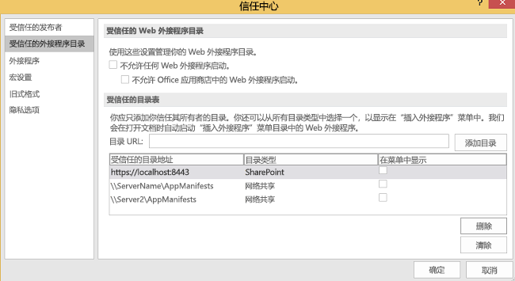
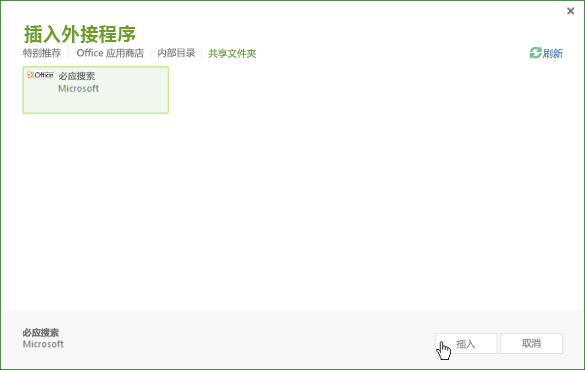
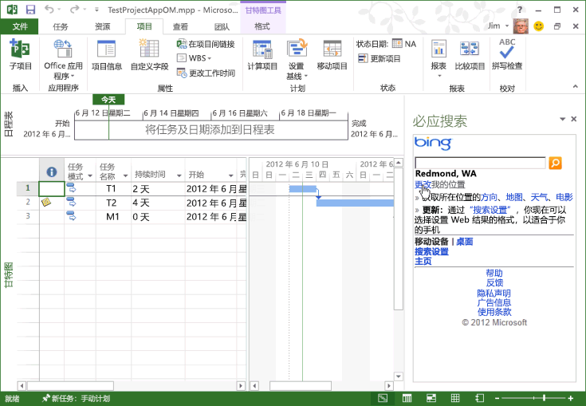

# <a name="task-pane-add-ins-for-project"></a>Project 任务窗格加载项

Project Standard 2013 和 Project Professional 2013 (版本 15.1 或更高版本)都支持任务窗格加载项。你可以运行为 Word 或 Excel 开发的常规任务窗格加载项。还可以开发在 Project 中处理选择事件的自定义加载项，并将项目中的任务、资源、视图和其他单元格级别的数据与 SharePoint 列表、SharePoint 外接程序、Web 部件、Web 服务和企业应用程序相集成。

> [!NOTE]
> [Project 2013 SDK 下载](https://www.microsoft.com/download/details.aspx?id=30435%20)中的示例加载项展示了如何使用 Project 加载项对象模型，以及如何在 Project Server 2013 中使用 OData 报表数据服务。提取和安装 SDK 时，请查看 `\Samples\Apps\` 子目录。

有关 Office 加载项的简介，请参阅 [Office 加载项平台概述](../overview/office-add-ins.md)。

## <a name="add-in-scenarios-for-project"></a>用于 Project 的加载项方案

项目经理可以使用 Project 任务窗格加载项来帮助执行项目管理活动。不必离开 Project 并打开其他应用程序来搜索常用信息，项目经理可以直接在 Project 内访问信息。根据选定的任务、资源、视图或甘特图单元格中的其他数据、任务使用状况视图或资源使用状况视图，任务窗格加载项中的内容可以是上下文相关的。

> [!NOTE]
> 通过 Project Professional 2013，可以开发任务窗格加载项，Project Server 2013 本地安装、以及本地或在线 SharePoint 2013。Project Standard 2013 不支持与 Project Server 数据或与 Project Server 同步的 SharePoint 任务列表直接集成。

Project 加载项方案包括以下几种：

- **项目排定**???查看会影响排定的相关项目中的数据。在 Project Server 2013 中，任务窗格加载项可以集成来自其他项目的相关数据。例如，您可以查看项目和里程碑日期的部门集合，或查看基于选定的自定义字段的其他项目中的指定数据。

- **资源管理**???根据指定的技能查看 Project Server 2013 中的完整资源库或子集，包括成本数据和资源可用性，以帮助选择合适的资源。

- **状态和审批**???在任务窗格加载项中使用 Web 应用程序更新或查看外部企业资源规划 (ERP) 应用程序、时间表系统或会计应用程序中的数据。或者，创建在 Project Web App 和 Project Professional 2013 中均可使用的自定义状态审批 Web 部件。

- **团队通信**???从任务窗格加载项中在项目上下文中直接与团队成员和资源通信。或者，当您在项目中工作时，为自己轻松维护一组与上下文相关的注释。

- **工作包**???在 SharePoint 库和在线模板集合中搜索指定类型的项目模板。例如，查找用于构造项目的模板并将其添加到您的 Project 模板集合中。

- **相关项目**???查看与项目计划中的特定任务相关的元数据、文档和消息。例如，可以使用 Project Professional 2013 管理从 SharePoint 任务列表导入的项目，并且仍将该任务列表与项目中的更改同步。任务窗格加载项可以显示 Project 没有为 SharePoint 列表中的任务导入的其他字段或元数据。

- **使用 Project Server 对象模型**???将选定任务的 GUID 用于 Project Server Interface (PSI) 中的方法或 Project Server 的客户端对象模型 (CSOM)。例如，用于加载项的 Web 应用程序可以读取并更新选定任务和资源的状态数据，或与外部时间表应用程序集成。

- **获取报告数据**???使用表示状态传输 (REST)、JavaScript 或 LINQ 查询在 Project Web App 中用于报告表的 OData 服务中查找选定任务或资源的相关信息。使用 OData 服务的查询可以通过 Project Server 2013 的在线或本地安装来执行。

    例如，请参阅 [创建将 REST 与本地 Project Server OData 服务结合使用的 Project 外接程序](../project/create-a-project-add-in-that-uses-rest-with-an-on-premises-odata-service.md)。

## <a name="developing-project-add-ins"></a>开发 Project 加载项

用于 Project 加载项的 JavaScript 库包括 **Office** 命名空间别名的扩展，使开发人员可以访问 Project 应用程序的属性以及项目中的任务、资源和视图。Project-15.js 文件中的 JavaScript 库扩展用于用 Visual Studio 2015 创建的 Project 加载项中。Project 2013 SDK 下载中还提供了 Office.js、Office.debug.js、Project-15.js、Project-15.debug.js 和相关文件。

若要创建加载项，可以使用简单文本编辑器创建 HTML 网页和相关的 JavaScript 文件、CSS 文件及 REST 查询。除了 HTML 页面或 Web 应用程序外，加载项还需要一个用于配置的 XML 清单文件。Project 可以使用包括指定为 **TaskPaneExtension** 的 **type** 属性的清单文件。该清单文件可供多个 Office 2013 客户端应用程序使用，你也可以创建一个 Project 2013 专用的清单文件。有关详细信息，请参阅 [Office 加载项平台概述](../overview/office-add-ins.md)中的“_开发基础知识_”一节。

在安装 Project 2013 SDK 下载时，`\Samples\Apps\` 子目录包括以下示例加载项。

- **Bing 搜索：** BingSearch.XML 清单文件指向用于移动设备的 Bing 搜索页。由于 Bing Web 应用程序在 Internet 中已存在，因此 Bing 搜索加载项不使用其他源代码文件或 Project 加载项对象模型。

- **Project OM 测试：** JSOM_SimpleOMCalls.XML 清单文件和 JSOM_Call.html 文件一起构成了在 Project 2013 中测试对象模型和加载项功能的示例。HTML 文件引用 JSOM_Sample.js 文件，其中包含将 Office.js 文件和 Project-15.js 文件用于主要功能的 JavaScript 函数。SDK 下载包括所有必要的源代码文件和用于 Project OM 测试加载项的清单 XML 文件。 [使用文本编辑器创建 Project 2013 的第一个任务窗格加载项](../project/create-your-first-task-pane-add-in-for-project-by-using-a-text-editor.md)中介绍了 Project OM 测试示例的开发和安装。

- **HelloProject_OData：**??这是一个用于 Visual Studio 的 Visual Studio 2008 解决方案，它可以对活动项目中的数据（如成本、工作和完成百分比）进行归纳总结，并将其与存储活动项目的 Project Web App 实例中的所有已发布项目的平均值进行比较。 **创建将 REST 与本地 Project Server OData 服务结合使用的 Project 加载项** 中介绍了有关将 REST 协议与 Project Web App 中的  [ProjectData](../project/create-a-project-add-in-that-uses-rest-with-an-on-premises-odata-service.md) 服务结合使用的示例的开发、安装和测试。

### <a name="creating-an-add-in-manifest-file"></a>创建加载项清单文件

清单文件指定加载项网页或 Web 应用程序的 URL、加载项的类型（Project 任务窗格）、用于其他语言和区域设置的内容的可选 URL 以及其他属性。

### <a name="procedure-1-to-create-the-add-in-manifest-file-for-bing-search"></a>过程 1. 创建用于 Bing 搜索的加载项清单文件

- 在本地目录中创建一个 XML 文件。该 XML 文件包括 **OfficeApp** 元素和子元素，[Office 加载项 XML 清单](../develop/add-in-manifests.md)中对其进行了介绍。例如，创建一个名为 BingSearch.xml 的文件，其中包含以下 XML。

    ```XML
    <?xml version="1.0" encoding="utf-8"?>
    <OfficeApp xmlns="http://schemas.microsoft.com/office/appforoffice/1.0"
               xmlns:xsi="http://www.w3.org/2001/XMLSchema-instance"
               xsi:type="TaskPaneApp">
      <!--IMPORTANT! Id must be unique for each add-in. If you copy this manifest ensure that you change this id to your own GUID. -->
      <Id>01234567-89ab-cedf-0123-456789abcdef</Id>
      <Version>15.0</Version>
      <ProviderName>Microsoft</ProviderName>
      <DefaultLocale>en-us</DefaultLocale>
      <DisplayName DefaultValue="Bing Search">
      </DisplayName>
      <Description DefaultValue="Search selected data on Bing">
      </Description>
      <IconUrl DefaultValue="http://officeimg.vo.msecnd.net/_layouts/images/general/office_logo.jpg">
      </IconUrl>
      <SupportUrl DefaultValue="[Insert the URL of a page that provides support information for the app]" />
      <Capabilities>
        <Capability Name="Project"/>
      </Capabilities>
      <DefaultSettings>
        <SourceLocation DefaultValue="http://m.bing.com">
        </SourceLocation>
      </DefaultSettings>
      <Permissions>ReadWriteDocument</Permissions>
    </OfficeApp>
    ```

- 下面是加载项清单中的必需元素。
  - 在 **OfficeApp** 元素中，`xsi:type="TaskPaneApp"` 属性指定该加载项属于任务窗格类型。
  - **Id** 元素是 UUID，并且必须唯一。
  - **Version** 元素是加载项的版本。**ProviderName** 元素是提供加载项的公司或开发人员的名称。**DefaultLocale** 元素指定清单中字符串的默认区域设置。
  - **DisplayName** 元素是在 Project 2013 的功能区中的“**视图**”选项卡的“**任务窗格加载项**”下拉列表中显示的名称。该值最多可以包含 32 个字符。
  - **Description** 元素包含加载项默认区域设置说明。该值最多可以包含 2000 个字符。
  - **Capabilities** 元素包含一个或多个指定 Office 应用程序的 **Capability** 子元素。
  - **DefaultSettings** 元素包括 **SourceLocation** 元素，后者指定 HTML 文件在文件共享中的路径或加载项使用的网页的 URL。任务窗格加载项将忽略 **RequestedHeight** 元素和 **RequestedWidth** 元素。
  - **IconUrl** 元素为可选元素。它可为文件共享中的图标或 Web 应用程序中图标的 URL。

- （可选）添加具有其他区域设置的值的 **Override** 元素。例如，以下清单为 **DisplayName**、**Description**、**IconUrl** 和 **SourceLocation** 的法语值提供 **Override** 元素。

    ```XML
    <?xml version="1.0" encoding="utf-8"?>
    <OfficeApp xmlns="http://schemas.microsoft.com/office/appforoffice/1.0"
                xmlns:xsi="https://www.w3.org/2001/XMLSchema-instance"
              xsi:type="TaskPaneApp">
      <!--IMPORTANT! Id must be unique for each add-in. If you copy this manifest ensure that you change this id to your own GUID. -->
      <Id>01234567-89ab-cedf-0123-456789abcdef</Id>
      <Version>15.0</Version>
      <ProviderName>Microsoft</ProviderName>
      <DefaultLocale>en-us</DefaultLocale>
      <DisplayName DefaultValue="Bing Search">
        <Override Locale="fr-fr" Value="Bing Search"/>
      </DisplayName>
      <Description DefaultValue="Search selected data on Bing">
        <Override Locale="fr-fr" Value="Search selected data on Bing"></Override>
      </Description>
      <IconUrl DefaultValue="http://officeimg.vo.msecnd.net/_layouts/images/general/office_logo.jpg">
        <Override Locale="fr-fr" Value="http://officeimg.vo.msecnd.net/_layouts/images/general/office_logo.jpg"/>
      </IconUrl>
      <SupportUrl DefaultValue="[Insert the URL of a page that provides support information for the app]" />
      <Capabilities>
        <Capability Name="Project"/>
      </Capabilities>
      <DefaultSettings>
        <SourceLocation DefaultValue="http://m.bing.com">
          <Override Locale="fr-fr" Value="http://m.bing.com"/>
        </SourceLocation>
      </DefaultSettings>
      <Permissions>ReadWriteDocument</Permissions>
    </OfficeApp>
    ```

## <a name="installing-project-add-ins"></a>安装 Project 加载项

在 Project 2013 中，可以将加载项安装为文件共享或专用加载项目录中的独立解决方案。还可以在 AppSource 中评论和购买加载项。

在文件共享中可以有多个加载项清单 XML 文件和子目录。可以通过使用 Project 2013 中的“**信任中心**“对话框中“**受信任的加载项目录**”选项卡来添加或删除清单目录位置和目录。若要显示 Project 中的加载项，清单中的 **SourceLocation** 元素必须指向现有网站或 HTML 源文件。

> [!NOTE]
> 如果要在 Windows 计算机上开发，则必须安装 Internet Explorer 或 Microsoft Edge。 有关详细信息，请参阅 [Office 加载项使用的浏览器](../concepts/browsers-used-by-office-web-add-ins.md)。

在过程 2 中，在安装 Project 2013 的本地计算机上安装 Bing 搜索加载项。但是，由于加载项基础架构不直接使用本地文件路径，如  `C:\Project\AppManifests`，因此您可以在本地计算机上创建网络共享。如果您喜欢，可以在远程计算机上创建文件共享。

### <a name="procedure-2-to-install-the-bing-search-add-in"></a>过程 2. 安装 Bing 搜索加载项

1. 为加载项清单创建本地目录。例如，创建  `C:\Project\AppManifests` 目录。

2. 将  `C:\Project\AppManifests` 目录共享为AppManifests，这样文件共享的网络路径就变为  `\\ServerName\AppManifests`。

3. 将 BingSearch.XML 清单文件复制到  `C:\Project\AppManifests` 目录。

4. 在 Project 2013 中，打开“**Project 选项**”对话框，选择“**信任中心**”，然后选择“**信任中心设置**”。

5. 在“**信任中心**”对话框的左侧窗格中，选择“**受信任的加载项目录**”。

6. 在“**受信任的加载项目录**”窗格（请参阅图 1）中的“**目录 URL**”文本框中添加 `\\ServerName\AppManifests` 路径，选择“**添加目录**”，然后选择“**确定**”。

    > [!NOTE]
    > 图 1 展示了“**受信任的目录地址**”列表中的两个文件共享和一个虚构的专用目录 URL。只有一个文件共享可以成为默认文件共享，并且只有一个目录 URL 可以成为默认目录。例如，如果将 `\\Server2\AppManifests` 设置为默认，Project 就会清除 `\\ServerName\AppManifests` 的“**默认**”复选框。如果更改默认选择，可以选择“**清除**”删除已安装的加载项，再重启 Project。如果在 Project 处于打开状态时，将加载项添加到默认文件共享或 SharePoint 目录，应重启 Project。

    *图 1：使用信任中心添加加载项清单目录*

    

7. 在“Project”功能区上，选择“Office 加载项”下拉菜单，然后选择“查看全部”。在“插入加载项”对话框中，选择“共享文件夹”（请参阅图 2）。

    *图 2：启动文件共享上的加载项*

    

8. 选择 Bing 搜索加载项，然后选择“插入”。

    Bing 搜索加载项显示在任务窗格中，如图 3 所示。可以手动调整任务窗格的大小，并使用 Bing 搜索加载项。

    *图 3：使用“必应搜索”加载项*

    

## <a name="distributing-project-add-ins"></a>分发 Project 加载项

可通过文件共享、SharePoint 库中的应用目录或 AppSource 分发加载项。有关详细信息，请参阅[发布 Office 加载项](../publish/publish.md)。

## <a name="see-also"></a>另请参阅

- [Office 加载项平台概述](../overview/office-add-ins.md)
- [了解 Microsoft 365 开发人员计划](https://developer.microsoft.com/microsoft-365/dev-program)
- [开发 Office 加载项](../develop/develop-overview.md)
- [使用文本编辑器创建首个 Project 2013 任务窗格加载项](create-your-first-task-pane-add-in-for-project-by-using-a-text-editor.md)
- [创建将 REST 与本地 Project Server OData 服务结合使用的 Project 加载项](create-a-project-add-in-that-uses-rest-with-an-on-premises-odata-service.md)
- [Project 2013 SDK 下载](https://www.microsoft.com/download/details.aspx?id=30435%20)
