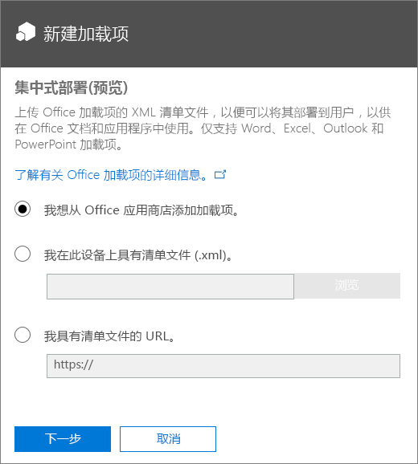
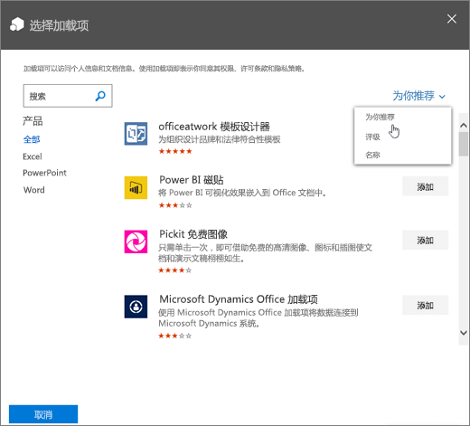
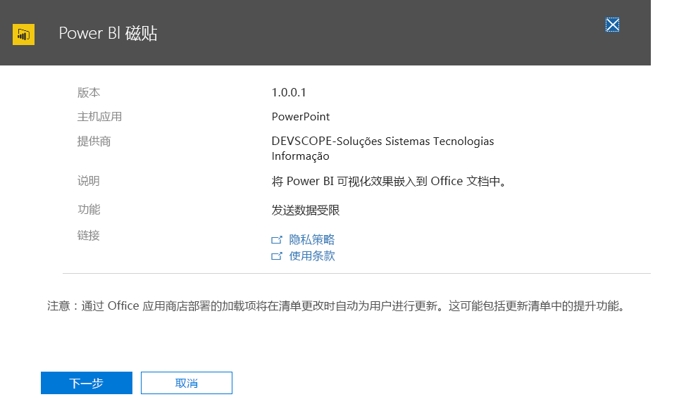
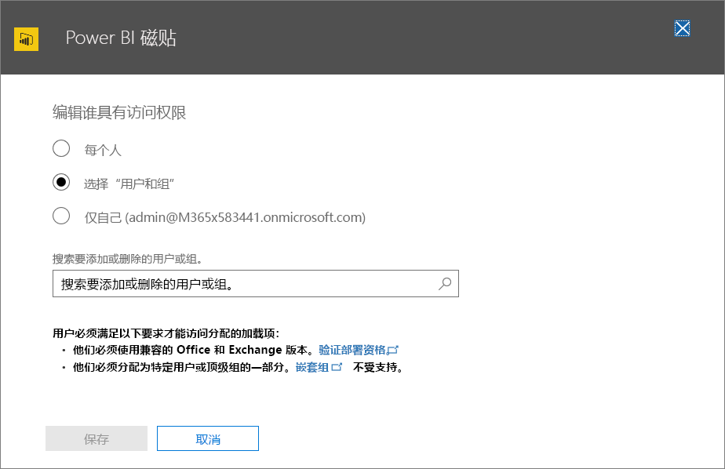
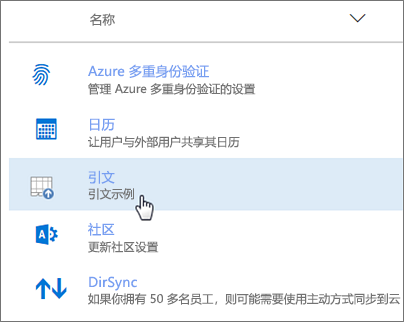
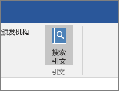
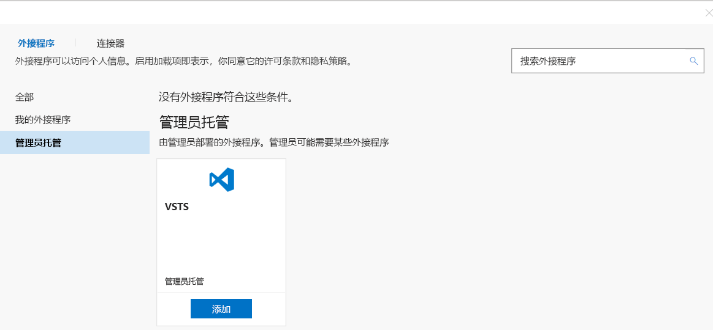

# 通过 Office 365 管理中心进行集中部署来发布 Office 加载项

通过 Office 365 管理中心，管理员可以轻松地为组织内的用户和组部署 Office 加载项。通过管理中心部署加载项后，用户可立即在其 Office 应用程序中使用此加载项，而无需进行客户端配置。可以通过集中部署来部署内部加载项以及 ISV 提供的加载项。

Office 365 管理中心当前支持以下方案：

- 为个人、组或组织集中部署新的和更新的加载项。
- 可以部署到多个平台，其中包括 Windows 和 Office Online，即将推出对 Mac 的支持。
- 到英语语言租户和全球范围租户的部署。
- 部署云托管的加载项。
- 部署托管在防火墙内的加载项。
- 部署 AppSource 加载项。
- 当用户启动 Office 应用时自动为用户安装加载项。
- 当管理员禁用或删除加载项，或者将用户从 Azure Active Directory 或从已部署加载项的组中删除时，则自动为用户删除该加载项。

如果组织满足使用集中部署的所有要求，则建议 Office 365 管理员通过集中部署在组织内部署 Office 加载项。 有关如何确定组织是否可以使用集中部署的信息，请参阅[确定加载项集中部署是否适用于你的 Office 365 组织](https://support.office.com/en-us/article/Determine-if-Centralized-Deployment-of-add-ins-works-for-your-Office-365-organization-B4527D49-4073-4B43-8274-31B7A3166F92)。

> [!NOTE]
> 在没有连接到 Office 365 的本地环境中，或若要部署 SharePoint 加载项或定目标到 Office 2013 的 Office 加载项，请使用 [SharePoint 加载项目录](publish-task-pane-and-content-add-ins-to-an-add-in-catalog.md)。 若要部署 COM/VSTO 加载项，请使用 ClickOnce 或 Windows Installer，如[部署 Office 解决方案](https://msdn.microsoft.com/en-us/library/bb386179.aspx)中所述。

## 部署 Office 加载项的推荐方法

请考虑分阶段部署 Office 加载项，以确保部署顺利进行。建议使用以下计划：

1. 为一小部分的企业利益干系人和 IT 部门成员部署加载项。 如果部署成功，则转到步骤 2。

2. 为企业内更多的将使用加载项的个人部署加载项。 如果部署成功，则转到步骤 3。

3. 为所有将使用加载项的个人部署加载项。

根据目标受众的规模，可能需要在此过程中添加步骤或删除步骤。

## 通过集中部署发布 Office 加载项

在开始之前，请按照[确定加载项集中部署是否适用于你的 Office 365 组织](https://support.office.com/en-us/article/Determine-if-Centralized-Deployment-of-add-ins-works-for-your-Office-365-organization-B4527D49-4073-4B43-8274-31B7A3166F92)中所述确认组织是否满足使用集中部署的所有要求。

如果组织满足所有要求，请完成以下步骤以通过集中部署发布 Office 加载项：

1. 使用工作或学校帐户登录 Office 365。
2. 选择左上角的应用启动器图标，然后选择“管理”****。
3. 在导航菜单中，选择“设置”**** > “服务和加载项”****。
4. 如果在页面顶部看到公布新的 Office 365 管理中心的消息，请选择该消息以转至“管理中心预览版”（请参阅[关于 Office 365 管理中心](https://support.office.com/en-ie/article/About-the-Office-365-admin-center-758befc4-0888-4009-9f14-0d147402fd23)）。
5. 在页面顶部选择“上传加载项”****。 
6. 在“集中部署”**** 页面上，选择以下选项之一：

    - **我想从 AppSource 添加加载项。**
    - **我在此设备上有清单文件(.xml)。** 对于此选项，请选择“浏览”**** 以找到想要使用的清单文件 (.xml)。
    - **我具有清单文件的 URL。** 对于此选项，请在提供的字段中键入清单的 URL。

    

7.  选择“下一步”****。

8.  如果选择了从 AppSource 添加加载项的选项，请选择相应的加载项。 请注意，可以通过“为你推荐”****、“评级”**** 或“名称”**** 类别，查看可选择的加载项。 只能从 AppSource 添加免费加载项；暂不支持添加付费加载项。

    > [!NOTE]
    > 使用 AppSource 选项，无需干预，即会自动向用户提供加载项的更新程序和增强功能。

    

9. 加载项现在可用于分配。 |||UNTRANSLATED_CONTENT_START|||On the page for the add-in, its status is **On**, like that shown for the Power BI Tiles add-in in the screenshot below.|||UNTRANSLATED_CONTENT_END||| 在“有权访问的人员”**** 部分中，选择“编辑”**** 可将该加载项分配给用户和/或组。

    

10. 在 **“编辑有权访问的人员”页面**上，选择“每个人”**** 或“特定用户/组”****。 使用“搜索”框查找想要为其部署加载项的用户和/或组。

    

    > [!NOTE]
    > 对于单一登录 (SSO) 加载项，分配的用户和组也会与共用同一 Azure 应用 ID 的加载项进行共享。 对用户分配进行的任何更改也会应用于这些加载项。相关加载项将显示在此页面上。 仅对于 SSO 加载项，此页面将显示该加载项所需的 Microsoft Graph 权限的列表。

11. 完成后，选择“保存”****，查看加载项设置，然后选择“关闭”****。 现在，可以看到此加载项与其他应用一起显示在 Office 365 中。

    > [!NOTE]
    >  管理员选择“保存”**** 后，即表示向所有用户授予许可。 

    

> [!TIP]
> 为组织中的用户和/或组部署新加载项时，请考虑向他们发送一封电子邮件，说明加载项的应用场景和使用方式，并添加相关帮助内容、FAQ 或其他支持资源的链接。

## 授予加载项的访问权限时的注意事项

管理员可以将加载项分配给组织中的每个人或组织内的特定用户和/或组。 以下列表描述了每个选项的含义：

- **每个人**：顾名思义，该选项会将加载项分配给租户中的每个用户。 请慎用此选项，只可将此选项用于可在组织内通用的加载项。

- **用户**：如果将加载项分配给单个用户，则每次要将其分配给其他用户时，都需要更新此加载项的集中部署设置。 同样，每次要删除某个用户对该加载项的访问权限时，都需要更新该加载项的集中部署设置。

- **组**：如果将加载项分配给组，则会自动为被添加到此组的用户分配此加载项。 同样，当将某个用户从组中删除时，此用户将自动失去对此加载项的访问权限。 在上述任一情况下，均无需从 Office 365 管理处执行任何额外操作。

一般情况下，为了便于维护，我们建议尽可能使用组来分配加载项。 但是，在想要将加载项的访问权限限制在极少数用户的情况下，将加载项分配给特定用户的做法可能更为实用。 

## 加载项状态

下表介绍了加载项的不同状态。

|状态|此状态如何出现|影响|
|-----|--------------------|------|
|**活动**|管理员已上传加载项并已将其分配给用户和/或组。|已为其分配加载项的用户和/或组，可在相关的 Office 客户端中找到它。|
|**已禁用**|管理员已禁用加载项。|已为其分配加载项的用户和/或组不再能够访问它。 如果加载项状态从“已禁用”**** 更改为“活动”****，则用户和组将重新获得对它的访问权限。|
|**已删除**|管理员已删除加载项。|已为其分配加载项的用户和/或组不再能够访问它。|

## 更新通过集中部署发布的 Office 加载项

如果通过集中部署发布 Office 加载项，则在该加载项的 Web 应用程序中实现对该 Web 应用程序所做的更改后，将自动向所有用户提供相应的更改。 对加载项的 [XML 清单文件](../develop/add-in-manifests.md)所做的更改（例如，更新加载项的图标、文本或加载项命令）以以下方式实现：

- **业务线加载项**：如果管理员在通过 Office 365 管理中心实施集中部署时显式上传了清单文件，则管理员必须上传包含所需更改的新清单文件。 上传更新后的清单文件后，加载项就会在下次相关 Office 应用启动时更新。

- **AppSource 加载项**：如果管理员在通过 Office 365 管理中心实现集中部署时选择了 AppSource 中的加载项，并且 AppSource 中的加载项有更新，那么加载项稍后会通过集中部署进行更新。加载项会在下次相关 Office 应用程序启动时更新。

## 加载项最终用户体验

通过集中部署发布加载项后，最终用户可以在加载项支持的任何平台上开始使用它。 

如果外接程序支持外接程序命令，则这些命令将出现在为其部署外接程序的所有用户的 Office 应用程序功能区上。 在以下的示例中，**搜索引文**命令将显示在**引文**加载项的功能区上。 

如果加载项不支持加载项命令，用户可以通过执行以下操作将其添加到 Office 应用程序中：

1.  在 Word 2016、Excel 2016 或 PowerPoint 2016 中，选择“插入”**** > “我的加载项”****。
2.  在外接程序窗口中选择“管理托管”**** 选项卡。
3.  选择加载项，然后选择“添加”****。 

    
    
但是，对于 Outlook，用户可以执行以下操作：

1.  在 Outlook 2016 中，选择 **主页** > **商店**。
2.  选择加载项选项卡下的**管理托管**项目。
3.  |||UNTRANSLATED_CONTENT_START|||Choose the add-in, and then choose **Add**.|||UNTRANSLATED_CONTENT_END|||

    

## 另请参阅
[确定加载项的集中式部署是否适用于你的 Office 365 组织](https://support.office.com/en-us/article/Determine-if-Centralized-Deployment-of-add-ins-works-for-your-Office-365-organization-b4527d49-4073-4b43-8274-31b7a3166f92)
    
