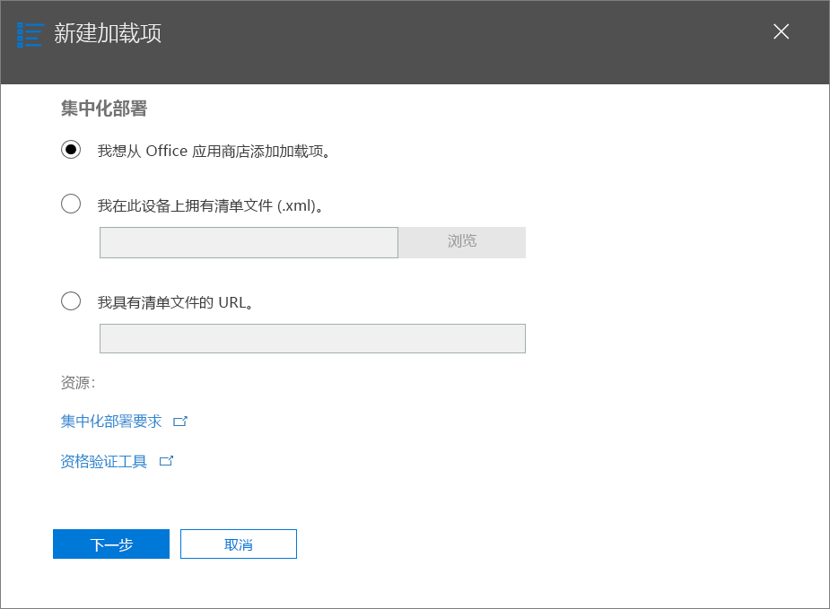

# 通过 Office 365 管理中心进行集中部署来发布 Office 加载项Publish Office Add-ins using Centralized Deployment via the Office 365 admin center

通过 Office 365 管理中心，管理员可以轻松地为组织内的用户和组部署 Office 加载项。通过管理中心部署加载项后，用户可立即在其 Office 应用程序中使用此加载项，而无需进行客户端配置。可以通过集中部署来部署内部加载项以及 ISV 提供的加载项。The Office 365 admin center makes it easy for an administrator to deploy Office Add-ins to users and groups within their organization. Add-ins deployed via the admin center are available to users in their Office applications right away, with no client configuration required. You can use Centralized Deployment to deploy internal add-ins as well as add-ins provided by ISVs.

Office 365 管理中心当前支持以下方案：The Office 365 admin center currently supports the following scenarios:

- 为个人、组或组织集中部署新的和更新的加载项。Centralized Deployment of new and updated add-ins to individuals, groups, or an organization.
- 可以部署到多个平台，其中包括 Windows 和 Office Online，即将推出对 Mac 的支持。Deployment to multiple platforms, including Windows and Office Online, with Mac coming soon.
- 到英语语言租户和全球范围租户的部署。Deployment to English language and worldwide tenants.
- 部署云托管的加载项。Deployment of cloud-hosted add-ins.
- 部署托管在防火墙内的加载项。Deployment of add-ins that are hosted within a firewall.
- 部署 AppSource 加载项。Deployment of AppSource add-ins.
- 当用户启动 Office 应用时自动为用户安装加载项。Automatic installation of an add-in for users when they launch the Office application.
- 当管理员禁用或删除加载项，或者将用户从 Azure Active Directory 或从已部署加载项的组中删除时，则自动为用户删除该加载项。Automatic removal of an add-in for users if the admin turns off or deletes the add-in, or if users are removed from Azure Active Directory or from a group to which the add-in has been deployed.

集中部署是 office 365 管理员在组织中部署 office 外接程序的推荐方法，只要该组织满足使用集中部署的所有要求。有关如何确定您的组织可以使用集中部署的信息，请参阅 [Determine 如果加载项的集中部署适用于 Office 365 组织](https://support.office.com/article/Determine-if-Centralized-Deployment-of-add-ins-works-for-your-Office-365-organization-B4527D49-4073-4B43-8274-31B7A3166F92)。Centralized Deployment is the recommended way for an Office 365 admin to deploy Office add-ins within an organization, provided that the organization meets all requirements for using Centralized Deployment. For information about how to determine if your organization can use Centralized Deployment, see [Determine if Centralized Deployment of add-ins works for your Office 365 organization](https://support.office.com/article/Determine-if-Centralized-Deployment-of-add-ins-works-for-your-Office-365-organization-B4527D49-4073-4B43-8274-31B7A3166F92).

> [!NOTE]
> 在没有连接到 Office 365 的本地环境中，或若要部署 SharePoint 加载项或定目标到 Office 2013 的 Office 加载项，请使用 [SharePoint 加载项目录](publish-task-pane-and-content-add-ins-to-an-add-in-catalog.md)。In an on-premises environment with no connection to Office 365, or to deploy SharePoint add-ins or Office Add-ins that target Office 2013, use a [SharePoint add-in catalog](publish-task-pane-and-content-add-ins-to-an-add-in-catalog.md). 若要部署 COM/VSTO 加载项，请使用 ClickOnce 或 Windows Installer，如[部署 Office 解决方案](https://docs.microsoft.com/visualstudio/vsto/deploying-an-office-solution)中所述。To deploy COM/VSTO add-ins, use ClickOnce or Windows Installer, as described in [Deploying an Office solution](https://docs.microsoft.com/visualstudio/vsto/deploying-an-office-solution).

## 部署 Office 加载项的推荐方法Recommended approach for deploying Office Add-ins

请考虑分阶段部署 Office 加载项，以确保部署顺利进行。建议使用以下计划：Consider deploying Office Add-ins in a phased approach to help ensure that the deployment goes smoothly. We recommend the following plan:

1. 为一小部分的企业利益干系人和 IT 部门成员部署加载项。Deploy the add-in to a small set of business stakeholders and members of the IT department. 如果部署成功，则转到步骤 2。If the deployment is successful, move on to step 2.

2. 为企业内更多的将使用加载项的个人部署加载项。Deploy the add-in to a larger set of individuals within the business who will be using the add-in. 如果部署成功，则转到步骤 3。If the deployment is successful, move on to step 3.

3. 为所有将使用加载项的个人部署加载项。Deploy the add-in to the full set of individuals who will be using the add-in.

根据目标受众的规模，可能需要在此过程中添加步骤或删除步骤。Depending on the size of the target audience, you may want to add steps to or remove steps from this procedure.

## 通过集中部署发布 Office 加载项Publish an Office Add-in via Centralized Deployment

在开始之前，请按照[确定加载项集中部署是否适用于你的 Office 365 组织](https://support.office.com/article/Determine-if-Centralized-Deployment-of-add-ins-works-for-your-Office-365-organization-B4527D49-4073-4B43-8274-31B7A3166F92)中所述确认组织是否满足使用集中部署的所有要求。Before you begin, confirm that your organization meets all requirements for using Centralized Deployment, as described in [Determine if Centralized Deployment of add-ins works for your Office 365 organization](https://support.office.com/article/Determine-if-Centralized-Deployment-of-add-ins-works-for-your-Office-365-organization-B4527D49-4073-4B43-8274-31B7A3166F92).

如果组织满足所有要求，请完成以下步骤以通过集中部署发布 Office 加载项：If your organization meets all requirements, complete the following steps to publish an Office Add-in via Centralized Deployment:

1. 使用工作或学校帐户登录 Office 365。Sign in to Office 365 with your work or school account.
2. 选择左上角的应用启动器图标，然后选择“管理”\*\*\*\*。Select the app launcher icon in the upper-left and choose **Admin**.
3. 在导航菜单中，选择“设置”\*\*\*\* > “服务和加载项”\*\*\*\*。In the navigation menu, choose **Settings** > **Services & add-ins**.
4. 如果在页面顶部看到公布新的 Office 365 管理中心的消息，请选择该消息以转至“管理中心预览版”（请参阅[关于 Office 365 管理中心](https://support.office.com/en-ie/article/About-the-Office-365-admin-center-758befc4-0888-4009-9f14-0d147402fd23)）。If you see a message on the top of the page announcing the new Office 365 admin center, choose the message to go to the Admin Center Preview (see [About the Office 365 admin center](https://support.office.com/en-ie/article/About-the-Office-365-admin-center-758befc4-0888-4009-9f14-0d147402fd23)).
5. 在页面顶部选择“上传加载项”\*\*\*\*。Choose **Upload Add-in** at the top of the page. 
6. 在“集中部署”\*\*\*\* 页面上，选择以下选项之一：Choose one of the following options on the **Centralized Deployment** page:

    - **我想从 AppSource 添加加载项。****I want to add an Add-in from AppSource.**
    - **我在此设备上有清单文件(.xml)。****I have the manifest file (.xml) on this device.** 对于此选项，请选择“浏览”\*\*\*\* 以找到想要使用的清单文件 (.xml)。For this option, choose **Browse** to locate the manifest file (.xml) that you want to use.
    - **我具有清单文件的 URL。****I have a URL for the manifest file.** 对于此选项，请在提供的字段中键入清单的 URL。For this option, type the manifest's URL in the field provided.

    

7.  选择“下一步”\*\*\*\*。Choose **Next**.

8.  如果选择了从 AppSource 添加外接宏的选项，请选择该加载项。请注意，您可以通过**建议为您**、**分级**或 **名称**类别查看可用外接程序。您只能从 AppSource 添加免费外接程序，当前不支持添加付费外接程序。If you selected the option to add an Add-in from AppSource, select the add-in. Notice that you can view available add-ins via categories of **Suggested for you**, **Rating**, or **Name**. You may only add free add-ins from AppSource; adding paid add-ins isn't currently supported.

    > [!NOTE]
    > 使用 AppSource 选项，无需干预，即会自动向用户提供加载项的更新程序和增强功能。With the AppSource option, updates and enhancements to the add-in will automatically be made available to users without your intervention.

    

9. 加载项现在可用于分配。The add-in is now available for assignment. 在该加载项的页面上，其状态是“已启用”\*\*\*\*，与以下屏幕截图中 Power BI 磁贴加载项页面所示的内容相似。On the page for the add-in, its status is **On**, like that shown for the Power BI Tiles add-in in the screenshot below. 在“有权访问的人员”\*\*\*\* 部分中，选择“编辑”\*\*\*\* 可将该加载项分配给用户和/或组。In the **Who has access** section, choose **Edit** to assign the add-in to users and/or groups.

    

10. 在 **“编辑有权访问的人员”页面**上，选择“每个人”\*\*\*\* 或“特定用户/组”\*\*\*\*。On the **Edit who has access page**, choose either **Everyone** or **Specific Users/Groups**. 使用“搜索”框查找想要为其部署加载项的用户和/或组。Use the Search box to find the users and/or groups to whom you want to deploy the add-in.

    

    > [!NOTE]
    > 对于单一登录 (SSO) 加载项，分配的用户和组也会与共用同一 Azure 应用 ID 的加载项进行共享。For single sign-on (SSO) add-ins, the users and groups assigned will also be shared with add-ins that share the same Azure App ID. 对用户分配进行的任何更改也会应用于这些加载项。相关加载项将显示在此页面上。Any changes to user assignments will also apply to those add-ins. The related add-ins will be shown on this page. 仅对于 SSO 加载项，此页面将显示该加载项所需的 Microsoft Graph 权限的列表。For SSO add-ins only, this page will display the list of Microsoft Graph permissions that the add-in requires.

11. 完成后，选择“保存”\*\*\*\*，查看加载项设置，然后选择“关闭”\*\*\*\*。When finished, choose **Save**, review the add-in settings, and then choose **Close**. 现在，可以看到此加载项与其他应用一起显示在 Office 365 中。You now see your add-in along with other apps in Office 365.

    > [!NOTE]
    >  管理员选择“保存”\*\*\*\* 后，即表示向所有用户授予许可。When an administrator chooses **Save**, consent is given for all users. 

    

> [!TIP]
> 为组织中的用户和/或组部署新加载项时，请考虑向他们发送一封电子邮件，说明加载项的应用场景和使用方式，并添加相关帮助内容、FAQ 或其他支持资源的链接。When you deploy a new add-in to users and/or groups in your organization, consider sending them an email that describes when and how to use the add-in, and includes links to relevant Help content, FAQs, or other support resources.

## 授予加载项的访问权限时的注意事项Considerations when granting access to an add-in

管理员可以将加载项分配给组织中的每个人或组织内的特定用户和/或组。Admins can assign an add-in to everyone in the organization or to specific users and/or groups within the organization. 以下列表描述了每个选项的含义：The following list describes the implications of each option:

- **每个人**：顾名思义，该选项会将加载项分配给租户中的每个用户。**Everyone**: As the name implies, this option assigns the add-in to every user in the tenant. 请慎用此选项，只可将此选项用于可在组织内通用的加载项。Use this option sparingly and only for add-ins that are truly universal to your organization.

- **用户**：如果将加载项分配给单个用户，则每次要将其分配给其他用户时，都需要更新此加载项的集中部署设置。**Users**: If you assign an add-in to individual users, you'll need to update the Central Deployment settings for the add-in each time you want to assign it additional users. 同样，每次要删除某个用户对该加载项的访问权限时，都需要更新该加载项的集中部署设置。Likewise, you'll need to update the Central Deployment settings for the add-in each time you want to remove a user's access to the add-in.

- **组**：如果将加载项分配给组，则会自动为被添加到此组的用户分配此加载项。**Groups**: If you assign an add-in to a group, users who are added to the group will automatically be assigned the add-in. 同样，当将某个用户从组中删除时，此用户将自动失去对此加载项的访问权限。Likewise, when a user is removed from a group, the user automatically loses access to the add-in. 在上述任一情况下，均无需从 Office 365 管理处执行任何额外操作。In either case, no additional action is required from the Office 365 admin.

一般情况下，为了便于维护，我们建议尽可能使用组来分配加载项。In general, for ease of maintenance, we recommend assigning add-ins by using groups whenever possible. 但是，在想要将加载项的访问权限限制在极少数用户的情况下，将加载项分配给特定用户的做法可能更为实用。However, in situations where you want to restrict add-in access to a very small number of users, it may be more practical to assign the add-in to specific users. 

## 加载项状态Add-in states

下表介绍了加载项的不同状态。The following table describes the different states of an add-in.

|状态State|此状态如何出现How the state occurs|影响Impact|
|-----|--------------------|------|
|**活动****Active**|管理员已上传加载项并已将其分配给用户和/或组。Admin uploaded the add-in and assigned it to users and/or groups.|已为其分配加载项的用户和/或组，可在相关的 Office 客户端中找到它。Users and/or groups assigned to the add-in see it in the relevant Office clients.|
|**已禁用****Turned off**|管理员已禁用加载项。Admin turned off the add-in.|已为其分配加载项的用户和/或组不再能够访问它。Users and/or groups assigned to the add-in no longer have access to it. 如果加载项状态从“已禁用”\*\*\*\* 更改为“活动”\*\*\*\*，则用户和组将重新获得对它的访问权限。If the add-in state is changed from **Turned off** to **Active**, the users and groups will regain access to it.|
|**已删除****Deleted**|管理员已删除加载项。Admin deleted the add-in.|已为其分配加载项的用户和/或组不再能够访问它。Users and/or groups assigned the add-in no longer have access to it.|

## 更新通过集中部署发布的 Office 加载项Updating Office Add-ins that are published via Centralized Deployment

如果通过集中部署发布 Office 加载项，则在该加载项的 Web 应用程序中实现对该 Web 应用程序所做的更改后，将自动向所有用户提供相应的更改。After an Office Add-in has been published via Centralized Deployment, any changes made to the add-in's web application will automatically be available to all users as soon as those changes are implemented in the web application. 对加载项的 [XML 清单文件](../develop/add-in-manifests.md)所做的更改（例如，更新加载项的图标、文本或加载项命令）以以下方式实现：Changes made to an add-in's [XML manifest file](../develop/add-in-manifests.md), for example, to update the add-in's icon, text, or add-in commands, happen as follows:

- **业务线加载项**：如果管理员在通过 Office 365 管理中心实施集中部署时显式上传了清单文件，则管理员必须上传包含所需更改的新清单文件。**Line-of-business add-in**: If an admin explicitly uploaded a manifest file when implementing Centralized Deployment via the Office 365 admin center, the admin must upload a new manifest file that contains the desired changes. 上传更新后的清单文件后，加载项就会在下次相关 Office 应用启动时更新。After the updated manifest file has been uploaded, the next time the relevant Office applications start, the add-in will update.

- **AppSource 加载项**：如果管理员在通过 Office 365 管理中心实现集中部署时选择了 AppSource 中的加载项，并且 AppSource 中的加载项有更新，那么加载项稍后会通过集中部署进行更新。加载项会在下次相关 Office 应用程序启动时更新。**AppSource add-in**: If an admin selected an add-in from AppSource when implementing Centralized Deployment via the Office 365 admin center, and the add-in updates in AppSource, the add-in will update later via Centralized Deployment. The next time the relevant Office applications start, the add-in will update.

## 加载项最终用户体验End user experience with add-ins

通过集中部署发布加载项后，最终用户可以在加载项支持的任何平台上开始使用它。After an add-in has been published via Centralized Deployment, end users may start using it on any platform that the add-in supports. 

如果外接程序支持外接程序命令，则这些命令将出现在为其部署外接程序的所有用户的 Office 应用程序功能区上。If the add-in supports add-in commands, the commands will appear on the Office application ribbon for all users to whom the add-in is deployed. 在以下的示例中，**搜索引文**命令将显示在**引文**加载项的功能区上。In the following example, the command **Search Citation** appears in the ribbon for the **Citations** add-in. 

如果加载项不支持加载项命令，用户可以通过执行以下操作将其添加到 Office 应用程序中：If the add-in does not support add-in commands, users can add it to their Office application by doing the following:

1.  在 Word 2016 或更高版本，Excel 2016 或更高版本或 PowerPoint 2016 或更高版本，选择 **插入** > **我加载项**。In Word 2016 or later, Excel 2016 or later, or PowerPoint 2016 or later, choose **Insert** > **My Add-ins**.
2.  在外接程序窗口中选择“管理托管”\*\*\*\* 选项卡。Choose the **Admin Managed** tab in the add-in window.
3.  选择加载项，然后选择“添加”\*\*\*\*。Choose the add-in, and then choose **Add**. 

    
    
但是，对于 Outlook，用户可以执行以下操作：However, for Outlook, users can do the following:

1.  在 Outlook 2016 中，选择 **主页** > **商店**。In Outlook 2016, choose **Home** > **Store**.
2.  选择加载项选项卡下的**管理托管**项目。Choose the **Admin-managed** item under the add-in tab.
3.  |||UNTRANSLATED_CONTENT_START|||Choose the add-in, and then choose **Add**.|||UNTRANSLATED_CONTENT_END|||Choose the add-in, and then choose **Add**.

    

## 另请参阅See also

- [确定加载项的集中式部署是否适用于你的 Office 365 组织Determine if Centralized Deployment of add-ins works for your Office 365 organization](https://support.office.com/article/Determine-if-Centralized-Deployment-of-add-ins-works-for-your-Office-365-organization-b4527d49-4073-4b43-8274-31b7a3166f92)
    
